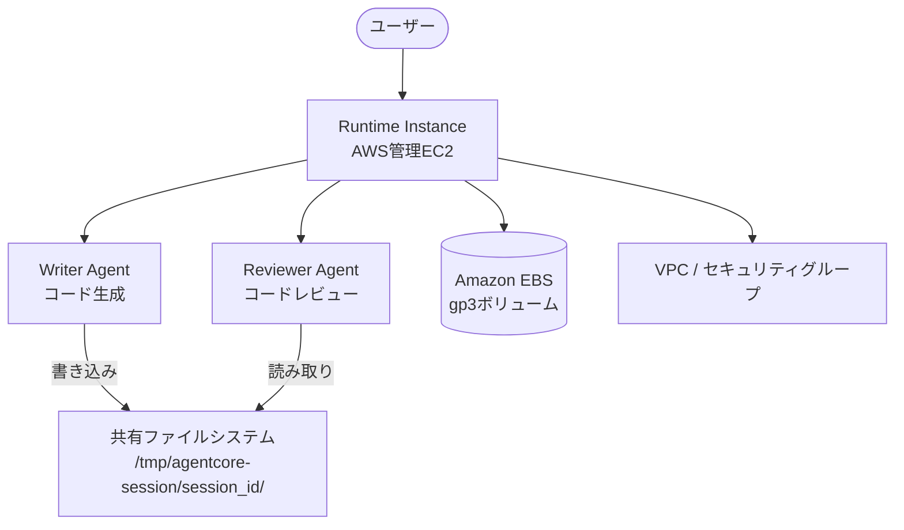

本記事は [Runtime instances: persistent compute for production AI agents on Amazon Bedrock AgentCore](https://aws.amazon.com/blogs/aws/runtime-instances-persistent-compute-for-production-ai-agents-on-amazon-bedrock-agentcore/) の解説記事です。

## ブログ概要

AWS公式ブログ（2026年8月6日公開、著者: Sebastien Stormacq）では、Amazon Bedrock AgentCoreの新しいコンピュート選択肢であるRuntime Instancesが紹介されています。Runtime Instancesは、既存のmicroVMベースのランタイムでは対応が難しかった「複数日にわたる連続実行」「マルチエージェント間のファイルシステム共有」「GPU加速」といった要件に応えるもので、AWS管理のEC2インスタンス上で最長14日間のセッション永続化を提供します。Strands Agentsフレームワークとの統合により、`@app.entrypoint`デコレータで定義したエージェントをzipファイルまたはコンテナイメージとしてデプロイできる構成です。

この記事は [Zenn記事: Bedrock AgentCore×Strands Agentsでヘルプデスクマルチエージェント基盤を構築する](https://zenn.dev/0h_n0/articles/b6fbcbbe118e75) の深掘りです。

## 情報源

- **種別**: 企業テックブログ（AWS公式ブログ）
- **タイトル**: Runtime instances: persistent compute for production AI agents on Amazon Bedrock AgentCore
- **著者**: Sebastien Stormacq
- **公開日**: 2026年8月6日
- **URL**: [https://aws.amazon.com/blogs/aws/runtime-instances-persistent-compute-for-production-ai-agents-on-amazon-bedrock-agentcore/](https://aws.amazon.com/blogs/aws/runtime-instances-persistent-compute-for-production-ai-agents-on-amazon-bedrock-agentcore/)

## 技術的背景

Amazon Bedrock AgentCoreは、AIエージェントの本番デプロイを支援するマネージドサービスです。従来のAgentCore RuntimeはmicroVMベースのサーバーレスアーキテクチャを採用しており、各呼び出しが独立したmicroVM上で実行されます。この方式はステートレスな単発タスク（質問応答、ドキュメント要約など）に適していますが、最大実行時間が8時間に制限されているため、以下のようなワークロードには対応できませんでした。

- **長時間ワークフロー**: 複数日にわたるデータ分析パイプライン、継続的なモニタリングエージェント
- **マルチエージェント協調**: 複数エージェントが同一ファイルシステム上で成果物を共有しながら段階的に処理を進めるワークフロー
- **GPU依存タスク**: ローカルでの推論実行、画像・動画処理、数値シミュレーション

Runtime Instancesは、これらの制約を解消するために導入された補完的なコンピュートオプションです。microVMを置き換えるものではなく、ワークロード特性に応じて使い分ける設計になっています。

## 実装アーキテクチャ

### microVMとRuntime Instancesの使い分け

AWS公式ブログでは、2つのコンピュートオプションを以下のように位置付けています。

| 特性 | microVM（既存） | Runtime Instances（新規） |
|:---|:---|:---|
| 実行モデル | サーバーレス（呼び出し単位） | 永続インスタンス（最長14日） |
| 最大実行時間 | 8時間 | 複数日（14日間セッション） |
| GPU対応 | なし | あり |
| マルチエージェント | 独立実行 | 共有ファイルシステム経由で協調 |
| OS直接アクセス | 制限あり | あり |
| コストモデル | 実行時間課金 | インスタンス稼働時間課金 |
| ユースケース | 単発タスク、短時間処理 | 長時間ワークフロー、マルチエージェント |

### マルチエージェント協調アーキテクチャ

Runtime Instancesの特徴的な機能は、単一ランタイム内で複数のエージェントをデプロイし、共有セッションを通じて協調動作させる仕組みです。



AWS公式ブログで紹介されているデモでは、Writer AgentとReviewer Agentの2つのエージェントが同一セッション内で動作します。Writer Agentがコードを生成して共有ディレクトリに書き込み、Reviewer Agentが同じセッションIDを使って当該ファイルを読み取りレビューを実行します。エージェント間でAPIコールは発生せず、ファイルシステムを介した直接的なデータ共有で完結する点が特徴です。

### セッション管理の仕組み

セッション永続化は `/tmp/agentcore-session/{session_id}/` パスで管理されます。セッションIDは自動生成され、同一IDを指定することで複数のエージェント呼び出しが同一コンテキストを共有します。

- **セッション永続化**: 最長14日間、EBSボリュームにデータが永続化される
- **停止・再開**: アイドル時にセッションを停止し、必要時に再開することでコストを削減可能
- **AgentCore Memory統合**: セッション間をまたぐ長期記憶はAgentCore Memoryを利用

### 技術仕様

AWS公式ブログで明示されている技術仕様は以下の通りです。

| 項目 | 仕様 |
|:---|:---|
| サポートOS | Linux（ARM64、x86_64） |
| 言語ランタイム | Python 3.11-3.14、ネイティブコード |
| デプロイ方式 | zipファイル（S3経由）、コンテナイメージ |
| インフラ | AWS管理EC2インスタンス |
| ストレージ | Amazon EBS gp3ボリューム |
| ネットワーク | VPC、サブネット、セキュリティグループ |
| アイデンティティ | IAMロール、インスタンスプロファイル |
| GPU | GPU加速インスタンスタイプ対応 |
| 利用可能リージョン | us-east-1, us-east-2, us-west-2, ap-south-1, ap-southeast-1, ap-southeast-2, ap-northeast-1, eu-central-1, eu-west-1 |

ブログのデモではインスタンスタイプとして `c7g.2xlarge`（8 vCPU、16 GiB メモリ、ARM64ベース）が使用されています。

## Production Deployment Guide

### AWS実装パターン（コスト最適化重視）

Runtime Instancesはマネージドサービスとして提供されるため、EC2インスタンスの管理はAWS側が行います。ここでは、Runtime Instancesを中心としたエージェントシステムの周辺インフラ構成を、トラフィック量別に整理します。

**コスト試算の注意事項**: 以下のコスト試算は2026年8月時点のAWS ap-northeast-1（東京）リージョン料金に基づく概算値です。実際のコストはトラフィックパターン、インスタンスタイプ、リージョン、バースト使用量により変動します。最新料金はAWS料金計算ツールで確認してください。

| 構成 | トラフィック | Runtime Instances構成 | 周辺サービス | 月額概算 |
|:---|:---|:---|:---|:---|
| Small | ~100 req/日 | c7g.medium x1（必要時のみ起動） | DynamoDB On-Demand, CloudWatch | $80-200 |
| Medium | ~1,000 req/日 | c7g.xlarge x2（日中稼働） | DynamoDB Provisioned, S3, CloudWatch | $400-900 |
| Large | 10,000+ req/日 | c7g.2xlarge x4（常時稼働）+ GPU x1 | ElastiCache, DynamoDB, S3, X-Ray | $3,000-6,000 |

**Small構成（~100 req/日）**:
- Runtime Instances: c7g.medium x1を業務時間のみ起動（セッション停止/再開機能でアイドル時のコストを削減）
- セッション管理: DynamoDB On-Demandでセッションメタデータを管理
- 監視: CloudWatch基本メトリクスのみ
- Bedrock推論: Claude Sonnet 4等のモデル呼び出しはBedrock API経由（従量課金）

**Medium構成（~1,000 req/日）**:
- Runtime Instances: c7g.xlarge x2でWriter/Reviewer等の役割分担
- マルチエージェント: 共有セッションによるエージェント協調
- セッション永続化: EBSボリュームで14日間のコンテキスト保持
- 補完: 短時間タスクはmicroVMランタイムにルーティング（コスト最適化）

**Large構成（10,000+ req/日）**:
- Runtime Instances: c7g.2xlarge x4（汎用処理）+ GPU対応インスタンス x1（推論/画像処理）
- マルチエージェント: 複数セッションの並列実行
- ストレージ: EBS gp3ボリューム（IOPS/スループットを要件に応じて調整）
- キャッシュ: ElastiCacheでエージェント応答のセマンティックキャッシュ
- 監視: CloudWatch + X-Ray + Cost Anomaly Detection

**コスト削減テクニック**:
- セッション停止/再開: アイドル時にセッションを停止しインスタンスコストを削減（AWS公式ブログで言及）
- microVMとのハイブリッド: 短時間タスクはmicroVMに振り分け、Runtime Instancesは長時間ワークフロー専用
- Bedrock Batch API: バッチ処理可能なタスクはBatch APIで50%のコスト削減
- Prompt Caching: 繰り返しの指示プロンプトはキャッシュ有効化で30-90%削減
- Reserved Instances: 常時稼働のRuntime Instancesには1年コミットで最大72%削減

### Terraformインフラコード

Runtime Instancesの操作はAgentCore APIを通じて行いますが、周辺インフラ（VPC、IAM、DynamoDB等）はTerraformで管理します。

**Small構成（Serverless周辺 + Runtime Instances）**:

```hcl
# VPC基盤（Runtime InstancesをデプロイするVPC）
resource "aws_vpc" "agentcore" {
  cidr_block           = "10.0.0.0/16"
  enable_dns_support   = true
  enable_dns_hostnames = true

  tags = {
    Name        = "agentcore-runtime-vpc"
    Environment = "production"
    CostCenter  = "ai-agents"
  }
}

resource "aws_subnet" "private" {
  count             = 2
  vpc_id            = aws_vpc.agentcore.id
  cidr_block        = cidrsubnet(aws_vpc.agentcore.cidr_block, 8, count.index)
  availability_zone = data.aws_availability_zones.available.names[count.index]

  tags = {
    Name = "agentcore-private-${count.index}"
  }
}

# セキュリティグループ（Runtime Instances用）
resource "aws_security_group" "agentcore_runtime" {
  name_prefix = "agentcore-runtime-"
  vpc_id      = aws_vpc.agentcore.id

  # エージェント間通信（同一セキュリティグループ内）
  ingress {
    from_port = 0
    to_port   = 0
    protocol  = "-1"
    self      = true
  }

  egress {
    from_port   = 443
    to_port     = 443
    protocol    = "tcp"
    cidr_blocks = ["0.0.0.0/0"]
    description = "Bedrock API / S3 / CloudWatch"
  }

  tags = {
    Name = "agentcore-runtime-sg"
  }
}

# IAMロール（Runtime Instancesのサービスロール）
resource "aws_iam_role" "agentcore_runtime" {
  name = "agentcore-runtime-role"

  assume_role_policy = jsonencode({
    Version = "2012-10-17"
    Statement = [
      {
        Effect = "Allow"
        Principal = {
          Service = "agentcore.bedrock.amazonaws.com"
        }
        Action = "sts:AssumeRole"
      }
    ]
  })
}

resource "aws_iam_role_policy" "agentcore_bedrock" {
  name = "bedrock-invoke"
  role = aws_iam_role.agentcore_runtime.id

  policy = jsonencode({
    Version = "2012-10-17"
    Statement = [
      {
        Effect = "Allow"
        Action = [
          "bedrock:InvokeModel",
          "bedrock:InvokeModelWithResponseStream"
        ]
        Resource = "arn:aws:bedrock:*::foundation-model/*"
      },
      {
        Effect = "Allow"
        Action = [
          "s3:GetObject",
          "s3:PutObject"
        ]
        Resource = "${aws_s3_bucket.agent_artifacts.arn}/*"
      }
    ]
  })
}

# S3バケット（エージェントコードのアーティファクト保存）
resource "aws_s3_bucket" "agent_artifacts" {
  bucket_prefix = "agentcore-artifacts-"

  tags = {
    Name = "agentcore-agent-artifacts"
  }
}

resource "aws_s3_bucket_server_side_encryption_configuration" "agent_artifacts" {
  bucket = aws_s3_bucket.agent_artifacts.id

  rule {
    apply_server_side_encryption_by_default {
      sse_algorithm = "aws:kms"
    }
  }
}

resource "aws_s3_bucket_public_access_block" "agent_artifacts" {
  bucket = aws_s3_bucket.agent_artifacts.id

  block_public_acls       = true
  block_public_policy     = true
  ignore_public_acls      = true
  restrict_public_buckets = true
}

# DynamoDB（セッションメタデータ管理）
resource "aws_dynamodb_table" "session_metadata" {
  name         = "agentcore-session-metadata"
  billing_mode = "PAY_PER_REQUEST"
  hash_key     = "session_id"
  range_key    = "created_at"

  attribute {
    name = "session_id"
    type = "S"
  }

  attribute {
    name = "created_at"
    type = "S"
  }

  ttl {
    attribute_name = "expires_at"
    enabled        = true
  }

  server_side_encryption {
    enabled = true
  }

  tags = {
    Name = "agentcore-session-metadata"
  }
}

# CloudWatchアラーム（コスト監視）
resource "aws_cloudwatch_metric_alarm" "bedrock_cost" {
  alarm_name          = "agentcore-bedrock-daily-cost"
  comparison_operator = "GreaterThanThreshold"
  evaluation_periods  = 1
  metric_name         = "EstimatedCharges"
  namespace           = "AWS/Billing"
  period              = 86400
  statistic           = "Maximum"
  threshold           = 100
  alarm_description   = "Daily Bedrock cost exceeds $100"
  alarm_actions       = [aws_sns_topic.cost_alert.arn]

  dimensions = {
    ServiceName = "AmazonBedrock"
    Currency    = "USD"
  }
}

resource "aws_sns_topic" "cost_alert" {
  name = "agentcore-cost-alert"
}
```

**Large構成（マルチエージェント + GPU）の追加リソース**:

```hcl
# ElastiCache（エージェント応答キャッシュ）
resource "aws_elasticache_replication_group" "agent_cache" {
  replication_group_id       = "agentcore-agent-cache"
  description                = "Agent response cache for Runtime Instances"
  engine                     = "valkey"
  engine_version             = "8.2"
  node_type                  = "cache.r7g.large"
  num_cache_clusters         = 2
  automatic_failover_enabled = true
  at_rest_encryption_enabled = true
  transit_encryption_enabled = true
  security_group_ids         = [aws_security_group.agentcore_runtime.id]
  subnet_group_name          = aws_elasticache_subnet_group.agent_cache.name
}

resource "aws_elasticache_subnet_group" "agent_cache" {
  name       = "agentcore-cache-subnets"
  subnet_ids = aws_subnet.private[*].id
}

# AWS Budgets（月次予算アラート）
resource "aws_budgets_budget" "agentcore_monthly" {
  name         = "agentcore-monthly-budget"
  budget_type  = "COST"
  limit_amount = "5000"
  limit_unit   = "USD"
  time_unit    = "MONTHLY"

  cost_filter {
    name   = "TagKeyValue"
    values = ["user:CostCenter$ai-agents"]
  }

  notification {
    comparison_operator       = "GREATER_THAN"
    threshold                 = 80
    threshold_type            = "PERCENTAGE"
    notification_type         = "ACTUAL"
    subscriber_sns_topic_arns = [aws_sns_topic.cost_alert.arn]
  }

  notification {
    comparison_operator       = "GREATER_THAN"
    threshold                 = 100
    threshold_type            = "PERCENTAGE"
    notification_type         = "FORECASTED"
    subscriber_sns_topic_arns = [aws_sns_topic.cost_alert.arn]
  }
}
```

### 運用・監視設定

**CloudWatch Logs Insightsクエリ（エージェント実行分析）**:

```
# セッションごとのエージェント実行時間（P95, P99）
fields @timestamp, session_id, agent_name, duration_ms
| filter agent_name in ["writer", "reviewer"]
| stats
    avg(duration_ms) as avg_ms,
    pct(duration_ms, 95) as p95_ms,
    pct(duration_ms, 99) as p99_ms,
    count(*) as invocations
  by agent_name
| sort avg_ms desc
```

```
# セッション停止/再開のコスト最適化効果
fields @timestamp, event_type, session_id, instance_type
| filter event_type in ["session_stopped", "session_resumed"]
| stats count(*) as events by event_type, bin(1h) as hour
| sort hour asc
```

**CloudWatchアラーム設定（Python boto3）**:

```python
"""AgentCore Runtime Instancesの監視アラーム設定.

Runtime Instancesの稼働状況・Bedrock API使用量を監視し、
異常を検知した場合にSNS経由で通知する。
"""

import boto3


def create_agentcore_alarms(sns_topic_arn: str) -> list[str]:
    """AgentCore Runtime Instances用CloudWatchアラームを作成する.

    Args:
        sns_topic_arn: 通知先SNSトピックのARN

    Returns:
        作成されたアラームのARNリスト
    """
    cw = boto3.client("cloudwatch")
    created_arns: list[str] = []

    # Bedrockトークン使用量スパイク検知
    cw.put_metric_alarm(
        AlarmName="agentcore-bedrock-token-spike",
        MetricName="InputTokenCount",
        Namespace="AWS/Bedrock",
        Statistic="Sum",
        Period=3600,
        EvaluationPeriods=1,
        Threshold=500_000,
        ComparisonOperator="GreaterThanThreshold",
        AlarmActions=[sns_topic_arn],
        AlarmDescription="Bedrock input tokens exceed 500K/hour",
    )
    created_arns.append("agentcore-bedrock-token-spike")

    # セッション長期稼働アラート（14日制限の80%）
    cw.put_metric_alarm(
        AlarmName="agentcore-session-duration-warning",
        MetricName="SessionDurationHours",
        Namespace="Custom/AgentCore",
        Statistic="Maximum",
        Period=3600,
        EvaluationPeriods=1,
        Threshold=268,  # 14日 * 24時間 * 0.8 = 268.8時間
        ComparisonOperator="GreaterThanThreshold",
        AlarmActions=[sns_topic_arn],
        AlarmDescription="Session approaching 14-day limit (80%)",
    )
    created_arns.append("agentcore-session-duration-warning")

    return created_arns
```

**X-Rayトレーシング設定（Python）**:

```python
"""AgentCore Runtime Instancesのエージェント呼び出しをX-Rayでトレースする.

マルチエージェント間のファイルシステム経由の協調を可視化し、
ボトルネックの特定に役立てる。
"""

from aws_xray_sdk.core import xray_recorder, patch_all

# boto3を含む全ライブラリを自動計装
patch_all()


@xray_recorder.capture("agent_invocation")
def invoke_agent(
    agent_name: str,
    session_id: str,
    payload: dict,
) -> dict:
    """エージェントを呼び出しX-Rayセグメントを記録する.

    Args:
        agent_name: 呼び出すエージェント名（writer, reviewer等）
        session_id: 共有セッションID
        payload: エージェントへの入力データ

    Returns:
        エージェントの実行結果
    """
    subsegment = xray_recorder.current_subsegment()
    if subsegment:
        subsegment.put_annotation("agent_name", agent_name)
        subsegment.put_annotation("session_id", session_id)
        subsegment.put_metadata("payload", payload, "agentcore")

    # AgentCore API経由でエージェントを呼び出す
    # 実際のAPI呼び出しはAgentCore SDKに依存
    result = _call_agentcore_runtime(agent_name, session_id, payload)

    if subsegment:
        subsegment.put_metadata("result_keys", list(result.keys()), "agentcore")

    return result


def _call_agentcore_runtime(
    agent_name: str, session_id: str, payload: dict
) -> dict:
    """AgentCore Runtime APIの呼び出し（実装はSDKに依存）."""
    raise NotImplementedError("AgentCore SDK固有の呼び出しを実装する")
```

**Cost Explorer自動レポート（Python）**:

```python
"""AgentCore関連の日次コストレポートを生成しSNS通知する."""

from datetime import date, timedelta

import boto3


def get_agentcore_daily_cost(target_date: date | None = None) -> dict:
    """AgentCore関連サービスの日次コストを取得する.

    Args:
        target_date: 対象日（Noneの場合は前日）

    Returns:
        サービス別のコスト辞書
    """
    if target_date is None:
        target_date = date.today() - timedelta(days=1)

    ce = boto3.client("ce")
    response = ce.get_cost_and_usage(
        TimePeriod={
            "Start": target_date.isoformat(),
            "End": (target_date + timedelta(days=1)).isoformat(),
        },
        Granularity="DAILY",
        Metrics=["UnblendedCost"],
        Filter={
            "Tags": {
                "Key": "CostCenter",
                "Values": ["ai-agents"],
            }
        },
        GroupBy=[{"Type": "DIMENSION", "Key": "SERVICE"}],
    )

    costs: dict[str, float] = {}
    for group in response["ResultsByTime"][0]["Groups"]:
        service = group["Keys"][0]
        amount = float(group["Metrics"]["UnblendedCost"]["Amount"])
        if amount > 0.01:
            costs[service] = round(amount, 2)

    return costs


def send_cost_alert_if_needed(
    costs: dict[str, float],
    threshold: float = 100.0,
    sns_topic_arn: str = "",
) -> bool:
    """日次コストが閾値を超えた場合にSNS通知を送信する.

    Args:
        costs: サービス別コスト辞書
        threshold: 通知閾値（USD/日）
        sns_topic_arn: 通知先SNSトピックのARN

    Returns:
        通知を送信した場合True
    """
    total = sum(costs.values())
    if total <= threshold:
        return False

    sns = boto3.client("sns")
    message_lines = [
        f"AgentCore daily cost alert: ${total:.2f} (threshold: ${threshold:.2f})",
        "",
        "Breakdown:",
    ]
    for service, amount in sorted(costs.items(), key=lambda x: -x[1]):
        message_lines.append(f"  {service}: ${amount:.2f}")

    sns.publish(
        TopicArn=sns_topic_arn,
        Subject=f"AgentCore Cost Alert: ${total:.2f}/day",
        Message="\n".join(message_lines),
    )
    return True
```

### コスト最適化チェックリスト

**アーキテクチャ選択**:
- [ ] 短時間タスク（8時間以内）はmicroVMランタイムを使用し、Runtime Instancesは長時間ワークフロー専用としているか
- [ ] GPU対応インスタンスはGPU必須のタスクのみに割り当てているか
- [ ] トラフィックパターンに応じた構成（Small/Medium/Large）を選択しているか

**リソース最適化**:
- [ ] セッション停止/再開機能を活用し、アイドル時のインスタンスコストを削減しているか
- [ ] ARM64ベースのGravitonインスタンス（c7g系）を優先選択しているか（x86_64比で約20%安価）
- [ ] Reserved Instancesまたは Savings Plansを常時稼働インスタンスに適用しているか
- [ ] EBSボリュームのIOPSとスループットを実際の使用量に合わせて設定しているか
- [ ] 不要なセッションデータは14日満了前に明示的にクリーンアップしているか

**LLMコスト削減**:
- [ ] Bedrock Batch APIをバッチ処理可能なタスクに使用しているか（50%削減）
- [ ] Prompt Cachingを繰り返しの指示プロンプトに有効化しているか（30-90%削減）
- [ ] タスク複雑度に応じたモデル選択ロジックを実装しているか（Haiku → Sonnet → Opus）
- [ ] 入出力トークン数の上限を設定しているか

**監視・アラート**:
- [ ] AWS Budgetsで月次予算アラートを設定しているか
- [ ] CloudWatchでBedrock APIトークン使用量を監視しているか
- [ ] Cost Anomaly Detectionを有効化しているか
- [ ] 日次コストレポートをSNS通知で受信しているか
- [ ] セッション稼働時間のアラート（14日制限の80%）を設定しているか

**リソース管理**:
- [ ] 使用していないCapacity ProviderとRuntimeを削除しているか
- [ ] CostCenterタグを全リソースに付与しているか
- [ ] セッションデータのライフサイクルポリシーを設定しているか
- [ ] 開発環境のRuntime Instancesは夜間・週末に停止しているか

## パフォーマンス最適化

### セッション永続化の活用

AWS公式ブログでは、Runtime Instancesのセッション永続化がパフォーマンス面でも利点を持つことが示されています。従来のmicroVMではリクエストごとにコールドスタートが発生する可能性がありましたが、Runtime Instancesではセッションが維持されるため、エージェントの初期化コスト（モデルのロード、ツールの準備等）を1回で済ませることができます。

### GPU対応

GPU加速インスタンスタイプをサポートしており、以下のユースケースで活用可能とされています。

- ローカルでの小型モデル推論（Bedrockを経由しない直接推論）
- 画像・動画の前処理/後処理パイプライン
- 大規模データの数値計算・シミュレーション

### コスト最適化のポイント

セッション停止/再開機能は、コスト最適化の中核です。日中の業務時間帯にのみセッションを起動し、夜間・週末は停止状態にすることで、常時稼働と比較してインスタンスコストを50-70%削減できる可能性があります。また、microVMとのハイブリッド構成により、短時間タスクはサーバーレスの従量課金、長時間タスクはインスタンスの時間課金と使い分けることで全体コストを最適化できます。

## 運用での学び

### セッション管理のベストプラクティス

AWS公式ブログのデモから読み取れるセッション管理のポイントは以下の通りです。

- **セッションIDの設計**: 自動生成IDを使用し、ビジネスコンテキスト（チケットID、ワークフローID等）はメタデータとしてDynamoDB等で別管理する
- **共有ディレクトリ構造**: `/tmp/agentcore-session/{session_id}/` 以下にエージェントごとのサブディレクトリを設け、名前衝突を防止する
- **14日間制限の運用**: 長期ワークフローは14日以内にチェックポイントを取り、新しいセッションに引き継ぐ設計にする
- **EBSボリューム管理**: gp3ボリュームのベースラインIOPS（3,000）で足りない場合はプロビジョンドIOPSを検討する

### リージョン選択

Runtime Instancesは東京リージョン（ap-northeast-1）でも利用可能です。Zenn記事で構築したヘルプデスクマルチエージェント基盤のように日本語処理が中心のワークロードでは、東京リージョンの選択によりレイテンシを削減できます。一方、GPU対応インスタンスの可用性やスポット価格はリージョンによって異なるため、GPUワークロードではus-east-1やus-west-2も検討に値します。

## 学術研究との関連

Runtime Instancesのマルチエージェント協調アーキテクチャは、以下の学術研究の知見と関連しています。

- **AutoGen** (Wu et al., 2023): Microsoftが提案したマルチエージェント会話フレームワーク。Runtime Instancesの「エージェント間ツール呼び出し」は、AutoGenの会話ベース協調パターンのインフラ実装と見ることができます
- **CrewAI** (Moura, 2024): ロールベースのマルチエージェントオーケストレーション。Runtime Instancesの「共有ファイルシステムによる協調」は、CrewAIのタスク委譲パターンをファイルI/Oレベルで実現するアプローチです
- **Embodied LLM Agents** (Park et al., 2023, "Generative Agents"): エージェントが共有環境で自律的に行動する研究。Runtime Instancesの永続セッションとファイルシステム共有は、デジタル環境における「共有空間」の商用実装として位置付けられます

これらの研究ではエージェント間通信にAPIやメッセージパッシングを使うことが一般的ですが、Runtime Instancesがファイルシステムを共有メモリとして活用する設計は、実装の単純さとデバッグの容易さを優先した実用的な選択といえます。

## まとめと実践への示唆

Amazon Bedrock AgentCore Runtime Instancesは、microVMベースのサーバーレスランタイムを補完する永続コンピュートオプションとして、マルチエージェント協調・長時間ワークフロー・GPU処理という3つの要件に対応しています。Zenn記事で構築したヘルプデスクマルチエージェント基盤を本番環境に展開する際には、microVMで対応可能な短時間タスクとRuntime Instancesが必要な長時間・協調タスクを明確に分離し、セッション停止/再開機能を活用したコスト最適化を実装することが実践上の要点です。東京リージョン対応により、日本語ワークロードでも低レイテンシでの運用が可能です。

## 参考文献

- **Blog URL**: [Runtime instances: persistent compute for production AI agents on Amazon Bedrock AgentCore](https://aws.amazon.com/blogs/aws/runtime-instances-persistent-compute-for-production-ai-agents-on-amazon-bedrock-agentcore/)
- **AgentCore Documentation**: [Amazon Bedrock AgentCore Developer Guide](https://docs.aws.amazon.com/bedrock/latest/agentcore/)
- **Related Papers**:
  - Wu, Q. et al. (2023). "AutoGen: Enabling Next-Gen LLM Applications via Multi-Agent Conversation." arXiv:2308.08155
  - Park, J. S. et al. (2023). "Generative Agents: Interactive Simulacra of Human Behavior." arXiv:2304.03442
- **Related Zenn article**: [Bedrock AgentCore×Strands Agentsでヘルプデスクマルチエージェント基盤を構築する](https://zenn.dev/0h_n0/articles/b6fbcbbe118e75)
