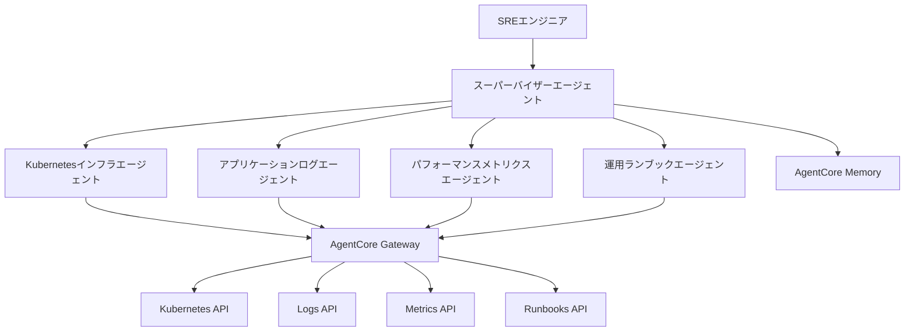

## ブログ概要

本記事は [Build multi-agent site reliability engineering assistants with Amazon Bedrock AgentCore](https://aws.amazon.com/blogs/machine-learning/build-multi-agent-site-reliability-engineering-assistants-with-amazon-bedrock-agentcore/) の解説記事です。

AWS公式ブログでは、Amazon Bedrock AgentCoreの3つのプリミティブ（Gateway・Memory・Runtime）を活用し、5つの特化エージェントが協調するマルチエージェントSREアシスタントの構築方法が紹介されている。AgentCore Gatewayが既存REST APIをMCPプロトコルに自動変換し、21のツールを生成する仕組みと、AgentCore Memoryによる3つの名前空間を用いた永続的知識管理が設計の核となっている。ブログによれば、インシデント調査時間を30〜45分から5〜10分に短縮したと報告されている。

この記事は [Zenn記事: Bedrock AgentCore×Strands Agentsでヘルプデスクマルチエージェント基盤を構築する](https://zenn.dev/0h_n0/articles/b6fbcbbe118e75) の深掘りです。

## 情報源

- **種別**: 企業テックブログ（AWS Machine Learning Blog）
- **URL**: [Build multi-agent SRE assistants with Amazon Bedrock AgentCore](https://aws.amazon.com/blogs/machine-learning/build-multi-agent-site-reliability-engineering-assistants-with-amazon-bedrock-agentcore/)
- **組織**: Amazon Web Services（著者: Amit Arora、Dheeraj Oruganty）
- **発表日**: 2025年9月26日

## 技術的背景

### SREにおけるマルチエージェントの必要性

従来のSREインシデント対応では、担当者がKubernetesダッシュボード、ログ集約ツール、メトリクス監視、ランブックを個別に確認し、情報を統合する必要があった。この手動プロセスは30〜45分を要し、深夜対応時にはヒューマンエラーのリスクも高い。

マルチエージェントシステムは、この問題をドメイン特化型エージェントの協調動作で解決する。学術研究の観点では、Park et al. (2023) の「Generative Agents」やWu et al. (2023) の「AutoGen」で示されたマルチエージェント協調パターンが基盤となっている。AWS公式ブログのアプローチは、これらの研究成果をSREドメインに特化させ、AgentCoreのマネージドサービスとして提供する点に特徴がある。

### 既存ツールとの差別化

Zenn記事ではStrands Agents SDKを用いたヘルプデスク向けマルチエージェント基盤を扱ったが、本ブログではAgentCore Gateway・Memory・Runtimeの3プリミティブを組み合わせた**インフラ監視特化型**の構成が示されている。特にGatewayによるREST→MCP自動変換は、既存のインフラAPIを改修せずにエージェントのツールとして統合できる点で実用性が高い。

## 実装アーキテクチャ

### 5エージェント＋スーパーバイザー構成

ブログで紹介されたシステムは、スーパーバイザーエージェントが4つの特化エージェントを統括するハブ・アンド・スポーク型アーキテクチャを採用している。



各エージェントの役割とアクセスするMCPツールは以下の通りである。

| エージェント | 主要ツール | 担当領域 |
|-------------|-----------|---------|
| Kubernetes | `get_pod_status`, `get_deployment_status`, `get_cluster_events`, `get_resource_usage` | コンテナオーケストレーション、ポッド障害、リソース制約 |
| ログ | `search_logs`, `get_error_logs`, `analyze_log_patterns` | パターン特定、異常検知、イベント相関 |
| メトリクス | `get_performance_metrics`, `get_error_rates`, `analyze_trends` | パフォーマンス監視、時系列トレンド |
| ランブック | `search_runbooks`, `get_incident_playbook`, `get_troubleshooting_guide` | 手順書参照、エスカレーション |

### AgentCore Gatewayによるプロトコル変換

AgentCore Gatewayの設計上の特徴は、既存REST APIのOpenAPI仕様をS3にアップロードするだけで、MCPプロトコルに準拠したツールが自動生成される点にある。ブログでは4つのAPI仕様から合計21のMCPツールが生成されたと報告されている。

```python
def create_gateway_with_jwt_auth(
    client: Any,
    gateway_name: str,
    role_arn: str,
    discovery_url: str,
    search_type: str = "SEMANTIC",
    protocol_version: str = "2025-03-26",
) -> dict:
    """AgentCore GatewayをカスタムJWT認証付きで作成する。

    Args:
        client: Bedrock AgentCore クライアント
        gateway_name: Gateway名
        role_arn: IAMロールARN
        discovery_url: Cognito Discovery URL
        search_type: ツール検索タイプ（SEMANTIC or KEYWORD）
        protocol_version: MCPプロトコルバージョン

    Returns:
        Gateway作成レスポンス
    """
    auth_config = {"customJWTAuthorizer": {"discoveryUrl": discovery_url}}
    protocol_configuration = {
        "mcp": {
            "searchType": search_type,
            "supportedVersions": [protocol_version],
        }
    }
    response = client.create_gateway(
        name=gateway_name,
        roleArn=role_arn,
        protocolType="MCP",
        authorizerType="CUSTOM_JWT",
        authorizerConfiguration=auth_config,
        protocolConfiguration=protocol_configuration,
    )
    return response
```

Gatewayはプロトコル変換に加え、認証情報の注入（Egress側でAPIキーをヘッダに自動付与）、TLS終端、標準化されたツール命名を担う。これにより、既存のインフラAPIを一切改修することなくエージェントから利用可能になる。

### AgentCore Memoryによる永続的知識管理

AgentCore Memoryは3つの名前空間で構造化された知識管理を提供する。

**1. ユーザー設定** (`/sre/users/{user_id}/preferences`)

```python
alice_preferences: dict = {
    "investigation_style": "detailed_systematic_analysis",
    "communication": ["#alice-alerts", "#sre-team"],
    "escalation": {
        "contact": "alice.manager@company.com",
        "threshold": "15min",
    },
    "reports": "technical_exposition_with_troubleshooting_steps",
    "timezone": "UTC",
}
```

**2. インフラ知識** (`/sre/infrastructure/{user_id}/{session_id}`)

調査中に蓄積されるドメイン知識を保持する。同一クラスターで過去に発生した類似障害のパターンを記憶し、根本原因の特定を加速する。

**3. インシデント履歴** (`/sre/investigations/{user_id}/{session_id}`)

過去のインシデント対応履歴と実績のある解決策を保持する。

ブログによれば、`actor_id`と`session_id`に基づいて、AgentCore Memoryが自動的に適切な名前空間にイベントをルーティングすると報告されている。

```python
from typing import Any


class SREMemoryClient:
    """AgentCore Memory操作クライアント。

    インシデント調査のコンテキストを永続化する。

    Args:
        memory_name: Memory リソース名
        region: AWSリージョン
    """

    def __init__(self, memory_name: str, region: str = "us-east-1") -> None:
        self.memory_name = memory_name
        self.region = region

    def create_event(
        self,
        memory_id: str,
        actor_id: str,
        session_id: str,
        messages: list[tuple[str, str]],
    ) -> dict[str, Any]:
        """調査イベントをMemoryに記録する。

        Args:
            memory_id: Memory識別子
            actor_id: 操作者ID（例: "Alice"）
            session_id: 調査セッションID
            messages: (メッセージ, ロール)のリスト

        Returns:
            Memory API レスポンス
        """
        # AgentCore Memory APIを呼び出し
        # actor_id + session_id で名前空間が自動決定される
        ...
```

## Production Deployment Guide

### AWS実装パターン（コスト最適化重視）

本ブログのマルチエージェントSREアシスタントをAWS上に展開する際の推奨構成を、トラフィック量別に整理する。

**コスト試算の注意事項**: 以下は2026年8月時点のAWS us-east-1リージョン料金に基づく概算値である。実際のコストはトラフィックパターン、リージョン、Bedrockモデル選択により変動する。最新料金は[AWS料金計算ツール](https://calculator.aws/)で確認を推奨する。

| 構成 | 想定規模 | 主要サービス | 月額概算 |
|------|---------|-------------|---------|
| Small | ~50 調査/日 | AgentCore Runtime + Gateway + Memory + Bedrock | $200-500 |
| Medium | ~500 調査/日 | AgentCore Runtime(複数) + Gateway + Memory + ElastiCache | $800-2,000 |
| Large | 2000+ 調査/日 | EKS + AgentCore Gateway + Memory + Bedrock Batch | $3,000-8,000 |

**Small構成の内訳**:
- AgentCore Runtime: サーバーレス実行（ゼロからのオートスケール）、月額$50-100
- AgentCore Gateway: MCPプロトコル変換、月額$20-40
- AgentCore Memory: 永続化ストレージ、月額$10-30
- Bedrock (Claude 3.5 Sonnet): 調査あたり約5,000トークン × 50回/日、月額$80-200
- CloudWatch: ログ・メトリクス、月額$20-50
- Cognito: JWT認証、月額$10-30

**Large構成の追加要素**:
- EKS クラスタ: コントロールプレーン $73/月 + ノード
- Karpenter: Spot Instances優先（オンデマンド比最大90%削減）
- ElastiCache: エージェント間セッション共有
- Bedrock Batch API: 非リアルタイム調査で50%コスト削減

**コスト削減テクニック**:
- **Spot Instances**: EKSワーカーノードでSpot優先により最大90%削減
- **Bedrock Prompt Caching**: システムプロンプト・ランブックのキャッシュで30-90%削減
- **Bedrock Batch API**: 定期レポート生成等の非同期処理で50%削減
- **AgentCore Runtime オートスケール**: 夜間・休日のゼロスケールでアイドルコスト排除

### Terraformインフラコード

**Small構成（AgentCore Serverless）**:

```hcl
# AgentCore SRE Assistant - Small構成
# 前提: AgentCore Runtime/Gateway/Memoryはコンソールまたは
# AWS CLIで事前作成済み。ここでは周辺インフラを定義する。

terraform {
  required_version = ">= 1.9"
  required_providers {
    aws = {
      source  = "hashicorp/aws"
      version = "~> 5.60"
    }
  }
}

provider "aws" {
  region = "us-east-1"
}

# --- Cognito (JWT認証基盤) ---
resource "aws_cognito_user_pool" "sre_agents" {
  name = "sre-agentcore-users"

  password_policy {
    minimum_length    = 12
    require_uppercase = true
    require_numbers   = true
    require_symbols   = true
  }

  # MFA有効化（セキュリティベストプラクティス）
  mfa_configuration = "ON"
  software_token_mfa_configuration {
    enabled = true
  }
}

resource "aws_cognito_user_pool_client" "sre_client" {
  name         = "sre-agent-client"
  user_pool_id = aws_cognito_user_pool.sre_agents.id

  explicit_auth_flows = [
    "ALLOW_USER_SRP_AUTH",
    "ALLOW_REFRESH_TOKEN_AUTH",
  ]

  # JWTトークン有効期間（セキュリティ考慮）
  access_token_validity  = 1  # 1時間
  refresh_token_validity = 7  # 7日
}

# --- IAMロール（AgentCore Runtime用・最小権限） ---
resource "aws_iam_role" "agentcore_runtime" {
  name = "sre-agentcore-runtime-role"

  assume_role_policy = jsonencode({
    Version = "2012-10-17"
    Statement = [{
      Action = "sts:AssumeRole"
      Effect = "Allow"
      Principal = {
        Service = "bedrock.amazonaws.com"
      }
    }]
  })
}

resource "aws_iam_role_policy" "agentcore_bedrock" {
  name = "bedrock-invoke"
  role = aws_iam_role.agentcore_runtime.id

  policy = jsonencode({
    Version = "2012-10-17"
    Statement = [
      {
        Effect = "Allow"
        Action = [
          "bedrock:InvokeModel",
          "bedrock:InvokeModelWithResponseStream",
        ]
        Resource = "arn:aws:bedrock:us-east-1::foundation-model/*"
      },
      {
        Effect = "Allow"
        Action = [
          "logs:CreateLogGroup",
          "logs:CreateLogStream",
          "logs:PutLogEvents",
        ]
        Resource = "arn:aws:logs:us-east-1:*:*"
      }
    ]
  })
}

# --- S3（OpenAPI仕様格納用・KMS暗号化） ---
resource "aws_kms_key" "s3_encryption" {
  description             = "KMS key for S3 encryption"
  deletion_window_in_days = 7
  enable_key_rotation     = true
}

resource "aws_s3_bucket" "openapi_specs" {
  bucket = "sre-agentcore-openapi-specs"
}

resource "aws_s3_bucket_server_side_encryption_configuration" "specs_enc" {
  bucket = aws_s3_bucket.openapi_specs.id

  rule {
    apply_server_side_encryption_by_default {
      sse_algorithm     = "aws:kms"
      kms_master_key_id = aws_kms_key.s3_encryption.arn
    }
  }
}

resource "aws_s3_bucket_public_access_block" "specs_block" {
  bucket = aws_s3_bucket.openapi_specs.id

  block_public_acls       = true
  block_public_policy     = true
  ignore_public_acls      = true
  restrict_public_buckets = true
}

# --- CloudWatch アラーム（コスト監視） ---
resource "aws_cloudwatch_metric_alarm" "bedrock_token_spike" {
  alarm_name          = "sre-bedrock-token-usage-spike"
  comparison_operator = "GreaterThanThreshold"
  evaluation_periods  = 2
  metric_name         = "InputTokenCount"
  namespace           = "AWS/Bedrock"
  period              = 3600
  statistic           = "Sum"
  threshold           = 500000  # 1時間あたり50万トークン
  alarm_description   = "Bedrock token usage spike detection"
  alarm_actions       = [aws_sns_topic.alerts.arn]
}

resource "aws_sns_topic" "alerts" {
  name = "sre-agentcore-alerts"
}
```

**Large構成（EKS + Karpenter + Spot）**:

```hcl
# AgentCore SRE Assistant - Large構成
# EKSでカスタムエージェントランタイムをホスト

module "eks" {
  source  = "terraform-aws-modules/eks/aws"
  version = "~> 20.24"

  cluster_name    = "sre-agentcore-cluster"
  cluster_version = "1.31"

  vpc_id     = module.vpc.vpc_id
  subnet_ids = module.vpc.private_subnets

  # パブリックアクセス制限（セキュリティ）
  cluster_endpoint_public_access       = true
  cluster_endpoint_public_access_cidrs = ["10.0.0.0/8"]

  # マネージドノードグループ（ベースライン）
  eks_managed_node_groups = {
    baseline = {
      instance_types = ["m7g.large"]  # ARM64（Graviton）
      capacity_type  = "ON_DEMAND"
      min_size       = 1
      max_size       = 3
      desired_size   = 1
    }
  }
}

# --- Karpenter（Spot優先オートスケール） ---
resource "kubectl_manifest" "karpenter_nodepool" {
  yaml_body = yamlencode({
    apiVersion = "karpenter.sh/v1"
    kind       = "NodePool"
    metadata = {
      name = "sre-agent-spot"
    }
    spec = {
      template = {
        spec = {
          requirements = [
            {
              key      = "karpenter.sh/capacity-type"
              operator = "In"
              values   = ["spot", "on-demand"]  # Spot優先
            },
            {
              key      = "kubernetes.io/arch"
              operator = "In"
              values   = ["arm64"]  # Graviton（コスト効率）
            },
            {
              key      = "node.kubernetes.io/instance-type"
              operator = "In"
              values   = ["m7g.large", "m7g.xlarge", "c7g.large"]
            }
          ]
        }
      }
      limits = {
        cpu    = "64"
        memory = "128Gi"
      }
      disruption = {
        consolidationPolicy = "WhenEmptyOrUnderutilized"
        consolidateAfter    = "30s"
      }
    }
  })
}

# --- Secrets Manager（API認証情報） ---
resource "aws_secretsmanager_secret" "api_keys" {
  name       = "sre-agentcore/api-keys"
  kms_key_id = aws_kms_key.secrets_encryption.arn
}

resource "aws_kms_key" "secrets_encryption" {
  description             = "KMS key for Secrets Manager"
  deletion_window_in_days = 7
  enable_key_rotation     = true
}

# --- AWS Budgets（予算アラート） ---
resource "aws_budgets_budget" "sre_monthly" {
  name         = "sre-agentcore-monthly"
  budget_type  = "COST"
  limit_amount = "5000"
  limit_unit   = "USD"
  time_unit    = "MONTHLY"

  notification {
    comparison_operator       = "GREATER_THAN"
    threshold                 = 80
    threshold_type            = "PERCENTAGE"
    notification_type         = "ACTUAL"
    subscriber_sns_topic_arns = [aws_sns_topic.alerts.arn]
  }

  notification {
    comparison_operator       = "GREATER_THAN"
    threshold                 = 100
    threshold_type            = "PERCENTAGE"
    notification_type         = "FORECASTED"
    subscriber_sns_topic_arns = [aws_sns_topic.alerts.arn]
  }
}
```

### 運用・監視設定

**CloudWatch Logs Insights クエリ**（コスト異常検知）:

```
# 1時間あたりのトークン使用量推移
fields @timestamp, @message
| filter @message like /token/
| stats sum(input_tokens) as total_input,
        sum(output_tokens) as total_output,
        count(*) as invocations
  by bin(1h) as hour
| sort hour desc
```

**CloudWatch Logs Insights クエリ**（エージェント別レイテンシ分析）:

```
fields @timestamp, agent_type, duration_ms
| filter ispresent(agent_type)
| stats avg(duration_ms) as avg_latency,
        pct(duration_ms, 95) as p95_latency,
        pct(duration_ms, 99) as p99_latency,
        count(*) as invocations
  by agent_type
| sort p95_latency desc
```

**CloudWatch アラーム設定**:

```python
import boto3


def create_agentcore_alarms(sns_topic_arn: str) -> None:
    """AgentCore SREシステム用CloudWatchアラームを作成する。

    Args:
        sns_topic_arn: 通知先SNSトピックARN
    """
    cw = boto3.client("cloudwatch")

    # Bedrockトークン使用量スパイク検知
    cw.put_metric_alarm(
        AlarmName="sre-bedrock-token-spike",
        MetricName="InputTokenCount",
        Namespace="AWS/Bedrock",
        Statistic="Sum",
        Period=3600,
        EvaluationPeriods=2,
        Threshold=500000,
        ComparisonOperator="GreaterThanThreshold",
        AlarmActions=[sns_topic_arn],
    )

    # エージェント応答時間異常検知
    cw.put_metric_alarm(
        AlarmName="sre-agent-latency-p99",
        MetricName="Duration",
        Namespace="AgentCore/SRE",
        ExtendedStatistic="p99",
        Period=300,
        EvaluationPeriods=3,
        Threshold=30000,  # 30秒
        ComparisonOperator="GreaterThanThreshold",
        AlarmActions=[sns_topic_arn],
    )
```

**X-Ray トレーシング設定**:

```python
from aws_xray_sdk.core import xray_recorder, patch_all


def configure_xray_tracing() -> None:
    """X-Rayトレーシングを設定する。

    AgentCore Runtime内のboto3呼び出しを自動計装し、
    エージェント間の呼び出しチェーンを可視化する。
    """
    xray_recorder.configure(
        service="sre-agentcore",
        sampling=True,
        context_missing="LOG_ERROR",
    )
    patch_all()  # boto3, requests等を自動計装


@xray_recorder.capture("investigate_incident")
def investigate_incident(query: str, user_id: str) -> dict:
    """インシデント調査をX-Rayトレース付きで実行する。

    Args:
        query: ユーザーからの調査クエリ
        user_id: 操作者ID

    Returns:
        調査結果
    """
    segment = xray_recorder.current_segment()
    segment.put_annotation("user_id", user_id)
    segment.put_metadata("query", query, "investigation")
    # ... 調査ロジック
    return {}
```

**Cost Explorer 自動レポート**:

```python
import boto3
from datetime import datetime, timedelta


def get_daily_cost_report() -> dict:
    """AgentCore関連の日次コストレポートを取得する。

    Returns:
        サービス別コスト内訳
    """
    ce = boto3.client("ce")
    end = datetime.utcnow().strftime("%Y-%m-%d")
    start = (datetime.utcnow() - timedelta(days=1)).strftime("%Y-%m-%d")

    response = ce.get_cost_and_usage(
        TimePeriod={"Start": start, "End": end},
        Granularity="DAILY",
        Metrics=["UnblendedCost"],
        Filter={
            "Or": [
                {"Dimensions": {"Key": "SERVICE", "Values": ["Amazon Bedrock"]}},
                {"Dimensions": {"Key": "SERVICE", "Values": ["Amazon EKS"]}},
                {"Dimensions": {"Key": "SERVICE", "Values": ["Amazon CloudWatch"]}},
                {"Dimensions": {"Key": "SERVICE", "Values": ["Amazon Cognito"]}},
            ]
        },
        GroupBy=[{"Type": "DIMENSION", "Key": "SERVICE"}],
    )

    costs: dict[str, float] = {}
    for group in response["ResultsByTime"][0]["Groups"]:
        service = group["Keys"][0]
        amount = float(group["Metrics"]["UnblendedCost"]["Amount"])
        costs[service] = amount

    total = sum(costs.values())
    if total > 100.0:
        # SNS通知（$100/日超過）
        sns = boto3.client("sns")
        sns.publish(
            TopicArn="arn:aws:sns:us-east-1:ACCOUNT:sre-agentcore-alerts",
            Subject=f"SRE AgentCore cost alert: ${total:.2f}/day",
            Message=f"Daily cost exceeded $100: {costs}",
        )
    return costs
```

### コスト最適化チェックリスト

**アーキテクチャ選択**:
- [ ] 調査頻度に応じた構成選択（~50/日: Small、~500/日: Medium、2000+/日: Large）
- [ ] AgentCore Runtimeのゼロスケール活用（アイドル時コスト排除）
- [ ] リージョン選択の最適化（Bedrockモデル可用性とレイテンシのバランス）

**リソース最適化**:
- [ ] EC2/EKS: Graviton（ARM64）インスタンス選択で20%コスト削減
- [ ] EKS: Spot Instances優先（Karpenterで自動フォールバック）
- [ ] EKS: Karpenter Consolidation有効化（未使用ノード自動削除）
- [ ] Reserved Instances: 1年コミットで最大40%削減
- [ ] Savings Plans: Compute Savings Plansでクロスサービス割引
- [ ] NAT Gateway: VPCエンドポイント活用でNAT Gateway料金削減

**LLMコスト削減**:
- [ ] Bedrock Prompt Caching: システムプロンプト・ランブックのキャッシュで30-90%削減
- [ ] Bedrock Batch API: 定期レポート・非同期分析で50%削減
- [ ] モデル選択ロジック: 簡易クエリはHaiku、複雑調査はSonnetで使い分け
- [ ] トークン数制限: 各エージェントのmax_tokensを調査タイプ別に設定
- [ ] コンテキスト圧縮: 長大なログ・メトリクスの要約をエージェント間で共有

**監視・アラート**:
- [ ] AWS Budgets: 月額予算アラート（80%/100%の2段階）
- [ ] CloudWatch アラーム: トークン使用量スパイク検知
- [ ] Cost Anomaly Detection: ML ベースの異常検知有効化
- [ ] 日次コストレポート: Cost Explorer APIで自動取得・SNS通知
- [ ] ダッシュボード: エージェント別コスト・レイテンシの可視化

**リソース管理**:
- [ ] 未使用Gateway/Memoryリソースの定期棚卸し
- [ ] タグ戦略: `Environment`, `Team`, `CostCenter`タグの強制
- [ ] S3ライフサイクルポリシー: OpenAPI仕様の旧バージョン自動削除
- [ ] 開発環境: 夜間・休日のAgentCore Runtime停止
- [ ] ログ保持期間: CloudWatch Logs の保持期間を調査要件に合わせて設定（例: 30日）

## パフォーマンス最適化

### ブログで報告された実測値

ブログでは具体的なインシデント調査シナリオが示されている。APIレスポンスタイムが「直近1時間で3倍に悪化」という報告に対し、システムが以下の事実を検出したと報告されている（AWS公式ブログより）:

- **応答時間**: 150ms → 5,000ms（実際には33倍の劣化）
- **データベースポッド**: CrashLoopBackOff状態
- **メモリ使用率**: 100%
- **CPU使用率**: 95%
- **エラー率**: 75%
- **影響額**: $47K（推定）
- **トランザクション失敗率**: 23%

調査結果はユーザーの設定に基づいた「個人別レポート」として自動出力される。

### スーパーバイザーの調査計画

スーパーバイザーエージェントはクエリを受け取ると、複雑度を判定し調査計画を生成する。ブログの例では以下の計画が示されている:

1. **metrics_agent**: APIパフォーマンスメトリクス（応答時間、エラー率、リソース使用率）を分析
2. **logs_agent**: アプリケーションログからエラーパターン・例外を調査
3. **kubernetes_agent**: ポッドステータス・リソース制約を確認

複雑度が「Simple」と判定された場合は自動実行（Auto-execute: Yes）され、人間の承認を待たずに調査が進行する。

### チューニングポイント

- **Gateway `searchType`**: `SEMANTIC`（意味的検索）vs `KEYWORD`（キーワード検索）の選択がツール選定精度に影響
- **Memory名前空間設計**: `actor_id`と`session_id`の粒度がパターン認識の効果を左右する
- **エージェント並列度**: スーパーバイザーが複数エージェントを同時実行するか逐次実行するかで調査時間が変動

## 運用での学び

### デプロイメントアーキテクチャ

ブログではARM64ベースのDockerイメージとOpenTelemetryインストルメンテーションを統合したデプロイパターンが示されている。

```dockerfile
FROM --platform=linux/arm64 ghcr.io/astral-sh/uv:python3.12-bookworm-slim
WORKDIR /app
COPY pyproject.toml uv.lock ./
RUN uv sync --frozen --no-dev
COPY sre_agent/ ./sre_agent/
ENV PYTHONPATH="/app"
EXPOSE 8080
CMD ["uv", "run", "opentelemetry-instrument", "uvicorn", \
     "sre_agent.agent_runtime:app", "--host", "0.0.0.0", "--port", "8080"]
```

このDockerfileの設計ポイントとして以下が挙げられる:

- **ARM64（Graviton）**: x86比でコスト効率が約20%向上
- **uv パッケージマネージャー**: `--frozen`によるロックファイル厳密適用
- **OpenTelemetry**: `opentelemetry-instrument`コマンドで自動計装

### オブザーバビリティ

ブログによれば、CloudWatchで以下のメトリクスが自動取得されると報告されている:

- **LLMメトリクス**: トークン使用量、呼び出しレイテンシ
- **ツール実行トレース**: 各MCPツールの実行時間・成功率
- **メモリ操作パターン**: 名前空間別の読み書き頻度
- **エンドツーエンドトレース**: ユーザークエリから最終レスポンスまでの追跡

これにより、「どのエージェントがボトルネックになっているか」「どのツール呼び出しが失敗しやすいか」を定量的に把握できる。

### 認証・認可の多層設計

ブログのアーキテクチャでは認証が2層で構成されている:

- **Ingress（ユーザー→Gateway）**: Cognito JWT認証。`customJWTAuthorizer`による検証
- **Egress（Gateway→バックエンドAPI）**: APIキー認証。GatewayがヘッダにAPIキーを自動注入

この分離により、ユーザー認証とバックエンドAPI認証を独立して管理でき、既存APIの認証方式を変更する必要がない。

## 学術研究との関連

本ブログのマルチエージェントSREアーキテクチャは、以下の学術研究と関連が深い。

- **AutoGen (Wu et al., 2023)**: マイクロソフトリサーチが提案したマルチエージェント会話フレームワーク。スーパーバイザーパターンによるエージェント間協調の基盤的研究であり、本ブログのスーパーバイザー→特化エージェント構成と直接対応する
- **Generative Agents (Park et al., 2023)**: スタンフォード大学による生成的エージェントの研究。エージェントにメモリ（記憶）を持たせることで長期的な行動計画が可能になることを示した。AgentCore Memoryの3名前空間設計はこの知見を運用ドメインに適用したものと解釈できる
- **ReAct (Yao et al., 2022)**: 推論（Reasoning）と行動（Acting）を交互に行うエージェントパターン。各特化エージェントがツールを呼び出し、結果を推論に反映するサイクルはReActパターンの実装例である
- **Toolformer (Schick et al., 2023)**: LLMが自律的にツールの使い方を学習する研究。AgentCore GatewayによるOpenAPI→MCPツール自動生成は、ツール定義の自動化という方向で関連する

## まとめと実践への示唆

AWS公式ブログで紹介されたマルチエージェントSREアシスタントは、AgentCore Gateway（REST→MCP自動変換）、AgentCore Memory（3名前空間の永続的知識管理）、AgentCore Runtime（サーバーレスデプロイ）の3プリミティブを組み合わせることで、既存インフラAPIを改修せずにエージェント化する実用的なパターンを示している。

実践への示唆として、(1) OpenAPI仕様が整備されていれば既存APIの統合コストが低い点、(2) メモリの名前空間設計がパーソナライゼーションとパターン認識の鍵となる点、(3) Cognito JWT + APIキーの2層認証により既存システムとの共存が容易な点が挙げられる。ただし、ブログで示された調査時間短縮（30〜45分→5〜10分）は特定シナリオでの結果であり、実環境での効果は対象システムの複雑度やAPI整備状況に依存する点に留意が必要である。

## 参考文献

- **Blog URL**: [Build multi-agent site reliability engineering assistants with Amazon Bedrock AgentCore](https://aws.amazon.com/blogs/machine-learning/build-multi-agent-site-reliability-engineering-assistants-with-amazon-bedrock-agentcore/)
- **Related Papers**:
  - Wu et al., "AutoGen: Enabling Next-Gen LLM Applications via Multi-Agent Conversation," arXiv:2308.08155, 2023
  - Park et al., "Generative Agents: Interactive Simulacra of Human Behavior," arXiv:2304.03442, 2023
  - Yao et al., "ReAct: Synergizing Reasoning and Acting in Language Models," arXiv:2210.03629, 2022
  - Schick et al., "Toolformer: Language Models Can Teach Themselves to Use Tools," arXiv:2302.04761, 2023
- **AWS Documentation**: [Amazon Bedrock AgentCore](https://docs.aws.amazon.com/bedrock/latest/userguide/agentcore.html)
- **Related Zenn article**: [Bedrock AgentCore×Strands Agentsでヘルプデスクマルチエージェント基盤を構築する](https://zenn.dev/0h_n0/articles/b6fbcbbe118e75)
