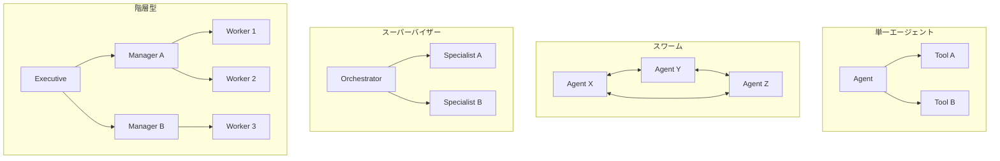
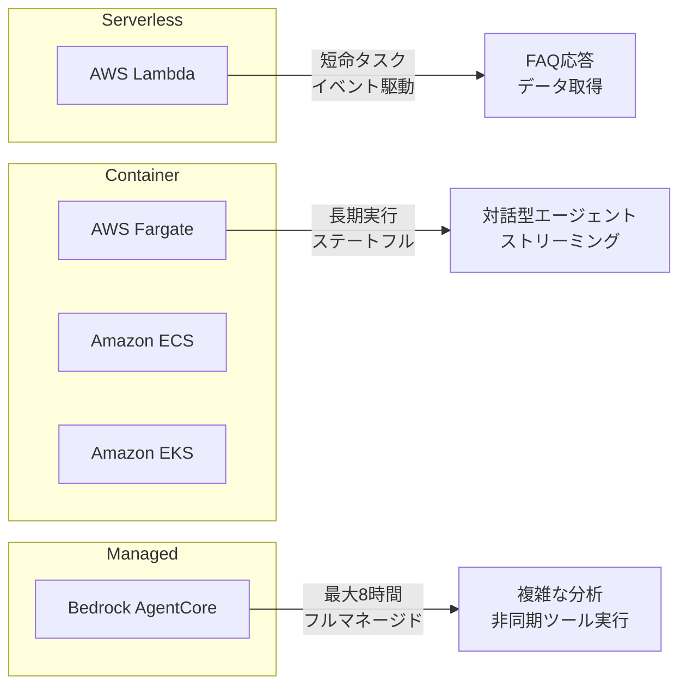

本記事は [Strands Agents SDK: A technical deep dive into agent architectures and observability](https://aws.amazon.com/blogs/machine-learning/strands-agents-sdk-a-technical-deep-dive-into-agent-architectures-and-observability/) の解説記事です。

## ブログ概要

AWS Machine Learning Blogにおいて、AWS Industries PACEチームのJin Tan Ruan氏がStrands Agents SDKのエージェントアーキテクチャパターンとObservability統合について技術的に解説しています。Strands Agents SDKは「モデル駆動アプローチ」を採用するApache 2.0ライセンスのオープンソースフレームワークであり、開発者がタスクフローをハードコーディングする代わりにLLMの推論能力に委ねる設計思想を持ちます。単一エージェントからスワーム、スーパーバイザー、階層型まで4つのアーキテクチャパターン、OpenTelemetry統合によるプロダクション向けObservability、Lambda/Fargate/AgentCoreを含むデプロイメントオプション、MCP/A2Aによるツール統合が網羅的に紹介されています。

この記事は [Zenn記事: Bedrock AgentCore×Strands Agentsでヘルプデスクマルチエージェント基盤を構築する](https://zenn.dev/0h_n0/articles/b6fbcbbe118e75) の深掘りです。

## 情報源

- **種別**: 企業テックブログ（AWS Machine Learning Blog）
- **タイトル**: Strands Agents SDK: A technical deep dive into agent architectures and observability
- **著者**: Jin Tan Ruan（AWS Industries PACEチーム シニアGenerative AI開発者）
- **公開日**: 2025年7月31日
- **URL**: [https://aws.amazon.com/blogs/machine-learning/strands-agents-sdk-a-technical-deep-dive-into-agent-architectures-and-observability/](https://aws.amazon.com/blogs/machine-learning/strands-agents-sdk-a-technical-deep-dive-into-agent-architectures-and-observability/)

## 技術的背景

AIエージェントフレームワークの設計には大きく2つの方向性が存在します。1つは開発者がワークフローを明示的に定義する「開発者駆動（developer-first）」アプローチであり、LangChainがその代表例です。もう1つはLLMの推論能力にタスク計画とツール選択を委ねる「モデル駆動（LLM-first）」アプローチです。

Strands Agents SDKは後者を採用しており、エージェントの構成要素を「言語モデル」「システムプロンプト」「ツールのセット」の3つに絞り込んでいます。この設計思想により、複雑なDAG定義やチェーン構築なしに、LLMが自律的にツール呼び出しの順序と回数を決定します。AWS公式ブログでは、AWS内部のプロダクションサービス（Kiro、Amazon Q、AWS Glue、VPC Reachability Analyzer）が数ヶ月にわたるカスタムエージェント開発をStrandsに置き換えた事例が報告されており、この軽量アプローチの実用性が裏付けられています。

Zenn記事「Bedrock AgentCore×Strands Agentsでヘルプデスクマルチエージェント基盤を構築する」ではマルチエージェント構成の具体的な実装を扱っていますが、本ブログ記事はそのアーキテクチャパターンの全体像とObservability設計を体系的に整理した位置づけにあります。

## 実装アーキテクチャ

### 4つのエージェントアーキテクチャパターン

AWS公式ブログでは、Strands Agents SDKが提供する4つのアーキテクチャパターンが段階的に紹介されています。



**1. 単一エージェントパターン**は最もシンプルな構成であり、1つのLLMエージェントがツールを直接呼び出します。Q&A、データ取得、簡易アシスタントに適しています。

**2. マルチエージェントネットワーク（スワーム）**はオーケストレーターなしで複数エージェントがメッシュトポロジで通信するパターンです。共有メモリ（ブラックボード）やメッセージパッシングによる協調が可能で、`agent_graph`ツールでネットワーク管理を行います。協調型（合意形成）、競争型（並列独立処理）、ハイブリッド型の通信スタイルが提供されています。

**3. スーパーバイザー・エージェントモデル**はオーケストレーターが専門エージェントを「ツール」として呼び出す構成です。各スペシャリストは独自のシステムプロンプトとドメイン固有のツールセットを持ち、関心の分離を実現します。

**4. 階層型アーキテクチャ**はツリー構造で多段の委譲を行うパターンです。エグゼクティブ → マネージャー → ワーカーの構造で、タスクが下方に流れ、結果が上方に戻ります。

### コード例：スーパーバイザーパターンの実装

AWS公式ブログで示されているスーパーバイザーパターンの実装例を、型ヒント・Docstring付きで整理すると以下のようになります。

```python
"""Strands Agents SDKによるスーパーバイザーパターンの実装例.

AWS公式ブログ「Strands Agents SDK: A technical deep dive into
agent architectures and observability」で解説されている
Orchestrator-Specialist構成を再現する。
"""

from strands import Agent, tool
from strands_tools import calculator, retrieve, http_request


RESEARCH_PROMPT = """
You are a specialized research assistant. Focus on providing
factual, well-sourced information for research questions.
Always cite sources in your answers.
"""


@tool
def research_assistant(query: str) -> str:
    """専門リサーチエージェントをツールとして呼び出す.

    Args:
        query: リサーチクエリ（自然言語）

    Returns:
        ソース付きのリサーチ結果
    """
    research_agent = Agent(
        system_prompt=RESEARCH_PROMPT,
        tools=[retrieve, http_request],
    )
    return research_agent(query)


@tool
def math_assistant(question: str) -> str:
    """数学計算専門エージェントをツールとして呼び出す.

    Args:
        question: 計算が必要な質問

    Returns:
        計算結果を含む回答
    """
    math_agent = Agent(
        system_prompt="You are a math expert. Solve problems step by step.",
        tools=[calculator],
    )
    return math_agent(question)


def create_orchestrator() -> Agent:
    """スーパーバイザー（オーケストレーター）エージェントを構築する.

    各スペシャリストエージェントを@toolデコレータでラップし、
    オーケストレーターのツールとして登録する。LLMが質問内容に
    応じて適切なスペシャリストを自律的に選択する。

    Returns:
        スペシャリストエージェント群を統括するオーケストレーター
    """
    return Agent(
        tools=[research_assistant, math_assistant],
    )


if __name__ == "__main__":
    orchestrator = create_orchestrator()
    response = orchestrator(
        "What are the latest NASA findings on Mars, and can you calculate "
        "the travel time to Mars at 20km/s?"
    )
    print(response)
```

このコードの特徴は、`@tool`デコレータによってエージェントをツールとしてラップする点にあります。オーケストレーターはリサーチ関連の質問を`research_assistant`に、計算を`math_assistant`に自動で委譲します。開発者がルーティングロジックを明示的にコーディングする必要がなく、LLMの推論でタスク分配が決定されます。

## Production Deployment Guide

### デプロイメントオプションの全体像

AWS公式ブログでは、ワークロード特性に応じた5つのデプロイメントパターンが整理されています。



| デプロイオプション | 実行時間 | スケーリング | 主な用途 |
|:---|:---|:---|:---|
| AWS Lambda | Lambda上限まで | 同時実行数ベース自動スケール | 短命タスク、イベント駆動 |
| AWS Fargate / ECS / EKS | 無制限 | 水平スケール（ロードバランサー） | 長期実行、ステートフル、GPU利用 |
| Bedrock AgentCore | 最大8時間 | フルマネージド | 非同期ツール実行、MCP/A2A統合 |
| ハイブリッド（Return-of-Control） | 環境依存 | 環境ごと | データガバナンス要件、オンプレミス連携 |

### AWS Lambdaデプロイメント

サーバーレスデプロイメントは、短期間で完了するエージェントタスクに適しています。Lambda Function URLまたはAPI Gateway経由でトリガーし、ストリーミングレスポンスにも対応します。

```python
"""AWS Lambda上でStrands Agentを実行するハンドラ.

Lambda Function URL経由でHTTPリクエストを受け付け、
エージェントの応答をストリーミングで返却する構成例。
"""

from __future__ import annotations

import json
from typing import Any

from strands import Agent
from strands_tools import calculator, retrieve


def _build_agent() -> Agent:
    """Lambda関数のコールドスタート時にエージェントを初期化する.

    Returns:
        ツール付きのStrandsエージェントインスタンス
    """
    return Agent(
        system_prompt=(
            "You are a helpful assistant that can research topics "
            "and perform calculations."
        ),
        tools=[retrieve, calculator],
    )


# モジュールレベルで初期化（ウォームスタート時に再利用）
_agent = _build_agent()


def handler(event: dict[str, Any], context: Any) -> dict[str, Any]:
    """Lambda関数ハンドラ.

    Args:
        event: API GatewayまたはFunction URLからのイベント
        context: Lambda実行コンテキスト

    Returns:
        HTTP応答（ステータスコード + JSON本文）
    """
    body = json.loads(event.get("body", "{}"))
    query = body.get("query", "")

    if not query:
        return {
            "statusCode": 400,
            "body": json.dumps({"error": "query is required"}),
        }

    result = _agent(query)

    return {
        "statusCode": 200,
        "body": json.dumps({"response": str(result)}),
    }
```

ウォームスタート最適化として、エージェントインスタンスをモジュールレベルで初期化することで、コールドスタート以降のリクエストではエージェントの再構築コストを回避できます。

### Amazon Bedrock AgentCore デプロイメント

2025年7月時点でパブリックプレビューのBedrock AgentCoreは、Strandsエージェントのフルマネージドランタイムとして以下の特徴を持つとAWS公式ブログで紹介されています。

- 最大8時間の長期実行タスク対応
- 非同期ツール実行
- MCP/A2Aプロトコルによるツール相互運用
- OAuth/Cognito/IAMによるセキュアなID管理
- CloudWatch/OpenTelemetryネイティブ統合

```python
"""Bedrock AgentCoreへのStrandsエージェントデプロイ.

BedrockAgentCoreAppでエージェントをラップし、
AgentCoreランタイム上で実行する構成。
"""

from __future__ import annotations

from strands import Agent
from strands_tools import calculator, retrieve


def create_agentcore_agent() -> Agent:
    """AgentCore向けエージェントを構築する.

    AgentCoreランタイムはOAuth/Cognito/IAMによる認証、
    CloudWatch/OTEL統合、MCP/A2Aツール相互運用を提供する。

    Returns:
        AgentCoreデプロイ用に構成されたエージェント
    """
    return Agent(
        system_prompt=(
            "You are an enterprise assistant with access to "
            "research and calculation capabilities."
        ),
        tools=[retrieve, calculator],
    )
```

AWS公式ブログでは、`BedrockAgentCoreApp`でStrandsエージェントをラップしてAWS CLIまたはコンテナワークフローでデプロイする手順が述べられています。

### インフラ構築（Terraform）

AWS公式ブログの構成をTerraformで表現すると、Lambdaデプロイメントの基本構成は以下のようになります。

```hcl
# Strands AgentのLambdaデプロイメント構成
# Function URL + IAM認証 + Bedrock InvokeModel権限

resource "aws_lambda_function" "strands_agent" {
  function_name = "strands-agent-handler"
  runtime       = "python3.12"
  handler       = "handler.handler"
  timeout       = 300
  memory_size   = 512

  filename         = "lambda_package.zip"
  source_code_hash = filebase64sha256("lambda_package.zip")

  role = aws_iam_role.strands_agent_lambda.arn

  environment {
    variables = {
      OTEL_EXPORTER_OTLP_ENDPOINT = var.otel_collector_endpoint
      OTEL_SERVICE_NAME           = "strands-agent"
    }
  }

  tracing_config {
    mode = "Active"  # X-Rayトレーシング有効化
  }
}

resource "aws_lambda_function_url" "strands_agent" {
  function_name      = aws_lambda_function.strands_agent.function_name
  authorization_type = "AWS_IAM"

  cors {
    allow_origins = var.allowed_origins
    allow_methods = ["POST"]
  }
}

resource "aws_iam_role" "strands_agent_lambda" {
  name = "strands-agent-lambda-role"

  assume_role_policy = jsonencode({
    Version = "2012-10-17"
    Statement = [
      {
        Effect = "Allow"
        Principal = { Service = "lambda.amazonaws.com" }
        Action = "sts:AssumeRole"
      }
    ]
  })
}

resource "aws_iam_role_policy" "bedrock_invoke" {
  name = "strands-agent-bedrock-invoke"
  role = aws_iam_role.strands_agent_lambda.id

  policy = jsonencode({
    Version = "2012-10-17"
    Statement = [
      {
        Effect   = "Allow"
        Action   = ["bedrock:InvokeModel", "bedrock:InvokeModelWithResponseStream"]
        Resource = [
          "arn:aws:bedrock:*::foundation-model/anthropic.claude-*",
          "arn:aws:bedrock:*::foundation-model/amazon.nova-*",
        ]
      }
    ]
  })
}

resource "aws_iam_role_policy_attachment" "lambda_basic" {
  role       = aws_iam_role.strands_agent_lambda.name
  policy_arn = "arn:aws:iam::aws:policy/service-role/AWSLambdaBasicExecutionRole"
}

resource "aws_iam_role_policy_attachment" "xray" {
  role       = aws_iam_role.strands_agent_lambda.name
  policy_arn = "arn:aws:iam::aws:policy/AWSXRayDaemonWriteAccess"
}
```

### Observabilityの運用監視構成

AWS公式ブログで紹介されているOpenTelemetryスパン情報をCloudWatchメトリクスに変換し、アラートを設定する構成は以下のとおりです。

```hcl
# Strands Agent Observabilityの監視設計
# OTEL Spans → CloudWatch Metrics → Alarms

resource "aws_cloudwatch_metric_alarm" "agent_error_rate" {
  alarm_name          = "strands-agent-error-rate"
  comparison_operator = "GreaterThanThreshold"
  evaluation_periods  = 3
  metric_name         = "ToolInvocationErrors"
  namespace           = "Custom/StrandsAgent"
  period              = 300
  statistic           = "Sum"
  threshold           = 10
  alarm_description   = "Tool invocation error count exceeded threshold"
  alarm_actions       = [aws_sns_topic.agent_alerts.arn]
}

resource "aws_cloudwatch_metric_alarm" "agent_latency" {
  alarm_name          = "strands-agent-latency-p99"
  comparison_operator = "GreaterThanThreshold"
  evaluation_periods  = 3
  metric_name         = "AgentResponseLatency"
  namespace           = "Custom/StrandsAgent"
  period              = 300
  extended_statistic  = "p99"
  threshold           = 30000  # 30秒
  alarm_description   = "Agent P99 latency exceeded 30 seconds"
  alarm_actions       = [aws_sns_topic.agent_alerts.arn]
}

resource "aws_cloudwatch_metric_alarm" "token_consumption" {
  alarm_name          = "strands-agent-token-spike"
  comparison_operator = "GreaterThanThreshold"
  evaluation_periods  = 2
  metric_name         = "TotalTokensConsumed"
  namespace           = "Custom/StrandsAgent"
  period              = 3600
  statistic           = "Sum"
  threshold           = 1000000  # 1時間あたり100万トークン
  alarm_description   = "Hourly token consumption spike detected"
  alarm_actions       = [aws_sns_topic.agent_alerts.arn]
}

resource "aws_sns_topic" "agent_alerts" {
  name = "strands-agent-alerts"
}
```

### セキュリティ設計

AWS公式ブログでは、エージェントのセキュリティについて以下の多層防御が解説されています。

```python
"""Strands Agentのセキュリティ設計パターン.

AWS公式ブログで解説されているアクセス制御、データ保護、
入出力サニタイゼーションの実装イメージ。
"""

from __future__ import annotations

from dataclasses import dataclass, field
from typing import Protocol


class ContentFilter(Protocol):
    """Bedrock Guardrails互換のコンテンツフィルタ."""

    def validate_input(self, text: str) -> bool:
        """入力テキストの安全性を検証する."""
        ...

    def validate_output(self, text: str) -> bool:
        """出力テキストの安全性を検証する."""
        ...


@dataclass(frozen=True)
class AgentSecurityConfig:
    """エージェントのセキュリティ構成.

    AWS公式ブログで推奨されるセキュリティ要件を構造化。

    Attributes:
        allowed_tools: このエージェントが利用可能なツール名リスト
        require_auth: 認証必須かどうか
        encrypt_conversation: 会話履歴の暗号化フラグ
        redact_sensitive_logs: ログからの機密情報除去フラグ
        max_loop_iterations: 推論ループの最大反復回数
    """

    allowed_tools: tuple[str, ...] = ()
    require_auth: bool = True
    encrypt_conversation: bool = True
    redact_sensitive_logs: bool = True
    max_loop_iterations: int = 20


@dataclass
class SecurityEnforcer:
    """セキュリティポリシーの実行時強制.

    Attributes:
        config: セキュリティ構成
        content_filter: コンテンツフィルタ（Bedrock Guardrails等）
    """

    config: AgentSecurityConfig
    content_filter: ContentFilter | None = None
    _invocation_count: int = field(default=0, init=False, repr=False)

    def authorize_tool_call(self, tool_name: str) -> bool:
        """ツール呼び出しの認可チェック.

        Args:
            tool_name: 呼び出し対象のツール名

        Returns:
            許可されたツールであればTrue
        """
        return tool_name in self.config.allowed_tools

    def check_loop_limit(self) -> bool:
        """推論ループの反復回数制限チェック.

        Returns:
            制限内であればTrue
        """
        self._invocation_count += 1
        return self._invocation_count <= self.config.max_loop_iterations
```

AWS公式ブログでは、MAESTROフレームワーク（AWS発表のエージェントAI向け脅威モデリング）を用いたプロンプトインジェクション対策、入力検証、出力フィルタリング、堅牢な例外処理が推奨されています。きめ細かいツールアクセス制御は、エージェントごとに利用可能なツールを制限し、最小権限の原則を適用するものです。

### MCP・A2Aによるツール統合

Strands Agents SDKは2つのオープンプロトコルをサポートしています。

**MCP（Model Context Protocol）**は、外部ツールへのアクセスを標準化するオープンプロトコルであり、数千の外部ツールとの接続を可能にします。

**A2A（Agent-to-Agent）**は、エージェント同士がツールとして相互呼び出しを行うプロトコルです。

```mermaid
flowchart LR
    Agent[Strands Agent] -->|MCP| ExtTool1[外部ツール群]
    Agent -->|A2A| Agent2[別のAgent]
    Agent -->|@tool| LocalTool[ローカルツール]
    Agent2 -->|MCP| ExtTool2[外部サービス]
```

さらに、開発時にはホットリロードが利用可能であり、エージェントを再起動せずにツールの追加・変更が自動的に反映される旨がAWS公式ブログで述べられています。

## パフォーマンス最適化

### OpenTelemetry統合によるObservability

AWS公式ブログでは、Observabilityを「プロダクションファースト」の設計方針として位置づけ、OpenTelemetry（OTEL）標準によるトレース・メトリクス・ログの3本柱を統合的に提供していると述べられています。対応バックエンドとしてAWS X-Ray、Amazon CloudWatch、Jaegerが挙げられています。

エージェントの各実行（ラン）はトレースとして記録され、以下のスパンが自動生成されます。

| スパン種別 | 記録内容 |
|:---|:---|
| LLM呼び出し | プロンプト、モデルパラメータ（temperature, max_tokens）、トークン使用量 |
| ツール実行 | ツール名、入力パラメータ、出力結果、実行時間 |
| 分散トレース | クロスサービスのトレースコンテキスト伝播 |

### メトリクス体系

AWS公式ブログで追跡が推奨されているメトリクスは以下の通りです。

```python
"""Strands Agent Observabilityのメトリクス定義.

AWS公式ブログで推奨されるメトリクス体系を
構造化したもの。CloudWatchカスタムメトリクスとして
記録する際のネームスペース・ディメンション設計の参考。
"""

from __future__ import annotations

from dataclasses import dataclass
from enum import Enum


class MetricCategory(Enum):
    """メトリクスカテゴリ."""

    TOOL = "tool"
    MODEL = "model"
    AGENT = "agent"
    SYSTEM = "system"
    BUSINESS = "business"


@dataclass(frozen=True)
class ObservabilityMetric:
    """Observabilityメトリクスの定義.

    Attributes:
        name: メトリクス名
        category: カテゴリ
        description: 説明
        unit: 単位
    """

    name: str
    category: MetricCategory
    description: str
    unit: str


# AWS公式ブログで推奨されるメトリクス一覧
RECOMMENDED_METRICS: tuple[ObservabilityMetric, ...] = (
    ObservabilityMetric(
        name="ToolInvocationCount",
        category=MetricCategory.TOOL,
        description="ツール呼び出し回数（成功/失敗別）",
        unit="Count",
    ),
    ObservabilityMetric(
        name="ToolCallRuntime",
        category=MetricCategory.TOOL,
        description="ツール実行時間",
        unit="Milliseconds",
    ),
    ObservabilityMetric(
        name="AgentLoopTurns",
        category=MetricCategory.AGENT,
        description="1インタラクションあたりのエージェントループ回数",
        unit="Count",
    ),
    ObservabilityMetric(
        name="ModelResponseLatency",
        category=MetricCategory.MODEL,
        description="モデル応答レイテンシ（TTFB・完了時間）",
        unit="Milliseconds",
    ),
    ObservabilityMetric(
        name="TokenConsumption",
        category=MetricCategory.MODEL,
        description="トークン消費量（プロンプト/コンプリーション別）",
        unit="Count",
    ),
    ObservabilityMetric(
        name="UserSatisfactionScore",
        category=MetricCategory.BUSINESS,
        description="ユーザー満足度フィードバック",
        unit="None",
    ),
)
```

AWS公式ブログでは、開発者がトレースでエージェントの意思決定を診断し、データエンジニアがテレメトリを集約して利用パターンを分析し、AI研究者がログ・トレースから失敗モードの特定とプロンプトチューニングを行うという、ロール別のObservability活用が推奨されています。

## 運用での学び

### LangChainとの比較

AWS公式ブログでは、Strands Agents SDKとLangChainの設計思想の違いが以下のように整理されています。

| 観点 | Strands Agents SDK | LangChain |
|:---|:---|:---|
| 設計思想 | LLMファースト（モデルが計画） | 開発者ファースト（開発者がチェーン定義） |
| Observability | OTEL組み込み（ファーストクラス） | サードパーティ依存（Langfuse等） |
| マルチエージェント | ファーストクラス（swarm, graph, hierarchy） | 開発中（LangGraph、AutoGen統合） |
| ツール統合 | MCP/A2Aオープンプロトコル | カスタム統合レイヤー |
| クラウド最適化 | Amazon Bedrock最適化 | OpenAI中心（歴史的経緯） |
| メモリ管理 | カスタムツールアプローチ | プリビルトバリアント豊富 |

AWS公式ブログの著者は、「ワークフローが固定されずモデルの推論から生じる」点をStrandsの利点として挙げる一方、LangChainの広範な既存コネクタ群やカスタムワークフロー制御が必要な場合はLangChainが適しているとも述べています。両者を同一システムの異なるレイヤーで併用することも可能であるとの見解が示されています。

### モデル非依存性

Strands Agents SDKはAmazon Bedrockをデフォルトプロバイダーとしつつ、Anthropic直接API、LlamaAPI、Ollama、OpenAI GPT-4などのプロバイダーをプラガブルインターフェースで切り替え可能です。デプロイ環境間でコード変更なしにモデルを切り替えられる設計は、ベンダーロックインの回避とコスト最適化に寄与します。

### エラーハンドリングと信頼性

AWS公式ブログでは、エージェントの信頼性確保のために以下の運用プラクティスが推奨されています。

- エージェント呼び出しにリトライロジックをラップする
- フォールバック応答を実装する
- ツール呼び出しにタイムアウトを設定する
- 推論ループの反復回数を制限する
- CloudWatchでレイテンシ・エラー数・トークン使用量・リクエストあたりコストを監視する

## 学術研究との関連

Strands Agents SDKが採用する「モデル駆動アプローチ」は、ReActパターン（Yao et al., 2023, "ReAct: Synergizing Reasoning and Acting in Language Models"）の実装系譜に位置づけられます。LLMが推論（Reasoning）とツール呼び出し（Acting）を交互に繰り返すエージェントループは、ReActの提案した枠組みそのものです。

マルチエージェントアーキテクチャについては、AutoGen（Wu et al., 2023）やCrewAI等のフレームワークが先行しており、Strandsのスワーム・スーパーバイザー・階層型パターンはこれらと共通する設計空間を持ちます。AWS公式ブログで紹介されている`agent_graph`ツールによるネットワーク管理は、エージェント間通信のトポロジ制御という点でAutoGenのConversableAgent設計と類似しつつ、MCPやA2Aといったオープンプロトコルの統合で差別化を図っています。

Observabilityの観点では、エージェントシステムの可観測性に関するフレームワーク研究（AgentOps等）が進展しており、OpenTelemetry標準への準拠はインフラストラクチャの可観測性と同じツールチェーンでエージェントを監視できる利点を提供します。

## まとめと実践への示唆

AWS公式ブログでは、Strands Agents SDKが「言語モデル＋システムプロンプト＋ツール」の3要素に設計を絞り込むことで、単一エージェントからスワーム・スーパーバイザー・階層型まで一貫したAPIで構築できるフレームワークであることが示されています。OTEL統合によるプロダクションファーストのObservability、Lambda/Fargate/AgentCoreによる柔軟なデプロイメント、MCP/A2Aによるオープンプロトコル統合が主要な差別化要素です。Zenn記事で実装したBedrock AgentCore上のマルチエージェント構成と併せて読むことで、Strandsのアーキテクチャ選択からプロダクション運用までの全体像を把握できます。

## 参考文献

1. Ruan, J. T. (2025). "Strands Agents SDK: A technical deep dive into agent architectures and observability." AWS Machine Learning Blog. [https://aws.amazon.com/blogs/machine-learning/strands-agents-sdk-a-technical-deep-dive-into-agent-architectures-and-observability/](https://aws.amazon.com/blogs/machine-learning/strands-agents-sdk-a-technical-deep-dive-into-agent-architectures-and-observability/)
2. 0h-n0. (2026). "Bedrock AgentCore×Strands Agentsでヘルプデスクマルチエージェント基盤を構築する." Zenn. [https://zenn.dev/0h_n0/articles/b6fbcbbe118e75](https://zenn.dev/0h_n0/articles/b6fbcbbe118e75)
3. Yao, S., Zhao, J., Yu, D., et al. (2023). "ReAct: Synergizing Reasoning and Acting in Language Models." ICLR 2023. [https://arxiv.org/abs/2210.03629](https://arxiv.org/abs/2210.03629)
4. Wu, Q., Bansal, G., Zhang, J., et al. (2023). "AutoGen: Enabling Next-Gen LLM Applications via Multi-Agent Conversation." arXiv:2308.08155. [https://arxiv.org/abs/2308.08155](https://arxiv.org/abs/2308.08155)
5. Strands Agents SDK Documentation. [https://strandsagents.com](https://strandsagents.com)
6. AWS. (2025). "MAESTRO: A Framework for Agentic AI Threat Modeling." [https://aws.amazon.com/blogs/security/](https://aws.amazon.com/blogs/security/)
