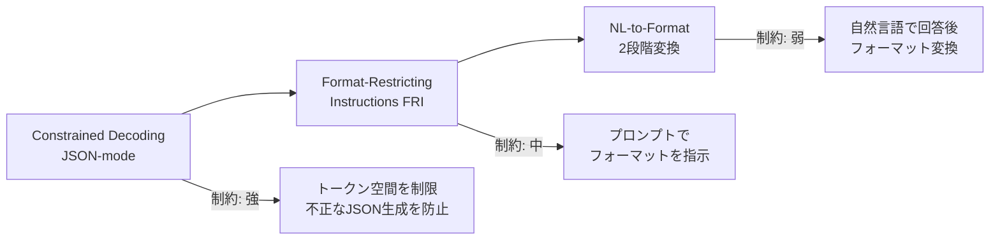

本記事は [Let Me Speak Freely? A Study on the Impact of Format Restrictions on Performance of Large Language Models](https://arxiv.org/abs/2408.02442) の解説記事です。

## 論文概要

Tam et al. (2024) は、LLMにJSON・XML・YAML等の構造化出力を強制することが推論能力に与える影響を体系的に調査した。GPT-3.5-turbo、Claude-3-Haiku、Gemini-1.5-Flash、LLaMA-3-8B-Instruct、Gemma-2-9B-Instructの5モデルを対象に、推論タスク3種・分類タスク4種の計7タスクで実験を行った結果、推論タスクではフォーマット制約によって最大63ポイントの精度低下が確認された一方、分類タスクでは逆に精度が向上するパターンが報告されている。2段階処理（NL-to-Format変換）によって推論性能を維持しつつ構造化出力を実現できることも示されている。

この記事は [Zenn記事: Portkey AI Gatewayで型安全なStructured Outputsパイプラインを構築する](https://zenn.dev/0h_n0/articles/ff1abbc7631d9f) の深掘りです。Portkey AI Gatewayでは複数プロバイダへのフォールバック構成でStructured Outputsを使うが、プロバイダごとにフォーマット制約の実装方式が異なるため、本論文の知見はパイプライン設計上の重要な判断根拠となる。

## 情報源

- **arXiv ID**: 2408.02442
- **URL**: [https://arxiv.org/abs/2408.02442](https://arxiv.org/abs/2408.02442)
- **著者**: Zhi Rui Tam, Cheng-Kuang Wu, Yi-Lin Tsai, Chieh-Yen Lin, Hung-yi Lee, Yun-Nung Chen
- **発表年**: 2024年（初版2024年8月、v3: 2024年10月）
- **分野**: cs.CL（Computation and Language）
- **ライセンス**: CC BY-SA 4.0

## 背景と動機

LLMをプロダクション環境で利用する際、下流システムとの統合のためにJSON等の構造化出力が広く採用されている。OpenAIのJSON mode、AnthropicのTool use、Google Geminiの構造化出力など、主要プロバイダはいずれも構造化出力機能を提供している。Portkey AI Gatewayのようなマルチプロバイダ統合基盤では、これらの異なる実装方式がフォールバックチェーン内で混在する。

しかし、こうしたフォーマット制約がLLMの応答品質に与える影響については、体系的な調査が不足していた。既存のフォーマット追従ベンチマーク（IFEval、INFOBENCH、FOFO等）はフォーマット遵守率を評価するものであり、フォーマット制約がタスク性能そのものを劣化させるかどうかは検証していなかった。

著者らはこの研究ギャップに対し、「フォーマット制約はLLMの推論能力を低下させるのか？ タスク種別によって影響は異なるのか？ 低下を緩和する実装パターンはあるか？」という3つの問いを設定し、5モデル・7タスクによる大規模実験で回答を試みている。

## 主要な貢献

- **貢献1**: フォーマット制約（JSON mode、FRI、制約付きデコーディング）が推論タスクの性能を大幅に低下させる一方、分類タスクでは逆に改善する場合があることを実証的に示した
- **貢献2**: 性能低下の主因がパース失敗ではなく、フォーマット制約によるモデルの推論戦略の変化（特にChain-of-Thought推論の阻害）にあることを分析した
- **貢献3**: 2段階処理（NL-to-Format変換）が推論性能を維持しつつ構造化出力を得る有効な緩和策であることを示した

## 技術的詳細

### 実験設計

著者らは構造化出力の生成方式を制約の強さに基づいて3段階に分類している。



**Constrained Decoding（JSON-mode）**: APIレベルでトークン生成空間を制約し、常に有効なJSONを出力させる方式。OpenAIの`response_format={"type": "json_object"}`やGeminiの構造化出力モードがこれに該当する。制約が最も強い。

**Format-Restricting Instructions（FRI）**: プロンプト内でJSON/XML/YAMLのスキーマを指定し、モデルに従うよう指示する方式。トークン空間の制約はないため、モデルがフォーマットに従わない場合もある。Portkey経由でPydanticスキーマを指定する場合もこの方式に近い。

**NL-to-Format（2段階変換）**: まずモデルに自然言語で回答させ、その後別の呼び出しで構造化フォーマットに変換する方式。制約が最も弱く、推論フェーズにフォーマット制約が影響しない。

### タスク分類と評価メトリクス

実験で使用されたタスクは推論タスクと分類タスクの2群に分けられる。

**推論タスク**（Exact Match評価）:
- **GSM8K**: 小学校レベルの数学文章題。多段階の算術推論が必要
- **Last Letter Concatenation**: 与えられた単語列の各末尾文字を連結する記号推論
- **Shuffled Objects**: オブジェクトのシャッフル操作を追跡する状態推論

**分類タスク**（Accuracy評価）:
- **DDXPlus**: 症状から49疾患を鑑別する医療診断分類
- **Sports Understanding**: スポーツに関する記述の妥当性判定
- **NI Task 280**: ステレオタイプ分類
- **MultiFin**: 金融テキストの5カテゴリ分類

評価にはExact MatchとAccuracyを用い、回答抽出には正規表現ではなくClaude-3-Haikuによる「完全パーサー」を採用している。これにより、フォーマット変動による誤パースを排除し、モデルの真の性能を測定している。

$$
\text{Score} = \frac{1}{|P|} \sum_{p \in P} \frac{1}{|D|} \sum_{d \in D} \mathbb{1}[\text{extract}(M(p, d)) = y_d]
$$

ここで、$P$はプロンプトバリエーション集合（9種類：タスク記述3種 $\times$ スキーマ3種）、$D$はデータセット、$M$はモデル、$y_d$は正解、$\text{extract}$はLLMベースの回答抽出関数である。9種類のプロンプトバリエーションで平均をとることで、プロンプト感度の影響を緩和している。

### スキーマ制約の影響メカニズム

著者らは性能低下の原因を特定するために、スキーマの有無による比較実験を行っている（論文Table 1）。

「JSON形式で回答せよ」という緩い指示（スキーマなし）と、具体的なキー構造を指定する厳しい指示（スキーマあり）を比較した結果、以下のことが判明した。

GSM8Kにおけるスキーマ有無の影響（論文Table 1より）:

| モデル | 自然言語 | JSON（スキーマなし） | JSON（スキーマあり） |
|--------|----------|---------------------|---------------------|
| Claude-3-Haiku | 86.51% | 86.99% | 23.44% |
| GPT-3.5-turbo | 75.99% | 74.70% | 49.25% |
| LLaMA-3-8B | 75.13% | 64.67% | 48.90% |

Claude-3-Haikuの場合、スキーマなしJSON（86.99%）は自然言語（86.51%）とほぼ同等だが、スキーマありJSON（23.44%）では63ポイントもの低下が生じている。著者らはこの原因として、スキーマで`"answer"`キーが`"reasoning"`キーより先に定義されている場合、モデルがChain-of-Thought推論を省略して直接回答を生成するパターンを指摘している。

## 実験結果

### 推論タスクの結果

推論タスクではフォーマット制約による性能低下が顕著に現れている。以下に主要な結果を示す（論文Table 6より）。

**GSM8K（数学推論）**:

| モデル | 自然言語 | JSON-mode | XML (FRI) | YAML (FRI) |
|--------|----------|-----------|-----------|------------|
| Gemini-1.5-Flash | 89.33% | 89.21% | 88.20% | 87.42% |
| GPT-3.5-turbo | 76.60% | 49.25% | 45.06% | 73.85% |
| Claude-3-Haiku | 86.51% | 23.44% | 79.76% | 80.63% |
| LLaMA-3-8B | 74.73% | 48.90% | 56.74% | 46.08% |
| Gemma-2-9B | -- | -- | -- | -- |

**Last Letter Concatenation（記号推論）**:

| モデル | 自然言語 | JSON-mode | XML (FRI) | YAML (FRI) |
|--------|----------|-----------|-----------|------------|
| Gemini-1.5-Flash | 65.45% | 77.02% | 74.17% | 71.43% |
| GPT-3.5-turbo | 56.74% | 25.20% | 22.30% | 66.87% |
| Claude-3-Haiku | 57.67% | 56.74% | 33.80% | 31.60% |
| LLaMA-3-8B | 70.07% | 28.00% | 15.93% | 16.10% |

注目すべき点として、Gemini-1.5-FlashはGSM8Kでフォーマット制約の影響をほぼ受けていない（89.33% vs 89.21%）が、GPT-3.5-turboは27ポイント、Claude-3-Haikuは63ポイントもの低下を示している。このモデル間差異は、各プロバイダの構造化出力実装方式の違いを反映している可能性がある。

### 分類タスクの結果

分類タスクでは推論タスクとは逆のパターンが観察されている（論文Table 7より）。

**DDXPlus（医療診断、49クラス分類）**:

| モデル | 自然言語 | JSON-mode | XML (FRI) | YAML (FRI) |
|--------|----------|-----------|-----------|------------|
| Gemini-1.5-Flash | 41.59% | 60.36% | 59.44% | 60.41% |
| GPT-3.5-turbo | 44.07% | 55.51% | 52.98% | 55.01% |
| Claude-3-Haiku | 33.78% | 52.04% | 50.75% | 6.91% |
| LLaMA-3-8B | 12.04% | 23.37% | 11.35% | 13.08% |

Gemini-1.5-Flashでは、自然言語の41.59%からJSON-modeの60.36%へと約19ポイント改善している。著者らは、フォーマット制約が回答空間を狭めることで、分類タスクにおいては冗長な出力や無関係な回答を抑制する効果があると分析している。

### パース失敗率の分析

著者らは性能低下の主因がパース失敗ではないことも確認している（論文Table 2より）。Last Letter ConcatenationタスクのJSON形式において、LLaMA-3-8Bのパース失敗率はわずか0.15%にとどまるが、自然言語との性能差は38.15ポイントに達する。この乖離は、フォーマット制約がトークン生成レベルでモデルの推論戦略を変化させることを強く示唆している。

### NL-to-Format 2段階変換の結果

2段階変換アプローチ（まず自然言語で回答し、次にフォーマット変換）では、ほぼ全てのモデルで自然言語と同等の推論性能が維持されている。著者らは、推論フェーズとフォーマッティングフェーズを分離することで、フォーマット制約による推論阻害を回避できると結論づけている。

## 実装のポイント

### 性能低下を緩和する実装パターン

本論文の知見から、構造化出力を利用する際の実装上の指針が導出される。

**パターン1: タスク種別に応じたフォーマット戦略の切り替え**

推論タスク（数学的計算、論理推論、状態追跡）にはNL-to-Format変換を適用し、分類タスク（カテゴリ分類、ラベル付与）にはJSON-modeを積極的に利用する。

```python
from pydantic import BaseModel
from enum import Enum

class TaskType(Enum):
    REASONING = "reasoning"
    CLASSIFICATION = "classification"

class ReasoningResult(BaseModel):
    """推論タスク用: 2段階変換で取得"""
    reasoning: str
    answer: str

class ClassificationResult(BaseModel):
    """分類タスク用: 直接JSON-modeで取得"""
    label: str
    confidence: float

def select_output_strategy(task_type: TaskType) -> dict:
    """タスク種別に基づく出力戦略の選択

    Args:
        task_type: タスクの種別

    Returns:
        出力戦略の設定辞書
    """
    if task_type == TaskType.REASONING:
        return {
            "method": "nl_to_format",
            "stage1_format": "natural_language",
            "stage2_format": "json",
            "note": "推論を自然言語で行い、後からJSON変換"
        }
    else:
        return {
            "method": "json_mode",
            "response_format": {"type": "json_object"},
            "note": "JSON-modeで回答空間を制約し精度向上"
        }
```

**パターン2: スキーマ設計における推論キーの順序制御**

JSON Schemaでは`reasoning`キーを`answer`キーより前に配置し、モデルがChain-of-Thought推論を省略するのを防ぐ。

```python
from pydantic import BaseModel, Field

class SafeReasoningSchema(BaseModel):
    """推論を先に生成させるスキーマ設計

    reasoningフィールドをanswerより前に定義することで、
    モデルにChain-of-Thought推論を強制する
    """
    reasoning: str = Field(
        ...,
        description="ステップバイステップの推論過程を記述"
    )
    answer: str = Field(
        ...,
        description="最終的な回答"
    )
```

**パターン3: 緩いスキーマ指示の活用**

厳密なスキーマ定義の代わりに「JSON形式で回答せよ」という緩い指示を使うことで、モデルの推論自由度を維持できる。論文Table 1より、Claude-3-Haikuの場合、スキーマなしJSON（86.99%）はスキーマありJSON（23.44%）に対して63ポイント優位であった。

## Production Deployment Guide

本論文の知見は、Portkey AI Gatewayをはじめとするマルチプロバイダ構成において、構造化出力のルーティング戦略に直接影響する。以下にAWS上での実装パターンを示す。

### AWS実装パターン（コスト最適化重視）

論文の知見を活かした「タスク種別判定 + フォーマット戦略切り替え」パイプラインのAWS構成を示す。

| 構成 | トラフィック | サービス構成 | 月額概算 |
|------|-------------|-------------|---------|
| Small | ~100 req/日 | Lambda (ARM64) + Bedrock + DynamoDB (On-Demand) | $50-120 |
| Medium | ~1,000 req/日 | ECS Fargate + Bedrock + ElastiCache + DynamoDB | $300-600 |
| Large | 10,000+ req/日 | EKS (Spot) + Karpenter + Bedrock + ElastiCache | $2,000-4,500 |

全構成でタスク種別判定を前段に配置し、推論タスクにはNL-to-Format 2段階呼び出し、分類タスクにはJSON-mode直接呼び出しを適用する。コスト削減にはBedrock Prompt Caching（30-90%削減）、Spot Instances（最大90%削減）、Reserved Instances（最大72%削減）が有効。

**コスト試算の注意事項**: 上記は2026年8月時点のAWS ap-northeast-1料金に基づく概算値。実際のコストはトラフィックパターンにより変動する。

### Terraformインフラコード

**Small構成（Serverless）**: Lambda + Bedrock + DynamoDB の主要リソース定義を示す。

```hcl
# Small構成: Lambda + Bedrock + DynamoDB
terraform {
  required_version = ">= 1.9"
  required_providers {
    aws = { source = "hashicorp/aws", version = "~> 5.60" }
  }
}

provider "aws" { region = "ap-northeast-1" }

# IAM: 最小権限（Bedrock InvokeModel + DynamoDB + CloudWatch Logs）
resource "aws_iam_role" "format_router_lambda" {
  name = "format-router-lambda-role"
  assume_role_policy = jsonencode({
    Version = "2012-10-17"
    Statement = [{ Action = "sts:AssumeRole", Effect = "Allow",
      Principal = { Service = "lambda.amazonaws.com" } }]
  })
}

resource "aws_iam_role_policy" "lambda_bedrock" {
  name = "bedrock-invoke"
  role = aws_iam_role.format_router_lambda.id
  policy = jsonencode({
    Version = "2012-10-17"
    Statement = [
      { Effect = "Allow", Action = ["bedrock:InvokeModel"],
        Resource = "arn:aws:bedrock:ap-northeast-1::foundation-model/anthropic.claude-3-haiku*" },
      { Effect = "Allow", Action = ["dynamodb:PutItem", "dynamodb:GetItem", "dynamodb:Query"],
        Resource = aws_dynamodb_table.format_results.arn },
      { Effect = "Allow", Action = ["logs:CreateLogGroup", "logs:CreateLogStream", "logs:PutLogEvents"],
        Resource = "arn:aws:logs:*:*:*" }
    ]
  })
}

resource "aws_dynamodb_table" "format_results" {
  name         = "format-routing-results"
  billing_mode = "PAY_PER_REQUEST"  # On-Demand: 低トラフィック向け
  hash_key     = "request_id"
  range_key    = "timestamp"
  attribute { name = "request_id"; type = "S" }
  attribute { name = "timestamp"; type = "N" }
  server_side_encryption { enabled = true }
  ttl { attribute_name = "ttl"; enabled = true }
}

resource "aws_lambda_function" "format_router" {
  function_name    = "format-strategy-router"
  runtime          = "python3.12"
  handler          = "handler.lambda_handler"
  role             = aws_iam_role.format_router_lambda.arn
  architectures    = ["arm64"]  # Graviton: x86比20%安価
  memory_size      = 256
  timeout          = 120  # NL-to-Format 2段階処理のため長め
  filename         = "lambda.zip"
  source_code_hash = filebase64sha256("lambda.zip")
  environment {
    variables = {
      DYNAMODB_TABLE                 = aws_dynamodb_table.format_results.name
      MODEL_ID                       = "anthropic.claude-3-haiku-20240307-v1:0"
      REASONING_CONFIDENCE_THRESHOLD = "0.7"
    }
  }
  tracing_config { mode = "Active" }
}
```

**Large構成（Container）**: EKS + Karpenter Spot優先構成では、`terraform-aws-modules/eks/aws` v20.24を使用し、Karpenter NodePoolで`karpenter.sh/capacity-type: ["spot", "on-demand"]`を指定してSpot優先のスケーリングを行う。Gravitonインスタンス（m7g.xlarge等）を選択し、`consolidationPolicy: WhenEmptyOrUnderutilized`でアイドルノードを30秒で回収する。AWS Budgetsで月額$5,000の上限と80%到達時のSNS通知を設定する。

### 運用・監視設定

**CloudWatch Logs Insights: フォーマット戦略別レイテンシ分析**

```
fields @timestamp, task_type, format_strategy, duration_ms, model_id
| filter format_strategy IN ["json_mode", "nl_to_format", "fri"]
| stats avg(duration_ms) as avg_latency,
        pct(duration_ms, 95) as p95_latency,
        count(*) as request_count
  by format_strategy, task_type
| sort avg_latency desc
```

**CloudWatch アラーム設定（Python boto3）**: NL-to-Format 2段階処理はトークン消費が2倍になるため、異常な増加を早期検知する。

```python
import boto3

cloudwatch = boto3.client("cloudwatch", region_name="ap-northeast-1")

def create_token_usage_alarm() -> None:
    """Bedrockトークン使用量スパイク検知アラーム"""
    cloudwatch.put_metric_alarm(
        AlarmName="bedrock-token-spike-format-router",
        MetricName="InputTokenCount",
        Namespace="AWS/Bedrock",
        Statistic="Sum",
        Period=3600,
        EvaluationPeriods=2,
        Threshold=500000,
        ComparisonOperator="GreaterThanThreshold",
        AlarmActions=["arn:aws:sns:ap-northeast-1:123456789012:ops-alerts"],
        AlarmDescription="Bedrock token usage spike: check NL-to-Format pipeline",
    )
```

**X-Ray/Cost Explorer**: `aws_xray_sdk`の`patch_all()`でboto3を自動計装し`task_type`・`format_strategy`をアノテーション記録する。Cost Explorerで日次コストを取得し$100/日超過時にSNS通知を送信する。

### コスト最適化チェックリスト

- [ ] トラフィック量でアーキテクチャ選択、NL-to-Format 2段階処理のトークン2倍コストを考慮
- [ ] Spot Instances（最大90%削減）、Reserved Instances（最大72%削減）、Lambda ARM64（20%削減）
- [ ] Bedrock Batch API（50%削減）、Prompt Caching（30-90%削減）、タスク別モデル選択
- [ ] AWS Budgets、Cost Anomaly Detection、CloudWatch アラーム、日次コストレポート
- [ ] タグ戦略、DynamoDB TTL、CloudWatch Logs保持期間30日、開発環境夜間停止

## 実運用への応用

### Portkey AI Gateway構成でのStructured Outputs設計への示唆

Portkey AI Gatewayは複数プロバイダへのフォールバックチェーンを構成できるが、本論文はプロバイダごとのフォーマット制約影響の非対称性を示している。

**設計上の注意点**:

1. **プロバイダ間のフォーマット制約影響の非対称性**: Gemini-1.5-FlashはGSM8Kで89.33%から89.21%（JSON-mode）とほぼ影響がないが、Claude-3-Haikuは86.51%から23.44%へ激減する（論文Table 6）。Portkey構成でGemini → Claudeのフォールバックを設定している場合、同一スキーマでもプロバイダによって推論品質が大幅に変わりうる

2. **タスクルーティングの導入**: Portkeyのルーティング機能とタスク種別判定を組み合わせ、推論タスクにはNL-to-Format変換パイプライン、分類タスクにはJSON-modeを適用する戦略が有効である

3. **スキーマ設計の標準化**: 全プロバイダで共通のPydanticスキーマを使う場合、`reasoning`フィールドを`answer`フィールドより前に配置する設計を標準化すべきである。これにより、どのプロバイダにフォールバックしてもChain-of-Thought推論が保持される可能性が高まる

## 関連研究

- **Wei et al. (2022), "Chain-of-Thought Prompting Elicits Reasoning in Large Language Models"**: CoTプロンプティングの先駆的研究。本論文のフォーマット制約によるCoT阻害はこの知見の裏返しである
- **Zhou et al. (2023), "Instruction-Following Evaluation for Large Language Models" (IFEval)**: フォーマット遵守能力の評価ベンチマーク。本論文は「遵守による性能劣化」という異なる視点を提供する
- **Xia et al. (2024), "FOFO: A Benchmark to Evaluate LLMs' Format-Following Capability"**: フォーマット追従能力の包括的評価。本論文との補完関係にある

## まとめと今後の展望

Tam et al. (2024) は、構造化出力が「無料のランチ」ではないことを実証的に示した。推論タスクでは最大63ポイントの精度低下が生じうる一方、分類タスクでは精度が改善する。NL-to-Format 2段階変換が有効な緩和策である。マルチプロバイダ構成ではプロバイダごとの実装差異を考慮したルーティング戦略が不可欠であり、今後はより大規模なモデルでの検証やファインチューニングによるロバスト性向上が期待される。

## 参考文献

- **arXiv**: [https://arxiv.org/abs/2408.02442](https://arxiv.org/abs/2408.02442)
- **Related Zenn article**: [https://zenn.dev/0h_n0/articles/ff1abbc7631d9f](https://zenn.dev/0h_n0/articles/ff1abbc7631d9f)
