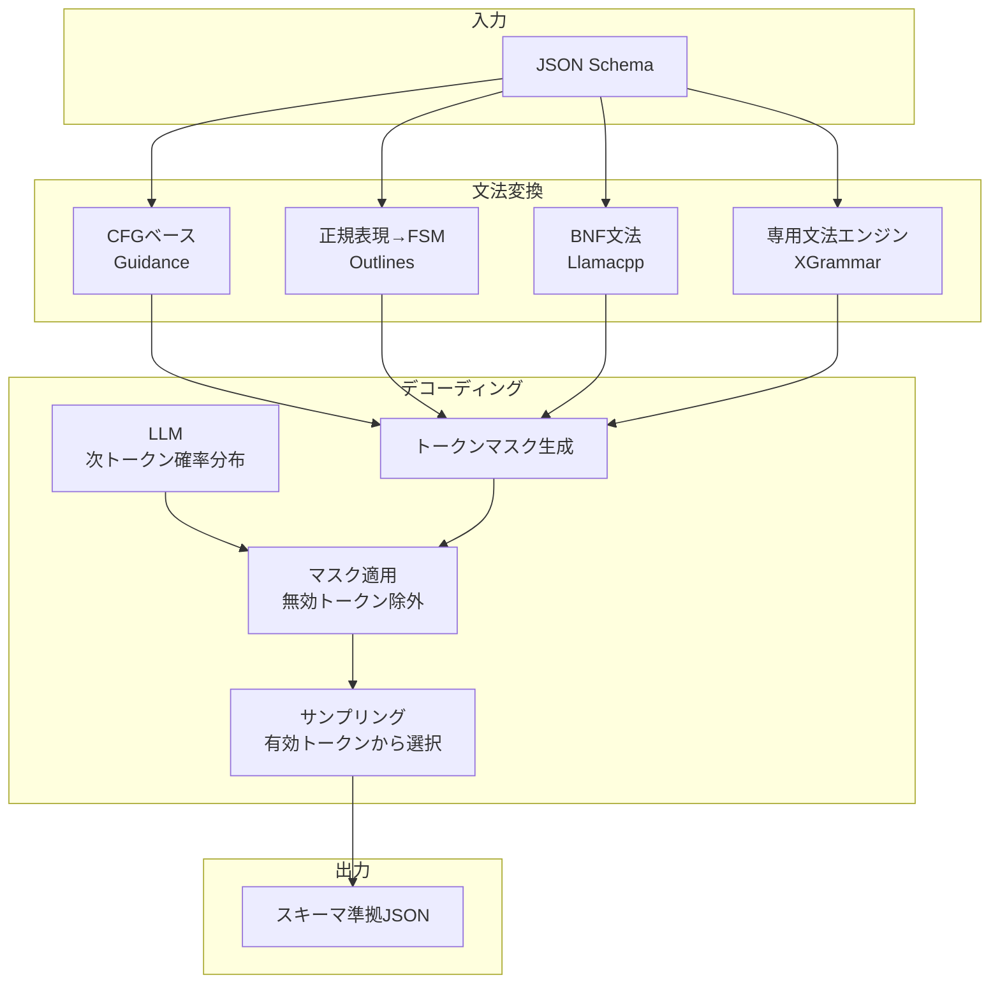

本記事は [JSONSchemaBench: A Rigorous Benchmark of Structured Outputs for Language Models](https://arxiv.org/abs/2501.10868) の解説記事です。

## 論文概要

LLMの構造化出力（Structured Outputs）は、APIレスポンスやデータパイプラインにおいて不可欠な技術となっている。しかし、制約付きデコーディングフレームワークの体系的な評価基準はこれまで存在しなかった。著者らは、Kubernetes CRDs・GitHub Actions・OpenAPI仕様など多様なドメインから収集した10,000のリアルワールドJSON Schemaで構成されるベンチマーク「JSONSchemaBench」を提案し、6つの制約付きデコーディングフレームワーク（Guidance, Outlines, Llamacpp, XGrammar, OpenAI, Gemini）を効率性・制約カバレッジ・出力品質の3次元で評価している。Guidanceが効率性・カバレッジ・品質の全次元で最良の結果を示した一方、フレームワーク間のカバレッジ差は最大3倍に達し、実運用における構造化出力の信頼性には依然として課題があることが報告されている。

## 情報源

| 項目 | 内容 |
|------|------|
| タイトル | JSONSchemaBench: A Rigorous Benchmark of Structured Outputs for Language Models |
| 著者 | Saibo Geng, Hudson Cooper, Michal Moskal, Samuel Jenkins, Julian Berman, Nathan Ranchin, Robert West, Eric Horvitz, Harsha Nori |
| arXiv ID | 2501.10868 |
| 初版投稿日 | 2025年1月18日 |
| 最新版 | 2025年2月27日（v3） |
| 分野 | cs.CL（計算言語学）, cs.AI（人工知能） |
| ライセンス | CC BY 4.0 |

## 背景と動機

LLMをAPIバックエンドやデータパイプラインに組み込む際、出力が所定のJSON Schemaに準拠することは運用上の前提条件である。しかし、LLMの確率的生成は構造的な保証を持たない。プロンプトで「JSON形式で出力してください」と指示しても、フィールドの欠落、型の不一致、スキーマ制約違反が頻繁に発生する。

この問題に対して、制約付きデコーディング（Constrained Decoding）が有力なアプローチとして普及している。生成時にJSON Schemaから導出された文法（grammar）やオートマトンでトークンをマスキングし、スキーマに準拠した出力のみを許可する手法である。OpenAI・Google・多数のオープンソースフレームワークがこの技術を採用しているが、従来の評価は個別のタスク・限定的なスキーマに偏っており、実運用で必要とされる複雑なスキーマに対する体系的な比較は行われていなかった。

著者らは以下の3つのリサーチクエスチョンを設定し、JSONSchemaBenchによって回答を試みている。

- **Q1（効率性）**: 制約付きデコーディングは生成速度にどの程度影響するか
- **Q2（カバレッジ）**: 各フレームワークはJSON Schemaの機能をどの程度サポートしているか
- **Q3（品質）**: 構造的制約は意味的な出力品質に影響するか

## 主要な貢献

著者らが報告している本論文の貢献は以下の3点である。

1. **JSONSchemaBench**: 10のサブデータセットに分類された9,558のリアルワールドJSON Schemaからなるベンチマーク。Kubernetes、GitHub Actions、OpenAPI、関数呼び出し定義など実運用ドメインを広範にカバーしている
2. **3次元の体系的評価**: 効率性（生成速度）、制約カバレッジ（スキーマ機能対応度）、出力品質（下流タスク性能）の3軸で6つのフレームワークを横断比較する評価フレームワークを確立している
3. **失敗モード分析**: 過剰制約（valid instanceの拒否）・過小制約（invalid instanceの受理）・コンパイルエラーの3種類の失敗モードを分類し、各フレームワークの設計トレードオフを明らかにしている

## 技術的詳細

### ベンチマーク設計

#### スキーマ収集と分類

著者らは6つのソースからJSON Schemaを収集し、以下のパイプラインで処理している。

1. JSON Schema仕様（Draft 2020-12）に基づくバリデーション
2. 重複スキーマの除去
3. 未解決の `$ref` 参照の解決
4. バージョン不一致の修正
5. 正規表現のエスケープ修正

最終的に9,558スキーマが10のサブデータセットに分類されている。

| データセット | 件数 | 複雑度 | 特徴 |
|:---|:---|:---|:---|
| GlaiveAI-2K | 1,707 | 関数シグネチャ | 関数呼び出し定義 |
| Github-Easy | 1,943 | 10-30フィールド | 低複雑度 |
| Github-Medium | 1,976 | 30-100フィールド | 中複雑度 |
| Kubernetes | 1,064 | 階層構造設定 | CRD定義 |
| Github-Hard | 1,240 | 100-500フィールド | 高複雑度 |
| Washington Post | 125 | リソースAPI | ANS仕様 |
| Snowplow | 403 | イベントデータ | アナリティクス |
| JSONSchemaStore | 492 | 混合ドメイン | 公開スキーマ |
| Github-Trivial | 444 | 10フィールド未満 | 主分析から除外 |
| Github-Ultra | 164 | 500フィールド超 | 将来目標 |

スキーマに含まれる制約の分布としては、`type`（基本型指定）、`properties`（オブジェクトフィールド定義）、`required`（必須フィールド指定）が最も多く、`format`キーワード（`date-time`, `email`, `uri`等）も高頻度で出現している。

#### 制約付きデコーディングの仕組み

制約付きデコーディングは、JSON Schemaから導出された形式文法を用いて、各生成ステップで無効なトークンをマスキングする技術である。主に2つのアプローチが存在する。

**CFG（Context-Free Grammar）ベース**: JSON Schemaを文脈自由文法に変換し、パーサスタックの状態に基づいて次に許可されるトークン集合を計算する。Guidanceがこの方式を採用しており、動的に制約を計算する。

**FSM（Finite State Machine）ベース**: JSON Schemaをまず正規表現に変換し、その正規表現から有限状態機械を構築する。状態遷移に基づいてトークンマスクを事前計算できるため、生成時のオーバーヘッドを削減可能である。Outlinesがこの方式を採用している。

各フレームワークの実装方式を以下に整理する。

| フレームワーク | 方式 | 特徴 |
|:---|:---|:---|
| Guidance | CFGベース動的計算 | guidance acceleration による高速化 |
| Outlines | 正規表現 → FSM | 事前コンパイルだが変換オーバーヘッド大 |
| Llamacpp | GGML BNF文法 | プリフィル中の並行コンパイル |
| XGrammar | 専用文法エンジン | コンパイルオーバーヘッドと最適化の両立 |
| OpenAI | 非公開 | 保守的な機能サポート |
| Gemini | 非公開 | 保守的な機能サポート |



### 評価メトリクス

#### 効率性メトリクス

3つの時間指標で効率性を評価している。

**Grammar Compilation Time (GCT)**: スキーマを制約表現に変換する前処理時間。

$$
\text{GCT} = t_{\text{compile\_end}} - t_{\text{compile\_start}}
$$

**Time to First Token (TTFT)**: 生成開始から最初のトークン出力までのレイテンシ。

$$
\text{TTFT} = t_{\text{first\_token}} - t_{\text{generation\_start}}
$$

**Time Per Output Token (TPOT)**: 後続トークンの平均生成速度。

$$
\text{TPOT} = \frac{t_{\text{last\_token}} - t_{\text{first\_token}}}{N_{\text{tokens}} - 1}
$$

カバレッジの差によるバイアスを排除するため、効率性メトリクスは全フレームワークがサポートするスキーマのみを対象に算出されている。

#### カバレッジメトリクス

4段階のカバレッジ定義が導入されている。

**宣言的カバレッジ（Declared Coverage）**: フレームワークがエラーやクラッシュなくスキーマを処理できる割合。

$$
C_{\text{declared}} = \frac{|\{s \in S : \text{no\_error}(f, s)\}|}{|S|}
$$

**経験的カバレッジ（Empirical Coverage）**: 生成された出力が実際にスキーマをパスする割合。

$$
C_{\text{empirical}} = \frac{|\{s \in S : \text{validate}(\text{output}(f, s), s) = \text{true}\}|}{|S|}
$$

**準拠率（Compliance Rate）**: 経験的カバレッジと宣言的カバレッジの比率で、フレームワークの信頼性を示す。

$$
\text{Compliance} = \frac{C_{\text{empirical}}}{C_{\text{declared}}}
$$

**理論的カバレッジ（Theoretical Coverage）**: ドキュメントベースでフレームワークが完全にサポートしていると評価されるJSON Schema機能の割合。

#### 品質メトリクス

制約付きデコーディングが意味的な出力品質に与える影響を、3つのタスクで評価している。

1. **Last Letter**: 名前リストから各名前の頭文字を連結する（出力: a-z文字）
2. **Shuffle Objects**: 正しい並び替え順序を選択する（出力: A-E単一文字）
3. **GSM8K**: 算数問題の回答（出力: 整数/浮動小数点数）

全タスクで `{"reasoning": "...", "answer": "..."}` のJSON形式出力を要求し、exact match精度で評価している。

## 実装のポイント

### JSON Schema対応の実務的注意点

本論文の結果は、構造化出力をプロダクションに導入する際の技術選定に直結する知見を含んでいる。

**複雑なスキーマ機能への対応**: `minItems`, `maxItems`, `enum`配列、`oneOf`/`anyOf`などの複合制約は、多くのフレームワークで正しく処理されない。OpenAIのStructured Outputsも`oneOf`や`anyOf`に制限があることが知られている。スキーマ設計時には、対象フレームワークの制約カバレッジを事前に確認する必要がある。

**コンパイルタイムアウト**: Outlinesは正規表現変換のオーバーヘッドが大きく、中程度の複雑度のスキーマでもコンパイルに数十秒を要することがある。リアルタイムAPIでは、スキーマのプリコンパイルとキャッシュが必須となる。

**過剰制約と過小制約のトレードオフ**: 安全性を優先するなら過剰制約（valid instanceを拒否するリスクを受け入れる）、カバレッジを優先するなら過小制約（invalid instanceを受理するリスクを受け入れる）となる。OpenAI・Geminiは前者、XGrammarは後者の戦略をとっていると著者らは分析している。

### スキーマバリデーション実装例

論文の評価パイプラインで使用されているスキーマバリデーションの実装パターンを示す。

```python
import json
from dataclasses import dataclass
from enum import Enum
from typing import Any

from jsonschema import Draft202012Validator, ValidationError
from jsonschema.validators import validator_for
from pydantic import BaseModel, Field


class CoverageLevel(str, Enum):
    """カバレッジ分類の列挙型

    JSONSchemaBenchで定義される4段階のカバレッジレベル。
    """

    DECLARED = "declared"
    EMPIRICAL = "empirical"
    COMPLIANCE = "compliance"
    THEORETICAL = "theoretical"


class ValidationResult(BaseModel):
    """スキーマバリデーション結果を保持するモデル

    Attributes:
        schema_id: スキーマ識別子
        is_valid: バリデーション成否
        errors: バリデーションエラーのリスト
        coverage_level: 判定されたカバレッジレベル
    """

    schema_id: str
    is_valid: bool
    errors: list[str] = Field(default_factory=list)
    coverage_level: CoverageLevel | None = None


@dataclass(frozen=True)
class SchemaValidator:
    """JSON Schema Draft 2020-12に基づくバリデータ

    JSONSchemaBenchの評価パイプラインで使用される
    スキーマバリデーションロジックを再現する。

    Attributes:
        check_format: formatキーワードのバリデーションを有効化するか
    """

    check_format: bool = True

    def validate_output(
        self,
        output: str,
        schema: dict[str, Any],
        schema_id: str,
    ) -> ValidationResult:
        """LLM出力をJSON Schemaに対してバリデーションする

        Args:
            output: LLMが生成したJSON文字列
            schema: バリデーション対象のJSON Schema
            schema_id: スキーマの識別子

        Returns:
            バリデーション結果
        """
        try:
            parsed = json.loads(output)
        except json.JSONDecodeError as e:
            return ValidationResult(
                schema_id=schema_id,
                is_valid=False,
                errors=[f"JSON parse error: {e}"],
                coverage_level=CoverageLevel.DECLARED,
            )

        validator_cls = validator_for(schema, default=Draft202012Validator)
        validator = validator_cls(
            schema,
            format_checker=(
                Draft202012Validator.FORMAT_CHECKER
                if self.check_format
                else None
            ),
        )

        errors: list[str] = []
        for error in validator.iter_errors(parsed):
            errors.append(
                f"{error.json_path}: {error.message}"
            )

        return ValidationResult(
            schema_id=schema_id,
            is_valid=len(errors) == 0,
            errors=errors,
            coverage_level=(
                CoverageLevel.EMPIRICAL
                if len(errors) == 0
                else CoverageLevel.DECLARED
            ),
        )
```

## Production Deployment Guide

JSONSchemaBenchの知見は、構造化出力パイプラインの設計・運用に直結する。以下に、AWS上で構造化出力バリデーションを組み込んだLLMパイプラインの構築パターンを示す。

### アーキテクチャ構成

論文の評価フレームワークをプロダクション環境にマッピングすると、以下の構成要素に分解できる。

| 論文の構成要素 | 役割 | AWSサービス |
|:---|:---|:---|
| LLMバックエンド | 構造化出力生成 | Amazon Bedrock / SageMaker Endpoint |
| 制約付きデコーダ | トークンマスキング | SageMaker + Guidance / vLLM + XGrammar |
| スキーマバリデータ | 出力検証 | Lambda（jsonschema） |
| カバレッジ監視 | 準拠率トラッキング | CloudWatch Custom Metrics |

トラフィック規模別の推奨構成は以下の通りである。

| 構成 | トラフィック | AWSサービス | 月額概算 |
|:---|:---|:---|:---|
| Small (~1,000 req/日) | PoC・社内ツール | Bedrock (Structured Outputs) + Lambda バリデータ | $50-200 |
| Medium (~10,000 req/日) | プロダクションAPI | Bedrock + Step Functions + ElastiCache (スキーマキャッシュ) | $500-2,000 |
| Large (100,000+ req/日) | 大規模データパイプライン | SageMaker (Guidance/vLLM) + ECS バリデータ + DynamoDB | $3,000-10,000 |

注: 上記は2026年8月時点のAWS ap-northeast-1（東京）リージョン料金に基づく概算値である。実際のコストはリクエスト頻度、スキーマ複雑度、モデル選択により変動するため、AWS料金計算ツールでの確認を推奨する。

### Terraformインフラコード

**Small構成（Bedrock + Lambda バリデータ）**:

```hcl
# 構造化出力パイプライン - Small構成
terraform {
  required_version = ">= 1.9"
  required_providers {
    aws = { source = "hashicorp/aws", version = "~> 5.60" }
  }
}

provider "aws" {
  region = "ap-northeast-1"
}

# --- Lambda (スキーマバリデーション) ---
resource "aws_lambda_function" "schema_validator" {
  function_name = "structured-output-validator"
  runtime       = "python3.12"
  handler       = "validator.handler"
  architectures = ["arm64"]
  memory_size   = 512
  timeout       = 30
  filename      = "validator.zip"
  role          = aws_iam_role.lambda_role.arn

  environment {
    variables = {
      CHECK_FORMAT    = "true"
      MAX_RETRY       = "3"
      SCHEMA_CACHE_S3 = aws_s3_bucket.schema_store.id
    }
  }
}

# --- S3 (スキーマストア) ---
resource "aws_s3_bucket" "schema_store" {
  bucket = "structured-output-schemas"
}

resource "aws_s3_bucket_versioning" "schema_versioning" {
  bucket = aws_s3_bucket.schema_store.id
  versioning_configuration {
    status = "Enabled"
  }
}

# --- Step Functions (パイプラインオーケストレーション) ---
resource "aws_sfn_state_machine" "structured_output_pipeline" {
  name     = "structured-output-pipeline"
  role_arn = aws_iam_role.sfn_role.arn

  definition = jsonencode({
    Comment = "Structured Output Generation with Validation"
    StartAt = "GenerateOutput"
    States = {
      GenerateOutput = {
        Type     = "Task"
        Resource = "arn:aws:states:::bedrock:invokeModel"
        Parameters = {
          ModelId = "anthropic.claude-sonnet-4-20250514-v1:0"
          Body = {
            "anthropic_version" = "bedrock-2023-05-31"
            "max_tokens"        = 4096
            "messages.$"        = "$.messages"
          }
          ContentType = "application/json"
        }
        Next = "ValidateSchema"
        Retry = [{
          ErrorEquals     = ["States.TaskFailed"]
          IntervalSeconds = 3
          MaxAttempts     = 2
          BackoffRate     = 2.0
        }]
      }
      ValidateSchema = {
        Type     = "Task"
        Resource = aws_lambda_function.schema_validator.arn
        Next     = "CheckValidation"
        Retry = [{
          ErrorEquals     = ["States.TaskFailed"]
          IntervalSeconds = 2
          MaxAttempts     = 1
          BackoffRate     = 1.5
        }]
      }
      CheckValidation = {
        Type = "Choice"
        Choices = [{
          Variable     = "$.is_valid"
          BooleanEquals = true
          Next         = "Success"
        }]
        Default = "RetryGeneration"
      }
      RetryGeneration = {
        Type     = "Task"
        Resource = "arn:aws:states:::bedrock:invokeModel"
        Parameters = {
          ModelId = "anthropic.claude-sonnet-4-20250514-v1:0"
          Body = {
            "anthropic_version" = "bedrock-2023-05-31"
            "max_tokens"        = 4096
            "messages.$"        = "$.retry_messages"
          }
          ContentType = "application/json"
        }
        Next = "ValidateSchemaRetry"
      }
      ValidateSchemaRetry = {
        Type     = "Task"
        Resource = aws_lambda_function.schema_validator.arn
        Next     = "Success"
      }
      Success = {
        Type = "Succeed"
      }
    }
  })
}

# --- IAM ---
resource "aws_iam_role" "sfn_role" {
  name = "structured-output-sfn-role"
  assume_role_policy = jsonencode({
    Version = "2012-10-17"
    Statement = [{
      Action    = "sts:AssumeRole"
      Effect    = "Allow"
      Principal = { Service = "states.amazonaws.com" }
    }]
  })
}

resource "aws_iam_role" "lambda_role" {
  name = "structured-output-lambda-role"
  assume_role_policy = jsonencode({
    Version = "2012-10-17"
    Statement = [{
      Action    = "sts:AssumeRole"
      Effect    = "Allow"
      Principal = { Service = "lambda.amazonaws.com" }
    }]
  })
}

resource "aws_iam_role_policy" "lambda_policy" {
  name = "structured-output-lambda-policy"
  role = aws_iam_role.lambda_role.id
  policy = jsonencode({
    Version = "2012-10-17"
    Statement = [
      {
        Effect   = "Allow"
        Action   = ["bedrock:InvokeModel"]
        Resource = "*"
      },
      {
        Effect   = "Allow"
        Action   = ["s3:GetObject", "s3:ListBucket"]
        Resource = [
          aws_s3_bucket.schema_store.arn,
          "${aws_s3_bucket.schema_store.arn}/*"
        ]
      },
      {
        Effect = "Allow"
        Action = [
          "logs:CreateLogGroup",
          "logs:CreateLogStream",
          "logs:PutLogEvents"
        ]
        Resource = "arn:aws:logs:*:*:*"
      }
    ]
  })
}
```

### バリデータ実装（Python）

論文のカバレッジ評価をプロダクション向けに適用したバリデータの実装例を示す。リトライ・メトリクス送信・スキーマキャッシュを含む。

```python
import hashlib
import json
import os
import time
from functools import lru_cache
from typing import Any

import boto3
from jsonschema import Draft202012Validator, FormatChecker
from jsonschema.validators import validator_for
from pydantic import BaseModel, Field


class StructuredOutputResult(BaseModel):
    """構造化出力のバリデーション結果

    Attributes:
        request_id: リクエスト識別子
        schema_id: スキーマ識別子
        is_valid: バリデーション成否
        errors: バリデーションエラーのリスト
        compliance_rate: 準拠率 (経験的/宣言的)
        latency_ms: バリデーション処理時間
    """

    request_id: str
    schema_id: str
    is_valid: bool
    errors: list[str] = Field(default_factory=list)
    compliance_rate: float = Field(ge=0.0, le=1.0, default=1.0)
    latency_ms: float = 0.0


cloudwatch = boto3.client("cloudwatch", region_name="ap-northeast-1")
s3 = boto3.client("s3", region_name="ap-northeast-1")


@lru_cache(maxsize=256)
def _load_schema(schema_id: str) -> dict[str, Any]:
    """S3からJSON Schemaをロードしキャッシュする

    Args:
        schema_id: スキーマ識別子（S3キー）

    Returns:
        JSON Schemaの辞書表現
    """
    bucket = os.environ["SCHEMA_CACHE_S3"]
    obj = s3.get_object(Bucket=bucket, Key=f"schemas/{schema_id}.json")
    return json.loads(obj["Body"].read().decode())


def _emit_metrics(result: StructuredOutputResult) -> None:
    """バリデーション結果をCloudWatchメトリクスとして送信する

    Args:
        result: バリデーション結果
    """
    cloudwatch.put_metric_data(
        Namespace="StructuredOutput/Validation",
        MetricData=[
            {
                "MetricName": "ValidationSuccess",
                "Value": 1.0 if result.is_valid else 0.0,
                "Unit": "None",
                "Dimensions": [
                    {"Name": "SchemaId", "Value": result.schema_id},
                ],
            },
            {
                "MetricName": "ValidationLatencyMs",
                "Value": result.latency_ms,
                "Unit": "Milliseconds",
                "Dimensions": [
                    {"Name": "SchemaId", "Value": result.schema_id},
                ],
            },
            {
                "MetricName": "ComplianceRate",
                "Value": result.compliance_rate,
                "Unit": "None",
            },
        ],
    )


def validate_structured_output(
    output: str,
    schema_id: str,
    request_id: str,
    check_format: bool = True,
) -> StructuredOutputResult:
    """LLM出力をJSON Schemaに対してバリデーションする

    JSONSchemaBenchの経験的カバレッジ評価と同等のロジックで
    出力を検証し、メトリクスを送信する。

    Args:
        output: LLMが生成したJSON文字列
        schema_id: バリデーション対象のスキーマID
        request_id: リクエスト追跡用ID
        check_format: formatキーワードのチェックを有効化するか

    Returns:
        バリデーション結果
    """
    start = time.monotonic()
    schema = _load_schema(schema_id)

    try:
        parsed = json.loads(output)
    except json.JSONDecodeError as e:
        result = StructuredOutputResult(
            request_id=request_id,
            schema_id=schema_id,
            is_valid=False,
            errors=[f"JSON parse error: {e}"],
            compliance_rate=0.0,
            latency_ms=(time.monotonic() - start) * 1000,
        )
        _emit_metrics(result)
        return result

    validator_cls = validator_for(schema, default=Draft202012Validator)
    format_checker = FormatChecker() if check_format else None
    validator = validator_cls(schema, format_checker=format_checker)

    errors = [
        f"{err.json_path}: {err.message}"
        for err in validator.iter_errors(parsed)
    ]

    result = StructuredOutputResult(
        request_id=request_id,
        schema_id=schema_id,
        is_valid=len(errors) == 0,
        errors=errors,
        compliance_rate=1.0 if len(errors) == 0 else 0.0,
        latency_ms=(time.monotonic() - start) * 1000,
    )
    _emit_metrics(result)
    return result
```

### 運用・監視設定

**CloudWatch Logs Insights: 準拠率の時系列監視**:

```
# 5分間あたりの準拠率とバリデーション失敗率を監視
fields @timestamp, schema_id, is_valid, compliance_rate
| stats count(*) as total,
        sum(case when is_valid = 1 then 1 else 0 end) as valid_count,
        avg(compliance_rate) as avg_compliance,
        percentile(latency_ms, 95) as p95_latency
  by bin(5m)
| filter total > 0
| sort @timestamp desc
```

**CloudWatch Logs Insights: スキーマ別バリデーションエラー分析**:

```
fields @timestamp, schema_id, errors
| filter is_valid = 0
| stats count(*) as failure_count
  by schema_id
| sort failure_count desc
| limit 20
```

**CloudWatch アラーム: 準拠率低下検知（Python）**:

```python
import boto3


def create_compliance_alarm() -> None:
    """準拠率が閾値を下回った場合のアラームを作成する

    JSONSchemaBenchの知見に基づき、経験的カバレッジ/宣言的カバレッジの
    比率（準拠率）が87%を下回った場合にアラートを発報する。
    87%はGuidanceの最低準拠率に相当する。
    """
    cloudwatch = boto3.client("cloudwatch", region_name="ap-northeast-1")
    cloudwatch.put_metric_alarm(
        AlarmName="StructuredOutput-ComplianceRateDrop",
        MetricName="ComplianceRate",
        Namespace="StructuredOutput/Validation",
        Statistic="Average",
        Period=300,
        EvaluationPeriods=3,
        Threshold=0.87,
        ComparisonOperator="LessThanThreshold",
        AlarmActions=["arn:aws:sns:ap-northeast-1:ACCOUNT_ID:ops-alerts"],
        AlarmDescription=(
            "Structured output compliance rate dropped below 87%. "
            "Reference: JSONSchemaBench Guidance minimum compliance."
        ),
    )
```

### コスト最適化チェックリスト

**アーキテクチャ選択**:
- [ ] リクエスト頻度に応じた構成（Serverless/Hybrid/専用エンドポイント）を選定
- [ ] スキーマ複雑度に応じたフレームワーク選択（Simple: Bedrock Structured Outputs、Complex: Guidance on SageMaker）

**リソース最適化**:
- [ ] スキーマのプリコンパイルとキャッシュ（Outlinesのコンパイルタイムアウト対策）
- [ ] Lambda: バリデーションのメモリとタイムアウトをスキーマ複雑度に応じて調整
- [ ] Bedrock: Provisioned Throughputの利用を検討（高頻度利用時）

**品質保証**:
- [ ] 準拠率のベースラインを記録し、フレームワーク更新時の品質回帰を検知
- [ ] 過剰制約・過小制約の失敗モードを分類し、ドメインに応じた戦略を選択
- [ ] JSONSchemaBenchのテストスイートを活用し、新規スキーマのカバレッジを事前検証

## 実験結果

### 効率性

NVIDIA A100-SXM4-80GB上でLlama-3.1-8B-Instruct（Q8ビット量子化、128Kボキャブラリ）を用いた効率性評価の結果を以下に示す。

**Grammar Compilation Time（中央値）**:

| フレームワーク | GlaiveAI-2K | Github-Easy | Github-Medium |
|:---|:---|:---|:---|
| Guidance | ~0.01s | ~0.03s | ~0.06s |
| Llamacpp | ~0.01s | ~0.02s | ~0.05s |
| XGrammar | ~0.12s | ~0.18s | ~0.30s |
| Outlines | ~3.48s | ~7.50s | ~12.77s |

**Time Per Output Token（TPOT）**:

| フレームワーク | TPOT |
|:---|:---|
| Guidance | 6.37-9.47ms |
| LM-only（制約なし） | 15-17ms |
| Llamacpp | 27-29ms |
| Outlines | 30-82ms |

著者らは、Guidanceが制約なしの生成と比較して50-60%の高速化を達成していると報告している。これはguidance accelerationと呼ばれる機構によるもので、制約から確定的に決まるトークン（例: JSONの構文文字 `{`, `"`, `:` 等）をLLM推論なしで直接出力することで実現される。一方、他のフレームワークはベースラインと同等かそれ以上のレイテンシオーバーヘッドを示している。

### カバレッジ

Llama-3.2-1B-Instructを用いたデータセット別の経験的カバレッジを以下に示す。

| データセット | Guidance | Llamacpp | Outlines | XGrammar | OpenAI | Gemini |
|:---|:---|:---|:---|:---|:---|:---|
| GlaiveAI-2K | 96% | 95% | 95% | 93% | 89% | 86% |
| Github-Easy | 86% | 75% | 59% | 79% | 29% | 7% |
| Github-Medium | 69% | 57% | 29% | 52% | 12% | - |
| Github-Hard | 41% | 39% | 3% | 28% | 9% | - |
| JsonSchemaStore | 30% | 38% | 9% | 33% | 6% | - |

関数呼び出し定義のような単純なスキーマ（GlaiveAI-2K）ではフレームワーク間の差異は小さいが、フィールド数が100を超えるスキーマ（Github-Hard）では最大14倍（Guidance 41% vs Outlines 3%）の差が生じている。OpenAI・Geminiはサポートするスキーマ機能を保守的に制限しているため、複雑なスキーマでのカバレッジが低い。

**準拠率（Empirical / Declared）**:

| フレームワーク | 準拠率範囲 | 特性 |
|:---|:---|:---|
| Guidance | 87-100% | 高信頼性 |
| OpenAI | 88-100% | 保守的戦略 |
| Gemini | 88-100% | 保守的戦略 |
| Llamacpp | 60-98% | 中程度 |
| XGrammar | 50-95% | 過小制約リスク |
| Outlines | 6-96% | タイムアウトで信頼性低下 |
| LM-only | 13-90% | 制約なしでは不安定 |

### JSON Schema Test Suiteカバレッジ

43の機能カテゴリに対するテストスイートカバレッジの概要を以下に示す。

| カバレッジレベル | Outlines | Llamacpp | XGrammar | Guidance |
|:---|:---|:---|:---|:---|
| 完全（100%） | 0 | 1 | 1 | 13 |
| 高（75%超） | 0 | 2 | 1 | 17 |
| 中（50%超） | 2 | 5 | 3 | 21 |
| 部分的（25%超） | 11 | 11 | 16 | 25 |

Guidanceが43カテゴリ中13カテゴリで100%カバレッジを達成している一方、Outlinesは100%カバレッジのカテゴリがゼロである。

### 失敗モード分析

| 失敗モード | Outlines | Llamacpp | XGrammar | Guidance |
|:---|:---|:---|:---|:---|
| 過剰制約（valid拒否） | 16カテゴリ | 18カテゴリ | - | 7カテゴリ |
| 過小制約（invalid受理） | - | - | 38カテゴリ | 1カテゴリ |
| コンパイルエラー | 42カテゴリ | 37カテゴリ | 3カテゴリ | 25カテゴリ |

XGrammarは過小制約（38カテゴリでinvalid instanceを受理）が顕著であり、出力がスキーマに準拠しているように見えても実際には制約を満たしていないケースが多い。一方、Outlines・Llamacppは過剰制約（valid instanceの拒否）とコンパイルエラーが主な失敗モードであり、安全側に倒れる傾向がある。

### 品質

Llama-3.1-8B-Instructを用いた3タスクでのexact match精度を以下に示す。

| タスク | LM-only | XGrammar | Llamacpp | Outlines | Guidance |
|:---|:---|:---|:---|:---|:---|
| Last Letter | 50.7% | 51.2% | 52.0% | 53.3% | 54.0% |
| Shuffle Objects | 52.6% | 52.7% | 52.6% | 53.0% | 55.9% |
| GSM8K | 80.1% | 83.7% | 82.4% | 81.6% | 83.8% |

制約付きデコーディングは全タスクでLM-only（制約なし）を上回り、最大3.7%の精度改善が報告されている。Guidanceが全タスクで最良の結果を示しており、著者らはこれをtoken-healing実装（トークン境界の修復機構）に起因すると分析している。構造的制約が意味的品質を損なうのではなく、むしろ改善するという結果は、「制約付きデコーディングは精度を犠牲にする」という一般的な懸念を否定するものである。

## 実運用への応用

### Zenn記事のPortkey構成との関係

Zenn記事「Portkey AI Gatewayで型安全なStructured Outputsパイプラインを構築する」では、Portkey AI Gatewayを用いたLLMの構造化出力パイプラインが扱われている。Portkeyは複数のLLMプロバイダを統一APIで抽象化するゲートウェイであり、OpenAIのStructured Outputs機能をそのまま利用できる。

本論文の知見をPortkey構成に適用する際、以下の点が重要となる。

1. **プロバイダ間のカバレッジ差**: 論文はOpenAI・Geminiの構造化出力機能が保守的な機能制限を持つことを定量的に示している。Portkeyでフォールバック先を切り替える際、プロバイダごとのJSON Schemaカバレッジ差を考慮する必要がある。`oneOf`や`anyOf`を含むスキーマは、フォールバック先によっては正しく処理されない可能性がある
2. **準拠率の監視**: 論文で定義された準拠率（経験的カバレッジ/宣言的カバレッジ）をPortkeyのオブザーバビリティ機能と組み合わせることで、プロバイダ切り替え時の品質劣化を早期に検知できる
3. **スキーマ設計指針**: 複雑なスキーマ（100フィールド超、ネストした`$ref`、`minItems`/`maxItems`制約）は全プロバイダで安定しない。Portkeyのルーティングで複数プロバイダを利用する場合、スキーマを全プロバイダの共通サポート範囲に収めるか、プロバイダごとにスキーマを分岐させる設計が求められる

### 導入時のチェックポイント

1. 対象スキーマの複雑度を評価し、JSONSchemaBenchのデータセット分類（Trivial/Easy/Medium/Hard/Ultra）を参考にフレームワーク選択の指針とする
2. 制約付きデコーディングのコンパイルタイムアウト（論文では40秒に設定）を超えるスキーマがないか事前検証する
3. 過剰制約・過小制約のトレードオフを明確にし、ドメイン要件（データ整合性重視 vs カバレッジ重視）に応じた戦略を選択する
4. プロダクション導入前にJSON Schema Test Suiteの関連テストケースで対象フレームワークのカバレッジを確認する

## 関連研究

- **Structured Output Benchmark (SOB)** (2024): 構造化出力の品質を評価する別アプローチのベンチマーク。JSONSchemaBenchがスキーマ準拠性に焦点を当てるのに対し、SOBは意味的な出力品質を重視している点で相補的である
- **Outlines** (Willard & Louf, 2023): 正規表現ベースの制約付きデコーディングフレームワーク。JSON Schemaを正規表現に変換するアプローチの先駆的実装であり、本論文の評価対象の一つでもある
- **XGrammar** (2024): 専用文法エンジンによる制約付きデコーディング。コンパイルエラーが少ない（3カテゴリ）一方で過小制約（38カテゴリ）が顕著という、他フレームワークとは異なるトレードオフを示している

## まとめと今後の展望

著者らは、10,000のリアルワールドJSON Schemaからなるベンチマークにより、制約付きデコーディングフレームワークの性能が効率性・カバレッジ・品質の全次元で大きく異なることを定量的に示している。Guidanceが全次元で最良の結果を達成した一方、最も複雑なスキーマ（Github-Hard）ではGuidanceでさえ41%のカバレッジにとどまり、構造化出力技術には依然として改善の余地がある。

制約付きデコーディングが精度を犠牲にするという懸念は否定され、むしろ全タスクで品質改善が確認された点は実運用にとって重要な知見である。ただし、著者自身が認める通り、経験的カバレッジは単一モデルのグリーディデコーディング（top-1）のみで計測されており、ビームサーチやサンプリングを用いた場合の結果は未検証である。また、クローズドソースモデル（OpenAI, Gemini）は異なる基盤モデルで評価されているため、フレームワーク間の厳密な比較には限界がある。

JSONSchemaBenchはGitHub（[https://github.com/guidance-ai/jsonschemabench](https://github.com/guidance-ai/jsonschemabench)）で公開されており、新たなフレームワークやモデルの評価に利用できる。

## 参考文献

- **arXiv**: [https://arxiv.org/abs/2501.10868](https://arxiv.org/abs/2501.10868)
- **GitHub**: [https://github.com/guidance-ai/jsonschemabench](https://github.com/guidance-ai/jsonschemabench)
- **JSON Schema Test Suite**: [https://github.com/json-schema-org/JSON-Schema-Test-Suite](https://github.com/json-schema-org/JSON-Schema-Test-Suite)
- **Related Zenn article**: [https://zenn.dev/0h_n0/articles/ff1abbc7631d9f](https://zenn.dev/0h_n0/articles/ff1abbc7631d9f)
