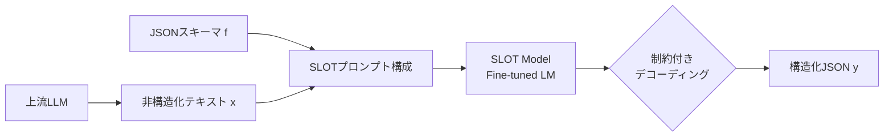
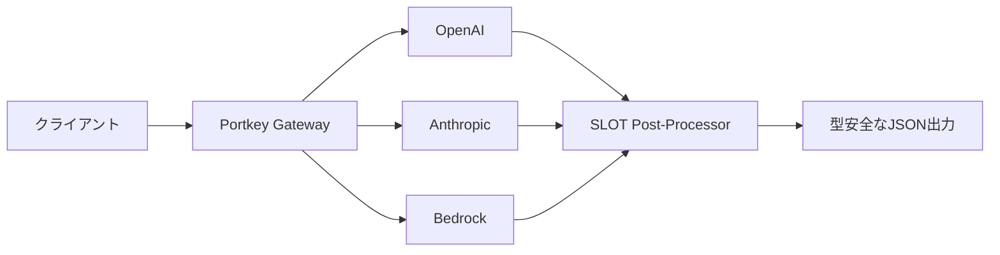

本記事は [SLOT: Structuring the Output of Large Language Models](https://arxiv.org/abs/2505.04016) の解説記事です。

## 論文概要

LLMの構造化出力は、API連携やデータパイプラインにおいて不可欠だが、事前定義されたJSONスキーマからの逸脱が信頼性の高いアプリケーション開発を妨げている。著者らはSLOT（Structuring the Output of Large Language Models）を提案し、ファインチューニングした軽量言語モデルをポストプロセッシングレイヤーとして配置することで、任意のLLM出力を所望のスキーマに変換するモデル非依存のフレームワークを構築している。Mistral-7BベースのSLOTにXGrammarを組み合わせた構成がスキーマ精度99.5%・コンテンツ類似度94.0%を達成し、Claude-3.5-Sonnetのプロンプティングベース手法（スキーマ精度74.7%）を大幅に上回ることが報告されている。

この記事は [Zenn記事: Portkey AI Gatewayで型安全なStructured Outputsパイプラインを構築する](https://zenn.dev/0h_n0/articles/ff1abbc7631d9f) の深掘りです。

## 情報源

| 項目 | 内容 |
|------|------|
| タイトル | SLOT: Structuring the Output of Large Language Models |
| 著者 | Darren Yow-Bang Wang, Zhengyuan Shen, Soumya Smruti Mishra et al. |
| arXiv ID | 2505.04016 |
| 初版投稿日 | 2025年5月6日 |
| 分野 | cs.CL（計算言語学）, cs.AI（人工知能）, cs.LG（機械学習） |
| ライセンス | CC BY 4.0 |

## 背景と動機

LLMが生成するテキストを構造化データ（JSON、XML等）として利用する需要は急速に拡大している。APIレスポンスの型安全性確保、関数呼び出しの引数構造化、データ抽出パイプラインの出力整形など、実運用では構造化出力の信頼性が直接的にシステムの堅牢性に影響する。

従来のアプローチには大きく3つの系統がある。第一に、プロンプトエンジニアリングによる出力制御だが、これはモデルの確率的生成に依存するため完全なスキーマ準拠を保証できない。第二に、OutlinesやXGrammarに代表される制約付きデコーディングだが、これらはデコーディング時に文法制約を課すためモデルのAPI仕様に依存し、プロプライエタリモデルには適用が困難である。第三に、ポストトレーニング（ファインチューニング）だが、タスクごとに個別の学習が必要となりスケーラビリティに欠ける。

著者らはこれらの限界を踏まえ、LLMの出力後段に軽量モデルを配置する「ポストプロセッシング」という第四のアプローチを提案している。この設計により、上流のLLMがどのモデル・プロバイダーであっても一貫した構造化出力が得られるモデル非依存性を実現している。

## 主要な貢献

著者らが報告している本論文の貢献は以下の3点である。

1. **SLOTフレームワーク**: 非構造化テキストとターゲットスキーマを入力とし、スキーマ準拠のJSON出力を生成するモデル非依存・タスク非依存のポストプロセッシングレイヤー。任意のLLMの後段に配置でき、制約付きデコーディングとの併用も可能
2. **体系的データパイプライン**: 126,000件の合成学習データを5つの多様性次元で生成するキュレーション手法と、スキーマ精度・コンテンツ類似度の2軸による形式的な評価方法論の確立
3. **リソース制約環境での性能実証**: Llama-3.2-1Bのような1Bパラメータモデルでもスキーマ精度88.9%を達成し、大型プロプライエタリモデルと同等の構造化出力能力をコンパクトモデルで実現できることの実証

## 技術的詳細

### 問題定式化

SLOTは以下のように定式化される。LLMが生成した非構造化テキスト $x$ とフォーマット仕様（JSONスキーマ） $f$ が与えられたとき、モデル $M_\theta$ は構造化出力 $y$ を生成する。最適化対象は条件付き確率である。

$$
\hat{y} = \arg\max_{y} P(y \mid x, f; \theta)
$$

ここで、

- $x$: 上流LLMの非構造化テキスト出力
- $f$: ターゲットJSONスキーマ（キー名、値の型、ネスト構造を定義）
- $\theta$: SLOTモデルのパラメータ
- $y$: スキーマ準拠の構造化出力

この定式化の重要な点は、フォーマッティング機能を上流LLMから分離している点にある。上流LLMは内容生成のみに専念し、SLOTがフォーマット変換を担当する。

### SLOTアーキテクチャ

SLOTのパイプラインは以下の構成をとる。



SLOTモデルへの入力プロンプトは以下の形式で構成される。

```
Convert text to JSON per schema.
Text: {input_text}
JSON format: {json_schema}
Output ONLY the JSON structure.
Output:
```

学習時には標準的な因果言語モデリング損失を用い、入力プロンプト部分をマスクしてターゲット出力トークンのみに対して損失を計算する。

$$
\mathcal{L}(\theta) = -\sum_{i=1}^{T} \log P(y_i \mid y_{<i}, x, f; \theta)
$$

ここで $T$ はターゲット出力のトークン数、$y_{<i}$ は位置 $i$ より前のターゲットトークン列を表す。

### ファインチューニングパイプライン

著者らはLoRA（Low-Rank Adaptation）を用いた効率的なファインチューニングを採用している。論文Table 4に記載されたハイパーパラメータは以下の通りである。

| パラメータ | 値 |
|-----------|-----|
| 学習率 | 1e-5 |
| エポック数 | 2 |
| バッチサイズ | 2（デバイスあたり） |
| 勾配累積ステップ | 2 |
| コンテキスト長 | 16,384トークン |
| LoRAランク | 32 |
| LoRA alpha | 64 |
| LoRA dropout | 0.05 |
| オプティマイザ | paged_adamw_32bit |
| 最大勾配ノルム | 0.1 |

チェックポイント選択は、650件のWikiBio検証インスタンスに対するスキーマ精度とコンテンツ類似度のバランスメトリクスに基づいて行われている。

### データキュレーション・合成手法

学習データの構築は、SLOTの汎化性能を左右する重要な設計要素である。著者らは以下の多層的アプローチを採用している。

**公開データセットの再利用（テスト用9,126件）**:

| データセット | 件数 | 特徴 |
|-------------|------|------|
| WebNLG | 2,779 | DBpediaトリプルからテキストへの変換 |
| E2E NLG | 2,347 | レストラン属性ペア |
| WikiBio | 2,500 | 伝記インフォボックスの変換 |
| ToTTo | 500 | テーブルからテキストへの抽出 |
| HF GitHub Issues | 1,000 | 技術的複雑性の高い実データ |

**合成学習データ（126,000件）**: Claude-3.5-Sonnetを用いて5つの多様性次元で生成される。

1. **業種（Industry vertical）**: 30カテゴリ（金融、医療、製造等）
2. **JSON複雑度（Complexity）**: 10レベル（単純なフラット構造からネスト構造まで）
3. **テキスト長（Text length）**: 10段階の範囲
4. **ジャンル（Genre）**: 40スタイル（技術文書、ニュース、会話等）
5. **テキスト型（Text type）**: 10構造パターン

データ品質は二段階バリデーションで担保される。第一段階でJSON形式の妥当性チェック、第二段階でLLMベースの内容整合性検証が実行される。

著者らはJSON複雑度を7次元で定量化している。depth（ネスト深度）、key count（キー数）、byte size（バイトサイズ）、element count（要素数）、cyclomatic complexity（循環的複雑度）、schema complexity（スキーマ複雑度）、content complexity（コンテンツ複雑度）である。論文Figure 2で合成データが公開データセットと同等以上の複雑度を達成していることが示されている。

### 評価メトリクス

著者らは2つの評価軸を定義している。

**スキーマ精度（Schema Accuracy: $A_s$）**: 生成されたJSON出力 $y'$ がターゲットスキーマ $f$ のキー文字列と値の型に完全一致するかを判定するバイナリメトリクスである。

**コンテンツ類似度（Content Similarity: $\text{sim}_C$）**: Sentence-BERTを用いたソフトマッチングに基づく調和平均で定義される。

$$
\text{sim}_C(y, y') = \frac{2 \cdot \text{sim}_P(y, y') \cdot \text{sim}_R(y, y')}{\text{sim}_P(y, y') + \text{sim}_R(y, y')}
$$

ここで、

- $\text{sim}_P(y, y')$: ソフト適合率 — 生成された各値をSentence-BERTで正解値とスコアリングし、最大類似度の平均をとる
- $\text{sim}_R(y, y')$: ソフト再現率 — 正解側の各値について生成値との最大類似度の平均をとる
- $y$: 正解構造化出力
- $y'$: モデルが生成した構造化出力

この設計により、キーの並び順や値の表現揺れに対するロバストな評価が可能となる。F1スコアと同様に適合率と再現率の調和平均をとることで、部分的な生成（高適合率・低再現率）と過剰生成（低適合率・高再現率）のいずれも適切にペナライズする。

### 推論パイプライン

推論時にはvLLMフレームワークが使用され、以下の設定で実行される。

| パラメータ | 値 |
|-----------|-----|
| 最大生成長 | 2,048トークン |
| Temperature | 0（貪欲デコーディング） |
| Top-p | 0.9 |
| 生成タイムアウト | 60秒 |
| GPUメモリ使用率 | 0.8 |

SFTモデル単体での推論に加え、XGrammarやOutlinesといった制約付きデコーディングエンジンとの併用が可能である。著者らの実験では、XGrammarとの組み合わせが最高性能を達成している。

## 実装のポイント

SLOTを実装する際の主要な設計判断と注意点を以下に整理する。

**モデル選択基準**: 著者らの結果に基づくと、Mistral-7BがSLOTのベースモデルとして最良のバランスを示している。1Bモデル（Llama-3.2-1B）でもスキーマ精度88.9%を達成しており、レイテンシ制約が厳しい環境では有力な選択肢となる。3Bモデル（Llama-3.2-3B）はスキーマ精度94.7%で、コストと性能のトレードオフが取りやすい。

**制約付きデコーディングの併用**: SFTモデル単体でもスキーマ精度98.2%を達成するが、XGrammarとの組み合わせで99.5%まで向上する。XGrammarは複雑なネスト構造に強く、Outlinesは単純なスキーマでの効率性に優れる。プロダクション環境ではスキーマの複雑度に応じて使い分けることが推奨される。

**LoRA設定の再現**: ランク32・alpha 64の設定は、7Bモデルで構造化出力タスクに十分な表現力を提供する。著者らの設定ではdropout 0.05が採用されており、過学習を軽度に抑制している。

```python
from peft import LoraConfig, get_peft_model
from transformers import AutoModelForCausalLM

def create_slot_model(base_model_name: str) -> AutoModelForCausalLM:
    """SLOTモデルのLoRA設定を適用する

    Args:
        base_model_name: ベースモデル名（例: "mistralai/Mistral-7B-v0.1"）

    Returns:
        LoRA適用済みモデル
    """
    model = AutoModelForCausalLM.from_pretrained(
        base_model_name,
        torch_dtype="auto",
        device_map="auto",
    )

    lora_config = LoraConfig(
        r=32,           # LoRAランク
        lora_alpha=64,  # スケーリング係数
        lora_dropout=0.05,
        target_modules=["q_proj", "k_proj", "v_proj", "o_proj"],
        task_type="CAUSAL_LM",
    )

    model = get_peft_model(model, lora_config)
    return model
```

**プロンプト設計**: SLOTの入力プロンプトは極めてシンプルに設計されている。これは学習データの多様性でカバーする方針であり、プロンプトの複雑化は避けるべきである。

```python
def build_slot_prompt(text: str, json_schema: dict) -> str:
    """SLOTモデル用の入力プロンプトを構成する

    Args:
        text: 上流LLMの非構造化テキスト出力
        json_schema: ターゲットJSONスキーマ

    Returns:
        SLOTモデルへの入力プロンプト
    """
    import json

    schema_str = json.dumps(json_schema, indent=2)
    return (
        "Convert text to JSON per schema.\n"
        f"Text: {text}\n"
        f"JSON format: {schema_str}\n"
        "Output ONLY the JSON structure.\n"
        "Output:"
    )
```

## Production Deployment Guide

SLOTは軽量モデルをポストプロセッシングとして配置するアーキテクチャであり、推論サービスの構築が必要となる。以下では、AWS上でSLOTを運用するための具体的な構成を示す。

### AWS実装パターン（コスト最適化重視）

**トラフィック量別の推奨構成**:

| 構成 | トラフィック | サービス構成 | 月額概算 |
|------|------------|------------|---------|
| Small | ~100 req/日 | SageMaker Serverless + S3 | $80-200 |
| Medium | ~1,000 req/日 | SageMaker Real-time (ml.g5.xlarge) + ElastiCache | $400-900 |
| Large | 10,000+ req/日 | EKS + Karpenter + Spot g5.xlarge | $2,500-5,500 |

**Small構成（~100 req/日）**: SageMaker Serverless Inferenceを用いてSLOTモデル（Llama-3.2-1B + LoRAアダプター）をホストする。コールドスタートが許容できる低頻度利用に適する。S3にモデルアーティファクトを格納し、推論時にロードする。月額コスト内訳はSageMaker Serverless $50-120、S3 $5-10、CloudWatch $10-20程度である。

**Medium構成（~1,000 req/日）**: SageMaker Real-time Endpointにml.g5.xlargeインスタンス（NVIDIA A10G GPU、24GB VRAM）を1台配置する。Mistral-7Bモデルを常時ロードし、vLLMでバッチ推論を行う。ElastiCacheでスキーマ定義をキャッシュし、繰り返しリクエストのレイテンシを削減する。月額コスト内訳はSageMaker ml.g5.xlarge $300-500、ElastiCache $50-100、CloudWatch $20-30程度である。

**Large構成（10,000+ req/日）**: EKS上にvLLMサービングコンテナをデプロイし、Karpenterによる自動スケーリングでSpot Instancesを優先利用する。複数のg5.xlargeノードで水平スケールし、ALBでリクエストを分散する。月額コスト内訳はEKSコントロールプレーン $75、Spot g5.xlarge 2-5台 $800-2,000、ALB $50-100、監視 $100-200程度である。

**コスト削減テクニック**:
- Spot Instances活用: g5.xlargeのSpot価格はオンデマンド比で最大70%削減（2026年8月時点のap-northeast-1リージョン概算）
- SageMaker Savings Plans: 1年コミットで最大64%削減
- 1Bモデル選択: Mistral-7B比でGPUメモリ要件が1/7となり、ml.g5.xlargeからml.g5.smallへのダウングレードが可能
- バッチ推論: 同一スキーマのリクエストをバッチ化し、vLLMのcontinuous batchingで効率化

注意: 上記コスト試算は2026年8月時点のAWS ap-northeast-1（東京）リージョン料金に基づく概算値である。実際のコストはトラフィックパターン、リージョン、バースト使用量により変動するため、最新料金はAWS料金計算ツールで確認を推奨する。

### Terraformインフラコード

**Small構成（SageMaker Serverless）**:

```hcl
# SageMaker Serverless Inference for SLOT (1B model)
# terraform apply で即デプロイ可能

resource "aws_iam_role" "slot_sagemaker" {
  name = "slot-sagemaker-execution-role"

  assume_role_policy = jsonencode({
    Version = "2012-10-17"
    Statement = [{
      Action = "sts:AssumeRole"
      Effect = "Allow"
      Principal = { Service = "sagemaker.amazonaws.com" }
    }]
  })
}

# 最小権限: S3読み取り + CloudWatch Logs書き込みのみ
resource "aws_iam_role_policy" "slot_sagemaker_policy" {
  name = "slot-sagemaker-policy"
  role = aws_iam_role.slot_sagemaker.id

  policy = jsonencode({
    Version = "2012-10-17"
    Statement = [
      {
        Effect   = "Allow"
        Action   = ["s3:GetObject", "s3:ListBucket"]
        Resource = [
          aws_s3_bucket.model_artifacts.arn,
          "${aws_s3_bucket.model_artifacts.arn}/*"
        ]
      },
      {
        Effect   = "Allow"
        Action   = ["logs:CreateLogGroup", "logs:CreateLogStream", "logs:PutLogEvents"]
        Resource = "arn:aws:logs:*:*:*"
      }
    ]
  })
}

# モデルアーティファクト格納用S3（KMS暗号化）
resource "aws_s3_bucket" "model_artifacts" {
  bucket = "slot-model-artifacts-${data.aws_caller_identity.current.account_id}"
}

resource "aws_s3_bucket_server_side_encryption_configuration" "model_artifacts" {
  bucket = aws_s3_bucket.model_artifacts.id

  rule {
    apply_server_side_encryption_by_default {
      sse_algorithm = "aws:kms"
    }
  }
}

resource "aws_sagemaker_model" "slot" {
  name               = "slot-llama-1b"
  execution_role_arn = aws_iam_role.slot_sagemaker.arn

  primary_container {
    image          = "763104351884.dkr.ecr.ap-northeast-1.amazonaws.com/huggingface-pytorch-inference:2.1-transformers4.36-gpu-py310-cu121-ubuntu20.04"
    model_data_url = "s3://${aws_s3_bucket.model_artifacts.id}/slot-llama-1b/model.tar.gz"
  }
}

# Serverless: コールドスタート許容、コスト最小化
resource "aws_sagemaker_endpoint_configuration" "slot_serverless" {
  name = "slot-serverless-config"

  production_variants {
    variant_name = "default"
    model_name   = aws_sagemaker_model.slot.name

    serverless_config {
      memory_size_in_mb = 6144   # 6GB: 1Bモデル + vLLM
      max_concurrency   = 5      # 同時リクエスト数
    }
  }
}

resource "aws_sagemaker_endpoint" "slot" {
  name                 = "slot-serverless-endpoint"
  endpoint_config_name = aws_sagemaker_endpoint_configuration.slot_serverless.name
}
```

**Large構成（EKS + Karpenter + Spot）**:

```hcl
# EKS + Karpenter for SLOT (7B model, high-traffic)

module "eks" {
  source  = "terraform-aws-modules/eks/aws"
  version = "~> 20.0"

  cluster_name    = "slot-production"
  cluster_version = "1.30"

  vpc_id     = module.vpc.vpc_id
  subnet_ids = module.vpc.private_subnets

  # パブリックアクセス最小化
  cluster_endpoint_public_access = false

  eks_managed_node_groups = {
    system = {
      instance_types = ["m6i.large"]
      min_size       = 2
      max_size       = 3
      desired_size   = 2
    }
  }
}

# Karpenter: Spot優先で自動スケーリング
resource "kubectl_manifest" "karpenter_nodepool" {
  yaml_body = yamlencode({
    apiVersion = "karpenter.sh/v1"
    kind       = "NodePool"
    metadata   = { name = "slot-gpu" }
    spec = {
      template = {
        spec = {
          requirements = [
            { key = "karpenter.sh/capacity-type", operator = "In", values = ["spot", "on-demand"] },
            { key = "node.kubernetes.io/instance-type", operator = "In", values = ["g5.xlarge", "g5.2xlarge"] },
          ]
          nodeClassRef = { name = "default" }
        }
      }
      limits   = { cpu = "64", "nvidia.com/gpu" = "8" }
      # Spot優先: weight指定でSpot > On-Demand
      disruption = {
        consolidationPolicy = "WhenEmptyOrUnderutilized"
        consolidateAfter    = "30s"
      }
    }
  })
}

# Secrets Manager: モデル設定の安全な管理
resource "aws_secretsmanager_secret" "slot_config" {
  name       = "slot/model-config"
  kms_key_id = aws_kms_key.slot.arn
}

resource "aws_secretsmanager_secret_version" "slot_config" {
  secret_id = aws_secretsmanager_secret.slot_config.id
  secret_string = jsonencode({
    model_name     = "mistralai/Mistral-7B-v0.1"
    lora_adapter   = "s3://slot-model-artifacts/slot-mistral-7b-lora/"
    max_model_len  = 16384
    gpu_memory_util = 0.8
  })
}

# AWS Budgets: 月額予算アラート
resource "aws_budgets_budget" "slot_monthly" {
  name         = "slot-monthly-budget"
  budget_type  = "COST"
  limit_amount = "5000"
  limit_unit   = "USD"
  time_unit    = "MONTHLY"

  notification {
    comparison_operator       = "GREATER_THAN"
    threshold                 = 80
    threshold_type            = "PERCENTAGE"
    notification_type         = "ACTUAL"
    subscriber_sns_topic_arns = [aws_sns_topic.cost_alerts.arn]
  }
}
```

### 運用・監視設定

**CloudWatch Logs Insights クエリ（コスト異常検知）**:

```
# 1時間あたりのSLOT推論リクエスト数とレイテンシ分析
fields @timestamp, @message
| filter @message like /slot_inference/
| stats count() as request_count,
        avg(duration_ms) as avg_latency,
        pct(duration_ms, 95) as p95_latency,
        pct(duration_ms, 99) as p99_latency
  by bin(1h) as time_window
| sort time_window desc
```

**CloudWatch アラーム設定（Python）**:

```python
import boto3

def setup_slot_alarms(endpoint_name: str, sns_topic_arn: str) -> None:
    """SLOTエンドポイントの監視アラームを設定する

    Args:
        endpoint_name: SageMakerエンドポイント名
        sns_topic_arn: 通知先SNSトピックARN
    """
    cloudwatch = boto3.client("cloudwatch", region_name="ap-northeast-1")

    # レイテンシ異常検知: P99が5秒超過で警告
    cloudwatch.put_metric_alarm(
        AlarmName=f"slot-{endpoint_name}-high-latency",
        MetricName="ModelLatency",
        Namespace="AWS/SageMaker",
        Statistic="p99",
        Period=300,
        EvaluationPeriods=2,
        Threshold=5000000,  # 5秒（マイクロ秒単位）
        ComparisonOperator="GreaterThanThreshold",
        Dimensions=[{"Name": "EndpointName", "Value": endpoint_name}],
        AlarmActions=[sns_topic_arn],
    )

    # エラー率検知: 5xx比率が5%超過で警告
    cloudwatch.put_metric_alarm(
        AlarmName=f"slot-{endpoint_name}-high-error-rate",
        MetricName="Invocation5XXErrors",
        Namespace="AWS/SageMaker",
        Statistic="Sum",
        Period=300,
        EvaluationPeriods=2,
        Threshold=10,
        ComparisonOperator="GreaterThanThreshold",
        Dimensions=[{"Name": "EndpointName", "Value": endpoint_name}],
        AlarmActions=[sns_topic_arn],
    )
```

**X-Ray トレーシング設定（Python）**:

```python
from aws_xray_sdk.core import xray_recorder, patch_all
import boto3

# boto3自動計装
patch_all()

def invoke_slot_with_tracing(
    endpoint_name: str,
    text: str,
    schema: dict,
) -> dict:
    """X-Rayトレーシング付きでSLOTモデルを呼び出す

    Args:
        endpoint_name: SageMakerエンドポイント名
        text: 変換対象テキスト
        schema: ターゲットJSONスキーマ

    Returns:
        構造化されたJSON出力
    """
    import json

    segment = xray_recorder.begin_subsegment("slot_inference")
    segment.put_annotation("model_endpoint", endpoint_name)
    segment.put_metadata("input_length", len(text))
    segment.put_metadata("schema_keys", list(schema.get("properties", {}).keys()))

    runtime = boto3.client("sagemaker-runtime")
    payload = json.dumps({"text": text, "schema": schema})

    response = runtime.invoke_endpoint(
        EndpointName=endpoint_name,
        ContentType="application/json",
        Body=payload,
    )

    result = json.loads(response["Body"].read())
    segment.put_metadata("output_keys", list(result.keys()) if isinstance(result, dict) else "non-dict")
    xray_recorder.end_subsegment()

    return result
```

**Cost Explorer自動レポート（Python）**:

```python
import boto3
from datetime import datetime, timedelta

def daily_slot_cost_report(sns_topic_arn: str) -> dict:
    """日次コストレポートを生成しSNS通知する

    Args:
        sns_topic_arn: 通知先SNSトピックARN

    Returns:
        コストレポート辞書
    """
    ce = boto3.client("ce", region_name="us-east-1")
    sns = boto3.client("sns", region_name="ap-northeast-1")

    end = datetime.utcnow().strftime("%Y-%m-%d")
    start = (datetime.utcnow() - timedelta(days=1)).strftime("%Y-%m-%d")

    response = ce.get_cost_and_usage(
        TimePeriod={"Start": start, "End": end},
        Granularity="DAILY",
        Metrics=["UnblendedCost"],
        Filter={
            "Tags": {
                "Key": "Project",
                "Values": ["slot-production"],
            }
        },
        GroupBy=[{"Type": "DIMENSION", "Key": "SERVICE"}],
    )

    total = 0.0
    details = []
    for group in response["ResultsByTime"][0]["Groups"]:
        service = group["Keys"][0]
        cost = float(group["Metrics"]["UnblendedCost"]["Amount"])
        total += cost
        details.append(f"  {service}: ${cost:.2f}")

    # $100/日超過でアラート
    if total > 100:
        sns.publish(
            TopicArn=sns_topic_arn,
            Subject=f"SLOT Cost Alert: ${total:.2f}/day",
            Message=f"Daily cost exceeded $100.\n\n" + "\n".join(details),
        )

    return {"date": start, "total": total, "details": details}
```

### コスト最適化チェックリスト

**アーキテクチャ選択**:
- [ ] トラフィック量に応じた構成を選択（~100 req/日: Serverless、~1000 req/日: Real-time、10000+ req/日: EKS）
- [ ] 1Bモデルと7Bモデルの性能差（スキーマ精度88.9% vs 98.2%）を要件と照合

**リソース最適化**:
- [ ] EC2/SageMaker: Spot Instances優先（g5.xlargeで最大70%削減）
- [ ] SageMaker Savings Plans: 1年コミットで最大64%削減
- [ ] Karpenter: WhenEmptyOrUnderutilizedでアイドルノード自動回収
- [ ] Lambda: メモリサイズ最適化（前段の軽量処理用）
- [ ] EKS: 夜間・休日のminReplica削減

**モデルコスト削減**:
- [ ] 1Bモデル選択: GPU要件を1/7に削減（要件が許容する場合）
- [ ] vLLMのcontinuous batching有効化
- [ ] LoRAアダプターの量子化（INT4/INT8）でメモリ使用量削減
- [ ] スキーマキャッシュ: 頻出スキーマの変換結果をElastiCacheに保存

**監視・アラート**:
- [ ] AWS Budgets: 月額上限設定（80%到達でSNS通知）
- [ ] CloudWatch アラーム: レイテンシP99・エラー率の閾値設定
- [ ] Cost Anomaly Detection: 自動異常検知の有効化
- [ ] 日次コストレポート: Cost Explorer API + SNS通知

**リソース管理**:
- [ ] 未使用SageMakerエンドポイントの自動停止
- [ ] Projectタグによるコスト追跡の徹底
- [ ] S3ライフサイクルポリシー: 古いモデルアーティファクトの自動削除
- [ ] 開発環境: 夜間自動停止スケジュール設定
- [ ] ECR: 未使用イメージの自動削除ポリシー

## 実験結果

### 主要な性能比較

著者らが報告している論文Table 1の結果を以下に示す。

**プロプライエタリモデルのベースライン（プロンプティング）**:

| モデル | スキーマ精度 | コンテンツ類似度 |
|--------|-----------|--------------|
| Claude-3.5-Sonnet | 74.7% | 73.9% |

**SLOT（SFTのみ）**:

| モデル | スキーマ精度 | コンテンツ類似度 |
|--------|-----------|--------------|
| Llama-3.2-1B | 88.9% | 81.7% |
| Llama-3.2-3B | 94.7% | 88.7% |
| Mistral-7B | 98.2% | 92.9% |

**SLOT（SFT + 制約付きデコーディング）**:

| モデル + エンジン | スキーマ精度 | コンテンツ類似度 |
|------------------|-----------|--------------|
| Mistral-7B + XGrammar | **99.5%** | **94.0%** |

注目すべき点として、ファインチューニングなしのオープンモデルではスキーマ精度がほぼ0%であったことが報告されている。Llama-3.3-70Bのような70Bパラメータモデルでもプロンプティングのみではスキーマ精度23.9%にとどまり、SFTを施したLlama-3.2-1B（1Bパラメータ）の88.9%を大幅に下回る。この結果は、構造化出力においてモデルサイズよりもタスク特化ファインチューニングの効果が支配的であることを示唆している。

### データセット別性能（Mistral-7B SFT）

| データセット | スキーマ精度 | 特徴 |
|-------------|-----------|------|
| WebNLG | 99.5% | 構造化トリプル変換 |
| E2E NLG | 100% | 属性ペア抽出 |
| WikiBio | 100% | 伝記データ構造化 |
| ToTTo | 98.3% | テーブル抽出 |
| HF GitHub Issues | 93.1% | 技術文書（最も複雑） |

GitHub Issuesデータセットのスキーマ精度が相対的に低い（93.1%）のは、技術文書に特有の不規則なフォーマットと複雑なネスト構造に起因すると著者らは分析している。

### 制約付きデコーディングエンジンの比較

著者らはXGrammarとOutlinesの2つのエンジンを比較している。XGrammarは語彙をcontext-independentトークン（事前チェック可能）とcontext-dependentトークン（実行時解釈が必要）に分割することで効率化を図っており、複雑なネスト構造での精度に優れる。一方、Outlinesは単純なスキーマでの効率性に利点がある。

非ファインチューニングモデル（Qwen-2.5シリーズ）に制約付きデコーディングを適用した場合、14B・32Bモデルで平均スキーマ精度99.4%を達成するものの、コンテンツ類似度は82.6%にとどまる。これは制約付きデコーディングがスキーマ準拠を強制する一方、出力内容の品質には直接寄与しないことを示している。SLOTのSFTアプローチがスキーマ精度とコンテンツ類似度の両方を同時に改善する点が差別化要因である。

## 実運用への応用

### Portkeyパイプラインへの統合

関連するZenn記事で解説されているPortkey AI Gatewayは、複数LLMプロバイダーを統一的に扱うゲートウェイとして機能する。Portkeyのフォールバック機能を使用すると、プライマリプロバイダー（例: OpenAI）が障害時にセカンダリプロバイダー（例: Anthropic、Bedrock）に自動切替されるが、プロバイダーごとにStructured Outputsのサポート状況が異なるため、フォールバック先で構造化出力が保証されない問題が生じる。

SLOTはこの問題に対する補完的なアプローチを提供する。Portkeyの後段にSLOTモデルをポストプロセッサとして配置することで、どのプロバイダーからの出力であっても一貫したスキーマ準拠を確保できる。



この構成の利点は、上流LLMに構造化出力を要求する必要がなくなる点にある。上流LLMは自然言語での回答に専念でき、「Let Me Speak Freely?」（Tam et al., 2024）で指摘されているフォーマット制約によるLLM推論能力の低下を回避できる。著者らの結果に基づけば、1Bモデルでも88.9%のスキーマ精度を達成できるため、追加のレイテンシとコストは限定的である。

### スケーリング戦略

プロダクション環境では以下の戦略が考えられる。

1. **モデルサイズの段階的選択**: まず1Bモデルで運用を開始し、スキーマ精度要件に応じて3B、7Bへスケールアップする
2. **スキーマキャッシュ**: 頻出するスキーマパターンの変換結果をキャッシュし、SLOTモデルの呼び出しを削減する
3. **非同期パイプライン**: レイテンシ制約が緩い場合は非同期バッチ処理で効率化する

## 関連研究

- **JSONSchemaBench**（arXiv:2501.10868）: 約10,000件の実世界JSONスキーマを収集し、6つの制約付きデコーディングフレームワークを体系的に評価するベンチマークである。SLOTがスキーマカバレッジと生成効率の両方を評価する点で補完的な位置づけにある
- **Let Me Speak Freely?**（arXiv:2408.02442、EMNLP 2024 Industry Track）: JSONやXML等のフォーマット制約がLLMの推論能力に及ぼす悪影響を実験的に示した研究である。厳密なフォーマット制約が推論タスクの性能低下を引き起こすことを報告しており、SLOTのポストプロセッシングアプローチの動機を裏付けている
- **XGrammar**（arXiv:2411.15100）: 語彙をcontext-independentとcontext-dependentに分割して制約付きデコーディングを効率化するエンジンである。SLOTはXGrammarとの組み合わせで最高性能を達成しており、SFTと制約付きデコーディングが相補的に機能することを示している
- **Outlines**: 有限状態機械ベースの制約付きデコーディングフレームワークで、正規表現やJSON Schemaに基づく出力制約を効率的に実装する。SLOTの論文ではXGrammarとの比較対象として扱われている

## まとめと今後の展望

SLOTは、LLMの構造化出力問題に対してポストプロセッシングという実用的なアプローチを提示した研究である。著者らが実証した主要な成果は、（1）1BパラメータのコンパクトモデルでもSFTにより大型プロプライエタリモデルを上回る構造化出力能力が得られること、（2）SFTと制約付きデコーディングの組み合わせでスキーマ精度99.5%が達成可能であること、（3）モデル非依存設計により任意のLLMバックエンドと組み合わせて利用できることの3点である。

今後の方向性として、著者らはより洗練されたデータ合成戦略、選好チューニングや強化学習等の高度なポストトレーニング手法、多様なLLM出力パターンへの対応を挙げている。また、現在の評価がエミュレートされた入力に基づいている点を認めており、実際のLLM生成テキストを用いた評価の必要性に言及している。

## 参考文献

- **arXiv**: [https://arxiv.org/abs/2505.04016](https://arxiv.org/abs/2505.04016)
- **関連論文 JSONSchemaBench**: [https://arxiv.org/abs/2501.10868](https://arxiv.org/abs/2501.10868)
- **関連論文 Let Me Speak Freely?**: [https://arxiv.org/abs/2408.02442](https://arxiv.org/abs/2408.02442)
- **関連論文 XGrammar**: [https://arxiv.org/abs/2411.15100](https://arxiv.org/abs/2411.15100)
- **Related Zenn article**: [https://zenn.dev/0h_n0/articles/ff1abbc7631d9f](https://zenn.dev/0h_n0/articles/ff1abbc7631d9f)
