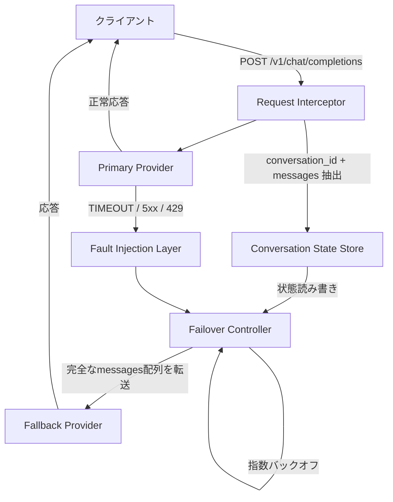

本記事は [ContinuityBench: A Benchmark and Systems Study of Stateful Failover in Multi-Provider LLM Routing](https://arxiv.org/abs/2607.15899) の解説記事です。

## 論文概要

マルチプロバイダーLLMルーティングにおいて、プロバイダー障害時の「会話の連続性」がどの程度維持されるかを定量評価する初のベンチマークContinuityBenchを提案した研究である。著者らは、新規メトリクスContinuity Preservation Rate（CPR）とContinuity Latency Overhead（CLO）を定義し、History-Forwardingと呼ばれるステートフルプロキシアーキテクチャを構築した。150件の合成マルチターン会話、750件のフェイルオーバーイベントによる評価で、History-Forwarding方式はCPR 99.20%（95% CI: 98.27%-99.63%）を達成し、従来のステートレス方式のCPR 0%と対照的な結果を報告している。

この記事は [Zenn記事: Portkey AI Gatewayで型安全なStructured Outputsパイプラインを構築する](https://zenn.dev/0h_n0/articles/ff1abbc7631d9f) の深掘りです。

## 情報源

| 項目 | 内容 |
|:---|:---|
| タイトル | ContinuityBench: A Benchmark and Systems Study of Stateful Failover in Multi-Provider LLM Routing |
| 著者 | Vishal Pandey, Gopal Singh |
| arXiv ID | 2607.15899 |
| 投稿日 | 2026年7月17日 |
| 分野 | cs.LG（機械学習） |
| ライセンス | CC BY 4.0 |

## 背景と動機

LLMをプロダクションで運用する際、単一プロバイダーへの依存はSLA違反リスクを生む。そのため、LiteLLM、Portkey、OpenRouterといったマルチプロバイダーゲートウェイが普及し、プロバイダー障害時のフェイルオーバーを自動化している。

しかし、著者らは「高いAPI可用性保証は会話の連続性を意味しない」という根本的な問題を指摘している。標準的なステートレスフェイルオーバーでは、プライマリプロバイダーが障害を起こした際にHTTP 200レスポンスを返すことには成功するが、それまでの会話履歴を静かに破棄する。その結果、音声エージェントでは会話リセットが強制され、エージェントシステムでは切り詰められたコンテキストからもっともらしいが不正確な出力が生成される。著者らはこれを「実際の損害が発生した後でようやく障害が表面化する」問題と表現している。

この問題は、Portkey AI Gatewayでフォールバック構成を利用する際にも直結する。Structured Outputsのスキーマ定義を含む会話コンテキストがプロバイダー切替時に維持されなければ、型安全性が破壊される。

## 主要な貢献

著者らが報告している本論文の貢献は以下の3点である。

1. **新規評価メトリクス（CPR・CLO）**: フェイルオーバー時の状態保存率とレイテンシオーバーヘッドを定量化する2つのメトリクスを定義。従来の可用性メトリクス（HTTP成功率等）では捉えられない「会話品質の連続性」を測定可能にした
2. **History-Forwardingアーキテクチャ**: 異種LLMエンドポイント間で完全な会話履歴を転送するステートフルプロキシの設計と実装。ベンチマーク実装はPython、本番デプロイメント（Metriqual）はRustで構築されている
3. **ContinuityBenchハーネス**: 合成データセット、決定論的障害注入、プロキシアーキテクチャ、LLM-as-Judge評価を含む再現可能な評価基盤をオープンソースで公開

## 技術的詳細

### CPR（Continuity Preservation Rate）の定義

CPRは、フェイルオーバー発生時にフォールバックプロバイダーが会話履歴にアクセスできているかを定量化するメトリクスである。

$$
\text{CPR} = \frac{1}{N} \sum_{i=1}^{N} \text{preserved}(f_i)
$$

ここで、
- $N$: フェイルオーバーイベントの総数
- $f_i$: $i$番目のフェイルオーバーイベント
- $\text{preserved}(f_i) \in \{0, 1\}$: フォールバックプロバイダーの応答が、フェイルオーバー前の会話履歴に含まれる「事実的アンカー」（固有名詞、数値、造語等）へのアクセスを示しているか

判定にはLLM-as-Judge（GPT-4o、Structured Output使用）を採用し、$\text{preserved} \in \{\text{true}, \text{false}\}$ のバイナリ判定を行う。高速化のため、まず決定論的な部分文字列チェックをヒューリスティックとして適用し、APIコールが必要な場合のみJudgeを呼び出す。手動ラベル付けした20件のサンプルとの一致率は95%と報告されている。

### CLO（Continuity Latency Overhead）の定義

CLOは、History-Forwardingによるレイテンシ増加を定量化する。

$$
\text{CLO} = \frac{1}{N} \sum_{i=1}^{N} (\ell_i^{\text{treat}} - \ell_i^{\text{base}})
$$

ここで、
- $\ell_i^{\text{treat}}$: History-Forwarding（treatment）システムのエンドツーエンドレイテンシ
- $\ell_i^{\text{base}}$: ステートレス（baseline）システムのエンドツーエンドレイテンシ

著者らは平均CLOに加えてP95値も報告し、テールレイテンシの特性を可視化している。

### History-Forwardingアーキテクチャ

History-Forwardingプロキシは4つの主要コンポーネントで構成される。



**Request Interceptor**: OpenAI互換の`POST /v1/chat/completions`リクエストから`conversation_id`と`messages[]`配列を抽出する。

**Conversation State Store**: 会話IDごとの`messages[]`レコードを管理する。ベンチマーク実装ではPythonのインプロセス辞書を使用し、本番のMetriqual実装ではRustネイティブのインメモリストアを採用してサブ5msの読み書きレイテンシを実現している。

**Fault Injection Layer**: 3種類の障害モードを決定論的にシミュレートする。
- **TIMEOUT**: プロバイダータイムアウト
- **API_ERROR**: 5xxレスポンス
- **RATE_LIMIT**: 429レスポンス

**Failover Controller**: 設定されたフォールバックチェーンを順番に試行し、成功するまでプロバイダーフェイルオーバーを実行する。

### ステートレスとステートフルの実装差異

著者らは、ベースラインとトリートメントの差異が単一のコード行に集約されることを強調している。

**ステートレス（ベースライン）**:

```python
def build_failover_payload_stateless(
    messages: list[dict[str, str]],
) -> list[dict[str, str]]:
    """最後のユーザーメッセージのみを転送する

    Args:
        messages: 完全な会話履歴

    Returns:
        最後のユーザーメッセージのみを含むリスト
    """
    last_msg = extract_last_user_message(messages)
    return [{"role": "user", "content": last_msg}]
```

**ステートフル（History-Forwarding）**:

```python
def build_failover_payload_stateful(
    messages: list[dict[str, str]],
) -> list[dict[str, str]]:
    """完全な会話履歴を転送する

    Args:
        messages: 完全な会話履歴

    Returns:
        完全な会話履歴のディープコピー
    """
    return list(messages)  # 完全な会話履歴を転送
```

この設計により、インフラの差異を排除し、会話状態の転送メカニズムのみを独立変数として分離している。

### フェイルオーバー判定と障害注入

実験マニフェストは`(conversation_id, failure_turn, fallback_provider)`の三つ組をシード`s=42`から決定論的に生成する。障害は「プローブターン」（最終ユーザーメッセージ）で注入され、コンテキスト依存の質問が行われる最も厳しい条件でフェイルオーバーが発生する。

### 非同期指数バックオフ

評価中に発見されたシステム的問題として、固定間隔リトライによる「thundering herd」現象がある。レート制限されたフォールバックプロバイダーに対して同期リトライストームが発生し、クォータを無期限に枯渇させる。

著者らが採用した解決策は以下の指数バックオフ式である。

$$
t_{\text{wait}} = \min\left(30\text{s},\; 2^a + U(0,1)\right)
$$

ここで、
- $a$: リトライ試行インデックス（0始まり）
- $U(0,1)$: 一様乱数によるジッター

ジッターにより並行スレッドのリトライタイミングが非同期化され、レート制限ウィンドウのリセットを許容する。

### 並行処理における競合条件

評価中に発見されたもう一つの問題として、並行フェイルオーバー時の共有プロキシ状態の競合条件がある。著者らはディープコピーによるアイソレーションとセッション単位のロックで解決している。

```python
import asyncio
import copy
from collections import defaultdict


class ConversationStateStore:
    """スレッドセーフな会話状態ストア

    並行フェイルオーバー時の競合条件を防止するため、
    セッション単位のロックとディープコピーを使用する。

    Attributes:
        _store: 会話IDごとのメッセージ履歴
        _locks: 会話IDごとの排他ロック
    """

    def __init__(self) -> None:
        self._store: dict[str, list[dict[str, str]]] = {}
        self._locks: dict[str, asyncio.Lock] = defaultdict(asyncio.Lock)

    async def get_messages(
        self, conversation_id: str
    ) -> list[dict[str, str]]:
        """指定された会話の完全な履歴をディープコピーで返す

        Args:
            conversation_id: 会話識別子

        Returns:
            メッセージ履歴のディープコピー
        """
        async with self._locks[conversation_id]:
            return copy.deepcopy(
                self._store.get(conversation_id, [])
            )

    async def append_message(
        self, conversation_id: str, message: dict[str, str]
    ) -> None:
        """会話履歴にメッセージを追加する

        Args:
            conversation_id: 会話識別子
            message: 追加するメッセージ
        """
        async with self._locks[conversation_id]:
            if conversation_id not in self._store:
                self._store[conversation_id] = []
            self._store[conversation_id].append(
                copy.deepcopy(message)
            )
```

## 実装のポイント

本論文の知見をプロダクションシステムに適用する際の要点を整理する。

**会話状態ストアの選択**: ベンチマーク実装はインプロセス辞書だが、本番環境ではRedisやDynamoDBによる永続化が必要である。著者らのMetriqual実装はRustネイティブのインメモリストアでサブ5msを達成しているが、これはステートフルプロキシがシングルインスタンスである前提に依存する。水平スケーリング時には分散キャッシュへの移行が必要になる。

**ペイロードサイズの管理**: 会話ターン数が増えると`messages[]`配列のサイズが増大する。論文のP95 CLOが+13,614msと大きいのは、大きなペイロード転送に起因する。実運用ではコンテキストウィンドウの上限に応じた要約・圧縮戦略が必要である。

**障害検知の閾値設定**: 論文は決定論的障害注入を用いているが、実環境では500エラー、タイムアウト、レート制限を適切な閾値で検知するサーキットブレーカーの実装が求められる。

**LLM-as-Judge評価の限界**: CPR判定にLLM-as-Judgeを使用しているが、体系的バイアスのリスクが存在する。プロダクション監視ではルールベースの部分文字列チェック（論文のfast-pathヒューリスティック）を優先し、必要時のみLLM判定にフォールバックする二段階評価が実用的である。

## Production Deployment Guide

本論文のHistory-Forwardingアーキテクチャは、マルチプロバイダーLLMルーティングのステートフルフェイルオーバー基盤として実装可能である。以下に、AWS上でのステートフルLLMプロキシの構築パターンを示す。

### アーキテクチャ構成

論文のHistory-ForwardingアーキテクチャをAWSサービスにマッピングすると、以下の構成要素に分解できる。

| 論文の構成要素 | 役割 | AWSサービス |
|:---|:---|:---|
| Request Interceptor | リクエスト解析・ルーティング | API Gateway / ALB |
| Conversation State Store | 会話履歴の永続化 | ElastiCache (Redis) / DynamoDB |
| Failover Controller | プロバイダー切替・リトライ | Lambda / ECS タスク |
| Fault Detection | 障害検知 | CloudWatch アラーム + SNS |

トラフィック規模別の推奨構成は以下の通りである。

| 構成 | トラフィック | AWSサービス | 月額概算 |
|:---|:---|:---|:---|
| Small (~100 req/日) | PoC・開発環境 | API Gateway + Lambda + DynamoDB + Bedrock | $80-200 |
| Medium (~1000 req/日) | チーム利用 | ALB + ECS Fargate + ElastiCache (t4g.micro) + Bedrock | $400-900 |
| Large (10000+ req/日) | 全社プラットフォーム | ALB + EKS + ElastiCache (r7g.large) + Bedrock + CloudFront | $2,500-6,000 |

注: 上記は2026年8月時点のAWS ap-northeast-1（東京）リージョン料金に基づく概算値である。実際のコストはリクエスト頻度、会話長、モデル選択により変動するため、AWS料金計算ツールでの確認を推奨する。

### Terraformインフラコード

**Small構成（API Gateway + Lambda + DynamoDB）**:

```hcl
# ステートフルLLMプロキシ - Small構成
terraform {
  required_version = ">= 1.9"
  required_providers {
    aws = { source = "hashicorp/aws", version = "~> 5.60" }
  }
}

provider "aws" {
  region = "ap-northeast-1"
}

# --- DynamoDB (会話状態ストア) ---
resource "aws_dynamodb_table" "conversation_state" {
  name         = "llm-proxy-conversation-state"
  billing_mode = "PAY_PER_REQUEST"
  hash_key     = "conversation_id"

  attribute {
    name = "conversation_id"
    type = "S"
  }

  ttl {
    attribute_name = "expires_at"
    enabled        = true
  }

  server_side_encryption {
    enabled = true
  }

  tags = {
    Project = "stateful-llm-proxy"
    Env     = "production"
  }
}

# --- Lambda (Failover Controller) ---
resource "aws_lambda_function" "llm_proxy" {
  function_name = "stateful-llm-proxy"
  runtime       = "python3.12"
  handler       = "proxy.handler"
  architectures = ["arm64"]
  memory_size   = 512
  timeout       = 120
  filename      = "proxy.zip"
  role          = aws_iam_role.lambda_role.arn

  environment {
    variables = {
      DYNAMODB_TABLE       = aws_dynamodb_table.conversation_state.name
      PRIMARY_PROVIDER     = "bedrock"
      FALLBACK_PROVIDER    = "anthropic-direct"
      BEDROCK_MODEL_ID     = "anthropic.claude-sonnet-4-20250514-v1:0"
      MAX_RETRY_ATTEMPTS   = "3"
      BACKOFF_MAX_SECONDS  = "30"
      CONVERSATION_TTL_SEC = "3600"
    }
  }

  tracing_config {
    mode = "Active"
  }
}

# --- API Gateway ---
resource "aws_apigatewayv2_api" "llm_proxy" {
  name          = "stateful-llm-proxy"
  protocol_type = "HTTP"
}

resource "aws_apigatewayv2_integration" "lambda" {
  api_id                 = aws_apigatewayv2_api.llm_proxy.id
  integration_type       = "AWS_PROXY"
  integration_uri        = aws_lambda_function.llm_proxy.invoke_arn
  payload_format_version = "2.0"
}

resource "aws_apigatewayv2_route" "chat_completions" {
  api_id    = aws_apigatewayv2_api.llm_proxy.id
  route_key = "POST /v1/chat/completions"
  target    = "integrations/${aws_apigatewayv2_integration.lambda.id}"
}

# --- IAM ---
resource "aws_iam_role" "lambda_role" {
  name = "stateful-llm-proxy-lambda-role"
  assume_role_policy = jsonencode({
    Version = "2012-10-17"
    Statement = [{
      Action    = "sts:AssumeRole"
      Effect    = "Allow"
      Principal = { Service = "lambda.amazonaws.com" }
    }]
  })
}

resource "aws_iam_role_policy" "lambda_policy" {
  name = "stateful-llm-proxy-policy"
  role = aws_iam_role.lambda_role.id
  policy = jsonencode({
    Version = "2012-10-17"
    Statement = [
      {
        Effect = "Allow"
        Action = [
          "bedrock:InvokeModel",
          "bedrock:InvokeModelWithResponseStream"
        ]
        Resource = "arn:aws:bedrock:ap-northeast-1:*:foundation-model/*"
      },
      {
        Effect = "Allow"
        Action = [
          "dynamodb:GetItem", "dynamodb:PutItem",
          "dynamodb:UpdateItem", "dynamodb:DeleteItem"
        ]
        Resource = aws_dynamodb_table.conversation_state.arn
      },
      {
        Effect   = "Allow"
        Action   = ["logs:CreateLogGroup", "logs:CreateLogStream", "logs:PutLogEvents"]
        Resource = "arn:aws:logs:*:*:*"
      },
      {
        Effect   = "Allow"
        Action   = ["xray:PutTraceSegments", "xray:PutTelemetryRecords"]
        Resource = "*"
      }
    ]
  })
}

# --- CloudWatch アラーム ---
resource "aws_cloudwatch_metric_alarm" "failover_rate" {
  alarm_name          = "llm-proxy-high-failover-rate"
  comparison_operator = "GreaterThanThreshold"
  evaluation_periods  = 2
  metric_name         = "FailoverCount"
  namespace           = "StatefulLLMProxy"
  period              = 300
  statistic           = "Sum"
  threshold           = 50
  alarm_description   = "5分間のフェイルオーバー回数が50を超過"
  alarm_actions       = [aws_sns_topic.alerts.arn]
}

resource "aws_sns_topic" "alerts" {
  name = "llm-proxy-alerts"
}
```

**Large構成（EKS + ElastiCache + Karpenter）**:

```hcl
# ステートフルLLMプロキシ - Large構成
module "eks" {
  source  = "terraform-aws-modules/eks/aws"
  version = "~> 20.24"

  cluster_name    = "stateful-llm-proxy"
  cluster_version = "1.31"

  vpc_id     = module.vpc.vpc_id
  subnet_ids = module.vpc.private_subnets

  cluster_endpoint_public_access = false

  eks_managed_node_groups = {
    system = {
      instance_types = ["m7g.large"]
      capacity_type  = "ON_DEMAND"
      min_size       = 2
      max_size       = 2
      desired_size   = 2
    }
  }
}

# --- Karpenter (Spot優先オートスケーリング) ---
resource "kubectl_manifest" "karpenter_nodepool" {
  yaml_body = yamlencode({
    apiVersion = "karpenter.sh/v1"
    kind       = "NodePool"
    metadata   = { name = "proxy-workers" }
    spec = {
      template = {
        spec = {
          requirements = [
            { key = "karpenter.sh/capacity-type", operator = "In", values = ["spot", "on-demand"] },
            { key = "node.kubernetes.io/instance-type", operator = "In", values = ["c7g.xlarge", "c7g.2xlarge", "m7g.xlarge"] },
            { key = "kubernetes.io/arch", operator = "In", values = ["arm64"] }
          ]
          nodeClassRef = { name = "default" }
        }
      }
      limits   = { cpu = "64", memory = "128Gi" }
      disruption = {
        consolidationPolicy = "WhenEmptyOrUnderutilized"
        consolidateAfter    = "30s"
      }
    }
  })
}

# --- ElastiCache (会話状態ストア) ---
resource "aws_elasticache_replication_group" "conversation_state" {
  replication_group_id = "llm-proxy-state"
  description          = "会話状態ストア (History-Forwarding)"
  engine               = "redis"
  engine_version       = "7.1"
  node_type            = "cache.r7g.large"
  num_cache_clusters   = 2
  at_rest_encryption_enabled = true
  transit_encryption_enabled = true
  automatic_failover_enabled = true

  parameter_group_name = aws_elasticache_parameter_group.proxy.name
}

resource "aws_elasticache_parameter_group" "proxy" {
  name   = "llm-proxy-params"
  family = "redis7"

  # 大きな会話履歴に対応
  parameter {
    name  = "maxmemory-policy"
    value = "allkeys-lru"
  }
}

# --- AWS Budgets ---
resource "aws_budgets_budget" "monthly" {
  name         = "stateful-llm-proxy-monthly"
  budget_type  = "COST"
  limit_amount = "6000"
  limit_unit   = "USD"
  time_unit    = "MONTHLY"

  notification {
    comparison_operator       = "GREATER_THAN"
    threshold                 = 80
    threshold_type            = "PERCENTAGE"
    notification_type         = "ACTUAL"
    subscriber_email_addresses = ["ops-team@example.com"]
  }
}
```

### 運用・監視設定

**CloudWatch Logs Insights クエリ**（フェイルオーバー分析）:

```
# 1時間あたりのフェイルオーバー頻度と平均CLO
fields @timestamp, provider, failover_reason, clo_ms
| filter event = "failover_executed"
| stats count() as failover_count,
        avg(clo_ms) as avg_clo,
        pct(clo_ms, 95) as p95_clo
  by bin(1h)
| sort @timestamp desc
```

**CloudWatch アラーム設定コード**:

```python
import boto3


def setup_failover_monitoring() -> None:
    """フェイルオーバー監視アラームを設定する

    CPR低下とCLOスパイクを検知するアラームを作成する。
    """
    cw = boto3.client("cloudwatch", region_name="ap-northeast-1")

    # CPR低下検知（論文のCPR 99.20%を基準に閾値設定）
    cw.put_metric_alarm(
        AlarmName="llm-proxy-cpr-degradation",
        MetricName="ContinuityPreservationRate",
        Namespace="StatefulLLMProxy",
        Statistic="Average",
        Period=300,
        EvaluationPeriods=3,
        Threshold=95.0,
        ComparisonOperator="LessThanThreshold",
        AlarmDescription="CPRが95%を下回った場合にアラート",
        AlarmActions=["arn:aws:sns:ap-northeast-1:ACCOUNT:llm-proxy-alerts"],
    )

    # CLOスパイク検知（P95 CLOが論文の+13,614msを参考）
    cw.put_metric_alarm(
        AlarmName="llm-proxy-clo-spike",
        MetricName="ContinuityLatencyOverhead",
        Namespace="StatefulLLMProxy",
        Statistic="p95",
        Period=300,
        EvaluationPeriods=2,
        Threshold=15000,
        ComparisonOperator="GreaterThanThreshold",
        AlarmDescription="P95 CLOが15秒を超過した場合にアラート",
        AlarmActions=["arn:aws:sns:ap-northeast-1:ACCOUNT:llm-proxy-alerts"],
    )
```

**X-Ray トレーシング設定**:

```python
from aws_xray_sdk.core import xray_recorder, patch_all

patch_all()


@xray_recorder.capture("failover_controller")
def execute_failover(
    conversation_id: str,
    messages: list[dict[str, str]],
    fallback_chain: list[str],
) -> dict:
    """フェイルオーバーを実行し、X-Rayにトレースを記録する

    Args:
        conversation_id: 会話識別子
        messages: 完全な会話履歴
        fallback_chain: フォールバックプロバイダーのリスト

    Returns:
        フォールバックプロバイダーからのレスポンス
    """
    subsegment = xray_recorder.current_subsegment()
    subsegment.put_annotation("conversation_id", conversation_id)
    subsegment.put_metadata("message_count", len(messages))
    subsegment.put_metadata("payload_size_bytes", len(str(messages)))

    for provider in fallback_chain:
        subsegment.put_annotation("fallback_provider", provider)
        # プロバイダーへのリクエスト実行
        response = invoke_provider(provider, messages)
        if response.get("success"):
            return response

    raise RuntimeError("All fallback providers exhausted")
```

**Cost Explorer日次レポート**:

```python
import datetime

import boto3


def get_daily_cost_report() -> dict:
    """Bedrock・Lambda・ElastiCacheの日次コストを取得する

    Returns:
        サービス別コストの辞書
    """
    ce = boto3.client("ce", region_name="us-east-1")
    today = datetime.date.today()
    yesterday = today - datetime.timedelta(days=1)

    response = ce.get_cost_and_usage(
        TimePeriod={
            "Start": yesterday.isoformat(),
            "End": today.isoformat(),
        },
        Granularity="DAILY",
        Metrics=["BlendedCost"],
        GroupBy=[{"Type": "DIMENSION", "Key": "SERVICE"}],
        Filter={
            "Or": [
                {"Dimensions": {"Key": "SERVICE", "Values": ["Amazon Bedrock"]}},
                {"Dimensions": {"Key": "SERVICE", "Values": ["AWS Lambda"]}},
                {"Dimensions": {"Key": "SERVICE", "Values": ["Amazon ElastiCache"]}},
            ]
        },
    )

    costs = {}
    for group in response["ResultsByTime"][0]["Groups"]:
        service = group["Keys"][0]
        amount = float(group["Metrics"]["BlendedCost"]["Amount"])
        costs[service] = amount

    total = sum(costs.values())
    if total > 100:
        sns = boto3.client("sns", region_name="ap-northeast-1")
        sns.publish(
            TopicArn="arn:aws:sns:ap-northeast-1:ACCOUNT:llm-proxy-alerts",
            Subject="LLM Proxy日次コスト超過",
            Message=f"日次コスト: ${total:.2f} (閾値: $100)",
        )

    return costs
```

### コスト最適化チェックリスト

**アーキテクチャ選択**:
- [ ] トラフィック100 req/日未満: Serverless構成（Lambda + DynamoDB）
- [ ] トラフィック100-5000 req/日: Hybrid構成（ECS Fargate + ElastiCache）
- [ ] トラフィック5000+ req/日: Container構成（EKS + ElastiCache Cluster）

**リソース最適化**:
- [ ] EKS: Karpenter + Spot Instances優先（最大90%削減）
- [ ] Lambda: ARM64 (Graviton) + メモリサイズ最適化（512MB推奨）
- [ ] ElastiCache: Reserved Nodes（1年コミットで最大40%削減）
- [ ] DynamoDB: On-Demandモード（予測不能なトラフィック向け）
- [ ] Savings Plans: Compute Savings Plans検討（最大66%削減）

**LLMコスト削減**:
- [ ] Bedrock Batch API使用（非リアルタイム処理で50%削減）
- [ ] Prompt Caching有効化（繰り返しのシステムプロンプトで30-90%削減）
- [ ] 会話要約: 長い会話履歴の圧縮でトークン数削減
- [ ] モデル選択: フェイルオーバー先にはコスト効率の高いモデルを配置

**監視・アラート**:
- [ ] AWS Budgets: 月次予算アラート設定
- [ ] CloudWatch: CPR/CLOカスタムメトリクス
- [ ] Cost Anomaly Detection: 自動異常検知有効化
- [ ] 日次コストレポート: SNS通知設定

**リソース管理**:
- [ ] DynamoDB TTL: 不要な会話状態の自動削除
- [ ] CloudWatch Logs: 保持期間設定（30日推奨）
- [ ] タグ戦略: Project/Env/Ownerタグの統一
- [ ] 開発環境: 夜間・週末のECSタスク停止
- [ ] ElastiCache: maxmemory-policyによる自動エビクション

## 実験結果

### CPR結果

著者らが報告した主要結果（Table 1）は以下の通りである。

| 方式 | 保存成功 / 総数 | CPR | 95% CI |
|:---|:---|:---|:---|
| History-Forwarding (treatment) | 744 / 750 | 99.20% | [98.27%, 99.63%] |
| ステートレス (baseline) | 0 / 750 | 0.00% | [0.00%, 0.51%] |

5回の独立実行（Table 2）では、トリートメントのCPRは98.7%-99.3%の範囲で安定しており、ベースラインは一貫して0.0%であった。この結果は再現可能で偶発的ではないことを示している。

### 会話長別CPR

会話のターン数別のCPR（Table 4）は以下の通りである。

| ターン数 | History-Forwarding CPR | ステートレス CPR |
|:---|:---|:---|
| 7ターン | 97.7% | 0% |
| 9ターン | 100.0% | 0% |
| 11ターン | 100.0% | 0% |

ペイロードサイズの増加に伴うCPR劣化は観測されていない。

### レイテンシ分析

CLOの分布（Table 3、Run 5データ）は以下の通りである。

| メトリクス | ベースライン | History-Forwarding | CLO |
|:---|:---|:---|:---|
| 平均レイテンシ | 6,225ms | 6,283ms | +59ms |
| 中央値レイテンシ | 4,311ms | 4,457ms | -450ms |
| P95 CLO | - | - | +13,614ms |

平均CLOは+59msと極めて小さい。P95 CLOが+13,614msと大きいのは、長い会話履歴を持つペイロードの転送に起因すると著者らは分析している。

## 実運用への応用

### Portkey構成でのフェイルオーバー設計への示唆

Zenn記事で解説したPortkey AI Gatewayのフォールバック構成では、`response_format`（Structured Outputs）の定義を含む会話コンテキストがプロバイダー切替時にどう扱われるかが実運用上の重要課題である。ContinuityBenchの知見は以下の点で設計指針を提供する。

**スキーマ定義の転送**: History-Forwarding方式では完全な`messages[]`配列がフォールバックプロバイダーに転送される。Portkey構成でも、Pydanticスキーマを含むシステムプロンプトが切替先プロバイダーに到達することを保証する設計が必要である。

**プロバイダー間の互換性**: 論文はOpenAI（gpt-4o-mini）からAnthropic（Claude 3.5 Sonnet）へのフェイルオーバーを評価している。Structured Outputsのスキーマフォーマットはプロバイダーごとに異なるため、ゲートウェイ層でのスキーマ変換ロジックが求められる。

**レイテンシバジェット**: 平均CLO +59msはリアルタイムアプリケーションで許容範囲だが、P95 CLOの+13,614msはストリーミングレスポンスのタイムアウト設定に影響する。Portkey構成でのタイムアウト値はこのテールレイテンシを考慮して設定すべきである。

## 関連研究

- **LiteLLM**: 100以上のLLMプロバイダーへの統一アクセスを提供するオープンソースゲートウェイ。リクエストレベルのステートレスフェイルオーバーを実装しているが、ContinuityBenchが指摘する会話状態の転送は行わない。プロキシオーバーヘッドは中央値12ms（P95 29ms）と報告されている
- **Portkey**: マネージドコントロールプレーンとして、セマンティックキャッシュ、ガードレール、可観測性を統合したAIゲートウェイ。セッションレベルのコンテキスト管理を2026年時点で第一級の機能として扱っている
- **OpenRouter / Not Diamond / Martian**: 動的ルーティングや学習ベースのルーティングポリシーを採用するゲートウェイ群。ContinuityBenchはこれらのルーティング最適化とは直交する「状態保存」の問題に焦点を当てている
- **LLM-as-Judge研究**: Chatbot Arena（ペアワイズ判定）、AlpacaEval（自動比較）、FActScore・HaluEval（事実整合性評価）が先行研究として位置づけられている。ContinuityBenchのJudge設計は事実検証に特化したバイナリ判定を採用し、手動ラベルとの一致率95%を達成している

## まとめと今後の展望

ContinuityBenchは「API可用性と会話連続性は異なる問題である」という重要な知見を定量的に実証した研究である。History-Forwarding方式によりCPR 99.20%を達成し、平均CLO +59msという小さなオーバーヘッドでステートフルフェイルオーバーが実現可能であることを示している。

一方で、著者らは以下の制約を認めている。合成会話データでは有機的な対話の複雑さを捉えきれないこと、単一プロバイダーセット（OpenAI→Anthropic）のみの評価であること、テキストのみでストリーミングやマルチモーダル入力は未評価であること、単一ターン障害注入のみで複合障害は未検証であることが限界として挙げられている。今後の研究方向として、ストリーミング対応、複合障害シナリオ、3プロバイダー以上のカスケードフェイルオーバーの評価が期待される。

## 参考文献

- **arXiv**: [https://arxiv.org/abs/2607.15899](https://arxiv.org/abs/2607.15899)
- **Code**: continuity-bench (v1.0-phase2-final)
- **Related Zenn article**: [https://zenn.dev/0h_n0/articles/ff1abbc7631d9f](https://zenn.dev/0h_n0/articles/ff1abbc7631d9f)
