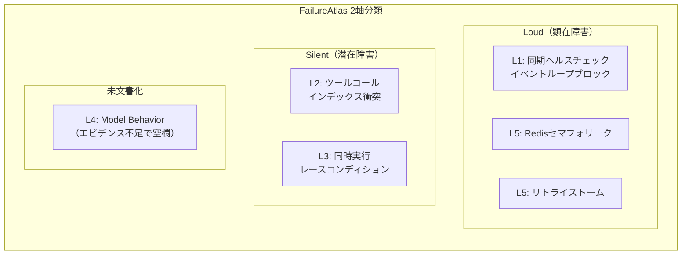

本記事は [FailureAtlas: A Taxonomy of Failure Modes in Multi-Provider LLM Serving Infrastructure](https://arxiv.org/abs/2607.17525)（arXiv:2607.17525）の解説記事です。

この記事は [Zenn記事: Portkey AI Gatewayで型安全なStructured Outputsパイプラインを構築する](https://zenn.dev/0h_n0/articles/ff1abbc7631d9f) の深掘りです。Zenn記事ではPortkey AI Gatewayを用いたマルチプロバイダー構成でのStructured Outputsパイプラインを解説していますが、本論文はそうしたマルチプロバイダー構成で発生する障害モードを体系的に分類し、特にHTTP 200を返しながらアプリケーション状態を破壊する「サイレント障害」の検出手法を提案しています。フォールバック設計やガードレール設計の根拠として重要な知見を提供する研究です。

---

## 論文概要

著者らは、マルチプロバイダーLLMゲートウェイ基盤における障害モードを体系的に分類するフレームワーク「FailureAtlas」を提案している。このフレームワークは障害を「発生レイヤー（Origin Layer）」と「検出可能性（Detectability）」の2軸で整理する。公開バグレポートと独自のストレステストから5件の障害事例を文書化し、うち3件には再現スクリプトが付属している。最も重要な発見として、運用上最も深刻な障害は「サイレント障害」であり、HTTP 200を返し、標準的なヘルスチェックをすべてパスしながら、アプリケーション状態を破壊すると報告されている。

## 情報源

| 項目 | 内容 |
|------|------|
| タイトル | FailureAtlas: A Taxonomy of Failure Modes in Multi-Provider LLM Serving Infrastructure |
| 著者 | Vishal Pandey, Gopal Singh |
| arXiv ID | 2607.17525 |
| 投稿日 | 2026年7月20日 |
| 分野 | cs.LG, cs.SE |
| URL | [https://arxiv.org/abs/2607.17525](https://arxiv.org/abs/2607.17525) |
| ページ数 | 14ページ |
| ライセンス | CC BY 4.0 |

## 背景と動機

マルチプロバイダーLLMゲートウェイは、複数のLLMプロバイダー（OpenAI、Anthropic、Google、AWSなど）を束ね、フォールバック・ロードバランシング・コスト最適化を行う中間層である。Portkey、LiteLLMなどのツールがこの役割を担い、プロダクション環境で広く利用されている。

しかし、著者らはこうした基盤が従来の分散システムとは質的に異なる障害特性を持つと指摘している。その根本原因は3つのアーキテクチャ上のミスマッチにある。

1. **ステートレス設計 vs ステートフルなLLMワークロード**: Webインフラはリクエストの独立性を前提とするが、LLMアプリケーションは会話履歴を主要な入力として依存する
2. **トランスポート層での成功判定**: 標準的なAPMではHTTP 200 + 許容レイテンシ = 成功と判定するが、セマンティック正確性（正しいコンテキスト、一貫した応答）は未計測のままである
3. **モニタリング規約の欠如**: 分散システムには確立された可観測性プラクティスがあるが、LLMサービングにはセマンティックレベルの継続的評価ツールが存在しない

著者らはContinuityBench（CB）ストレステストを100並列セッション（C=100）で実施した際に、標準的なモニタリングでは検出できない2つの重大な障害を発見した。この経験がFailureAtlas構築の直接的な動機となっている。

## 主要な貢献

著者らが報告する主要な貢献は以下の3点である。

1. **2軸分類フレームワーク**: 障害を「発生レイヤー（5レイヤー）」と「検出可能性（Loud/Silent）」で分類する体系的な分類法の提案
2. **サイレント障害の発見と文書化**: 同時実行レースコンディションによる会話履歴喪失、ストリーミングインデックス衝突によるツールコールペイロード破損という2つの未知のサイレント障害を発見・文書化
3. **再現可能なエビデンス**: 5件の障害事例のうち3件に再現スクリプトを付属させ、再現可能な形で障害を文書化する方法論の提示

## 技術的詳細

### 障害分類フレームワーク

FailureAtlasの分類フレームワークは、障害を2つの直交する軸で整理する。

**軸1: 発生レイヤー（Origin Layer）**

著者らは障害の発生元を5つのレイヤーに分類している。

| レイヤー | 名称 | 対象 |
|---------|------|------|
| L1 | Network/Transport | TCP タイムアウト、TLS障害、同期呼び出しによるイベントループブロック |
| L2 | Streaming/Protocol | SSE固有のステートフルバグ、チャンク間インデックス破損、トークンストリーム再構築障害 |
| L3 | State/Session | 会話履歴破損、コンテキスト切り詰め、並行ターン上書き |
| L4 | Model Behavior | 命令ドリフト、ハルシネーション（意図的に空欄） |
| L5 | Governance/Cost | レート制限デッドロック、リトライポリシーによるエラー増幅、コスト計上障害 |

**軸2: 検出可能性（Detectability）**

- **Loud（顕在）**: HTTP 5xx、クラッシュ、ヘルスチェックタイムアウトなど、観測可能なシグナルを発し即座にアラートをトリガーする障害
- **Silent（潜在）**: HTTP 200を返し、セマンティックペイロードが破損しているが、インフラメトリクスからは不可視な障害

著者らは「Loud障害はモニタリングが捕捉するため修正される。Silent障害は何もフラグを立てないため、不可視の技術的負債として蓄積する」と強調している。

**重要な構造的観察**: 著者らは、どのレイヤーもLoudまたはSilentに排他的ではないと報告している。検出可能性は発生レイヤーとは独立であり、同じレイヤーの障害でもLoudとSilentの両方が存在しうる。



### L4（Model Behavior）が空欄である理由

分類表のL4行は意図的に空欄とされている。著者らは、命令ドリフトやハルシネーションなど逸話的に報告されるモデル行動の劣化は、機構的な文書化に耐えるエビデンスが不足していると判断している。この空欄自体が、LLMサービングにおける可観測性の弱点を浮き彫りにしていると著者らは述べている。

### 5つの障害事例の詳細

#### 事例1: 同時実行レースコンディション（Silent / L3: State/Session）

**発見経緯**: ContinuityBench Phase 2評価中に著者らが直接発見。

**メカニズム**: 非同期タスクのインターリーブにより、並行するターンがネットワーク呼び出し中に共有会話状態を上書きする。read-modify-writeサイクルがロックなしに非同期的にyieldし、後から完了したタスクが先行するターンの貢献を静かに消去する。

```python
import asyncio
from copy import deepcopy
from typing import Any


class UnsafeConversationState:
    """レースコンディションが発生する会話状態管理の例。

    複数の非同期タスクが同時にadd_turnを呼ぶと、
    ネットワーク待ちの間に他のタスクが状態を上書きし、
    先行タスクの会話履歴が失われる。
    """

    def __init__(self) -> None:
        self.history: list[dict[str, Any]] = []

    async def add_turn(self, turn: dict[str, Any]) -> None:
        """ターンを追加（unsafe: ロックなし）。"""
        current = self.history  # read
        current.append(turn)    # modify
        await asyncio.sleep(0.1)  # ネットワーク呼び出しを模擬（yield）
        self.history = current  # write — 他タスクの変更を上書き


class SafeConversationState:
    """ロックによる排他制御で安全な会話状態管理。"""

    def __init__(self) -> None:
        self.history: list[dict[str, Any]] = []
        self._lock = asyncio.Lock()

    async def add_turn(self, turn: dict[str, Any]) -> None:
        """ターンを追加（safe: asyncio.Lockで保護）。"""
        async with self._lock:
            self.history.append(turn)
            await asyncio.sleep(0.1)
```

**影響**: CPR（Continuity Preservation Rate）がC=5で約100%から、C=100で約28%に崩壊。すなわち72%の会話継続性が失われる。

**緩和策**: `asyncio.Lock`またはセッションごとのdeep copyによる分離。

#### 事例2: 並列ツールコールインデックス衝突（Silent / L2: Streaming/Protocol）

**出典**: BerriAI/litellm#33678

**メカニズム**: プロキシがチャンクごとにストリーミングインデックスカウンタを誤ってリセットする。OllamaがTool Callを並列送信すると、各ツールコールがindex=0を受け取り、独立した引数がJSON連結されて不正なペイロードとなる。

**検出の困難さ**: 次のターンでJSONDecodeErrorが発生するが、エラーの発生箇所とインデックス衝突の原因箇所が異なるため、デバッグが誤った方向に誘導される。

**緩和策**: クロスチャンクでステートフルなカウンタを維持するか、プロバイダーのネイティブインデックスを保持する。

#### 事例3: Redisセマフォリーク（Loud / L5: Governance/Cost）

**出典**: BerriAI/litellm#20256

**メカニズム**: 上流プロバイダーの障害がエラーパスをバイパスし、Redisセマフォのデクリメントが未実行のまま残る。滞留したカウンタが最終的にmax_parallel_requests制限に到達し、実際のインフライトリクエストが存在しないにもかかわらず、恒久的にHTTP 429拒否が発生する。

```python
import asyncio
from contextlib import asynccontextmanager
from typing import AsyncGenerator


class SafeRateLimiter:
    """try/finallyで確実にセマフォを解放するレートリミッタ。

    Redisセマフォリークを防止するパターン。
    プロバイダー障害時もfinallyブロックで
    カウンタが確実にデクリメントされる。
    """

    def __init__(self, max_concurrent: int = 10) -> None:
        self._semaphore = asyncio.Semaphore(max_concurrent)

    @asynccontextmanager
    async def acquire(self) -> AsyncGenerator[None, None]:
        """セマフォを取得し、完了後に確実に解放する。"""
        await self._semaphore.acquire()
        try:
            yield
        finally:
            self._semaphore.release()  # 例外発生時も確実に解放
```

**緩和策**: Redis TTLの強制適用、またはstrict try/finallyブロックでの実行ラッピング。

#### 事例4: 同期ヘルスチェックによるイベントループブロック（Loud / L1: Network/Transport）

**出典**: BerriAI/litellm#21033

**メカニズム**: Kubernetesのliveness probeが同期的なデータベースクエリを実行し、asyncioイベントループ全体をブロックする。10秒ごとのプローブ繰り返しにより、持続的なマイクロ停止が発生する。

**緩和策**: 厳密にasyncなI/Oドライバの使用、または同期呼び出しのスレッドプールへのオフロード。

#### 事例5: リトライストーム / Thundering Herd（Loud / L5: Governance/Cost）

**発見経緯**: CBフェイルオーバーストレステスト（C=100）で著者らが発見。

**メカニズム**: 100の並行エージェントにおける固定間隔リトライが単一のリトライ波に同期する。この波がプロバイダーのレート制限を繰り返し飽和させ、回復を妨げる。不完全な補完に対しても課金可能なAPI使用量が発生し、自己誘発的なサービス拒否を引き起こす。

```python
import asyncio
import random


async def retry_with_jitter(
    func,
    max_retries: int = 5,
    base_delay: float = 1.0,
    max_delay: float = 60.0,
) -> any:
    """指数バックオフ + ジッタによるリトライ。

    Thundering Herd問題を緩和するため、
    固定間隔ではなくランダムなジッタを加えた
    指数バックオフを使用する。

    Args:
        func: リトライ対象の非同期関数
        max_retries: 最大リトライ回数
        base_delay: 初回待機時間（秒）
        max_delay: 最大待機時間（秒）
    """
    for attempt in range(max_retries):
        try:
            return await func()
        except Exception as e:
            if attempt == max_retries - 1:
                raise
            # 指数バックオフ + full jitter
            delay = min(base_delay * (2 ** attempt), max_delay)
            jitter = random.uniform(0, delay)
            await asyncio.sleep(jitter)
```

**緩和策**: ジッタ付き指数バックオフとグローバルサーキットブレーカーの実装。

### エビデンス収集の方法論

著者らは厳格な組み入れ基準を適用している。

1. **具体的特定性**: 漠然とした不満ではなく、特定の条件を満たす障害
2. **検証可能な出自**: GitHubイシュー、ポストモーテム、またはマージ済み修正
3. **機構的説明可能性**: 症状だけでなく、完全な根本原因チェーンが追跡可能

5件のうち3件はGitHubイシュートラッカーから、2件は著者ら自身のストレステストで発見され、再現スクリプト付きで報告されている。

### サイレント障害の検出アプローチ

著者らは、サイレント障害を検出するためにセマンティックレベルの可観測性が必要であると主張している。具体的には以下の手法が提示されている。

1. **セマンティック継続性メトリクス**: 会話のペルソナ遵守度やコンテキスト一貫性を継続的に評価する指標。同時実行レースコンディションは、このメトリクスの予期しない低下として初めて検出された
2. **クロスチャンクステート検証**: ストリーミングレスポンスのチャンク間でインデックスの整合性を検証し、インデックス衝突を検出する
3. **セマンティックペイロード検証**: HTTP応答コードではなく、応答のセマンティック内容を検証対象とする

## 実装のポイント

論文の知見をプロダクション環境に適用する際の実装パターンを以下に整理する。

### サイレント障害検出の実装

```python
import hashlib
import json
from dataclasses import dataclass, field
from typing import Any


@dataclass
class ConversationIntegrityChecker:
    """会話整合性チェッカー。

    各ターン追加後にハッシュチェーンで
    会話履歴の改ざん・欠落を検出する。
    サイレント障害（レースコンディション等）による
    会話履歴喪失を即座に検知するためのパターン。
    """

    expected_turn_count: int = 0
    history_hashes: list[str] = field(default_factory=list)

    def record_turn(self, turn: dict[str, Any]) -> str:
        """ターンを記録しハッシュを返す。"""
        self.expected_turn_count += 1
        turn_hash = hashlib.sha256(
            json.dumps(turn, sort_keys=True).encode()
        ).hexdigest()[:16]
        self.history_hashes.append(turn_hash)
        return turn_hash

    def verify_integrity(
        self, actual_history: list[dict[str, Any]]
    ) -> dict[str, Any]:
        """履歴の整合性を検証する。

        Returns:
            検証結果を含む辞書。intactがFalseの場合、
            サイレント障害による履歴欠落の可能性がある。
        """
        actual_count = len(actual_history)
        if actual_count != self.expected_turn_count:
            return {
                "intact": False,
                "expected": self.expected_turn_count,
                "actual": actual_count,
                "missing": self.expected_turn_count - actual_count,
                "alert": "SILENT_FAILURE_DETECTED",
            }
        return {"intact": True, "count": actual_count}
```

### ストリーミングインデックス検証

```python
from dataclasses import dataclass, field


@dataclass
class StreamingIndexValidator:
    """SSEストリーミングのインデックス整合性検証。

    並列ツールコール時にインデックス衝突
    （全てindex=0にリセット）が発生していないかを検出する。
    """

    _seen_indices: dict[str, set[int]] = field(default_factory=dict)

    def validate_chunk(
        self,
        chunk_id: str,
        tool_call_index: int,
        tool_call_id: str,
    ) -> bool:
        """チャンクのインデックスを検証する。

        Args:
            chunk_id: ストリーミングチャンクID
            tool_call_index: ツールコールインデックス
            tool_call_id: ツールコール識別子

        Returns:
            True: 整合性OK、False: インデックス衝突検出
        """
        if tool_call_id not in self._seen_indices:
            self._seen_indices[tool_call_id] = set()

        if tool_call_index in self._seen_indices[tool_call_id]:
            # 同一ツールコール内でインデックスが重複
            return False

        self._seen_indices[tool_call_id].add(tool_call_index)
        return True
```

## Production Deployment Guide

本論文の障害分類と検出手法をAWS環境で実装するためのガイドを以下に示す。マルチプロバイダーLLMゲートウェイの障害検出・緩和インフラの構築を対象とする。

### AWS実装パターン（コスト最適化重視）

**トラフィック量別の推奨構成**

| 構成 | 想定規模 | 月額概算 | 主要サービス |
|------|---------|---------|-------------|
| Small | ~100 req/日 | $80-200 | Lambda + Bedrock + DynamoDB + CloudWatch |
| Medium | ~1,000 req/日 | $400-900 | ECS Fargate + ElastiCache Redis + RDS + CloudWatch |
| Large | 10,000+ req/日 | $2,500-6,000 | EKS + Karpenter + ElastiCache + Aurora + X-Ray |

**Small構成（~100 req/日）**:
- AWS Lambda: LLMゲートウェイプロキシ + 整合性チェッカー（256MB, 30秒タイムアウト）
- Amazon Bedrock: LLM推論エンドポイント
- DynamoDB On-Demand: 会話履歴ストア + ハッシュチェーン記録
- CloudWatch Logs + Metrics: セマンティック継続性メトリクスのカスタム公開
- 月額内訳: Lambda $5, Bedrock $30-100, DynamoDB $10-30, CloudWatch $5-10

**Medium構成（~1,000 req/日）**:
- ECS Fargate: ゲートウェイプロキシ（2 vCPU, 4GB RAM, 最小2タスク）
- ElastiCache Redis (cache.t4g.micro): セマフォ管理 + TTL強制
- RDS PostgreSQL (db.t4g.micro): 会話履歴 + 整合性ログ永続化
- CloudWatch Container Insights: コンテナメトリクス + カスタムセマンティックメトリクス
- 月額内訳: Fargate $80-150, ElastiCache $15, RDS $30-50, Bedrock $200-500, CloudWatch $20

**Large構成（10,000+ req/日）**:
- EKS + Karpenter: ゲートウェイポッド自動スケーリング（Spot優先で最大90%削減）
- ElastiCache Redis Cluster (cache.r7g.large, 3ノード): セマフォ + ストリーミングステート管理
- Aurora PostgreSQL Serverless v2: 会話履歴 + 障害ログ（0.5-8 ACU自動スケール）
- X-Ray + CloudWatch: 分散トレーシング + セマンティックメトリクス
- 月額内訳: EKS $75, EC2 Spot $300-800, ElastiCache $400, Aurora $200-500, Bedrock $1,000-3,000, X-Ray $50

**コスト削減テクニック**:
- Spot Instances活用（EKSワーカーノード）で最大90%削減
- ElastiCache Reserved Nodes（1年コミット）で最大35%削減
- Bedrock Batch APIで非リアルタイム処理を50%削減
- DynamoDB On-Demandで低トラフィック時のプロビジョニング浪費を回避

**コスト試算の注意事項**: 上記は2026年8月時点のAWS ap-northeast-1（東京）リージョン料金に基づく概算値です。実際のコストはトラフィックパターン、リージョン、バースト使用量により変動します。最新料金はAWS料金計算ツールで確認を推奨します。

### Terraformインフラコード

**Small構成（Serverless）: Lambda + DynamoDB + CloudWatch**

```hcl
# --- Small構成: サイレント障害検出基盤 ---
# Lambda + DynamoDB + CloudWatch カスタムメトリクス

terraform {
  required_version = ">= 1.9"
  required_providers {
    aws = {
      source  = "hashicorp/aws"
      version = "~> 5.60"
    }
  }
}

provider "aws" {
  region = "ap-northeast-1"
}

# DynamoDB: 会話履歴 + 整合性ハッシュチェーン
resource "aws_dynamodb_table" "conversation_integrity" {
  name         = "llm-gateway-conversation-integrity"
  billing_mode = "PAY_PER_REQUEST"  # On-Demand: 低トラフィックでコスト最適
  hash_key     = "session_id"
  range_key    = "turn_number"

  attribute {
    name = "session_id"
    type = "S"
  }

  attribute {
    name = "turn_number"
    type = "N"
  }

  ttl {
    attribute_name = "expires_at"
    enabled        = true
  }

  server_side_encryption {
    enabled = true  # KMS暗号化
  }

  tags = {
    Project = "llm-gateway-failureatlas"
    Cost    = "on-demand"
  }
}

# IAMロール: Lambda実行用（最小権限）
resource "aws_iam_role" "lambda_integrity_checker" {
  name = "llm-gateway-integrity-checker"

  assume_role_policy = jsonencode({
    Version = "2012-10-17"
    Statement = [{
      Action    = "sts:AssumeRole"
      Effect    = "Allow"
      Principal = { Service = "lambda.amazonaws.com" }
    }]
  })
}

resource "aws_iam_role_policy" "lambda_policy" {
  name = "integrity-checker-policy"
  role = aws_iam_role.lambda_integrity_checker.id

  policy = jsonencode({
    Version = "2012-10-17"
    Statement = [
      {
        Effect = "Allow"
        Action = [
          "dynamodb:GetItem",
          "dynamodb:PutItem",
          "dynamodb:Query",
        ]
        Resource = aws_dynamodb_table.conversation_integrity.arn
      },
      {
        Effect = "Allow"
        Action = [
          "cloudwatch:PutMetricData",
        ]
        Resource = "*"
        Condition = {
          StringEquals = {
            "cloudwatch:namespace" = "LLMGateway/SemanticIntegrity"
          }
        }
      },
      {
        Effect = "Allow"
        Action = [
          "logs:CreateLogGroup",
          "logs:CreateLogStream",
          "logs:PutLogEvents",
        ]
        Resource = "arn:aws:logs:*:*:*"
      },
    ]
  })
}

# CloudWatch アラーム: サイレント障害検出
resource "aws_cloudwatch_metric_alarm" "silent_failure_detected" {
  alarm_name          = "llm-gateway-silent-failure"
  comparison_operator = "GreaterThanThreshold"
  evaluation_periods  = 1
  metric_name         = "SilentFailureCount"
  namespace           = "LLMGateway/SemanticIntegrity"
  period              = 300
  statistic           = "Sum"
  threshold           = 0
  alarm_description   = "サイレント障害（会話履歴喪失/インデックス衝突）を検出"
  alarm_actions       = []  # SNS ARNを設定

  tags = {
    Severity = "critical"
  }
}
```

**Large構成（Container）: EKS + Karpenter + ElastiCache**

```hcl
# --- Large構成: EKS + Karpenter + ElastiCache ---

module "eks" {
  source  = "terraform-aws-modules/eks/aws"
  version = "~> 20.24"

  cluster_name    = "llm-gateway-failureatlas"
  cluster_version = "1.31"

  vpc_id     = module.vpc.vpc_id
  subnet_ids = module.vpc.private_subnets

  # Karpenter用のIAM設定
  enable_cluster_creator_admin_permissions = true

  cluster_addons = {
    coredns    = { most_recent = true }
    kube-proxy = { most_recent = true }
    vpc-cni    = { most_recent = true }
  }
}

# Karpenter: Spot優先の自動スケーリング
resource "kubectl_manifest" "karpenter_nodepool" {
  yaml_body = yamlencode({
    apiVersion = "karpenter.sh/v1"
    kind       = "NodePool"
    metadata   = { name = "gateway-pool" }
    spec = {
      template = {
        spec = {
          requirements = [
            { key = "karpenter.sh/capacity-type", operator = "In", values = ["spot", "on-demand"] },
            { key = "node.kubernetes.io/instance-type", operator = "In", values = ["m7g.large", "m7g.xlarge", "c7g.large"] },
          ]
          nodeClassRef = {
            group = "karpenter.k8s.aws"
            kind  = "EC2NodeClass"
            name  = "default"
          }
        }
      }
      limits   = { cpu = "64", memory = "128Gi" }
      disruption = {
        consolidationPolicy = "WhenEmptyOrUnderutilized"
        consolidateAfter    = "60s"
      }
    }
  })
}

# ElastiCache Redis: セマフォ管理（TTL強制でリーク防止）
resource "aws_elasticache_replication_group" "semaphore_store" {
  replication_group_id = "llm-gw-semaphore"
  description          = "Rate limiter semaphore with TTL enforcement"
  engine               = "redis"
  engine_version       = "7.1"
  node_type            = "cache.r7g.large"
  num_cache_clusters   = 3

  at_rest_encryption_enabled = true
  transit_encryption_enabled = true

  parameter_group_name = aws_elasticache_parameter_group.redis_ttl.name
}

# Redis パラメータ: maxmemory-policy設定
resource "aws_elasticache_parameter_group" "redis_ttl" {
  name   = "llm-gw-redis-ttl"
  family = "redis7"

  parameter {
    name  = "maxmemory-policy"
    value = "volatile-ttl"  # TTL付きキーを優先的に排除
  }
}

# AWS Budgets: コスト監視
resource "aws_budgets_budget" "monthly" {
  name         = "llm-gateway-monthly"
  budget_type  = "COST"
  limit_amount = "6000"
  limit_unit   = "USD"
  time_unit    = "MONTHLY"

  notification {
    comparison_operator       = "GREATER_THAN"
    threshold                 = 80
    threshold_type            = "PERCENTAGE"
    notification_type         = "ACTUAL"
    subscriber_email_addresses = []  # 通知先メールを設定
  }
}
```

### 運用・監視設定

**CloudWatch Logs Insights: サイレント障害検出クエリ**

```
# 会話整合性エラーの検出（過去1時間）
fields @timestamp, session_id, expected_turns, actual_turns, missing_turns
| filter alert = "SILENT_FAILURE_DETECTED"
| stats count(*) as failure_count by bin(1h)
| sort @timestamp desc

# ストリーミングインデックス衝突の検出
fields @timestamp, tool_call_id, duplicated_index, chunk_id
| filter event_type = "INDEX_COLLISION"
| stats count(*) as collision_count by tool_call_id
| sort collision_count desc
```

**CloudWatch カスタムメトリクス公開（Python）**

```python
import boto3
from datetime import datetime, timezone


def publish_integrity_metric(
    session_id: str,
    expected: int,
    actual: int,
) -> None:
    """セマンティック整合性メトリクスをCloudWatchに公開する。

    Args:
        session_id: セッション識別子
        expected: 期待されるターン数
        actual: 実際のターン数
    """
    client = boto3.client("cloudwatch", region_name="ap-northeast-1")
    client.put_metric_data(
        Namespace="LLMGateway/SemanticIntegrity",
        MetricData=[
            {
                "MetricName": "ConversationContinuityRate",
                "Value": actual / expected if expected > 0 else 1.0,
                "Unit": "None",
                "Timestamp": datetime.now(timezone.utc),
                "Dimensions": [
                    {"Name": "SessionId", "Value": session_id},
                ],
            },
            {
                "MetricName": "SilentFailureCount",
                "Value": 1.0 if actual < expected else 0.0,
                "Unit": "Count",
                "Timestamp": datetime.now(timezone.utc),
            },
        ],
    )
```

**X-Ray トレーシング設定（Python）**

```python
from aws_xray_sdk.core import xray_recorder, patch_all

# boto3, requests, aiohttp等を自動計装
patch_all()


@xray_recorder.capture("llm_gateway_proxy")
def handle_llm_request(request: dict) -> dict:
    """LLMリクエストをトレースする。

    セマンティック整合性の検証結果を
    X-Rayアノテーションとして記録し、
    サイレント障害の事後分析を可能にする。
    """
    subsegment = xray_recorder.current_subsegment()
    subsegment.put_annotation("provider", request.get("provider", "unknown"))
    subsegment.put_annotation("model", request.get("model", "unknown"))

    # 整合性チェック結果をメタデータに記録
    integrity = verify_conversation_integrity(request)
    subsegment.put_metadata(
        "integrity_check",
        {
            "intact": integrity["intact"],
            "expected_turns": integrity.get("expected", 0),
            "actual_turns": integrity.get("actual", 0),
        },
    )

    if not integrity["intact"]:
        subsegment.put_annotation("silent_failure", True)

    return process_request(request)
```

**Cost Explorer 日次レポート（Python）**

```python
import boto3
from datetime import date, timedelta


def get_daily_cost_report() -> dict:
    """LLMゲートウェイ関連の日次コストレポートを取得する。"""
    client = boto3.client("ce", region_name="us-east-1")
    today = date.today()
    yesterday = today - timedelta(days=1)

    response = client.get_cost_and_usage(
        TimePeriod={
            "Start": yesterday.isoformat(),
            "End": today.isoformat(),
        },
        Granularity="DAILY",
        Metrics=["BlendedCost"],
        Filter={
            "Tags": {
                "Key": "Project",
                "Values": ["llm-gateway-failureatlas"],
            }
        },
        GroupBy=[
            {"Type": "DIMENSION", "Key": "SERVICE"},
        ],
    )

    total = 0.0
    breakdown = {}
    for group in response["ResultsByTime"][0]["Groups"]:
        service = group["Keys"][0]
        cost = float(group["Metrics"]["BlendedCost"]["Amount"])
        breakdown[service] = cost
        total += cost

    # $100/日超過でアラート対象
    return {
        "date": yesterday.isoformat(),
        "total_usd": round(total, 2),
        "breakdown": breakdown,
        "alert": total > 100.0,
    }
```

### コスト最適化チェックリスト

**アーキテクチャ選択**:
- [ ] トラフィック量でServerless/Hybrid/Container構成を選択済み
- [ ] リアルタイム要件の有無でBatch API適用可否を判断済み

**リソース最適化**:
- [ ] EKSワーカーノード: Spot Instances優先（最大90%削減）
- [ ] Reserved Instances: 1年コミットで長期稼働ノードを確保（最大72%削減）
- [ ] Savings Plans: Fargate/Lambda向けCompute Savings Plansを検討
- [ ] Lambda: メモリサイズをPower Tuningで最適化（256MB推奨）
- [ ] ECS/EKS: Karpenterでアイドル時自動スケールダウン（consolidateAfter: 60s）

**LLMコスト削減**:
- [ ] Bedrock Batch API: 非リアルタイム処理で50%削減
- [ ] Prompt Caching有効化: システムプロンプト再利用で30-90%削減
- [ ] モデル選択ロジック: 簡単なタスクはHaikuクラス、複雑なタスクはSonnet/Opusクラスに振り分け
- [ ] トークン数制限: max_tokens設定で不要な長文生成を防止
- [ ] リトライストーム防止: ジッタ付き指数バックオフで課金可能な無駄リクエストを削減

**監視・アラート**:
- [ ] AWS Budgets: 月額予算（$6,000）+ 80%到達でSNS通知
- [ ] CloudWatch アラーム: SilentFailureCount > 0 で即座にアラート
- [ ] Cost Anomaly Detection: Bedrock使用量のスパイク検知
- [ ] 日次コストレポート: $100/日超過でエスカレーション
- [ ] X-Ray: セマンティック整合性アノテーションによるサイレント障害追跡

**リソース管理**:
- [ ] 未使用リソース削除: 不要なElastiCacheノード、EBSボリュームの定期監査
- [ ] タグ戦略: `Project=llm-gateway-failureatlas` 統一タグ
- [ ] DynamoDB TTL: 会話履歴の自動有効期限設定（7日推奨）
- [ ] 開発環境夜間停止: EKSワーカーノードの夜間・週末スケールダウン
- [ ] ログ保持期間: CloudWatch Logsのリテンション設定（30日推奨）

## 実験結果

### 5件の障害事例の定量的分析

著者らが文書化した5件の障害事例について、以下の分析が報告されている。

| 事例 | レイヤー | 検出可能性 | 出典 | 再現スクリプト |
|------|---------|-----------|------|--------------|
| 同時実行レースコンディション | L3 State/Session | Silent | 著者ら（CB Phase 2） | あり |
| ツールコールインデックス衝突 | L2 Streaming/Protocol | Silent | litellm#33678 | あり（改変） |
| Redisセマフォリーク | L5 Governance/Cost | Loud | litellm#20256 | なし（Redis必要） |
| 同期ヘルスチェックブロック | L1 Network/Transport | Loud | litellm#21033 | なし（K8s必要） |
| リトライストーム | L5 Governance/Cost | Loud | 著者ら（CB failover） | あり |

**同時実行レースコンディションの定量結果**: ContinuityBenchストレステストにおいて、CPR（Continuity Preservation Rate）は並行度C=5で約100%を維持するが、C=100では約28%まで崩壊する。すなわち、100並列セッション下で72%の会話継続性が静かに失われる。著者らは、この障害がセマンティック継続性メトリクスの予期しないペルソナ遵守度低下としてのみ検出されたと報告しており、継続的なセマンティック評価がなければ漠然とした「モデル品質の劣化」として見過ごされていたと述べている。

**Silent列の希少性と危険性**: 5件中Silent障害は2件のみであるが、著者らはこの2件がより運用上深刻であると評価している。Loud障害（3件）はモニタリングで捕捉され修正されるが、Silent障害は不可視の技術的負債として蓄積し続ける。

### 論文の限界

著者らは以下の限界を明記している。

- **非網羅的カタログ**: 5件のエントリは拡張可能なベースラインであり、網羅的ではない
- **エビデンス品質のばらつき**: 出典によりエビデンスの質が異なる
- **分類設計の妥当性**: Layer x Detectabilityの2軸分類は実用的だが、数学的に証明されたものではない
- **自己出典バイアス**: 5件中2件は著者ら自身がCBテスト中に発見したもの

## 実運用への応用

### PortkeyのようなAIゲートウェイでの障害対策

Zenn記事で解説されているPortkey AI Gatewayのようなマルチプロバイダー構成において、FailureAtlasの知見は以下の具体的な対策に直結する。

**Structured Outputsフォールバック時のサイレント障害リスク**: Portkey経由でプロバイダーAからプロバイダーBにフォールバックする際、HTTP 200が返されても、Structured Outputsのスキーマ準拠性が保証されるとは限らない。インデックス衝突（事例2）のような障害により、ツールコールの引数が破損する可能性がある。対策として、フォールバック後のレスポンスに対してPydanticバリデーションを必ず実行し、セマンティックレベルでの検証を行うことが推奨される。

**並行リクエスト時の会話履歴管理**: 高並行度環境でPortkeyを使用する場合、事例1のレースコンディションにより会話履歴が喪失するリスクがある。セッションごとの排他制御（asyncio.Lock）またはイミュータブルな履歴管理パターンを採用することが重要である。

**リトライ設計**: Portkeyのフォールバック設定において、固定間隔リトライではなくジッタ付き指数バックオフを使用し、事例5のThundering Herd問題を回避する。加えて、グローバルサーキットブレーカーを導入し、自己誘発的DoSを防止する。

**セマンティック可観測性の導入**: HTTP応答コードだけでなく、レスポンスのセマンティック品質（スキーマ準拠性、コンテキスト一貫性、ペルソナ遵守度）を継続的にモニタリングするメトリクスを導入する。CloudWatchカスタムメトリクスとして`ConversationContinuityRate`や`SilentFailureCount`を公開し、閾値違反時にアラートを発報する構成が有効である。

## 関連研究

- **ContinuityBench**: 本論文の2つのサイレント障害はContinuityBenchストレステスト中に発見された。ContinuityBenchは会話のペルソナ遵守度と文脈一貫性を評価するベンチマークであり、FailureAtlasはこのベンチマークの評価中に生じた副産物として位置づけられる
- **Self-Healing Agentic Orchestrators（arXiv:2606.01416）**: ツール拡張型LLMエージェントの自律回復メカニズムを提案した研究。FailureAtlasが障害の「分類」に焦点を当てるのに対し、こちらは障害の「回復」に焦点を当てており、相補的な関係にある。特にサイレント障害の検出にはVerifier誘導が有効であるという知見は、FailureAtlasのセマンティック可観測性の主張と整合する
- **MAPE-Kパターン**: 自律コンピューティング分野のMonitor-Analyze-Plan-Execute-Knowledgeループ。FailureAtlasの2軸分類は、このパターンのMonitorフェーズでどのレイヤーの障害を監視すべきかを明確にする役割を果たす
- **LiteLLMプロジェクト**: 本論文の3件の障害事例がLiteLLMのGitHubイシュー（#33678, #20256, #21033）から収集されている。LiteLLMはオープンソースのLLMゲートウェイプロキシであり、マルチプロバイダー構成の実装課題を示す実践的なエビデンス源となっている

## まとめと今後の展望

FailureAtlasは、マルチプロバイダーLLMゲートウェイ基盤における障害モードを「発生レイヤー」と「検出可能性」の2軸で体系的に分類するフレームワークを提案している。5件の障害事例を文書化し、特にHTTP 200を返しながらアプリケーション状態を破壊する「サイレント障害」が最も運用上深刻であることを示した。

著者らは「業界はセマンティックペイロードをファーストクラスシチズンとして扱う可観測性ツールを緊急に必要としている」と結論付けている。FailureAtlasはYAMLスキーマ、自動レンダリング、コントリビューションガイドラインを備えた拡張可能なリポジトリとして設計されており、新たな障害モードが発見された際にコミュニティが継続的に追加していく形式を想定している。

今後の研究方向として、L4（Model Behavior）行の充填、すなわち命令ドリフトやハルシネーションの機構的文書化が挙げられる。また、サイレント障害の自動検出ツールの開発と、分類フレームワーク自体の数学的基盤の確立が課題として残されている。

## 参考文献

- **arXiv**: [https://arxiv.org/abs/2607.17525](https://arxiv.org/abs/2607.17525)
- **BerriAI/litellm#33678**: ストリーミングインデックス衝突の報告
- **BerriAI/litellm#20256**: Redisセマフォリークの報告
- **BerriAI/litellm#21033**: 同期ヘルスチェックブロックの報告
- **Related Zenn article**: [https://zenn.dev/0h_n0/articles/ff1abbc7631d9f](https://zenn.dev/0h_n0/articles/ff1abbc7631d9f)
