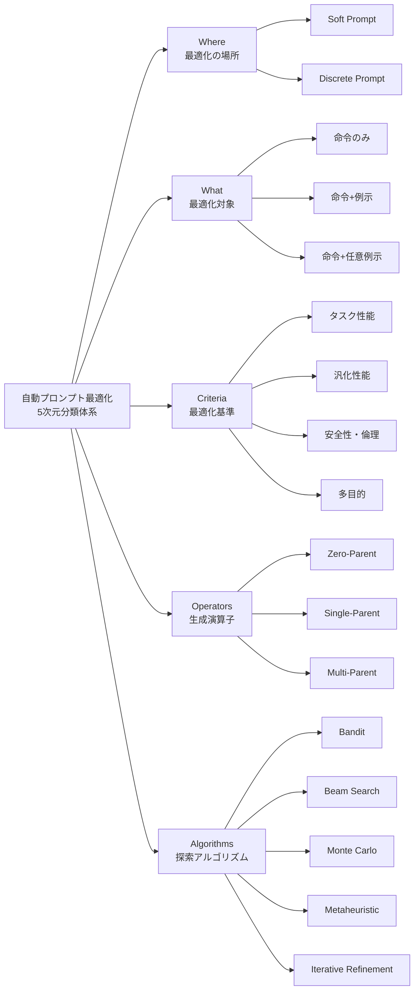
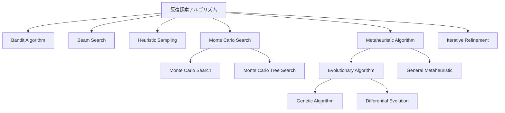

## 論文概要

本記事は [ACL 2025 Findings](https://aclanthology.org/2025.findings-acl.1140/) で発表されたサーベイ論文の解説記事です。

LLMの性能を引き出すプロンプト設計は、chain-of-thoughtやstep-by-stepのような手動手法が広く使われているが、これらは人間の直感と試行錯誤に依存する。本論文は、ヒューリスティック探索アルゴリズムに基づく**自動プロンプト最適化**（Automatic Instruction-focused Prompt Optimization）の手法群を包括的にサーベイし、5つの次元による分類体系（taxonomy）を提案している。最適化の「場所」「対象」「基準」「演算子」「探索アルゴリズム」という5軸で既存手法を整理することで、研究者や実務者が手法間の違いとトレードオフを把握し、新しい最適化パイプラインを構築する際の指針を提供している。

この記事は [Zenn記事: DSPy 3.3 Flex×GEPAでLLMパイプラインの構造ごと自動最適化する](https://zenn.dev/0h_n0/articles/94463814c80394) の深掘りである。Zenn記事が扱うDSPy 3.3のGEPAおよびMIPROv2オプティマイザは、本サーベイの分類体系においてそれぞれ異なる次元の組み合わせとして位置づけられる。

## 情報源

- **種別**: カンファレンス論文（サーベイ）
- **会議名**: ACL 2025 Findings（Findings of the Association for Computational Linguistics: ACL 2025）
- **タイトル**: Automatic Prompt Optimization via Heuristic Search: A Survey
- **著者**: Wendi Cui, Jiaxin Zhang, Zhuohang Li, Hao Sun, Damien Lopez, Kamalika Das, Bradley A. Malin, Sricharan Kumar
- **所属**: Intuit, Intuit AI Research, Vanderbilt University, University of Cambridge, Vanderbilt University Medical Center
- **URL**: [https://aclanthology.org/2025.findings-acl.1140/](https://aclanthology.org/2025.findings-acl.1140/)
- **ページ**: 22093--22111
- **DOI**: 10.18653/v1/2025.findings-acl.1140
- **GitHub**: [https://github.com/jxzhangjhu/Awesome-LLM-Prompt-Optimization](https://github.com/jxzhangjhu/Awesome-LLM-Prompt-Optimization)

## カンファレンス情報

ACL（Association for Computational Linguistics）は自然言語処理（NLP）分野における最も権威あるカンファレンスの1つであり、2025年はオーストリア・ウィーンで7月27日から8月1日にかけて開催された。本論文はFindings採択であり、メインカンファレンスの基準に近い品質を持ちつつも、テーマの方向性やスペースの制約からFindingsに配分された論文である。サーベイ論文がFindingsに採択されることは珍しくなく、分野の体系化に貢献する重要な位置づけを持つ。

## 技術的詳細

### プロンプト最適化の定式化

著者らは、自動プロンプト最適化を以下のように定式化している。プロンプト $p$ は命令（instruction）$I$ と任意の例示（examples）$E$ から構成される。

$$
p = (I, E)
$$

最適化の目標は、評価関数 $f$ を最大化するプロンプト $p^*$ を見つけることである。

$$
p^* = \arg\max_{p \in \mathcal{P}} f(p, \mathcal{D}_{\text{val}})
$$

ここで $\mathcal{P}$ はプロンプト空間、$\mathcal{D}_{\text{val}}$ は検証データセットである。この定式化において、手動のプロンプトエンジニアリングは人間が $\mathcal{P}$ 内を直感的に探索する行為であり、自動プロンプト最適化はヒューリスティック探索アルゴリズムによってこの探索を体系的に行う手法群として位置づけられる。

### 5次元の分類体系

著者らは既存手法を5つの次元で分類する体系を提案している。以下にその全体像を示す。

### 次元1: 最適化の場所（Where）

プロンプト最適化が行われる空間として、**Soft Prompt空間**と**Discrete Prompt空間**の2種類が存在する。

**Soft Prompt空間**は連続ベクトル空間上で最適化を行う。勾配ベースの手法（Gradient for Embeddings、Gradient for Targets、Gradient for Vocabulary）と非勾配ベースの手法（ベイズ最適化等）に細分される。ZOPOはゼロ次最適化を用いて、明示的な勾配計算なしにソフトプロンプトを洗練する。GCG（Greedy Coordinate Gradient）は損失関数の勾配を利用してトークン単位での置換対象を特定する手法である。

**Discrete Prompt空間**は自然言語テキストとしてプロンプトを直接操作する。解釈可能性が高く、LLMのAPIアクセスのみで利用可能であるため、実務的な適用範囲が広い。ProTeGiはLLMベースのフィードバックシステムで疑似勾配を生成し、ビームサーチと組み合わせて離散プロンプトを反復的に洗練する。EvoPrompt（Guo et al., 2024）は進化的アルゴリズムを統合し、意味的な変異・交叉・差分メカニズムによって離散プロンプトを反復的に改善する。

本サーベイの主眼は**instruction-focused**な自動最適化であり、離散プロンプト空間における命令中心の手法に重点を置いている。

### 次元2: 最適化対象（What）

最適化対象は3つのパラダイムに分類される。

**命令のみの最適化（Instruction-only）** は、命令テキストそのものをリフレーズ、制約追加、コンテキスト付与などで改善する。初期の研究（APE、OPRO等）の多くがこのカテゴリに属する。AELP（Hsieh et al., 2024）やSCULPT（Kumar et al., 2024）は命令の部分的な修正に焦点を当てる。

**命令と例示の同時最適化（Instruction & Example）** は近年の主流であり、3つのサブパラダイムが存在する。

1. **Example to Instruction**: 例示を先に選択・前処理し、それに基づいて命令を生成する。MoP（Wang et al., 2024a）は例示をExpert Subregionsにクラスタリングし、各クラスタに特化した命令を導出する
2. **Instruction to Example**: 命令から出発して例示を生成する。MIPRO（Opsahl-Ong et al., 2024）は初期命令を用いて成功入出力ペアを例示として作成し、命令を補強する
3. **Concurrent Instruction and Example**: 命令と例示を同時に最適化する。EASE（Wu et al., 2024）は事前定義された候補プールからバンディットアルゴリズムで最適な組み合わせを選択する

**命令と任意例示の最適化（Instruction & Optional Example）** は、few-shotとzero-shotを動的に選択する。PhaseEvo（Cui et al., 2024b）がこのカテゴリの代表例であり、タスクに応じてfew-shot/zero-shotの最適な戦略を選択する柔軟な枠組みを提供する。DeepSeek-AI et al.（2025）の知見として、few-shot promptingが常に性能向上をもたらすわけではなく、場合によっては性能を低下させることが報告されており、この動的選択の重要性を裏付けている。

### 次元3: 最適化基準（Criteria）

最適化の際に何を目的関数とするかは4つのカテゴリに分類される。

| 基準 | 説明 | 代表的手法 |
|------|------|-----------|
| タスク性能 | 検証セットでの精度等のタスク固有指標を最大化 | OPRO, APE, EvoPrompt |
| 汎化性能 | 複数ドメイン・タスクにわたる頑健性を最適化 | Li et al. (2024a) Concentrate |
| 安全性・倫理 | 敵対的操作への耐性やジェイルブレイク防止 | RPO (Zhou et al., 2024) |
| 多目的 | 精度・効率・安全性等の複数目標のバランス | SOS (Sinha et al., 2024) |

多目的最適化では、SOSがインタリーブ型進化アルゴリズムを採用し、タスク性能と安全性を交互に最適化する手法と、パレート最適化により全目的を並列に追求する手法の両方が存在すると著者らは整理している。

### 次元4: プロンプト生成演算子（Operators）

新しいプロンプト候補を生成するメカニズムは、必要とする「親プロンプト」の数に基づいて分類される。

**Zero-Parent演算子** は既存のプロンプトなしに新規候補を生成する。
- **Lamarckian演算子**: 成功した入出力ペアから命令を逆推定する。APE（Zhou et al., 2023）やMIPRO（Opsahl-Ong et al., 2024）で使用され、初期化フェーズで特に効果的である。具体的には、入出力ペアを与えて「この入力に対してこの出力を生成させた命令は何か」をLLMに推論させる
- **Model-Based**: 確率モデル（ベイズ最適化等）で候補を生成する。MIPROはTree-structured Parzen Estimatorを用いたサロゲートモデルで命令と例示のペアを選択する

**Single-Parent演算子** は1つの親プロンプトから派生候補を生成する。
- **Semantic演算子（Partial Application）**: プロンプトの一部のみを選択的に変更する。AELPやSCULPTが代表例
- **Semantic演算子（Whole Prompt Application）**: プロンプト全体に変換を適用する。PhaseEvo（Cui et al., 2024b）はLLMベースのセマンティック演算子でlast-mile最適化を行う
- **Feedback演算子**: LLMフィードバック（自己反省）、人間フィードバック、勾配フィードバックの3種類。GEPAの反射メカニズムはLLMフィードバック演算子の一形態として位置づけられる
- **Add/Subtract/Replace**: プロンプトの要素を追加・削除・置換する離散操作

**Multi-Parent演算子** は複数の親プロンプトから新候補を生成する。
- **EDA**: 複数の親プロンプトとその性能情報を組み合わせる。OPRO（Yang et al., 2023a）が代表例
- **Crossover**: 遺伝的アルゴリズムに基づき、2つの親プロンプトの要素を交配する
- **Difference**: 差分進化に基づき、プロンプト間の差異パターンを抽出して新候補を生成する。EvoPrompt-DE（Guo et al., 2024）が代表例

### 次元5: 反復探索アルゴリズム（Algorithms）

プロンプト候補の探索を導くアルゴリズムは6つのカテゴリに分類される。

**Bandit Algorithm**: 探索と活用のバランスを取る意思決定フレームワーク。Wu et al.（2024）はプロンプト選択をバンディット問題として定式化し、例示の埋め込みに基づいて有効性を予測する。Shi et al.（2024）のBAI-FBは制約された予算内で最適プロンプトを効率的に探索する。

**Beam Search**: 有望な候補集合を段階的に拡張し、効果の低い候補を刈り込むことで大きな探索空間を効率的に探索する。ProTeGi（Pryzant et al., 2023）やERM（Yan et al., 2024）がビームサーチを使用する。ProTeGiはLLMベースのフィードバックで疑似勾配を生成し、ビームサーチと組み合わせて反復的にプロンプトを洗練する手法であり、離散空間における勾配降下法のアナロジーとして理解できる。

**Heuristic Sampling**: ルールベースの戦略で大量の候補から効率的に代表候補を選出する。PROMPST（Chen et al., 2024b）は人間のフィードバックに基づくヒューリスティックサンプリングを採用している。

**Monte Carlo Search**: ランダムサンプリングを通じて探索空間を確率的に評価する。APE（Zhou et al., 2023）がモンテカルロ探索を活用してプロンプトエンジニアリングを強化している。Monte Carlo Tree Search（MCTS）はさらに体系的なアプローチであり、PromptAgent（Wang et al., 2024c）はMCTSを用いて各ノードがプロンプト候補を表す探索木を構築し、状態-行動価値関数で反復的にプロンプトを洗練する。

**Metaheuristic Algorithm**: 自然界のプロセスに着想を得た汎用探索戦略。進化的アルゴリズム（Genetic Algorithm、Differential Evolution）はプロンプト最適化で特に広く採用されている。EvoPrompt（Guo et al., 2024）はGA（変異・選択・交叉）とDE（差分ベースの候補生成）の両方を体系的に比較し、タスクごとに最適なアルゴリズムが異なることを示している。その他のメタヒューリスティクスとしてHill Climbing、Simulated Annealing、Tabu Search、Harmony Searchなども採用されている。

**Iterative Refinement**: 異なる演算子を繰り返し適用してプロンプトを洗練するアルゴリズム群。勾配降下法がこのカテゴリの代表例であり、ZOPO（Hu et al., 2024）やDPO（Wang et al., 2024b）などが該当する。PhaseEvo（Cui et al., 2024b）の段階的アルゴリズムもここに含まれ、探索と活用の4フェーズを通じて効率を大幅に改善すると著者らは報告している。

### DSPy・GEPA・MIPROv2の位置づけ

本サーベイの分類体系に基づいて、Zenn記事で扱われているDSPy 3.3のオプティマイザを整理する。

**DSPy**は、本サーベイにおいてプロンプト最適化ツールの代表例として言及されている（Table 3）。宣言的なアプローチで複雑なLLMアプリケーションを構築し、MIPROを実装してプログラムの目標を達成するための基盤プロンプトを生成・最適化すると著者らは述べている。離散プロンプト空間における「タスク分解とサンプルブートストラップ」を特徴とするオープンソースツールとして位置づけられている。

| 次元 | GEPA（反射型） | MIPROv2（ベイズ型） |
|------|---------------|------------------|
| Where | Discrete Prompt | Discrete Prompt |
| What | Instruction & Optional Example | Instruction & Example |
| Criteria | タスク性能 | タスク性能 |
| Operators | Single-Parent (Feedback/LLM-Feedback) | Zero-Parent (Lamarckian + Model-Based) |
| Algorithms | Iterative Refinement | Monte Carlo + Metaheuristic |

**GEPA**の反射メカニズムは、本サーベイの分類ではSingle-Parent Feedback演算子のうちLLM-Feedbackに該当する。LLMの自己反省能力を活用して現在のプロンプトの欠陥を特定し、改善を提案する。探索アルゴリズムとしてはIterative Refinementに分類され、各反復で演算子を繰り返し適用してプロンプトを段階的に改善する。

**MIPROv2**は複数の次元にまたがる複合的な手法である。Zero-Parent演算子としてLamarckian演算子（成功入出力ペアからの命令逆推定）を初期化に使用し、Tree-structured Parzen Estimator（ベイズ最適化の一種）をサロゲートモデルとして命令と例示の最適な組み合わせを探索する。各ステージをモジュールとして扱い、ベイズ探索で最適な組み合わせを特定するマルチステージ最適化が特徴である。

### 主要手法の比較

以下に本サーベイで取り上げられている代表的な手法を分類軸に沿って比較する。

| 手法 | 空間 | 対象 | 演算子 | アルゴリズム |
|------|------|------|--------|-------------|
| APE (Zhou et al., 2023) | Discrete | 命令のみ | Zero-Parent (Lamarckian) | Monte Carlo |
| OPRO (Yang et al., 2023a) | Discrete | 命令のみ | Multi-Parent (EDA) | Iterative Refinement |
| ProTeGi (Pryzant et al., 2023) | Discrete | 命令のみ | Single-Parent (Feedback) | Beam Search |
| EvoPrompt (Guo et al., 2024) | Discrete | 命令のみ | Multi-Parent (Crossover/Difference) | Metaheuristic (GA/DE) |
| MIPRO (Opsahl-Ong et al., 2024) | Discrete | 命令+例示 | Zero-Parent (Lamarckian + Model-Based) | Metaheuristic |
| PhaseEvo (Cui et al., 2024b) | Discrete | 命令+任意例示 | Single-Parent (Semantic) | Iterative Refinement (Phased) |
| InstructZero (Chen et al., 2024a) | Soft | 命令のみ | Zero-Parent (Model-Based) | Iterative Refinement |
| GCG (Zou et al., 2023) | Soft | 命令のみ | N/A (勾配ベース) | Iterative Refinement |
| PromptAgent (Wang et al., 2024c) | Discrete | 命令のみ | Single-Parent | Monte Carlo (MCTS) |

### 共通データセットとツール

著者らはプロンプト最適化の評価に使用される主要なデータセットとして、**BBH**（Big-Bench Hard）と**Instruction Induction**の2つを特に重要なものとして挙げている。BBHはLLMの限界を探るための困難なタスク群であり、Instruction Inductionは入出力例から命令を推論するタスクに特化したデータセットである。

ツールに関しては、以下の8つが比較されている。

| ツール | 最適化空間 | 主な特徴 | オープンソース |
|--------|----------|---------|-------------|
| PromptPerfect | Discrete | Webベース、ユーザークエリ向け | No |
| PromptIM | Discrete | 人間参加型の反復改善 | Yes |
| DSPy | Discrete | タスク分解とサンプルブートストラップ | Yes |
| OpenPrompt | Soft/Discrete | プロンプト学習テンプレート | Yes |
| Vertex AI | Discrete | Google Cloudベース最適化 | No |
| PromptBench | Discrete | プロンプトの頑健性テスト | Yes |
| AWS Bedrock | Discrete | A/Bテスト付きプレイグラウンド | No |
| Anthropic Claude | Discrete | ライブフィードバック付き対話型エディタ | No |

## 実験結果

本論文はサーベイ論文であるため独自の実験は含まないが、対象手法群に関する定量的な分析を行っている。

著者らはヒューリスティック探索に基づく自動プロンプト最適化の研究が近年急速に増加していることを示している。カバーする手法は2023年以降の研究に集中しており、離散プロンプト空間の手法がソフトプロンプト空間の手法より多く報告されている。これは、API経由でのみアクセス可能な大規模LLM（GPT-4、Claude等）の普及に伴い、勾配にアクセスできない設定での最適化需要が増大していることを反映している。

探索アルゴリズム別では、Metaheuristic Algorithm（特に進化的手法）が最も多く採用されている。演算子別ではSingle-Parent演算子（特にLLM-Feedbackベースのセマンティック演算子）の採用が目立ち、LLMの自己反省能力を活用した反復改善が主流のアプローチとなっていることがわかる。

最適化対象については、初期の研究は命令のみの最適化が中心であったが、命令と例示の同時最適化が増加傾向にある。特にDeepSeek-AI et al.（2025）によるfew-shot promptingの性能低下報告を受けて、命令と任意例示の動的最適化（Instruction & Optional Example）という新しいパラダイムの重要性が著者らによって指摘されている。

## 実運用への応用

### プロンプト最適化手法の選択指針

本サーベイの5次元分類体系は、実務でプロンプト最適化手法を選択する際の体系的な指針として利用できる。

**勾配アクセスの有無が最初の分岐点**となる。クローズドモデル（API経由）を使用する場合は離散プロンプト空間の手法に限定され、オープンソースモデルを自社でホスティングしている場合はソフトプロンプト空間の手法も選択肢に入る。

**計算予算と探索範囲のトレードオフ**では、限られたAPI呼び出し回数で最適化したい場合はBandit Algorithmやビームサーチが適切であり、十分な計算予算がある場合はMetaheuristic Algorithm（進化的手法）やMonte Carloサーチでより広い探索空間をカバーできる。

### DSPy 3.3におけるGEPA/MIPROv2選択フローとの対応

Zenn記事で解説されているDSPy 3.3のオプティマイザ選択は、本サーベイの分類体系で以下のように整理できる。

- **少数の検証データで素早く改善したい場合**: GEPA（反射型）が適切。Single-Parent Feedback演算子による反復改善は少ないLLM呼び出しで収束するため、探索コストが低い
- **十分な検証データがあり最高精度を追求する場合**: MIPROv2（ベイズ型）が適切。Zero-Parent演算子による多様な初期候補生成とベイズ探索による体系的な組み合わせ最適化により、より広い探索空間をカバーする
- **few-shot/zero-shotの最適戦略が不明な場合**: PhaseEvoのようなInstruction & Optional Exampleパラダイムの考え方を取り入れ、動的に選択する設計が望ましい

本サーベイの「演算子はレシピの材料（add, replace, rephrase）、アルゴリズムは調理法（bake with GA, slow simmer with beam search）」というアナロジーは、実務者がプロンプト最適化パイプラインを設計する際の直感的な指針となる。

## 関連研究

自動プロンプト最適化に関するサーベイは複数存在する。本サーベイの特徴は、ヒューリスティック探索アルゴリズムに焦点を絞り、5次元の分類体系を提案した点にある。

著者ら自身の制限事項として、本サーベイはIn-Context Learning最適化や強化学習ベースの手法をカバーしていないこと、および2023年以降の研究に焦点を当てているため、それ以前の研究が十分にカバーされていない可能性があることが明記されている。また、example-focused最適化（ICLのサンプル選択最適化）は本サーベイのスコープ外であり、instruction-focusedなアプローチに限定している。

プロンプト最適化ツールの実装面では、DSPy以外にもOpenPrompt（テンプレートベースのプロンプト学習フレームワーク）、PromptIM（人間参加型の反復改善）、VertexAI Prompt Optimizer（Google Cloudベース）など複数のツールが存在し、それぞれ異なるユースケースに対応している。

## まとめと今後の展望

本サーベイは、ヒューリスティック探索に基づく自動プロンプト最適化手法を5次元（Where, What, Criteria, Operators, Algorithms）の分類体系で整理し、各次元の選択肢と代表的手法を網羅的にマッピングした。著者らの主張する「演算子と探索アルゴリズムの自由な組み合わせ」という設計思想は、DSPy 3.3のようなフレームワークにおけるオプティマイザの選択と拡張に直接的な示唆を与える。

著者らが挙げる今後の課題として、(1) ソフトプロンプトから離散プロンプトへの射影問題、(2) few-shot/zero-shotの動的選択の重要性、(3) マルチエージェントシステムにおける並行最適化、(4) 多目的最適化のパレートフロント近似、(5) ドメイン横断的なスケーラビリティ、(6) オンライン最適化の効率化がある。特にオンライン最適化については、既存手法が数千回のAPI呼び出しを必要とする点が実用上の障壁であり、インクリメンタルな更新ルールやメモリ効率の良いサロゲートモデルによるリアルタイム最適化への発展が期待されている。

## 参考文献

- **ACL 2025 Findings**: [https://aclanthology.org/2025.findings-acl.1140/](https://aclanthology.org/2025.findings-acl.1140/)
- **GitHub (Awesome-LLM-Prompt-Optimization)**: [https://github.com/jxzhangjhu/Awesome-LLM-Prompt-Optimization](https://github.com/jxzhangjhu/Awesome-LLM-Prompt-Optimization)
- **Related Zenn article**: [https://zenn.dev/0h_n0/articles/94463814c80394](https://zenn.dev/0h_n0/articles/94463814c80394)
- Zhou et al., 2023. "Large Language Models Are Human-Level Prompt Engineers." ICLR 2023.
- Yang et al., 2023a. "Large Language Models as Optimizers." NeurIPS 2023.
- Pryzant et al., 2023. "Automatic Prompt Optimization with 'Gradient Descent' and Beam Search." EMNLP 2023.
- Guo et al., 2024. "Connecting Large Language Models with Evolutionary Algorithms Yields Powerful Prompt Optimizers." ICLR 2024.
- Opsahl-Ong et al., 2024. "Optimizing Instructions and Demonstrations for Multi-Stage Language Model Programs." arXiv:2406.11695.
- Cui et al., 2024b. "Phaseevo: Towards unified in-context prompt optimization for large language models." arXiv:2402.11347.
