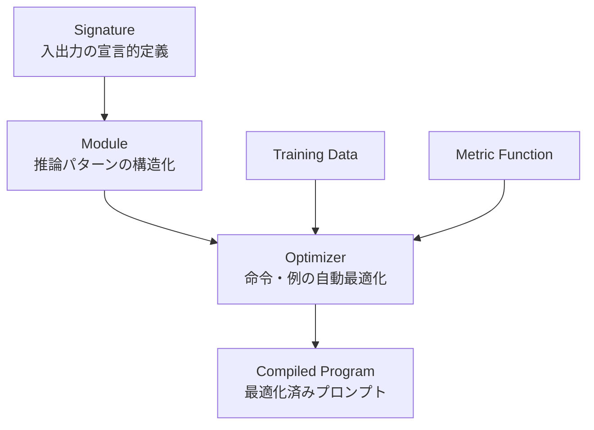

本記事は [Is It Time To Treat Prompts As Code? A Multi-Use Case Study For Prompt Optimization Using DSPy](https://arxiv.org/abs/2507.03620) の解説記事です。

## 論文概要

Lemos et al. (2025) は、プロンプトエンジニアリングが依然として手作業の試行錯誤に依存している現状に対し、DSPy (Declarative Self-improving Python) フレームワークによる体系的なプロンプト最適化を5つの実務ユースケースで検証した。対象タスクはジェイルブレイク検出、コード幻覚検出、コード生成、ルーティングエージェント、プロンプト評価基準の5種であり、MIPROv2やBootstrapFewShotWithRandomSearch等のオプティマイザを適用した結果、タスクによって改善幅が大きく異なることが報告されている。特にプロンプト評価タスクでは46.2%から64.0%へ+17.8ポイントの改善が確認された一方、安価なモデルへの転移効果は限定的であるという制約も示されている。

この記事は [Zenn記事: DSPy 3.3 Flex×GEPAでLLMパイプラインの構造ごと自動最適化する](https://zenn.dev/0h_n0/articles/94463814c80394) の深掘りです。Zenn記事ではDSPy 3.3の新機能であるFlex CompositionやGEPAオプティマイザに焦点を当てているが、本論文はDSPy 2系列のMIPROv2・BootstrapFewShotを用いた実務タスクでの有効性を複数ユースケースで横断的に検証しており、DSPy最適化の実効性を判断する上での補完的な知見を提供している。

## 情報源

- **arXiv ID**: 2507.03620
- **URL**: [https://arxiv.org/abs/2507.03620](https://arxiv.org/abs/2507.03620)
- **著者**: Francisca Lemos, Victor Alves, Filipa Ferraz (ALGORITMI Research Centre/LASI, University of Minho)
- **発表年**: 2025年
- **分野**: cs.SE (Software Engineering), cs.AI, cs.CL, cs.LG

## 背景と動機

LLMの能力を引き出すためのプロンプトエンジニアリングは、現在もなお人間の直感と試行錯誤に大きく依存している。Few-shot例の選択、命令文の表現、出力フォーマットの指定といった要素はタスク性能に大きく影響するが、最適な組み合わせを体系的に探索する方法は確立されていない。

DSPyはStanford NLPグループが開発したフレームワークであり、プロンプトを手動で調整する代わりに、Pythonプログラムとして宣言的に定義し、コンパイラが自動最適化するアプローチを提供する。従来の手作業プロンプトエンジニアリングとの根本的な違いは、プロンプトを「テキスト」ではなく「コード」として扱う点にある。

しかし、DSPyの最適化が実務タスクでどの程度有効かについては、体系的な検証が不足していた。特に、タスク特性によって最適化の効果がどう変動するか、命令最適化と例選択のどちらが効果的か、最適化プロンプトの安価なモデルへの転移可能性はあるかといった実務上の問いに対する定量的な回答が求められていた。著者らはこれらの問いに答えるため、5つの異なる実務ユースケースでDSPyの最適化パイプラインを検証している。

## 主要な貢献

- **貢献1**: ジェイルブレイク検出、コード幻覚検出、コード生成、ルーティングエージェント、プロンプト評価基準の5つの実務タスクにおいて、DSPyの体系的なプロンプト最適化の効果を定量的に検証した
- **貢献2**: MIPROv2、BootstrapFewShotWithRandomSearch、CustomMIPROv2（著者らの拡張版）の3種のオプティマイザを比較し、命令チューニングと例選択の組み合わせが最も効果的であることを示した
- **貢献3**: 最適化プロンプトの安価なモデルへの転移効果が限定的であることを実証し、モデル固有の最適化の必要性を示した
- **貢献4**: DSPyのコンパイルフェーズにおける計算コストとタスク依存的な効果のトレードオフを定量的に議論した

## 技術的詳細

### DSPyのコンパイルパイプライン

DSPyの最適化パイプラインは、Signature、Module、Optimizerの3層構造で構成される。



**Signature**は入力と出力の型・説明を宣言的に定義する。手動でプロンプト文字列を構成するのではなく、タスクの入出力仕様をPythonクラスとして表現する。

**Module**はSignatureを推論パターン（Chain-of-Thought、Voting等）と組み合わせた処理単位である。DSPyでは`dspy.ChainOfThought`、`dspy.Predict`等のビルトインモジュールが提供されている。

**Optimizer**はTraining DataとMetric Functionを用いて、Moduleの命令文やFew-shot例を自動的に最適化する。本論文では以下の3種のオプティマイザが使用されている。

### MIPROv2（Multiprompt Instruction PRoposal Optimizer v2）

MIPROv2はベイズ最適化に基づくオプティマイザであり、命令文とFew-shot例の両方を同時に最適化する。最適化プロセスは以下の手順で行われる。

1. **命令候補の生成**: LLMを用いて複数の命令文候補を生成
2. **例候補の生成**: 訓練データからBootstrap方式でFew-shot例の候補を作成
3. **ベイズ探索**: 命令文と例の組み合わせをベイズ最適化で効率的に探索
4. **評価**: 各候補をValidationセット上のメトリクスで評価

最適化の目標関数は以下のように定式化される。

$$
\theta^* = \arg\max_{\theta \in \Theta} \frac{1}{|D_{\text{val}}|} \sum_{(x, y) \in D_{\text{val}}} m(f_\theta(x), y)
$$

ここで、$\theta$は命令文とFew-shot例の組み合わせ、$\Theta$は探索空間、$D_{\text{val}}$はValidationセット、$m$は評価メトリクス、$f_\theta$はパラメータ$\theta$を用いたプログラムの出力である。

### BootstrapFewShotWithRandomSearch

BootstrapFewShotWithRandomSearchは、訓練データ上でプログラムを実行し、正解した入出力ペアをFew-shot例として収集する。その後、収集した例からランダムに組み合わせを生成し、Validationセット上で最良の組み合わせを選択する。命令文の最適化は行わず、例の選択のみに特化している。

### CustomMIPROv2（著者らの拡張）

著者らはルーティングエージェントとプロンプト評価タスクにおいて、MIPROv2を拡張したCustomMIPROv2を提案している。標準のMIPROv2が単一ステップで命令を生成するのに対し、CustomMIPROv2は2段階のプロセスを採用する。

1. **GetConstraintsFromDemos**: デモンストレーションから制約条件を抽出
2. **GenerateSingleModuleInstruction**: 抽出した制約とユーザ提供のヒントを用いて命令を生成

この拡張により、ドメイン固有の知識（例: 「会話のフローとトーンに注意し、適切なロールを選択すべき」）を最適化プロセスに組み込むことが可能になる。

## 実装のポイント

### Signatureの設計が性能を左右する

プロンプト評価タスクにおいて、Signatureの定義方法が最適化前の性能に大きく影響することが報告されている。初期のSignature（単純な評価指示）では56.3%であったが、3種類の矛盾タイプ（Instruction Contradiction、Format Contradiction、Example Contradiction）を明示的に定義したSignatureでは、最適化前のベースラインが53.8%に低下した。しかし、このより具体的なSignatureにMIPROv2を適用した場合、最終的に64.0%に到達しており、最適化の改善幅はSignatureの具体性と相関する傾向が示されている。

### メトリクス設計の重要性

コード幻覚検出タスクでは、最適化メトリクスの選択が結果に大きく影響している。Exact Matchメトリクスで最適化した場合は精度82%・再現率94.6%に達したが、Recallメトリクスに切り替えた場合は精度81%・再現率85.6%と異なるトレードオフが得られている。評価メトリクスはタスクの要件（偽陰性の許容度、偽陽性のコスト等）に応じて慎重に選択する必要がある。

### コンテンツフィルタリングへの対処

ジェイルブレイク検出タスクでは、Azure OpenAIのコンテンツフィルタリングが最適化の反復を阻害する問題が報告されている。DAN (Do Anything Now) データセットを用いた最適化中に、ジェイルブレイクプロンプト自体がフィルタリングに引っかかるため、十分な最適化反復が実行できなかった。実務でセキュリティ関連タスクにDSPyを適用する際には、フィルタリング設定の緩和やオンプレミスモデルの利用を検討する必要がある。

```python
import dspy
from typing import Literal

class JailbreakSignature(dspy.Signature):
    """Classify whether the given prompt is a jailbreak attempt.

    Analyze the prompt for manipulation patterns including
    role-playing requests, instruction override attempts,
    and boundary-testing language.
    """

    prompt: str = dspy.InputField(desc="The user prompt to classify")
    reasoning: str = dspy.OutputField(desc="Step-by-step analysis of jailbreak indicators")
    classification: Literal["safe", "jailbreak"] = dspy.OutputField(
        desc="Classification result"
    )


class SafetyValidator(dspy.Module):
    """Safety validation module with Chain-of-Thought reasoning.

    Args:
        signature: DSPy Signature defining input/output schema
    """

    def __init__(self) -> None:
        super().__init__()
        self.classify = dspy.ChainOfThought(JailbreakSignature)

    def forward(self, prompt: str) -> dspy.Prediction:
        """Run jailbreak classification on input prompt.

        Args:
            prompt: User prompt to classify

        Returns:
            Prediction with classification and reasoning
        """
        return self.classify(prompt=prompt)
```

## Production Deployment Guide

DSPyのコンパイルパイプラインをプロダクション環境で運用する際の設計指針を示す。本論文では5つのユースケースそれぞれにDSPyプログラムの実装が含まれており、コンパイル済みプロンプトの保存・ロード・推論のライフサイクル管理が実務上の課題となる。

### AWS実装パターン（コスト最適化重視）

DSPyのプロダクション運用は「コンパイルフェーズ（オフライン最適化）」と「推論フェーズ（オンライン提供）」に分離される。コンパイルフェーズはバッチ処理として実行し、最適化済みプロンプトをアーティファクトとして保存する。推論フェーズはこのアーティファクトをロードして低レイテンシで応答する。

| 構成 | トラフィック | サービス構成 | 月額概算 |
|------|-------------|-------------|---------|
| Small | ~100 req/日 | Lambda (ARM64) + Bedrock + S3 + DynamoDB (On-Demand) | $50-130 |
| Medium | ~1,000 req/日 | ECS Fargate + Bedrock + ElastiCache (Redis) + S3 | $350-700 |
| Large | 10,000+ req/日 | EKS (Spot) + Karpenter + Bedrock + ElastiCache + S3 | $2,000-4,500 |

**コンパイルフェーズ（全構成共通）**: Step Functions + Batch/Fargate Spot で定期実行。MIPROv2のコンパイルはLLM呼び出しが多数発生するため、Bedrock Batch APIを利用して50%のコスト削減が可能。コンパイル済みアーティファクトはS3に保存し、推論フェーズからロードする。

**コスト試算の注意事項**: 上記は2026年8月時点のAWS ap-northeast-1料金に基づく概算値。コンパイルフェーズのLLM呼び出し回数はオプティマイザ設定（MIPROv2の`num_candidates`等）に大きく依存するため、実際のコストはパイプライン構成により変動する。

### Terraformインフラコード

**Small構成（Serverless）**: Lambda + Bedrock + S3 + DynamoDB

```hcl
# Small構成: DSPyコンパイル済みプロンプトの推論サービング
terraform {
  required_version = ">= 1.9"
  required_providers {
    aws = { source = "hashicorp/aws", version = "~> 5.60" }
  }
}

provider "aws" { region = "ap-northeast-1" }

# S3: コンパイル済みDSPyアーティファクト保存
resource "aws_s3_bucket" "dspy_artifacts" {
  bucket = "dspy-compiled-prompts-${data.aws_caller_identity.current.account_id}"
}

resource "aws_s3_bucket_server_side_encryption_configuration" "dspy_artifacts" {
  bucket = aws_s3_bucket.dspy_artifacts.id
  rule {
    apply_server_side_encryption_by_default {
      sse_algorithm = "aws:kms"
    }
  }
}

resource "aws_s3_bucket_versioning" "dspy_artifacts" {
  bucket = aws_s3_bucket.dspy_artifacts.id
  versioning_configuration { status = "Enabled" }
}

data "aws_caller_identity" "current" {}

# IAM: 最小権限（Bedrock InvokeModel + S3 Read + DynamoDB + CloudWatch Logs）
resource "aws_iam_role" "dspy_inference_lambda" {
  name = "dspy-inference-lambda-role"
  assume_role_policy = jsonencode({
    Version = "2012-10-17"
    Statement = [{ Action = "sts:AssumeRole", Effect = "Allow",
      Principal = { Service = "lambda.amazonaws.com" } }]
  })
}

resource "aws_iam_role_policy" "lambda_dspy" {
  name = "dspy-inference-policy"
  role = aws_iam_role.dspy_inference_lambda.id
  policy = jsonencode({
    Version = "2012-10-17"
    Statement = [
      { Effect = "Allow", Action = ["bedrock:InvokeModel"],
        Resource = "arn:aws:bedrock:ap-northeast-1::foundation-model/anthropic.claude-*" },
      { Effect = "Allow", Action = ["s3:GetObject"],
        Resource = "${aws_s3_bucket.dspy_artifacts.arn}/*" },
      { Effect = "Allow", Action = ["dynamodb:PutItem", "dynamodb:GetItem", "dynamodb:Query"],
        Resource = aws_dynamodb_table.inference_log.arn },
      { Effect = "Allow", Action = ["logs:CreateLogGroup", "logs:CreateLogStream", "logs:PutLogEvents"],
        Resource = "arn:aws:logs:*:*:*" }
    ]
  })
}

# DynamoDB: 推論ログ・メトリクス記録
resource "aws_dynamodb_table" "inference_log" {
  name         = "dspy-inference-log"
  billing_mode = "PAY_PER_REQUEST"  # On-Demand: 低トラフィック向け
  hash_key     = "request_id"
  range_key    = "timestamp"
  attribute { name = "request_id"; type = "S" }
  attribute { name = "timestamp"; type = "N" }
  server_side_encryption { enabled = true }
  ttl { attribute_name = "ttl"; enabled = true }
}

# Lambda: DSPy推論サービング
resource "aws_lambda_function" "dspy_inference" {
  function_name    = "dspy-prompt-inference"
  runtime          = "python3.12"
  handler          = "handler.lambda_handler"
  role             = aws_iam_role.dspy_inference_lambda.arn
  architectures    = ["arm64"]  # Graviton: x86比20%安価
  memory_size      = 512        # DSPyモジュールロードに余裕を持たせる
  timeout          = 120        # Bedrock呼び出し含む
  filename         = "lambda.zip"
  source_code_hash = filebase64sha256("lambda.zip")
  environment {
    variables = {
      ARTIFACT_BUCKET   = aws_s3_bucket.dspy_artifacts.bucket
      ARTIFACT_KEY      = "compiled/latest.json"
      DYNAMODB_TABLE    = aws_dynamodb_table.inference_log.name
      BEDROCK_MODEL_ID  = "anthropic.claude-3-haiku-20240307-v1:0"
    }
  }
  tracing_config { mode = "Active" }  # X-Ray有効化
}

# CloudWatch: コスト異常検知アラーム
resource "aws_cloudwatch_metric_alarm" "lambda_duration" {
  alarm_name          = "dspy-inference-high-duration"
  comparison_operator = "GreaterThanThreshold"
  evaluation_periods  = 3
  metric_name         = "Duration"
  namespace           = "AWS/Lambda"
  period              = 300
  statistic           = "p95"
  threshold           = 90000  # 90秒超過で警告
  dimensions = { FunctionName = aws_lambda_function.dspy_inference.function_name }
  alarm_actions = []  # SNS ARNを設定
}
```

**Large構成（Container）**: EKS + Karpenter + Spot Instances

```hcl
# Large構成: EKS + Karpenter + Spot（10,000+ req/日）
module "eks" {
  source          = "terraform-aws-modules/eks/aws"
  version         = "~> 20.24"
  cluster_name    = "dspy-inference-cluster"
  cluster_version = "1.31"

  vpc_id     = module.vpc.vpc_id
  subnet_ids = module.vpc.private_subnets

  eks_managed_node_groups = {
    system = {
      instance_types = ["m7g.medium"]  # Graviton: コスト効率
      min_size       = 1
      max_size       = 2
      desired_size   = 1
      capacity_type  = "ON_DEMAND"  # システムノードはOn-Demand
    }
  }
}

# Karpenter: Spot優先の自動スケーリング
resource "kubectl_manifest" "karpenter_nodepool" {
  yaml_body = yamlencode({
    apiVersion = "karpenter.sh/v1"
    kind       = "NodePool"
    metadata   = { name = "dspy-inference" }
    spec = {
      template = {
        spec = {
          requirements = [
            { key = "karpenter.sh/capacity-type", operator = "In",
              values = ["spot", "on-demand"] },             # Spot優先
            { key = "node.kubernetes.io/instance-type", operator = "In",
              values = ["m7g.medium", "m7g.large", "m6g.large"] },
            { key = "kubernetes.io/arch", operator = "In",
              values = ["arm64"] }                          # Graviton
          ]
          nodeClassRef = { name = "default" }
        }
      }
      limits   = { cpu = "32", memory = "64Gi" }
      disruption = {
        consolidationPolicy = "WhenEmptyOrUnderutilized"
        consolidateAfter    = "30s"
      }
    }
  })
}

# Secrets Manager: Bedrock設定
resource "aws_secretsmanager_secret" "bedrock_config" {
  name        = "dspy-inference/bedrock-config"
  description = "DSPy inference Bedrock configuration"
}

# AWS Budgets: 月額予算アラート
resource "aws_budgets_budget" "dspy_monthly" {
  name         = "dspy-inference-monthly"
  budget_type  = "COST"
  limit_amount = "5000"
  limit_unit   = "USD"
  time_unit    = "MONTHLY"

  notification {
    comparison_operator       = "GREATER_THAN"
    threshold                 = 80
    threshold_type            = "PERCENTAGE"
    notification_type         = "ACTUAL"
    subscriber_email_addresses = ["ops-team@example.com"]
  }
}
```

### 運用・監視設定

**CloudWatch Logs Insights クエリ**: DSPyコンパイルとの性能比較分析

```
# コンパイル前後のレイテンシ比較
fields @timestamp, artifact_version, duration_ms, token_count
| filter event = "dspy_inference"
| stats avg(duration_ms) as avg_latency,
        p95(duration_ms) as p95_latency,
        avg(token_count) as avg_tokens
  by artifact_version
| sort artifact_version desc
| limit 10
```

**CloudWatch アラーム設定（Python）**:

```python
import boto3

def create_dspy_alarms(function_name: str, sns_topic_arn: str) -> None:
    """DSPy推論Lambda用のCloudWatchアラームを作成する。

    Args:
        function_name: Lambda関数名
        sns_topic_arn: 通知先SNSトピックARN
    """
    cw = boto3.client("cloudwatch", region_name="ap-northeast-1")

    # Bedrock トークン使用量スパイク検知
    cw.put_metric_alarm(
        AlarmName=f"{function_name}-token-spike",
        MetricName="TokenCount",
        Namespace="DSPy/Inference",
        Statistic="Sum",
        Period=3600,
        EvaluationPeriods=1,
        Threshold=500000,  # 1時間50万トークン超過で警告
        ComparisonOperator="GreaterThanThreshold",
        Dimensions=[{"Name": "FunctionName", "Value": function_name}],
        AlarmActions=[sns_topic_arn],
    )

    # Lambda実行時間異常検知
    cw.put_metric_alarm(
        AlarmName=f"{function_name}-high-duration",
        MetricName="Duration",
        Namespace="AWS/Lambda",
        ExtendedStatistic="p95",
        Period=300,
        EvaluationPeriods=3,
        Threshold=90000,
        ComparisonOperator="GreaterThanThreshold",
        Dimensions=[{"Name": "FunctionName", "Value": function_name}],
        AlarmActions=[sns_topic_arn],
    )
```

**X-Ray トレーシング設定（Python）**:

```python
from aws_xray_sdk.core import xray_recorder, patch_all
import boto3

# boto3自動計装
patch_all()

def trace_dspy_inference(
    request_id: str,
    artifact_version: str,
    task_type: str,
) -> None:
    """DSPy推論のX-Rayトレースにアノテーションを追加する。

    Args:
        request_id: リクエストID
        artifact_version: コンパイル済みアーティファクトのバージョン
        task_type: タスクタイプ (jailbreak, hallucination, codegen等)
    """
    segment = xray_recorder.current_segment()
    segment.put_annotation("artifact_version", artifact_version)
    segment.put_annotation("task_type", task_type)
    segment.put_metadata("request_id", request_id, "dspy")
```

**Cost Explorer自動レポート（Python）**:

```python
import boto3
from datetime import datetime, timedelta

def get_dspy_daily_cost(sns_topic_arn: str, threshold_usd: float = 100.0) -> dict:
    """DSPy関連AWSサービスの日次コストを取得し、閾値超過時にSNS通知する。

    Args:
        sns_topic_arn: 通知先SNSトピックARN
        threshold_usd: アラート閾値（USD/日）

    Returns:
        サービス別コスト辞書
    """
    ce = boto3.client("ce", region_name="us-east-1")
    today = datetime.utcnow().strftime("%Y-%m-%d")
    yesterday = (datetime.utcnow() - timedelta(days=1)).strftime("%Y-%m-%d")

    response = ce.get_cost_and_usage(
        TimePeriod={"Start": yesterday, "End": today},
        Granularity="DAILY",
        Metrics=["UnblendedCost"],
        Filter={
            "Tags": {
                "Key": "Project",
                "Values": ["dspy-inference"],
                "MatchOptions": ["EQUALS"],
            }
        },
        GroupBy=[{"Type": "DIMENSION", "Key": "SERVICE"}],
    )

    costs: dict[str, float] = {}
    total = 0.0
    for group in response["ResultsByTime"][0]["Groups"]:
        service = group["Keys"][0]
        amount = float(group["Metrics"]["UnblendedCost"]["Amount"])
        costs[service] = amount
        total += amount

    if total > threshold_usd:
        sns = boto3.client("sns", region_name="ap-northeast-1")
        sns.publish(
            TopicArn=sns_topic_arn,
            Subject=f"DSPy daily cost alert: ${total:.2f}",
            Message=f"Daily cost ${total:.2f} exceeded ${threshold_usd} threshold.\n{costs}",
        )

    return costs
```

### コスト最適化チェックリスト

**アーキテクチャ選択**:
- [ ] トラフィック100 req/日以下: Serverless (Lambda + Bedrock)
- [ ] トラフィック100-5,000 req/日: Hybrid (ECS Fargate + Bedrock)
- [ ] トラフィック5,000+ req/日: Container (EKS + Karpenter + Spot)

**リソース最適化**:
- [ ] EC2/EKS: Spot Instances優先（最大90%削減）
- [ ] Reserved Instances: 1年コミットで最大72%削減
- [ ] Savings Plans: Compute Savings Plansで柔軟なコミット
- [ ] Lambda: ARM64 (Graviton) でx86比20%安価
- [ ] Lambda: メモリサイズをPower Tuningで最適化
- [ ] ECS/EKS: アイドル時のスケールダウン設定

**LLMコスト削減**:
- [ ] Bedrock Batch API: コンパイルフェーズで50%削減
- [ ] Prompt Caching: コンパイル済みプロンプトの再利用で30-90%削減
- [ ] モデル選択: 推論フェーズはHaikuクラスの軽量モデル、コンパイルフェーズはSonnetクラス
- [ ] トークン数制限: Signatureのmax_tokens設定で不要な出力を抑制
- [ ] Few-shot例数の最適化: 例の数とコストのトレードオフを検証

**監視・アラート**:
- [ ] AWS Budgets: 月額予算を設定しSNS通知
- [ ] CloudWatch アラーム: トークン使用量・レイテンシの異常検知
- [ ] Cost Anomaly Detection: ML ベースの異常コスト検知
- [ ] 日次コストレポート: Cost Explorer APIで自動取得

**リソース管理**:
- [ ] 未使用S3アーティファクトの削除（ライフサイクルポリシー）
- [ ] タグ戦略: Project/Environment/Ownerタグを全リソースに付与
- [ ] DynamoDBのTTL設定: 推論ログの自動削除
- [ ] 開発環境の夜間停止: EKSノードの自動スケールダウン
- [ ] コンパイルジョブのSpot利用: Step Functions + Fargate Spot

## 実験結果

### ユースケース別の詳細結果

著者らが報告した5つのユースケースの結果を以下に示す。

**ユースケース1: ジェイルブレイク検出（DAN dataset, 6,142件）**

| 手法 | 精度 | 再現率 | 適合率 |
|------|------|--------|--------|
| 手動プロンプト | 59.0% | 100% | 72.4% |
| DSPy Baseline | 82.9% | 82.35% | -- |
| DSPy + BootstrapFewShot | **93.18%** | **100%** | **86.36%** |

手動プロンプトからDSPy最適化により精度が59.0%から93.18%へ大幅に改善されている。特筆すべきは再現率100%を維持したまま適合率が向上している点であり、セキュリティタスクにおいて偽陰性を許さない要件を満たしている。

**ユースケース2: コード幻覚検出（GPT-4o-mini使用）**

| 手法 | 精度 | 再現率 | 適合率 |
|------|------|--------|--------|
| Baseline | 64.0% | 100% | 58.4% |
| BootstrapFewShot (Exact Match) | **82.0%** | 94.6% | **75.5%** |
| MIPROv2 (PromptBasic) | 74.0% | 69.4% | -- |

BootstrapFewShotによる例選択最適化が最も効果的であり、精度が18ポイント改善されている。一方、Llama 3.1-70Bでも同様のパターンが確認されているが、改善幅は3.7ポイントと小さく、モデル依存性が示されている。

**ユースケース3: コード生成（Panel of Experts評価）**

| 手法 | 精度 |
|------|------|
| Baseline | 87.5% |
| MIPROv2（シンプルテンプレート） | **90.0%** |
| DSPy形式プロンプト | 83.0% |
| InferRulesオプティマイザ | 87.0% |

MIPROv2で2.5ポイントの改善が得られているが、DSPy形式のプロンプトをそのまま使用した場合はむしろ4.5ポイント低下している。著者らは、DSPyの内部フォーマット（メタデータやフィールドマーカー）がモデルの注意を分散させる可能性を指摘している。

**ユースケース4: ルーティングエージェント（136件の実会話データ）**

| 手法 | 精度 |
|------|------|
| Baseline | 85.71% |
| CustomMIPROv2 | **90.47%** |

CustomMIPROv2の制約抽出機能により4.76ポイントの改善が得られている。ドメイン固有のヒント（「会話のフローとトーンに注意する」「前のロールが未完了なら同じロールを再選択する」）を組み込んだことが改善に寄与していると著者らは分析している。

**ユースケース5: プロンプト評価基準（PromptEvalsデータセット）**

| 手法 | 精度 |
|------|------|
| 初期Signature | 56.3% |
| 更新Signature (Baseline) | 53.8% |
| Zero-shot MIPROv2 | 64.0% |
| MIPROv2 + 例 | 61.53% |
| CustomMIPROv2 + 制約 | **76.9%** |

最も大きな改善が報告されたユースケースであり、CustomMIPROv2 + 制約の組み合わせで初期Signatureから20.6ポイント、ベースラインから23.1ポイントの改善が達成されている。

## 実運用への応用

### DSPy最適化が有効なタスクの判断基準

本論文の結果から、DSPy最適化の有効性はタスク特性に強く依存することが分かる。以下の条件を満たすタスクでは最適化の効果が高い傾向にある。

**効果が高いタスク**:
- 評価メトリクスが明確に定義できる（精度、再現率等）
- 訓練データが50件以上確保できる
- タスクの複雑性が中程度（単純すぎるとベースラインで十分、複雑すぎると最適化が収束しない）
- ドメイン固有の制約が存在する（CustomMIPROv2のヒント機能が活きる）

**効果が限定的なタスク**:
- 評価がLLM-as-Judgeに依存する（コード生成タスクで過学習の問題が報告されている）
- コンテンツフィルタリングが最適化を阻害するセキュリティ関連タスク
- 最適化プロンプトを安価なモデルに転移する場合

Zenn記事で紹介されているDSPy 3.3のGEPAオプティマイザは、本論文のMIPROv2やCustomMIPROv2とは異なるアプローチ（パイプライン構造自体の最適化）を採用しており、命令・例の最適化だけでは効果が限定的だった本論文のコード生成タスクのようなケースで、構造レベルの最適化が追加の改善をもたらす可能性がある。

## 関連研究

**COPRO (Coordinated Prompt Optimization)**: Yang et al. (2024) が提案した協調的プロンプト最適化手法。複数のプロンプトコンポーネントを協調的に最適化する点でMIPROv2と類似するが、本論文ではMIPROv2の方がベイズ最適化による探索効率で優位とされている。

**GEPA (Generalized Evolutionary Prompt Architect)**: Zenn記事で紹介されているDSPy 3.3の新しいオプティマイザ。進化的アルゴリズムに基づきパイプライン構造自体を最適化する点で、命令・例レベルの最適化にとどまるMIPROv2とは異なるレイヤーでの最適化を提供する。本論文の結果は、命令・例レベルの最適化の限界を示しており、GEPAの構造最適化アプローチの意義を間接的に支持している。

**DSPy Assertions (Singhvi et al., 2024)**: プログラム内にランタイム制約を宣言し、LLMの出力を自動的に修正する機構。本論文のCustomMIPROv2における制約注入アプローチと相補的な関係にある。

## まとめ

Lemos et al. (2025) は、DSPyによるプロンプト最適化の有効性を5つの実務ユースケースで検証し、タスクによって改善幅が大きく異なることを定量的に示した。プロンプト評価タスクで+23.1ポイント（CustomMIPROv2）、ジェイルブレイク検出で+34.18ポイント（BootstrapFewShot）の改善が報告される一方、コード生成では+2.5ポイントにとどまっている。命令チューニングと例選択の組み合わせ、およびドメイン固有制約の注入が効果を最大化する要因として特定されている。安価なモデルへの最適化プロンプト転移の限界も示されており、モデル固有の最適化の必要性が実証的に裏付けられた。

## 参考文献

- **arXiv**: [https://arxiv.org/abs/2507.03620](https://arxiv.org/abs/2507.03620)
- **DSPy GitHub**: [https://github.com/stanfordnlp/dspy](https://github.com/stanfordnlp/dspy)
- **Related Zenn article**: [https://zenn.dev/0h_n0/articles/94463814c80394](https://zenn.dev/0h_n0/articles/94463814c80394)
