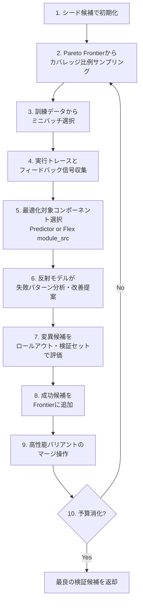

本記事は [GEPA: Reflective Prompt Evolution Can Outperform Reinforcement Learning](https://arxiv.org/abs/2507.19457) の解説記事です。

## 論文概要

Agrawal, Tan, Soylu et al. (2025) は、LLMの下流タスク適応において、GRPO等の強化学習手法が数千のロールアウトを必要とする課題に対し、自然言語による反射（リフレクション）を活用した新しいプロンプトオプティマイザGEPA（Genetic-Pareto）を提案している。GEPAは実行トレースを自然言語で診断し、プロンプト更新の提案・テスト・相補的な教訓の統合を行う。6タスクの評価で、GRPOに対し平均+6%（最大+20%）の精度向上を35倍少ないロールアウトで達成し、MIPROv2に対しても10%以上の改善（AIME-2025で+12%）を報告している。

この記事は [Zenn記事: DSPy 3.3 Flex×GEPAでLLMパイプラインの構造ごと自動最適化する](https://zenn.dev/0h_n0/articles/94463814c80394) の深掘りです。Zenn記事ではDSPy FlexとGEPAの組み合わせによるパイプライン構造の自動最適化を実践的に解説しているが、本記事ではGEPAの理論的基盤である反射メカニズム、Pareto Frontier管理、マージ操作の技術的詳細に焦点を当てる。

## 情報源

- **arXiv ID**: 2507.19457
- **URL**: [https://arxiv.org/abs/2507.19457](https://arxiv.org/abs/2507.19457)
- **著者**: Lakshya A Agrawal, Shangyin Tan, Dilara Soylu et al.
- **発表**: ICLR 2026 Oral（初版2025年7月、最終改訂2026年2月）
- **分野**: cs.CL, cs.AI, cs.LG, cs.SE
- **コード**: [github.com/gepa-ai/gepa](https://github.com/gepa-ai/gepa)

## 背景と動機

LLMを下流タスクに適応させる主要なアプローチとして、GRPO（Group Relative Policy Optimization）等のRL手法が広く採用されている。しかし、RL手法はスカラー報酬信号に基づく方策勾配を用いるため、新しいタスクの学習に5,000〜25,000以上のロールアウトを必要とし、計算コストが高い。

著者らは、言語の解釈可能な性質がスカラー報酬よりも豊かな学習媒体をLLMに提供できるという仮説を立てている。具体的には、実行トレース（推論過程、ツール呼び出し、出力）を自然言語で分析することで、「なぜ失敗したか」「どう改善すべきか」という構造化された診断情報を抽出でき、これがRL的な勾配信号よりも効率的な最適化を可能にするという主張である。

従来のプロンプト最適化手法（MIPROv2等）はプロンプトの命令文のみを最適化対象としていたが、GEPAはDSPy 3.3のFlexモジュールと統合することで、プロンプトだけでなくプログラム構造（Predictor数、Python関数、ルーティングロジック）までを最適化空間に含めている点が特徴的である。

## 主要な貢献

- **貢献1**: 自然言語反射に基づくプロンプトオプティマイザGEPAを提案し、RL手法（GRPO）に対して6タスク平均+6%、最大+20%の精度向上を35倍少ないロールアウトで達成したことを実証した
- **貢献2**: Pareto Frontierに基づく候補管理メカニズムにより、探索の多様性と堅牢性を両立する最適化フレームワークを構築した
- **貢献3**: DSPy 3.3 Flexとの統合により、命令文だけでなくプログラム構造ごとの自動探索を実現した。これは従来のプロンプト最適化の範囲を大幅に拡張するものである
- **貢献4**: 推論時のコード最適化（KernelBench、NPUEval）への適用可能性を示し、プロンプト最適化を超えた汎用テキスト最適化フレームワークとしての展望を提示した

## 技術的詳細

### GEPAの最適化アルゴリズム

GEPAの最適化ループは以下の10ステップで構成される。著者らはこれを「Actionable Side Information（ASI）」の概念で説明しており、ASIはテキスト最適化における勾配の類似物として機能する。



ステップ6の反射プロセスが核心であり、反射モデルは失敗した実行トレースを分析して「どのような入力パターンで失敗しているか」「プロンプトのどの部分が原因か」を自然言語で診断する。この診断結果が変異操作のガイドとなるため、ランダムな探索ではなく方向性のある改善が可能になる。

### Pareto Frontier管理

単一のベスト候補のみを追跡する従来手法では、特定の入力パターンに強い候補が淘汰されてしまう。GEPAのPareto Frontierは、この問題を以下の定義で解決している。

$$
\mathcal{F} = \{c \in \mathcal{C} \mid \exists\, e \in \mathcal{E} : \text{score}(c, e) = \max_{c' \in \mathcal{C}} \text{score}(c', e)\}
$$

ここで、
- $\mathcal{F}$: Pareto Frontier（保持する候補の集合）
- $\mathcal{C}$: これまでに評価した全候補の集合
- $\mathcal{E}$: 評価インスタンスの集合
- $\text{score}(c, e)$: 候補$c$の評価インスタンス$e$に対するスコア

この定義により、「少なくとも1つの評価インスタンスで最高スコアを達成した候補」がすべて保持される。サンプリング時にはカバレッジ（その候補が最高スコアを達成するインスタンスの数）に比例した確率で選択され、多様な戦略を持つ候補が探索に活用される。

### マージ操作

ステップ9のマージ操作は、遺伝的アルゴリズムにおけるクロスオーバーに相当する。異なる系統の高性能候補から成功要素を融合し、より汎化性能の高い候補を生成する。

```python
def merge_candidates(
    candidate_a: str,
    candidate_b: str,
    reflection_lm: dspy.LM,
    shared_failures: list[str],
) -> str:
    """Pareto Frontier上の2候補をマージする。

    Args:
        candidate_a: 系統Aの高性能候補（プロンプトまたはmodule_src）
        candidate_b: 系統Bの高性能候補
        reflection_lm: 反射に使用するLM
        shared_failures: 両候補が共通して失敗するケース

    Returns:
        マージされた新候補
    """
    merge_prompt = f"""
    Candidate A excels on some inputs, Candidate B on others.
    Combine their complementary strengths into a single candidate.
    
    Candidate A: {candidate_a}
    Candidate B: {candidate_b}
    Shared failure patterns: {shared_failures}
    """
    merged = reflection_lm(merge_prompt)
    return merged
```

マージ操作は、2つの候補が異なるインスタンス集合で強みを持つ場合に効果を発揮する。著者らは、マージにより個別候補の性能を超える汎化性能が得られるケースを複数報告している。

## 実装のポイント

### DSPy Flex統合

GEPAはDSPy 3.3のFlexモジュールと統合されており、`dspy.GEPA`として利用できる。従来のプロンプト最適化がPredictor（LLM呼び出し）の命令文のみを書き換えるのに対し、Flexの`module_src`（実装コード）を最適化対象とすることで、プログラム構造ごとの書き換えが可能になっている。

```python
import dspy

# 非対称2モデル構成: タスク実行モデルと反射モデルを分離
task_lm = dspy.LM("openai/gpt-4o-mini")  # コスト効率重視
reflection_lm = dspy.LM("openai/gpt-4o")  # 反射品質重視

optimizer = dspy.GEPA(
    metric=my_metric,
    max_metric_calls=150,
    reflection_lm=reflection_lm,
)

optimized = optimizer.compile(
    student=MyFlexProgram(),
    trainset=trainset,
    valset=valset,
)
```

### feedback付きMetric

GEPAの最適化品質は、Metric関数が返すフィードバック情報の質に大きく依存する。単純なスコア値だけでなく、なぜそのスコアになったかの自然言語フィードバックを返す設計が推奨される。このフィードバックがASI（Actionable Side Information）として反射モデルに渡され、方向性のある改善提案につながる。

### 非対称2モデル構成

タスク実行には低コストモデル（例: Qwen3-8B、GPT-4o-mini）を使用し、反射には高性能モデル（例: GPT-4o、Claude Sonnet）を使用する非対称構成が推奨されている。反射モデルの能力がGEPAの最適化品質を決定するため、反射モデルの選択は実装上の重要な判断ポイントとなる。

## Production Deployment Guide

GEPAをプロダクション環境でプロンプト最適化パイプラインとして運用する場合のAWS構成を解説する。ここでは、定期的にプロンプトを再最適化するバッチパイプラインと、最適化済みプロンプトを配信する推論APIの2層構成を前提とする。

### AWS実装パターン（コスト最適化重視）

以下のコスト試算は2026年8月時点のAWS ap-northeast-1（東京）リージョン料金に基づく概算値である。実際のコストはトラフィックパターン、リージョン、バースト使用量により変動するため、最新料金はAWS料金計算ツールで確認を推奨する。

| 構成 | トラフィック | 最適化頻度 | 主要サービス | 月額概算 |
|------|------------|-----------|-------------|---------|
| Small | ~100 req/日 | 週次 | Lambda + Bedrock + DynamoDB | $80-200 |
| Medium | ~1,000 req/日 | 日次 | ECS Fargate + Bedrock + ElastiCache | $400-900 |
| Large | 10,000+ req/日 | 日次+連続 | EKS + Karpenter + Spot + SageMaker | $2,500-6,000 |

**Small構成**: Lambda関数で最適化バッチを週次実行し、最適化済みプロンプトをDynamoDBに格納。推論時はLambdaがDynamoDBからプロンプトを読み出しBedrock呼び出しを行う。GEPAの`max_metric_calls=150`程度なら1回の最適化で30分以内に完了する。

**Medium構成**: ECS Fargateで最適化タスクを日次実行。ElastiCacheでプロンプトキャッシュを配信し、推論レイテンシを低減。複数タスクの並行最適化に対応。

**Large構成**: EKSクラスタでKarpenterによるSpot Instances自動スケーリング。SageMaker Endpointでタスク実行モデルをホスティングし、反射モデルはBedrock経由で呼び出す。連続的な最適化ループと大規模推論を両立。

**コスト削減テクニック**:
- Spot Instances活用: EKSワーカーノードをSpot優先にすることで最大90%削減
- Bedrock Batch API: 最適化バッチのロールアウトをBatch APIで実行し50%削減
- Prompt Caching: Bedrock Prompt Cachingで反射モデルの繰り返し呼び出しを30-90%削減
- Reserved Instances: 推論用の常時稼働インスタンスは1年コミットで最大72%削減

### Terraformインフラコード

**Small構成（Serverless）**:

```hcl
# GEPA Prompt Optimization Pipeline - Small (Serverless)
# Lambda + Bedrock + DynamoDB

resource "aws_dynamodb_table" "gepa_prompts" {
  name         = "gepa-optimized-prompts"
  billing_mode = "PAY_PER_REQUEST" # On-Demand: 低トラフィック向けコスト最適
  hash_key     = "task_id"
  range_key    = "version"

  attribute {
    name = "task_id"
    type = "S"
  }
  attribute {
    name = "version"
    type = "N"
  }

  point_in_time_recovery { enabled = true }

  server_side_encryption {
    enabled     = true
    kms_key_arn = aws_kms_key.gepa.arn
  }

  tags = { Project = "gepa-optimizer", Environment = "production" }
}

resource "aws_iam_role" "gepa_lambda" {
  name = "gepa-optimizer-lambda-role"
  assume_role_policy = jsonencode({
    Version = "2012-10-17"
    Statement = [{
      Action = "sts:AssumeRole"
      Effect = "Allow"
      Principal = { Service = "lambda.amazonaws.com" }
    }]
  })
}

resource "aws_iam_role_policy" "gepa_bedrock" {
  name = "gepa-bedrock-access"
  role = aws_iam_role.gepa_lambda.id
  policy = jsonencode({
    Version = "2012-10-17"
    Statement = [
      {
        Effect   = "Allow"
        Action   = ["bedrock:InvokeModel", "bedrock:InvokeModelWithResponseStream"]
        Resource = "arn:aws:bedrock:ap-northeast-1::foundation-model/*"
      },
      {
        Effect   = "Allow"
        Action   = ["dynamodb:PutItem", "dynamodb:GetItem", "dynamodb:Query"]
        Resource = aws_dynamodb_table.gepa_prompts.arn
      }
    ]
  })
}

resource "aws_lambda_function" "gepa_optimizer" {
  function_name = "gepa-prompt-optimizer"
  runtime       = "python3.12"
  handler       = "handler.optimize"
  role          = aws_iam_role.gepa_lambda.arn
  timeout       = 900  # 15分: GEPAの最適化ループに十分な時間
  memory_size   = 1024 # 1GB: Pareto Frontier管理に必要

  environment {
    variables = {
      DYNAMODB_TABLE     = aws_dynamodb_table.gepa_prompts.name
      GEPA_MAX_CALLS     = "150"
      REFLECTION_MODEL   = "anthropic.claude-sonnet-4-20250514"
      TASK_MODEL         = "anthropic.claude-haiku-4-20250414"
    }
  }

  tracing_config { mode = "Active" } # X-Ray有効化
  tags = { Project = "gepa-optimizer" }
}

# 週次最適化スケジュール
resource "aws_cloudwatch_event_rule" "weekly_optimize" {
  name                = "gepa-weekly-optimization"
  schedule_expression = "cron(0 15 ? * SUN *)" # 毎週日曜 00:00 JST
}

resource "aws_cloudwatch_event_target" "optimize_target" {
  rule = aws_cloudwatch_event_rule.weekly_optimize.name
  arn  = aws_lambda_function.gepa_optimizer.arn
}

# コスト監視アラーム
resource "aws_cloudwatch_metric_alarm" "bedrock_cost" {
  alarm_name          = "gepa-bedrock-token-spike"
  comparison_operator = "GreaterThanThreshold"
  evaluation_periods  = 1
  metric_name         = "InputTokenCount"
  namespace           = "AWS/Bedrock"
  period              = 3600
  statistic           = "Sum"
  threshold           = 500000 # 1時間50万トークン超でアラート
  alarm_actions       = [aws_sns_topic.alerts.arn]
}
```

**Large構成（Container）**:

```hcl
# GEPA Optimization Platform - Large (EKS + Karpenter)

module "eks" {
  source          = "terraform-aws-modules/eks/aws"
  version         = "~> 20.0"
  cluster_name    = "gepa-platform"
  cluster_version = "1.31"

  vpc_id     = module.vpc.vpc_id
  subnet_ids = module.vpc.private_subnets

  cluster_endpoint_public_access = false # プライベートアクセスのみ

  tags = { Project = "gepa-optimizer", Environment = "production" }
}

# Karpenter: Spot優先の自動スケーリング
resource "kubectl_manifest" "karpenter_nodepool" {
  yaml_body = yamlencode({
    apiVersion = "karpenter.sh/v1"
    kind       = "NodePool"
    metadata   = { name = "gepa-workers" }
    spec = {
      template = {
        spec = {
          requirements = [
            { key = "karpenter.sh/capacity-type", operator = "In", values = ["spot", "on-demand"] },
            { key = "node.kubernetes.io/instance-type", operator = "In",
              values = ["m7i.xlarge", "m7i.2xlarge", "m6i.xlarge", "m6i.2xlarge"] },
          ]
          nodeClassRef = { group = "karpenter.k8s.aws", kind = "EC2NodeClass", name = "default" }
        }
      }
      limits   = { cpu = "64", memory = "256Gi" }
      disruption = {
        consolidationPolicy = "WhenEmptyOrUnderutilized"
        consolidateAfter    = "30s" # アイドルノードを即回収
      }
    }
  })
}

# AWS Budgets: 月額予算アラート
resource "aws_budgets_budget" "gepa_monthly" {
  name         = "gepa-monthly-budget"
  budget_type  = "COST"
  limit_amount = "6000"
  limit_unit   = "USD"
  time_unit    = "MONTHLY"

  notification {
    comparison_operator       = "GREATER_THAN"
    threshold                 = 80
    threshold_type            = "PERCENTAGE"
    notification_type         = "ACTUAL"
    subscriber_email_addresses = ["ops-team@example.com"]
  }
}
```

### 運用・監視設定

**CloudWatch Logs Insights クエリ**（コスト異常検知）:

```
# 1時間あたりのGEPA最適化トークン使用量
fields @timestamp, @message
| filter @message like /token_usage/
| stats sum(input_tokens) as total_input, sum(output_tokens) as total_output by bin(1h)
| sort @timestamp desc
```

**CloudWatch アラーム設定**:

```python
import boto3

def create_gepa_alarms(sns_topic_arn: str) -> None:
    """GEPA最適化パイプラインの監視アラームを作成する。

    Args:
        sns_topic_arn: アラート送信先のSNS Topic ARN
    """
    cw = boto3.client("cloudwatch", region_name="ap-northeast-1")

    # Bedrock トークン使用量スパイク検知
    cw.put_metric_alarm(
        AlarmName="gepa-bedrock-token-spike",
        MetricName="InputTokenCount",
        Namespace="AWS/Bedrock",
        Statistic="Sum",
        Period=3600,
        EvaluationPeriods=1,
        Threshold=500000,
        ComparisonOperator="GreaterThanThreshold",
        AlarmActions=[sns_topic_arn],
    )

    # Lambda 最適化タイムアウト検知
    cw.put_metric_alarm(
        AlarmName="gepa-lambda-duration-warning",
        MetricName="Duration",
        Namespace="AWS/Lambda",
        Dimensions=[{"Name": "FunctionName", "Value": "gepa-prompt-optimizer"}],
        Statistic="p99",
        Period=300,
        EvaluationPeriods=2,
        Threshold=840000,  # 14分（15分上限の93%）
        ComparisonOperator="GreaterThanThreshold",
        AlarmActions=[sns_topic_arn],
    )
```

**X-Ray トレーシング設定**:

```python
from aws_xray_sdk.core import xray_recorder, patch_all
import boto3

patch_all()  # boto3自動計装

def optimize_with_tracing(task_id: str, trainset: list[dict]) -> dict:
    """X-Rayトレース付きでGEPA最適化を実行する。

    Args:
        task_id: 最適化対象タスクのID
        trainset: 訓練データセット

    Returns:
        最適化結果のメタデータ
    """
    with xray_recorder.in_subsegment("gepa-optimization") as seg:
        seg.put_annotation("task_id", task_id)
        seg.put_metadata("trainset_size", len(trainset))
        seg.put_metadata("max_metric_calls", 150)

        result = run_gepa_optimization(task_id, trainset)

        seg.put_annotation("final_score", result["best_score"])
        seg.put_metadata("frontier_size", result["frontier_size"])
        seg.put_metadata("total_rollouts", result["total_rollouts"])
    return result
```

**Cost Explorer 日次レポート**:

```python
import boto3
from datetime import datetime, timedelta

def daily_gepa_cost_report(sns_topic_arn: str) -> dict:
    """GEPA関連AWSコストの日次レポートを取得しSNS通知する。

    Args:
        sns_topic_arn: レポート送信先のSNS Topic ARN

    Returns:
        サービス別コスト内訳
    """
    ce = boto3.client("ce", region_name="us-east-1")
    sns = boto3.client("sns", region_name="ap-northeast-1")

    end = datetime.utcnow().strftime("%Y-%m-%d")
    start = (datetime.utcnow() - timedelta(days=1)).strftime("%Y-%m-%d")

    resp = ce.get_cost_and_usage(
        TimePeriod={"Start": start, "End": end},
        Granularity="DAILY",
        Metrics=["UnblendedCost"],
        Filter={"Tags": {"Key": "Project", "Values": ["gepa-optimizer"]}},
        GroupBy=[{"Type": "DIMENSION", "Key": "SERVICE"}],
    )

    total = 0.0
    breakdown = {}
    for group in resp["ResultsByTime"][0]["Groups"]:
        svc = group["Keys"][0]
        cost = float(group["Metrics"]["UnblendedCost"]["Amount"])
        breakdown[svc] = cost
        total += cost

    if total > 100:
        sns.publish(
            TopicArn=sns_topic_arn,
            Subject="GEPA Cost Alert: $%.2f/day" % total,
            Message="Daily cost exceeded $100.\n%s" % str(breakdown),
        )
    return breakdown
```

### コスト最適化チェックリスト

**アーキテクチャ選択**:
- [ ] トラフィック量に応じた構成を選択（Small: Serverless / Medium: Hybrid / Large: Container）
- [ ] 最適化頻度をビジネス要件に合わせて設定（週次 vs 日次 vs 連続）
- [ ] 反射モデルとタスクモデルの分離を検討

**リソース最適化**:
- [ ] EKS/ECSワーカーノードはSpot Instances優先
- [ ] 推論用常時稼働リソースはReserved Instances 1年コミット
- [ ] Savings Plans（Compute/SageMaker）の適用を検討
- [ ] Lambda: メモリサイズをPower Tuningで最適化（512MB-2048MB範囲）
- [ ] EKS: Karpenter consolidation でアイドルノードを30秒以内に回収
- [ ] DynamoDB: On-Demandモード（低トラフィック）/ Provisioned（高トラフィック）の切り替え

**LLMコスト削減**:
- [ ] Bedrock Batch APIで非同期ロールアウトを50%削減
- [ ] Prompt Caching有効化で反射モデル呼び出しを30-90%削減
- [ ] タスク実行にはコスト効率の高いモデルを選択（Haiku, GPT-4o-mini等）
- [ ] `max_metric_calls`を最小限に設定（150-300が推奨範囲）
- [ ] ミニバッチサイズの調整で不要なロールアウトを削減

**監視・アラート**:
- [ ] AWS Budgets: 月額予算アラート（80%/100%閾値）
- [ ] CloudWatch: Bedrockトークン使用量スパイク検知
- [ ] Cost Anomaly Detection: サービス別異常検知を有効化
- [ ] 日次コストレポート: Cost Explorer API + SNS通知
- [ ] X-Ray: 最適化ループのトレーシングで遅延原因を特定

**リソース管理**:
- [ ] 未使用の最適化済みプロンプト版をDynamoDB TTLで自動削除
- [ ] タグ戦略: `Project=gepa-optimizer` タグで全リソースをフィルタ可能に
- [ ] CloudWatch Logsの保持期間を30日に設定（コスト削減）
- [ ] 開発環境のEKSクラスタは夜間・週末にKarpenter nodePoolの上限を0に設定

## 実験結果

### GRPO との比較

著者らはQwen3-8Bを用いて6タスクでGRPOとの比較を行っている（論文Table記載）。

| タスク | GRPO | GEPA | 差分 | ロールアウト比 |
|--------|------|------|------|--------------|
| AIME-2025 | - | +12% vs MIPROv2 | - | - |
| 6タスク平均 | baseline | +6% | +6% | GEPA: 1/35x |
| 最大改善タスク | baseline | +20% | +20% | - |

著者らによると、GEPAは100〜500回の評価（ロールアウト）で収束するのに対し、GRPOは同等の性能に達するために5,000〜25,000回以上のロールアウトを必要としたと報告されている。この効率性の差は、自然言語反射が「なぜ失敗したか」という構造化された情報をスカラー報酬よりも効果的に伝達できることに起因すると著者らは分析している。

### MIPROv2 との比較

プロンプト最適化の先行手法であるMIPROv2に対しても10%以上の改善が報告されている。特にAIME-2025（数学推論ベンチマーク）では+12%の精度向上が確認されている。MIPROv2が命令文のみを最適化対象とするのに対し、GEPAはFlex統合によりプログラム構造ごとの探索が可能であり、この探索空間の拡大が性能差の一因と考えられる。

### コード最適化への応用

GEPAは推論時のコード最適化（KernelBench、NPUEval）でも有望な結果を示している。これはGEPAの最適化メカニズムがプロンプトに限定されず、任意のテキスト成果物（コード、設定ファイル、SVG等）に適用可能であることを示唆している。リポジトリでは`optimize_anything` APIとしてこの汎用性が実装されている。

## 実運用への応用

GEPAの実運用への応用は、Zenn記事で解説されているDSPy Flexパイプラインの最適化が最も直接的なユースケースである。具体的には以下のシナリオが考えられる。

**RAGパイプラインの自動チューニング**: 検索クエリ生成・リランキング・回答生成の各段階のプロンプトとロジックを、実際のユーザークエリのフィードバックに基づいて自動最適化する。GEPAリポジトリにはGeneric RAG Adapterが同梱されている。

**エージェントワークフローの最適化**: MCPツールの呼び出し戦略やルーティングロジックをGEPAで自動探索する。MCP Adapterを使用することで、ツール選択の精度と効率を改善できる。

**少数データでの迅速な適応**: GEPAは3件以上の訓練データで動作するため、新規ドメインへの迅速な適応に適している。従来のRL手法では数千件のデータが必要だった場面で、GEPAにより数十件のデータで実用的な精度を達成できる可能性がある。

ただし、反射モデルの能力にGEPAの最適化品質が依存するため、低性能モデルを反射に使用した場合は効果が限定的となる点に注意が必要である。

## 関連研究

**MIPROv2** (Opsahl-Ong et al., 2024): DSPyの命令文最適化手法。Few-shotデモンストレーションの自動生成と命令文の最適化を行うが、プログラム構造の探索は行わない。GEPAはMIPROv2を10%以上上回る性能を報告している。

**GRPO** (Shao et al., 2024): Group Relative Policy Optimization。スカラー報酬に基づく方策勾配で、GEPAの主要な比較対象。ロールアウト効率でGEPAに劣るが、数学的に最適化の収束保証がある点はGEPAにない特長である。

**DSPy Flex** (Khattab et al., 2026): DSPy 3.3で導入されたモジュール。`module_src`としてPythonコードを保持し、GEPAの最適化対象となる。命令文だけでなくプログラム構造の自動探索を可能にした。

## まとめと今後の展望

GEPAは自然言語反射を活用したプロンプトオプティマイザとして、RL手法に対する効率性の優位性（35倍少ないロールアウトで+6%の精度向上）を実証した。Pareto Frontierによる多様な候補管理とマージ操作が探索の堅牢性を支えており、DSPy Flex統合によりプログラム構造ごとの自動探索を実現している。

今後の展望として、著者らは反射モデル自体の性能向上に伴うGEPAの改善、より大規模な探索空間への適用、RL手法との組み合わせ（GEPAで粗い最適化を行いRLでファインチューニングする2段階手法）を示唆している。`optimize_anything` APIによる汎用テキスト最適化フレームワークとしての発展も注目に値する。

## 参考文献

- **arXiv**: [https://arxiv.org/abs/2507.19457](https://arxiv.org/abs/2507.19457)
- **Code**: [https://github.com/gepa-ai/gepa](https://github.com/gepa-ai/gepa)
- **DSPy**: [https://dspy.ai](https://dspy.ai)
- **Related Zenn article**: [https://zenn.dev/0h_n0/articles/94463814c80394](https://zenn.dev/0h_n0/articles/94463814c80394)
