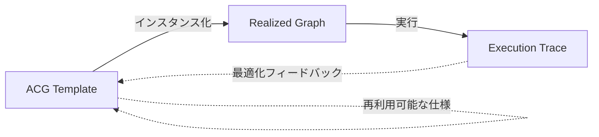
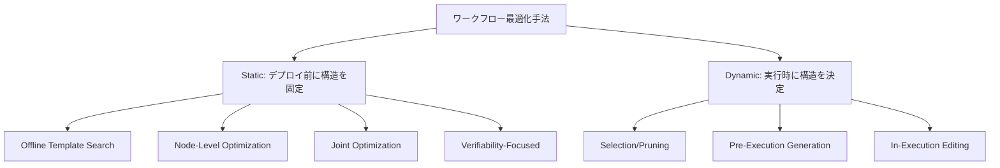

本記事は [arXiv: 2603.22386](https://arxiv.org/abs/2603.22386) の解説記事です。

この記事は [Zenn記事: DSPy 3.3 Flex×GEPAでLLMパイプラインの構造ごと自動最適化する](https://zenn.dev/0h_n0/articles/94463814c80394) の深掘りです。Zenn記事ではDSPyとGEPAを用いたLLMパイプラインの自動最適化を解説していますが、本サーベイはそうした手法を含むワークフロー最適化分野全体を「エージェント的計算グラフ（ACG）」として形式化し、50以上のフレームワークを包括的に分類・比較した研究です。DSPyやGEPAがフィールド全体のどこに位置づけられるかを俯瞰する視点を提供します。

---

## 論文概要

LLMベースのシステムは、LLM呼び出し・情報検索・ツール使用・コード実行・メモリ更新・検証を統合した実行可能なワークフローを構築してタスクを解決する方向へ進化している。著者らは、こうしたワークフローの設計・最適化手法を包括的にサーベイし、ワークフローを「エージェント的計算グラフ（Agentic Computation Graph; ACG）」として形式化している。サーベイでは、ワークフロー構造が決まるタイミングによって手法を「静的（Static）」と「動的（Dynamic）」に大別し、最適化対象・評価信号という3つの次元で整理している。対象論文は77件（コア39件、隣接7件、背景リソース31件）にわたり、27件の評価アセットも分析対象としている。

## 情報源

| 項目 | 内容 |
|------|------|
| タイトル | From Static Templates to Dynamic Runtime Graphs: A Survey of Workflow Optimization for LLM Agents |
| 著者 | Ling Yue, Kushal Raj Bhandari, Ching-Yun Ko, Dhaval Patel, Shuxin Lin, Nianjun Zhou, Jianxi Gao, Pin-Yu Chen, Shaowu Pan |
| arXiv ID | 2603.22386 |
| 投稿日 | 2026年3月 |
| 分野 | cs.AI, cs.CL |
| URL | [https://arxiv.org/abs/2603.22386](https://arxiv.org/abs/2603.22386) |
| 関連リポジトリ | [IBM/awesome-agentic-workflow-optimization](https://github.com/IBM/awesome-agentic-workflow-optimization) |

## 背景と動機

LLMエージェントのワークフロー設計は、これまで主にフレームワーク開発者やアプリケーション設計者の経験と直感に依存してきた。ReActやChain-of-Thoughtなど個別のパターンは提案されているが、ワークフロー全体の設計空間を体系的に整理し、最適化手法を比較する枠組みは存在しなかった。

著者らは、この分野が以下の課題を抱えていると指摘している。

1. **用語の混乱**: 「ワークフロー」「パイプライン」「エージェント」「グラフ」などの用語が文献ごとに異なる意味で使われ、手法間の正確な比較が困難
2. **設計空間の暗黙知**: どのタスクにどのワークフロー構造が適切かの知見が分散しており、再利用可能な形で体系化されていない
3. **最適化対象の曖昧さ**: プロンプト最適化、グラフ構造の探索、エージェント間通信の設計など、最適化のレベルが混在している

こうした背景から、著者らはワークフローを統一的に表現する形式化と、手法を比較可能にする分類体系の必要性を主張している。

## 主要な貢献

著者らが報告する主要な貢献は以下の4点である。

- **ACGの形式化**: ワークフローを5つ組のタプルとして数学的に定義し、テンプレート・実現グラフ・実行トレースの3層を明確に区別する語彙を導入
- **Static/Dynamic分類体系**: ワークフロー構造の決定タイミングに基づく2大分類と、Graph Determination Time（GDT）およびGraph Plasticity Mode（GPM）による細分類を提案
- **3次元組織化フレームワーク**: 構造決定タイミング・最適化対象・評価信号の3軸で文献を整理し、50以上のフレームワークを位置づけ
- **最小報告プロトコル**: ワークフロー最適化論文が報告すべき8つの次元（ワークフロー表現、構造設定、モデル/ツール構成、オフラインコスト、オンラインコスト、トレース統計、グラフメトリクス、ロバスト性）を提案

## 技術的詳細

### ACGの形式的定義

著者らは、エージェント的計算グラフ（ACG）を以下の5つ組タプルとして定義している。

$$
\bar{\mathcal{G}} = (\mathcal{V}, \mathcal{E}, \Phi, \Sigma, \mathcal{A})
$$

ここで、

- $\mathcal{V}$: ノード集合。各ノードはLLM呼び出し、検索、ツール使用、検証などの原子的アクションを実行する
- $\mathcal{E}$: 有向エッジ集合。制御依存、データ依存、通信依存を符号化する
- $\Phi$: ノードパラメータ。プロンプト、ツールスキーマ、モデル選択、検証器設定を含む
- $\Sigma$: スケジューリング/ルーティングポリシー。実行順序を決定する
- $\mathcal{A}$: 許容される活性化・編集アクションの集合

各ノードは $\langle \text{Instruction}, \text{Context}, \text{Tools}, \text{Model/Decoding} \rangle$ のタプルとして記述される。

この形式化の重要な点は、ワークフローの3層を明確に区別していることにある。

- **ACG Template（テンプレート）**: 再利用可能なワークフロー仕様。利用可能な構造空間を定義する
- **Realized Graph（実現グラフ）**: 特定の実行に対してデプロイされる実際のワークフロー構造
- **Execution Trace（実行トレース）**: 実現グラフの実行から得られる（状態, アクション, 観測, コスト）タプルの系列

### Static vs Dynamic手法の詳細比較

著者らは、ワークフロー構造がいつ決まるかに基づいて手法を大きく2つに分類している。

#### Static手法（デプロイ前に固定）

Static手法は、デプロイ前にワークフローテンプレートを探索・最適化し、実行時には固定構造で動作する。

| サブカテゴリ | 代表的手法 | 探索手法 |
|-------------|-----------|---------|
| Offline Template Search | AFlow, ADAS, A$^2$Flow, SEW | MCTS, 進化的探索, コード空間探索 |
| Node-Level Optimization | DSPy, OPRO, EvoPrompt, CAPO, GEPA, OPTIMA | プロンプト最適化, 勾配フリー最適化 |
| Joint Structure-Config | MASS, Maestro, Learning Multi-Agent Communication | 構造とパラメータの同時最適化 |
| Verifiability-Focused | MermaidFlow, VFlow | 形式的検証, 制約充足 |

**Node-Level Optimization**はワークフローの骨格（$\mathcal{E}$, $\Sigma$）を固定したまま、各ノードのパラメータ$\Phi$（プロンプト、モデル選択など）を最適化する。DSPyはこのカテゴリの代表的フレームワークであり、プログラムロジックとLLMプロンプティングの実装を分離することで体系的な最適化を可能にする。GEPAは実行トレースから失敗パターンを抽出し、テキスト的なフィードバックとしてプロンプト改善に活用するトレース駆動型の最適化手法として位置づけられている。

**Offline Template Search**はグラフ構造$\mathcal{E}$自体を探索空間とし、MCTS（モンテカルロ木探索）や進化的アルゴリズムでテンプレートを探索する。AFlowはMCTSベースの探索、ADASは進化的なコード空間探索を採用している。

#### Dynamic手法（実行時に決定）

Dynamic手法は、入力や中間結果に応じてワークフロー構造を実行時に決定する。著者らはこれをさらにGraph Determination Time（GDT）とGraph Plasticity Mode（GPM）の2軸で細分類している。

**Graph Determination Time（GDT）**:
- **Offline**: デプロイ前にテンプレートを最適化（Static手法と重複）
- **Pre-execution**: 実行開始前に入力に応じてグラフを1回生成
- **In-execution**: 実行中に構造を修正

**Graph Plasticity Mode（GPM）**:
- **None**: 構造固定
- **Select**: 固定されたスーパーグラフからサブグラフを選択・枝刈り
- **Generate**: 実行ごとに新しいグラフを構築
- **Edit**: 実行中にノードやエッジを追加・削除・再配線

| サブカテゴリ | GDT | GPM | 代表的手法 |
|-------------|-----|-----|-----------|
| Selection/Pruning | Pre-execution | Select | DAGP, AgentDropout, DyLAN, MasRouter, SkillOrchestra |
| Pre-Execution Generation | Pre-execution | Generate | G-Designer, FlowReasoner, Workflow-R1, AutoFlow, WorkflowLLM |
| In-Execution Editing | In-execution | Edit | AgentConductor, MetaGen, ProAgent, EvoFlow, QualityFlow |

### 3つの組織化次元

著者らは文献を以下の3つの直交する次元で整理している。

**次元1: 構造決定タイミング（When）**
ワークフロー構造がいつ確定するか。上述のStatic/Dynamic分類に対応する。

**次元2: 最適化対象（What）**
ワークフローのどのコンポーネントが最適化されるか。

- **Node-level**: スキャフォールドを固定し、ローカルパラメータ$\Phi$を最適化。DSPy、GEPA、CAPOなどが該当
- **Graph-level**: 構造変数（$\mathcal{E}$, $\Sigma$, $\mathcal{A}$）を更新。AFlow、G-Designerなどが該当
- **Joint**: ノードとグラフの両方を同時または交互に最適化。Maestro、MASSなどが該当

**次元3: 評価信号（Which feedback）**
最適化を導くフィードバック信号の種類。

- **メトリック駆動**: タスクスコア、精度、pass@kなどの定量指標（AFlow、ADAS、FlowReasoner）
- **検証器駆動**: ユニットテスト、フォーマット妥当性、スキーマ準拠、実行可能性チェック（VFlow、MermaidFlow、AgentConductor）
- **嗜好ベース**: スコア認識ランキング、セマンティッククラスタリング（ScoreFlow、RobustFlow）
- **トレース由来テキスト**: 失敗からの振り返り、矛盾の抽出（GEPA、MetaGen、DebFlow、Maestro）

### DSPy・GEPAのサーベイ内での位置づけ

サーベイにおいて、DSPyは**Static / Node-Level Optimization**カテゴリに分類されている。DSPyの設計思想は、LLMプログラムの宣言的仕様を可能にし、プログラムロジックとプロンプティング実装を分離するものであり、著者らはこれを「ノードパラメータ$\Phi$の体系的最適化を可能にするフレームワーク」として位置づけている。

GEPAは同じくStatic / Node-Level Optimizationに分類されるが、その最適化信号は**トレース由来テキスト**である点が特徴的である。GEPAは実行トレースから失敗パターンを抽出し、自然言語でのフィードバックとしてプロンプト改善に活用する。Zenn記事で解説されたDSPy 3.3 Flex×GEPAの組み合わせは、サーベイの分類体系に照らすと「宣言的パイプライン記述（DSPy）+ トレース駆動プロンプト最適化（GEPA）」というNode-Level Optimizationの先進的な構成として理解できる。

ただし、著者らはNode-Level Optimizationの限界も指摘している。エラーの原因が検証ステップの欠如、制御フローの誤り、ノードの不足にある場合、プロンプトチューニングよりもグラフ最適化が有効であるとしている。

### 品質-コスト最適化の定式化

著者らは、ワークフロー最適化を以下の目的関数として定式化している。

$$
\max \mathbb{E}\left[ R(\tau; x) - \lambda C(\tau) \right]
$$

ここで、

- $R(\tau; x)$: タスク品質（実行トレース$\tau$と入力$x$に対する評価）
- $C(\tau)$: 実行コスト（トークン数、ツール呼び出し回数、レイテンシ、金銭コスト）
- $\lambda$: 品質とコストのトレードオフを制御するハイパーパラメータ

この定式化は、タスク性能の最大化だけでなくコスト効率の最適化を明示的に組み込んでいる点が重要である。

### 評価ベンチマーク

著者らは、ワークフロー最適化の評価に用いられるベンチマークを以下のように整理している。

- **構造認識型ベンチマーク**: WorFBench、FlowBench、ComfyUI-R1（グラフ構造の評価を含む）
- **ツール使用ベンチマーク**: GAIA、$\tau$-Bench、APIBank、ToolBench、AppWorld
- **MCP関連**: MCP-Universe、MCP-Bench、LiveMCPBench
- **ソフトウェア環境**: SWE-bench、Terminal-Bench、SOP-Bench

## サーベイの定量的分析

著者らのサーベイは合計77件の文献を対象とし、うちコア論文が39件、隣接論文が7件、背景リソースが31件である。さらに27件の評価アセット（ベンチマーク20件、データセット/検証器7件）を分析対象としている。

対象文献の分布について、著者らは以下の傾向を報告している。

- **Static手法の成熟**: Node-Level Optimizationが最も多くの手法を擁し、DSPyエコシステムを中心に成熟が進んでいる
- **Dynamic手法の急増**: 2025年後半以降、Pre-Execution GenerationとIn-Execution Editingの手法が急速に増加している
- **評価の課題**: 手法間の公正な比較を可能にする標準的なベンチマークが不足しており、多くの論文が独自の評価設定を使用している

著者らが提案する最小報告プロトコルは、この評価の課題に対処するものである。

| 報告次元 | 必須内容 |
|---------|---------|
| ワークフロー表現 | DSL、グラフIR、スキーマ、インタープリタ、利用可能演算子 |
| 構造設定 | Static/Dynamic分類、GDT、GPM、停止規則 |
| モデル/ツール構成 | ベースモデル、デコーディング、ツールレジストリ、検証器 |
| オフラインコスト | 探索予算、評価候補数、検証器コスト |
| オンラインコスト | トークン数、LLM呼び出し回数、ツール呼び出し回数、レイテンシ、成功あたりコスト |
| トレース統計 | ラウンド数、リトライ数、編集数、失敗数、終了原因 |
| グラフメトリクス | ノード数、深さ、幅、通信量、編集回数、分散 |
| ロバスト性 | パラフレーズ不変性、ツール障害注入、APIドリフトテスト |

## 実運用への応用

著者らのサーベイは、ワークフロー最適化手法の選択に関する実務的なガイドラインを提示している。

**Static手法が適切な場面**:
- 演算子空間が十分に制約されており、信頼性の高い探索が可能な場合
- 評価器が候補を信頼性高く識別できる場合
- デプロイ後のワークロードが反復的な場合

**Selection/Pruningが適切な場面**:
- タスクが主に難易度や予算で異なり、根本的な構造の違いが少ない場合

**Generationが適切な場面**:
- タスクの異質性が高く、根本的に異なる分解が必要な場合

**In-Execution Editingが必要な場面**:
- 環境が対話的で、部分的な実行から情報が得られる場合
- ツール障害やタスク状態の変化に適応する必要がある場合

Zenn記事で扱ったDSPy×GEPAの組み合わせは、著者らの分類ではStatic / Node-Level Optimizationに該当する。反復的なワークロードに対してプロンプトとモデル選択を体系的に最適化するユースケースに適している。一方、タスクごとにワークフロー構造自体を動的に生成する必要がある場合は、FlowReasonerやWorkflow-R1などのDynamic / Generation手法を検討すべきであることが、サーベイの分類から示唆される。

## 関連研究

LLMエージェントに関するサーベイは近年急速に増加しているが、著者らは既存のサーベイとの差別化を以下のように述べている。LLMエージェントの一般的なサーベイ（Wang et al., 2024など）がエージェントのアーキテクチャ全般を扱うのに対し、本サーベイはワークフロー「最適化」に焦点を絞り、ACGという形式的な枠組みで手法を比較可能にしている。また、DSPyやAutoGenなどの個別フレームワークの解説ではなく、フレームワーク横断的な分類体系を提供する点が特徴的である。マルチエージェントシステムのサーベイ（Guo et al., 2024など）とも相補的であり、本サーベイはエージェント間の協調よりもワークフローグラフ構造の最適化に重点を置いている。

## まとめと今後の展望

著者らは、ワークフロー最適化が手動設計から体系的最適化へ移行する過渡期にあると位置づけている。今後の研究課題として、以下の5つを挙げている。

1. **構造的クレジット割り当て**: 性能改善がエッジ、検証器、プロンプト、計算量のいずれに起因するかの特定
2. **表現力と検証可能性のトレードオフ**: 表現力の高い条件分岐と静的検証可能性の両立
3. **ドリフト下での継続的適応**: 本番環境でのAPI・ツール・スキーマ変更への対応
4. **ベンチマーク品質**: 正規化、セマンティック等価性、参照ワークフローの一貫性
5. **理論的基盤**: 異なるplasticityモードに対するサンプル複雑度の上界

## 参考文献

- **arXiv**: [https://arxiv.org/abs/2603.22386](https://arxiv.org/abs/2603.22386)
- **GitHub**: [https://github.com/IBM/awesome-agentic-workflow-optimization](https://github.com/IBM/awesome-agentic-workflow-optimization)
- **Related Zenn article**: [https://zenn.dev/0h_n0/articles/94463814c80394](https://zenn.dev/0h_n0/articles/94463814c80394)
