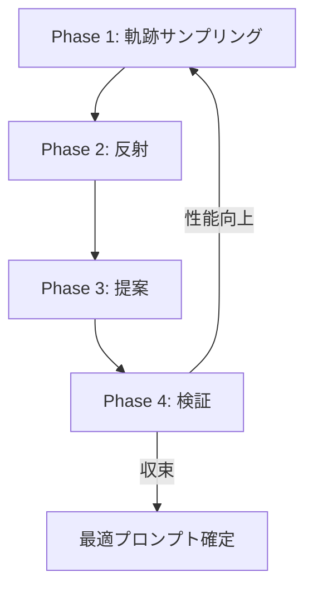
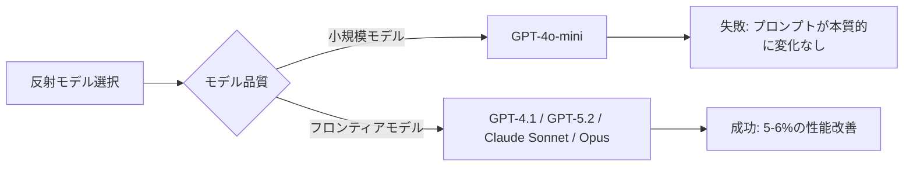

## ブログ概要（Summary）

Decagon社のRoy Wang氏が、ICLR 2026で発表された勾配フリープロンプト最適化手法GEPAを本番環境の二値分類タスクに適用し、19以上のアブレーション実験を通じて得られた3つの実践的知見を報告している。従来の「データは多いほど良い」という前提を覆し、20-100サンプルが最適であること、反射モデルにはフロンティアLLMが不可欠であること、長さ正規化がプロダクション品質の鍵であることを定量的に示した。

本記事は [Decagon Tech Blog: Optimizing GEPA for production](https://decagon.ai/blog/optimizing-gepa-for-production) の解説記事です。

この記事は [Zenn記事: DSPy 3.3 Flex×GEPAでLLMパイプラインの構造ごと自動最適化する](https://zenn.dev/0h_n0/articles/94463814c80394) の深掘りです。

## 情報源

- **種別**: 企業テックブログ
- **URL**: [https://decagon.ai/blog/optimizing-gepa-for-production](https://decagon.ai/blog/optimizing-gepa-for-production)
- **組織**: Decagon（AIカスタマーサポート企業）
- **著者**: Roy Wang, Member of Technical Staff, Research
- **発表日**: 2026年3月25日

## 技術的背景（Technical Background）

GEPA（Gradient-free Evolutionary Prompt Adaptation）は、ICLR 2026で発表された勾配フリーのプロンプト最適化手法である。強化学習ベースの手法（GRPO等）と比較して、最大20%高い性能を35分の1のモデルロールアウト数で達成すると報告されている（arXiv: 2507.19457）。

GEPAの基本的なアイデアは、LLM自身の「反射（reflection）」能力を活用してプロンプトを反復的に改善する点にある。勾配降下法のように連続的なパラメータ空間を探索するのではなく、自然言語による失敗分析と改善提案のサイクルでプロンプトを進化させる。

しかし、学術論文での評価と本番環境での適用には大きなギャップがある。Decagon社はAIカスタマーサポートのスーパーバイザーモデル（会話を分析し構造化された判定と推論トレースを生成する二値分類器）にGEPAを適用する過程で、600以上のラベル付き例を用いた体系的なアブレーション実験を実施した。Wang氏はこの過程で「従来の常識」を覆す3つの発見を報告している。

## 実装アーキテクチャ（Architecture）

### GEPAの4フェーズ動作プロセス

GEPAは以下の4フェーズを反復するサイクルで動作する。Wang氏のブログではこのサイクルを本番環境の分類タスクに適用した構成が報告されている。



**Phase 1: 軌跡サンプリング（Trajectory Sampling）** --- 現在のプロンプトを用いて、訓練バッチに対するモデル出力を生成する。Decagon社のベースライン構成ではバッチサイズ10で、正例・負例の両方のフィードバックを含む出力を収集している。

**Phase 2: 反射（Reflection）** --- フロンティアLLM（反射モデル）が、Phase 1で得られた失敗パターンと成功パターンを分析する。Wang氏はこのフェーズが最適化全体の品質を左右する最重要ステップであると報告している。

**Phase 3: 提案（Proposal）** --- 反射モデルが分析結果に基づき、改善されたプロンプトを提案する。デフォルトのGEPAでは長さ制約がないため、反復を重ねるとプロンプトが肥大化する傾向がある。

**Phase 4: 検証（Validation）** --- 提案されたプロンプトをホールドアウト検証データセットで評価する。性能が向上していればそのプロンプトを採用し、次のサイクルに進む。

### タスク仕様とベースライン構成

Decagon社が適用したタスクの仕様とベースライン構成は以下の通りである。

| 項目 | 設定値 |
|------|--------|
| タスク | 会話分析の二値分類 |
| ラベル付きデータ | 600以上 |
| 訓練サンプル数 | 50（ベースライン） |
| 検証サンプル数 | 50 |
| バッチサイズ | 10 |
| 反射モデル | GPT-4.1 |
| フィードバック種別 | 正例＋負例 |
| 長さ制約 | なし（初期状態） |

## Production Deployment Guide

GEPAによるプロンプト最適化パイプラインをAWS上で運用する構成を示す。プロンプト最適化は推論とは異なりバッチ処理が中心であるため、コスト効率を重視した設計とする。以下のコスト試算は2026年8月時点のAWS ap-northeast-1（東京）リージョン料金に基づく概算値であり、実際のコストはトラフィックパターンやバースト使用量により変動する。最新料金はAWS料金計算ツールで確認を推奨する。

### AWS実装パターン（コスト最適化重視）

**Small構成（~週1回の最適化、~100 req/日の推論）**: Lambda + Bedrock

| サービス | 用途 | 月額概算 |
|----------|------|----------|
| Lambda | 最適化ジョブ実行 | $5-10 |
| Bedrock (Claude Sonnet) | 反射モデル + タスクモデル | $30-80 |
| DynamoDB | プロンプト版管理・メトリクス | $5 |
| S3 | 軌跡ログ保存 | $1 |
| Step Functions | 4フェーズオーケストレーション | $3 |
| **合計** | | **$50-100/月** |

**Medium構成（~日次最適化、~1000 req/日の推論）**: ECS Fargate + Bedrock

| サービス | 用途 | 月額概算 |
|----------|------|----------|
| ECS Fargate | 最適化ワーカー（0.5 vCPU, 1GB） | $30-50 |
| Bedrock | 反射 + タスクモデル | $200-500 |
| DynamoDB | プロンプト版管理 | $10-20 |
| ElastiCache (Redis) | プロンプトキャッシュ | $50 |
| S3 + Athena | 軌跡分析 | $10 |
| **合計** | | **$300-630/月** |

**Large構成（継続的最適化、10000+ req/日の推論）**: EKS + Spot + Bedrock

| サービス | 用途 | 月額概算 |
|----------|------|----------|
| EKS | オーケストレーション | $75 |
| EC2 Spot (m6i.xlarge) | 最適化ワーカー x2-4 | $80-160 |
| Bedrock Batch API | 反射 + タスクモデル（50%割引） | $800-2,000 |
| DynamoDB | プロンプト版管理 | $30-50 |
| ElastiCache (Redis) | プロンプト・結果キャッシュ | $100 |
| S3 + Athena | 軌跡・A/Bテスト分析 | $30 |
| **合計** | | **$1,100-2,400/月** |

**コスト削減テクニック**:
- Spot Instances活用: 最適化ワーカーはステートレスのため中断耐性が高く、最大90%のコスト削減が可能
- Bedrock Batch API: 非リアルタイムの軌跡サンプリングに使用し50%削減
- Prompt Caching: 反射プロンプトのプレフィックス部分をキャッシュし30-90%削減
- Reserved Instances: ElastiCache等の常時稼働リソースは1年コミットで最大72%削減

### Terraformインフラコード

**Small構成（Serverless）**: Lambda + Step Functions + Bedrock

```hcl
# GEPA最適化パイプライン - Small構成
# Lambda + Step Functions + Bedrock

terraform {
  required_version = ">= 1.9"
  required_providers {
    aws = {
      source  = "hashicorp/aws"
      version = "~> 5.60"
    }
  }
}

provider "aws" {
  region = "ap-northeast-1"
}

# --- IAM: 最小権限 ---
resource "aws_iam_role" "gepa_lambda" {
  name = "gepa-optimizer-lambda"
  assume_role_policy = jsonencode({
    Version = "2012-10-17"
    Statement = [{
      Action = "sts:AssumeRole"
      Effect = "Allow"
      Principal = { Service = "lambda.amazonaws.com" }
    }]
  })
}

resource "aws_iam_role_policy" "gepa_lambda" {
  name = "gepa-lambda-policy"
  role = aws_iam_role.gepa_lambda.id
  policy = jsonencode({
    Version = "2012-10-17"
    Statement = [
      {
        Effect   = "Allow"
        Action   = ["bedrock:InvokeModel"]
        Resource = "arn:aws:bedrock:ap-northeast-1::foundation-model/*"
      },
      {
        Effect   = "Allow"
        Action   = ["dynamodb:GetItem", "dynamodb:PutItem", "dynamodb:Query"]
        Resource = aws_dynamodb_table.prompts.arn
      },
      {
        Effect   = "Allow"
        Action   = ["s3:PutObject", "s3:GetObject"]
        Resource = "${aws_s3_bucket.trajectories.arn}/*"
      },
      {
        Effect = "Allow"
        Action = [
          "logs:CreateLogGroup", "logs:CreateLogStream", "logs:PutLogEvents"
        ]
        Resource = "arn:aws:logs:*:*:*"
      }
    ]
  })
}

# --- DynamoDB: プロンプト版管理 (On-Demand) ---
resource "aws_dynamodb_table" "prompts" {
  name         = "gepa-prompt-versions"
  billing_mode = "PAY_PER_REQUEST"
  hash_key     = "prompt_id"
  range_key    = "version"

  attribute {
    name = "prompt_id"
    type = "S"
  }
  attribute {
    name = "version"
    type = "N"
  }

  point_in_time_recovery { enabled = true }
  server_side_encryption  { enabled = true }
}

# --- S3: 軌跡ログ (KMS暗号化) ---
resource "aws_s3_bucket" "trajectories" {
  bucket = "gepa-trajectories-${data.aws_caller_identity.current.account_id}"
}

resource "aws_s3_bucket_server_side_encryption_configuration" "trajectories" {
  bucket = aws_s3_bucket.trajectories.id
  rule {
    apply_server_side_encryption_by_default {
      sse_algorithm = "aws:kms"
    }
  }
}

# --- Lambda: 最適化ステップ ---
resource "aws_lambda_function" "gepa_optimizer" {
  function_name = "gepa-optimizer"
  runtime       = "python3.12"
  handler       = "handler.lambda_handler"
  role          = aws_iam_role.gepa_lambda.arn
  timeout       = 300       # 反射フェーズは時間がかかる
  memory_size   = 512

  environment {
    variables = {
      PROMPT_TABLE    = aws_dynamodb_table.prompts.name
      TRAJECTORY_BUCKET = aws_s3_bucket.trajectories.id
      REFLECTION_MODEL  = "anthropic.claude-sonnet-4-20250514"
      MAX_PROMPT_LENGTH = "1500"  # 長さ正規化
    }
  }

  filename = "lambda.zip"   # デプロイパッケージ
}

# --- CloudWatch: コスト監視アラーム ---
resource "aws_cloudwatch_metric_alarm" "bedrock_cost" {
  alarm_name          = "gepa-bedrock-token-spike"
  comparison_operator = "GreaterThanThreshold"
  evaluation_periods  = 1
  metric_name         = "InputTokenCount"
  namespace           = "AWS/Bedrock"
  period              = 3600
  statistic           = "Sum"
  threshold           = 100000   # 1時間あたり10万トークン超過で通知
  alarm_actions       = [aws_sns_topic.alerts.arn]
}

resource "aws_sns_topic" "alerts" {
  name = "gepa-alerts"
}

data "aws_caller_identity" "current" {}
```

**Large構成（Container）**: EKS + Karpenter + Spot

```hcl
# GEPA最適化パイプライン - Large構成
# EKS + Karpenter + Spot Instances

module "eks" {
  source  = "terraform-aws-modules/eks/aws"
  version = "~> 20.24"

  cluster_name    = "gepa-optimizer"
  cluster_version = "1.31"

  vpc_id     = module.vpc.vpc_id
  subnet_ids = module.vpc.private_subnets

  # Spot活用のためKarpenter有効化
  enable_karpenter = true

  eks_managed_node_groups = {
    system = {
      instance_types = ["t3.medium"]
      min_size       = 1
      max_size       = 2
      desired_size   = 1
    }
  }
}

# --- Karpenter: Spot優先の自動スケーリング ---
resource "kubectl_manifest" "karpenter_nodepool" {
  yaml_body = yamlencode({
    apiVersion = "karpenter.sh/v1"
    kind       = "NodePool"
    metadata   = { name = "gepa-workers" }
    spec = {
      template = {
        spec = {
          requirements = [
            { key = "karpenter.sh/capacity-type", operator = "In", values = ["spot", "on-demand"] },
            { key = "node.kubernetes.io/instance-type", operator = "In",
              values = ["m6i.xlarge", "m6a.xlarge", "m5.xlarge"] }
          ]
        }
      }
      limits   = { cpu = "16" }          # 最大16 vCPU
      disruption = { consolidationPolicy = "WhenEmpty" }
    }
  })
}

# --- AWS Budgets: 予算アラート ---
resource "aws_budgets_budget" "gepa" {
  name         = "gepa-monthly"
  budget_type  = "COST"
  limit_amount = "3000"
  limit_unit   = "USD"
  time_unit    = "MONTHLY"

  notification {
    comparison_operator       = "GREATER_THAN"
    threshold                 = 80
    threshold_type            = "PERCENTAGE"
    notification_type         = "ACTUAL"
    subscriber_email_addresses = ["ops-team@example.com"]
  }
}
```

### 運用・監視設定

**CloudWatch Logs Insights: コスト異常検知**

```
# 1時間あたりのBedrock トークン使用量
fields @timestamp, @message
| filter @message like /token/
| stats sum(input_tokens) as total_input, sum(output_tokens) as total_output by bin(1h)
| sort @timestamp desc
```

**CloudWatch Logs Insights: レイテンシ分析**

```
# GEPA各フェーズのP95/P99レイテンシ
fields @timestamp, phase, duration_ms
| filter event = "gepa_phase_complete"
| stats percentile(duration_ms, 95) as p95,
        percentile(duration_ms, 99) as p99
  by phase
```

**CloudWatch アラーム設定（Python）**:

```python
import boto3

cloudwatch = boto3.client("cloudwatch", region_name="ap-northeast-1")

def create_gepa_alarms() -> None:
    """GEPA最適化パイプラインの監視アラームを設定する"""
    # Bedrock トークン使用量スパイク検知
    cloudwatch.put_metric_alarm(
        AlarmName="gepa-bedrock-token-spike",
        MetricName="InputTokenCount",
        Namespace="AWS/Bedrock",
        Statistic="Sum",
        Period=3600,
        EvaluationPeriods=1,
        Threshold=100000,
        ComparisonOperator="GreaterThanThreshold",
        AlarmActions=["arn:aws:sns:ap-northeast-1:ACCOUNT:gepa-alerts"],
    )
    # Lambda実行時間異常検知
    cloudwatch.put_metric_alarm(
        AlarmName="gepa-lambda-duration",
        MetricName="Duration",
        Namespace="AWS/Lambda",
        Dimensions=[{"Name": "FunctionName", "Value": "gepa-optimizer"}],
        Statistic="p99",
        Period=300,
        EvaluationPeriods=2,
        Threshold=280000,  # 280秒（タイムアウト300秒の93%）
        ComparisonOperator="GreaterThanThreshold",
        AlarmActions=["arn:aws:sns:ap-northeast-1:ACCOUNT:gepa-alerts"],
    )
```

**X-Ray トレーシング設定（Python）**:

```python
from aws_xray_sdk.core import xray_recorder, patch_all

patch_all()  # boto3自動計装

@xray_recorder.capture("gepa_reflection")
def run_reflection(trajectories: list[dict], model_id: str) -> str:
    """反射フェーズをX-Rayでトレースする

    Args:
        trajectories: サンプリングされた軌跡リスト
        model_id: 反射モデルのID

    Returns:
        反射分析結果テキスト
    """
    subsegment = xray_recorder.current_subsegment()
    subsegment.put_annotation("phase", "reflection")
    subsegment.put_annotation("model", model_id)
    subsegment.put_metadata("trajectory_count", len(trajectories))
    # ... Bedrock呼び出し
    return analysis_result
```

**Cost Explorer日次レポート（Python）**:

```python
import boto3
from datetime import date, timedelta

ce = boto3.client("ce", region_name="us-east-1")
sns = boto3.client("sns", region_name="ap-northeast-1")

def daily_cost_report() -> dict:
    """日次コストレポートを取得しSNS通知する

    Returns:
        サービス別コスト辞書
    """
    today = date.today()
    yesterday = today - timedelta(days=1)

    response = ce.get_cost_and_usage(
        TimePeriod={"Start": str(yesterday), "End": str(today)},
        Granularity="DAILY",
        Metrics=["UnblendedCost"],
        Filter={
            "Tags": {"Key": "Project", "Values": ["gepa-optimizer"]}
        },
        GroupBy=[{"Type": "DIMENSION", "Key": "SERVICE"}],
    )

    costs = {}
    total = 0.0
    for group in response["ResultsByTime"][0]["Groups"]:
        service = group["Keys"][0]
        amount = float(group["Metrics"]["UnblendedCost"]["Amount"])
        costs[service] = amount
        total += amount

    if total > 100:
        sns.publish(
            TopicArn="arn:aws:sns:ap-northeast-1:ACCOUNT:gepa-alerts",
            Subject="GEPA日次コスト警告",
            Message=f"日次コスト: ${total:.2f} (閾値: $100)",
        )
    return costs
```

### コスト最適化チェックリスト

**アーキテクチャ選択**:
- [ ] 最適化頻度が週1回以下ならServerless（Lambda + Step Functions）
- [ ] 日次最適化ならHybrid（ECS Fargate）
- [ ] 継続的最適化ならContainer（EKS + Spot）

**リソース最適化**:
- [ ] 最適化ワーカーはSpot Instances優先（中断耐性あり）
- [ ] ElastiCache等の常時稼働はReserved Instances 1年コミット
- [ ] Savings Plans検討（Compute Savings Plans）
- [ ] Lambda: メモリサイズを512MBに最適化（反射フェーズ考慮）
- [ ] ECS/EKS: アイドル時はKarpenterでゼロスケール

**LLMコスト削減**:
- [ ] 軌跡サンプリングにBedrock Batch APIを使用（50%削減）
- [ ] 反射プロンプトのプレフィックスにPrompt Cachingを有効化（30-90%削減）
- [ ] タスクモデルとは別にコスト効率の良い反射モデルを選択（反射は総コストの5-10%）
- [ ] Wang氏の知見に基づきサンプル数を20-100に制限（計算量を最大10倍削減）
- [ ] 長さ制約1,500文字でプロンプト肥大化を防止

**監視・アラート**:
- [ ] AWS Budgets設定（月額予算の80%で通知）
- [ ] CloudWatchアラーム（トークンスパイク、レイテンシ異常）
- [ ] Cost Anomaly Detection有効化
- [ ] 日次コストレポート自動送信

**リソース管理**:
- [ ] S3軌跡ログにライフサイクルポリシー（90日でGlacier移行）
- [ ] 未使用プロンプトバージョンの定期削除
- [ ] リソースタグ戦略（Project: gepa-optimizer）
- [ ] 開発環境は夜間・週末停止（EventBridge Scheduler）
- [ ] DynamoDB TTLで古いメトリクス自動削除

## パフォーマンス最適化（Performance）

### 発見1: 最適データ量は20-100サンプル

Wang氏のアブレーション実験で最も意外な結果は、データ量に関するものである。従来の機械学習の常識では「データは多いほど良い」とされるが、GEPAでは逆の結果が得られている。

| サンプル数 | 性能変化 | プロンプト長 | LM呼び出し回数 | 計算コスト |
|-----------|---------|-------------|--------------|-----------|
| 20 | +1%（ピーク） | 簡潔 | ~60 | 2.5倍安い |
| 50（ベースライン） | 基準 | 中程度 | ~150 | 1倍 |
| 500 | -2% | +75%肥大化 | ~1,500 | 10倍高い |

Wang氏はこの現象について、多くのデータと反復を重ねるとGEPAの反射メカニズムがエッジケースを個別にエンコードし始め、結果として冗長で過適合したプロンプトが生成されると分析している。20サンプルでピーク性能を達成できるという知見は、プロンプト最適化のコスト効率に大きな示唆を与える。

### 発見2: 反射モデルにはフロンティアモデルが不可欠

GEPAの4フェーズのうち、Phase 2（反射）で使用するモデルの品質が最適化全体の成否を決定する。Wang氏の実験では、以下の明確な二極化が報告されている。



GPT-4o-miniを反射モデルとして使用した場合、最適化後のプロンプトがシードプロンプトから「本質的に変化なし」であったとWang氏は報告している。一方、フロンティアモデル（GPT-4.1、GPT-5.2、Claude Sonnet/Opus）はいずれも5-6%の改善を達成した。

この差が生じる理由について、Wang氏は反射タスクが「推論についての推論（reasoning about reasoning）」を要求するためであると分析している。重要な点は、反射モデルの呼び出しは総最適化コストの5-10%に過ぎないことである。タスクモデル（軌跡サンプリング用）の呼び出しがコストの大部分を占めるため、反射モデルにフロンティアLLMを採用してもコスト効率は十分に高い。

### 発見3: 長さ正規化による過適合防止

制約なしでGEPAを実行すると、反復的な詳細追加によりプロンプトが5,000文字以上に膨張する。Wang氏は長さ制約のアブレーション実験で以下の結果を報告している。

| 制約 | プロンプト長 | 性能変化 | レイテンシ |
|------|------------|---------|-----------|
| 制約なし | ~5,000文字 | 基準 | 高い |
| 1,500文字制約 | ~1,000文字 | -0.8% | プロダクション適合 |
| 500文字制約 | ~500文字 | -3.0% | 最小 |

1,500文字制約で得られる効果は大きい。4倍のプロンプト圧縮（5,000文字から1,000文字へ）をわずか0.8%の性能低下で達成し、プロダクション品質のレイテンシと汎化性能の向上を同時に実現している。500文字制約では3%の性能低下が生じるため、過度な圧縮は避けるべきである。

Wang氏はこの長さ制約をデフォルトのGEPAに組み込むため、カスタム命令提案器（custom instruction proposer）を構築し、制約を反射プロンプトに直接エンコードする手法を採用したと報告している。

## 運用での学び（Production Lessons）

Wang氏はGEPAの本番適用から得られた教訓として、プロンプト最適化をソフトウェアエンジニアリングとして扱うべきだと提唱している。具体的には以下の4点が推奨されている。

1. **ホールドアウト検証テストの重視**: 訓練精度ではなく、未見データでの汎化性能を測定する。GEPAの反復が訓練セットに過適合するリスクがあるため、常に検証セットでの評価を基準とする。

2. **カスタム提案器による要件エンコーディング**: プロダクション要件（長さ制約、レイテンシ制約、出力フォーマット制約等）を反射プロンプトに直接埋め込む。デフォルトのGEPAにはこれらの制約がないため、カスタマイズが必須である。

3. **訓練精度よりも汎化を測定**: 訓練セットでの精度向上が検証セットでの精度低下を伴う場合、過適合の兆候である。Wang氏は600サンプル中の訓練50・検証50の分割をベースラインとしている。

4. **アブレーション実験による意思決定**: ハイパーパラメータ（サンプル数、反射モデル、長さ制約等）の選択は直感ではなく、体系的なアブレーション実験に基づくべきである。Wang氏のチームは19以上の実験を実施してベストプラクティスを確立した。

## 学術研究との関連（Academic Connection）

GEPAはarXiv: 2507.19457として発表され、ICLR 2026に採択された手法である。強化学習ベースのプロンプト最適化（GRPO等）と比較して、35分の1のモデルロールアウト数で最大20%高い性能を達成すると報告されている。DSPy 3.3のFlex機能はGEPAを含む複数の最適化アルゴリズムを統一的に扱えるフレームワークであり、Wang氏の知見はDSPy Flex経由でGEPAを使用する際にも直接適用可能である。特にサンプル数の制限（20-100）や長さ正規化の導入は、DSPyの`BootstrapFewShot`や`MIPROv2`等の他のオプティマイザとの比較実験においても重要な制御変数となる。

## まとめと実践への示唆

Decagon社のWang氏による19以上のアブレーション実験は、GEPAの本番適用において「少ないデータ（20-100サンプル）」「高品質な反射モデル」「長さ正規化（1,500文字制約）」の3点が成功の鍵であることを定量的に示した。これらの知見は、プロンプト最適化を「職人芸」から「テスト駆動のソフトウェアエンジニアリング」に転換するための実践的な指針となる。

## 参考文献

- **Blog URL**: [https://decagon.ai/blog/optimizing-gepa-for-production](https://decagon.ai/blog/optimizing-gepa-for-production)
- **GEPA論文**: [https://arxiv.org/abs/2507.19457](https://arxiv.org/abs/2507.19457)（ICLR 2026）
- **Related Zenn article**: [https://zenn.dev/0h_n0/articles/94463814c80394](https://zenn.dev/0h_n0/articles/94463814c80394)
