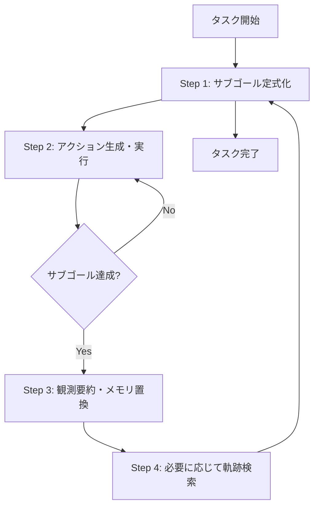
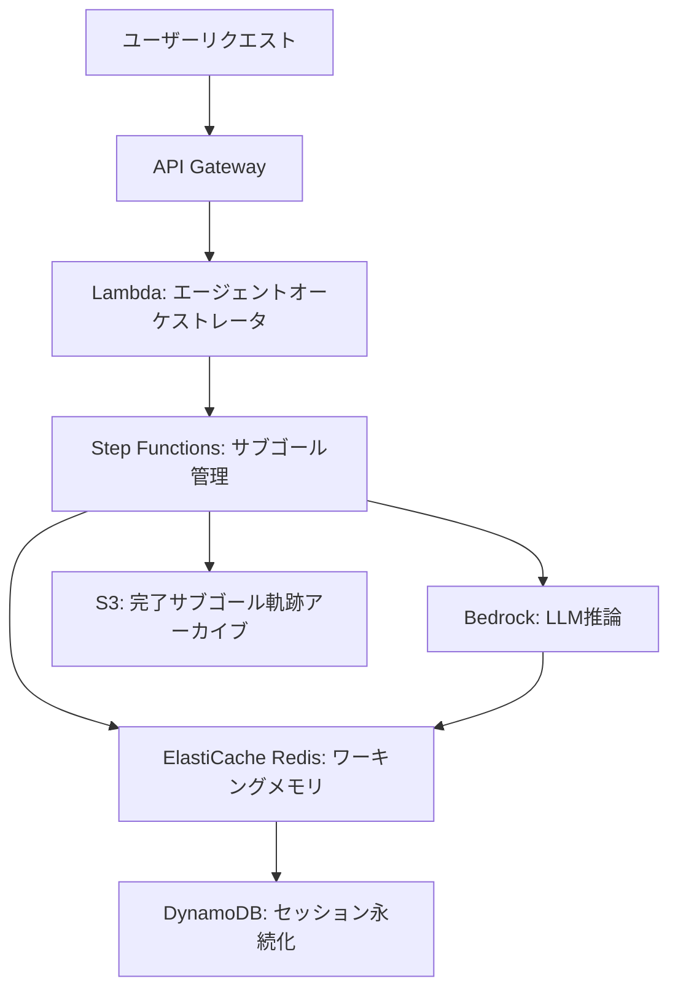

本記事は [HiAgent: Hierarchical Working Memory Management for Solving Long-Horizon Agent Tasks with Large Language Model](https://aclanthology.org/2025.acl-long.1575/) の解説記事です。

## 論文概要

HiAgentは、LLMベースエージェントが長期タスク（long-horizon task）を遂行する際のワーキングメモリ管理を改善するフレームワークである。従来手法では全履歴のアクション-観測ペアをそのままLLMに入力するため、ステップ数の増加に伴いコンテキストが冗長化し、エージェントの判断精度が低下する。HiAgentはサブゴールをメモリチャンクとして活用し、完了済みサブゴールの詳細な軌跡を要約観測に動的に置換することで、コンテキスト長を35%削減しながら成功率を2倍に向上させた。

## Zenn記事との関連

関連Zenn記事「[Redis×pgvectorでH-MEM階層メモリを実装しCS応答精度を向上させる](https://zenn.dev/0h_n0/articles/19b6cd13ae346b)」では、H-MEMの4層構造（Domain→Category→Trace→Episode）をRedis（ワーキングメモリ）とpgvector（セマンティックメモリ）で実装し、カスタマーサポートエージェントの応答精度を改善する手法を解説している。

HiAgentとH-MEMは、いずれも「階層的なメモリ管理によってLLMエージェントの性能を向上させる」という共通のアプローチを取る。ただし両者の焦点は異なる。H-MEMは意味的抽象度に基づく4層構造で過去の対話を効率的に検索・想起する仕組みであり、主にクロストライアルメモリ（複数セッション間の長期記憶）に相当する。一方、HiAgentはインタライアルメモリ（単一タスク実行中のワーキングメモリ）に焦点を当て、サブゴール単位でのチャンキングと動的な要約置換によりコンテキストの冗長化を防ぐ。

実運用のCSエージェントでは、H-MEMの階層検索でチケット横断の文脈を取得し、HiAgentで現在のタスク実行中のワーキングメモリを効率化する相補的な組み合わせが考えられる。

## 情報源

- **論文タイトル**: HiAgent: Hierarchical Working Memory Management for Solving Long-Horizon Agent Tasks with Large Language Model
- **著者**: Mengkang Hu（香港大学）, Tianxing Chen（香港大学）, Qiguang Chen（ハルビン工業大学）, Yao Mu（香港大学）, Wenqi Shao（上海AI研究所）, Ping Luo（香港大学）
- **発表会議**: ACL 2025（63rd Annual Meeting of the Association for Computational Linguistics）
- **開催地**: オーストリア・ウィーン、2025年7月27日-8月1日
- **収録巻**: Volume 1: Long Papers, pp. 32779-32798
- **URL**: [https://aclanthology.org/2025.acl-long.1575/](https://aclanthology.org/2025.acl-long.1575/)
- **コード**: [https://github.com/HiAgent2024/HiAgent](https://github.com/HiAgent2024/HiAgent)

## カンファレンス情報

ACL（Association for Computational Linguistics）は自然言語処理分野のトップティア国際会議であり、EMNLP、NAACLと並ぶ最高峰の査読付き会議である。Long Paperカテゴリは厳格な査読プロセスを経ており、本論文は付録含め20ページの実験分析を含む。

## 技術的詳細

### 問題設定：LLMベースエージェントのPOMDP定式化

著者らはLLMベースエージェントのタスクを部分観測マルコフ決定過程（POMDP）として定式化している。タスクはタプル $(S, O, A, T, R)$ で特徴づけられる。

- $S$: 状態空間
- $O$: 観測空間
- $A$: 行動空間
- $T: S \times A \rightarrow S$: 遷移関数
- $R: S \times A \rightarrow R$: 報酬関数

LLMベースエージェントは方策 $\pi(a_t \mid I, o_t, a_{t-1}, o_{t-1}, \ldots, a_0, o_0)$ として動作する。ここで $I$ は指示（タスク記述、in-context例など）、$a_t \in A$ は時刻 $t$ で生成される実行可能アクション、$o_t \in O$ は環境からの観測である。

### クロストライアルメモリとインタライアルメモリ

著者らはエージェントのメモリを2種類に分類している。

- **クロストライアルメモリ（cross-trial memory）**: 複数の試行にわたり蓄積される履歴情報。Reflexion（Shinn et al., 2024）やGuo et al.（2023）がこの最適化に取り組んでいる
- **インタライアルメモリ（in-trial memory / working memory）**: 単一の試行内で蓄積される情報。タスク実行中にリアルタイムで更新される

著者らは、クロストライアルメモリの最適化に多くの研究が集中している一方で、ワーキングメモリの効率的な管理はほとんど探求されていないと指摘している。

### 従来手法（Standard）の問題

従来のStandard戦略では、全履歴のアクション-観測ペアをワーキングメモリとして保持する。

$$m_t^{std} = (o_t, a_{t-1}, o_{t-1}, \ldots, a_0, o_0)$$

この方式はLLMに対して包括的な情報を提供するが、long-horizonタスクでは以下の問題が生じると著者らは報告している。

1. **コンテキストの冗長化**: ステップ数が増加するとワーキングメモリが膨大になり、LLMの処理を複雑化させる
2. **実行可能性の低下**: Blocksworldタスクでは20ステップを超えるとStandard戦略の実行可能アクション生成率が10%未満に低下する
3. **一貫性の喪失**: 冗長なコンテキストにより、LLMが一貫した戦略を維持できなくなる

### HiAgentの階層ワーキングメモリ管理

HiAgentの中心的アイデアは、サブゴールをメモリチャンクとして活用し、ワーキングメモリを階層的に管理することである。認知科学におけるチャンキング理論（Miller, 1956）に着想を得ており、人間が複雑な問題をサブ問題に分解し、完了したサブ問題は結果のみを保持するという認知プロセスを模倣している。

HiAgentのプロセスは以下の4ステップで構成される。



**Step 1: サブゴール定式化（Subgoal Formulation）**

各タイムステップで、LLMは現在のサブゴールに対するアクション生成か、新しいサブゴールの生成かを選択する。LLMはまずサブゴール $g_i$ を定式化してから、それを達成するための具体的なアクションを生成する。サブゴールはタスク全体の中でのマイルストーンとして機能する。

**Step 2: アクション生成と実行**

定式化されたサブゴールに基づき、LLMは具体的な実行可能アクションを生成する。現在のサブゴールに関連する全てのアクション-観測ペアは詳細な形で保持され、即時の意思決定に必要なコンテキストを提供する。

**Step 3: 観測要約と動的メモリ置換（Dynamic Memory Replacement）**

サブゴール $g_i$ が達成されたと判断されると、対応するアクション-観測ペアを要約観測 $s_i$ に合成する。

$$s_i = S(g_i, o_0, a_0, \ldots, o_t)$$

ここで $S$ はLLMまたはテキスト要約モデルによる要約関数である。この要約は以下の2つの機能を果たす。

1. 過去のサブゴール実行の詳細な軌跡を凝縮された要約に置換する
2. 現在のサブゴールが達成されたかどうかを評価する

これにより、HiAgentのワーキングメモリは以下の形式になる。

$$m_t = (g_0, s_0, \ldots, g_{n-1}, s_{n-1}, g_n, a_{n0}, o_{n1}, \ldots)$$

過去のサブゴールについては要約 $s_i$ のみが保持され、現在のサブゴール $g_n$ についてのみ詳細なアクション-観測ペアが保持される。

**Step 4: 軌跡検索（Trajectory Retrieval）**

要約だけでは不十分な場合（過去のサブゴールで失敗した原因の分析や、成功体験の参照が必要な場合）、LLMは検索関数を生成して特定の過去サブゴールの完全なアクション-観測ペアを取得できる。$q$ 番目のサブゴールが検索された場合、ワーキングメモリは一時的に以下の形式になる。

$$m_t' = (g_0, s_0, \ldots, g_q, a_{q0}, a_{q0}, \ldots, g_n, a_{n0}, o_{n0}, \ldots)$$

この選択的検索により、常に全コンテキストを保持することなく、必要な時にのみ詳細情報にアクセスできる。

## 実装のポイント

### AgentBoardベースの実装

著者らはAgentBoard（Ma et al., 2024）を実装基盤として使用している。公開リポジトリ（[GitHub](https://github.com/HiAgent2024/HiAgent)）では `agentboard/` ディレクトリ配下にベンチマーク評価のコードが含まれている。

### LLMバックエンドと設定

- **モデル**: GPT-4（gpt-4-turbo）をOpenAI API経由で使用
- **温度パラメータ**: 0（決定的生成）
- **top_p**: 1
- **最大ステップ数**: 30（各タスク）
- **in-context例**: 各タスクに1つ

GPT-4がエージェント方策と観測要約モデルの両方を担当する点が特徴的である。サブゴール定式化・アクション生成・要約のすべてを単一のLLMで処理するため、追加のモデル導入は不要である。

### サブゴール定式化のプロンプト設計

著者らはプロンプト設計において、LLMに対して「まずサブゴールを生成し、次にそのサブゴールを達成するためのアクションを生成する」という明確な指示を与えている。タスク記述、環境の初期状態、ワーキングメモリ、および現在の観測が入力として提供される。

以下はHiAgentのワーキングメモリ管理のコンセプトを示す簡略実装である。

```python
from dataclasses import dataclass, field


@dataclass(frozen=True)
class SubgoalChunk:
    """完了済みサブゴールのメモリチャンク表現."""

    subgoal: str
    summary: str


@dataclass
class HiAgentWorkingMemory:
    """HiAgentの階層ワーキングメモリ管理."""

    completed_chunks: list[SubgoalChunk] = field(
        default_factory=list,
    )
    current_subgoal: str | None = None
    current_actions: list[dict[str, str]] = field(
        default_factory=list,
    )

    def format_context(self) -> str:
        """LLMに入力するコンテキスト文字列を生成."""
        parts: list[str] = []
        for chunk in self.completed_chunks:
            parts.append(
                f"Subgoal: {chunk.subgoal} | "
                f"Observation: {chunk.summary}"
            )
        if self.current_subgoal:
            parts.append(f"Current Subgoal: {self.current_subgoal}")
            for ap in self.current_actions:
                parts.append(
                    f"  Action: {ap['action']} | "
                    f"Obs: {ap['observation']}"
                )
        return "\n".join(parts)

    def complete_subgoal(self, summary: str) -> None:
        """現在のサブゴールを要約で置換し完了とする."""
        if self.current_subgoal is None:
            msg = "No active subgoal to complete"
            raise ValueError(msg)
        self.completed_chunks.append(
            SubgoalChunk(
                subgoal=self.current_subgoal,
                summary=summary,
            )
        )
        self.current_subgoal = None
        self.current_actions = []
```

## 本番デプロイガイド：AWSでのサブゴールベースエージェントメモリ

HiAgentの階層ワーキングメモリ管理を本番環境のCSエージェントに適用する場合、AWSサービスを活用したアーキテクチャが有効である。以下に、サブゴール管理とメモリ最適化の観点からの設計パターンを示す。

### アーキテクチャ概要



### サブゴール管理のStep Functions設計

AWS Step Functionsを用いて、HiAgentのサブゴール-アクション-要約ループを実装する。各サブゴールはステートマシンの1ステートに対応し、サブゴール完了時に自動的に要約・置換が実行される。

```python
import json
from typing import Any

import boto3


class SubgoalOrchestrator:
    """AWS Step Functions + ElastiCache によるサブゴール管理.

    HiAgentの動的メモリ置換をサーバーレスで実現する。
    """

    def __init__(
        self,
        redis_client: Any,
        bedrock_client: Any,
        session_ttl: int = 3600,
    ) -> None:
        self.redis = redis_client
        self.bedrock = bedrock_client
        self.session_ttl = session_ttl

    async def store_current_subgoal(
        self,
        session_id: str,
        subgoal: str,
        action_observation: dict[str, str],
    ) -> None:
        """現在のサブゴールの軌跡をRedisに保存.

        HiAgentと同様に、現在のサブゴールのみ
        詳細なアクション-観測ペアを保持する。
        """
        key = f"session:{session_id}:current"
        await self.redis.hset(key, mapping={
            "subgoal": subgoal,
            "actions": json.dumps(
                action_observation, ensure_ascii=False
            ),
        })
        await self.redis.expire(key, self.session_ttl)

    async def complete_and_summarize(
        self,
        session_id: str,
    ) -> str:
        """サブゴール完了時に要約で置換.

        HiAgentのStep 3: 観測要約と動的メモリ置換に対応。
        """
        key = f"session:{session_id}:current"
        data = await self.redis.hgetall(key)
        if not data:
            msg = f"No active subgoal for {session_id}"
            raise ValueError(msg)

        summary = await self._summarize_with_bedrock(
            subgoal=data[b"subgoal"].decode(),
            actions=json.loads(data[b"actions"]),
        )
        chunk_key = f"session:{session_id}:chunks"
        await self.redis.rpush(chunk_key, json.dumps({
            "subgoal": data[b"subgoal"].decode(),
            "summary": summary,
        }, ensure_ascii=False))
        await self.redis.delete(key)
        return summary

    async def _summarize_with_bedrock(
        self, subgoal: str, actions: dict[str, str],
    ) -> str:
        """Bedrockを使った観測要約."""
        response = self.bedrock.invoke_model(
            modelId="anthropic.claude-sonnet-4-20250514",
            body=json.dumps({
                "anthropic_version": "bedrock-2023-05-31",
                "messages": [{"role": "user", "content":
                    f"Subgoal: {subgoal}\n"
                    f"Actions: {json.dumps(actions)}\n"
                    "Summarize concisely."}],
                "max_tokens": 256,
                "temperature": 0,
            }),
        )
        result = json.loads(response["body"].read())
        return result["content"][0]["text"]
```

### コスト最適化とコンテキスト制御

論文ではコンテキスト長を35%削減したと報告されているが、本番環境ではさらに積極的な制御が必要になる場合がある。CloudWatchメトリクスでセッションごとのトークン数を監視し、閾値超過時にはより積極的な要約を実行する設計が推奨される。また、要約処理にはBedrock Haiku等の軽量モデルを使用し、メインのアクション生成にのみ高性能モデルを割り当てることでコストを最適化できる。

### 注意点と制約

- **要約の情報損失**: CSエージェントでは、顧客が言及した金額や日時等を要約時に保持する仕組みが必要
- **サブゴール粒度の調整**: 細かすぎると要約オーバーヘッドが増加し、粗すぎるとメモリ削減効果が低下する
- **セッションの永続化**: Redisのみでは障害時にセッションが失われるため、DynamoDBへのスナップショットが必要

## 実験結果

### 評価タスクと指標

著者らはAgentBoard（Ma et al., 2024）の5つのlong-horizonタスク（いずれも通常20ステップ以上を要する）で評価を行っている。

| タスク | 内容 |
|--------|------|
| Blocksworld | ブロックを目標配置に並べ替える |
| Gripper | 異なる部屋間でオブジェクトを移動する |
| Tyreworld | タイヤ交換（パンクタイヤの取り外し→スペア装着） |
| Barman | バーテンダーとしてカクテルを調合する |
| Jericho | テキストベースのアドベンチャーゲーム |

評価指標は以下の5つである。

- **Progress Rate（PR）**: ゴール条件の達成割合
- **Success Rate（SR）**: タスク完全達成の割合
- **Average Steps**: タスク完了に要した平均ステップ数
- **Context Efficiency**: コンテキストトークンの平均使用量（Standard比）
- **Run Time**: 実行時間（Standard比）

### 主要結果

著者らが報告しているTable 1の結果を以下に示す。

| タスク | SR（Standard） | SR（HiAgent） | PR（Standard） | PR（HiAgent） | Steps（Standard） | Steps（HiAgent） |
|--------|:---:|:---:|:---:|:---:|:---:|:---:|
| Blocksworld | 30.00 | 60.00（+30.00） | 35.00 | 80.00（+45.00） | 25.00 | 18.60（-6.40） |
| Gripper | 50.00 | 50.00（+0.00） | 87.75 | 86.25（-1.50） | 25.20 | 24.80（-0.40） |
| Tyreworld | 10.00 | 60.00（+50.00） | 39.28 | 75.83（+36.55） | 28.40 | 19.00（-9.40） |
| Barman | 10.00 | 30.00（+20.00） | 17.50 | 40.83（+23.33） | 26.85 | 24.50（-2.35） |
| Jericho | 5.00 | 10.00（+5.00） | 13.51 | 29.85（+16.34） | 26.60 | 26.15（-0.45） |
| **Overall** | **21.00** | **42.00（+21.00）** | **38.61** | **62.55（+23.94）** | **26.41** | **22.61（-3.80）** |

全体として、HiAgentはStandard戦略に対して成功率を21ポイント（2倍）向上させ、進捗率を23.94ポイント改善し、平均ステップ数を3.8削減したと報告されている。コンテキスト長は35.02%削減、実行時間は19.42%短縮された。

特にTyreworldでは成功率が10%から60%へと6倍に向上し、平均ステップ数も9.4削減されている。一方、Gripperではサブゴール分解の効果が限定的であり、成功率の改善は見られなかった。ただし、コンテキスト長は50.01%削減されている。

### アブレーション分析

著者らはTyreworldタスクで各モジュールの寄与を検証するアブレーション実験を実施している（Table 2）。

| 構成 | SR | PR | Steps |
|------|:---:|:---:|:---:|
| HiAgent（完全版） | 60.0 | 75.8 | 19.0 |
| w/o OS（観測要約なし） | 30.0（-30.0） | 68.2（-7.6） | 24.2（+5.2） |
| w/o TR（軌跡検索なし） | 50.0（-10.0） | 76.9（+1.1） | 21.2（+2.2） |
| w/o OS & TR（両方なし） | 30.0（-30.0） | 62.4（-13.4） | 26.2（+7.2） |

観測要約モジュール（OS）を除去すると成功率が30ポイント低下し、コンテキスト長が10.8%増加した。軌跡検索モジュール（TR）の除去では成功率が10ポイント低下した。著者らは、TRは推論ステップを増加させるものの、過去の軌跡を柔軟に参照できることが、特にエラー原因の特定に有効であると説明している。

### タスク分解との比較

サブゴールを生成するが詳細な軌跡情報を隠蔽しない手法（Task Decomposition: TD）との比較も行われている（Table 3、Tyreworld）。

| 手法 | SR | Steps | Context |
|------|:---:|:---:|:---:|
| Standard | 10.0 | 28.4 | 100% |
| w. TD | 40.0（+30.0） | 22.8（-5.6） | 112.8%（+12.8%） |
| w. HiAgent | 60.0（+50.0） | 19.0（-9.4） | 73.6%（-26.4%） |

タスク分解だけでも成功率は30ポイント向上するが、コンテキスト長は12.8%増加する。HiAgentは成功率でさらに20ポイント上回りながら、コンテキスト長を26.4%削減しており、改善がタスク分解だけに起因するものではなく、動的メモリ置換による効率的なワーキングメモリ管理が不可欠であることを示している。

### 統計的有意性

著者らはWilcoxon符号付き順位検定を用いて統計的有意性を検証している。Progress Rateについて検定統計量144.0、p値 $2.38 \times 10^{-5}$、Average Stepsについて検定統計量112.5、p値0.0016であり、いずれも統計的に有意であると報告されている。

### 長ステップでの実行可能性

著者らの分析で注目すべき点は、ステップ数が増加した際の実行可能アクション生成率（executability）である。Standard戦略ではBlocksworldにおいて20ステップを超えるとexecutabilityが10%未満に低下するのに対し、HiAgentは長ステップでも80%以上のexecutabilityを維持すると報告されている。これは、コンテキストの冗長化を防ぐことでLLMの推論品質が維持されることを示唆している。

## 実運用への応用

### CSエージェントでのサブゴール活用

HiAgentのサブゴールベース管理は、CSエージェントの複雑な問い合わせ対応に応用できる。例えば「プラン変更+返金処理+新プラン設定」のような複合タスクでは、各処理をサブゴールとして定式化し、完了したサブゴールを要約に置換することで、LLMのコンテキストを効率的に管理できる。

### マルチエージェントシステムへの展開

著者らは、HiAgentがReAct（Yao et al., 2022b）等の他フレームワークにも適用可能であると述べている。ReActの (thought, action, observation) トリプレットをサブゴール単位でチャンキングできる。マルチエージェントシステムにおける情報管理にも応用が期待される。

### 制約事項

著者ら自身が以下の制約を指摘している。

- 極端に長いlong-horizonタスクではメモリ制約が依然として問題になる可能性がある
- 実験はベンチマークタスクが中心であり、実世界の多様なアプリケーションでの検証は今後の課題である
- より高度な検索戦略の探求が必要である

## 関連研究

- **ReAct**（Yao et al., 2022b）: thought-action-observationのトリプレットによるLLMエージェントの推論手法。HiAgentはReActの軌跡にも適用可能
- **Reflexion**（Shinn et al., 2024）: クロストライアルメモリを活用してエージェントの性能を向上させる手法。HiAgentとは対象とするメモリ層が異なる
- **Memorybank**（Zhong et al., 2024）: グローバルレベルの要約により長期対話を凝縮する手法。ワーキングメモリではなく長期記憶の管理に焦点
- **Lumos / XAgent**（Yin et al., 2023; Team, 2023）: 独立したプランニングモジュールでサブゴールを生成するが、実行時は全コンテキストを使用。HiAgentはサブゴールをメモリ管理にも活用する点で差別化
- **Least-to-most / Plan-and-solve**（Zhou et al., 2022; Wang et al., 2023a）: タスク分解手法だが、ワーキングメモリの効率化は扱わない

## まとめ

HiAgentは、認知科学のチャンキング理論に着想を得て、サブゴールをメモリチャンクとして活用し、LLMエージェントのワーキングメモリを階層的に管理するフレームワークである。5つのlong-horizonタスクにおいて、Standard戦略と比較して成功率を2倍（21%→42%）に向上させ、平均ステップ数を3.8削減し、コンテキスト長を35%削減したと著者らは報告している。

特に重要な知見は、サブゴールによるタスク分解だけでは不十分であり、完了済みサブゴールの動的な要約置換というワーキングメモリ管理がHiAgentの性能向上の核心であるという点である。アブレーション分析とタスク分解手法との比較実験がこの主張を裏付けている。

一方、実験がベンチマークタスクに限定されている点、極端に長いタスクでの有効性が未検証である点は制約である。実運用では要約時の情報損失やサブゴール粒度のチューニングも考慮すべきである。
