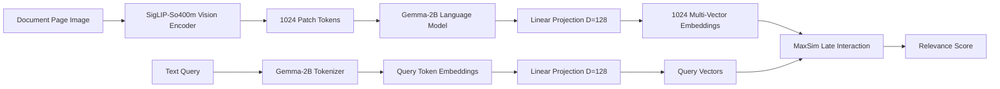

本記事は [ColPali: Efficient Document Retrieval with Vision Language Models](https://arxiv.org/abs/2407.01449)（ICLR 2025）の解説記事です。

## 論文概要（Abstract）

ColPaliは、Vision Language Model（VLM）を用いて文書ページの画像から直接マルチベクトル埋め込みを生成し、Late Interaction機構（MaxSim）によりクエリとの関連度を計算する視覚文書検索モデルである。従来のOCR + テキスト埋め込みパイプラインを排除し、表・図・レイアウト情報を視覚的に理解した検索を実現する。著者らはPaliGemma-3Bをバックボーンとし、LoRAファインチューニングにより128次元のパッチ埋め込みを生成する手法を提案している。ViDoRe（Visual Document Retrieval Benchmark）において、テキストベースの最良手法を大幅に上回るNDCG@5 81.3を達成し、インデックス速度でもOCRパイプライン比18.5倍の高速化を報告している。

この記事は [Zenn記事: ColQwen2×vLLMで図表込み社内マニュアル検索を構築する](https://zenn.dev/0h_n0/articles/6e33a242d347f9) の深掘りです。Zenn記事ではColQwen2とvLLMを用いた社内マニュアル検索の実装パターンを扱っていますが、本記事ではColPali論文そのもののアーキテクチャ設計、MaxSimの数学的定式化、学習手法、Ablation結果について詳細に解説します。

## 情報源

- **arXiv ID**: 2407.01449
- **URL**: [https://arxiv.org/abs/2407.01449](https://arxiv.org/abs/2407.01449)
- **著者**: Manuel Faysse, Hugues Sibille, Tony Wu, Bilel Omrani, Gautier Viaud, Céline Hudelot, Pierre Colombo
- **発表**: ICLR 2025（The Thirteenth International Conference on Learning Representations）
- **分野**: cs.IR, cs.CV

## 背景と動機（Background & Motivation）

文書検索（Document Retrieval）は、クエリに対して関連する文書ページを大規模コーパスから特定するタスクである。従来のアプローチはOCRでテキストを抽出し、BM25やDense Retrieverで検索する「テキスト中心パイプライン」が主流であった。しかし、この方式には3つの根本的な課題がある。

第一に、OCRの精度がボトルネックとなる。手書きテキスト、低解像度画像、複雑なレイアウトではOCRの認識精度が低下し、下流の検索精度に直接影響する。第二に、表・図・チャートなどの視覚要素はOCRでは構造を失い、テキストとして意味を保持できない。第三に、OCRとレイアウト解析のパイプラインは計算コストが高く、1ページあたり数秒を要する場合がある。

著者らはこれらの課題に対し、「そもそもOCRを介さず、ページ画像から直接検索に使える表現を学習できないか」という問いを立てている。Vision Language Model（VLM）の急速な発展がこのアプローチを実現可能にした背景にある。

## 主要な貢献（Key Contributions）

- **視覚文書検索の新パラダイム**: OCRパイプラインを完全に排除し、VLMでページ画像から直接マルチベクトル埋め込みを生成する手法（ColPali）を提案。テキスト、表、図を含む文書を統一的に扱える
- **ViDoReベンチマークの構築**: 視覚的に豊かな文書を対象とした検索評価用ベンチマーク（Visual Document Retrieval Benchmark）を新規に構築し、従来のテキスト中心評価の限界を示した
- **Late Interaction MaxSimの適用**: ColBERTで提案されたLate Interaction機構をVLMのパッチ埋め込みに適用し、トークン単位の細粒度マッチングとスケーラブルな検索を両立
- **計算効率の大幅改善**: インデックス速度0.39秒/ページ（OCRパイプラインの7.22秒/ページ比18.5倍高速）、クエリ遅延約30msを達成

## 技術的詳細（Technical Details）

### アーキテクチャ

ColPaliのアーキテクチャはPaliGemma-3Bをバックボーンとし、3つのコンポーネントで構成される。



**Vision Encoder**: SigLIP-So400m（Shape-Optimized 400M）がページ画像を受け取り、1024個のパッチトークンを出力する。SigLIPはSigmoid損失を用いたCLIPの改良版であり、バッチ内の全ペアを独立に評価するためバッチサイズに対するスケーラビリティが高い。入力画像は固定解像度にリサイズされ、各パッチは画像の局所領域に対応する。

**Language Model**: Gemma-2Bがパッチトークン列を受け取り、テキストとビジョンの統合表現を生成する。PaliGemmaの事前学習により、画像キャプション・VQA・OCRなどの多様なタスクで獲得した言語-視覚対応を活用する。

**Projection Layer**: LMの出力（隠れ次元）を$D = 128$次元に射影する線形層を追加する。これがColPaliのファインチューニングで追加される主要なパラメータである。

$$
\mathbf{e}_j = W_{\text{proj}} \cdot \mathbf{h}_j + \mathbf{b}_{\text{proj}}, \quad W_{\text{proj}} \in \mathbb{R}^{128 \times d_{\text{hidden}}}
$$

ここで$\mathbf{h}_j$はLMの$j$番目のパッチトークンに対する隠れ状態、$\mathbf{e}_j \in \mathbb{R}^{128}$が最終的なパッチ埋め込みである。

### MaxSim Late Interaction

ColPaliの類似度計算はColBERTで提案されたLate Interaction機構に基づく。クエリトークン埋め込み$\{\mathbf{q}_1, \ldots, \mathbf{q}_m\}$と文書パッチ埋め込み$\{\mathbf{d}_1, \ldots, \mathbf{d}_n\}$の関連度スコアを以下のMaxSim演算で計算する。

$$
S(q, d) = \sum_{i=1}^{m} \max_{j \in \{1, \ldots, n\}} \cos(\mathbf{q}_i, \mathbf{d}_j)
$$

ここで$\cos(\mathbf{q}_i, \mathbf{d}_j) = \frac{\mathbf{q}_i \cdot \mathbf{d}_j}{\|\mathbf{q}_i\| \|\mathbf{d}_j\|}$はコサイン類似度、$m$はクエリトークン数、$n$は文書パッチ数（1024）である。

**MaxSimの直感的理解**: 各クエリトークンについて、文書内で最も類似度の高いパッチを1つ選び、その類似度を合算する。これにより、クエリの各単語が文書画像のどの領域と最もマッチするかをトークン単位で細粒度に評価できる。Dense Retriever（BiEncoder）が単一ベクトルの類似度で評価するのに対し、MaxSimはトークン-パッチ間の多対多マッチングを行うため、部分一致や位置情報を考慮した柔軟な検索が可能になる。

**Dense Retrieverとの比較**: BiEncoderでは文書全体を1つの$D$次元ベクトルに圧縮するため、情報のボトルネックが生じる。ColPaliでは1024個の$D$次元ベクトルを保持することで、テキスト・表・図それぞれの領域情報を個別に保持できる。

```python
import torch
from torch import Tensor


def maxsim_score(
    query_embeddings: Tensor,
    doc_embeddings: Tensor,
) -> Tensor:
    """MaxSim Late Interactionによる関連度スコア計算

    各クエリトークンについて文書パッチとの最大コサイン類似度を求め、
    全クエリトークンについて合算する。

    Args:
        query_embeddings: クエリトークン埋め込み (m, D)
        doc_embeddings: 文書パッチ埋め込み (n, D)

    Returns:
        関連度スコア (スカラー)
    """
    # L2正規化でコサイン類似度を内積で計算可能にする
    query_norm = torch.nn.functional.normalize(query_embeddings, dim=-1)
    doc_norm = torch.nn.functional.normalize(doc_embeddings, dim=-1)

    # 類似度行列: (m, n)
    sim_matrix = torch.matmul(query_norm, doc_norm.T)

    # 各クエリトークンに対するmax類似度を合算
    max_sim_per_query = sim_matrix.max(dim=-1).values  # (m,)
    return max_sim_per_query.sum()
```

### 学習手法

**損失関数**: In-batch Contrastive Lossを使用する。バッチ内の正例ペア$(q_i, d_i^+)$と負例ペア$(q_i, d_j^-)$に対し、以下のソフトマックス交差エントロピーを最小化する。

$$
\mathcal{L} = -\frac{1}{B} \sum_{i=1}^{B} \log \frac{\exp(S(q_i, d_i^+) / \tau)}{\sum_{j=1}^{B} \exp(S(q_i, d_j) / \tau)}
$$

ここで$B$はバッチサイズ（32）、$\tau$は温度パラメータ、$S(\cdot, \cdot)$はMaxSimスコアである。

**Hard Negative Mining**: バッチ内で最もスコアの高い負例（hardest negative）を重点的に活用する。これはIn-batch negativeの中から自然に選択される仕組みであり、追加のマイニングステップは不要である。

**LoRAファインチューニング**: PaliGemma-3Bの全パラメータを更新するのではなく、LoRA（Low-Rank Adaptation）を適用する。

$$
W' = W + \Delta W = W + BA, \quad B \in \mathbb{R}^{d \times r}, A \in \mathbb{R}^{r \times d}
$$

ここで$r = 32$（ランク）、$\alpha = 32$（スケーリング係数）である。学習可能パラメータ数は全パラメータの約1%に抑えられ、学習効率とVLMの事前学習済み表現の保持を両立する。

**Query Augmentation**: クエリに5個の`<unused0>`トークンを末尾に追加する。これはColBERTの[MASK]トークンに相当するsoft augmentationであり、モデルがクエリの意味を補完する潜在的な情報を埋め込む余地を提供する。著者らのAblation（後述）では英語タスクへの影響は限定的だが、仏語タスクでは改善が確認されている。

**学習データ**: 5つのデータソースから合計118,695サンプルを構成している。

| データソース | サンプル数 | 内容 |
|---|---|---|
| DocVQA | 39,463 | 文書画像QA |
| InfoVQA | 10,074 | インフォグラフィックQA |
| TAT-DQA | 13,251 | 表・テキスト混合QA |
| arXivQA | 10,000 | 学術論文QA（合成） |
| Scraped PDFs | 45,940 | Web収集PDF（合成QA） |

学習設定は単一エポック、学習率5e-5、バッチサイズ32（8 GPU分散）、bfloat16精度、オプティマイザはpaged_adamw_8bitである。

## 実装のポイント（Implementation Notes）

**埋め込みの次元数と保存**: 各ページは1024パッチ $\times$ 128次元 = 131,072個のfloat16値となり、ストレージは約257.5KB/ページである。Dense Retriever（128次元 $\times$ 1ベクトル = 256B/ページ）と比較すると約1000倍のストレージを要する。この点はColPaliの実用上の主要なトレードオフである。

**Token Pooling**: ストレージと検索速度の最適化のため、著者らは隣接パッチを平均化するToken Poolingを検討している。Pooling Factor 3（1024 → 341パッチ）で66.7%のストレージ削減ながら97.8%の性能を維持することが報告されている。

**インデックス速度**: ColPaliのインデックス速度は0.39秒/ページであり、OCR + レイアウト解析パイプラインの7.22秒/ページと比較して18.5倍高速である。GPU推論のバッチ処理により、大規模コーパスのインデックス構築が実用的な時間で完了する。

**ColQwen2への発展**: 著者らの後続研究であるColQwen2はQwen2-VLをバックボーンとし、ColPali比+5.3 NDCG@5の改善を達成している。動的解像度対応やより大きなコンテキスト窓が改善に寄与しており、Zenn記事で扱っているvLLMによる推論高速化との組み合わせが実用的なパターンとなる。

## Production Deployment Guide

### AWS実装パターン（コスト最適化重視）

ColPaliのマルチベクトル検索をAWSにデプロイする場合、GPU推論（埋め込み生成）とベクトル検索（MaxSim計算）の2つのコンポーネントが必要になる。マルチベクトルのストレージ要件（257.5KB/ページ）がアーキテクチャ選定の主要な制約となる。

**コスト試算の注意事項**: 以下は2026年8月時点のAWS東京リージョン料金に基づく概算値である。実際のコストはトラフィックやリージョンにより変動する。

| 構成 | トラフィック | 主要サービス | ページ数上限 | 月額概算 |
|------|------------|-------------|------------|---------|
| Small | ~100 req/日 | Lambda + SageMaker Serverless + Qdrant (EC2) | ~10万ページ | $150-300 |
| Medium | ~1,000 req/日 | ECS Fargate + SageMaker Endpoint + Qdrant Cluster | ~100万ページ | $800-1,500 |
| Large | 10,000+ req/日 | EKS + Spot + SageMaker Multi-Model + Qdrant Sharded | 1000万ページ+ | $3,000-8,000 |

**Small構成の内訳**: SageMaker Serverless (GPU推論) $50-100 + Qdrant on EC2 (r6g.large) $80 + Lambda (API Gateway) $5 + S3 (埋め込みバックアップ) $10-15 + CloudWatch $5

**ストレージ見積**: 10万ページのマルチベクトル埋め込みは約25GB（257.5KB $\times$ 100,000）。Token Pooling Factor 3適用で約8.3GBに削減可能。Qdrantのメモリマップ機能を活用すれば、RAMとディスクのハイブリッド配置でコスト最適化できる。

### Terraformインフラコード

**Small構成（Serverless）** -- Lambda + SageMaker Serverless + Qdrant on EC2:

```hcl
# ColPali Small構成: サーバーレスGPU推論 + 単一ノードQdrant
provider "aws" { region = "ap-northeast-1" }

# SageMaker Serverless Endpoint（ColPali/ColQwen2推論）
resource "aws_sagemaker_endpoint_configuration" "colpali" {
  name = "colpali-inference"
  production_variants {
    variant_name           = "primary"
    model_name             = aws_sagemaker_model.colpali.name
    serverless_config {
      max_concurrency      = 5
      memory_size_in_mb    = 6144  # ColPali-3Bモデル用
      provisioned_concurrency = 0  # 低トラフィック時はゼロスケール
    }
  }
}

resource "aws_sagemaker_model" "colpali" {
  name               = "colpali-model"
  execution_role_arn = aws_iam_role.sagemaker_colpali.arn
  primary_container {
    image          = "763104351884.dkr.ecr.ap-northeast-1.amazonaws.com/pytorch-inference:2.4.0-gpu-py311-cu124-ubuntu22.04-sagemaker"
    model_data_url = "s3://${aws_s3_bucket.models.bucket}/colpali/model.tar.gz"
    environment = {
      SAGEMAKER_PROGRAM = "inference.py"
      MODEL_NAME        = "vidore/colpali-v1.3"
    }
  }
}

# Qdrant on EC2（マルチベクトル検索、メモリマップ有効）
resource "aws_instance" "qdrant" {
  ami           = data.aws_ami.ubuntu.id
  instance_type = "r6g.large"  # 16GB RAM、10万ページに十分
  root_block_device {
    volume_size = 100  # SSD、埋め込みストレージ用
    volume_type = "gp3"
    iops        = 3000
  }
  user_data = <<-EOF
    #!/bin/bash
    docker run -d -p 6333:6333 -p 6334:6334 \
      -v /data/qdrant:/qdrant/storage \
      qdrant/qdrant:v1.12.0 \
      --storage-dir /qdrant/storage \
      --config-path /qdrant/config/production.yaml
  EOF
  tags = { Name = "colpali-qdrant", Project = "colpali" }
}

# Lambda（APIゲートウェイ、クエリ処理とスコアリング）
resource "aws_lambda_function" "colpali_api" {
  function_name = "colpali-query-handler"
  runtime       = "python3.12"
  handler       = "handler.lambda_handler"
  role          = aws_iam_role.lambda_colpali.arn
  timeout       = 60
  memory_size   = 256
  filename      = "lambda.zip"
  environment {
    variables = {
      SAGEMAKER_ENDPOINT = aws_sagemaker_endpoint.colpali.name
      QDRANT_HOST        = aws_instance.qdrant.private_ip
      QDRANT_PORT        = "6334"
      TOP_K              = "10"
    }
  }
}
```

**Large構成（Container）** -- EKS + Karpenter + Spot + SageMaker Multi-Model:

```hcl
module "eks" {
  source  = "terraform-aws-modules/eks/aws"
  version = "~> 20.24"
  cluster_name    = "colpali-production"
  cluster_version = "1.31"
  vpc_id     = aws_vpc.colpali.id
  subnet_ids = aws_subnet.private[*].id
  cluster_endpoint_public_access = false
}

# Karpenter: GPU Spot優先でColPali推論コスト削減
resource "kubectl_manifest" "karpenter_gpu_nodepool" {
  yaml_body = yamlencode({
    apiVersion = "karpenter.sh/v1"
    kind       = "NodePool"
    metadata   = { name = "colpali-gpu-spot" }
    spec = {
      template.spec.requirements = [
        { key = "karpenter.sh/capacity-type", operator = "In", values = ["spot", "on-demand"] },
        { key = "node.kubernetes.io/instance-type", operator = "In",
          values = ["g5.xlarge", "g5.2xlarge", "g6.xlarge"] },
        { key = "kubernetes.io/arch", operator = "In", values = ["amd64"] }
      ]
      limits     = { cpu = "128", memory = "512Gi", "nvidia.com/gpu" = "8" }
      disruption = { consolidationPolicy = "WhenEmptyOrUnderutilized" }
    }
  })
}

# Karpenter: Qdrantノード用（メモリ最適化インスタンス）
resource "kubectl_manifest" "karpenter_qdrant_nodepool" {
  yaml_body = yamlencode({
    apiVersion = "karpenter.sh/v1"
    kind       = "NodePool"
    metadata   = { name = "colpali-qdrant" }
    spec = {
      template.spec.requirements = [
        { key = "karpenter.sh/capacity-type", operator = "In", values = ["on-demand"] },
        { key = "node.kubernetes.io/instance-type", operator = "In",
          values = ["r6g.xlarge", "r6g.2xlarge", "r7g.xlarge"] }
      ]
      limits     = { cpu = "32", memory = "256Gi" }
      disruption = { consolidationPolicy = "WhenEmpty" }
    }
  })
}

resource "aws_budgets_budget" "colpali" {
  name         = "colpali-monthly"
  budget_type  = "COST"
  limit_amount = "8000"
  limit_unit   = "USD"
  time_unit    = "MONTHLY"
  notification {
    comparison_operator = "GREATER_THAN"
    threshold           = 80
    threshold_type      = "PERCENTAGE"
    notification_type   = "ACTUAL"
  }
}
```

### 運用・監視設定

**CloudWatch Logs Insights（検索レイテンシ・GPU使用率監視）**:

```
fields @timestamp, @message | filter @message like /colpali_search/
| stats count() as qps, avg(latency_ms) as avg, pct(latency_ms, 95) as p95, avg(gpu_util) as gpu by bin(1h)
```

**監視・コストレポート設定（Python）**:

```python
import boto3
from datetime import date, timedelta


def create_colpali_alarms() -> None:
    """ColPali検索のレイテンシ・GPU使用率監視アラームを作成する"""
    cw = boto3.client("cloudwatch", region_name="ap-northeast-1")

    # 検索レイテンシP95アラーム
    cw.put_metric_alarm(
        AlarmName="colpali-search-p95-latency",
        MetricName="SearchLatency",
        Namespace="ColPali/Production",
        Statistic="p95",
        Period=300,
        EvaluationPeriods=3,
        Threshold=500.0,
        ComparisonOperator="GreaterThanThreshold",
        AlarmActions=["arn:aws:sns:ap-northeast-1:ACCOUNT:colpali-alerts"],
    )

    # SageMaker GPU使用率アラーム
    cw.put_metric_alarm(
        AlarmName="colpali-gpu-utilization-low",
        MetricName="GPUUtilization",
        Namespace="aws/sagemaker",
        Statistic="Average",
        Period=3600,
        EvaluationPeriods=6,
        Threshold=10.0,
        ComparisonOperator="LessThanThreshold",
        AlarmActions=["arn:aws:sns:ap-northeast-1:ACCOUNT:colpali-alerts"],
    )


def daily_cost_report() -> dict:
    """日次コストレポート取得、$200/日超過でSNS通知"""
    ce = boto3.client("ce", region_name="ap-northeast-1")
    today = date.today()
    resp = ce.get_cost_and_usage(
        TimePeriod={
            "Start": str(today - timedelta(days=1)),
            "End": str(today),
        },
        Granularity="DAILY",
        Metrics=["UnblendedCost"],
        Filter={"Tags": {"Key": "Project", "Values": ["colpali"]}},
    )
    cost = float(
        resp["ResultsByTime"][0]["Total"]["UnblendedCost"]["Amount"]
    )
    if cost > 200.0:
        boto3.client("sns").publish(
            TopicArn="arn:aws:sns:ap-northeast-1:ACCOUNT:colpali-alerts",
            Message=f"ColPali daily cost: ${cost:.2f} exceeds $200",
        )
    return {"date": str(today - timedelta(days=1)), "cost_usd": cost}
```

### コスト最適化チェックリスト

**アーキテクチャ選択**:
- [ ] トラフィック量でServerless/Container構成を判断
- [ ] ページ数に応じたQdrantのノード構成を選定
- [ ] Token Pooling Factor 3適用でストレージ66.7%削減を検討
- [ ] ColQwen2の動的解像度対応で不要パッチ削減を検討

**GPU推論最適化**:
- [ ] SageMaker Serverless: 低トラフィック時ゼロスケール
- [ ] EKS: GPU Spot Instances優先（最大70%削減）
- [ ] vLLMによるバッチ推論でスループット最大化
- [ ] bfloat16/int8量子化でメモリ使用量削減
- [ ] Karpenter GPU NodePoolで未使用GPUノード自動回収

**ベクトル検索最適化**:
- [ ] Qdrant: メモリマップ有効化でRAM使用量削減
- [ ] Qdrant: シャーディングで水平スケール
- [ ] 埋め込みのSSD配置+頻出ページのメモリキャッシュ
- [ ] MaxSim計算のGPU offload（大規模コーパス時）

**LLMコスト削減**:
- [ ] SageMaker Batch Transform: 大量インデックス構築をバッチ処理
- [ ] Savings Plans: SageMaker 1年コミットで最大64%削減
- [ ] モデル選択: ColPali (3B) vs ColQwen2 (7B) の精度/コスト比較
- [ ] Provisioned Concurrencyの適切な設定

**監視・アラート**:
- [ ] AWS Budgets: 月次予算アラート（80%/100%閾値）
- [ ] CloudWatch: 検索レイテンシP95アラーム（閾値500ms）
- [ ] GPU使用率低下アラーム（過剰プロビジョニング検知）
- [ ] Cost Anomaly Detection: 日次異常検知有効化
- [ ] 日次コストレポート: SNS通知による自動配信

**リソース管理**:
- [ ] 未使用SageMakerエンドポイント削除
- [ ] Projectタグ戦略（全リソースにcolpaliタグ付与）
- [ ] S3ライフサイクル: 古い埋め込みバックアップの自動削除
- [ ] 開発環境のGPUインスタンス夜間停止
- [ ] CloudWatch Logs 30日ライフサイクル

## 実験結果（Results）

著者らはViDoRe（Visual Document Retrieval Benchmark）上で従来手法との比較評価を行っている（論文Table 1より）。

### ViDoReベンチマーク結果（NDCG@5）

| 手法 | 種別 | DocVQA | InfoVQA | TAT-DQA | ArxivQA | Energy | Healthcare | 平均 |
|------|------|--------|---------|---------|---------|--------|-----------|------|
| BM25 (OCR) | Sparse | - | - | - | - | - | - | baseline |
| BGE-M3 (OCR) | Dense | - | - | - | - | - | - | baseline |
| BiSigLIP | Vision-Dense | - | - | - | - | - | - | 58.6 |
| BiPali | Vision-Dense | - | - | - | - | - | - | 58.8 |
| **ColPali** | **Vision-Late** | **54.4** | **81.8** | **65.8** | **79.1** | **91.0** | **94.4** | **81.3** |

**BiEncoder（BiSigLIP/BiPali）との差**: ColPaliはBiPali比+22.5ptのNDCG@5を達成している。この大幅な差はLate Interaction（MaxSim）がトークン-パッチ単位の細粒度マッチングを可能にし、単一ベクトルへの圧縮による情報損失を回避できることに起因する。

**ドメイン別の傾向**: Healthcare（94.4）やEnergy（91.0）のように視覚的に構造化された文書（表、チャートを多用）では特に高い性能を示す一方、DocVQA（54.4）のようにテキスト中心の文書ではOCRベースの手法と拮抗する場合がある。これはColPaliがテキスト読解よりも視覚的レイアウト理解に強みを持つことを示唆している。

### 計算性能比較

| 指標 | ColPali | OCRパイプライン | 比率 |
|------|---------|---------------|------|
| インデックス速度 | 0.39秒/ページ | 7.22秒/ページ | 18.5倍高速 |
| クエリ遅延 | ~30ms | - | - |
| ストレージ | 257.5KB/ページ | ~1KB/ページ | 257倍 |

ストレージのトレードオフは明確であるが、Token Pooling Factor 3の適用で85.8KB/ページまで削減可能であり、97.8%の性能を維持できると報告されている。

### Ablation結果

著者らは設計判断の妥当性を検証するAblation実験を報告している。

| 変更 | NDCG@5への影響 | 備考 |
|------|--------------|------|
| Query augmentationトークン削除 | 英語: 影響なし、仏語: 改善 | 言語依存の効果 |
| Vision encoder凍結解除 | -0.7 | 事前学習表現が最適 |
| Token Pooling Factor 3 | 97.8%性能維持 | ストレージ66.7%削減 |
| ColQwen2-VL (後続研究) | +5.3 | 動的解像度、大コンテキスト |

**Vision encoderの凍結**: SigLIPのvision encoderをファインチューニング対象に含めると性能が低下する（-0.7 NDCG@5）。事前学習で獲得した汎用的な視覚表現がすでに文書検索に適しており、ドメイン特化のファインチューニングはかえって汎化性能を損なうことを示している。

## 実運用への応用（Practical Applications）

ColPaliのアーキテクチャは、図表・レイアウトが重要な文書を扱う検索システムとの親和性が高い。Zenn記事で扱っているColQwen2 + vLLMの構成は、ColPaliの後続モデルを推論最適化した実用パターンである。

**社内マニュアル検索**: 技術マニュアル、操作手順書、設計図面など、テキストだけでなく図表の内容理解が必要な文書に対して、OCRパイプラインを構築・維持するコストなしに高精度な検索を実現できる。Healthcare（94.4）やEnergy（91.0）での高い性能は、構造化された業務文書への適用可能性を示している。

**スキャン文書のデジタル化**: OCRの精度がボトルネックとなる手書きメモ、FAX受信文書、古い技術文書などに対しても、ページ画像を直接入力として検索インデックスを構築できる。インデックス速度0.39秒/ページにより、数万ページのバッチ処理も実用的な時間で完了する。

**制約と対策**: マルチベクトル埋め込みのストレージ（257.5KB/ページ）は大規模コーパスでは無視できないコストとなる。Token Pooling（97.8%性能維持で66.7%削減）、量子化（int8/binary）、Qdrantのメモリマップ機能などを組み合わせた最適化が実運用では不可欠である。また、3Bパラメータの推論コストはリアルタイム要件がある場合にGPUリソースの確保が課題となる。

## 関連研究（Related Work）

- **ColBERT** (Khattab & Zaharia, 2020): テキスト検索におけるLate Interaction機構（MaxSim）を提案した先駆的研究。ColPaliはこのMaxSim機構をVLMのパッチ埋め込みに適用した拡張と位置づけられる
- **SigLIP** (Zhai et al., 2023): Sigmoid損失によるCLIPの改良。バッチ内の全ペアを独立に評価する設計がColPaliのvision encoderとして採用されている
- **PaliGemma** (Beyer et al., 2024): SigLIP + Gemma-2Bを組み合わせたVLM。画像キャプション、VQA、OCRなど多様なタスクでの事前学習がColPaliのバックボーンとしての能力を支えている
- **Document AI Survey** (Borchmann et al., 2021): OCR依存の文書理解パイプラインの限界を体系的に分析。ColPaliはこの課題に対するend-to-endの解答を提示している

## まとめと今後の展望

ColPaliは、VLMを用いてページ画像から直接マルチベクトル埋め込みを生成し、MaxSim Late Interactionで検索を行う視覚文書検索モデルである。ViDoReベンチマーク上でNDCG@5 81.3（BiPali比+22.5pt）、インデックス速度18.5倍の高速化という成果は、OCRパイプラインの限界を示すとともに、視覚的文書理解に基づく検索の有効性を実証している。

ColQwen2による+5.3ptの改善やToken Poolingによるストレージ最適化の知見は、実用化に向けた方向性を示している。今後の研究方向としては、マルチベクトルの圧縮手法（量子化、蒸留）の発展、多言語対応の強化、生成モデルとの統合によるRAGパイプラインへの応用が挙げられる。

## 参考文献

- **arXiv**: [https://arxiv.org/abs/2407.01449](https://arxiv.org/abs/2407.01449)
- **ICLR 2025**: The Thirteenth International Conference on Learning Representations
- **ColBERT**: Khattab, O. & Zaharia, M. (2020). ColBERT: Efficient and Effective Passage Search via Contextualized Late Interaction over BERT. SIGIR 2020
- **ViDoRe Benchmark**: [https://huggingface.co/vidore](https://huggingface.co/vidore)
- **Related Zenn article**: [https://zenn.dev/0h_n0/articles/6e33a242d347f9](https://zenn.dev/0h_n0/articles/6e33a242d347f9)
