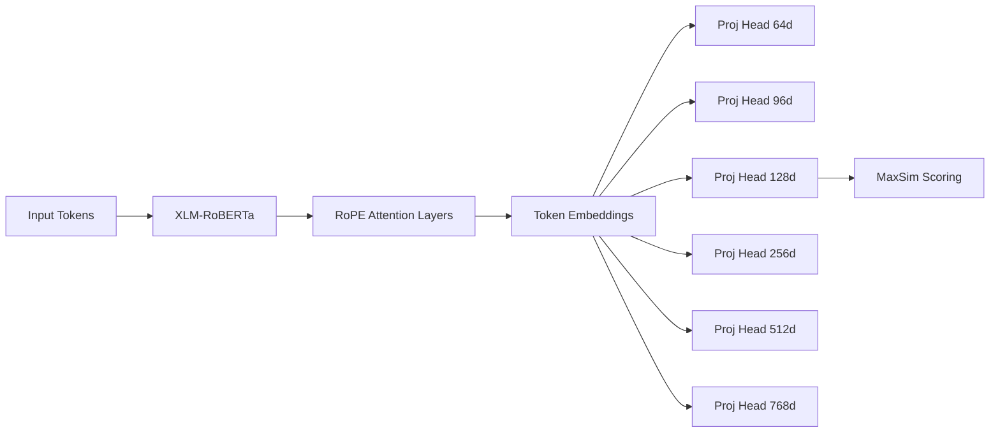
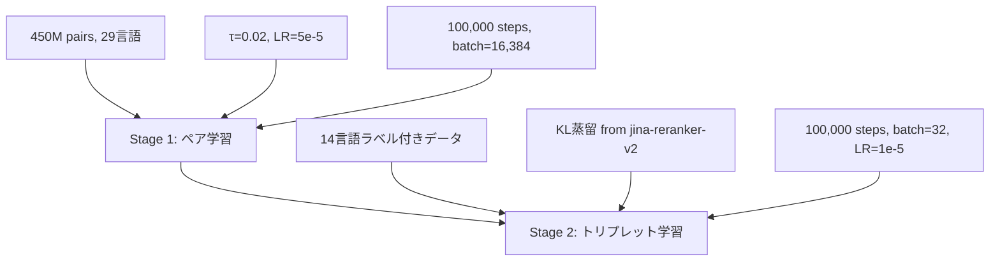

本記事は [Jina-ColBERT-v2: A General-Purpose Multilingual Late Interaction Retriever](https://arxiv.org/abs/2408.16672) の解説記事です。

## 論文概要（Abstract）

Jina-ColBERT-v2は、ColBERTのlate interaction検索パラダイムを多言語・長文脈に拡張したリトリーバーモデルである。バックボーンにXLM-RoBERTaを採用し、絶対位置埋め込みをRoPE（Rotary Positional Embeddings）に置き換えることで最大8,192トークンの入力を処理可能にしている。さらに、6つの異なる次元（64, 96, 128, 256, 512, 768）への線形プロジェクションヘッドをMatryoshka Representation Lossで同時学習することで、ストレージコストと検索精度のトレードオフを柔軟に制御できる。著者らは450Mペアの大規模データセットで2段階学習を行い、BEIR（英語）で平均nDCG@10 53.1、MIRACL（18言語）で平均nDCG@10 62.3を報告している。

この記事は [Zenn記事: ColQwen2×vLLMで図表込み社内マニュアル検索を構築する](https://zenn.dev/0h_n0/articles/6e33a242d347f9) の深掘りです。Zenn記事ではColQwen2とvLLMを用いた視覚文書検索を扱っていますが、本記事ではその基盤技術であるlate interactionの代表モデルJina-ColBERT-v2について、アーキテクチャ設計、学習パイプライン、ベンチマーク結果を詳細に解説します。

## 情報源

- **arXiv ID**: 2408.16672
- **URL**: [https://arxiv.org/abs/2408.16672](https://arxiv.org/abs/2408.16672)
- **著者**: Rohan Jha, Bo Wang, Michael Gunther, et al. (Jina AI)
- **提出日**: 2024年8月29日
- **会場**: EMNLP 2024 Workshop
- **分野**: cs.IR, cs.CL

## 背景と動機（Background & Motivation）

テキスト検索におけるニューラルモデルは、大きく3つのパラダイムに分類できる。第一に、クエリと文書を独立にエンコードし単一ベクトルの内積で類似度を計算するbi-encoder（dense retriever）。第二に、クエリと文書を結合してTransformerに入力し直接関連度を出力するcross-encoder。第三に、両者の中間に位置するlate interactionである。

Late interactionはColBERT（Khattab & Zaharia, 2020）で提案されたパラダイムで、クエリとドキュメントをそれぞれ独立にトークンレベルでエンコードし、MaxSim演算で関連度を計算する。Bi-encoderの高速性とcross-encoderの高精度を兼ね備えるが、オリジナルのColBERTv2にはいくつかの制約があった。

第一に、英語単一言語への対応に限定されていた。第二に、BERTベースの512トークン上限により長文書への対応が困難であった。第三に、埋め込み次元が128に固定されており、ストレージコストの柔軟な制御ができなかった。Jina-ColBERT-v2はこれら3つの制約を同時に解決することを目指している。

## 主要な貢献（Key Contributions）

- **多言語バックボーン**: XLM-RoBERTaをベースにRoPEと継続事前学習を組み合わせたJina-XLM-RoBERTaにより、29言語+コードをサポート
- **長文脈対応**: RoPEへの置き換えにより、ColBERTの512トークン上限を8,192トークンに拡張
- **Matryoshka次元選択**: 6つの非重み共有プロジェクションヘッドによるMatryoshka Representation Lossで、64〜768次元を柔軟に選択可能
- **Query Augmentation Attention**: MASKトークンへの注意機構により、BEIR +3%、MIRACL一部言語で+11%の改善を報告
- **大規模2段階学習**: 450Mペアによるペア学習+リランカー蒸留によるトリプレット学習で、BEIR 53.1、MIRACL 62.3を達成

## 技術的詳細（Technical Details）

### アーキテクチャ

Jina-ColBERT-v2のアーキテクチャは、バックボーンエンコーダ、RoPE位置埋め込み、および6つの線形プロジェクションヘッドから構成される。



バックボーンはXLM-RoBERTa-large（約560Mパラメータ）をベースに、以下の2点を改変している。

**第一に、絶対位置埋め込みのRoPEへの置き換え**。XLM-RoBERTaは学習時512トークンの絶対位置埋め込みを使用しているが、これを除去しRoPEに置き換えている。これにより位置情報が相対的に表現され、学習時のシーケンス長を超えた外挿が可能となる。

**第二に、Flash Attentionの導入**。長文脈を効率的に処理するため、標準のself-attention計算をFlash Attention（Dao et al., 2022）に置き換えている。これにより8,192トークンの入力でもメモリ使用量が$O(N)$に抑えられる。

### RoPE導入の詳細

RoPE（Rotary Positional Embeddings, Su et al., 2024）は、位置$m$のトークンの$d$次元埋め込み$\mathbf{x}$に対し、以下の回転行列を適用する。

$$
\text{RoPE}(\mathbf{x}, m) = \begin{pmatrix} x_1 \cos m\theta_1 - x_2 \sin m\theta_1 \\ x_1 \sin m\theta_1 + x_2 \cos m\theta_1 \\ x_3 \cos m\theta_2 - x_4 \sin m\theta_2 \\ x_3 \sin m\theta_2 + x_4 \cos m\theta_2 \\ \vdots \end{pmatrix}
$$

ここで、
- $\mathbf{x} = (x_1, x_2, \ldots, x_d)$: トークン埋め込みベクトル
- $m$: トークンの位置インデックス
- $\theta_i = 10000^{-2i/d}$: 周波数パラメータ（$i = 1, 2, \ldots, d/2$）

RoPEの重要な性質は、2つの位置$m$, $n$のトークン間の内積が相対位置$m-n$のみに依存する点である。

$$
\langle \text{RoPE}(\mathbf{q}, m), \text{RoPE}(\mathbf{k}, n) \rangle = f(\mathbf{q}, \mathbf{k}, m - n)
$$

これにより、学習時の最大系列長512を超えた位置（例: 8,192トークン目）でも、相対位置関係が保たれたまま注意計算が可能となる。著者らはRefinedWebデータセットで160,000ステップの継続事前学習を行い、RoPEに適応したJina-XLM-RoBERTaを構築している。

### Matryoshka Representation Loss（MRL）

Matryoshka Representation Learning（Kusupati et al., 2022）は、単一モデルから複数の次元の埋め込みを同時に学習する手法である。Jina-ColBERT-v2では、バックボーンの出力（768次元）に対して6つの独立した線形プロジェクションヘッドを適用する。

$$
\mathbf{e}_d = W_d \mathbf{h} + \mathbf{b}_d, \quad d \in \{64, 96, 128, 256, 512, 768\}
$$

ここで、
- $\mathbf{h} \in \mathbb{R}^{768}$: バックボーン最終層の出力
- $W_d \in \mathbb{R}^{d \times 768}$: 次元$d$に対応するプロジェクション行列
- $\mathbf{b}_d \in \mathbb{R}^{d}$: バイアスベクトル
- $\mathbf{e}_d \in \mathbb{R}^{d}$: 次元$d$の埋め込みベクトル

元来のMatryoshka表現学習では、768次元ベクトルの先頭$d$次元を切り出す（重み共有型）。Jina-ColBERT-v2では各次元に独立した線形層を使用する非重み共有型を採用している。著者らはこの非重み共有型により、低次元（特に64次元）での精度劣化が抑制されると報告している。

学習時のMatryoshka損失は以下のように定義される。

$$
\mathcal{L}_{\text{MRL}} = \sum_{d \in \mathcal{D}} \alpha_d \cdot \mathcal{L}_{\text{ColBERT}}(\mathbf{e}_d^{(q)}, \mathbf{e}_d^{(p)}, \mathbf{e}_d^{(n)})
$$

ここで、
- $\mathcal{D} = \{64, 96, 128, 256, 512, 768\}$: 次元の集合
- $\alpha_d$: 各次元の損失重み（論文では均等重み）
- $\mathcal{L}_{\text{ColBERT}}$: ColBERTの対照損失
- $\mathbf{e}_d^{(q)}, \mathbf{e}_d^{(p)}, \mathbf{e}_d^{(n)}$: クエリ、正例、負例の埋め込み

### 2段階学習パイプライン

学習は2つのステージに分かれている。



**Stage 1: 大規模ペア学習**

450Mのテキストペアを使用し、言語分布は50%英語、29言語にまたがる多言語データ、3%コード、4.3%クロスリンガルペアで構成される。温度パラメータ$\tau = 0.02$のInfoNCE損失で学習する。

$$
\mathcal{L}_{\text{InfoNCE}} = -\log \frac{\exp(\text{MaxSim}(q, p^+) / \tau)}{\sum_{j=1}^{B} \exp(\text{MaxSim}(q, p_j) / \tau)}
$$

ここで、
- $q$: クエリ
- $p^+$: 正例文書
- $B = 16{,}384$: バッチサイズ（in-batch negatives）
- $\tau = 0.02$: 温度パラメータ

100,000ステップ、学習率$5 \times 10^{-5}$で学習する。バッチサイズ16,384は極めて大きく、in-batch negativesの数が多いほど対照学習の性能が向上することが知られている。

**Stage 2: 蒸留付きトリプレット学習**

14言語のラベル付きデータおよび機械翻訳データを使用し、jina-reranker-v2-base-multilingualのスコア分布からKL divergenceで蒸留する。

$$
\mathcal{L}_{\text{Stage2}} = \mathcal{L}_{\text{triplet}} + \lambda \cdot D_{\text{KL}}(p_{\text{reranker}} \| p_{\text{model}})
$$

バッチサイズ32、学習率$1 \times 10^{-5}$、コサイン減衰スケジューラ、5%ウォームアップで100,000ステップ学習する。リランカーからの蒸留により、cross-encoderの判断能力をlate interactionモデルに転移させる。

### MaxSim + Query Augmentation

ColBERTのMaxSim（Maximum Similarity）演算は、クエリの各トークン埋め込みとドキュメントの全トークン埋め込みの最大コサイン類似度を合計する。

$$
\text{MaxSim}(q, d) = \sum_{i=1}^{|q|} \max_{j=1}^{|d|} \cos(\mathbf{e}_i^{(q)}, \mathbf{e}_j^{(d)})
$$

ここで、
- $|q|$: クエリのトークン数
- $|d|$: ドキュメントのトークン数
- $\mathbf{e}_i^{(q)}$: クエリの$i$番目のトークン埋め込み
- $\mathbf{e}_j^{(d)}$: ドキュメントの$j$番目のトークン埋め込み

**Query Augmentation Attention**はColBERT固有の手法で、クエリに`[MASK]`トークンを付加し、Transformerの自己注意機構を通じてクエリの意味を拡張する。著者らのablation実験によると、MASKトークンへの注意を有効にすることで、BEIR全体で+3%、MIRACLのArabicで+11.3%、Spanishで+9.5%の改善が報告されている。

一方、著者らはタスク指示（task instruction）の付加も実験しているが、late interactionでは概ね負の効果であったと報告している。これはbi-encoderと異なり、late interactionではトークンレベルの細粒度マッチングが行われるため、指示トークンがマッチングノイズとなる可能性がある。

## 実装のポイント（Implementation）

Jina-ColBERT-v2をプロダクションで利用する際の実装上の注意点を以下に示す。

```python
import torch
import torch.nn as nn
from transformers import AutoModel, AutoTokenizer


class JinaColBERTv2Encoder(nn.Module):
    """Jina-ColBERT-v2のエンコーダ実装

    バックボーンの出力に対して指定次元のプロジェクションを適用し、
    L2正規化されたトークン埋め込みを返す。

    Args:
        model_name: HuggingFaceモデル名
        projection_dim: プロジェクション次元 (64, 96, 128, 256, 512, 768)
    """

    VALID_DIMS: set[int] = {64, 96, 128, 256, 512, 768}

    def __init__(
        self,
        model_name: str = "jinaai/jina-colbert-v2",
        projection_dim: int = 128,
    ) -> None:
        super().__init__()
        if projection_dim not in self.VALID_DIMS:
            raise ValueError(
                f"projection_dim must be one of {self.VALID_DIMS}, "
                f"got {projection_dim}"
            )
        self.backbone = AutoModel.from_pretrained(model_name, trust_remote_code=True)
        self.tokenizer = AutoTokenizer.from_pretrained(model_name, trust_remote_code=True)
        self.projection = nn.Linear(768, projection_dim)
        self.projection_dim = projection_dim

    def encode(
        self,
        texts: list[str],
        max_length: int = 8192,
        is_query: bool = False,
    ) -> torch.Tensor:
        """テキストをトークンレベル埋め込みにエンコードする

        Args:
            texts: 入力テキストのリスト
            max_length: 最大トークン数
            is_query: Trueの場合クエリとしてMASKトークンを付加

        Returns:
            L2正規化されたトークン埋め込み (batch, seq_len, projection_dim)
        """
        encoded = self.tokenizer(
            texts,
            padding=True,
            truncation=True,
            max_length=max_length,
            return_tensors="pt",
        )
        outputs = self.backbone(**encoded)
        token_embeds = outputs.last_hidden_state  # (batch, seq_len, 768)
        projected = self.projection(token_embeds)  # (batch, seq_len, projection_dim)
        normalized = torch.nn.functional.normalize(projected, p=2, dim=-1)
        return normalized


def maxsim_score(
    query_embeds: torch.Tensor,
    doc_embeds: torch.Tensor,
) -> torch.Tensor:
    """MaxSim演算によるクエリ-ドキュメント関連度スコア

    Args:
        query_embeds: クエリ埋め込み (num_queries, q_len, dim)
        doc_embeds: ドキュメント埋め込み (num_docs, d_len, dim)

    Returns:
        関連度スコア (num_queries, num_docs)
    """
    # (num_queries, 1, q_len, dim) x (1, num_docs, d_len, dim)
    # -> (num_queries, num_docs, q_len, d_len)
    sim_matrix = torch.einsum(
        "iqd,jkd->ijqk",
        query_embeds,
        doc_embeds,
    )
    # 各クエリトークンに対するドキュメント側の最大類似度を合計
    max_sim = sim_matrix.max(dim=-1).values  # (num_queries, num_docs, q_len)
    scores = max_sim.sum(dim=-1)  # (num_queries, num_docs)
    return scores
```

**次元選択のガイドライン**: 著者らのablation結果によれば、128次元から64次元への削減ではnDCG@10が1.59%劣化する。一方、ストレージは50%削減される。大規模コレクション（数千万件以上）ではストレージコストが支配的になるため、64次元を選択する合理性がある。中規模コレクション（数百万件以下）では128次元がバランスの良い選択肢となる。

**バッチ処理の最適化**: MaxSim演算はクエリトークン数$\times$ドキュメントトークン数のコサイン類似度行列を生成するため、メモリ使用量が大きい。本番環境ではドキュメント側の埋め込みを事前計算・インデックス化し、クエリ時にはMaxSim演算のみを実行する構成が推奨される。

## Production Deployment Guide

本セクションでは、Jina-ColBERT-v2ベースのlate interaction検索システムをAWS上にデプロイするためのインフラ構成を示す。コスト試算は2026年8月時点のap-northeast-1（東京）リージョン料金に基づく概算であり、実際のコストはトラフィックパターンやバースト使用量により変動する。

### AWS実装パターン（コスト最適化重視）

| 構成 | トラフィック | サービス | 月額概算 |
|------|------------|---------|---------|
| Small | ~100 req/日 | Lambda + S3 + OpenSearch Serverless | $80-180 |
| Medium | ~1,000 req/日 | ECS Fargate + OpenSearch Provisioned | $500-1,000 |
| Large | 10,000+ req/日 | EKS + Spot + OpenSearch Multi-AZ + GPU推論 | $3,000-6,000 |

**Small構成の内訳**: Lambda $5（推論呼び出し）+ S3 $10（埋め込みストレージ）+ OpenSearch Serverless $60-100（インデックス検索）+ SageMaker Serverless $20-60（モデル推論）

**Medium構成のポイント**: ECS Fargate上でjina-colbert-v2モデルをホストし、OpenSearch Provisionedにトークン埋め込みを格納する。GPU推論が必要な場合はSageMaker Endpointを併用する。

**コスト削減テクニック**: Matryoshka 64次元を選択することで128次元比50%のストレージ削減、SageMaker Serverless Inferenceで低トラフィック時のGPUアイドルコスト回避、OpenSearch Reserved Instancesで最大30%削減。

### Terraformインフラコード

**Small構成（Serverless）** -- Lambda + S3 + OpenSearch Serverless:

```hcl
# Jina-ColBERT-v2 Small構成: Serverless, NAT Gateway不使用
provider "aws" { region = "ap-northeast-1" }

# S3（トークン埋め込みストレージ, 64次元 x ドキュメント数）
resource "aws_s3_bucket" "embeddings" {
  bucket = "colbert-embeddings-prod"
}

resource "aws_s3_bucket_server_side_encryption_configuration" "embeddings" {
  bucket = aws_s3_bucket.embeddings.id
  rule {
    apply_server_side_encryption_by_default {
      sse_algorithm = "aws:kms"
    }
  }
}

# Lambda（クエリエンコード + MaxSim）
resource "aws_lambda_function" "colbert_query" {
  function_name = "colbert-query"
  runtime       = "python3.12"
  handler       = "handler.lambda_handler"
  role          = aws_iam_role.lambda_colbert.arn
  timeout       = 60
  memory_size   = 1024  # モデルロード + MaxSim計算
  filename      = "lambda.zip"
  environment {
    variables = {
      OPENSEARCH_ENDPOINT = aws_opensearchserverless_collection.colbert.collection_endpoint
      PROJECTION_DIM      = "128"
      MAX_QUERY_TOKENS    = "32"
    }
  }
}

# IAMロール（最小権限）
resource "aws_iam_role" "lambda_colbert" {
  name = "colbert-lambda-role"
  assume_role_policy = jsonencode({
    Version = "2012-10-17"
    Statement = [{
      Action = "sts:AssumeRole"
      Effect = "Allow"
      Principal = { Service = "lambda.amazonaws.com" }
    }]
  })
}

resource "aws_iam_role_policy" "lambda_colbert" {
  name = "colbert-lambda-policy"
  role = aws_iam_role.lambda_colbert.id
  policy = jsonencode({
    Version = "2012-10-17"
    Statement = [
      {
        Effect   = "Allow"
        Action   = ["s3:GetObject"]
        Resource = "${aws_s3_bucket.embeddings.arn}/*"
      },
      {
        Effect   = "Allow"
        Action   = ["aoss:APIAccessAll"]
        Resource = aws_opensearchserverless_collection.colbert.arn
      },
      {
        Effect   = "Allow"
        Action   = ["logs:CreateLogGroup", "logs:CreateLogStream", "logs:PutLogEvents"]
        Resource = "arn:aws:logs:*:*:*"
      }
    ]
  })
}

# OpenSearch Serverless（トークン埋め込みインデックス）
resource "aws_opensearchserverless_collection" "colbert" {
  name = "colbert-tokens"
  type = "VECTORSEARCH"
}

# CloudWatch アラーム（コスト監視）
resource "aws_cloudwatch_metric_alarm" "lambda_duration" {
  alarm_name          = "colbert-query-duration-high"
  comparison_operator = "GreaterThanThreshold"
  evaluation_periods  = 3
  metric_name         = "Duration"
  namespace           = "AWS/Lambda"
  period              = 300
  statistic           = "p95"
  threshold           = 10000
  alarm_actions       = [aws_sns_topic.colbert_alerts.arn]
  dimensions = {
    FunctionName = aws_lambda_function.colbert_query.function_name
  }
}

resource "aws_sns_topic" "colbert_alerts" {
  name = "colbert-alerts"
}
```

**Large構成（Container）** -- EKS + Karpenter + GPU Spot:

```hcl
module "eks" {
  source          = "terraform-aws-modules/eks/aws"
  version         = "~> 20.24"
  cluster_name    = "colbert-production"
  cluster_version = "1.31"
  vpc_id          = aws_vpc.colbert.id
  subnet_ids      = aws_subnet.private[*].id
  cluster_endpoint_public_access = false
}

# Karpenter: GPU Spot優先で推論コスト最大90%削減
resource "kubectl_manifest" "karpenter_nodepool" {
  yaml_body = yamlencode({
    apiVersion = "karpenter.sh/v1"
    kind       = "NodePool"
    metadata   = { name = "colbert-gpu-spot" }
    spec = {
      template.spec.requirements = [
        { key = "karpenter.sh/capacity-type", operator = "In", values = ["spot", "on-demand"] },
        { key = "node.kubernetes.io/instance-type", operator = "In",
          values = ["g5.xlarge", "g5.2xlarge", "g6.xlarge"] }
      ]
      limits     = { cpu = "128", memory = "512Gi", "nvidia.com/gpu" = "8" }
      disruption = { consolidationPolicy = "WhenEmptyOrUnderutilized" }
    }
  })
}

# OpenSearch（Multi-AZ, トークン埋め込みストレージ）
resource "aws_opensearch_domain" "colbert" {
  domain_name    = "colbert-tokens"
  engine_version = "OpenSearch_2.13"
  cluster_config {
    instance_type          = "r6g.xlarge.search"
    instance_count         = 3
    zone_awareness_enabled = true
  }
  ebs_options {
    ebs_enabled = true
    volume_size = 500  # 128次元 x 1億トークン想定
    volume_type = "gp3"
  }
  encrypt_at_rest { enabled = true }
  node_to_node_encryption { enabled = true }
}

resource "aws_budgets_budget" "colbert" {
  name         = "colbert-monthly"
  budget_type  = "COST"
  limit_amount = "6000"
  limit_unit   = "USD"
  time_unit    = "MONTHLY"
  notification {
    comparison_operator = "GREATER_THAN"
    threshold           = 80
    threshold_type      = "PERCENTAGE"
    notification_type   = "ACTUAL"
  }
}
```

### 運用・監視設定

**CloudWatch Logs Insights（MaxSimレイテンシ分析）**:

```
fields @timestamp, @message | filter @message like /maxsim_score/
| stats count() as qps, avg(latency_ms) as avg, pct(latency_ms, 95) as p95, pct(latency_ms, 99) as p99 by bin(1h)
```

**監視・コストレポート設定（Python）**:

```python
import boto3
from datetime import date, timedelta


def create_colbert_alarms() -> None:
    """Jina-ColBERT-v2のMaxSimレイテンシ+OpenSearch監視アラームを作成する"""
    cw = boto3.client("cloudwatch", region_name="ap-northeast-1")
    cw.put_metric_alarm(
        AlarmName="colbert-maxsim-p95-latency",
        MetricName="MaxSimLatency",
        Namespace="ColBERT/Production",
        Statistic="p95",
        Period=300,
        EvaluationPeriods=3,
        Threshold=500.0,
        ComparisonOperator="GreaterThanThreshold",
        AlarmActions=["arn:aws:sns:ap-northeast-1:ACCOUNT:colbert-alerts"],
    )
    cw.put_metric_alarm(
        AlarmName="colbert-opensearch-cpu",
        MetricName="CPUUtilization",
        Namespace="AWS/ES",
        Statistic="Average",
        Period=300,
        EvaluationPeriods=3,
        Threshold=80.0,
        ComparisonOperator="GreaterThanThreshold",
        Dimensions=[{"Name": "DomainName", "Value": "colbert-tokens"}],
        AlarmActions=["arn:aws:sns:ap-northeast-1:ACCOUNT:colbert-alerts"],
    )


def daily_cost_report() -> dict:
    """日次コストレポート取得、$100/日超過でSNS通知"""
    ce = boto3.client("ce", region_name="ap-northeast-1")
    today = date.today()
    resp = ce.get_cost_and_usage(
        TimePeriod={"Start": str(today - timedelta(days=1)), "End": str(today)},
        Granularity="DAILY",
        Metrics=["UnblendedCost"],
        Filter={"Tags": {"Key": "Project", "Values": ["colbert"]}},
    )
    cost = float(resp["ResultsByTime"][0]["Total"]["UnblendedCost"]["Amount"])
    if cost > 100.0:
        boto3.client("sns").publish(
            TopicArn="arn:aws:sns:ap-northeast-1:ACCOUNT:colbert-alerts",
            Message=f"ColBERT daily cost: ${cost:.2f} exceeds $100",
        )
    return {"date": str(today - timedelta(days=1)), "cost_usd": cost}
```

### コスト最適化チェックリスト

**アーキテクチャ選択**:
- [ ] トラフィック量でServerless/Hybrid/Container構成を判断
- [ ] Matryoshka次元選択でストレージコストを最適化（64d vs 128d）
- [ ] クエリエンコードとMaxSim演算の分離配置を検討

**リソース最適化**:
- [ ] EC2/EKS: GPU Spot Instances優先（g5/g6, 最大90%削減）
- [ ] OpenSearch: Reserved Instances 1年コミット（最大30%削減）
- [ ] SageMaker: Serverless Inferenceで低トラフィック時コスト回避
- [ ] Lambda: メモリサイズ1024MBに最適化（Power Tuning実施）
- [ ] EKS: Karpenterで未使用GPUノード自動回収

**検索コスト削減**:
- [ ] Matryoshka 64次元でストレージ50%削減（128d比）
- [ ] ドキュメント埋め込みの事前計算・バッチインデクシング
- [ ] OpenSearch k-NNプラグインでANN近似検索（MaxSim前フィルタ）
- [ ] クエリトークン数制限（32トークン上限）

**監視・アラート**:
- [ ] AWS Budgets: 月次予算アラート（80%/100%閾値）
- [ ] CloudWatch: MaxSimレイテンシP95アラーム
- [ ] Cost Anomaly Detection: 日次異常検知有効化
- [ ] 日次コストレポート: SNS通知による自動配信

**リソース管理**:
- [ ] 未使用OpenSearchドメイン削除
- [ ] Projectタグ戦略（全リソースにcolbertタグ付与）
- [ ] S3ライフサイクルポリシー: 旧バージョン埋め込み30日後削除
- [ ] 開発環境の夜間停止（SageMaker Endpoint / EKSノード）

## 実験結果（Results）

### BEIR（英語検索ベンチマーク）

著者らはBEIR（Benchmarking IR）ベンチマーク上でColBERTv2を含む既存モデルと比較評価を行っている。

| モデル | 平均 nDCG@10 | NQ | HotpotQA | Quora |
|--------|-------------|-----|----------|-------|
| ColBERTv2 | 49.6 | - | - | - |
| **Jina-ColBERT-v2** | **53.1** | 64.0 | 76.6 | 88.7 |
| answerai-v1 | 55.7 | - | - | - |

Jina-ColBERT-v2はColBERTv2に対して+3.5ptの改善を達成しているが、answerai-v1には2.6pt及ばない。ただし、answerai-v1は英語特化モデルであるのに対し、Jina-ColBERT-v2は29言語をサポートする多言語モデルであり、英語性能とのトレードオフが存在する。

### LoTTE（ロングテールクエリ）

LoTTE（Long-Tail Topic-stratified Evaluation）では、ニッチなドメインの検索精度を評価する。

| モデル | Success@5 |
|--------|----------|
| ColBERTv2 | 72.0 |
| **Jina-ColBERT-v2** | **76.4** |

ロングテールクエリにおいて+4.4ptの改善は、トークンレベルのマッチングがニッチな用語の検索に有効であることを示唆している。

### MIRACL（多言語検索ベンチマーク）

MIRACL（Multilingual Information Retrieval Across a Continuum of Languages）は18言語での検索精度を評価するベンチマークである。著者らは平均nDCG@10 62.3を報告している。

| 言語 | nDCG@10 |
|------|---------|
| Bengali | 75.0 |
| Finnish | 74.0 |
| Telugu | 74.2 |
| 18言語平均 | 62.3 |

Bengali, Finnish, Teluguなど低リソース言語でも70以上のnDCG@10を達成している点は注目に値する。

### mMARCO（多言語パッセージランキング）

mMARCO（multilingual MS MARCO）は13言語でのパッセージランキング精度を評価する。

| モデル | MRR@10 |
|--------|--------|
| ColBERT-XM | 25.4 |
| **Jina-ColBERT-v2** | **31.3** |

ColBERT-XMに対して+5.9ptの大幅な改善を示している。

### Ablation実験

著者らはいくつかのablation実験を行い、各設計判断の影響を分析している。

**Query Augmentation Attention**: MASKトークンへの注意を有効にした場合、BEIRで+3%、MIRACLのArabicで+11.3%、Spanishで+9.5%の改善が報告されている。この効果は言語やドメインにより異なり、非英語言語で特に大きい。

**タスク指示**: bi-encoderでは有効とされるタスク指示の付加は、late interactionでは概ね負の効果であったと報告されている。著者らはこの原因として、指示トークンがMaxSimのマッチングにノイズを加えることを指摘している。

**スコア正規化**: クエリ長で正規化するかどうかの実験では、一貫性のない結果が報告されている。

**次元削減の影響**: 128次元から64次元への削減でnDCG@10が1.59%劣化する一方、ストレージは50%削減される。この劣化は多くの実用シナリオで許容可能な水準であると考えられる。

## 実運用への応用（Practical Applications）

Jina-ColBERT-v2のlate interactionパラダイムは、Zenn記事で扱っているColQwen2・ColPaliの基盤技術である。ColQwen2はJina-ColBERT-v2と同じlate interaction + MaxSim演算を視覚文書（画像を含むPDF等）に拡張したモデルであり、テキスト検索にJina-ColBERT-v2、視覚文書検索にColQwen2を併用するハイブリッド構成が考えられる。

**社内マニュアル検索への適用**: テキスト部分のマニュアルにはJina-ColBERT-v2の128次元埋め込みを使用し、図表を含むページにはColQwen2を適用する。MaxSim演算は共通であるため、Qdrant等のベクトルDBで統一的に管理できる。

**ストレージとレイテンシのトレードオフ**: 数十万ページ規模の社内マニュアルでは、64次元のMatryoshka埋め込みを選択することでストレージコストを半減できる。トークンレベルの埋め込みはbi-encoderの文書レベル埋め込みより数十倍大きいため、次元選択の影響は無視できない。

**制約**: Jina-ColBERT-v2はテキストのみ対応であり、図表・画像を含む文書検索にはColPaliやColQwen2が必要である。Zenn記事で構築しているvLLM + ColQwen2パイプラインは、この制約を視覚モデルで補完する構成といえる。

## 関連研究（Related Work）

- **ColBERTv2** (Santhanam et al., 2022): Jina-ColBERT-v2の直接の先行研究。BERTベースの英語単一言語モデルで、残差圧縮によるストレージ最適化を導入。Jina-ColBERT-v2はバックボーンの多言語化、RoPEによる長文脈対応、Matryoshkaによる柔軟な次元選択でこれを拡張している
- **ColPali** (Faysse et al., 2024): PaliGemmaをバックボーンに用い、late interactionを視覚文書検索に拡張したモデル。テキストのみのJina-ColBERT-v2と異なり、画像を含むPDFページを直接エンコードできる。Zenn記事で扱うColQwen2はColPaliをQwen2-VLで再実装したもの
- **ColBERT-XM** (Nair et al., 2023): XLM-RoBERTaベースの多言語ColBERTモデル。Jina-ColBERT-v2とバックボーンは共通だが、RoPE導入やMatryoshka MRL、大規模2段階学習パイプラインが異なり、mMARCOで+5.9ptの改善が報告されている

## まとめと今後の展望

Jina-ColBERT-v2は、ColBERTのlate interactionパラダイムを多言語・長文脈・柔軟な次元選択に拡張したリトリーバーモデルである。XLM-RoBERTa + RoPEバックボーン、6つのMatryoshkaプロジェクションヘッド、450Mペアの2段階学習により、BEIR 53.1、MIRACL 62.3、mMARCO 31.3を達成している。

テキスト検索における実用面では、Matryoshka次元選択によるストレージ最適化と、Query Augmentation Attentionによる多言語検索精度の向上が即座に活用できる。一方、視覚文書への非対応はColPali/ColQwen2との併用で補完される。Late interactionの計算コスト（トークンレベルの埋め込みストレージとMaxSim演算）は、Matryoshka低次元化とANN近似検索で緩和可能である。

## 参考文献

- **arXiv**: [https://arxiv.org/abs/2408.16672](https://arxiv.org/abs/2408.16672)
- **EMNLP 2024 Workshop**: Jina-ColBERT-v2: A General-Purpose Multilingual Late Interaction Retriever
- **Model**: [https://huggingface.co/jinaai/jina-colbert-v2](https://huggingface.co/jinaai/jina-colbert-v2)
- **ColBERTv2**: [https://arxiv.org/abs/2112.01488](https://arxiv.org/abs/2112.01488)
- **ColPali**: [https://arxiv.org/abs/2407.01449](https://arxiv.org/abs/2407.01449)
- **Related Zenn article**: [https://zenn.dev/0h_n0/articles/6e33a242d347f9](https://zenn.dev/0h_n0/articles/6e33a242d347f9)
