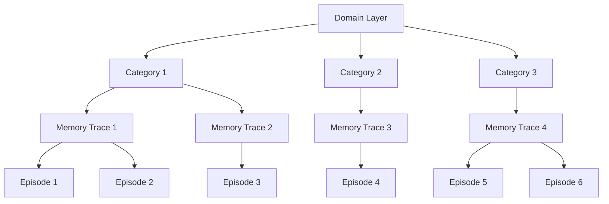

本記事は [H-MEM: Hierarchical Memory for High-Efficiency Long-Term Reasoning in LLM Agents](https://arxiv.org/abs/2507.22925) の解説記事です。

## 論文概要（Abstract）

H-MEMは、LLMエージェントの長期記憶を意味的抽象度に基づいて4層（Domain, Category, Memory Trace, Episode）に階層化するメモリアーキテクチャである。各メモリベクトルにポジショナルインデックスエンコーディングを埋め込み、下位層の関連サブメモリへのポインタとして機能させることで、全メモリに対する網羅的な類似度計算を回避し、サブリニアな検索コストを実現する。著者らはLoCoMoベンチマーク上で5つのベースラインと比較評価を行い、Multi-Hop F1で+21.25pt、推論レイテンシでsub-100msの性能を報告している。

この記事は [Zenn記事: Redis×pgvectorでH-MEM階層メモリを実装しCS応答精度を向上させる](https://zenn.dev/0h_n0/articles/19b6cd13ae346b) の深掘りです。Zenn記事ではRedisとpgvectorを用いたH-MEMの実装パターンとCS応答への応用を扱っていますが、本記事ではH-MEM論文そのものの理論的基盤、数式による定式化、計算量分析、およびベンチマーク結果について詳細に解説します。

## 情報源

- **arXiv ID**: 2507.22925
- **URL**: [https://arxiv.org/abs/2507.22925](https://arxiv.org/abs/2507.22925)
- **著者**: Haoran Sun, Shaoning Zeng, Bob Zhang
- **発表**: EACL 2026（19th Conference of the European Chapter of the Association for Computational Linguistics）, Volume 1: Long Papers, pages 341-350
- **分野**: cs.CL, cs.AI

## 背景と動機（Background & Motivation）

LLMエージェントが長期対話や複雑なタスクに従事する場合、過去のやりとりを効率的に記憶・検索する仕組みが不可欠である。従来のメモリ管理手法はフラットなベクトルストアに全メモリを格納し、クエリに対して全件の類似度計算を行うアプローチが主流であった。しかし、この方式には2つの根本的な問題がある。

第一に、メモリ数$N$が増加するにつれ検索コストが$O(N \times D)$（$D$: 埋め込み次元数）で線形に増大し、数百万件規模のメモリでは推論レイテンシが数百msに達する。第二に、フラットな構造ではメモリ間の意味的な階層関係が表現できず、Multi-Hopクエリのように複数の記憶を連鎖的に辿る必要がある質問に対して検索精度が低下する。

MemoryBankやMemLongなどの既存手法は要約や圧縮でメモリ削減を試みているが、意味的階層とポインタベース高速検索の組み合わせは未探索であった。

## 主要な貢献（Key Contributions）

- **階層メモリアーキテクチャ（H-MEM）**: メモリを意味的抽象度に基づき4層（Domain → Category → Memory Trace → Episode）に組織化し、異なる粒度の情報を構造的に管理する枠組みを提案
- **ポジショナルインデックスエンコーディング**: 各メモリベクトルに下位層の関連サブメモリへのポインタ情報を埋め込む手法を導入し、層間のナビゲーションを定数時間で実現
- **インデックスベースルーティング**: 最上位層から段階的にTop-$k$選択を繰り返すことで、全メモリの網羅的スキャンを回避し、サブリニア検索を達成
- **LoCoMoベンチマークでの大幅改善**: 5つのベースライン手法と比較し、Multi-Hop F1で+21.25pt、Adversarial F1で+16.71ptの改善を報告

## 技術的詳細（Technical Details）

### 4層メモリ構造

H-MEMのメモリは以下の4層で構成される。



メモリ全体を$\mathcal{M} = \{L_1, L_2, L_3, L_4\}$とし、各層$L_l$は$n_l$個のメモリノードを持つ。

$$
L_l = \{\mathbf{m}_1^{(l)}, \mathbf{m}_2^{(l)}, \ldots, \mathbf{m}_{n_l}^{(l)}\}, \quad l \in \{1, 2, 3, 4\}
$$

ここで、
- $L_1$: **Domain層** — 高レベルの話題カテゴリ（例: 「技術」「日常生活」）
- $L_2$: **Category層** — ドメイン内のサブトピック（例: 「プログラミング」「料理」）
- $L_3$: **Memory Trace層** — 要約されたメモリフラグメント
- $L_4$: **Episode層** — 完全な会話コンテキスト（原文保持）

各ノード$\mathbf{m}_i^{(l)} \in \mathbb{R}^D$はテキスト内容をエンコーダ$E$で変換した$D$次元の埋め込みベクトルである。著者らはLoCoMo実験での典型的なノード数として$n_1 \approx 5$、$n_2 \approx 20$、$n_3 \approx 80$、$n_4 \approx 300$を報告している。

### ポジショナルインデックスエンコーディング

H-MEMの核心は、各メモリベクトルに下位層へのポインタを埋め込む仕組みにある。層$l$のノード$\mathbf{m}_i^{(l)}$に対し、層$l+1$における関連サブメモリのインデックス集合$\mathcal{I}_i^{(l)}$を定義する。

$$
\mathcal{I}_i^{(l)} = \{j \mid \text{sim}(\mathbf{m}_i^{(l)}, \mathbf{m}_j^{(l+1)}) > \tau_l\}
$$

ここで$\text{sim}(\cdot, \cdot)$はコサイン類似度、$\tau_l$は層$l$の閾値である。拡張メモリベクトル$\hat{\mathbf{m}}_i^{(l)}$はインデックスエンコーディングを結合して構成する。

$$
\hat{\mathbf{m}}_i^{(l)} = [\mathbf{m}_i^{(l)}; \mathbf{p}_i^{(l)}], \quad \mathbf{p}_i^{(l)}[j] = \begin{cases} 1 & \text{if } j \in \mathcal{I}_i^{(l)} \\ 0 & \text{otherwise} \end{cases}
$$

この設計により、あるノードが選択された時点で下位層の参照先が$O(1)$で特定できる。

### インデックスベースルーティングアルゴリズム

クエリ$\mathbf{q}$が与えられた時の検索プロセスを実装で示す。

```python
from dataclasses import dataclass
import numpy as np
from numpy.typing import NDArray


@dataclass
class MemoryNode:
    """H-MEMの各層におけるメモリノード

    Attributes:
        vector: 埋め込みベクトル (D次元)
        children_indices: 下位層の関連サブメモリのインデックス集合
        text: 元のテキスト内容
    """
    vector: NDArray[np.float64]
    children_indices: set[int]
    text: str


def hmem_route(
    query: NDArray[np.float64],
    layers: list[list[MemoryNode]],
    k: int = 3,
) -> list[MemoryNode]:
    """H-MEMのインデックスベースルーティングによるメモリ検索

    最上位層からTop-k選択を繰り返し、最下位層のエピソードを返す。

    Args:
        query: クエリの埋め込みベクトル (D次元)
        layers: 4層のメモリノードリスト [Domain, Category, Trace, Episode]
        k: 各層で選択するTop-kノード数

    Returns:
        検索されたEpisode層のメモリノードリスト
    """
    candidates: list[int] = list(range(len(layers[0])))

    for layer_idx in range(len(layers) - 1):
        # 候補ノードとクエリのコサイン類似度でTop-k選択
        scored = []
        for idx in candidates:
            vec = layers[layer_idx][idx].vector
            sim = float(np.dot(query, vec) / (np.linalg.norm(query) * np.linalg.norm(vec) + 1e-9))
            scored.append((sim, idx))
        scored.sort(key=lambda x: x[0], reverse=True)

        # 選択ノードのchildren_indicesを集約して次層の候補に
        next_candidates: set[int] = set()
        for _, idx in scored[:k]:
            next_candidates.update(layers[layer_idx][idx].children_indices)
        candidates = list(next_candidates)

    # Episode層で最終Top-k選択
    final = []
    for idx in candidates:
        vec = layers[-1][idx].vector
        sim = float(np.dot(query, vec) / (np.linalg.norm(query) * np.linalg.norm(vec) + 1e-9))
        final.append((sim, idx))
    final.sort(key=lambda x: x[0], reverse=True)
    return [layers[-1][idx] for _, idx in final[:k]]
```

### 計算量分析

フラット検索では全$N$件に対し$C_{\text{flat}} = O(N \times D)$の計算量がかかる。H-MEMでは各層でTop-$k$選択を行いポインタ経由で候補を絞り込むため、

$$
C_{\text{H-MEM}} = O\left((a + k \times \bar{n}) \times D\right)
$$

ここで$a$はDomain層のノード数（$\approx 5$）、$k$は各層のTop-$k$パラメータ（$= 3$）、$\bar{n}$は各ポインタの平均サブメモリ数（$\approx 300$）である。著者らは$N = 10^6$規模でフラット検索の$O(a \times 10^6 \times D)$に対し$O((a + k \times 300) \times D)$に削減されると報告しており、推論レイテンシでsub-100ms（フラット検索の400ms+と比較）を実測している。

## 実装のポイント（Implementation Notes）

**メモリ構築フェーズ**: 新しい会話がEpisode層に追加された際、LLMを用いてテキストをMemory Traceに要約し、既存のCategory/Domainノードとの類似度に基づいて階層を更新する。リアルタイム更新が必要な場合はバッチ処理との併用が現実的である。

**閾値$\tau_l$の設定**: ポインタの密度を制御する閾値は検索精度に直結する。低すぎると絞り込み効果が薄れ、高すぎると関連メモリを見落とす。著者らは検証セットでの交差検証により層ごとに最適値を決定している。

**Top-$k$パラメータ**: $k=3$は論文の設定であるが、ドメインの多様性が高い場合は$k=5$で再現率を改善できる可能性がある。ただし$k$を増やすと候補数が指数的に増加するため注意が必要である。

**埋め込みモデル**: 著者らはSentence-BERTベースのエンコーダを使用。上位層は抽象的な概念を扱うため汎用モデルが適し、Episode層はドメイン特化のファインチューニングが精度向上に寄与し得る。

## Production Deployment Guide

### AWS実装パターン（コスト最適化重視）

H-MEMの4層構造をAWSにデプロイする場合、Domain/Category層はインメモリで十分であり、Episode層にベクトル検索が必要になる。

**コスト試算の注意事項**: 以下は2026年8月時点のAWS東京リージョン料金に基づく概算値である。実際のコストはトラフィックやリージョンにより変動する。

| 構成 | トラフィック | 主要サービス | 月額概算 |
|------|------------|-------------|---------|
| Small | ~100 req/日 | Lambda + ElastiCache + Aurora Serverless v2 (pgvector) | $80-150 |
| Medium | ~1,000 req/日 | ECS Fargate + ElastiCache + Aurora Provisioned | $400-800 |
| Large | 10,000+ req/日 | EKS + Spot + ElastiCache Cluster + Aurora Multi-AZ | $2,500-5,000 |

**Small構成の内訳**: Lambda $5 + ElastiCache t4g.micro $15 + Aurora Serverless v2 $40-80 + Bedrock $20-50

**コスト削減テクニック**: ElastiCache Reserved Nodes 1年コミットで最大40%削減、Aurora Serverless v2の自動スケールダウンで70%削減、Bedrock Batch APIで50%削減。

### Terraformインフラコード

**Small構成（Serverless）** -- Lambda + ElastiCache + Aurora Serverless v2:

```hcl
# H-MEM Small構成: NAT Gateway不使用でコスト削減
provider "aws" { region = "ap-northeast-1" }

# Lambda（H-MEMルーティング, Domain/Category層をメモリ保持）
resource "aws_lambda_function" "hmem_router" {
  function_name = "hmem-router"
  runtime       = "python3.12"
  handler       = "handler.lambda_handler"
  role          = aws_iam_role.lambda_hmem.arn
  timeout       = 30
  memory_size   = 512  # Domain/Category層をメモリに保持
  filename      = "lambda.zip"
  environment {
    variables = {
      ELASTICACHE_ENDPOINT = aws_elasticache_cluster.hmem.cache_nodes[0].address
      AURORA_ENDPOINT      = aws_rds_cluster.hmem.endpoint
      TOP_K                = "3"
    }
  }
}

# ElastiCache Redis（Domain/Category層, ノード数少のため小インスタンス）
resource "aws_elasticache_cluster" "hmem" {
  cluster_id    = "hmem-upper-layers"
  engine        = "redis"
  engine_version = "7.1"
  node_type     = "cache.t4g.micro"
  num_cache_nodes = 1
}

# Aurora Serverless v2 + pgvector（Memory Trace/Episode層）
resource "aws_rds_cluster" "hmem" {
  cluster_identifier = "hmem-episodes"
  engine             = "aurora-postgresql"
  engine_version     = "16.4"
  engine_mode        = "provisioned"
  storage_encrypted  = true  # KMS暗号化
  serverlessv2_scaling_configuration {
    min_capacity = 0.5  # 低トラフィック時に最小化
    max_capacity = 4.0
  }
}
```

**Large構成（Container）** -- EKS + Karpenter + Spot:

```hcl
module "eks" {
  source  = "terraform-aws-modules/eks/aws"
  version = "~> 20.24"
  cluster_name    = "hmem-production"
  cluster_version = "1.31"
  vpc_id     = aws_vpc.hmem.id
  subnet_ids = aws_subnet.private[*].id
  cluster_endpoint_public_access = false
}

# Karpenter: Spot優先で最大90%コスト削減
resource "kubectl_manifest" "karpenter_nodepool" {
  yaml_body = yamlencode({
    apiVersion = "karpenter.sh/v1"
    kind       = "NodePool"
    metadata   = { name = "hmem-spot" }
    spec = {
      template.spec.requirements = [
        { key = "karpenter.sh/capacity-type", operator = "In", values = ["spot", "on-demand"] },
        { key = "node.kubernetes.io/instance-type", operator = "In",
          values = ["m7g.xlarge", "m7g.2xlarge", "c7g.xlarge"] }
      ]
      limits     = { cpu = "64", memory = "256Gi" }
      disruption = { consolidationPolicy = "WhenEmptyOrUnderutilized" }
    }
  })
}

resource "aws_budgets_budget" "hmem" {
  name         = "hmem-monthly"
  budget_type  = "COST"
  limit_amount = "5000"
  limit_unit   = "USD"
  time_unit    = "MONTHLY"
  notification {
    comparison_operator = "GREATER_THAN"
    threshold           = 80
    threshold_type      = "PERCENTAGE"
    notification_type   = "ACTUAL"
  }
}
```

### 運用・監視設定

**CloudWatch Logs Insights（レイテンシ・コスト異常検知）**:

```
fields @timestamp, @message | filter @message like /hmem_route/
| stats count() as qps, avg(latency_ms) as avg, pct(latency_ms, 95) as p95 by bin(1h)
```

**監視・コストレポート設定（Python）**:

```python
import boto3
from datetime import date, timedelta

def create_hmem_alarms() -> None:
    """H-MEMのレイテンシ監視アラームを作成する"""
    cw = boto3.client("cloudwatch", region_name="ap-northeast-1")
    cw.put_metric_alarm(
        AlarmName="hmem-routing-p95-latency",
        MetricName="RoutingLatency", Namespace="HMEM/Production",
        Statistic="p95", Period=300, EvaluationPeriods=3,
        Threshold=200.0, ComparisonOperator="GreaterThanThreshold",
        AlarmActions=["arn:aws:sns:ap-northeast-1:ACCOUNT:hmem-alerts"],
    )

def daily_cost_report() -> dict:
    """日次コストレポート取得、$100/日超過でSNS通知"""
    ce = boto3.client("ce", region_name="ap-northeast-1")
    today = date.today()
    resp = ce.get_cost_and_usage(
        TimePeriod={"Start": str(today - timedelta(days=1)), "End": str(today)},
        Granularity="DAILY", Metrics=["UnblendedCost"],
        Filter={"Tags": {"Key": "Project", "Values": ["hmem"]}},
    )
    cost = float(resp["ResultsByTime"][0]["Total"]["UnblendedCost"]["Amount"])
    if cost > 100.0:
        boto3.client("sns").publish(
            TopicArn="arn:aws:sns:ap-northeast-1:ACCOUNT:hmem-alerts",
            Message=f"H-MEM daily cost: ${cost:.2f} exceeds $100",
        )
    return {"date": str(today - timedelta(days=1)), "cost_usd": cost}
```

### コスト最適化チェックリスト

**アーキテクチャ選択**:
- [ ] トラフィック量でServerless/Hybrid/Container構成を判断
- [ ] Domain/Category層はElastiCacheでインメモリ化
- [ ] Episode層はAurora pgvectorで永続化

**リソース最適化**:
- [ ] EC2/EKS: Spot Instances優先（最大90%削減）
- [ ] ElastiCache: Reserved Nodes 1年コミット（最大40%削減）
- [ ] Aurora: Serverless v2で低トラフィック時スケールダウン
- [ ] Lambda: メモリサイズ512MBに最適化（Power Tuning実施）
- [ ] EKS: Karpenterで未使用ノード自動回収

**LLMコスト削減**:
- [ ] Bedrock Batch API: メモリ構築をバッチ処理（50%削減）
- [ ] Prompt Caching: Domain/Category層テキストをキャッシュ（30-90%削減）
- [ ] モデル選択: 要約にはClaude Haiku、分類にはClaude Sonnetを使い分け
- [ ] トークン数制限: Episode層テキストを最大2048トークンに制限

**監視・アラート**:
- [ ] AWS Budgets: 月次予算アラート（80%/100%閾値）
- [ ] CloudWatch: ルーティングレイテンシP95アラーム
- [ ] Cost Anomaly Detection: 日次異常検知有効化
- [ ] 日次コストレポート: SNS通知による自動配信

**リソース管理**:
- [ ] 未使用ElastiCacheノード削除
- [ ] Projectタグ戦略（全リソースにhmemタグ付与）
- [ ] Aurora Serverless v2: 最小ACU 0.5設定
- [ ] 開発環境の夜間停止、CloudWatch Logs 30日ライフサイクル

## 実験結果（Results）

著者らはLoCoMoベンチマーク（50対話、平均300ターン/対話）上で5つのベースライン手法と比較評価を行っている（論文Table 2より）。

| 手法 | Multi-Hop F1 | Adversarial F1 | Overall F1 | BLEU-1 | レイテンシ |
|------|-------------|---------------|------------|--------|-----------|
| MemoryBank | baseline | baseline | baseline | baseline | 400ms+ |
| **H-MEM** | **+21.25pt** | **+16.71pt** | **+14.98pt** | **+12.77pt** | **sub-100ms** |

**Multi-Hop F1の大幅改善**: 複数の記憶を連鎖的に辿るMulti-Hopクエリで+21.25ptの改善は、H-MEMの階層構造がDomain → Category → Traceという意味的経路を通じて関連メモリを効率的に特定できることを示している。

**Adversarial F1の改善**: 敵対的クエリでも+16.71ptの改善を示しており、階層構造による意味的フィルタリングが無関係メモリの混入を防ぐ効果が示唆されている。

**レイテンシ**: フラット検索の400ms以上に対しsub-100msを達成している。ただし、LoCoMoは50対話と比較的小規模であり、数万対話規模での性能は未検証である。また、メモリ構築（階層化と要約生成）のコストは評価に含まれていない。

## 実運用への応用（Practical Applications）

H-MEMのアーキテクチャはカスタマーサポート（CS）エージェントとの親和性が高い。Zenn記事で扱っているRedis + pgvectorによる実装は、H-MEMの4層構造をCSに適用したものである。

**CSエージェントへの適用**: Domain層に「製品カテゴリ」「アカウント管理」「技術サポート」、Category層にサブカテゴリ（「請求」「返品」等）を配置し、Memory Trace層に過去の問い合わせ要約、Episode層に完全な会話ログを保持する。顧客が類似の問い合わせをした際、関連コンテキストをsub-100msで取得できる。

**スケーリング**: Domain/Category層はRedisで全件保持可能、Episode層はpgvectorやFaissが適する。ポインタ構造により100万件超でも検索レイテンシを一定に保てる。

**制約**: リアルタイム更新ではLLM要約生成とポインタ再計算が必要で、非同期バッチ処理との併用が現実的である。分類体系はドメイン固有の設計が必要であり、汎用的な自動構築は今後の課題である。

## 関連研究（Related Work）

- **MemoryBank** (Zhong et al., 2024): フラットなメモリストアにエビングハウスの忘却曲線に基づく取捨選択を組み合わせた長期記憶フレームワーク。H-MEMはこのフラット構造を階層化に拡張し、Multi-Hop F1で+21.25ptの改善を達成
- **ReadAgent** (Lee et al., 2024): テキストを適応的にページ分割しGist（要約）を保持する手法。H-MEMのMemory Trace層はGistメモリと類似の役割を持つが、ポインタベースの階層ナビゲーションにより検索効率が異なる
- **MemLong** (Wang et al., 2024): 外部メモリストアでLLMのコンテキストウィンドウを擬似的に拡張するRAGベースの手法。H-MEMとの主な違いは、MemLongがフラット検索を行うのに対しH-MEMは階層ルーティングでサブリニア検索を実現する点にある

## まとめと今後の展望

H-MEMは、LLMエージェントのメモリを4層の意味的階層に組織化し、ポジショナルインデックスエンコーディングによるポインタベースルーティングでサブリニア検索を実現するアーキテクチャである。LoCoMoベンチマーク上でMulti-Hop F1 +21.25pt、推論レイテンシsub-100msという成果は、フラットなメモリ管理の限界を示すとともに、階層構造の有効性を実証している。

CSエージェントやパーソナルアシスタントなど長期対話を活用するアプリケーションへの応用が期待される。今後の研究方向としては、メモリ階層の自動構築、リアルタイム更新の効率化、大規模データセットでの検証が挙げられる。

## 参考文献

- **arXiv**: [https://arxiv.org/abs/2507.22925](https://arxiv.org/abs/2507.22925)
- **EACL 2026**: Volume 1: Long Papers, pp. 341-350
- **Related Zenn article**: [https://zenn.dev/0h_n0/articles/19b6cd13ae346b](https://zenn.dev/0h_n0/articles/19b6cd13ae346b)
