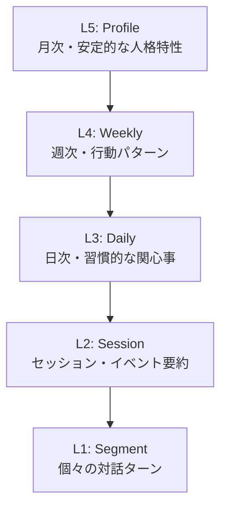
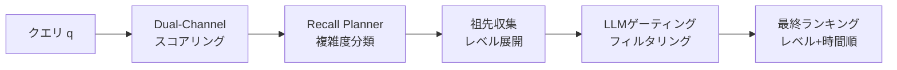

本記事は [TiMem: Temporal-Hierarchical Memory Consolidation for Long-Horizon Conversational Agents](https://arxiv.org/abs/2601.02845) の解説記事です。

## 論文概要

Li et al. (2026) は、長期対話エージェントにおけるメモリ管理の課題に対し、Temporal Memory Tree (TMT) と呼ばれる5層の時間階層構造でメモリを統合するフレームワーク TiMem を提案している。個々の対話ターンから抽出された細粒度の事実情報（L1）を、セッション（L2）、日次（L3）、週次（L4）、月次プロファイル（L5）へと段階的に統合することで、クエリの複雑度に応じた効率的なメモリ想起を実現する。LoCoMoベンチマークで75.30%の精度と52.20%のメモリ長削減を達成し、LongMemEval-Sでも76.88%の精度で全ベースラインを上回ったと報告されている（論文Table 1, Table 2）。ACL 2026 Findingsに採択されている。

この記事は [Zenn記事: Redis×pgvectorでH-MEM階層メモリを実装しCS応答精度を向上させる](https://zenn.dev/0h_n0/articles/19b6cd13ae346b) の深掘りです。Zenn記事ではRedisとpgvectorを用いた階層メモリ（H-MEM）の実装に焦点を当てているが、本論文はその背後にある理論的基盤として、時間軸に沿った階層的メモリ統合の設計原理と有効性を示しており、H-MEMの階層設計を改善する上で重要な知見を提供している。

## 情報源

- **arXiv ID**: 2601.02845
- **URL**: [https://arxiv.org/abs/2601.02845](https://arxiv.org/abs/2601.02845)
- **著者**: Kai Li, Xuanqing Yu, Ziyi Ni et al.
- **発表年**: 2026年（ACL 2026 Findings）
- **分野**: cs.CL, cs.AI

## 背景と動機

長期対話エージェントは、数百から数千ターンにわたる対話履歴を管理する必要がある。しかし、LLMのコンテキストウィンドウは有限であり、全ての対話履歴をそのまま入力することは現実的ではない。

既存の外部メモリフレームワークには3つの課題がある。第一に、MemoryBankやA-MEMのようなフラット構造では時間的文脈が失われやすい。第二に、Mem0のような抽出・更新パイプラインではメモリ粒度が固定され、異なる抽象度のクエリに均一に対応してしまう。第三に、MemoryOS等のOS着想型アプローチでも時間的連続性を第一原理として扱っていない。

著者らは、エピソード記憶から意味記憶への段階的統合という認知科学モデルに着想を得て、時間軸を組織化の第一原理とするTiMemを設計している。

## 主要な貢献

- **時間階層的組織化**: 対話データを5層のTemporal Memory Tree (TMT) で構造化し、時間的包含関係を保ちながら段階的に抽象化する仕組みを提案した
- **セマンティックガイド統合**: ファインチューニング不要で、LLMの命令プロンプトのみにより階層レベル間のメモリ統合を実現した
- **複雑度適応型想起**: クエリの複雑度を3段階（simple/hybrid/complex）に分類し、検索範囲とバジェットを適応的に制御する想起戦略を設計した

## 技術的詳細

### Temporal Memory Tree (TMT) の形式定義

TMTは4つ組 $\text{TMT} = (M, E, \tau, \sigma)$ で定義される。

$$
M = \bigcup_{i=1}^{L} M_i
$$

ここで、
- $M$: 全メモリノードの集合（$L$個のレベルに分割）
- $E \subseteq M \times M$: 親子関係を表すエッジ集合。$\ell(m_u) = \ell(m_v) + 1$ を満たす
- $\tau$: 各ノードに連続的な時間区間 $[t_{\text{start}}, t_{\text{end}}]$ を割り当てる関数
- $\sigma$: ノードをセマンティックメモリ（テキスト+埋め込みベクトル）に写す関数

TMTは以下の2つの構造的制約を満たす。

**時間的包含関係 (Temporal Containment)**: 親ノード $m_u$ の時間区間は子ノード $m_v$ の時間区間を包含する。

$$
\tau(m_u) \supseteq \tau(m_v) \quad \text{for all } (m_u, m_v) \in E
$$

**漸進的統合 (Progressive Consolidation)**: 上位レベルほどノード数が減少する。

$$
|M_i| \leq |M_{i-1}| \quad \text{for } i = 2, \ldots, L
$$

5層の構成は以下の通りである。



| レベル | 粒度 | 内容 | 更新タイミング |
|--------|------|------|----------------|
| L1 | 1ターン | 細粒度の事実情報 | オンライン（各ターン後） |
| L2 | セッション | 非冗長なイベント要約 | セッション終了時 |
| L3 | 日次 | 習慣的な関心事・ルーティン | 日次 |
| L4 | 週次 | 行動特徴・嗜好パターン | 週次 |
| L5 | 月次 | 安定的な人格・価値観 | 月次 |

### セマンティックガイド統合（Memory Consolidation）

各レベルの統合は、Memory Consolidator関数 $\Phi_i$ によって実行される。

$$
\Phi_i: \mathcal{C}_i \times \mathcal{H}_i \times \mathcal{I}_i \rightarrow M_i
$$

ここで、
- $\mathcal{C}_i$: 子メモリの集合
- $\mathcal{H}_i$: 過去の同レベルメモリ（履歴ウィンドウ）
- $\mathcal{I}_i$: レベル固有の命令プロンプト

子メモリの収集は時間区間 $g$ に基づいて行われる。

$$
\mathcal{C}_i(g) = \{m \in M_{i-1} : \tau(m) \subseteq g\}, \quad i \geq 2
$$

また、直近の $w_i$ 個の同レベルメモリが文脈として参照される。

$$
\mathcal{H}_i = \{m^{(i)}_{-j} : 1 \leq j \leq w_i\}
$$

著者らはデフォルトで $w_i = 3$ を全レベルに適用している。セマンティック統合はLLMへのプロンプトで実行される。

$$
\sigma(m_u) = \text{LLM}(\{\sigma(m_v)\}, \mathcal{I}_i)
$$

この設計の利点は、ファインチューニングが不要であり、命令プロンプトの変更のみでLLMバックエンドを差し替えられる点にある。統合時のtemperatureは0.7が使用されている（論文Section 4.1）。

以下は統合処理の擬似的な実装例である。

```python
from dataclasses import dataclass
from datetime import datetime

@dataclass
class MemoryNode:
    """TMTのメモリノード（level: 1-5, embedding: 1024次元）"""
    level: int
    text: str
    embedding: list[float]
    t_start: datetime
    t_end: datetime
    children: list["MemoryNode"] | None = None

async def consolidate(
    children: list[MemoryNode],
    history: list[MemoryNode],
    instruction: str,
    llm_client: object,
    window_size: int = 3,
) -> MemoryNode:
    """Memory Consolidator Phi_i: 子メモリ群を上位レベルに統合する"""
    recent = history[-window_size:]
    prompt = (
        f"{instruction}\n\nChild memories:\n"
        + "\n".join(c.text for c in children)
        + "\n\nRecent context:\n"
        + "\n".join(h.text for h in recent)
    )
    response = await llm_client.generate(prompt, temperature=0.7)
    return MemoryNode(
        level=children[0].level + 1, text=response,
        embedding=await llm_client.embed(response),
        t_start=min(c.t_start for c in children),
        t_end=max(c.t_end for c in children),
        children=children,
    )
```

### 複雑度適応型想起（Complexity-Aware Recall）

TiMemの想起パイプラインは、クエリの複雑度に応じて検索範囲とバジェットを適応的に制御する。

**ステップ1: Dual-Channelスコアリング**

ベースレベル（L1）の候補選択には、セマンティック類似度とレキシカルマッチングの加重和を用いる。

$$
s(m, q, K) = \lambda \cdot s_{\text{sem}}(m, q) + (1 - \lambda) \cdot s_{\text{lex}}(m, K)
$$

ここで、
- $s_{\text{sem}}$: 埋め込みベクトル間のコサイン類似度
- $s_{\text{lex}}$: BM25によるレキシカルマッチングスコア
- $K$: クエリから抽出されたキーワード集合
- $\lambda = 0.9$（デフォルト、セマンティック重視）

著者らのパラメータ感度分析（論文Table 10）によると、$\lambda = 0.9$ が最適であり、$\lambda = 0.7$ では1.34ポイント、$\lambda = 1.0$（セマンティックのみ）では0.62ポイントの精度低下が生じている。

**ステップ2: 複雑度分類と検索範囲決定**

Recall Plannerがクエリを3段階に分類し、それぞれ異なるレベルを検索対象とする。

| 複雑度 | 検索対象レベル | レベル別バジェット |
|--------|---------------|-------------------|
| Simple | L1, L2, L5 | L1:20, L2:4, L5:1 |
| Hybrid | L1, L2, L3, L5 | L1:20, L2:4, L3:2, L5:1 |
| Complex | L1-L5（全レベル） | L1:20, L2:8, L3:4, L4:2, L5:1 |

**ステップ3: 祖先収集**

L1の候補メモリ $\Omega_1(q, K)$ に対して、複雑度 $c$ に応じた祖先ノードを収集する。

$$
A(m, c) = \{m' \in M : m \preceq m', \ell(m') \in S(c)\}
$$

完全な候補集合は以下で構成される。

$$
\Omega_c(q, K) = \Omega_1(q, K) \cup \bigcup_{m \in \Omega_1(q, K)} A(m, c)
$$

**ステップ4: LLMゲーティングと最終ランキング**

LLMベースのフィルタリング関数 $\phi$ で候補を絞り込む。

$$
\Omega_\phi(q, c) = \{m \in \Omega_c \mid \phi(m, q, c) = \text{retain}\}
$$

最終的な想起結果は、レベルと時間的近接性でソートされる。

$$
\Omega_{\text{final}}(q, c) = \text{sort}(\Omega_\phi(q, c), \text{key} = (\ell(m), |t_q - t_m|))
$$

想起パイプライン全体の流れを以下に示す。



### 認知科学との対応と多様体分析

TMTの設計は、エピソード記憶から意味記憶への統合という認知科学のモデルに対応する。論文の多様体分析（Table 11）によると、L1からL5へのメモリ埋め込みのSilhouette係数は0.093から0.574へ、分離比率は0.30から2.14へと6.2倍に増加しており、上位レベルほどペルソナ間の分離が明確になることが定量的に示されている。

## 実装のポイント

TiMemを実装する際の主要な検討事項を以下に整理する。

**埋め込みモデル**: Qwen3-Embedding-0.6B（1024次元）が使用されており、軽量モデルでも十分な性能が得られている。

**セグメント粒度**: L1を1ターンから8ターンに粗くすると精度が10.04ポイント低下する（論文Table 9）。L1は1ターン単位を維持すべきである。

**統合コスト**: LLMコールはLoCoMoで全体の29.5%増（2,871→3,717コール、論文Table 5）に留まる。L2-L5は時間ウィンドウ閉鎖時のバッチ実行である。

**ゲーティング**: Planner+Gating無効化で精度2.31ポイント低下かつメモリ長8.6倍増加（論文Table 3）。精度と効率の両面で不可欠である。

**LLMバックエンド分離**: 内部処理にgpt-4o-mini、回答生成にQwen3-235Bを使用した場合LoCoMo 80.45%に向上する（論文Table 8）。

## Production Deployment Guide

### AWS実装パターン（コスト最適化重視）

TiMemの本番運用では、TMTの永続化、統合バッチ処理、リアルタイム想起の3つのワークロードを考慮する必要がある。

| 構成 | トラフィック | 主要サービス | 月額概算 |
|------|-------------|-------------|---------|
| Small | ~100 req/日 | Lambda + Bedrock + DynamoDB | $80-200 |
| Medium | ~1,000 req/日 | ECS Fargate + Aurora Serverless v2 + ElastiCache | $400-900 |
| Large | 10,000+ req/日 | EKS + Karpenter (Spot) + Aurora + ElastiCache | $2,500-6,000 |

Small構成はLambda + Bedrock + DynamoDB + OpenSearch Serverless、Medium構成はECS Fargate + Aurora Serverless v2 (pgvector) + ElastiCache (Redis)、Large構成はEKS + Karpenter (Spot優先) + Aurora + ElastiCache Clusterで構成する。統合バッチ処理にSpot Instances（最大90%削減）やBedrock Batch API（50%削減）を適用することでコストを抑制できる。

**注意**: 上記は2026年8月時点のAWS ap-northeast-1料金に基づく概算値であり、最新料金はAWS料金計算ツールで確認を推奨する。

### Terraformインフラコード

**Small構成（Serverless）**:

```hcl
# TiMem Small構成: Lambda + Bedrock + DynamoDB
# コスト目安: $80-200/月 (ap-northeast-1)

resource "aws_dynamodb_table" "tmt_nodes" {
  name         = "timem-tmt-nodes"
  billing_mode = "PAY_PER_REQUEST"  # On-Demand
  hash_key     = "user_id"
  range_key    = "node_id"

  attribute { name = "user_id"; type = "S" }
  attribute { name = "node_id"; type = "S" }
  attribute { name = "level";   type = "N" }

  global_secondary_index {
    name            = "level-index"
    hash_key        = "user_id"
    range_key       = "level"
    projection_type = "ALL"
  }

  server_side_encryption { enabled = true }
  tags = { Project = "timem", Env = "production" }
}

resource "aws_lambda_function" "timem_recall" {
  function_name = "timem-recall"
  runtime       = "python3.12"
  handler       = "handler.recall"
  memory_size   = 256
  timeout       = 30
  role          = aws_iam_role.timem_lambda.arn

  environment {
    variables = {
      TMT_TABLE      = aws_dynamodb_table.tmt_nodes.name
      LAMBDA_DEFAULT = 0.9  # セマンティック・レキシカル重み
      WINDOW_SIZE    = 3
    }
  }
  tracing_config { mode = "Active" }  # X-Ray有効化
}

# IAMロール: 最小権限（DynamoDB CRUD + Bedrock InvokeModel + CloudWatch Logs）
# EventBridge Scheduler: 日次/週次/月次統合トリガー
```

Large構成ではEKS (v1.31) + Karpenter (Spot優先, m6i.xlarge/m7i.xlarge) + Aurora PostgreSQL 16.4 (pgvector, Serverless v2: 0.5-16 ACU) を使用する。Karpenterの`consolidationPolicy: WhenEmptyOrUnderutilized`で未使用ノードを自動削除し、AWS Budgets ($5,000/月) でコストアラートを設定する。

### 運用・監視設定

**CloudWatch Logs Insights**（統合処理のコスト監視）:

```
fields @timestamp, @message | filter event = "consolidation"
| stats sum(tokens_used) as total_tokens, avg(duration_ms) as avg_dur by bin(1h)
```

**CloudWatchアラーム + X-Ray + Cost Explorer**:

```python
import boto3
from aws_xray_sdk.core import xray_recorder, patch_all

patch_all()  # boto3自動計装

def create_timem_alarms() -> None:
    """Bedrockトークンスパイク + Lambda P95レイテンシ異常検知"""
    cw = boto3.client("cloudwatch")
    for name, metric, ns, thresh in [
        ("timem-bedrock-token-spike", "InputTokenCount", "AWS/Bedrock", 500000),
        ("timem-recall-latency-p95", "Duration", "AWS/Lambda", 5000),
    ]:
        cw.put_metric_alarm(
            AlarmName=name, MetricName=metric, Namespace=ns,
            Statistic="Sum", Period=3600, EvaluationPeriods=1,
            Threshold=thresh, ComparisonOperator="GreaterThanThreshold",
            AlarmActions=["arn:aws:sns:ap-northeast-1:ACCOUNT:timem-alerts"],
        )

@xray_recorder.capture("timem_recall")
async def recall_handler(query: str, user_id: str) -> dict:
    """想起処理トレース: complexity + recalled_tokensをアノテーション"""
    sub = xray_recorder.current_subsegment()
    sub.put_annotation("query_complexity", classify_complexity(query))
    results = await recall_pipeline(query, user_id)
    sub.put_metadata("recalled_tokens", sum(len(r.text) for r in results))
    return results
```

Cost Explorer APIで日次コストを取得し、$100/日超過時にSNS通知を送信する設定も推奨される。

### コスト最適化チェックリスト

**アーキテクチャ**: トラフィック量で構成選択（Serverless/Hybrid/Container）、統合バッチはEventBridge駆動

**リソース最適化**: Spot Instances優先（最大90%削減）、Reserved Instances 1年コミット（最大72%削減）、Savings Plans検討、Lambda Power Tuning、Karpenter未使用ノード自動削除

**LLMコスト削減**: Bedrock Batch API（50%削減）、Prompt Caching（30-90%削減）、内部処理Haiku/回答生成Sonnetの2段構成、想起バジェットによるトークン数制限、LLMゲーティングで不要メモリをフィルタ

**監視**: AWS Budgets（80%/100%閾値）、CloudWatchアラーム、Cost Anomaly Detection、日次コストレポート

**リソース管理**: 月次リソース棚卸、Project/Env/Ownerタグ必須、CloudWatch Logs 30日保持、開発環境夜間停止

## 実験結果

### LoCoMoベンチマーク

LoCoMoは4種類のクエリタイプで構成される長期対話ベンチマークである。論文Table 1の主要結果を以下に示す。

| 手法 | Single-Hop | Temporal | Open-Domain | Multi-Hop | Overall (LLJ) |
|------|-----------|----------|-------------|-----------|---------------|
| MemoryBank | 46.18 | 29.34 | 36.67 | 33.36 | 39.77 |
| A-MEM | 52.82 | 60.87 | 43.75 | 38.37 | 51.29 |
| Mem0 | 62.09 | 59.25 | 37.70 | 50.14 | 57.79 |
| MemoryOS | 68.37 | 52.46 | 46.67 | 52.76 | 60.79 |
| MemOS | 76.07 | 69.47 | 45.14 | 56.85 | 69.24 |
| **TiMem** | **81.43** | **77.63** | **52.08** | **62.20** | **75.30** |

TiMemは全クエリタイプで最高精度を達成しており、特にTemporalで77.63%と次点のMemOS（69.47%）を8.16ポイント上回っている。TMTの時間階層構造が時間的クエリに有効であることを示唆している。

**メモリ効率**: 想起メモリ長は511.25トークンでMem0の1,070.10トークンから52.20%削減（論文Table 6）。レイテンシはP50=2.35秒、P95=4.91秒である。

### LongMemEval-Sベンチマーク

LongMemEval-Sは、Knowledge Update (KU)、Multi-Session (MS)、Single-Session Association (SSA)等の6種類のタスクで構成される。論文Table 2の結果を以下に示す。

| 手法 | KU | MS | SSA | SSP | SSU | TR | Overall (LLJ) |
|------|-----|-----|-----|-----|-----|-----|---------------|
| Mem0 | 78.72 | 66.17 | 51.79 | 50.00 | 94.29 | 49.17 | 64.96 |
| MemOS | 76.67 | 58.80 | 67.86 | 50.67 | 93.71 | 65.11 | 68.68 |
| **TiMem** | **86.16** | **70.83** | **82.14** | **63.33** | **95.71** | **68.42** | **76.88** |

TiMemは全カテゴリで最高精度を達成しており、特にSSAで82.14%とMemOS（67.86%）を14.28ポイント上回っている。回答モデルをGPT-4oにした場合78.96%に向上する（論文Table 7）。

### アブレーション分析

論文Table 3のアブレーション結果は、Recall PlannerとLLMゲーティングの両方の寄与を示している。

| 構成 | LoCoMo LLJ | メモリ長 (tokens) |
|------|-----------|-------------------|
| Planner無し + Gating無し | 73.51 | 3,710 |
| Planner有り + Gating無し | 72.99 | 4,411 |
| Planner無し + Gating有り | 73.38 | 692 |
| **Planner有り + Gating有り** | **75.30** | **511** |

両方を組み合わせることで、精度1.79ポイント向上かつメモリ長86.2%削減を同時に達成している。

## 実運用への応用

TiMemの時間階層アプローチは、以下の実運用シナリオに適用可能である。

**カスタマーサポートBot**: 問い合わせ履歴（L1-L2）から嗜好パターン（L4）・プロファイル（L5）を自動構築する。Zenn記事のRedis×pgvector構成と組み合わせ、L5をRedisキャッシュ、L1-L3をpgvector類似検索するハイブリッド構成が考えられる。

**パーソナルアシスタント**: L3-L4の日次・週次ルーティンを自動抽出し、行動パターンに基づくプロアクティブな提案を実現する。統合LLMコールは全体の25-30%増（論文Table 5）のため、大規模運用ではアダプティブスケジューリングが有効である。

**制約事項**: (1) 統合品質が汎用LLMに依存、(2) 高レベルメモリに知識グラフが欠如、(3) 忘却メカニズムなし、(4) 時間境界が固定。

## 関連研究

- **Mem0** (2025): LLMによるメモリ抽出と意味的類似度に基づく追加・更新・削除のパイプライン。TiMemとの主要な違いは、Mem0がフラットなメモリ構造であるのに対し、TiMemが5層の時間階層を持つ点である。LoCoMoでTiMemが17.51ポイント上回っている
- **A-MEM** (2025): Zettelkasten式のノート連想メモリ。メモリ間のリンクを動的に生成するが、時間的構造を持たない。TiMemはLoCoMoで24.01ポイント上回っている
- **MemoryOS / MemOS** (2026): OS着想型の階層メモリフレームワーク。MemOSはLoCoMoで69.24%とTiMem（75.30%）に次ぐ精度だが、メモリ長は1,371トークンとTiMem（511トークン）の2.7倍である。TiMemとの設計原理の違いは、記憶の持続期間ではなく時間的粒度で階層を構成する点にある

## まとめと今後の展望

TiMemは、時間的連続性を第一原理とするTemporal Memory Treeにより、長期対話エージェントのメモリ管理を体系化したフレームワークである。LoCoMoで75.30%精度・52.20%メモリ長削減、LongMemEval-Sで76.88%精度を達成し、ファインチューニング不要でLLMバックエンドの差し替えが可能である。

著者らは今後の方向として、統合特化LLMの開発、知識グラフ統合、選択的忘却、適応的時間境界の設計を挙げている。固定された時間境界を活動パターンに応じて動的に調整するアプローチは、実運用での汎用性を高める重要な課題である。

## 参考文献

- **arXiv**: [https://arxiv.org/abs/2601.02845](https://arxiv.org/abs/2601.02845)
- **Code**: [https://github.com/TiMEM-AI/timem](https://github.com/TiMEM-AI/timem)
- **ACL Anthology**: [https://aclanthology.org/2026.findings-acl.1091/](https://aclanthology.org/2026.findings-acl.1091/)
- **Related Zenn article**: [https://zenn.dev/0h_n0/articles/19b6cd13ae346b](https://zenn.dev/0h_n0/articles/19b6cd13ae346b)
