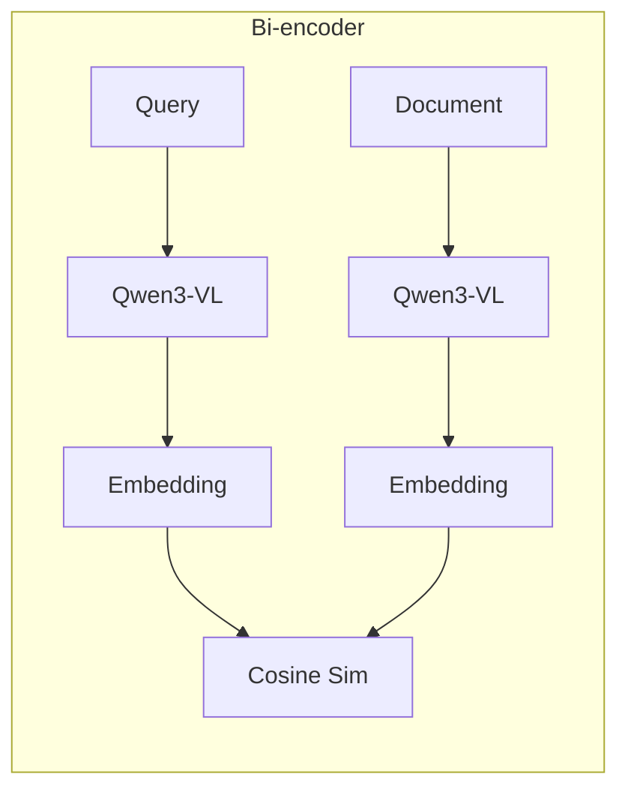
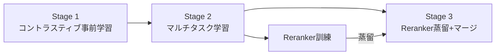

本記事は [Qwen3-VL-Embedding and Qwen3-VL-Reranker: A Unified Framework for State-of-the-Art Multimodal Retrieval and Ranking](https://arxiv.org/abs/2601.04720) の解説記事です。

## 論文概要

Li et al. (2026) は、Qwen3-VLバックボーンを用いたマルチモーダル埋め込みモデル Qwen3-VL-Embedding と、リランカー Qwen3-VL-Reranker を提案している。Bi-encoder（Embedding）とCross-encoder（Reranker）を3段階の学習パイプラインで訓練し、MMEB-v2（78データセット）で8Bモデルが77.8、文書画像検索ベンチマークでリランカーが80.3を達成している（論文Table 1, Table 2）。Matryoshka Representation Learningにより埋め込み次元を柔軟に選択でき、1024次元で1.4%劣化に留まる。

この記事は [Zenn記事: ColQwen2×vLLMで図表込み社内マニュアル検索を構築する](https://zenn.dev/0h_n0/articles/6e33a242d347f9) の深掘りです。Zenn記事のColQwen2パイプラインの基盤であるQwen3-VLを用いた次世代フレームワークとして、学習設計と大規模ベンチマーク評価を提供している。

## 情報源

- **arXiv ID**: 2601.04720
- **URL**: [https://arxiv.org/abs/2601.04720](https://arxiv.org/abs/2601.04720)
- **著者**: Mingxin Li, Yanzhao Zhang, Dingkun Long et al. (Alibaba Group)
- **提出日**: 2026年1月8日
- **分野**: cs.CV, cs.CL, cs.IR

## 背景と動機

マルチモーダル検索では、テキストクエリに対して画像・動画・文書画像など多様なモダリティのドキュメントを統一的に検索する必要がある。従来のアプローチには2つの課題がある。

第一に、CLIPやSigLIPなどのビジョン・テキストエンコーダ独立訓練手法では、画像内テキスト（OCR情報）や文書レイアウト構造を十分に捉えられない。図表とテキストが混在する文書画像検索には視覚・テキスト両方を理解するモデルが必要である。

第二に、ColPaliやColQwen2のlate-interaction型モデルはトークンレベルの細粒度マッチングを実現するが、全トークンベクトル保持によるインデックスサイズの大きさが課題である。

著者らはQwen3-VLをバックボーンに採用し、Bi-encoder + Cross-encoderを統一的に訓練することで、この課題に取り組んでいる。

## 主要な貢献

- **統一マルチモーダル埋め込みフレームワーク**: テキスト・画像・動画・文書画像を単一のBi-encoderで埋め込み、30以上の言語をサポートする汎用的な検索基盤を構築した
- **3段階学習パイプライン**: 大規模コントラスティブ事前学習、マルチタスク学習、リランカー蒸留+パラメータマージングの3段階で段階的に品質を向上させる訓練手法を設計した
- **Matryoshka Representation Learning**: 柔軟な埋め込み次元選択（2048/1024/512等）を可能にし、ストレージと精度のトレードオフを運用時に調整可能にした
- **MMEB-v2 SOTA**: 78データセットにわたるMMEB-v2ベンチマークで8Bモデルが77.8、2Bモデルが73.2の総合スコアを達成し、文書画像検索（VisDoc）では82.4を記録した

## 技術的詳細

### アーキテクチャ

Qwen3-VL-EmbeddingとRerankerはいずれもQwen3-VLをバックボーンとし、2Bと8Bの2つのサイズが提供されている。

| パラメータ | 2B | 8B |
|-----------|-----|-----|
| Transformer層数 | 28 | 36 |
| 埋め込み次元 | 2048 | 4096 |
| 最大コンテキスト長 | 32,768 tokens | 32,768 tokens |
| 画像visual tokens上限 | 1,280 tokens | 1,280 tokens |
| 動画 | 1 FPS, 最大64フレーム, 4,500 tokens | 1 FPS, 最大64フレーム, 4,500 tokens |

Bi-encoder（Embedding）では、causal attentionにより最終トークンが全入力情報を集約するため、最終層の最終トークンの隠れ状態を埋め込みベクトルとして使用する。Cross-encoder（Reranker）ではクエリとドキュメントを連結入力し、"yes"/"no"のlogit差のsigmoidでrelevanceスコアを算出する。



### 3段階学習パイプライン

著者らは、段階的に学習データの品質と難易度を上げていく3段階の学習パイプラインを採用している。

**Stage 1: 大規模コントラスティブ事前学習**

大規模なテキスト・マルチモーダルペアデータを用いて、InfoNCE損失でコントラスティブ学習を行う。

$$
\mathcal{L}_{\text{InfoNCE}} = -\log \frac{\exp(\text{sim}(q, d^+) / \tau)}{\exp(\text{sim}(q, d^+) / \tau) + \sum_{j=1}^{K} \exp(\text{sim}(q, d_j^-) / \tau)}
$$

ここで、
- $q$: クエリの埋め込みベクトル
- $d^+$: 正例ドキュメントの埋め込みベクトル
- $d_j^-$: $j$番目の負例ドキュメントの埋め込みベクトル
- $\tau$: 温度パラメータ
- $\text{sim}(\cdot, \cdot)$: コサイン類似度

この段階ではin-batchネガティブに加え、hard negativeも使用される。False negative（実際は正例だがバッチ内で負例として扱われるペア）のマスキングも導入されている。

**Stage 2: マルチタスク学習**

高品質にキュレーションされたデータを用い、retrieval・classification・QA・STSの4つのタスクを同時に学習する。タスクごとに異なる損失関数を使用する。

Retrieval: Stage 1と同様のInfoNCE損失

Classification: クラスラベルをドキュメントとして扱い、InfoNCEで学習する。

STS (Semantic Textual Similarity): CoSent損失で、ペアのスコア順序を保持するよう学習する。

$$
\mathcal{L}_{\text{CoSent}} = \log \left[ 1 + \sum_{(i,j): y_i > y_j} \exp\left(\frac{\text{sim}(a_j, b_j) - \text{sim}(a_i, b_i)}{\tau}\right) \right]
$$

ここで$(a_i, b_i)$は$i$番目のペアの埋め込み、$y_i$は人手アノテーションの類似度スコアである。高スコアペアの類似度が低スコアペアを上回るよう制約をかけ、MSE損失よりスコア分布の偏りに頑健である。

QA: 質問-回答ペアのInfoNCE損失

**Stage 3: リランカー蒸留 + パラメータマージング**

Stage 2で訓練されたモデルに対し、Rerankerの出力分布をEmbeddingモデルに蒸留する。

$$
\mathcal{L}_{\text{distill}} = -\sum_{i} p_{\text{reranker}}(d_i \mid q) \log p_{\text{embedding}}(d_i \mid q)
$$

ここで、
- $p_{\text{reranker}}(d_i \mid q)$: Rerankerが算出した候補ドキュメント群に対するソフトマックス分布
- $p_{\text{embedding}}(d_i \mid q)$: Embeddingモデルのコサイン類似度に基づくソフトマックス分布

蒸留後、Stage 2のチェックポイントとStage 3のチェックポイントをパラメータ空間で線形補間（マージング）する。これにより、汎化性能（Stage 2）と蒸留による精緻化（Stage 3）のバランスを取る。



Rerankerは $s_{\text{rerank}}(q, d) = \sigma(\text{logit}_{\text{yes}} - \text{logit}_{\text{no}})$ のbinary classification形式で訓練される。

### Matryoshka Representation Learning

Matryoshka Representation Learning (MRL) は、埋め込みベクトルの先頭$d$次元のみを使用しても性能を維持できるよう学習する手法である。訓練時に複数の次元 $\{d_1, \ldots, d_M\}$ でInfoNCE損失を計算し平均を最適化する。

$$
\mathcal{L}_{\text{MRL}} = \frac{1}{M} \sum_{m=1}^{M} \mathcal{L}_{\text{InfoNCE}}(\mathbf{e}_{[:d_m]})
$$

8Bモデルで4096→1024次元の削減で1.4%劣化、int8量子化で性能維持、binary量子化は劣化が大きいと報告されている。

### 損失関数のまとめ

各タスクの損失関数を以下に整理する。

| タスク | 損失関数 | 説明 |
|--------|---------|------|
| Retrieval | InfoNCE | コントラスティブ学習 + hard negative + false negative masking |
| Classification | InfoNCE (label-as-doc) | クラスラベルをドキュメントとして扱う |
| STS | CoSent | スコア順序を保持する対比学習 |
| QA | InfoNCE | 質問-回答ペアのコントラスティブ学習 |
| Reranking | BCE | yes/no logit差のsigmoidに対するbinary cross-entropy |
| 蒸留 | Cross-entropy | Reranker分布からEmbedding分布への知識蒸留 |

## 実装のポイント

Qwen3-VL-Embeddingを実装する際の主要な検討事項を以下に整理する。

**入力前処理**: 画像は最大1,280 visual tokens、動画は1 FPS・最大64フレーム・4,500トークンに制限される。文書画像のOCR情報はモデルが内部処理するため外部OCRパイプラインは不要である。

**埋め込み抽出**: causal attentionにより、最終トークン位置の隠れ状態を埋め込みベクトルとして取得する。

**次元選択**: MRLにより次元を柔軟に選択でき、100万ドキュメントの場合4096次元（float32、約16GB）を1024次元（約4GB）に削減可能である。

**2段階検索**: Embeddingで100-200件にANN検索 → Rerankerで精密リランキングする構成が推奨される。

```python
from dataclasses import dataclass

import numpy as np


@dataclass
class RetrievalResult:
    """2段階検索の結果"""
    doc_id: str
    embedding_score: float
    reranker_score: float | None = None


async def two_stage_retrieval(
    query: str,
    embedding_model: object,
    reranker_model: object,
    vector_db: object,
    top_k_retrieval: int = 100,
    top_k_rerank: int = 10,
) -> list[RetrievalResult]:
    """Embedding + Rerankerによる2段階検索パイプライン"""
    # Stage 1: Embedding ANN検索
    query_vec: np.ndarray = await embedding_model.encode(query)
    candidates = await vector_db.search(vector=query_vec.tolist(), limit=top_k_retrieval)

    # Stage 2: Rerankerでリランキング
    pairs = [(query, c.payload["text"]) for c in candidates]
    rerank_scores: list[float] = await reranker_model.score(pairs)

    results = [
        RetrievalResult(doc_id=c.id, embedding_score=c.score, reranker_score=s)
        for c, s in zip(candidates, rerank_scores)
    ]
    results.sort(key=lambda r: r.reranker_score or 0.0, reverse=True)
    return results[:top_k_rerank]
```

**量子化**: int8量子化は性能維持、binary量子化は劣化が大きい。Qdrantのscalar quantization（int8）が実用的である。

## Production Deployment Guide

### AWS実装パターン（コスト最適化重視）

Qwen3-VL-Embeddingの本番運用では、モデル推論（Embedding生成 + Reranking）、ベクトルDB管理、2段階検索オーケストレーションの3つのワークロードを考慮する必要がある。2Bモデルと8Bモデルの選択がコストに大きく影響する。

| 構成 | トラフィック | 主要サービス | 月額概算 |
|------|-------------|-------------|---------|
| Small | ~100 req/日 | Lambda + SageMaker Serverless (2B) + OpenSearch Serverless | $120-250 |
| Medium | ~1,000 req/日 | ECS Fargate (GPU) + Qdrant on EC2 + Aurora Serverless v2 | $500-1,200 |
| Large | 10,000+ req/日 | EKS + Karpenter (Spot GPU) + Qdrant Cluster + ElastiCache | $3,000-8,000 |

Small構成はSageMaker Serverless（2Bモデル）+ OpenSearch Serverless、Medium構成はECS Fargate（GPU）+ Qdrant + Aurora Serverless v2、Large構成はEKS + Karpenter（Spot GPU優先）+ Qdrant分散クラスタ + ElastiCacheで構成する。

**注意**: 上記は2026年8月時点のAWS ap-northeast-1料金に基づく概算値であり、最新料金はAWS料金計算ツールで確認を推奨する。

### Terraformインフラコード

**Small構成（Serverless）**:

```hcl
# Qwen3-VL-Embedding Small構成: SageMaker Serverless + OpenSearch Serverless
# コスト目安: $120-250/月 (ap-northeast-1)

resource "aws_sagemaker_model" "qwen3vl_2b" {
  name               = "qwen3vl-embedding-2b"
  execution_role_arn = aws_iam_role.sagemaker_exec.arn
  primary_container {
    image          = "763104351884.dkr.ecr.ap-northeast-1.amazonaws.com/djl-inference:0.31.0-lmi13.0.0-cu124"
    model_data_url = "s3://qwen3vl-models/embedding-2b/model.tar.gz"
    environment = {
      OPTION_MODEL_ID      = "Qwen/Qwen3-VL-Embedding-2B"
      OPTION_TASK          = "feature-extraction"
      OPTION_MAX_MODEL_LEN = "8192"
    }
  }
}

resource "aws_sagemaker_endpoint_configuration" "qwen3vl" {
  name = "qwen3vl-embedding-serverless"
  production_variants {
    variant_name = "AllTraffic"
    model_name   = aws_sagemaker_model.qwen3vl_2b.name
    serverless_config {
      memory_size_in_mb = 6144
      max_concurrency   = 2
    }
  }
}

resource "aws_lambda_function" "search_api" {
  function_name = "qwen3vl-search-api"
  runtime       = "python3.12"
  handler       = "handler.search"
  memory_size   = 512
  timeout       = 30
  role          = aws_iam_role.lambda_exec.arn
  environment {
    variables = {
      SAGEMAKER_ENDPOINT = aws_sagemaker_endpoint_configuration.qwen3vl.name
      EMBEDDING_DIM      = "1024"  # MRL: 2048->1024でコスト削減
      TOP_K_RETRIEVAL    = "100"
      TOP_K_RERANK       = "10"
    }
  }
  tracing_config { mode = "Active" }
}
# IAMロール: 最小権限（SageMaker InvokeEndpoint + CloudWatch Logs）
# CloudWatchアラーム: SageMaker呼び出し数スパイク検知
```

Large構成ではEKS (v1.31) + Karpenter (GPU Spot優先, g5.xlarge/g5.2xlarge) + Qdrant分散クラスタを使用する。Karpenterの`consolidationPolicy: WhenEmptyOrUnderutilized`で未使用GPUノードを自動削除し、AWS Budgets ($8,000/月) でコストアラートを設定する。

### 運用・監視設定

**CloudWatch Logs Insights**（推論レイテンシとスループット監視）:

```
fields @timestamp, @message
| filter event = "inference"
| stats avg(duration_ms) as avg_latency,
        percentile(duration_ms, 95) as p95_latency,
        sum(input_tokens) as total_tokens,
        count(*) as request_count
  by bin(1h)
```

**CloudWatchアラーム + X-Ray + Cost Explorer**:

```python
import boto3
from aws_xray_sdk.core import xray_recorder, patch_all

patch_all()  # boto3自動計装


def create_qwen3vl_alarms() -> None:
    """SageMakerレイテンシ異常 + GPU使用率スパイク検知"""
    cw = boto3.client("cloudwatch")
    for name, metric, ns, thresh in [
        ("qwen3vl-latency-p95", "ModelLatency", "AWS/SageMaker", 3000),
        ("qwen3vl-gpu-util", "GPUUtilization", "/aws/sagemaker/Endpoints", 95),
    ]:
        cw.put_metric_alarm(
            AlarmName=name, MetricName=metric, Namespace=ns,
            Statistic="Average", Period=300, EvaluationPeriods=2,
            Threshold=thresh, ComparisonOperator="GreaterThanThreshold",
            AlarmActions=["arn:aws:sns:ap-northeast-1:ACCOUNT:qwen3vl-alerts"],
        )


@xray_recorder.capture("qwen3vl_search")
async def search_handler(query: str, modality: str) -> dict:
    """検索処理トレース: modality + retrieved_docsをアノテーション"""
    sub = xray_recorder.current_subsegment()
    sub.put_annotation("modality", modality)
    results = await two_stage_retrieval(query)
    sub.put_metadata("retrieved_count", len(results))
    return {"results": results}
```

Cost Explorer APIで日次コストを取得し、$100/日超過時にSNS通知を送信する設定も推奨される。

### コスト最適化チェックリスト

**アーキテクチャ選択**: トラフィック量で構成選択（Serverless/Hybrid/Container）、2Bモデルと8Bモデルの使い分け（精度要件に応じて）、MRLで埋め込み次元を削減（4096→1024で75%メモリ削減）

**リソース最適化**: GPU Spot優先（最大90%削減）、Reserved 1年コミット（最大72%削減）、SageMaker Serverless（アイドルコスト回避）、Karpenter未使用GPU自動削除

**推論コスト削減**: 2B Embedding + 8B Reranking、int8量子化、MRL 1024次元（インデックス75%削減）、ElastiCache検索キャッシュ

**監視**: AWS Budgets（80%/100%）、CloudWatchアラーム、Cost Anomaly Detection、日次コストレポート

**リソース管理**: 月次棚卸し、タグ必須、Logs 30日保持、開発環境夜間停止

## 実験結果

### MMEB-v2ベンチマーク

MMEB-v2は78データセットからなるマルチモーダル埋め込みの包括的ベンチマークである。論文Table 1の主要結果を以下に示す。

| モデル | Image CLS | Image QA | Image RET | Video | VisDoc | Overall |
|--------|-----------|----------|-----------|-------|--------|---------|
| SigLIP-SO400M | 55.1 | 42.8 | 50.3 | 46.9 | 48.2 | 49.6 |
| Jina-CLIP-v2 | 59.5 | 53.0 | 61.0 | 50.2 | 66.8 | 59.1 |
| GME-Qwen2-VL-2B | 66.7 | 69.1 | 70.6 | 58.0 | 75.4 | 69.1 |
| Qwen3-VL-Embedding-2B | 70.3 | 74.3 | 74.8 | 61.9 | 79.2 | 73.2 |
| Qwen3-VL-Embedding-8B | **74.2** | **81.1** | **80.2** | **67.1** | **82.4** | **77.8** |

8Bモデルは全カテゴリで最高スコアを達成し、VisDoc（文書画像検索）で82.4を記録している。2Bモデルも73.2でGME-Qwen2-VL-2B（69.1）を4.1ポイント上回る。

### 文書画像検索（ViDoRe-v3 & JinaVDR）

文書画像検索に特化したベンチマークでの結果を以下に示す（論文Table 2）。

| モデル | VisRAG | VisDocOOD | Vidore-v3 | JinaVDR | Average |
|--------|--------|-----------|-----------|---------|---------|
| ColPali-v1.3 | 81.8 | 66.8 | 52.9 | 74.0 | 69.5 |
| ColQwen2.5-v0.2 | 87.3 | 74.7 | 57.3 | 73.3 | 74.1 |
| Qwen3-VL-Embedding-8B | 88.6 | 73.5 | 60.1 | 80.9 | 76.6 |
| Qwen3-VL-Reranker-8B | **91.2** | **75.7** | **66.7** | **83.6** | **80.3** |

Reranker-8Bは80.3でColQwen2.5-v0.2（74.1）を6.2ポイント上回り、Embedding-8B単体（76.6）でもColQwen2.5を超えている。

### MMTEB多言語評価とMatryoshka次元削減

MMTEB多言語ベンチマークでは8B Embeddingが67.9の平均スコアを達成し、30以上の言語での検索に対応する。MRLによる次元削減では、4096→1024次元で1.4%劣化（77.8→76.7）、512次元で2.6%劣化（→75.8）に留まる。

## 実運用への応用

Qwen3-VL-Embedding/Rerankerの実運用シナリオを、Zenn記事のColQwen2パイプラインとの関連で整理する。

**社内マニュアル検索の高度化**: Zenn記事のColQwen2パイプラインにおいて、ColQwen2をQwen3-VL-Embedding-2Bに置き換えることで、late-interactionのトークンレベルインデックスが不要になりインデックスサイズが大幅に削減される。Rerankerを2段目に追加することでColQwen2と同等以上の精度を維持できる。

**多言語・動画対応**: 30以上の言語サポートにより日本語マニュアルと英語仕様書の統一検索が可能。1 FPS・最大64フレームの動画埋め込みにも対応し、操作手順動画の検索にも拡張できる。

**コスト効率**: MRL 1024次元でQdrantメモリ消費を75%削減、2Bモデルの使用でColQwen2と同等の計算リソースで運用可能である。

## 関連研究

- **ColPali / ColQwen2** (2024-2025): ViT+LLMのlate-interaction型文書画像検索モデル。トークンレベルのMaxSimスコアリングで高精度だがインデックスサイズが大きい。Qwen3-VL-EmbeddingはBi-encoderで単一ベクトルを生成するため、インデックス効率で優位である
- **GME (General Multimodal Embeddings)** (2025): Qwen2-VLをバックボーンとしたマルチモーダル埋め込みモデル。Qwen3-VL-Embeddingの直接の先行研究であり、MMEB-v2で2Bモデルの比較ではQwen3-VL-Embedding-2B（73.2）がGME-Qwen2-VL-2B（69.1）を4.1ポイント上回っている
- **Matryoshka Representation Learning** (Kusupati et al., 2022): 柔軟な次元選択を可能にする手法。Qwen3-VL-Embeddingはこれをマルチモーダル埋め込みに適用し、4096→1024次元で1.4%劣化に留めている

## まとめと今後の展望

Qwen3-VL-Embedding/Rerankerは、3段階学習パイプラインによりMMEB-v2で77.8、文書画像検索でRerankerが80.3を達成したマルチモーダル埋め込みフレームワークである。MRLによる柔軟な次元選択（1024次元で1.4%劣化）はプロダクション環境でのコスト最適化に有用である。

ColQwen2のlate-interaction構成からBi-encoder+Rerankerへの移行でインデックス効率が大幅に改善され、要件に応じた使い分けが重要である。

## 参考文献

- **arXiv**: [https://arxiv.org/abs/2601.04720](https://arxiv.org/abs/2601.04720)
- **Qwen3-VL**: [https://github.com/QwenLM/Qwen3-VL](https://github.com/QwenLM/Qwen3-VL)
- **ColPali**: [https://arxiv.org/abs/2407.01449](https://arxiv.org/abs/2407.01449)
- **Matryoshka RL**: [https://arxiv.org/abs/2205.13147](https://arxiv.org/abs/2205.13147)
- **Related Zenn article**: [https://zenn.dev/0h_n0/articles/6e33a242d347f9](https://zenn.dev/0h_n0/articles/6e33a242d347f9)
