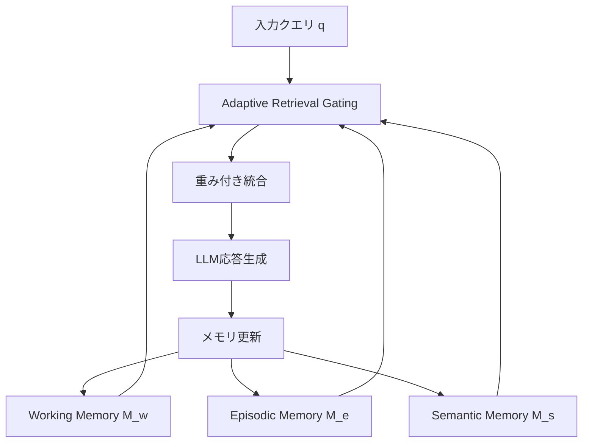
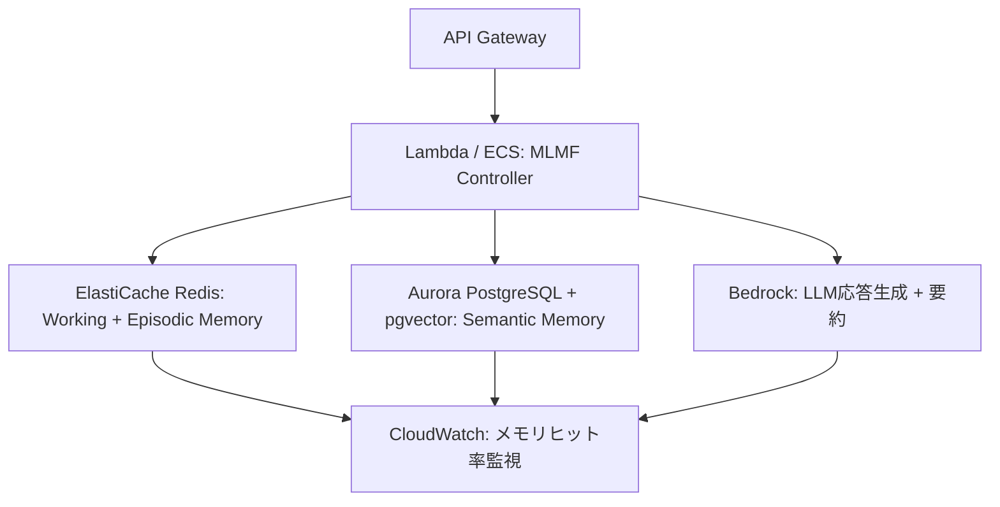

本記事は [Multi-Layered Memory Architectures for LLM Agents: An Experimental Evaluation of Long-Term Context Retention（arXiv:2603.29194）](https://arxiv.org/abs/2603.29194) の解説記事です。

この記事は [Zenn記事: Redis×pgvectorでH-MEM階層メモリを実装しCS応答精度を向上させる](https://zenn.dev/0h_n0/articles/19b6cd13ae346b) の深掘りです。Zenn記事ではRedis（ワーキングメモリ＋エピソードメモリ）とpgvector（セマンティックメモリ）を用いた階層メモリの実装を解説していますが、本論文はこうした3層メモリアーキテクチャの理論的基盤を形式化し、適応的検索ゲーティングと保持安定性正則化によって長期文脈保持の性能改善を実験的に評価した研究です。Zenn記事の実装設計が学術的にどのように位置づけられるかを理解する視点を提供します。

---

## 論文概要

Fofadiyaらは、LLMエージェントの対話履歴管理における長期文脈保持の課題に対し、Multi-Layered Memory Framework（MLMF）を提案している。MLMFは対話履歴をワーキングメモリ $M^{(w)}$、エピソードメモリ $M^{(e)}$、セマンティックメモリ $M^{(s)}$ の3層に分解し、適応的検索ゲーティングにより文脈依存的なメモリ層の動的優先度決定を行う。LOCOMO、LOCCO、LoCoMoの3つのベンチマークにおいて、ベースラインに対して成功率+4.85、F1+0.035、6期間後の文脈保持率+8.65%の改善を報告している。

## 情報源

| 項目 | 内容 |
|------|------|
| タイトル | Multi-Layered Memory Architectures for LLM Agents: An Experimental Evaluation of Long-Term Context Retention |
| 著者 | Payal Fofadiya, Sunil Tiwari（Fulloop） |
| arXiv ID | 2603.29194 |
| 投稿日 | 2026年3月31日 |
| 分野 | cs.AI |
| URL | [https://arxiv.org/abs/2603.29194](https://arxiv.org/abs/2603.29194) |

## Zenn記事との関連

Zenn記事ではRedisをワーキングメモリ（直近の対話保持）とエピソードメモリ（セッション要約の蓄積）に、pgvectorをセマンティックメモリ（エンティティ・イベントの意味検索）に割り当てる実装パターンを解説している。本論文のMLMFは、まさにこの3層構造を数学的に形式化したものであり、Zenn記事の設計選択に対する理論的裏付けを提供する。

具体的な対応関係は以下の通りである。

| MLMF層 | Zenn記事の実装 | 役割 |
|--------|---------------|------|
| $M^{(w)}$（ワーキングメモリ） | Redis（直近N発話のキャッシュ） | 直近の対話コンテキストの高速保持 |
| $M^{(e)}$（エピソードメモリ） | Redis（セッション要約のストリーム） | セッション横断的な要約の蓄積と再帰的ブレンド |
| $M^{(s)}$（セマンティックメモリ） | pgvector（エンティティ・イベントの埋め込み検索） | 構造化された知識グラフの意味的検索 |

MLMFの適応的検索ゲーティングは、Zenn記事でRedisとpgvectorの検索結果を統合する際に、クエリに応じて動的に重み付けする仕組みに相当する。

## 背景と動機

LLMエージェントが長期的な対話を維持する際、コンテキストウィンドウの制約が根本的な問題となる。現在のLLMは数万〜数十万トークンのコンテキストウィンドウを持つが、数百回に及ぶ対話セッションの全履歴を保持することは現実的ではない。

著者らは、既存のメモリ管理手法が以下の課題を抱えていると指摘している。

1. **単層メモリの限界**: 単一のベクトルストアや要約バッファでは、直近の文脈と長期的な知識を同時に効率よく管理できない
2. **検索の静的性**: 従来の手法はメモリの検索重みが固定されており、クエリの性質に応じた動的な検索優先度の切り替えができない
3. **意味的ドリフト**: 長期対話においてセマンティック表現が徐々に変化し、古い知識と新しい知識の整合性が失われる（catastrophic forgetting）

著者らは人間の認知科学におけるワーキングメモリ・エピソード記憶・意味記憶の3層構造（Atkinson-Shiffrin modelの拡張）に着想を得て、LLMエージェント向けの形式的な3層メモリフレームワークを設計したと述べている。

## 主要な貢献

著者らが報告する主要な貢献は以下の4点である。

- **3層メモリフレームワーク（MLMF）の形式化**: ワーキング・エピソード・セマンティックの3層を数学的に定義し、各層の更新ルールと検索メカニズムを明示
- **適応的検索ゲーティング（Adaptive Retrieval Gating）**: softmax正規化によるメモリ層の動的重み付けにより、入力クエリの意味的関連度に基づいてメモリ層を優先度付け
- **保持安定性正則化（Retention Stability Objective）**: 連続するセマンティック表現間の構造的シフトにペナルティを課し、catastrophic forgettingを抑制
- **3ベンチマークでの実験的検証**: LOCOMO、LOCCO、LoCoMoにおいてベースラインに対する統計的に有意な改善を報告（paired t-test, $p < 0.01$）

## 技術的詳細

### 全体アーキテクチャ



### ワーキングメモリ $M^{(w)}$

ワーキングメモリは直近の発話をトークンレベルで保持する短期バッファである。著者らは有界ウィンドウ方式を採用し、以下のように定義している。

$$
M^{(w)}_t = \{u_{t-k+1}, u_{t-k+2}, \ldots, u_t\}
$$

ここで、

- $u_t$: 時刻 $t$ の発話（ユーザー発話またはエージェント応答）
- $k$: ウィンドウサイズ（保持する直近の発話数）

各発話 $u_t$ はトークンレベルのエンコーディング $\mathbf{e}(u_t) \in \mathbb{R}^d$（$d$: 埋め込み次元）で表現される。ウィンドウが満杯になると最古の発話がFIFO方式で押し出され、エピソードメモリへの要約統合がトリガーされる。Zenn記事ではRedisのList型で実現している。

### エピソードメモリ $M^{(e)}$

エピソードメモリは、セッション単位のコンパクトな要約を蓄積する中期記憶層である。著者らは再帰的ブレンド（recursive blending）による要約更新を提案している。

$$
M^{(e)}_t = \alpha \cdot M^{(e)}_{t-1} + (1 - \alpha) \cdot S(M^{(w)}_t)
$$

ここで、

- $\alpha \in [0, 1]$: 減衰パラメータ（既存エピソードの保持度合いを制御）
- $S(\cdot)$: 要約関数（ワーキングメモリの内容を圧縮してエピソードベクトルに変換）
- $M^{(e)}_t$: 時刻 $t$ のエピソードメモリ状態

$\alpha$ が1に近いほど過去のエピソードを強く保持し、0に近いほど直近のセッション内容を重視する。著者らは $\alpha = 0.7$ を推奨値として報告している。要約関数 $S(\cdot)$ はLLMベースの抽象的要約により、ワーキングメモリの内容を固定次元ベクトルに圧縮する。

### セマンティックメモリ $M^{(s)}$

セマンティックメモリは、エピソードから抽出されたエンティティ-イベントグラフを構造化して格納する長期記憶層である。

$$
M^{(s)} = (V, E), \quad V = \{v_1, v_2, \ldots, v_n\}, \quad E \subseteq V \times R \times V
$$

ここで、

- $V$: エンティティノードの集合（人名、概念、オブジェクト等）
- $E$: エンティティ間の関係エッジ。各エッジは $(v_i, r, v_j)$ のトリプレットで、$r \in R$ は関係タイプ
- $R$: 関係タイプの集合（例: `works_at`, `prefers`, `discussed_with`）

ノード $v_i$ の埋め込み $\mathbf{h}(v_i) \in \mathbb{R}^d$ は、近傍ノードの情報を集約して更新される。

$$
\mathbf{h}^{(\ell+1)}(v_i) = \sigma\left(\mathbf{W}^{(\ell)} \cdot \text{AGG}\left(\{\mathbf{h}^{(\ell)}(v_j) : (v_i, r, v_j) \in E\}\right)\right)
$$

$\ell$ はGNNの層番号、$\mathbf{W}^{(\ell)}$ は学習可能な重み行列、$\sigma$ は活性化関数、$\text{AGG}$ は近傍集約関数である。Zenn記事ではpgvectorの埋め込みインデックスとしてエンティティのベクトル表現を格納し、コサイン類似度によるANN検索を行っている。

### 適応的検索ゲーティング（Adaptive Retrieval Gating）

MLMFの中核的な新規性は、3層メモリからの検索結果を入力クエリに応じて動的に重み付けする適応的検索ゲーティングである。

入力クエリ $q$ に対し、各メモリ層 $M^{(l)}$（$l \in \{w, e, s\}$）の意味的関連度スコア $r_l(q)$ を計算する。

$$
r_l(q) = \text{sim}(\mathbf{e}(q), \mathbf{c}_l)
$$

ここで $\text{sim}(\cdot, \cdot)$ はコサイン類似度、$\mathbf{e}(q)$ はクエリの埋め込み、$\mathbf{c}_l$ はメモリ層 $l$ の代表ベクトルである。

各層の検索重み $g_l$ はsoftmax正規化で計算される。

$$
g_l = \frac{\exp(r_l(q) / \tau)}{\sum_{l' \in \{w, e, s\}} \exp(r_{l'}(q) / \tau)}
$$

$\tau$ は温度パラメータであり、$\tau$ が小さいほど最も関連度の高い層に集中し、大きいほど均等に分配される。

最終的な検索結果は各層の結果の重み付き和として統合される。

$$
\mathbf{m}(q) = g_w \cdot \text{Retrieve}(q, M^{(w)}) + g_e \cdot \text{Retrieve}(q, M^{(e)}) + g_s \cdot \text{Retrieve}(q, M^{(s)})
$$

この機構により、直近の対話クエリではワーキングメモリが、過去セッションの質問ではエピソードメモリが、エンティティ関係の質問ではセマンティックメモリが優先される。

### 保持安定性目的関数（Retention Stability Objective）

長期対話においてセマンティックメモリの構造が急激に変化するcatastrophic forgettingを防ぐため、著者らは保持安定性正則化項を導入している。

$$
\mathcal{L}_{\text{retain}} = \lambda_r \cdot \|\mathbf{H}^{(s)}_t - \mathbf{H}^{(s)}_{t-1}\|_F^2
$$

ここで、

- $\mathbf{H}^{(s)}_t$: 時刻 $t$ のセマンティックメモリのノード埋め込み行列（各行がノードの埋め込みベクトル）
- $\|\cdot\|_F$: フロベニウスノルム
- $\lambda_r$: 正則化の強度を制御するハイパーパラメータ

この正則化項は、既存ノードの埋め込みが急変することを抑制する。新しいエンティティの追加は許容しつつ、既存知識の意味的ドリフトを防ぐ。著者らはこの正則化を除去するとfalse memory rateが+1.8%増加したと報告している。

## 実装のポイント

### 3層メモリの実装設計

```python
from dataclasses import dataclass, field
import numpy as np


@dataclass
class WorkingMemory:
    """ワーキングメモリ: 直近の発話をFIFOバッファで保持。

    Args:
        window_size: 保持する直近の発話数
    """
    window_size: int = 10
    buffer: list[dict[str, str]] = field(default_factory=list)

    def add(self, utterance: dict[str, str]) -> dict[str, str] | None:
        """発話を追加し、溢れた発話を返す。"""
        self.buffer.append(utterance)
        if len(self.buffer) > self.window_size:
            return self.buffer.pop(0)
        return None

    def get_context(self) -> list[dict[str, str]]:
        """直近の発話コンテキストを返す。"""
        return list(self.buffer)


@dataclass
class EpisodicMemory:
    """エピソードメモリ: セッション要約の再帰的ブレンド。

    Args:
        alpha: 減衰パラメータ（0-1、既存エピソードの保持度合い）
        dim: 埋め込み次元
    """
    alpha: float = 0.7
    dim: int = 1536
    state: np.ndarray = field(init=False)

    def __post_init__(self) -> None:
        self.state = np.zeros(self.dim)

    def update(self, summary_embedding: np.ndarray) -> None:
        """新しいセッション要約で状態を再帰的にブレンドする。"""
        self.state = self.alpha * self.state + (1 - self.alpha) * summary_embedding
```

### 適応的検索ゲーティングの実装

```python
def adaptive_retrieval_gate(
    query_embedding: np.ndarray,
    layer_centroids: dict[str, np.ndarray],
    temperature: float = 1.0,
) -> dict[str, float]:
    """クエリに基づいて各メモリ層の検索重みを計算する。

    Args:
        query_embedding: クエリの埋め込みベクトル（形状: (d,)）
        layer_centroids: 各層の代表ベクトル。キーは 'working', 'episodic', 'semantic'
        temperature: softmaxの温度パラメータ

    Returns:
        各メモリ層の検索重み
    """
    scores: dict[str, float] = {}
    for layer_name, centroid in layer_centroids.items():
        cos_sim = float(
            np.dot(query_embedding, centroid)
            / (np.linalg.norm(query_embedding) * np.linalg.norm(centroid) + 1e-8)
        )
        scores[layer_name] = cos_sim / temperature

    # softmax正規化
    max_score = max(scores.values())
    exp_scores = {k: np.exp(v - max_score) for k, v in scores.items()}
    total = sum(exp_scores.values())
    return {k: float(v / total) for k, v in exp_scores.items()}
```

### 実装上の注意点

1. **$\alpha$ のチューニング**: 推奨値0.7は汎用的な対話タスク向き。文脈保持が重要なドメイン（医療相談等）では0.8-0.9が有効
2. **温度パラメータ $\tau$**: 低すぎると1つの層のみに依存する。$\tau = 1.0$ がデフォルトだが、クエリ種別ごとの調整が有効
3. **セマンティックグラフの肥大化**: エンティティ数増加に伴う検索レイテンシ劣化を防ぐため、定期的なグラフ剪定が必要

## Production Deployment Guide

### AWS上での3層メモリアーキテクチャ

MLMFの3層メモリをAWSサービスにマッピングしたプロダクション構成を示す。



#### トラフィック量別の推奨構成

| 構成 | トラフィック | アーキテクチャ | 月額コスト概算 |
|------|------------|--------------|-------------|
| Small | ~100 req/日 | Lambda + ElastiCache t4g.micro + Aurora Serverless v2 | $80-200 |
| Medium | ~1,000 req/日 | ECS Fargate + ElastiCache r7g.large + Aurora Provisioned | $400-900 |
| Large | 10,000+ req/日 | EKS + ElastiCache Cluster + Aurora Multi-AZ + Spot | $2,500-6,000 |

コスト試算は2026年8月時点のAWS東京リージョン料金に基づく概算値であり、実際のコストはトラフィックパターンにより変動する。ElastiCache Reserved Nodesで最大55%、Bedrock Batch APIで50%、Lambda ARM64で20%のコスト削減が見込める。

#### Terraformインフラコード（Small構成の主要リソース）

```hcl
# Small構成: Lambda + ElastiCache + Aurora Serverless v2

resource "aws_elasticache_replication_group" "mlmf_memory" {
  replication_group_id       = "mlmf-working-episodic"
  description                = "Working + Episodic Memory (MLMF)"
  engine                     = "redis"
  engine_version             = "7.1"
  node_type                  = "cache.t4g.micro"
  num_cache_clusters         = 1
  at_rest_encryption_enabled = true
  transit_encryption_enabled = true
}

resource "aws_rds_cluster" "mlmf_semantic" {
  cluster_identifier = "mlmf-semantic-memory"
  engine             = "aurora-postgresql"
  engine_mode        = "provisioned"
  engine_version     = "16.4"
  database_name      = "semantic_memory"
  master_username    = "mlmf_admin"
  master_password    = data.aws_secretsmanager_secret_version.db_password.secret_string
  storage_encrypted  = true

  serverlessv2_scaling_configuration {
    min_capacity = 0.5  # アイドル時のコスト最小化
    max_capacity = 4.0
  }
}

resource "aws_lambda_function" "mlmf_controller" {
  function_name = "mlmf-controller"
  runtime       = "python3.12"
  handler       = "handler.lambda_handler"
  memory_size   = 512
  timeout       = 30
  architectures = ["arm64"]  # Graviton2で20%コスト削減

  environment {
    variables = {
      REDIS_HOST       = aws_elasticache_replication_group.mlmf_memory.primary_endpoint_address
      DB_SECRET_ARN    = aws_secretsmanager_secret.db_credentials.arn
      BEDROCK_MODEL_ID = "anthropic.claude-sonnet-4-6-20260723-v1:0"
    }
  }
}
```

pgvector拡張はDB初期化時に `CREATE EXTENSION vector;` で有効化し、`CREATE INDEX ... USING ivfflat (embedding vector_cosine_ops)` でインデックスを作成する。

#### 運用・監視設定

**CloudWatch Logs Insightsクエリ: メモリ層別ヒット率**

```
fields @timestamp, memory_layer, hit_count, miss_count
| stats sum(hit_count) as hits, sum(miss_count) as misses by memory_layer
| sort memory_layer
```

**メモリヒット率アラーム（Python）**:

```python
"""CloudWatch アラーム設定: セマンティックメモリのヒット率低下検知。"""
import boto3

cloudwatch = boto3.client("cloudwatch", region_name="ap-northeast-1")

cloudwatch.put_metric_alarm(
    AlarmName="mlmf-semantic-hit-rate-low",
    MetricName="SemanticHitRate",
    Namespace="MLMF/Memory",
    Statistic="Average",
    Period=3600,
    EvaluationPeriods=3,
    Threshold=0.3,
    ComparisonOperator="LessThanThreshold",
    AlarmActions=["arn:aws:sns:ap-northeast-1:ACCOUNT:mlmf-alerts"],
    AlarmDescription="セマンティックメモリのヒット率が30%未満（3時間連続）",
)
```

X-Rayトレーシングでは `aws_xray_sdk` の `patch_all()` で boto3 を自動計装し、各メモリ層の検索レイテンシをサブセグメントとして記録する。ゲーティング重みをアノテーションに含めることで、検索パターンの分析が可能になる。

#### コスト最適化チェックリスト

**アーキテクチャ選択**:
- [ ] トラフィック量でServerless/Hybrid/Container構成を判断
- [ ] ワーキングメモリのウィンドウサイズをレイテンシ要件に合わせて調整

**リソース最適化**:
- [ ] ElastiCache Reserved Nodesの1年コミット（55%削減）
- [ ] Aurora Serverless v2のACU上限を実トラフィックに合わせて設定
- [ ] Lambda ARM64アーキテクチャ（Graviton2）の使用
- [ ] Lambda メモリサイズのPower Tuning最適化
- [ ] ECS/EKS使用時はSpot Instances優先

**LLMコスト削減**:
- [ ] セッション要約生成にBedrock Batch API使用（50%削減）
- [ ] エピソードブレンド頻度の最適化（毎ターンではなくセッション終了時）
- [ ] セマンティックグラフ更新の非同期バッチ処理
- [ ] Prompt Caching有効化（繰り返しパターンで30-90%削減）

**監視・アラート**:
- [ ] AWS Budgets設定（月額上限アラート）
- [ ] メモリ層別ヒット率のCloudWatchダッシュボード
- [ ] ゲーティング重みの偏り検知アラーム
- [ ] Cost Anomaly Detection有効化

**リソース管理**:
- [ ] セマンティックグラフの定期剪定（低頻度エンティティ除去）
- [ ] エピソードメモリの古いセッション要約のS3アーカイブ
- [ ] 開発環境のElastiCache/Aurora夜間停止
- [ ] タグ戦略（Project/Layer/Environment）の統一

## 実験結果

著者らは3つのベンチマーク（LOCOMO、LOCCO、LoCoMo）でMLMFを評価している。

### 主要結果

| ベンチマーク | メトリクス | MLMF | ベースライン | 改善 |
|------------|----------|------|------------|------|
| LOCOMO | 成功率 | 46.85 | 42.00 | +4.85 |
| LoCoMo | Overall F1 | 0.618 | 0.583 | +0.035 |
| LoCoMo | Multi-hop F1 | 0.594 | 0.550 | +0.044 |
| LOCCO | 6期間後保持率 | 56.90% | 48.25% | +8.65% |
| LOCCO | False Memory Rate | 5.1% | 6.8% | -1.7% |
| 共通 | Context Usage | 58.40% | 64.98% | -6.58% |
| 共通 | Decoding効率 | 10.4x | 9.0x | +1.4x |

全比較において paired t-test で $p < 0.01$ の統計的有意性が確認されている。

Multi-hop F1の改善（+0.044）は、複数セッションにまたがる情報統合においてエピソードメモリとセマンティックメモリの連携が有効であることを示唆している。Context Usageの低下（-6.58%）は、適応的検索ゲーティングが不要な情報取得を抑制した結果と著者らは分析している。

### アブレーション研究

著者らはMLMFの各コンポーネントの寄与を定量化するアブレーション実験を実施している。

| 除去コンポーネント | 6期間後保持率の変化 | False Memory Rateの変化 |
|------------------|-------------------|----------------------|
| セマンティックメモリ $M^{(s)}$ | -6.06% | +2.1% |
| 保持安定性正則化 $\mathcal{L}_{\text{retain}}$ | -3.2% | +1.8% |
| 適応的検索ゲーティング | -4.1% | +1.3% |
| エピソードメモリ $M^{(e)}$ | -3.8% | +0.9% |

セマンティックメモリの除去が最大の保持率低下（-6.06%）を引き起こしており、エンティティ-イベントグラフによる構造化知識が最も重要なコンポーネントであることを示している。Zenn記事でpgvectorによるセマンティックメモリを中核に据えた設計は、この知見と整合する。

保持安定性正則化の除去はfalse memory rateを+1.8%増加させ、正則化なしではセマンティック表現のドリフトが生じることを示唆している。適応的検索ゲーティングの除去（全層均等重みに置換）も保持率-4.1%の低下を引き起こしており、動的な層優先度決定の重要性を裏付けている。

## 実運用への応用

### カスタマーサポートへの適用

Zenn記事で扱ったカスタマーサポート（CS）応答精度向上のユースケースにMLMFを適用する場合、以下の設計指針が得られる。

1. **ワーキングメモリ（Redis）**: 現在のチケット内のやり取りを保持。ウィンドウサイズ $k$ はチケットあたりの平均往復回数に合わせて設定する
2. **エピソードメモリ（Redis）**: 同一顧客の過去チケット要約を再帰的にブレンド。$\alpha = 0.7$ で直近のチケット内容をやや重視しつつ、過去の問い合わせ傾向も保持する
3. **セマンティックメモリ（pgvector）**: 顧客のプロダクト利用状況、過去の障害履歴、設定情報をエンティティ-イベントグラフとして構造化する

### スケーリングの考慮点

- **セマンティックグラフの肥大化**: IVFFlat（pgvector）のリスト数を $\sqrt{n}$（$n$: エンティティ数）で定期的に再構築する
- **エピソードメモリのストレージ**: メモリ使用量は顧客数に比例。大規模システムではRedis Clusterのシャーディングが必要
- **レイテンシ制約**: P95で200ms以内を目標に設計。セマンティック検索がボトルネックになりやすいため、pgvectorのHNSWインデックスの利用を検討する

### 制約事項

著者らの実験は対話ベンチマーク3種に限定されており、ドメイン固有の対話での有効性は未検証である。また、エピソードメモリの再帰的ブレンドはセッション境界が明確な対話を前提としており、連続的なストリーミング対話への適用には追加設計が必要である。

## 関連研究

- **MemoryBank**（Zhong et al., 2024）: Ebbinghausの忘却曲線に基づくメモリ管理。MLMFはこれを3層に拡張しセマンティックメモリを追加
- **RMT（Recurrent Memory Transformer）**（Bulatov et al., 2024）: モデル内部にメモリトークンを追加する方式。MLMFの外付け方式と対照的
- **SCM（Structured Context Memory）**（Wang et al., 2025）: 構造化コンテキスト表現による長期記憶。クエリ応答的なメモリアクセス制御がMLMFと共通
- **H-MEM**: Zenn記事で参照した階層メモリ。MLMFはH-MEMの概念を形式化しゲーティングと正則化で拡張

## まとめと今後の展望

Fofadiyaらの論文は、LLMエージェントの長期文脈保持における3層メモリフレームワーク（MLMF）を形式化し、適応的検索ゲーティングと保持安定性正則化により6期間後の文脈保持率56.90%（ベースライン比+8.65%）を達成したことを報告している。

**実務者にとっての意義**: Zenn記事のRedis+pgvector実装はMLMFの理論的枠組みと整合しており、適応的検索ゲーティングの導入で更なる性能改善が期待できる。アブレーション結果からセマンティックメモリ（pgvector）が最重要コンポーネントであり、このレイヤへの投資優先度が高い。

**今後の課題**: 著者らは以下を指摘している。

1. **マルチモーダルメモリへの拡張**: テキスト以外のモダリティ（画像、音声）を含む対話での3層メモリの設計
2. **ゲーティングの学習的最適化**: 現在のコサイン類似度ベースのゲーティングを、タスク固有のメトリクスで学習する方式への発展
3. **分散環境でのメモリ整合性**: 複数エージェントが共有メモリにアクセスする場合の一貫性保証

## 参考文献

- Fofadiya, P., Tiwari, S. "Multi-Layered Memory Architectures for LLM Agents: An Experimental Evaluation of Long-Term Context Retention." arXiv:2603.29194, 2026. [https://arxiv.org/abs/2603.29194](https://arxiv.org/abs/2603.29194)
- **Related Zenn article**: [https://zenn.dev/0h_n0/articles/19b6cd13ae346b](https://zenn.dev/0h_n0/articles/19b6cd13ae346b)

---

*本記事はAIによって生成されました。内容の正確性には注意を払っていますが、最新の情報は各参考文献の原典をご確認ください。*
