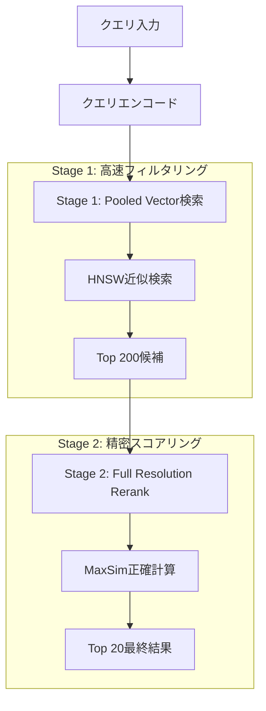

## ブログ概要（Summary）

本記事は [Optimizing ColPali for Retrieval at Scale](https://qdrant.tech/blog/colpali-qdrant-optimization/)（Qdrant公式ブログ）の解説記事です。

Qdrant公式ブログ（著者: Evgeniya Sukhodolskaya, Sabrina Aquino、2024年11月27日公開）は、ColPaliが1ページあたり約1,030ベクトルを生成する問題に対し、row-wise mean poolingで38ベクトルに削減し、2段階検索パイプライン（pooledベクトルによるHNSW近似検索 + フル解像度MaxSimによるreranking）を構築することで、NDCG@20=0.952を維持しながら検索速度を13倍に向上させる手法を提案している。20,000ページ規模のベンチマークで、max poolingがNDCG@20=0.759まで劣化するのに対し、mean poolingは元のColPaliとほぼ同等の品質を達成することが報告されている。

この記事は [Zenn記事: ColQwen2×vLLMで図表込み社内マニュアル検索を構築する](https://zenn.dev/0h_n0/articles/6e33a242d347f9) の深掘りです。

## Zenn記事との関連

Zenn記事ではColQwen2とvLLMを用いた社内マニュアル検索システムの構築に焦点を当てているが、ColPaliモデルが生成するmulti-vectorの大量性は運用上の課題となる。本ブログはこの課題に対するQdrant公式の最適化戦略を提供しており、Zenn記事の検索パイプラインをスケーラブルに拡張する際の設計指針として直接活用できる。

## 情報源

- **種別**: 企業テックブログ
- **URL**: [https://qdrant.tech/blog/colpali-qdrant-optimization/](https://qdrant.tech/blog/colpali-qdrant-optimization/)
- **組織**: Qdrant
- **著者**: Evgeniya Sukhodolskaya, Sabrina Aquino
- **発表日**: 2024年11月27日

## 技術的背景（Technical Background）

### ColPaliのmulti-vector表現とMaxSim

ColPali（Faysse et al., 2024）は、Vision Language Model（VLM）を用いてドキュメントページの画像を直接エンコードし、ページ内の各パッチに対応するベクトルを生成するlate interaction型の検索モデルである。従来のOCR + テキスト埋め込みパイプラインとは異なり、図表・レイアウト情報を含む視覚的特徴をそのまま検索に利用できる。

ColPaliの類似度計算にはMaxSim（Maximum Similarity）演算が用いられる。クエリベクトル集合$Q = \{q_1, q_2, \ldots, q_m\}$とドキュメントベクトル集合$D = \{d_1, d_2, \ldots, d_n\}$に対して、MaxSimスコアは以下のように定義される。

$$
\text{MaxSim}(Q, D) = \sum_{i=1}^{m} \max_{j \in \{1, \ldots, n\}} \text{sim}(q_i, d_j)
$$

ここで、
- $q_i$: クエリの$i$番目のトークンベクトル（128次元）
- $d_j$: ドキュメントの$j$番目のパッチベクトル（128次元）
- $\text{sim}(\cdot, \cdot)$: コサイン類似度またはドット積
- $m$: クエリトークン数
- $n$: ドキュメントパッチ数（ColPaliでは約1,030）

この演算は各クエリトークンに対して全ドキュメントベクトルとの最大類似度を求めるため、計算量は$O(m \times n)$となる。

### スケーラビリティの課題

ブログでは、ColPaliが1ページあたり約1,030ベクトルを生成すると報告している。この内訳は以下の通りである。

- **画像パッチベクトル**: 32 × 32 = 1,024ベクトル（画像を32×32グリッドに分割）
- **特殊トークンベクトル**: 6ベクトル（シーケンス開始トークン、タスク指示トークン等）

20,000ページ規模のコレクションでは、約2,060万ベクトル（20,000 × 1,030）が格納される。ブログによれば、128次元ベクトルでの全探索は約$2.56 \times 10^{12}$回の比較を要し、現実的な応答時間での検索が困難となる。

MaxSimはHNSWなどの近似最近傍探索（ANN）と直接互換性がないことも重大な課題である。HNSWは単一ベクトル間の距離に基づくグラフ構造を前提とするが、MaxSimはクエリ・ドキュメント間の多対多比較を必要とする。この構造的不一致が、ColPaliの大規模デプロイを阻む根本原因となっている。

## 実装アーキテクチャ（Architecture）

### 2段階検索パイプライン

ブログでは、上記の課題に対する解決策として2段階検索パイプラインを提案している。



**Stage 1（高速フィルタリング）**: pooledベクトル（38ベクトル/ページ）に対してHNSW近似検索を実行し、上位200件の候補を取得する。pooledベクトルはHNSWインデックスとの互換性があるため、$O(\log N)$の計算量で高速に候補を絞り込める。

**Stage 2（精密スコアリング）**: Stage 1で取得した200件の候補に対して、元のフル解像度ベクトル（1,030ベクトル/ページ）を用いてMaxSimスコアを正確に計算し、最終的な上位20件を返す。候補が200件に限定されているため、MaxSimの計算コストは許容範囲に収まる。

### Pooling戦略の詳細

ブログでは、1,030ベクトルを38ベクトルに圧縮するrow-wise pooling戦略を検証している。32×32の画像パッチグリッドに対して、行方向（row-wise）にプーリングを適用し、32行分のベクトルを生成する。これに6つの特殊トークンベクトルをそのまま保持して合計38ベクトルとする。

ブログでは2種類のプーリング関数が検証されている。

**Mean Pooling（平均プーリング）**: グリッドの各行$r$に含む32個のベクトルの平均を取る。

$$
\mathbf{v}_r^{\text{mean}} = \frac{1}{|\mathcal{C}_r|} \sum_{j \in \mathcal{C}_r} \mathbf{d}_j
$$

ここで、
- $\mathbf{v}_r^{\text{mean}}$: 行$r$のpooledベクトル（128次元）
- $\mathcal{C}_r$: 行$r$に属するパッチベクトルのインデックス集合（$|\mathcal{C}_r| = 32$）
- $\mathbf{d}_j$: 元のパッチベクトル

**Max Pooling（最大プーリング）**: 各次元について行内の最大値を選択する。

$$
\mathbf{v}_r^{\text{max}}[k] = \max_{j \in \mathcal{C}_r} \mathbf{d}_j[k], \quad k = 1, \ldots, 128
$$

ここで$\mathbf{v}_r^{\text{max}}[k]$は、pooledベクトルの$k$番目の次元の値を表す。

ブログの実験結果では、mean poolingがmax poolingを大幅に上回る品質を達成している。max poolingは各次元の最大値のみを保持するため、パッチ間の平均的な意味情報が失われ、MaxSimスコアの計算精度が低下する。一方、mean poolingは行内のベクトルの重心を保持するため、元のベクトル分布の代表性が維持される。

### Qdrantコレクション設計

ブログの手法をQdrantで実装する場合、multi-vectorフィールドを活用したコレクション設計が必要となる。以下に、ブログの2段階パイプラインをQdrant上で実現するためのコレクション構成を示す。

```python
from qdrant_client import QdrantClient
from qdrant_client.models import (
    Distance,
    HnswConfigDiff,
    MultiVectorConfig,
    MultiVectorComparator,
    VectorParams,
)


def create_colpali_collection(
    client: QdrantClient,
    collection_name: str,
) -> None:
    """ColPaliの2段階検索用コレクションを作成する。

    3つのベクトルフィールドを定義:
    - original: フル解像度ベクトル（1,030個/ページ、on_disk + HNSW無効）
    - pooled_rows: row-wise mean pooledベクトル（32個/ページ、HNSW有効）
    - special_tokens: 特殊トークンベクトル（6個/ページ、HNSW有効）

    Args:
        client: Qdrantクライアント
        collection_name: コレクション名
    """
    client.create_collection(
        collection_name=collection_name,
        vectors_config={
            # Stage 2用: フル解像度ベクトル（ディスク格納、HNSW無効）
            "original": VectorParams(
                size=128,
                distance=Distance.COSINE,
                multivector_config=MultiVectorConfig(
                    comparator=MultiVectorComparator.MAX_SIM,
                ),
                hnsw_config=HnswConfigDiff(m=0),  # HNSWインデックス無効化
                on_disk=True,  # メモリ節約のためディスク格納
            ),
            # Stage 1用: row-wise mean pooledベクトル（HNSW有効）
            "pooled_rows": VectorParams(
                size=128,
                distance=Distance.COSINE,
                multivector_config=MultiVectorConfig(
                    comparator=MultiVectorComparator.MAX_SIM,
                ),
            ),
            # Stage 1用: 特殊トークンベクトル（HNSW有効）
            "special_tokens": VectorParams(
                size=128,
                distance=Distance.COSINE,
                multivector_config=MultiVectorConfig(
                    comparator=MultiVectorComparator.MAX_SIM,
                ),
            ),
        },
    )
```

設計上の要点は以下の通りである。

1. **`hnsw_config.m=0`**: originalフィールドのHNSWインデックスを無効化する。Stage 2ではreranking対象が200件に限定されるため、HNSWグラフは不要であり、インデックス構築のメモリ・時間コストを削減できる
2. **`on_disk=True`**: フル解像度ベクトルはディスクに格納し、RAMを圧迫しない。Stage 2のreranking時にのみディスクから読み出す
3. **multi-vectorフィールド分離**: pooled_rowsとspecial_tokensを分離することで、Stage 1のHNSWインデックスサイズを最小化する

### Mean Pooling実装

ブログの手法に基づくmean pooling処理の実装を以下に示す。

```python
import numpy as np
from numpy.typing import NDArray


def apply_row_wise_mean_pooling(
    patch_vectors: NDArray[np.float32],
    grid_size: int = 32,
    num_special_tokens: int = 6,
) -> tuple[NDArray[np.float32], NDArray[np.float32]]:
    """ColPaliのパッチベクトルにrow-wise mean poolingを適用する。

    32x32グリッドのパッチベクトルを行方向に平均化し、
    32個のpooledベクトルと6個の特殊トークンベクトルを返す。

    Args:
        patch_vectors: ColPali出力ベクトル (1030, 128)
        grid_size: グリッドサイズ (デフォルト: 32)
        num_special_tokens: 特殊トークン数 (デフォルト: 6)

    Returns:
        pooled_rows: row-wise平均ベクトル (32, 128)
        special_tokens: 特殊トークンベクトル (6, 128)

    Raises:
        ValueError: 入力ベクトル数が期待値と一致しない場合
    """
    expected_total = grid_size * grid_size + num_special_tokens
    if patch_vectors.shape[0] != expected_total:
        raise ValueError(
            f"Expected {expected_total} vectors, got {patch_vectors.shape[0]}"
        )

    # 特殊トークンを分離（先頭6ベクトル）
    special_tokens = patch_vectors[:num_special_tokens]  # (6, 128)

    # 画像パッチベクトルを取得
    image_patches = patch_vectors[num_special_tokens:]  # (1024, 128)

    # 32x32グリッドに reshape
    grid = image_patches.reshape(grid_size, grid_size, -1)  # (32, 32, 128)

    # row-wise mean pooling
    pooled_rows = grid.mean(axis=1)  # (32, 128)

    return pooled_rows, special_tokens


def compute_maxsim_score(
    query_vectors: NDArray[np.float32],
    doc_vectors: NDArray[np.float32],
) -> float:
    """MaxSimスコアを計算する。

    各クエリベクトルに対してドキュメントベクトルとの最大コサイン類似度を求め、
    その総和をスコアとする。

    Args:
        query_vectors: クエリベクトル (m, 128)
        doc_vectors: ドキュメントベクトル (n, 128)

    Returns:
        MaxSimスコア
    """
    # L2正規化
    q_norm = query_vectors / np.linalg.norm(
        query_vectors, axis=1, keepdims=True
    )
    d_norm = doc_vectors / np.linalg.norm(
        doc_vectors, axis=1, keepdims=True
    )

    # コサイン類似度行列 (m, n)
    similarity_matrix = q_norm @ d_norm.T

    # 各クエリトークンの最大類似度を合計
    max_similarities = similarity_matrix.max(axis=1)  # (m,)
    return float(max_similarities.sum())
```

### 2段階検索パイプラインの実装

Stage 1とStage 2を組み合わせた検索パイプラインの実装例を以下に示す。

```python
from dataclasses import dataclass

import numpy as np
from numpy.typing import NDArray
from qdrant_client import QdrantClient
from qdrant_client.models import (
    Prefetch,
    QueryRequest,
    FusionQuery,
    Fusion,
)


@dataclass(frozen=True)
class SearchResult:
    """検索結果を表すデータクラス。

    Attributes:
        page_id: ページの一意識別子
        score: MaxSimスコア
    """

    page_id: str
    score: float


def two_stage_search(
    client: QdrantClient,
    collection_name: str,
    query_vectors: NDArray[np.float32],
    stage1_limit: int = 200,
    stage2_limit: int = 20,
) -> list[SearchResult]:
    """2段階検索パイプラインを実行する。

    Stage 1: pooledベクトルでHNSW近似検索 → 上位stage1_limit件
    Stage 2: フル解像度ベクトルでMaxSim rerank → 上位stage2_limit件

    Args:
        client: Qdrantクライアント
        collection_name: コレクション名
        query_vectors: クエリベクトル (m, 128)
        stage1_limit: Stage 1の候補数 (デフォルト: 200)
        stage2_limit: 最終結果数 (デフォルト: 20)

    Returns:
        MaxSimスコア降順の検索結果リスト
    """
    results = client.query_points(
        collection_name=collection_name,
        prefetch=[
            # Stage 1: pooled_rowsフィールドでHNSW検索
            Prefetch(
                query=query_vectors.tolist(),
                using="pooled_rows",
                limit=stage1_limit,
            ),
            # Stage 1: special_tokensフィールドでHNSW検索
            Prefetch(
                query=query_vectors.tolist(),
                using="special_tokens",
                limit=stage1_limit,
            ),
        ],
        # Stage 1の結果をRRFで統合
        query=FusionQuery(fusion=Fusion.RRF),
        # Stage 2: originalフィールドでMaxSim rerank
        using="original",
        limit=stage2_limit,
    )

    return [
        SearchResult(
            page_id=str(point.id),
            score=point.score,
        )
        for point in results.points
    ]
```

## Production Deployment Guide

### AWS実装パターン（コスト最適化重視）

ColPali + Qdrantの2段階検索パイプラインをAWS上にデプロイする際の構成を、トラフィック量別に示す。以下はAWS東京リージョン（ap-northeast-1）における2026年8月時点の概算値であり、実際のコストはトラフィックパターンやリージョンにより変動する。最新料金はAWS料金計算ツールで確認を推奨する。

| 構成 | トラフィック | 主要サービス | 月額概算 |
|------|------------|-------------|---------|
| Small | ~100 req/日 | ECS Fargate (Qdrant) + Lambda (クエリ処理) | $200-400 |
| Medium | ~1,000 req/日 | ECS Fargate (Qdrant + GPU推論) + ALB | $800-1,500 |
| Large | 10,000+ req/日 | EKS + Karpenter + Qdrant Cluster + GPU Spot | $3,000-6,000 |

**Small構成（~100 req/日）**: ECS Fargate上でQdrant単一ノードを稼働させ、GPU推論はバッチ処理で事前にベクトルを生成しておく。クエリ時はLambdaでQdrantへのAPI呼び出しを実行する。Fargateタスク（4 vCPU, 16 GB RAM）で20,000ページ規模のインデックスを保持可能。月額内訳: Fargate $120, Lambda $5, S3 $10, NAT Gateway $50, その他 $15-215。

**Medium構成（~1,000 req/日）**: GPU推論サーバー（g5.xlarge, 1x A10G）をECS上で稼働させ、リアルタイムのクエリエンコードに対応する。Qdrantはr6g.xlarge（4 vCPU, 32 GB RAM）で稼働。月額内訳: GPU推論 $400-700（Spot活用時）, Qdrant Fargate $200, ALB $30, その他 $170-570。

**Large構成（10,000+ req/日）**: EKS上でQdrantクラスタ（3ノード、シャーディング）とGPU推論サーバー（g5.2xlarge × 2, Spot Instances）を運用する。Karpenterによる自動スケーリングでトラフィック変動に対応。月額内訳: EKS コントロールプレーン $75, GPU Spot $800-1,200, Qdrant ノード $600-900, ALB/NLB $50, 監視 $100, その他 $1,375-3,675。

**コスト削減テクニック**:

- **Spot Instances活用**: GPU推論サーバーにSpot Instancesを使用し、オンデマンド比で最大70-90%削減
- **ベクトルのon_disk格納**: originalフィールドをディスクに配置し、メモリコストを削減（ブログ手法のhnsw_config.m=0と組み合わせ）
- **バッチエンコード**: ドキュメント追加時のGPUエンコードを夜間バッチで実行し、Spot中断の影響を最小化
- **Reserved Instances**: Qdrantノードは常時稼働のため、1年RIで最大40%削減

### Terraformインフラコード

**Small構成（Serverless + Fargate）**:

```hcl
# ColPali 2段階検索 — Small構成 (Fargate + Lambda)
# AWS ap-northeast-1, 2026-08

terraform {
  required_version = ">= 1.9"
  required_providers {
    aws = {
      source  = "hashicorp/aws"
      version = "~> 5.60"
    }
  }
}

provider "aws" {
  region = "ap-northeast-1"
}

# --- VPC基盤（NAT Gateway 1AZ でコスト削減） ---
module "vpc" {
  source  = "terraform-aws-modules/vpc/aws"
  version = "~> 5.13"

  name = "colpali-search-vpc"
  cidr = "10.0.0.0/16"

  azs             = ["ap-northeast-1a", "ap-northeast-1c"]
  private_subnets = ["10.0.1.0/24", "10.0.2.0/24"]
  public_subnets  = ["10.0.101.0/24", "10.0.102.0/24"]

  enable_nat_gateway     = true
  single_nat_gateway     = true  # コスト削減: 1AZのみ
  enable_dns_hostnames   = true
}

# --- ECS クラスタ (Qdrant) ---
resource "aws_ecs_cluster" "qdrant" {
  name = "colpali-qdrant"

  setting {
    name  = "containerInsights"
    value = "enabled"
  }
}

# --- Qdrant Fargate タスク定義 ---
resource "aws_ecs_task_definition" "qdrant" {
  family                   = "qdrant-server"
  network_mode             = "awsvpc"
  requires_compatibilities = ["FARGATE"]
  cpu                      = "4096"   # 4 vCPU
  memory                   = "16384"  # 16 GB — 20kページのpooledインデックス保持
  execution_role_arn       = aws_iam_role.ecs_execution.arn
  task_role_arn            = aws_iam_role.ecs_task.arn

  container_definitions = jsonencode([{
    name  = "qdrant"
    image = "qdrant/qdrant:v1.13.2"
    portMappings = [{
      containerPort = 6333
      protocol      = "tcp"
    }]
    mountPoints = [{
      sourceVolume  = "qdrant-data"
      containerPath = "/qdrant/storage"
    }]
    logConfiguration = {
      logDriver = "awslogs"
      options = {
        "awslogs-group"         = aws_cloudwatch_log_group.qdrant.name
        "awslogs-region"        = "ap-northeast-1"
        "awslogs-stream-prefix" = "qdrant"
      }
    }
  }])

  volume {
    name = "qdrant-data"
    efs_volume_configuration {
      file_system_id = aws_efs_file_system.qdrant.id
    }
  }
}

# --- EFS (Qdrant永続ストレージ) ---
resource "aws_efs_file_system" "qdrant" {
  encrypted  = true  # KMS暗号化
  kms_key_id = aws_kms_key.qdrant.arn

  tags = { Name = "colpali-qdrant-storage" }
}

resource "aws_kms_key" "qdrant" {
  description = "KMS key for Qdrant EFS encryption"
}

# --- IAM ロール (最小権限) ---
resource "aws_iam_role" "ecs_execution" {
  name = "colpali-ecs-execution"
  assume_role_policy = jsonencode({
    Version = "2012-10-17"
    Statement = [{
      Action    = "sts:AssumeRole"
      Effect    = "Allow"
      Principal = { Service = "ecs-tasks.amazonaws.com" }
    }]
  })
}

resource "aws_iam_role_policy_attachment" "ecs_execution" {
  role       = aws_iam_role.ecs_execution.name
  policy_arn = "arn:aws:iam::aws:policy/service-role/AmazonECSTaskExecutionRolePolicy"
}

resource "aws_iam_role" "ecs_task" {
  name = "colpali-ecs-task"
  assume_role_policy = jsonencode({
    Version = "2012-10-17"
    Statement = [{
      Action    = "sts:AssumeRole"
      Effect    = "Allow"
      Principal = { Service = "ecs-tasks.amazonaws.com" }
    }]
  })
}

# --- CloudWatch ---
resource "aws_cloudwatch_log_group" "qdrant" {
  name              = "/ecs/colpali-qdrant"
  retention_in_days = 30
}

resource "aws_cloudwatch_metric_alarm" "qdrant_cpu" {
  alarm_name          = "colpali-qdrant-high-cpu"
  comparison_operator = "GreaterThanThreshold"
  evaluation_periods  = 3
  metric_name         = "CPUUtilization"
  namespace           = "AWS/ECS"
  period              = 300
  statistic           = "Average"
  threshold           = 80
  alarm_actions       = [aws_sns_topic.alerts.arn]

  dimensions = {
    ClusterName = aws_ecs_cluster.qdrant.name
    ServiceName = "qdrant-service"
  }
}

resource "aws_sns_topic" "alerts" {
  name = "colpali-search-alerts"
}
```

**Large構成（EKS + Karpenter + GPU Spot）**:

```hcl
# ColPali 2段階検索 — Large構成 (EKS + Karpenter)
# AWS ap-northeast-1, 2026-08

module "eks" {
  source  = "terraform-aws-modules/eks/aws"
  version = "~> 20.24"

  cluster_name    = "colpali-search"
  cluster_version = "1.31"
  vpc_id          = module.vpc.vpc_id
  subnet_ids      = module.vpc.private_subnets

  # コントロールプレーンのみ ($75/月)
  cluster_endpoint_public_access = false
}

# --- Karpenter (GPU Spot 優先) ---
resource "kubectl_manifest" "karpenter_gpu_nodepool" {
  yaml_body = yamlencode({
    apiVersion = "karpenter.sh/v1"
    kind       = "NodePool"
    metadata   = { name = "colpali-gpu" }
    spec = {
      template = {
        spec = {
          requirements = [
            { key = "node.kubernetes.io/instance-type", operator = "In",
              values = ["g5.xlarge", "g5.2xlarge"] },
            { key = "karpenter.sh/capacity-type", operator = "In",
              values = ["spot", "on-demand"] },  # Spot優先
            { key = "topology.kubernetes.io/zone", operator = "In",
              values = ["ap-northeast-1a", "ap-northeast-1c"] },
          ]
          nodeClassRef = {
            group = "karpenter.k8s.aws"
            kind  = "EC2NodeClass"
            name  = "default"
          }
        }
      }
      limits   = { cpu = "32", "nvidia.com/gpu" = "4" }
      disruption = {
        consolidationPolicy = "WhenEmptyOrUnderutilized"
        consolidateAfter    = "60s"
      }
    }
  })
}

# --- Qdrant StatefulSet (3ノードクラスタ) ---
resource "kubectl_manifest" "qdrant_statefulset" {
  yaml_body = yamlencode({
    apiVersion = "apps/v1"
    kind       = "StatefulSet"
    metadata   = { name = "qdrant", namespace = "colpali" }
    spec = {
      replicas    = 3
      serviceName = "qdrant"
      selector    = { matchLabels = { app = "qdrant" } }
      template = {
        metadata = { labels = { app = "qdrant" } }
        spec = {
          containers = [{
            name  = "qdrant"
            image = "qdrant/qdrant:v1.13.2"
            ports = [{ containerPort = 6333 }, { containerPort = 6335 }]
            resources = {
              requests = { cpu = "2", memory = "16Gi" }
              limits   = { cpu = "4", memory = "32Gi" }
            }
            volumeMounts = [{
              name      = "qdrant-storage"
              mountPath = "/qdrant/storage"
            }]
          }]
        }
      }
      volumeClaimTemplates = [{
        metadata = { name = "qdrant-storage" }
        spec = {
          accessModes      = ["ReadWriteOnce"]
          storageClassName = "gp3"
          resources        = { requests = { storage = "100Gi" } }
        }
      }]
    }
  })
}

# --- AWS Budgets (月額アラート) ---
resource "aws_budgets_budget" "monthly" {
  name         = "colpali-search-monthly"
  budget_type  = "COST"
  limit_amount = "5000"
  limit_unit   = "USD"
  time_unit    = "MONTHLY"

  notification {
    comparison_operator       = "GREATER_THAN"
    threshold                 = 80
    threshold_type            = "PERCENTAGE"
    notification_type         = "ACTUAL"
    subscriber_email_addresses = ["ops-team@example.com"]
  }
}
```

### 運用・監視設定

**CloudWatch Logs Insights クエリ（検索レイテンシ分析）**:

```
# Stage 1 / Stage 2 のレイテンシ分布
fields @timestamp, stage, latency_ms, num_candidates
| filter event = "colpali_search"
| stats
    avg(latency_ms) as avg_ms,
    pct(latency_ms, 95) as p95_ms,
    pct(latency_ms, 99) as p99_ms,
    count(*) as req_count
  by stage
| sort stage asc
```

**CloudWatchアラーム設定（Python boto3）**:

```python
import boto3


def create_search_latency_alarm(
    cloudwatch: boto3.client,
    sns_topic_arn: str,
    threshold_ms: float = 500.0,
) -> None:
    """検索レイテンシのCloudWatchアラームを作成する。

    P95レイテンシが閾値を超えた場合にSNS通知を送信する。

    Args:
        cloudwatch: CloudWatchクライアント
        sns_topic_arn: 通知先SNSトピックARN
        threshold_ms: アラーム閾値（ミリ秒）
    """
    cloudwatch.put_metric_alarm(
        AlarmName="colpali-search-p95-latency",
        MetricName="SearchLatencyP95",
        Namespace="ColPali/Search",
        Statistic="Average",
        Period=300,
        EvaluationPeriods=3,
        Threshold=threshold_ms,
        ComparisonOperator="GreaterThanThreshold",
        AlarmActions=[sns_topic_arn],
        Dimensions=[
            {"Name": "Pipeline", "Value": "two-stage-rerank"},
        ],
    )
```

**X-Ray トレーシング設定（Python）**:

```python
from aws_xray_sdk.core import xray_recorder, patch_all

# boto3/requests等を自動計装
patch_all()


@xray_recorder.capture("two_stage_search")
def traced_two_stage_search(
    query_vectors: list[list[float]],
    collection_name: str,
) -> list[dict]:
    """X-Rayトレース付き2段階検索。

    Args:
        query_vectors: クエリベクトルのリスト
        collection_name: Qdrantコレクション名

    Returns:
        検索結果のリスト
    """
    subsegment = xray_recorder.current_subsegment()
    if subsegment:
        subsegment.put_annotation("collection", collection_name)
        subsegment.put_metadata("query_dim", len(query_vectors))

    # Stage 1
    with xray_recorder.in_subsegment("stage1_hnsw"):
        candidates = _stage1_pooled_search(query_vectors, collection_name)

    # Stage 2
    with xray_recorder.in_subsegment("stage2_maxsim_rerank"):
        results = _stage2_rerank(candidates, query_vectors, collection_name)

    return results
```

**Cost Explorer日次レポート（Python）**:

```python
from datetime import date, timedelta

import boto3


def get_daily_cost_report(
    ce_client: boto3.client,
    sns_client: boto3.client,
    sns_topic_arn: str,
    alert_threshold_usd: float = 100.0,
) -> dict:
    """日次コストレポートを取得し、閾値超過時にSNS通知する。

    Args:
        ce_client: Cost Explorerクライアント
        sns_client: SNSクライアント
        sns_topic_arn: 通知先SNSトピックARN
        alert_threshold_usd: アラート閾値（USD/日）

    Returns:
        サービス別コスト辞書
    """
    today = date.today()
    yesterday = today - timedelta(days=1)

    response = ce_client.get_cost_and_usage(
        TimePeriod={
            "Start": yesterday.isoformat(),
            "End": today.isoformat(),
        },
        Granularity="DAILY",
        Metrics=["UnblendedCost"],
        GroupBy=[{"Type": "DIMENSION", "Key": "SERVICE"}],
        Filter={
            "Tags": {
                "Key": "Project",
                "Values": ["colpali-search"],
            }
        },
    )

    costs = {}
    total = 0.0
    for group in response["ResultsByTime"][0]["Groups"]:
        service = group["Keys"][0]
        amount = float(group["Metrics"]["UnblendedCost"]["Amount"])
        costs[service] = amount
        total += amount

    if total > alert_threshold_usd:
        sns_client.publish(
            TopicArn=sns_topic_arn,
            Subject=f"ColPali Search cost alert: ${total:.2f}/day",
            Message=f"Daily cost ${total:.2f} exceeds ${alert_threshold_usd}",
        )

    return costs
```

### コスト最適化チェックリスト

**アーキテクチャ選択**:
- [ ] トラフィック量でServerless/Hybrid/Container構成を判断した
- [ ] GPU推論がリアルタイム必須かバッチ処理可能か検討した
- [ ] Qdrantのmanaged cloud vs self-hostedを比較した

**リソース最適化**:
- [ ] GPU推論サーバーにSpot Instancesを適用（最大70-90%削減）
- [ ] Qdrantノードに1年Reserved Instancesを検討（最大40%削減）
- [ ] Savings Plansで全体コミット割引を検討
- [ ] Fargateタスクのveryfiableリソースサイズを最適化
- [ ] EKS/ECS アイドル時のスケールダウンを設定

**ベクトルストレージ最適化**:
- [ ] originalフィールドをon_disk=Trueに設定（RAM削減）
- [ ] hnsw_config.m=0でoriginalフィールドのHNSW無効化（インデックスメモリ削減）
- [ ] pooledベクトルのみHNSWインデックスを構築（38ベクトル/ページ vs 1,030）
- [ ] 不要なペイロードフィールドをインデックスから除外
- [ ] スカラー量子化（INT8）の適用を検討

**GPU推論コスト削減**:
- [ ] ドキュメントエンコードをバッチ処理（夜間Spot）で実行
- [ ] クエリエンコードのキャッシュ（同一クエリの再計算防止）
- [ ] vLLMのcontinuous batchingで推論スループット最大化
- [ ] モデル量子化（INT4/INT8）で必要GPU数を削減

**監視・アラート**:
- [ ] AWS Budgets: 月額予算アラート設定
- [ ] CloudWatch: 検索レイテンシP95/P99アラーム
- [ ] Cost Anomaly Detection: 日次異常検知有効化
- [ ] 日次コストレポート: SNS通知設定
- [ ] X-Ray: Stage 1/Stage 2のレイテンシトレーシング

**リソース管理**:
- [ ] 未使用EBSボリュームの定期削除
- [ ] Projectタグ戦略でコスト配分を明確化
- [ ] EFSライフサイクルポリシー（30日IA移行）
- [ ] 開発環境の夜間・週末自動停止

## パフォーマンス最適化（Performance）

### 実測値の比較

ブログでは、ViDoRe Benchmark + UFO Dataset + DocVQAの統合データセット（20,000ページ以上、1,000クエリ）で以下の結果が報告されている。

| 手法 | NDCG@20 | Recall@20 | ベクトル数/ページ | 速度比 |
|------|---------|-----------|-----------------|--------|
| ColPali（フル解像度） | ~1.000（基準） | ~1.000（基準） | 1,030 | 1x |
| Mean Pooling + 2段階Rerank | 0.952 | 0.917 | 38（Stage 1） | **13x** |
| Max Pooling | 0.759 | 0.656 | 38 | - |

ブログによれば、mean poolingは元のColPaliとほぼ同等の品質（NDCG@20で約4.8%の低下）を維持しつつ、検索速度を13倍に向上させている。一方、max poolingはNDCG@20が24.1%低下し、実用上の品質要件を満たさない。

### なぜMean PoolingがMax Poolingを上回るのか

この品質差の技術的な背景として、以下の要因が考えられる。

MaxSim演算では、クエリトークンごとにドキュメントベクトルとの最大類似度を求める。mean poolingは行内ベクトルの重心を保持するため、その行が「全体としてどのような意味を持つか」を表現できる。一方、max poolingは各次元の最大値のみを選択するため、異なるベクトルの異なる次元が混合された「実在しないベクトル」が生成される。この結果、max pooledベクトルは元のベクトル空間での意味的な一貫性を失い、MaxSimの計算精度が大幅に低下する。

### ボトルネックとチューニング指針

2段階パイプラインの主なボトルネックは以下の通りである。

1. **Stage 1のHNSW検索**: pooledベクトル数（38 × ページ数）に依存。`hnsw_config.ef_construct`と`hnsw_config.m`のチューニングで再現率と速度のトレードオフを調整可能
2. **Stage 2のMaxSim計算**: 200候補 × 1,030ベクトル × クエリトークン数の計算が必要。GPUアクセラレーションやバッチ化で高速化可能
3. **ディスクI/O**: on_disk=Trueに設定したoriginalフィールドの読み出し。NVMe SSDやメモリマップドファイルで軽減可能

## 運用での学び（Production Lessons）

### pooling戦略の選択基準

ブログの結果から、pooling戦略の選択においては以下の知見が得られる。

1. **mean poolingを既定とする**: max poolingは品質劣化が顕著であり、mean poolingを選択しない理由がほとんどない
2. **column-wise poolingは未検証**: ブログではrow-wise poolingのみが報告されている。ドキュメントのレイアウトが縦方向に情報が分布する場合（縦書き文書等）、column-wise poolingやrow + columnの組み合わせが有効な可能性がある
3. **特殊トークンの保持は必須**: 6つの特殊トークンベクトルはpoolingせずにそのまま保持する。これらはタスク指示やシーケンス境界の情報を含んでおり、検索品質に寄与する

### Stage 1の候補数（prefetch limit）の調整

ブログではStage 1の候補数を200件としているが、この値はデータセットの特性に応じて調整が必要である。候補数を増やすとStage 2の計算コストが線形に増加するが、再現率は向上する。実運用では、100-500の範囲でA/Bテストを行い、レイテンシと品質のバランスを取ることが推奨される。

### インデックス構築時の注意点

20,000ページ規模でpooledベクトルのHNSWインデックスを構築する場合、76万ベクトル（20,000 × 38）のインデックスとなる。これは一般的なベクトルDBの運用規模として十分に現実的であり、数分以内にインデックス構築が完了する。一方、フル解像度ベクトル（2,060万）でHNSWを構築しようとすると、メモリ消費量とインデックス構築時間が30倍近くに膨れ上がる。poolingによるベクトル削減はインデックス構築の実現可能性そのものに影響する。

## 学術研究との関連（Academic Connection）

### ColPali原論文

ColPali（Faysse et al., 2024, arXiv: 2407.01449）は、PaliGemmaをベースとしたVision Language Modelを用いて、ドキュメントページの画像をmulti-vectorにエンコードするlate interaction検索モデルである。ColBERT（Khattab & Zaharia, 2020）のlate interaction手法を視覚ドキュメント検索に応用した点が新規性であり、本ブログのpooling最適化はこの原論文の実用化に不可欠な要素技術を提供している。

### ColBERTとlate interaction

ColBERT（Khattab & Zaharia, 2020, SIGIR 2020）は、テキスト検索におけるlate interaction手法の先駆けである。クエリとドキュメントを独立にエンコードし、MaxSimで類似度を計算する。ColPaliはこのアーキテクチャを視覚領域に拡張したものであり、ブログのpooling戦略はColBERTv2（Santhanam et al., 2022）のresidual compressionと同様に、multi-vectorの圧縮と検索効率のトレードオフを扱っている。

### PLAID（Santhanam et al., 2022）

PLAIDはColBERTのmulti-vectorを効率的に検索するためのエンジンであり、centroid-based pruningとresidual compressionを用いてベクトル数を削減する。ブログのmean pooling手法はPLAIDよりもシンプルなアプローチであり、ベクトルDBのネイティブ機能（HNSWインデックス、prefetch/rerank API）と組み合わせることで実装コストを低く抑えている。

## まとめと実践への示唆

Qdrant公式ブログは、ColPaliの大規模検索における実用的な最適化手法を提示している。row-wise mean poolingによるベクトル数の97.3%削減（1,030 → 38）と2段階検索パイプラインの組み合わせにより、NDCG@20=0.952（元のColPali比約4.8%低下）を維持しつつ13倍の検索速度向上を達成している。

実務への示唆として、以下の3点が挙げられる。

1. **mean poolingの採用**: max poolingではなくmean poolingを選択することで、品質低下を最小限に抑えられる。この知見はColPali以外のmulti-vector検索モデルにも応用可能である
2. **2段階パイプラインの汎用性**: pooledベクトルによる粗いフィルタリング + フル解像度ベクトルによるrerankingというパターンは、ベクトルDB上で効率的に実装可能であり、ColBERT系のlate interactionモデル全般に適用できる
3. **Qdrantのmulti-vectorサポート**: multi-vectorフィールド、prefetch/rerank API、hnsw_config.m=0によるインデックス無効化など、Qdrantのネイティブ機能が2段階パイプラインの実装を容易にしている

## 参考文献

- **Blog URL**: [Optimizing ColPali for Retrieval at Scale, 13x Faster Results](https://qdrant.tech/blog/colpali-qdrant-optimization/)
- **ColPali原論文**: Faysse, M., et al. (2024). ColPali: Efficient Document Retrieval with Vision Language Models. [arXiv:2407.01449](https://arxiv.org/abs/2407.01449)
- **ColBERT**: Khattab, O., & Zaharia, M. (2020). ColBERT: Efficient and Effective Passage Search via Contextualized Late Interaction over BERT. SIGIR 2020. [arXiv:2004.12832](https://arxiv.org/abs/2004.12832)
- **ColBERTv2/PLAID**: Santhanam, K., et al. (2022). ColBERTv2: Effective and Efficient Retrieval via Lightweight Late Interaction. NAACL 2022. [arXiv:2112.01488](https://arxiv.org/abs/2112.01488)
- **ViDoRe Benchmark**: [https://huggingface.co/vidore](https://huggingface.co/vidore)
- **Related Zenn article**: [ColQwen2×vLLMで図表込み社内マニュアル検索を構築する](https://zenn.dev/0h_n0/articles/6e33a242d347f9)
