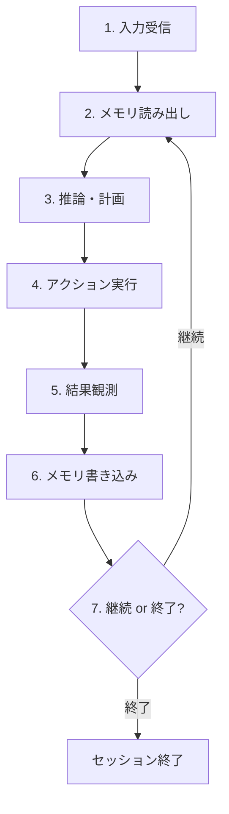

## ブログ概要（Summary）

本記事は [Long-Term Memory Architectures for AI Agents](https://redis.io/blog/long-term-memory-architectures-ai-agents/) の解説記事です。

Redis公式ブログ（著者: Jim Allen Wallace、2026年4月28日公開）は、AIエージェントにおける長期メモリの設計アーキテクチャを体系的に解説している。認知科学の記憶分類（意味記憶・エピソード記憶・手続き記憶）をエージェント設計に応用し、read-before-reasoning / write-after-actingループによるメモリ統合パターンを提示する。さらに、生テキストから検索可能な知識へ変換するパイプライン（チャンキング、埋め込み、検索、統合）の各段階における設計判断と、LOCOMOベンチマークに基づく精度・レイテンシ・コストのトレードオフを定量的に分析している。

この記事は [Zenn記事: Redis×pgvectorでH-MEM階層メモリを実装しCS応答精度を向上させる](https://zenn.dev/0h_n0/articles/19b6cd13ae346b) の深掘りです。

## Zenn記事との関連

Zenn記事ではRedisとpgvectorを組み合わせたH-MEM（階層メモリ）の具体的な実装に焦点を当てているが、本ブログはその背景にあるアーキテクチャ設計の全体像を提供している。Zenn記事で実装した階層メモリが認知科学のどの記憶分類に対応するのか、エージェントのループ内でメモリ読み書きをどこに配置すべきか、メモリ統合（consolidation）の設計指針が解説されている。

## 情報源

- **種別**: 企業テックブログ
- **URL**: [https://redis.io/blog/long-term-memory-architectures-ai-agents/](https://redis.io/blog/long-term-memory-architectures-ai-agents/)
- **組織**: Redis（旧Redis Labs）
- **発表日**: 2026年4月28日（更新: 2026年4月29日）

## 技術的背景（Technical Background）

### なぜAIエージェントに長期メモリが必要なのか

ブログでは、LLMのコンテキストウィンドウの固定長制約とAttention計算量$O(n^2)$が長期メモリを必要とする根本的理由だと述べている。ウィンドウを拡大しても対話履歴は超過し、全文脈入力では無関係な情報を含んだまま推論する必要がある。

永続メモリなしにエージェントが直面する3つの問題は以下の通りである。

1. **セッション間でパーソナライゼーションが消失する**: ユーザーの設定・嗜好が次のセッションで失われる
2. **長期タスクが破綻する**: 複数ステップのワークフローで再開に十分な状態が保持されない
3. **マルチシステムのコンテキストが蒸発する**: CRM・チケット・可観測性スタック等からの情報が毎回コールドスタートで途切れる

これらは「何をどのような形式で記憶すべきか」という設計問題に帰着する。

## 実装アーキテクチャ（Architecture）

### 認知科学に基づくメモリ分類

ブログでは、認知科学の分類（[Packer et al., 2023](https://arxiv.org/abs/2309.02427)を参照）を借用し、長期メモリを3つのカテゴリに分類している。

| メモリ種別 | 定義 | エージェントでの具体例 |
|-----------|------|---------------------|
| **意味記憶（Semantic Memory）** | 時間・文脈に依存しない事実・概念 | ユーザー設定、ドメインルール、要約 |
| **エピソード記憶（Episodic Memory）** | 時間インデックス付きの経験・イベント | 特定の会話ログ、ツール呼び出し履歴 |
| **手続き記憶（Procedural Memory）** | タスク実行のスキル・ルーチン | プロンプトテンプレート、ポリシー、エージェントコード |

ブログでは、プロダクションシステムの多くが3種類すべてを混合して使用し、エピソード記憶が時間経過とともに意味記憶へ統合（consolidation）されるのが一般的だと述べている。

### Read-Before-Reasoning / Write-After-Actingループ

メモリ分類が決まった後の設計課題は、稼働中のエージェント内でそれらをどこに配置するかである。ブログでは、以下の7ステップによるループパターンを提示している。



ステップ2（メモリ読み出し）ではワーキングメモリのロード、長期ストアへのクエリ発行、コンテキストウィンドウの組み立てを行う。ステップ6（メモリ書き込み）ではワーキングメモリの更新、事実の長期ストアへの抽出、古いコンテキストの要約を実行する。

ブログでは、このループは紙面上ではシンプルに見えるが、検索品質と書き込み規律がプロダクションでの成否を分けると指摘している。最も難しいのはコンテキスト組み立て（context assembly）、すなわち「コンテキストウィンドウに入り得る全情報のうち、実際に何を含めるべきか」という判断である。

### 統一メモリプラットフォームとしてのRedis

ブログでは、上記ループをプロダクションで動作させるには、異なるメモリ機能を1つの場所に集約する必要があると述べ、Redisが4つの役割をカバーすると説明している。

| メモリ機能 | Redisでの実現方法 | レイテンシ特性 |
|-----------|-----------------|-------------|
| 短期メモリ | インメモリデータ構造 | サブミリ秒 |
| 長期メモリ | ベクトル検索（Redis Vector Search） | ワークロード・インデックス設定依存 |
| 操作状態 | Hash / JSON | サブミリ秒 |
| 協調制御 | Streams | サブミリ秒 |

マルチエージェント構成では、共有メモリモデルまたはローカルメモリ＋明示的同期のいずれかを選択する。パターンはエージェント間の結合度に依存する。

### 長期メモリパイプライン

ブログでは、生のインタラクションを検索可能な形に変換するパイプラインが必要だと説明している。パイプラインは以下の4段階で構成される。


#### 1. チャンキング（Ingestion & Chunking）

会話、ドキュメント、インタラクションログなどの生入力をセグメントに分割し、各セグメントにベクトル埋め込みを付与する。ブログでは、チャンキングの粒度が検索品質に対してチームが予想する以上に大きな影響を与えると指摘している。

- **小さなチャンク**: 精度は向上するが、一貫した推論がチャンク境界で分断される可能性がある
- **大きなチャンク**: 文脈は保持されるが、無関係な情報でシグナルが希釈される

チャンキングと埋め込みが洞察を異なる表現にしてしまい、的外れな断片が検索される失敗モードも存在する。

#### 2. 埋め込みとインデックス（Embedding & Indexing）

テキスト埋め込みにより、チャンクが固定サイズのベクトルに変換され、意味的に類似したテキストがベクトル空間上で近接する。これらのベクトルはHNSW（Hierarchical Navigable Small World）などのANN構造でインデックス化される。HNSWの探索では、クエリベクトル$\mathbf{q}$に対して距離関数$d(\mathbf{q}, \mathbf{v}_i)$が最小となるベクトル集合を近似的に求める。

$$
\text{ANN}(\mathbf{q}) = \arg\min_{\mathbf{v}_i \in \mathcal{V}} d(\mathbf{q}, \mathbf{v}_i)
$$

ここで$\mathcal{V}$はインデックス済みベクトル集合、$d$はコサイン距離やL2距離である。

#### 3. 検索（Retrieval）

ブログでは、ハイブリッド検索がデフォルトとして最も強力だと述べている。約25,000件のQAペアを対象とした評価（[Seo et al., 2025](https://arxiv.org/html/2511.04696v1)）では、用語ベース検索と密検索の組み合わせが、いずれか単独より高い性能を示した。また、8つの会話データセットを対象とした別の研究（[arXiv:2602.09552](https://arxiv.org/html/2602.09552v1)）でも、ハイブリッド手法がバニラRAGに対して同様の優位性を報告している。

```python
from typing import Any


def hybrid_search(
    query: str,
    vector_index: Any,
    text_index: Any,
    alpha: float = 0.7,
    top_k: int = 10,
) -> list[dict]:
    """ベクトル検索とキーワード検索をRRFで統合するハイブリッド検索

    Args:
        query: 検索クエリ文字列
        vector_index: ベクトルインデックス（Redis Vector Search等）
        text_index: 全文検索インデックス（Redis FT.SEARCH等）
        alpha: ベクトル検索の重み (0-1)
        top_k: 返却する上位結果数

    Returns:
        統合スコアでソートされた検索結果リスト
    """
    vector_results = vector_index.search(query, top_k=top_k * 2)
    keyword_results = text_index.search(query, top_k=top_k * 2)

    # Reciprocal Rank Fusion (k=60) によるスコア統合
    scores: dict[str, float] = {}
    for rank, r in enumerate(vector_results):
        scores[r.doc_id] = scores.get(r.doc_id, 0) + alpha / (60 + rank)
    for rank, r in enumerate(keyword_results):
        scores[r.doc_id] = scores.get(r.doc_id, 0) + (1 - alpha) / (60 + rank)

    ranked = sorted(scores.items(), key=lambda x: x[1], reverse=True)
    return [{"doc_id": did, "score": s} for did, s in ranked[:top_k]]
```

#### 4. メモリ統合（Memory Consolidation）

統合なしではメモリストアが無限に肥大し、検索品質が経時的に劣化する。一般的な手法では、メモリを新しさ（recency）、重要度（importance）、関連性（relevance）でスコアリングし、エピソード記憶を意味記憶に蒸留する。

$$
\text{score}(m) = w_r \cdot \text{recency}(m) + w_i \cdot \text{importance}(m) + w_q \cdot \text{relevance}(m, q)
$$

ここで、$m$はメモリエントリ、$q$は現在のクエリ、$w_r, w_i, w_q$はそれぞれ新しさ・重要度・関連性の重み係数である。

## Production Deployment Guide

ブログで解説されているメモリアーキテクチャをAWS上で実装する際の構成パターンを示す。

### AWS実装パターン（コスト最適化重視）

Redis長期メモリパイプラインを中心としたAWS構成を、トラフィック量別に整理する。

| 構成 | 対象規模 | 主要サービス | 月額概算 |
|------|---------|------------|---------|
| Small | ~100 req/日 | Lambda + ElastiCache Serverless + Bedrock | $80-200 |
| Medium | ~1,000 req/日 | ECS Fargate + ElastiCache (r7g.large) + Bedrock | $400-900 |
| Large | 10,000+ req/日 | EKS + ElastiCache Cluster (r7g.xlarge x3) + Bedrock | $2,500-6,000 |

**Small構成の内訳**（2026年8月時点、ap-northeast-1概算）:
- Lambda: 月100万リクエスト無料枠内、超過分$0.20/100万リクエスト
- ElastiCache Serverless: データ量依存、最低$0.125/ECPU-h
- Bedrock (Claude Sonnet): $3/MTok入力、$15/MTok出力
- DynamoDB (On-Demand): セッション管理用、$1.25/WCU-h

**コスト削減テクニック**:
- ElastiCache Reserved Nodes: 1年コミットで最大33%削減
- Bedrock Batch API: 非同期メモリ統合処理で50%削減
- Prompt Caching有効化: システムプロンプト+メモリコンテキストのキャッシュで30-90%削減
- Lambda Provisioned Concurrency: コールドスタート回避（ただしコスト増）

コスト試算は2026年8月時点のap-northeast-1料金に基づく概算値であり、実際のコストはトラフィックパターンにより変動する。

### Terraformインフラコード

**Small構成（Serverless）**: Lambda + ElastiCache Serverless + DynamoDB

```hcl
# --- ElastiCache Serverless（ベクトル検索用、KMS暗号化） ---
resource "aws_elasticache_serverless_cache" "memory_store" {
  engine               = "redis"
  name                 = "agent-memory"
  major_engine_version = "7"
  subnet_ids           = module.vpc.private_subnets
  security_group_ids   = [aws_security_group.redis_sg.id]
  kms_key_id           = aws_kms_key.redis_key.arn
}

# --- Lambda関数（メモリ読み書きエンドポイント） ---
resource "aws_lambda_function" "memory_handler" {
  function_name = "agent-memory-handler"
  runtime       = "python3.12"
  handler       = "handler.lambda_handler"
  role          = aws_iam_role.agent_lambda.arn
  timeout       = 30
  memory_size   = 512

  environment {
    variables = {
      REDIS_URL          = aws_elasticache_serverless_cache.memory_store.endpoint[0].address
      DYNAMODB_TABLE     = aws_dynamodb_table.sessions.name
      EMBEDDING_MODEL_ID = "amazon.titan-embed-text-v2:0"
    }
  }

  vpc_config {
    subnet_ids         = module.vpc.private_subnets
    security_group_ids = [aws_security_group.lambda_sg.id]
  }

  tracing_config { mode = "Active" }
}

# --- DynamoDB（セッション管理、On-Demand + TTL） ---
resource "aws_dynamodb_table" "sessions" {
  name         = "agent-memory-sessions"
  billing_mode = "PAY_PER_REQUEST"
  hash_key     = "session_id"
  range_key    = "timestamp"

  attribute { name = "session_id"; type = "S" }
  attribute { name = "timestamp";  type = "N" }

  server_side_encryption { enabled = true; kms_key_arn = aws_kms_key.dynamo_key.arn }
  ttl { attribute_name = "expires_at"; enabled = true }
}
```

**Large構成（Container）**: EKS + Karpenter + ElastiCache Cluster

```hcl
# --- EKSクラスタ（プライベートアクセスのみ） ---
module "eks" {
  source  = "terraform-aws-modules/eks/aws"
  version = "~> 20.0"

  cluster_name    = "agent-memory-cluster"
  cluster_version = "1.30"
  vpc_id          = module.vpc.id
  subnet_ids      = module.vpc.private_subnets
  enable_karpenter                = true
  cluster_endpoint_public_access  = false
}

# --- Karpenter NodePool（Spot優先、Graviton対応） ---
resource "kubectl_manifest" "karpenter_nodepool" {
  yaml_body = yamlencode({
    apiVersion = "karpenter.sh/v1"
    kind       = "NodePool"
    metadata   = { name = "agent-memory-pool" }
    spec = {
      template.spec.requirements = [
        { key = "karpenter.sh/capacity-type", operator = "In",
          values = ["spot", "on-demand"] },
        { key = "node.kubernetes.io/instance-type", operator = "In",
          values = ["m7g.large", "m7g.xlarge", "c7g.large"] }
      ]
      limits     = { cpu = "64", memory = "128Gi" }
      disruption = { consolidationPolicy = "WhenEmptyOrUnderutilized" }
    }
  })
}
```

### 運用・監視設定

**CloudWatch Logs Insights クエリ** -- メモリ検索レイテンシの分析:

```
fields @timestamp, @message
| filter event = "memory_retrieval"
| stats avg(duration_ms) as avg_latency,
        pct(duration_ms, 95) as p95_latency,
        pct(duration_ms, 99) as p99_latency,
        count(*) as total_queries
  by bin(1h)
| sort @timestamp desc
```

**X-Ray トレーシング設定**:

```python
from aws_xray_sdk.core import xray_recorder, patch_all

patch_all()  # boto3自動計装

@xray_recorder.capture("memory_read")
def memory_read(session_id: str, query: str) -> list[dict]:
    """メモリ読み出しをX-Rayでトレースする"""
    subsegment = xray_recorder.current_subsegment()
    subsegment.put_annotation("session_id", session_id)
    results = vector_search(query)
    subsegment.put_metadata("results_count", len(results))
    return results
```

**Cost Explorer自動レポート**: `boto3.client("ce")`の`get_cost_and_usage`でProjectタグによるフィルタリングとサービス別GroupByを設定し、日次コストが$100/日を超過した場合にSNS通知を発行する構成が推奨される。

### コスト最適化チェックリスト

**アーキテクチャ選択**:
- [ ] トラフィック量に応じた構成選択（Small: Serverless / Medium: Hybrid / Large: Container）
- [ ] Redis接続方式の選定（Serverless vs Reserved Node）

**リソース最適化**:
- [ ] EC2/EKS: Spot Instances優先（Karpenter disruption設定）
- [ ] ElastiCache: Reserved Nodes 1年コミットで33%削減
- [ ] Savings Plans: Compute Savings Plans検討
- [ ] Lambda: メモリサイズを512MB-1024MBで最適化（Power Tuning）
- [ ] EKS: Karpenter consolidation有効化でアイドル時スケールダウン

**LLMコスト削減**:
- [ ] Bedrock Batch API: 非同期統合処理に使用で50%削減
- [ ] Prompt Caching有効化: メモリコンテキストのキャッシュ
- [ ] モデル選択ロジック: 統合にはHaiku、推論にはSonnetと使い分け
- [ ] トークン数制限: 検索結果のmax_tokens設定

**監視・アラート**:
- [ ] AWS Budgets: 月次予算アラート（80%/100%閾値）
- [ ] CloudWatch アラーム: Lambda Duration P95、ElastiCache CPU/Memory
- [ ] Cost Anomaly Detection: 日次異常検知
- [ ] 日次コストレポート: Cost Explorer API + SNS通知

**リソース管理**:
- [ ] タグ戦略: Project/Environment/Owner必須
- [ ] DynamoDB TTL: セッションデータの自動期限切れ
- [ ] 開発環境: 夜間・週末のElastiCache/EKS停止
- [ ] CloudWatch Logs: 保持期間を30日に設定

## パフォーマンス最適化（Performance）

### LOCOMOベンチマーク結果

ブログでは、精度とレイテンシ・コストのトレードオフを定量的に示すために、LOCOMOベンチマーク（[Maharana et al., 2025](https://arxiv.org/pdf/2504.19413)）の結果を引用している。

| 手法 | 精度 | P95レイテンシ | トークン数/会話 |
|------|------|-------------|---------------|
| Full-Context | 72.9% | 17.12秒 | 約26,031 |
| Selective External Memory | 66.9% | 1.44秒 | 約1,764 |
| **差分** | **-6.0pt** | **-91%** | **-93%** |

選択的外部メモリ方式は約91%のレイテンシ削減と約93%のトークン削減を達成する一方、精度低下は6ポイントに留まる。ブログでは、多くのプロダクションワークロードにおいてレイテンシを桁違いに削減することが正しい判断だと述べているが、具体的な閾値は誤回答のコストに依存する。

### チューニング指針

メモリパイプラインの最適化ポイントを整理する。

- **チャンクサイズ**: 小さすぎると文脈分断、大きすぎると信号希釈。ドメインに応じた調整が必要
- **検索方式**: ハイブリッド検索（ベクトル + キーワード）をデフォルトとし、単独方式は避ける
- **HNSW設定**: パラメータ$M$（最大辺数）と$\text{efConstruction}$（探索幅）がリコールとレイテンシのバランスを決定
- **統合頻度**: リアルタイム統合はレイテンシに影響するため、バッチ処理との組み合わせが現実的

## 運用での学び（Production Lessons）

### 忘却戦略の未成熟

ブログでは、忘却（forgetting）がメモリシステムにおいて最も未解決な部分だと指摘している。格納と検索は現時点ではエンジニアリングの問題に収束しつつあるが、何を安全に破棄できるかの判断は依然としてオープンな研究課題である（[Zhang et al., 2026](https://arxiv.org/html/2603.07670v1)）。

選択的忘却を誤ると、以下のリスクが生じる。

- **回答品質の低下**: 必要な情報を破棄してしまう
- **ストレージコストの増大**: 不要な情報を保持し続ける
- **陳腐なコンテキストの混入**: 古い情報が新しいセッションに漏れる

ブログでは、研究が改善されるまで明示的な保持ポリシーと統合ルールの設定が必要だと述べている。TTLベースの有効期限、重要度スコアに基づくガベージコレクション、ユーザーによる明示的な削除APIの提供が現実的な対策である。

### マルチエージェント環境でのメモリ設計

ブログでは、共有メモリモデル（協調性が高いが競合リスク）とローカルメモリ＋明示的同期（独立性が高いが一貫性維持コスト）の2パターンを提示している。選択はエージェント間の結合度に依存する。

## 学術研究との関連（Academic Connection）

ブログのメモリ分類は、Packer et al. (2023)（[arXiv:2309.02427](https://arxiv.org/abs/2309.02427)）の認知科学分類を直接応用し、人間の長期記憶と同じ3層構造でエージェントメモリを設計する立場をとっている。

LOCOMOベンチマーク（[arXiv:2504.19413](https://arxiv.org/pdf/2504.19413)）による定量的な精度・レイテンシ比較は、メモリアーキテクチャの設計判断に実証的根拠を与えている。忘却に関しては、[arXiv:2603.07670](https://arxiv.org/html/2603.07670v1)が選択的忘却を主要なオープン問題と位置付けている。

ブログの最後では、[Redis Agent Memory Server](https://github.com/redis/agent-memory-server)をオープンソースのメモリレイヤーとして紹介している。MCP統合、LiteLLMによるマルチプロバイダLLMサポートを特徴とし、本ブログのアーキテクチャパターンを実装したリファレンス実装である。

## まとめと実践への示唆

Redis公式ブログが提示するAIエージェント長期メモリのアーキテクチャは、以下の3つの柱で構成されている。

1. **認知科学に基づく3層メモリ分類**: 意味記憶・エピソード記憶・手続き記憶の区別により、情報の性質に応じた格納・検索戦略を設計できる
2. **Read-before-reasoning / Write-after-actingループ**: メモリの読み書きをエージェントの推論・行動ループに明示的に組み込むことで、文脈の連続性を確保する
3. **4段階パイプライン**: チャンキング、埋め込み・インデックス、検索、統合の各段階における設計判断が検索品質を決定する

LOCOMOベンチマークが示すように、6ポイントの精度低下と引き換えに91%のレイテンシ削減を得られる選択的外部メモリ方式は、多くのプロダクション環境で合理的な選択肢である。ただし、忘却戦略は未成熟であり、明示的な保持ポリシーの設計が不可欠である。

## 参考文献

- **Blog URL**: [https://redis.io/blog/long-term-memory-architectures-ai-agents/](https://redis.io/blog/long-term-memory-architectures-ai-agents/)
- **Redis Agent Memory Server**: [https://github.com/redis/agent-memory-server](https://github.com/redis/agent-memory-server)
- **Related Papers**:
  - Packer et al. (2023). "MemGPT: Towards LLMs as Operating Systems". [arXiv:2309.02427](https://arxiv.org/abs/2309.02427)
  - Maharana et al. (2025). LOCOMO Benchmark. [arXiv:2504.19413](https://arxiv.org/pdf/2504.19413)
  - Zhang et al. (2026). Selective Forgetting. [arXiv:2603.07670](https://arxiv.org/html/2603.07670v1)
- **Related Zenn article**: [https://zenn.dev/0h_n0/articles/19b6cd13ae346b](https://zenn.dev/0h_n0/articles/19b6cd13ae346b)
