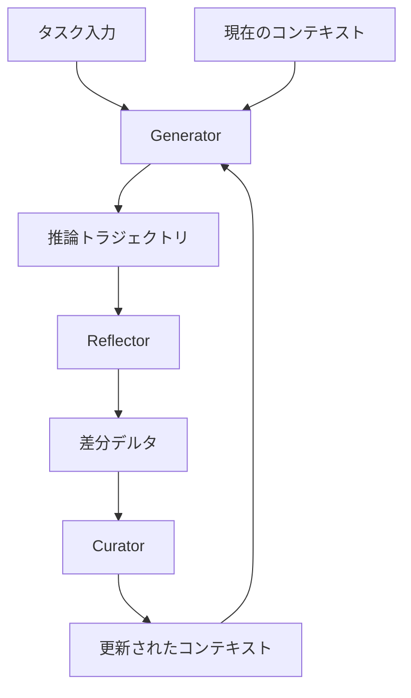

本記事は [Agentic Context Engineering: Evolving Contexts for Self-Improving Language Models](https://arxiv.org/abs/2510.04618) の解説記事です。

## 論文概要

Zhang et al. (2025) は、LLMのコンテキストを「進化するプレイブック（evolving playbooks）」として扱い、タスク実行のフィードバックからコンテキストを自律的に改善するフレームワーク ACE（Agentic Context Engineering）を提案している。ACEは Generator・Reflector・Curator の3つのモジュールで構成され、ラベルなし・教師なしの自然な実行フィードバックのみでコンテキストを段階的に洗練する。エージェントベンチマークで平均+10.6%、金融ドメインで+8.6%の精度向上を達成し、AppWorldリーダーボードではより小規模なオープンソースモデルでトップランクのプロダクションエージェントと同等以上の性能を示したと報告されている（論文Table 1, Table 2）。

この記事は [Zenn記事: プロンプトキャッシュが覆すコンテキスト管理の常識：圧縮vs全保持の判断基準と実装](https://zenn.dev/0h_n0/articles/6319db2cded345) の深掘りです。Zenn記事で扱ったプロンプトキャッシュの活用戦略に対し、ACEは「コンテキストを圧縮せず構造化して全保持する」アプローチの学術的根拠を提供している。

## 情報源

- **arXiv ID**: 2510.04618
- **URL**: [https://arxiv.org/abs/2510.04618](https://arxiv.org/abs/2510.04618)
- **著者**: Qizheng Zhang, Changran Hu, Shubhangi Upasani et al. (Stanford University, SambaNova Systems, UC Berkeley)
- **提出日**: 2025年10月6日（最終改訂: 2026年3月29日）
- **採択**: **ICLR 2026** (International Conference on Learning Representations)
- **分野**: cs.AI, cs.CL, cs.LG

## 背景と動機

LLMベースのエージェントやドメイン特化推論では、重みの更新（ファインチューニング）ではなくコンテキスト（システムプロンプト、メモリ、デモンストレーション）の適応によって性能を改善するアプローチが主流になりつつある。しかし、従来のコンテキスト最適化手法には2つの根本的な課題がある。

**Brevity Bias（簡潔化バイアス）**: 多くのプロンプト最適化手法は、簡潔で汎用的な指示を優先し、ドメイン固有のヒューリスティクスやツール使用ガイドラインといった詳細な知識を切り捨ててしまう。複雑なタスクでは、こうした詳細情報こそが成否を分ける。

**Context Collapse（コンテキスト崩壊）**: LLMが蓄積されたコンテキストを全面的に書き直す際、詳細な情報が短い要約に圧縮されてしまう現象である。著者らは具体的な事例として、ステップ60で18,282トークン・精度66.7%だったコンテキストが、次のステップで122トークン・精度57.1%にまで崩壊したケースを報告している。

ACEはこれらの課題に対し、コンテキストを「圧縮対象」ではなく「進化するプレイブック」として位置づけ、構造化された差分更新によってコンテキスト崩壊を防ぎつつ、詳細な知識を蓄積・整理する手法を提案している。

## 主要な貢献

- **進化するプレイブックとしてのコンテキスト管理**: コンテキストを単一のプロンプト文字列ではなく、構造化されたバレット（項目）の集合として扱い、差分更新で段階的に改善するパラダイムを確立した
- **Generator-Reflector-Curatorの3モジュール設計**: コンテキスト生成・分析・整理を分離し、各段階で専門的な処理を行うモジュラーアーキテクチャを提案した
- **ラベル不要の自己改善**: 教師ラベルなし・実行フィードバックのみでコンテキストを改善する手法を実現し、エージェントベンチマーク（AppWorld）で+10.6%、金融ドメインで+8.6%の精度向上を達成した
- **適応コストの大幅削減**: GEPA比で82.3%のレイテンシ削減、Dynamic Cheatsheet比で83.6%のトークンコスト削減を実現した

## 技術的詳細

### ACEの全体アーキテクチャ

ACEは3つの専門モジュールの協調によりコンテキストを進化させる。



### コンテキストの構造

ACEにおけるコンテキストは、モノリシックなプロンプト文字列ではなく、構造化されたバレット（項目）の集合として管理される。各バレットは以下の2要素で構成される。

1. **メタデータ**: 一意な識別子（ID）と、そのバレットが「有用」または「有害」とマークされた回数を追跡するカウンタ
2. **コンテンツ**: 再利用可能な戦略、ドメイン概念、または典型的な失敗パターンを記述した小単位の知識

この項目化された設計により、3つの特性が実現される。

- **局所化（Localization）**: 更新が関連するバレットのみに限定される
- **細粒度検索（Fine-grained Retrieval）**: 必要なバレットだけを選択的にコンテキストに含められる
- **差分適応（Incremental Adaptation）**: 過去の知識を保持しつつ新しい知見を追加できる

### Generator（生成器）

Generatorは現在のコンテキスト $\mathcal{C}_t$ を用いて新しいタスク $x$ に対する推論トラジェクトリ $\tau$ を生成する。

$$
\tau = \text{Generator}(x, \mathcal{C}_t)
$$

ここで、
- $x$: タスク入力（クエリ、環境状態など）
- $\mathcal{C}_t$: ステップ $t$ におけるコンテキスト（バレットの集合）
- $\tau$: 推論トラジェクトリ（思考過程、ツール呼び出し、結果を含む実行ログ）

Generatorの重要な役割は、推論中にどのバレットが有用だったか、どのバレットが誤誘導を引き起こしたかをマークすることである。このフィードバック情報がReflectorへの入力となる。

### Reflector（反省器）

Reflectorは推論トラジェクトリ $\tau$ とその実行結果（成功/失敗フィードバック）を分析し、コンテキストの改善案をコンパクトなデルタ $\delta$ として出力する。

$$
\delta = \text{Reflector}(\tau, \text{feedback}, \mathcal{C}_t)
$$

ここで、
- $\text{feedback}$: タスクの実行結果（エラーメッセージ、テスト通過/失敗、APIレスポンスなど）
- $\delta$: コンテキストへの差分更新（追加・修正・削除の指示）

Reflectorは複数ラウンドの反復改善が可能であり、著者らは最大5ラウンドの refinement を設定している。ラベルなしの場合でも、実行結果のフィードバック（例: APIエラー、テスト失敗）から学習可能である点がACEの特徴である。

### Curator（キュレーター）

Curatorはデルタ $\delta$ をコンテキスト $\mathcal{C}_t$ に統合し、更新されたコンテキスト $\mathcal{C}_{t+1}$ を生成する。

$$
\mathcal{C}_{t+1} = \text{Curator}(\mathcal{C}_t, \delta)
$$

Curatorの処理は**非LLMロジック**で決定論的に実行される点が重要である。これによりLLMの確率的な振る舞いによるコンテキスト崩壊を防止する。具体的な処理は以下の通りである。

1. **デルタの統合**: 新しいバレットの追加、既存バレットの修正、不要バレットの削除をデルタの指示に従って実行
2. **重複排除**: セマンティック埋め込みによるバレット間の類似度比較で冗長なバレットを統合
3. **プルーニング**: コンテキストウィンドウを超過した場合、カウンタ（有用/有害マーク数）に基づいて低価値バレットを除去

重複排除は「プロアクティブ」（各デルタ統合後に実行）または「レイジー」（コンテキストウィンドウ超過時のみ実行）のいずれかで適用される。

### オフラインモードとオンラインモード

ACEは2つの動作モードをサポートする。

**オフラインモード**: 訓練データでコンテキストを最適化し、テストデータでpass@1精度を評価する。最大5エポックの反復改善が可能であり、事前にコンテキストを十分に成熟させてからデプロイする用途に適している。

**オンラインモード**: テストデータを逐次処理し、各サンプルの実行後にコンテキストを更新する。デプロイ後もリアルタイムでコンテキストが進化し続ける用途に適している。

### 従来手法との差分更新メカニズムの比較

コンテキスト崩壊を防ぐACEの差分更新メカニズムを、従来の全面書き換え方式と比較する。

| 特性 | 全面書き換え（従来） | 差分更新（ACE） |
|------|---------------------|-----------------|
| 更新方式 | LLMがコンテキスト全体を再生成 | 非LLMロジックで局所的に差分統合 |
| 情報損失リスク | 高い（context collapse） | 低い（既存バレットは保持） |
| 更新コスト | 高い（全コンテキストを再生成） | 低い（差分のみ処理） |
| 決定論性 | 非決定論的（LLM依存） | 決定論的（ルールベース統合） |

## 実装のポイント

ACEの各コンポーネントをPythonで実装する際の主要な検討事項を以下に示す。

### コンテキスト管理の実装

```python
from dataclasses import dataclass, field
from uuid import uuid4


@dataclass
class Bullet:
    """ACEコンテキストの最小単位

    各バレットは一意のIDとカウンタを持ち、
    有用/有害のフィードバックを追跡する。
    """
    id: str = field(default_factory=lambda: str(uuid4()))
    content: str = ""
    helpful_count: int = 0
    harmful_count: int = 0
    category: str = "strategy"  # strategy, concept, failure_mode

    @property
    def score(self) -> float:
        """バレットの有用度スコア"""
        total = self.helpful_count + self.harmful_count
        if total == 0:
            return 0.0
        return self.helpful_count / total


@dataclass
class ACEContext:
    """ACEの構造化コンテキスト

    バレットの集合として管理し、
    差分更新で段階的に改善する。
    """
    bullets: list[Bullet] = field(default_factory=list)
    max_tokens: int = 16384

    def add_bullet(self, content: str, category: str = "strategy") -> Bullet:
        """新しいバレットを追加"""
        bullet = Bullet(content=content, category=category)
        self.bullets.append(bullet)
        return bullet

    def remove_low_value(self, threshold: float = 0.3) -> list[str]:
        """低価値バレットを除去し、除去されたIDのリストを返す"""
        removed_ids: list[str] = []
        retained: list[Bullet] = []
        for b in self.bullets:
            total = b.helpful_count + b.harmful_count
            if total >= 3 and b.score < threshold:
                removed_ids.append(b.id)
            else:
                retained.append(b)
        self.bullets = retained
        return removed_ids

    def to_prompt(self) -> str:
        """バレットをプロンプト文字列に変換"""
        lines: list[str] = []
        for b in sorted(self.bullets, key=lambda x: x.score, reverse=True):
            lines.append(f"[{b.category}] {b.content}")
        return "\n".join(lines)
```

### デルタ統合のロジック

```python
from dataclasses import dataclass
from enum import Enum


class DeltaAction(Enum):
    """デルタ操作の種類"""
    ADD = "add"
    MODIFY = "modify"
    DELETE = "delete"


@dataclass
class Delta:
    """Reflectorが出力する差分更新"""
    action: DeltaAction
    target_id: str | None = None  # MODIFY/DELETEの対象
    content: str = ""
    category: str = "strategy"


def apply_deltas(
    context: ACEContext,
    deltas: list[Delta],
) -> ACEContext:
    """デルタをコンテキストに決定論的に統合する

    CuratorのコアロジックはLLMを使わず、
    ルールベースで差分を適用する。
    """
    bullet_map: dict[str, Bullet] = {b.id: b for b in context.bullets}

    for delta in deltas:
        if delta.action == DeltaAction.ADD:
            context.add_bullet(delta.content, delta.category)
        elif delta.action == DeltaAction.MODIFY and delta.target_id:
            if delta.target_id in bullet_map:
                bullet_map[delta.target_id].content = delta.content
        elif delta.action == DeltaAction.DELETE and delta.target_id:
            context.bullets = [
                b for b in context.bullets if b.id != delta.target_id
            ]
    return context
```

### セマンティック重複排除

```python
import numpy as np


def deduplicate_bullets(
    context: ACEContext,
    embeddings: np.ndarray,
    threshold: float = 0.92,
) -> ACEContext:
    """セマンティック埋め込みによる重複バレットの統合

    Args:
        context: 対象コンテキスト
        embeddings: 各バレットの埋め込みベクトル (n_bullets, dim)
        threshold: 重複判定の類似度閾値
    """
    n = len(context.bullets)
    if n <= 1:
        return context

    # コサイン類似度行列の計算
    norms = np.linalg.norm(embeddings, axis=1, keepdims=True)
    normalized = embeddings / (norms + 1e-8)
    sim_matrix: np.ndarray = normalized @ normalized.T

    remove_ids: set[str] = set()
    for i in range(n):
        if context.bullets[i].id in remove_ids:
            continue
        for j in range(i + 1, n):
            if context.bullets[j].id in remove_ids:
                continue
            if sim_matrix[i, j] > threshold:
                # スコアが低い方を除去
                if context.bullets[i].score >= context.bullets[j].score:
                    remove_ids.add(context.bullets[j].id)
                else:
                    remove_ids.add(context.bullets[i].id)

    context.bullets = [b for b in context.bullets if b.id not in remove_ids]
    return context
```

**実装上の注意点**:

- **Reflectorの反復回数**: 著者らは最大5ラウンドの refinement を設定しているが、多くの場合2-3ラウンドで収束すると考えられる。ラウンド数はコストと精度のトレードオフである
- **重複排除の閾値**: セマンティック類似度の閾値はドメインに依存する。著者らの実装では、プロアクティブ方式（毎回実行）とレイジー方式（コンテキストウィンドウ超過時のみ実行）を選択できる
- **カウンタの更新タイミング**: Generatorの推論中に「有用」「有害」マークが付与されるため、推論ログのパース処理が必要になる
- **KVキャッシュの活用**: コンテキストの大部分が更新間で変わらないため、プロンプトキャッシュ（KVキャッシュ再利用）との相性が良い。著者らは91.8%のトークンがキャッシュから提供されたと報告している

## Production Deployment Guide

### AWS実装パターン（コスト最適化重視）

ACEフレームワークの本番運用では、コンテキスト管理（バレットストア）、LLM推論（Generator/Reflector）、差分統合（Curator）の3つのワークロードを考慮する必要がある。Generator/ReflectorのLLM呼び出しが最大のコスト要因であり、KVキャッシュ活用による削減が重要である。

| 構成 | トラフィック | 主要サービス | 月額概算 |
|------|-------------|-------------|---------|
| Small | ~100 req/日 | Lambda + Bedrock (Claude Sonnet) + DynamoDB | $80-200 |
| Medium | ~1,000 req/日 | ECS Fargate + Bedrock + ElastiCache + DynamoDB | $400-900 |
| Large | 10,000+ req/日 | EKS + Karpenter (Spot) + Bedrock Batch + Aurora | $2,500-6,000 |

Small構成はLambda + Bedrock（プロンプトキャッシュ有効）+ DynamoDB（バレットストア）で構成する。Medium構成はECS Fargate + ElastiCache（コンテキストキャッシュ）を追加し、Large構成はEKS + Karpenter（Spot優先）+ Bedrock Batch APIで構成する。

**コスト削減テクニック**: ACEはコンテキストの大部分が更新間で不変であるため、プロンプトキャッシュの恩恵が大きい。著者らの実験では91.8%のトークンがキャッシュヒットし、入力トークンコストが82.6%削減されたと報告されている。Bedrock Prompt CachingやOpenAI Cached Tokensを活用することで、同様の削減が期待できる。

**注意**: 上記は2026年8月時点のAWS ap-northeast-1料金に基づく概算値であり、実際のコストはトラフィックパターン、リージョン、バースト使用量により変動する。最新料金はAWS料金計算ツールで確認を推奨する。

### Terraformインフラコード

**Small構成（Serverless）**:

```hcl
# ACE Small構成: Lambda + Bedrock + DynamoDB
# コスト目安: $80-200/月 (ap-northeast-1)

resource "aws_dynamodb_table" "ace_bullets" {
  name         = "ace-bullet-store"
  billing_mode = "PAY_PER_REQUEST"  # On-Demand: アイドルコスト回避
  hash_key     = "context_id"
  range_key    = "bullet_id"

  attribute {
    name = "context_id"
    type = "S"
  }
  attribute {
    name = "bullet_id"
    type = "S"
  }

  server_side_encryption { enabled = true }  # KMS暗号化

  point_in_time_recovery { enabled = true }

  tags = {
    Project     = "ace-context-engine"
    Environment = "production"
    CostCenter  = "ml-ops"
  }
}

resource "aws_lambda_function" "ace_curator" {
  function_name = "ace-curator"
  runtime       = "python3.12"
  handler       = "curator.handler"
  memory_size   = 1024
  timeout       = 60
  role          = aws_iam_role.ace_lambda.arn

  environment {
    variables = {
      BULLET_TABLE       = aws_dynamodb_table.ace_bullets.name
      BEDROCK_MODEL_ID   = "anthropic.claude-sonnet-4-20250514"
      MAX_REFLECT_ROUNDS = "3"
      DEDUP_THRESHOLD    = "0.92"
    }
  }
  tracing_config { mode = "Active" }  # X-Ray有効
}

# IAMロール: 最小権限
resource "aws_iam_role_policy" "ace_lambda_policy" {
  name = "ace-lambda-policy"
  role = aws_iam_role.ace_lambda.id
  policy = jsonencode({
    Version = "2012-10-17"
    Statement = [
      {
        Effect   = "Allow"
        Action   = ["dynamodb:GetItem", "dynamodb:PutItem", "dynamodb:UpdateItem", "dynamodb:DeleteItem", "dynamodb:Query"]
        Resource = aws_dynamodb_table.ace_bullets.arn
      },
      {
        Effect   = "Allow"
        Action   = ["bedrock:InvokeModel", "bedrock:InvokeModelWithResponseStream"]
        Resource = "arn:aws:bedrock:ap-northeast-1::foundation-model/*"
      }
    ]
  })
}

resource "aws_cloudwatch_metric_alarm" "ace_cost_spike" {
  alarm_name          = "ace-bedrock-cost-spike"
  comparison_operator = "GreaterThanThreshold"
  evaluation_periods  = 2
  metric_name         = "InvocationCount"
  namespace           = "AWS/Bedrock"
  statistic           = "Sum"
  period              = 3600
  threshold           = 500  # 1時間あたり500回超過で通知
  alarm_actions       = [aws_sns_topic.ace_alerts.arn]
}
```

**Large構成（Container）**:

```hcl
# ACE Large構成: EKS + Karpenter + Bedrock Batch
# コスト目安: $2,500-6,000/月 (ap-northeast-1)

module "eks" {
  source          = "terraform-aws-modules/eks/aws"
  version         = "~> 20.0"
  cluster_name    = "ace-production"
  cluster_version = "1.31"

  vpc_id     = module.vpc.vpc_id
  subnet_ids = module.vpc.private_subnets

  cluster_endpoint_public_access = false  # プライベートのみ
}

resource "kubectl_manifest" "karpenter_nodepool" {
  yaml_body = yamlencode({
    apiVersion = "karpenter.sh/v1"
    kind       = "NodePool"
    metadata   = { name = "ace-workers" }
    spec = {
      template = {
        spec = {
          requirements = [
            { key = "karpenter.sh/capacity-type", operator = "In", values = ["spot", "on-demand"] },
            { key = "node.kubernetes.io/instance-type", operator = "In", values = ["c6i.2xlarge", "c6i.4xlarge", "m6i.2xlarge"] }
          ]
        }
      }
      limits   = { cpu = "128", memory = "512Gi" }
      disruption = {
        consolidationPolicy = "WhenEmptyOrUnderutilized"
        consolidateAfter    = "60s"
      }
    }
  })
}

resource "aws_budgets_budget" "ace_monthly" {
  name         = "ace-monthly-budget"
  budget_type  = "COST"
  limit_amount = "6000"
  limit_unit   = "USD"
  time_unit    = "MONTHLY"

  notification {
    comparison_operator       = "GREATER_THAN"
    threshold                 = 80
    threshold_type            = "PERCENTAGE"
    notification_type         = "ACTUAL"
    subscriber_sns_topic_arns = [aws_sns_topic.ace_alerts.arn]
  }
}
```

### 運用・監視設定

**CloudWatch Logs Insights**（コンテキスト進化の監視）:

```
fields @timestamp, @message
| filter event = "context_update"
| stats avg(bullet_count) as avg_bullets,
        avg(context_tokens) as avg_tokens,
        sum(deltas_applied) as total_deltas,
        avg(cache_hit_rate) as avg_cache_hit
  by bin(1h)
```

**CloudWatchアラーム + X-Ray + Cost Explorer**:

```python
import boto3
from aws_xray_sdk.core import xray_recorder, patch_all

patch_all()


def create_ace_alarms() -> None:
    """ACEパイプラインの異常検知アラーム設定"""
    cw = boto3.client("cloudwatch")
    alarms = [
        ("ace-bedrock-latency", "InvocationLatency", "AWS/Bedrock", 5000),
        ("ace-lambda-duration", "Duration", "AWS/Lambda", 50000),
        ("ace-dynamo-throttle", "ThrottledRequests", "AWS/DynamoDB", 10),
    ]
    for name, metric, ns, thresh in alarms:
        cw.put_metric_alarm(
            AlarmName=name, MetricName=metric, Namespace=ns,
            Statistic="Average", Period=300, EvaluationPeriods=2,
            Threshold=thresh, ComparisonOperator="GreaterThanThreshold",
            AlarmActions=["arn:aws:sns:ap-northeast-1:ACCOUNT:ace-alerts"],
        )


@xray_recorder.capture("ace_evolve")
def evolve_context(task: str, context_id: str) -> dict:
    """コンテキスト進化パイプラインのトレース"""
    sub = xray_recorder.current_subsegment()
    sub.put_annotation("context_id", context_id)
    # Generator -> Reflector -> Curator パイプライン実行
    result = run_ace_pipeline(task, context_id)
    sub.put_metadata("deltas_count", result.get("deltas_applied", 0))
    sub.put_metadata("cache_hit_rate", result.get("cache_hit_rate", 0.0))
    return result


def daily_cost_report() -> None:
    """日次コストレポート: Bedrock/Lambda/DynamoDB"""
    ce = boto3.client("ce")
    resp = ce.get_cost_and_usage(
        TimePeriod={"Start": "2026-08-23", "End": "2026-08-24"},
        Granularity="DAILY",
        Metrics=["UnblendedCost"],
        GroupBy=[{"Type": "DIMENSION", "Key": "SERVICE"}],
    )
    total = sum(
        float(g["Metrics"]["UnblendedCost"]["Amount"])
        for r in resp["ResultsByTime"] for g in r["Groups"]
    )
    if total > 100:
        sns = boto3.client("sns")
        sns.publish(
            TopicArn="arn:aws:sns:ap-northeast-1:ACCOUNT:ace-alerts",
            Message=f"ACE daily cost alert: ${total:.2f}",
        )
```

### コスト最適化チェックリスト

**アーキテクチャ選択**: トラフィック量で構成選択（Serverless/Hybrid/Container）、KVキャッシュ効率を最大化する構成設計、バッチ処理可能なタスクはBedrock Batch APIを使用

**リソース最適化**: EC2/EKS Spot優先（最大90%削減）、Reserved 1年コミット（最大72%削減）、Savings Plans検討、Lambda メモリサイズ最適化（Power Tuning）、Karpenter WhenEmptyOrUnderutilized で未使用ノード自動削除

**LLMコスト削減**: Bedrock Prompt Caching有効化（ACEのコンテキスト不変部分で80%以上キャッシュヒット期待）、Bedrock Batch API使用（50%削減）、Reflector反復回数の上限設定（デフォルト5、実用2-3で収束）、コンテキストサイズ上限設定、モデル選択ロジック（簡易タスクはHaiku、複雑タスクはSonnet）

**監視・アラート**: AWS Budgets（80%/100%通知）、CloudWatchアラーム（Bedrockレイテンシ、Lambdaタイムアウト）、Cost Anomaly Detection有効化、日次コストレポート（SNS通知）

**リソース管理**: 月次未使用リソース棚卸し、タグ戦略必須（Project/Environment/CostCenter）、CloudWatch Logs 30日保持ポリシー、DynamoDB TTL設定（古いコンテキスト自動削除）、開発環境夜間停止

## 実験結果

### エージェントベンチマーク（AppWorld）

AppWorldはAPIベースのタスク実行ベンチマークであり、Task Goal Completion (TGC) で評価される。著者らはDeepSeek-V3.1（671Bパラメータ、non-thinkingモード）を使用している。論文Table 1の主要結果を以下に示す。

| 設定 | 手法 | Test-Normal TGC | Test-Challenge TGC | Average |
|------|------|-----------------|-------------------|---------|
| ベースライン | ReAct | 63.7 | 41.5 | 42.4 |
| オフライン | ReAct + ACE | **76.2** (+12.5) | 57.3 (+15.8) | **59.4** (+17.0) |
| オンライン | ReAct + ACE | 69.6 (+5.9) | **66.0** (+24.5) | 59.5 (+17.1) |

オフラインACEはベースラインから平均+17.0ポイント、オンラインACEは+17.1ポイントの改善を達成している。特にTest-Challengeスプリットではオンラインモードが+24.5ポイントと大幅な改善を示しており、困難なタスクほどコンテキストの進化が効果的であることが示唆される。

AppWorldリーダーボードにおいて、ACEはIBM CUGA（60.3%）をTest-Challengeスプリットで上回っている。これはIBM CUGAがプロダクションレベルのエージェントシステムであるのに対し、ACEはオープンソースモデル（DeepSeek-V3.1）を使用している点で注目に値する。

### 金融ドメインベンチマーク

金融ドメインではFiNER（エンティティ認識）とFormula（数式推論）の2つのベンチマークで評価されている（論文Table 2）。

| 手法 | FiNER | Formula | Average |
|------|-------|---------|---------|
| Base LLM | 70.7 | 67.5 | 69.1 |
| ACE (offline, GT labels) | **78.3** (+7.6) | **85.5** (+18.0) | **81.9** (+12.8) |
| ACE (offline, no labels) | 71.1 (+0.4) | 83.0 (+15.5) | 77.1 (+8.0) |

教師ラベルありの場合は平均+12.8ポイント、ラベルなしでも+8.0ポイントの改善を達成している。Formulaタスクでは+15.5〜18.0ポイントと大幅な改善が見られる一方、FiNERではラベルなしの場合+0.4ポイントと改善幅が限定的である。これは、エンティティ認識タスクでは実行フィードバックからの学習が困難であることを示唆している。

### Ablation Study

各コンポーネントの寄与を分析するアブレーション実験の結果を以下に示す（論文Table内、AppWorldオフライン設定）。

| 変種 | Test-Normal TGC | Test-Challenge TGC | Average |
|------|-----------------|-------------------|---------|
| Reflector・multi-epoch両方除去 | 70.8 (+7.1) | 55.9 (+14.4) | 55.1 (+12.7) |
| multi-epoch除去のみ | 72.0 (+8.3) | 54.9 (+13.4) | 56.8 (+14.4) |
| Full ACE | **76.2** (+12.5) | **57.3** (+15.8) | **59.4** (+17.0) |

Reflectorの除去で平均2.6ポイント、multi-epochの除去で平均4.3ポイントの性能低下が観測されている。両方除去しても+12.7ポイントの改善が残ることから、Curatorによる構造化コンテキスト管理自体が大きな効果を持つことが読み取れる。

### 適応コストの比較

| 比較対象 | 指標 | ACE | ベースライン | 削減率 |
|---------|------|-----|-------------|--------|
| GEPA (offline) | レイテンシ | 9,517秒 | 53,898秒 | 82.3% |
| GEPA (offline) | ロールアウト数 | - | - | 75.1%削減 |
| Dynamic Cheatsheet (online) | レイテンシ | - | - | 91.5%削減 |
| Dynamic Cheatsheet (online) | トークンコスト | $2.90 | $17.70 | 83.6% |

ACEはGEPA比で82.3%のレイテンシ削減、Dynamic Cheatsheet比で83.6%のトークンコスト削減を達成している。KVキャッシュ再利用により91.8%のトークンがキャッシュから提供され、実質的な入力トークンコストが82.6%削減されたと報告されている。

## 実運用への応用

ACEの実運用シナリオを、Zenn記事のプロンプトキャッシュ戦略との関連で整理する。

**プロンプトキャッシュとの相乗効果**: Zenn記事で解説されたプロンプトキャッシュの「コンテキスト全保持」戦略は、ACEの構造化プレイブック設計と整合する。ACEのバレットベースのコンテキストは大部分が更新間で不変であるため、KVキャッシュヒット率が91.8%に達する。コンテキストを圧縮せず構造化して保持するアプローチが、キャッシュ効率とタスク精度の両方で有利であることを示している。

**カスタマーサポートエージェント**: FAQの回答パターン、エスカレーション基準、過去のエラー対処法をバレットとして蓄積し、新しい問い合わせパターンに対してリアルタイムにコンテキストを進化させる用途が考えられる。オンラインモードで運用することで、デプロイ後も継続的にコンテキストが改善される。

**コード生成エージェント**: プロジェクト固有のコーディング規約、よくあるバグパターン、APIの使い方をバレットとして管理し、開発が進むにつれてコンテキストが成熟する。著者らが報告しているAppWorldでの+17ポイントの改善は、ツール呼び出しを伴うコード生成タスクでの有効性を示唆している。

**制約と注意点**: 著者らはACEが全てのタスクに有効ではないことを明記しており、簡潔な指示で解決可能なタスク（HotPotQA、Game of 24など）では改善が見られなかったと報告している。また、Reflectorの品質が低い場合、構築されるコンテキストがノイズや有害な情報を含む可能性がある。信頼性の高い実行フィードバック（テスト結果、APIレスポンスなど）が得られない環境では性能向上が限定的である。

## 関連研究

- **Reflexion** (Shinn et al., 2023): LLMの自己反省により推論を改善する手法。ACEとの違いは、Reflexionが単一の反省テキストを維持するのに対し、ACEは構造化されたバレットの集合として管理し、差分更新でコンテキスト崩壊を防止している点である
- **ExpeL** (Zhao et al., 2024): 経験から学習するエージェント。タスク実行の経験を蓄積する点でACEと類似するが、ACEはCuratorによる決定論的な統合と重複排除により、経験の蓄積に伴うコンテキスト肥大化を制御している
- **MIPROv2** (Opsahl-Ong et al., 2024): ベイズ最適化によるプロンプト最適化。ACEの論文ではベースラインとして比較されており、ACEが構造化された差分更新を通じてMIPROv2を上回る性能を示している
- **Dynamic Cheatsheet** (Wang et al., 2025): テスト時に適応的にメモリを更新する手法。ACEと類似のオンライン適応を行うが、ACEはトークンコストが83.6%少なく、レイテンシが91.5%低いと報告されている

## まとめと今後の展望

ACEは、コンテキストを「進化するプレイブック」として構造化し、Generator・Reflector・Curatorの3モジュールで差分更新するフレームワークである。ICLR 2026に採択された本論文は、AppWorldでベースラインから+17ポイント、金融ドメインで+8.0〜12.8ポイントの改善を達成し、適応コストもGEPA比82.3%削減という結果を報告している。

プロンプトキャッシュとの高い親和性（91.8%キャッシュヒット率）は、Zenn記事で議論した「コンテキスト圧縮vs全保持」の判断において、構造化された全保持アプローチの学術的根拠を提供している。

ただし、ACEの効果はドメインとタスクの複雑性に依存し、簡潔な指示で解決可能なタスクや信頼性の高い実行フィードバックが得られない環境では限定的である点に留意が必要である。

## 参考文献

- **arXiv**: [https://arxiv.org/abs/2510.04618](https://arxiv.org/abs/2510.04618)
- **Code**: [https://github.com/ace-agent/ace](https://github.com/ace-agent/ace)
- **ICLR 2026**: International Conference on Learning Representations
- **Reflexion**: [https://arxiv.org/abs/2303.11366](https://arxiv.org/abs/2303.11366)
- **ExpeL**: [https://arxiv.org/abs/2308.10144](https://arxiv.org/abs/2308.10144)
- **Related Zenn article**: [https://zenn.dev/0h_n0/articles/6319db2cded345](https://zenn.dev/0h_n0/articles/6319db2cded345)
