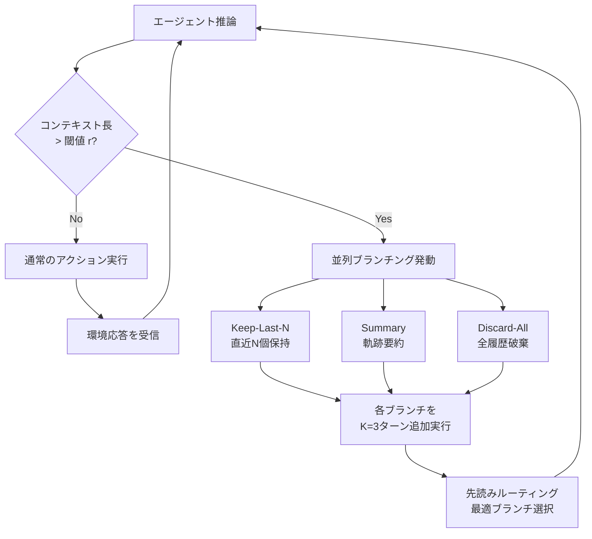

本記事は [AgentSwing: Adaptive Parallel Context Management Routing for Long-Horizon Web Agents](https://arxiv.org/abs/2603.27490) の解説記事です。

## 論文概要

Feng et al. (2026, Tongyi Lab / Alibaba Group) は、長期間のWebエージェントタスクにおけるコンテキスト管理の課題を解決するため、状態認識型の適応的並列コンテキスト管理ルーティングフレームワーク AgentSwing を提案している。従来手法が1つの固定戦略にコミットする問題に対し、複数のコンテキスト管理ブランチ（Keep-Last-N、Summary、Discard-All）を並列展開し、先読みルーティングで最有望な継続を選択する。BrowseCompでDeepSeek-v3.2使用時に62.5（Discard-All比+4.5ポイント）、ターン効率は最大1.77倍の改善を達成したと報告されている（論文Table 1, Table 3）。

この記事は [Zenn記事: プロンプトキャッシュが覆すコンテキスト管理の常識：圧縮vs全保持の判断基準と実装](https://zenn.dev/0h_n0/articles/6319db2cded345) の深掘りです。Zenn記事ではプロンプトキャッシュを前提としたコンテキスト管理戦略を論じているが、本論文は「どの戦略が最適か」をタスク実行時に動的に判断するメタ戦略であり、両者は相補的な関係にある。

## 情報源

- **arXiv ID**: 2603.27490
- **URL**: [https://arxiv.org/abs/2603.27490](https://arxiv.org/abs/2603.27490)
- **著者**: Zhaopeng Feng, Liangcai Su, Zhen Zhang 他（Tongyi Lab, Alibaba Group等 19名）
- **提出日**: 2026年3月29日
- **分野**: cs.CL, cs.AI, cs.MA

## 背景と動機

LLMベースのWebエージェントは、Web検索、情報収集、複雑な推論を含む長期タスクにおいてコンテキストウィンドウの上限に達する問題に直面する。BrowseCompのようなベンチマークでは、目的の情報を発見するまでに数百ターンのインタラクションが必要であり、コンテキスト管理の方針がタスク成功率を大きく左右する。

従来のコンテキスト管理には、直近N個のインタラクションのみを保持する方法（Keep-Last-N）、軌跡全体を要約に圧縮する方法（Summary）、全履歴を破棄する方法（Discard-All）がある。しかし、これらの戦略はタスクの段階や性質によって有効性が異なる。探索フェーズでは過去の失敗経路を記憶するKeep-Last-Nが有効な場合がある一方、目的の情報に近づいた段階では詳細な履歴が不要になりDiscard-Allが最適となることもある。

著者らは、単一の固定戦略にコミットすることの限界を指摘し、複数戦略の並列展開と動的選択を組み合わせるフレームワークを提案している。これにより「どの戦略を使うべきか」という問題を事前に解決する必要がなくなり、タスク実行時に最適戦略を適応的に選択できる。

## 主要な貢献

- **確率的分解フレームワーク**: エージェント成功確率 Pass@1 をSearch Efficiency（停止点到達確率）とTerminal Precision（停止点での正解確率）に分解し、コンテキスト管理戦略の特性を理論的に分析する枠組みを提案した
- **並列ブランチング機構**: コンテキスト長が閾値を超えた時点で、3つの管理戦略を同時に適用し、複数の継続候補を生成する設計を導入した
- **先読みルーティング**: 各候補ブランチを $K$ ターン追加実行した後にエージェントモデル自身が最適ブランチを選択する機構を提案し、最適先読み深度 $K=3$ を実験的に決定した
- **3ベンチマーク・3モデルでの一貫した改善**: BrowseComp、BrowseComp-ZH、HLEの全ベンチマークで、DeepSeek-v3.2、GPT-OSS-120B、Tongyi-DR-30B-A3Bの全モデルにおいて既存戦略を上回る結果を示した

## 技術的詳細

### 確率的フレームワーク

著者らは、エージェントの成功確率を2次元に分解している。

$$
\text{Pass@1}^{\pi} = \eta^{\pi} \cdot \rho^{\pi}
$$

ここで、

- $\eta_{\tau}^{\pi} := P(S^{\pi} \mid \tau)$: **Search Efficiency** — エージェントポリシー $\pi$ がトラジェクトリ $\tau$ のもとで停止点に到達する確率
- $\rho_{\tau}^{\pi} := P(C^{\pi} \mid S^{\pi}, \tau)$: **Terminal Precision** — 停止点に到達した場合に正解を返す条件付き確率

経験的推定は以下の通りである。

$$
\eta^{\pi} \approx \frac{N_{\text{finish}}^{\pi}}{M}, \quad \rho^{\pi} \approx \frac{N_{\text{correct}}^{\pi}}{N_{\text{finish}}^{\pi}}
$$

この分解により、コンテキスト管理戦略がSearch EfficiencyとTerminal Precisionのどちらに影響するかを定量的に分析できる。著者らの実験では、Keep-Last-NはTerminal Precisionが高い傾向がある一方、Discard-AllはSearch Efficiencyに優れるという特性が観察されている。

### 並列ブランチング

AgentSwingの中核機構は、コンテキスト長が閾値（最大長の比率 $r$）を超えた時点で発動する並列ブランチングである。3つの管理戦略を同時に適用し、それぞれ独立した継続候補を生成する。

1. **Keep-Last-N**: 直近 $N$ 個のインタラクションタプル（ユーザ入力 + エージェント応答 + 環境フィードバック）のみを保持し、古い履歴を切り捨てる
2. **Summary**: 軌跡全体を要約テキストに圧縮し、要約と直近の状態から推論を再開する
3. **Discard-All**: 全履歴を削除し、元のシステムプロンプトとタスク指示のみから推論を再開する



### 先読みルーティング

並列ブランチングで生成された各候補ブランチは、$K$ ターンの追加実行（先読み）を行う。先読み完了後、エージェントモデル自身が各候補の「進捗度」を評価し、最も有望なブランチを選択する。

著者らは先読み深度 $K$ の感度分析を行い、$K=3$ が最適であることを報告している。$K=1$ では各戦略の差異が十分に表れず、$K=5$ 以上では計算コストに見合う改善が得られないとされている。

選択基準としては、エージェントモデルに各候補の状態を提示し、「どのブランチがタスク完了に最も近いか」を直接判断させる方式を採用している。これにより、タスク固有のヒューリスティクスを設計する必要がなくなり、モデルの汎用的な判断能力を活用できる。

## 実装のポイント

AgentSwingの実装において注意すべき点を以下にまとめる。

第一に、並列ブランチングは計算コストの増大を伴う。3戦略 $\times$ $K=3$ ターンで最大9回の追加推論が発生するため、推論予算の管理が重要である。ただし著者らは、先読みによるターン効率改善がこのコストを上回ることを実験的に示している。

第二に、閾値比率 $r$ の設定がブランチング頻度を決定する。$r$ が低すぎると早期にブランチングが発生してコストが増大し、高すぎるとコンテキストオーバーフローのリスクが高まる。

第三に、先読みルーティングの判断品質はベースモデルの能力に依存する。ルーティング判断自体がLLM推論であるため、モデルの能力が低い場合はルーティングの精度も低下する可能性がある。

以下は、AgentSwingの並列ブランチングと先読みルーティングの簡略化した実装例である。

```python
from dataclasses import dataclass, field
from enum import Enum


class Strategy(Enum):
    """コンテキスト管理戦略"""
    KEEP_LAST_N = "keep_last_n"
    SUMMARY = "summary"
    DISCARD_ALL = "discard_all"


@dataclass
class BranchConfig:
    """並列ブランチング設定

    Attributes:
        threshold_ratio: コンテキスト長の閾値比率（最大長に対する割合）
        lookahead_depth: 先読みターン数
        keep_last_n: Keep-Last-N戦略で保持するインタラクション数
    """
    threshold_ratio: float = 0.7
    lookahead_depth: int = 3
    keep_last_n: int = 5


@dataclass
class Branch:
    """ブランチの状態を保持する

    Attributes:
        strategy: 適用されたコンテキスト管理戦略
        context: ブランチのコンテキスト（メッセージリスト）
        lookahead_history: 先読み実行中の履歴
    """
    strategy: Strategy
    context: list[dict[str, str]]
    lookahead_history: list[dict[str, str]] = field(default_factory=list)


def should_branch(
    current_token_count: int,
    max_context_length: int,
    config: BranchConfig,
) -> bool:
    """並列ブランチングを発動すべきかを判定する

    Args:
        current_token_count: 現在のコンテキストのトークン数
        max_context_length: モデルの最大コンテキスト長
        config: ブランチング設定

    Returns:
        ブランチングを発動すべきならTrue
    """
    return current_token_count > max_context_length * config.threshold_ratio


def create_branches(
    full_context: list[dict[str, str]],
    system_prompt: str,
    summary_text: str,
    config: BranchConfig,
) -> list[Branch]:
    """3つの管理戦略で並列ブランチを生成する

    Args:
        full_context: 現在の全コンテキスト
        system_prompt: システムプロンプト
        summary_text: 軌跡の要約テキスト
        config: ブランチング設定

    Returns:
        3つの管理戦略に対応するブランチのリスト
    """
    # Keep-Last-N: 直近N個のインタラクションを保持
    keep_last_n_context = [
        {"role": "system", "content": system_prompt},
        *full_context[-config.keep_last_n :],
    ]

    # Summary: 要約 + 直近の状態
    summary_context = [
        {"role": "system", "content": system_prompt},
        {"role": "assistant", "content": f"[Trajectory Summary]\n{summary_text}"},
        *full_context[-1:],
    ]

    # Discard-All: システムプロンプトのみ
    discard_all_context = [
        {"role": "system", "content": system_prompt},
    ]

    return [
        Branch(strategy=Strategy.KEEP_LAST_N, context=keep_last_n_context),
        Branch(strategy=Strategy.SUMMARY, context=summary_context),
        Branch(strategy=Strategy.DISCARD_ALL, context=discard_all_context),
    ]


def select_best_branch(
    branches: list[Branch],
    routing_prompt: str,
) -> Branch:
    """先読み結果に基づいて最適なブランチを選択する

    各ブランチのlookahead_historyを評価し、
    タスク完了に最も近いブランチを返す。
    実際の実装ではLLMを用いて判断する。

    Args:
        branches: 先読み実行済みの全ブランチ
        routing_prompt: ルーティング判断用のプロンプト

    Returns:
        最適と判断されたブランチ
    """
    # 実際の実装ではLLMに各ブランチの状態を提示し判断させる
    # ここでは簡略化のため、先読み履歴が最も長いブランチを選択
    return max(branches, key=lambda b: len(b.lookahead_history))
```

## Production Deployment Guide

### AWS実装パターン（コスト最適化重視）

AgentSwingの並列ブランチング機構は、複数のLLM推論を同時実行するため、推論インフラの設計が重要になる。3ブランチ $\times$ $K=3$ ターンの先読みを効率的に処理するデプロイパターンを示す。

**コスト試算の注意事項**: 以下は2026年8月時点のAWS ap-northeast-1（東京）リージョン料金に基づく概算値である。実際のコストはトラフィックパターン、リージョン、バースト使用量により変動する。最新料金はAWS料金計算ツールで確認を推奨する。

| 構成 | トラフィック | 主要サービス | 月額概算 |
|------|-------------|-------------|---------|
| Small | ~100 req/日 | Lambda + Step Functions + Bedrock | $100-200 |
| Medium | ~1,000 req/日 | ECS Fargate + SQS + Bedrock | $500-1,000 |
| Large | 10,000+ req/日 | EKS + Karpenter + Spot + Bedrock Batch | $3,000-6,000 |

**Small構成の内訳**: Lambda（$5-15）+ Step Functions（$10-25、並列ブランチのオーケストレーション）+ Bedrock推論（$60-120、3ブランチ並列で通常の約3倍）+ DynamoDB On-Demand（$5-15）+ CloudWatch（$5-10）

**Large構成の内訳**: EKSコントロールプレーン（$73）+ EC2 Spot Instances（$1,000-2,000）+ Bedrock Batch API（$1,200-3,000、並列ブランチ分）+ ElastiCache（$150-300、ブランチ状態キャッシュ）+ ALB（$50-100）+ SQS（$10-30）

**コスト削減テクニック**:
- Spot Instances活用で最大90%削減（EKSノードグループ）
- Bedrock Batch API使用で50%削減（非リアルタイムの先読み処理）
- Prompt Caching有効化で30-90%削減（システムプロンプト部分の共通キャッシュ）
- 先読み深度の動的調整（簡易タスクは $K=1$、困難タスクのみ $K=3$）

### Terraformインフラコード

**Small構成（Serverless）: Step Functions + Lambda + Bedrock**

AgentSwingの並列ブランチングは、Step FunctionsのParallel状態を使って自然にモデリングできる。

```hcl
# --- Small構成: AgentSwing並列ブランチング ---
# Step Functions + Lambda + Bedrock (月額 $100-200)

terraform {
  required_version = ">= 1.9"
  required_providers {
    aws = { source = "hashicorp/aws", version = "~> 5.60" }
  }
}

provider "aws" { region = "ap-northeast-1" }

# --- IAMロール（最小権限） ---
resource "aws_iam_role" "branch_lambda" {
  name = "agentswing-branch-lambda"
  assume_role_policy = jsonencode({
    Version = "2012-10-17"
    Statement = [{
      Action = "sts:AssumeRole"
      Effect = "Allow"
      Principal = { Service = "lambda.amazonaws.com" }
    }]
  })
}

resource "aws_iam_role_policy" "branch_lambda" {
  name = "agentswing-branch-policy"
  role = aws_iam_role.branch_lambda.id
  policy = jsonencode({
    Version = "2012-10-17"
    Statement = [
      {
        Effect   = "Allow"
        Action   = ["bedrock:InvokeModel", "bedrock:InvokeModelWithResponseStream"]
        Resource = "arn:aws:bedrock:ap-northeast-1::foundation-model/*"
      },
      {
        Effect   = "Allow"
        Action   = ["dynamodb:GetItem", "dynamodb:PutItem", "dynamodb:UpdateItem", "dynamodb:Query"]
        Resource = aws_dynamodb_table.branch_state.arn
      },
      {
        Effect   = "Allow"
        Action   = ["logs:CreateLogGroup", "logs:CreateLogStream", "logs:PutLogEvents"]
        Resource = "arn:aws:logs:ap-northeast-1:*:*"
      },
      {
        Effect   = "Allow"
        Action   = ["xray:PutTraceSegments", "xray:PutTelemetryRecords"]
        Resource = "*"
      }
    ]
  })
}

# --- DynamoDB: ブランチ状態管理 ---
resource "aws_dynamodb_table" "branch_state" {
  name         = "agentswing-branch-state"
  billing_mode = "PAY_PER_REQUEST"
  hash_key     = "session_id"
  range_key    = "branch_id"

  attribute {
    name = "session_id"
    type = "S"
  }
  attribute {
    name = "branch_id"
    type = "S"
  }

  server_side_encryption { enabled = true }

  ttl {
    attribute_name = "expires_at"
    enabled        = true
  }
}

# --- Lambda: ブランチ実行（各戦略） ---
resource "aws_lambda_function" "branch_executor" {
  function_name = "agentswing-branch-executor"
  role          = aws_iam_role.branch_lambda.arn
  runtime       = "python3.12"
  handler       = "handler.execute_branch"
  filename      = "lambda.zip"
  timeout       = 900
  memory_size   = 1024

  tracing_config { mode = "Active" }

  environment {
    variables = {
      THRESHOLD_RATIO   = "0.7"
      LOOKAHEAD_DEPTH   = "3"
      KEEP_LAST_N       = "5"
      BRANCH_STATE_TABLE = aws_dynamodb_table.branch_state.name
    }
  }
}

# --- Lambda: ルーティング判断 ---
resource "aws_lambda_function" "router" {
  function_name = "agentswing-router"
  role          = aws_iam_role.branch_lambda.arn
  runtime       = "python3.12"
  handler       = "handler.route_branch"
  filename      = "lambda.zip"
  timeout       = 300
  memory_size   = 512

  tracing_config { mode = "Active" }

  environment {
    variables = {
      BRANCH_STATE_TABLE = aws_dynamodb_table.branch_state.name
    }
  }
}

# --- CloudWatchアラーム: ブランチングコスト監視 ---
resource "aws_cloudwatch_metric_alarm" "branching_cost" {
  alarm_name          = "agentswing-branching-cost-high"
  comparison_operator = "GreaterThanThreshold"
  evaluation_periods  = 3
  metric_name         = "InputTokenCount"
  namespace           = "AWS/Bedrock"
  period              = 3600
  statistic           = "Sum"
  threshold           = 1000000
  alarm_actions       = []
}
```

**Large構成（Container）: EKS + 並列ワーカー**

```hcl
# --- Large構成: AgentSwing並列ブランチングクラスタ ---
# EKS + Karpenter + Spot (月額 $3,000-6,000)

module "eks" {
  source  = "terraform-aws-modules/eks/aws"
  version = "~> 20.24"

  cluster_name    = "agentswing-cluster"
  cluster_version = "1.31"

  cluster_endpoint_public_access  = true
  cluster_endpoint_private_access = true

  vpc_id     = module.vpc.vpc_id
  subnet_ids = module.vpc.private_subnets

  enable_cluster_creator_admin_permissions = true
}

# --- Karpenter: Spot優先ノードプール ---
resource "kubectl_manifest" "karpenter_nodepool" {
  yaml_body = yamlencode({
    apiVersion = "karpenter.sh/v1"
    kind       = "NodePool"
    metadata   = { name = "agentswing-workers" }
    spec = {
      template = {
        spec = {
          requirements = [
            { key = "karpenter.sh/capacity-type", operator = "In", values = ["spot", "on-demand"] },
            { key = "node.kubernetes.io/instance-type", operator = "In",
              values = ["m7i.xlarge", "m7i.2xlarge", "c7i.xlarge", "c7i.2xlarge"] },
          ]
          nodeClassRef = { group = "karpenter.k8s.aws", kind = "EC2NodeClass", name = "default" }
        }
      }
      limits   = { cpu = "256", memory = "1024Gi" }
      disruption = {
        consolidationPolicy = "WhenEmptyOrUnderutilized"
        consolidateAfter    = "60s"
      }
    }
  })
}

# --- AWS Budgets ---
resource "aws_budgets_budget" "monthly" {
  name         = "agentswing-monthly"
  budget_type  = "COST"
  limit_amount = "6000"
  limit_unit   = "USD"
  time_unit    = "MONTHLY"

  notification {
    comparison_operator       = "GREATER_THAN"
    threshold                 = 80
    threshold_type            = "PERCENTAGE"
    notification_type         = "ACTUAL"
    subscriber_email_addresses = ["ops-team@example.com"]
  }
}
```

### セキュリティベストプラクティス

- **IAMロール**: ブランチ実行LambdaとルーティングLambdaで別々のロールを割り当て、最小権限の原則を徹底する
- **ネットワーク**: VPCエンドポイント経由でBedrock/DynamoDB/S3にアクセスし、NAT Gatewayコストを削減する
- **ブランチ分離**: 各ブランチの実行コンテキストをDynamoDBで分離管理し、ブランチ間の情報漏洩を防止する
- **暗号化**: DynamoDB、S3は全てAWS KMSで暗号化する
- **監査**: CloudTrailを有効化し、ブランチングイベントとルーティング判断のログを保持する

### 運用・監視設定

**CloudWatch Logs Insights クエリ**: ブランチング頻度とルーティング判断を監視する。

```
# ブランチング発動頻度と選択された戦略の分布
fields @timestamp, @message
| filter @message like /routing_decision/
| stats count() as routing_count,
        count_distinct(session_id) as unique_sessions
  by selected_strategy, bin(1h)
| sort @timestamp desc
```

```
# 先読みコスト分析（ブランチあたりのトークン消費）
fields @timestamp, branch_strategy, lookahead_tokens
| filter event = "lookahead_complete"
| stats avg(lookahead_tokens) as avg_tokens,
        sum(lookahead_tokens) as total_tokens,
        count() as branch_count
  by branch_strategy, bin(1h)
```

**ブランチング効率モニタリング（Python）**:

```python
import boto3


def get_routing_efficiency(table_name: str, hours: int = 24) -> dict[str, float]:
    """ルーティング判断の効率を分析する

    各戦略が選択された割合と、選択後のタスク成功率を算出する。

    Args:
        table_name: DynamoDBテーブル名
        hours: 分析対象の直近時間数

    Returns:
        戦略別の選択率と成功率の辞書
    """
    dynamodb = boto3.resource("dynamodb", region_name="ap-northeast-1")
    table = dynamodb.Table(table_name)

    # 直近のルーティング判断を集計
    # 実際の実装ではGSIとクエリを使用
    response = table.scan(
        FilterExpression="attribute_exists(routing_decision)",
        Limit=1000,
    )

    strategy_counts: dict[str, int] = {}
    strategy_success: dict[str, int] = {}

    for item in response.get("Items", []):
        strategy = item.get("selected_strategy", "unknown")
        strategy_counts[strategy] = strategy_counts.get(strategy, 0) + 1
        if item.get("task_success"):
            strategy_success[strategy] = strategy_success.get(strategy, 0) + 1

    total = sum(strategy_counts.values())
    result: dict[str, float] = {}
    for strategy, count in strategy_counts.items():
        success = strategy_success.get(strategy, 0)
        result[f"{strategy}_selection_rate"] = round(count / total, 3) if total > 0 else 0.0
        result[f"{strategy}_success_rate"] = round(success / count, 3) if count > 0 else 0.0

    return result
```

### コスト最適化チェックリスト

**アーキテクチャ選択**:
- [ ] トラフィック量に応じた構成を選択（~100 req/日: Serverless、~1,000: Hybrid、10,000+: Container）
- [ ] 非リアルタイムの先読み処理はBedrock Batch APIに分離
- [ ] 先読み深度 $K$ をタスク難易度に応じて動的調整（簡易タスク: $K=1$、困難タスク: $K=3$）

**リソース最適化**:
- [ ] EC2: Spot Instances優先（Karpenter disruption設定）
- [ ] Lambda: メモリサイズを1024-2048MBの範囲で最適化
- [ ] 並列ブランチ実行: Step Functions Parallel状態で3ブランチを同時実行
- [ ] NAT Gateway: VPCエンドポイントで代替してコスト削減

**LLMコスト削減**:
- [ ] Prompt Caching有効化（システムプロンプトは3ブランチで共通、キャッシュ効果が高い）
- [ ] 先読みターンのmax_tokensを通常推論より短く設定
- [ ] ルーティング判断には軽量モデル（Haiku等）を使用し、本推論にはSonnetを使用
- [ ] 不要なブランチの早期打ち切り（明らかに失敗しているブランチを $K$ ターン前に停止）

**監視・アラート**:
- [ ] AWS Budgets: 月額上限アラート（80%/100%閾値）
- [ ] CloudWatch: ブランチングあたりのトークン消費量、ルーティング判断の所要時間
- [ ] 戦略選択分布の監視（特定戦略への偏りはモデルや閾値の調整が必要な兆候）
- [ ] Cost Anomaly Detection有効化

## 実験結果

著者らは3つのベンチマークと3つのモデルで評価を行っている（論文Table 1）。

### BrowseComp（200タスク）

| モデル | 最良単一戦略 | AgentSwing | 改善幅 |
|--------|------------|-----------|--------|
| DeepSeek-v3.2 | 58.0 (Discard-All) | 62.5 | +4.5 |
| GPT-OSS-120B | 52.5 (Keep-Last-N) | 60.0 | +7.5 |
| Tongyi-DR-30B-A3B | 58.0 (Discard-All) | 60.5 | +2.5 |

### BrowseComp-ZH（289タスク）

| モデル | 最良単一戦略 | AgentSwing | 改善幅 |
|--------|------------|-----------|--------|
| DeepSeek-v3.2 | 70.2 (Discard-All) | 71.3 | +1.1 |
| GPT-OSS-120B | 31.5 (Keep-Last-N) | 38.0 | +6.5 |
| Tongyi-DR-30B-A3B | 53.9 (Discard-All) | 56.7 | +2.8 |

### Humanity's Last Exam（HLE, 500タスク）

| モデル | 最良単一戦略 | AgentSwing | 改善幅 |
|--------|------------|-----------|--------|
| DeepSeek-v3.2 | 42.0 (Discard-All) | 44.4 | +2.4 |
| GPT-OSS-120B | 34.4 (Keep-Last-N) | 35.1 | +0.7 |
| Tongyi-DR-30B-A3B | 32.7 (Discard-All) | 33.1 | +0.4 |

全9条件（3モデル $\times$ 3ベンチマーク）でAgentSwingが最良単一戦略を上回っており、特にGPT-OSS-120BのBrowseCompでは+7.5ポイントの大幅な改善が見られる。

### ターン効率

AgentSwingは精度向上に加え、タスク完了までのターン数も削減している（論文Table 3）。

| モデル | 単一戦略（平均ターン） | AgentSwing（平均ターン） | 効率改善 |
|--------|---------------------|----------------------|---------|
| DeepSeek-v3.2 | 268.3 | 151.9 | 1.77倍 |
| GPT-OSS-120B | 297.2 | 190.3 | 1.56倍 |
| Tongyi-DR-30B-A3B | 340.8 | 203.6 | 1.67倍 |

先読みルーティングにより、行き詰まった戦略に固執し続けるケースが回避されるため、全体のターン効率が向上している。

### 制約と限界

- 並列ブランチングにより推論コストが約3倍に増大するため、コスト対効果の評価はアプリケーションに依存する
- 先読み深度 $K$ の最適値がタスクドメインによって異なる可能性があるが、ドメイン別の感度分析は限定的である
- ルーティング判断の品質がベースモデルの能力に依存するため、小規模モデルでの有効性は未検証である
- 3戦略の選択肢が固定されており、新しいコンテキスト管理戦略の追加に対する拡張性は検討されていない

## 実運用への応用

AgentSwingの並列ブランチング＋先読みルーティングのアーキテクチャは、コンテキスト管理戦略の選択が困難なエージェントシステム全般に応用可能である。

**Web検索・情報収集エージェント**: BrowseCompでの評価が示す通り、目的の情報を発見するまでに多数のターンを要するタスクにおいて、探索の行き詰まりを動的に解消できる。Zenn記事で論じられているプロンプトキャッシュと組み合わせる場合、並列ブランチの共通部分（システムプロンプト）をキャッシュ対象とすることで、3ブランチ分の推論コストを抑制する戦略が有効である。

**カスタマーサポートBot**: 長時間の問い合わせ対応で、コンテキスト管理の最適戦略がケースごとに異なる状況に適用できる。詳細な履歴が必要なケースではKeep-Last-Nが選択され、話題が大きく転換したケースではDiscard-Allが選択されるなど、動的な適応が期待できる。

**コスト面の考慮**: 並列ブランチングは推論コストを約3倍に増大させるが、ターン効率の1.56-1.77倍の改善によりトータルのトークン消費は抑制される可能性がある。先読み深度の動的調整（タスク難易度に応じて $K$ を変化させる）や、明らかに劣勢なブランチの早期打ち切りにより、コスト効率をさらに改善できる。

## 関連研究

- **CompactionRL (Li et al., 2026)**: RLによるコンテキスト圧縮を学習する手法。圧縮のタイミングと内容を最適化する点でAgentSwingと相補的であり、CompactionRLの圧縮をAgentSwingの戦略の1つとして組み込む拡張が考えられる
- **MemoryBank (Zhong et al., 2024)**: 対話履歴をメモリバンクに蓄積する手法。固定的な要約戦略を用いる点でAgentSwingの動的選択と異なる
- **TokenPilot (2026)**: トークンレベルの動的な圧縮制御を行う手法。AgentSwingがマクロレベル（戦略選択）で動的制御を行うのに対し、TokenPilotはミクロレベル（トークン単位）で制御を行う。両者の組み合わせにより多段階の適応的管理が実現可能である
- **Prompt Caching (Anthropic, OpenAI)**: Zenn記事で詳述されているキャッシュベースのコンテキスト管理。AgentSwingの並列ブランチ間で共通するプレフィックス（システムプロンプト）のキャッシュにより、ブランチングのコスト増を緩和できる

## まとめと今後の展望

AgentSwingは、コンテキスト管理戦略の選択問題を「事前に最適戦略を決定する」アプローチから「実行時に動的に選択する」アプローチに転換するフレームワークである。3ベンチマーク・3モデルでの一貫した改善と、1.56-1.77倍のターン効率向上は、単一戦略への固執が性能のボトルネックとなっていることを示唆している。

今後の研究方向として、戦略セットの拡張（CompactionRL等の新戦略の統合）、先読み深度の動的調整機構、ルーティング判断の軽量化（蒸留モデルの使用等）が挙げられる。特に、Zenn記事で論じられているプロンプトキャッシュとの統合は、並列ブランチングのコスト増を緩和しつつ精度を維持する実用的な方向性である。

## 参考文献

- **arXiv**: [https://arxiv.org/abs/2603.27490](https://arxiv.org/abs/2603.27490)
- **Related Zenn article**: [https://zenn.dev/0h_n0/articles/6319db2cded345](https://zenn.dev/0h_n0/articles/6319db2cded345)
