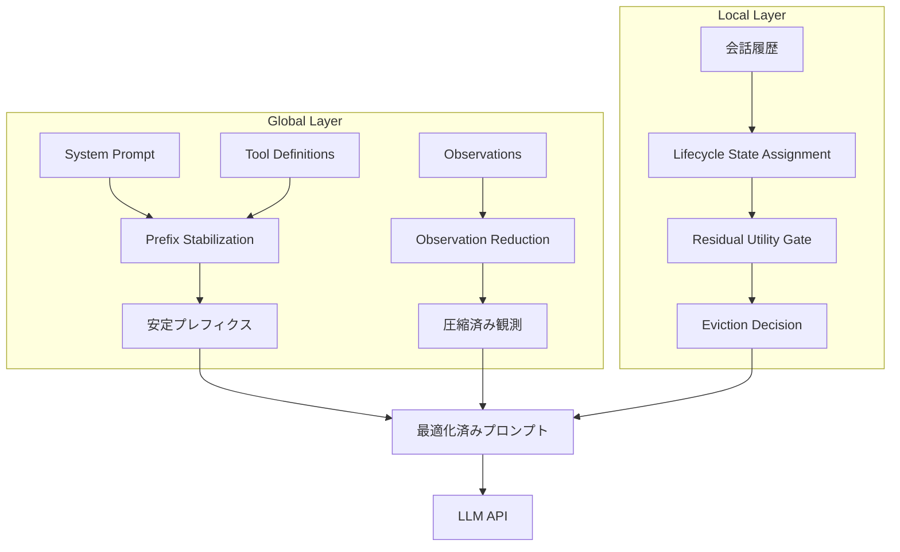

本記事は [TokenPilot: Cache-Efficient Context Management for LLM Agents](https://arxiv.org/abs/2606.17016) の解説記事です。

## 論文概要

Xu et al. (2026) は、LLMエージェントのプロンプトキャッシュ効率を最大化する二重粒度（Dual-Granularity）コンテキスト管理フレームワーク TokenPilot を提案している。グローバル層（Ingestion-Aware Compaction）でキャッシュプレフィクスの連続性を維持しつつ観測データを圧縮し、ローカル層（Lifecycle-Aware Eviction）でターンごとの不要コンテキストを除去する。PinchBenchでキャッシュヒット率を38.7%から79.2%に改善し、コストを最大87.0%削減したと報告されている（論文Table 1, Table 2）。

この記事は [Zenn記事: プロンプトキャッシュが覆すコンテキスト管理の常識：圧縮vs全保持の判断基準と実装](https://zenn.dev/0h_n0/articles/6319db2cded345) の深掘りです。Zenn記事で解説したプロンプトキャッシュの設計原則を、TokenPilotがどのように体系化しているかを論文に基づいて詳述する。

## 情報源

- **arXiv ID**: 2606.17016
- **URL**: [https://arxiv.org/abs/2606.17016](https://arxiv.org/abs/2606.17016)
- **著者**: Buqiang Xu, Zirui Xue, Dianmou Chen et al. (Zhejiang University, UESTC, HomologyAI)
- **提出日**: 2026年6月15日
- **分野**: cs.AI, cs.CL

## 背景と動機

LLMエージェントはマルチターン対話の中でツール呼び出し、Web観測、コード実行結果などを蓄積し、コンテキスト長が急速に増大する。OpenAIやAnthropicが提供するプロンプトキャッシュ機構では、プレフィクスが前回リクエストと一致する部分をキャッシュから読み込むことで、入力トークンコストを最大90%削減できる。しかし、エージェントのプロンプトには実行時に変動するフィールド（タイムスタンプ、セッションID、動的HTMLなど）が含まれるため、プレフィクスの連続性が頻繁に破壊され、キャッシュヒット率が低下する。

従来のコンテキスト管理手法は主に2つのアプローチに分かれる。第一に、要約・圧縮型（例: MemoryBank, Reflexion）は過去の会話を要約してトークン数を削減するが、キャッシュプレフィクスの安定性を考慮しておらず、要約のたびにプレフィクスが変化してキャッシュミスを引き起こす。第二に、全保持型はキャッシュヒット率を維持するが、コンテキスト長の増大に伴いコストが線形に増加し、コンテキストウィンドウの上限に達するリスクがある。

著者らは、キャッシュの連続性を維持しながら不要コンテキストを除去するという、両アプローチの利点を統合する設計が必要であると指摘している。

## 主要な貢献

- **二重粒度フレームワーク**: グローバル層（プロンプト全体のプレフィクス安定化と観測データ圧縮）とローカル層（ターン単位のライフサイクルベース除去）を組み合わせ、キャッシュ効率とコンテキスト品質を両立する設計を提案した
- **Prefix Stabilization**: ランタイム可変フィールドを静的プレースホルダに正規化（canonicalization）し、ツール定義をプレフィクス先頭に再配置することで、キャッシュプレフィクスの連続性を構造的に保証する手法を導入した
- **Lifecycle-Aware Eviction**: 各コンテキスト要素にActive/Completed/Evictableのライフサイクル状態を付与し、Residual Utility Gatesで早期除去を防止する除去戦略を設計した
- **PinchBench・Claw-Evalでの検証**: 2つのベンチマークでタスク精度を維持しつつコストを56.0-87.0%削減し、キャッシュヒット率を38.7%→79.2%（PinchBench）、67.2%→83.1%（Claw-Eval）に改善したと報告している

## 技術的詳細

### 全体アーキテクチャ

TokenPilotは、LLMへのリクエスト送信前にコンテキストを最適化するミドルウェアとして動作する。グローバル層とローカル層の2段階で処理を行う。



### グローバル層: Ingestion-Aware Compaction

グローバル層は、プロンプトに取り込まれる（ingest）データのうち、キャッシュを破壊する要素を制御する。2つのサブモジュールから構成される。

**Prefix Stabilization（プレフィクス安定化）**

プロンプトのプレフィクス部分（システムプロンプト + ツール定義）を正規化し、リクエスト間で一致する長さを最大化する。具体的には以下の2つの操作を行う。

1. **Canonicalization（正規化）**: タイムスタンプ、セッションID、リクエストIDなどの実行時可変フィールドを静的プレースホルダ（例: `{TIMESTAMP}`, `{SESSION_ID}`）に置換する。実際の値はリカバリツール経由で動的に取得可能にする
2. **Tool Definition Repositioning（ツール定義再配置）**: ツール定義をプロンプトの先頭に移動し、後続の会話履歴が変化してもプレフィクスが安定するよう構造を固定する

プレフィクスの安定化により、キャッシュヒット長 $L_{\text{hit}}$ は以下のように定式化される。

$$
L_{\text{hit}} = \max_{k} \left\{ k \mid P_t[0:k] = P_{t-1}[0:k] \right\}
$$

ここで、
- $P_t$: ターン $t$ でのプロンプトトークン列
- $P_t[0:k]$: 先頭 $k$ トークンのプレフィクス

Prefix Stabilizationなしの場合、可変フィールドの位置 $p_{\text{volatile}}$ でプレフィクスが切断されるため $L_{\text{hit}} \leq p_{\text{volatile}}$ となるが、正規化により $L_{\text{hit}}$ をシステムプロンプト + ツール定義の全長まで拡張できる。

**Observation Reduction（観測データ圧縮）**

ツール実行結果（HTML、コード出力、画像等）を以下の手法で圧縮する。

- **HTML Slimming**: 不要なタグ・属性・スクリプトを除去し、テキストコンテンツのみを抽出
- **Execution Output Truncation**: コード実行結果を50,000文字に制限し、超過分は先頭・末尾を保持して中間を切断
- **Deduplication**: 重複する観測データ（同一URLの複数回取得等）を検出し、最新版のみを保持
- **Image Downsampling**: ビットマップ画像を100KB以下、SVGを50KB以下にダウンサンプリング

### ローカル層: Lifecycle-Aware Eviction

ローカル層は、会話履歴中の各コンテキスト要素にライフサイクル状態を付与し、不要になった要素を除去する。

**ライフサイクル状態**

各コンテキスト要素 $c_i$ は以下の3つの状態のいずれかを持つ。

- **Active** ($u(c_i) = 1$): 現在のタスク実行に必要。除去不可
- **Completed** ($u(c_i) \in \{0, 1\}$): タスクは完了したが、後続タスクへの残留有用性（residual utility）が存在する可能性がある
- **Evictable** ($u(c_i) = 0$): 不要。除去可能

ここで $u(c_i)$ はコンテキスト要素 $c_i$ の有用性（utility）スコアであり、0または1の二値をとる。

**Residual Utility Gates（残留有用性ゲート）**

Completed状態の要素を即座にEvictableにせず、残留有用性を評価するゲート機構である。著者らはオンライン推定器（Qwen3.5-35B-A3B）を用いて、Completed要素が後続ターンで参照される可能性をバッチ推定する。

残留有用性の判定関数は以下のように定義される。

$$
g(c_i) = \begin{cases}
1 & \text{if } \hat{p}(c_i \text{ is referenced in future}) > \delta \\
0 & \text{otherwise}
\end{cases}
$$

ここで、
- $\hat{p}(\cdot)$: 推定器による将来の参照確率の推定値
- $\delta$: 閾値パラメータ

$g(c_i) = 1$ のとき、Completed要素のutilityは1に維持され（除去されない）、$g(c_i) = 0$ のときEvictableに遷移する。

**Batch-Turn Schedule（バッチターンスケジュール）**

推定器の呼び出しオーバーヘッドを削減するため、$B = 3$ ターンごとにバッチで推定を実行する。推定器にはQwen3.5-35B-A3B（Mixture of Experts、アクティブパラメータ3B）を使用し、1回あたりのコストは$0.03未満と報告されている。

**Recovery Tool（リカバリツール）**

除去されたコンテキスト要素を必要に応じて再取得するためのツールである。Prefix Stabilizationで置換された動的フィールドの実際の値や、Evictionで除去された過去の観測データをオンデマンドで取得する。リカバリツールを無効化した場合、スコアが80.9から77.1に低下し、コストが$2.79から$4.03に増加すると報告されている（論文Table 3）。

### コスト削減の定式化

ターン $t$ での総コスト $C_t$ は以下で表される。

$$
C_t = L_{\text{hit},t} \cdot r_{\text{hit}} + (L_{\text{total},t} - L_{\text{hit},t}) \cdot r_{\text{miss}} + L_{\text{out},t} \cdot r_{\text{out}}
$$

ここで、
- $L_{\text{hit},t}$: キャッシュヒットしたトークン数
- $L_{\text{total},t}$: 入力トークン総数
- $L_{\text{out},t}$: 出力トークン数
- $r_{\text{hit}} = \$0.075/\text{M}$: キャッシュヒットトークン単価
- $r_{\text{miss}} = \$0.75/\text{M}$: キャッシュミストークン単価
- $r_{\text{out}} = \$4.50/\text{M}$: 出力トークン単価

TokenPilotは $L_{\text{hit},t}$ を最大化し、$(L_{\text{total},t} - L_{\text{hit},t})$ を最小化することで総コストを削減する。キャッシュヒットトークンはミストークンの10分の1の単価であるため、ヒット率の改善がコスト削減に直結する。

## 実装のポイント

TokenPilotの設計思想をPythonで実装する際の主要な検討事項を以下に整理する。

**プレフィクス正規化**: システムプロンプトとツール定義を固定テンプレートとして管理し、可変フィールドをプレースホルダに置換する。プレースホルダの値はリカバリツール経由で取得するため、ツール定義に動的フィールド取得用のAPIを追加する。

**ライフサイクル管理**: 各コンテキスト要素にメタデータ（状態、作成ターン、最終参照ターン）を付与し、除去判定の入力とする。状態遷移はイベント駆動で管理する。

**バッチ推定の実装**: 推定器の呼び出しは非同期で行い、メインのLLM呼び出しと並列化してレイテンシへの影響を最小化する。

```python
from dataclasses import dataclass, field
from enum import Enum


class LifecycleState(Enum):
    """コンテキスト要素のライフサイクル状態"""
    ACTIVE = "active"
    COMPLETED = "completed"
    EVICTABLE = "evictable"


@dataclass
class ContextElement:
    """ライフサイクル管理付きコンテキスト要素"""
    content: str
    role: str
    turn_created: int
    state: LifecycleState = LifecycleState.ACTIVE
    utility: float = 1.0
    last_referenced_turn: int = 0


@dataclass
class TokenPilotManager:
    """TokenPilotのコンテキスト管理

    Args:
        batch_interval: 推定器バッチ実行間隔（ターン数）
        residual_threshold: 残留有用性の閾値
        max_observation_chars: 観測データの最大文字数
    """
    batch_interval: int = 3
    residual_threshold: float = 0.5
    max_observation_chars: int = 50_000
    _elements: list[ContextElement] = field(default_factory=list)
    _current_turn: int = 0
    _stable_prefix: str = ""

    def set_stable_prefix(self, system_prompt: str, tool_definitions: list[dict]) -> str:
        """プレフィクス安定化: 可変フィールドをプレースホルダに置換

        Args:
            system_prompt: システムプロンプト（可変フィールド含む）
            tool_definitions: ツール定義のリスト

        Returns:
            正規化済みプレフィクス文字列
        """
        import re
        # 可変フィールドの正規化
        normalized = re.sub(
            r"\d{4}-\d{2}-\d{2}T\d{2}:\d{2}:\d{2}",
            "{TIMESTAMP}",
            system_prompt,
        )
        normalized = re.sub(r"session_[a-f0-9]+", "{SESSION_ID}", normalized)

        # ツール定義をプレフィクス先頭に配置
        tools_str = "\n".join(
            f"<tool>{t['name']}: {t['description']}</tool>"
            for t in tool_definitions
        )
        self._stable_prefix = tools_str + "\n" + normalized
        return self._stable_prefix

    def add_observation(self, content: str, role: str = "tool") -> ContextElement:
        """観測データを圧縮して追加

        Args:
            content: 観測データ（HTML, 実行結果等）
            role: メッセージロール

        Returns:
            追加されたコンテキスト要素
        """
        compressed = self._reduce_observation(content)
        elem = ContextElement(
            content=compressed,
            role=role,
            turn_created=self._current_turn,
            last_referenced_turn=self._current_turn,
        )
        self._elements.append(elem)
        return elem

    def _reduce_observation(self, content: str) -> str:
        """Observation Reduction: HTML slimming + truncation"""
        import re
        # HTML slimming: script/style除去
        cleaned = re.sub(r"<script[^>]*>.*?</script>", "", content, flags=re.DOTALL)
        cleaned = re.sub(r"<style[^>]*>.*?</style>", "", cleaned, flags=re.DOTALL)
        cleaned = re.sub(r"<[^>]+>", " ", cleaned)
        cleaned = re.sub(r"\s+", " ", cleaned).strip()

        # Truncation: 50k文字制限
        if len(cleaned) > self.max_observation_chars:
            head = cleaned[: self.max_observation_chars // 2]
            tail = cleaned[-self.max_observation_chars // 2 :]
            cleaned = head + "\n...[truncated]...\n" + tail
        return cleaned

    def evict(self, estimator_scores: dict[int, float] | None = None) -> list[ContextElement]:
        """Lifecycle-Aware Eviction: 不要要素を除去

        Args:
            estimator_scores: 推定器によるresidual utility推定値
                key=要素インデックス, value=将来参照確率

        Returns:
            除去された要素のリスト
        """
        self._current_turn += 1
        evicted: list[ContextElement] = []

        for i, elem in enumerate(self._elements):
            if elem.state == LifecycleState.ACTIVE:
                # タスク完了判定（簡略化: 直近ターンで参照なし）
                if self._current_turn - elem.last_referenced_turn > 2:
                    elem.state = LifecycleState.COMPLETED

            if elem.state == LifecycleState.COMPLETED:
                # Residual Utility Gate
                score = (estimator_scores or {}).get(i, 0.0)
                if score > self.residual_threshold:
                    elem.utility = 1.0  # 残留有用性あり: 維持
                else:
                    elem.state = LifecycleState.EVICTABLE
                    elem.utility = 0.0

        # Evictable要素を除去
        self._elements, evicted = [], []
        for elem in self._elements[:]:
            if elem.state == LifecycleState.EVICTABLE:
                evicted.append(elem)
            else:
                self._elements.append(elem)

        return evicted

    def build_prompt(self) -> str:
        """最適化済みプロンプトを構築

        Returns:
            安定プレフィクス + アクティブコンテキスト
        """
        active_context = "\n".join(
            f"[{e.role}] {e.content}"
            for e in self._elements
            if e.state != LifecycleState.EVICTABLE
        )
        return self._stable_prefix + "\n" + active_context
```

**推定器の選択**: 著者らはQwen3.5-35B-A3B（MoEモデル、アクティブパラメータ3B）を推定器に使用している。MoEアーキテクチャにより推論コストが低く、1回あたり$0.03未満で3ターン分のバッチ推定が可能である。推定器の精度がEviction判定に直結するため、タスクドメインに応じた推定器の選択が重要である。

**リカバリツールの設計**: 除去したコンテキストをキーバリューストアに保持し、LLMがリカバリツールを呼び出すことで再取得する設計が必要である。リカバリツールを無効化するとスコアが3.8ポイント低下しコストも増加するため（論文Table 3）、除去とリカバリは一体で設計すべきである。

## Production Deployment Guide

### AWS実装パターン（コスト最適化重視）

TokenPilotの本番運用では、コンテキスト管理ミドルウェア（プレフィクス安定化 + 観測圧縮 + ライフサイクル管理）、推定器（Residual Utility推定用の軽量LLM）、リカバリストア（除去済みコンテキストの保管）の3つのワークロードを考慮する必要がある。

| 構成 | トラフィック | 主要サービス | 月額概算 |
|------|-------------|-------------|---------|
| Small | ~100 req/日 | Lambda + Bedrock (Claude) + DynamoDB | $80-200 |
| Medium | ~1,000 req/日 | ECS Fargate + Bedrock + ElastiCache Redis | $400-900 |
| Large | 10,000+ req/日 | EKS + Karpenter (Spot) + Bedrock + ElastiCache Cluster | $2,500-6,000 |

Small構成ではLambda関数でコンテキスト管理ロジックを実行し、推定器はBedrock経由で軽量モデルを呼び出す。リカバリストアにはDynamoDB（On-Demandモード）を使用する。Medium構成ではECS FargateでステートフルなTokenPilotミドルウェアを常駐させ、ElastiCache Redisでリカバリストアの読み取りレイテンシを低減する。Large構成ではEKS + Karpenter（Spot優先）で推定器とミドルウェアをコンテナ化し、ElastiCache Clusterで高可用性を確保する。

**コスト削減効果**: TokenPilotの導入によりLLM APIコストを56-87%削減できるため、ミドルウェアの運用コスト（推定器の$0.03/3ターン含む）を差し引いても大幅なコスト削減が見込める。

**注意**: 上記は2026年8月時点のAWS ap-northeast-1料金に基づく概算値であり、実際のコストはトラフィックパターン、リージョン、バースト使用量により変動する。最新料金はAWS料金計算ツールで確認を推奨する。

### Terraformインフラコード

**Small構成（Serverless）**:

```hcl
# TokenPilot Small構成: Lambda + Bedrock + DynamoDB
# コスト目安: $80-200/月 (ap-northeast-1)

resource "aws_dynamodb_table" "recovery_store" {
  name         = "tokenpilot-recovery-store"
  billing_mode = "PAY_PER_REQUEST"  # On-Demand: アイドルコスト回避
  hash_key     = "session_id"
  range_key    = "element_id"

  attribute {
    name = "session_id"
    type = "S"
  }
  attribute {
    name = "element_id"
    type = "S"
  }

  ttl {
    attribute_name = "expires_at"
    enabled        = true  # 除去済みコンテキストの自動期限切れ
  }

  server_side_encryption { enabled = true }  # KMS暗号化

  tags = { Project = "tokenpilot", Environment = "production" }
}

resource "aws_lambda_function" "context_manager" {
  function_name = "tokenpilot-context-manager"
  runtime       = "python3.12"
  handler       = "handler.manage_context"
  memory_size   = 1024  # コンテキスト操作にメモリが必要
  timeout       = 60
  role          = aws_iam_role.lambda_exec.arn

  environment {
    variables = {
      RECOVERY_TABLE     = aws_dynamodb_table.recovery_store.name
      BATCH_INTERVAL     = "3"      # 推定器バッチ間隔
      RESIDUAL_THRESHOLD = "0.5"    # 残留有用性閾値
      MAX_OBS_CHARS      = "50000"  # 観測データ上限
      BEDROCK_MODEL_ID   = "anthropic.claude-sonnet-4-20250514-v1:0"
      ESTIMATOR_MODEL_ID = "meta.llama3-3-8b-instruct-v1:0"
    }
  }
  tracing_config { mode = "Active" }  # X-Ray
}

# IAMロール: 最小権限
resource "aws_iam_role_policy" "lambda_policy" {
  name = "tokenpilot-lambda-policy"
  role = aws_iam_role.lambda_exec.id
  policy = jsonencode({
    Version = "2012-10-17"
    Statement = [
      {
        Effect   = "Allow"
        Action   = ["dynamodb:PutItem", "dynamodb:GetItem", "dynamodb:Query"]
        Resource = aws_dynamodb_table.recovery_store.arn
      },
      {
        Effect   = "Allow"
        Action   = ["bedrock:InvokeModel"]
        Resource = "arn:aws:bedrock:ap-northeast-1::foundation-model/*"
      },
      {
        Effect   = "Allow"
        Action   = ["logs:CreateLogGroup", "logs:CreateLogStream", "logs:PutLogEvents"]
        Resource = "arn:aws:logs:ap-northeast-1:*:*"
      }
    ]
  })
}

# CloudWatchアラーム: コスト異常検知
resource "aws_cloudwatch_metric_alarm" "bedrock_token_spike" {
  alarm_name          = "tokenpilot-bedrock-token-spike"
  comparison_operator = "GreaterThanThreshold"
  evaluation_periods  = 2
  metric_name         = "InputTokenCount"
  namespace           = "AWS/Bedrock"
  period              = 300
  statistic           = "Sum"
  threshold           = 100000
  alarm_actions       = [aws_sns_topic.alerts.arn]
}
```

**Large構成（Container）**:

```hcl
# TokenPilot Large構成: EKS + Karpenter + ElastiCache
# コスト目安: $2,500-6,000/月 (ap-northeast-1)

module "eks" {
  source          = "terraform-aws-modules/eks/aws"
  version         = "~> 20.0"
  cluster_name    = "tokenpilot-cluster"
  cluster_version = "1.31"
  vpc_id          = module.vpc.vpc_id
  subnet_ids      = module.vpc.private_subnets

  cluster_endpoint_public_access = false  # プライベートエンドポイントのみ
}

# Karpenter: Spot優先で自動スケーリング
resource "kubectl_manifest" "karpenter_nodepool" {
  yaml_body = yamlencode({
    apiVersion = "karpenter.sh/v1"
    kind       = "NodePool"
    metadata   = { name = "tokenpilot-pool" }
    spec = {
      template = {
        spec = {
          requirements = [
            { key = "karpenter.sh/capacity-type", operator = "In", values = ["spot", "on-demand"] },
            { key = "node.kubernetes.io/instance-type", operator = "In",
              values = ["m7i.xlarge", "m7i.2xlarge", "c7i.xlarge"] },
          ]
        }
      }
      limits   = { cpu = "64", memory = "128Gi" }
      disruption = { consolidationPolicy = "WhenEmptyOrUnderutilized" }
    }
  })
}

# ElastiCache: リカバリストア高速化
resource "aws_elasticache_replication_group" "recovery_cache" {
  replication_group_id = "tokenpilot-recovery"
  description          = "TokenPilot recovery store cache"
  node_type            = "cache.r7g.large"
  num_cache_clusters   = 2
  at_rest_encryption_enabled = true
  transit_encryption_enabled = true
}

# AWS Budgets: 月額コストアラート
resource "aws_budgets_budget" "tokenpilot" {
  name         = "tokenpilot-monthly"
  budget_type  = "COST"
  limit_amount = "6000"
  limit_unit   = "USD"
  time_unit    = "MONTHLY"

  notification {
    comparison_operator       = "GREATER_THAN"
    threshold                 = 80
    threshold_type            = "PERCENTAGE"
    notification_type         = "ACTUAL"
    subscriber_sns_topic_arns = [aws_sns_topic.alerts.arn]
  }
}
```

### 運用・監視設定

**CloudWatch Logs Insights**（キャッシュヒット率とコスト効率の監視）:

```
fields @timestamp, @message
| filter event = "llm_request"
| stats avg(cache_hit_rate) as avg_hit_rate,
        sum(cache_hit_tokens) as total_hit_tokens,
        sum(cache_miss_tokens) as total_miss_tokens,
        sum(cost_usd) as total_cost,
        count(*) as request_count
  by bin(1h)
| sort @timestamp desc
```

**CloudWatchアラーム + X-Ray + Cost Explorer**:

```python
import boto3
from aws_xray_sdk.core import xray_recorder, patch_all

patch_all()  # boto3自動計装


def create_tokenpilot_alarms() -> None:
    """キャッシュヒット率低下 + Bedrockトークンスパイク検知"""
    cw = boto3.client("cloudwatch")
    alarms = [
        ("tokenpilot-cache-hit-low", "CacheHitRate", "TokenPilot", 60.0, "LessThanThreshold"),
        ("tokenpilot-latency-p95", "RequestLatency", "TokenPilot", 5000, "GreaterThanThreshold"),
        ("tokenpilot-bedrock-tokens", "InputTokenCount", "AWS/Bedrock", 500000, "GreaterThanThreshold"),
    ]
    for name, metric, ns, thresh, op in alarms:
        cw.put_metric_alarm(
            AlarmName=name, MetricName=metric, Namespace=ns,
            Statistic="Average", Period=300, EvaluationPeriods=2,
            Threshold=thresh, ComparisonOperator=op,
            AlarmActions=["arn:aws:sns:ap-northeast-1:ACCOUNT:tokenpilot-alerts"],
        )


@xray_recorder.capture("tokenpilot_manage")
def manage_context_handler(event: dict) -> dict:
    """コンテキスト管理処理のトレース"""
    sub = xray_recorder.current_subsegment()
    sub.put_annotation("session_id", event.get("session_id", "unknown"))
    sub.put_annotation("turn", event.get("turn", 0))

    # コンテキスト管理実行（省略）
    result = {"cache_hit_rate": 0.79, "evicted_count": 3}

    sub.put_metadata("cache_hit_rate", result["cache_hit_rate"])
    sub.put_metadata("evicted_count", result["evicted_count"])
    return result


def daily_cost_report() -> None:
    """日次コストレポート: Bedrock/Lambda/ElastiCacheコスト抽出"""
    ce = boto3.client("ce")
    import datetime
    today = datetime.date.today().isoformat()
    yesterday = (datetime.date.today() - datetime.timedelta(days=1)).isoformat()

    resp = ce.get_cost_and_usage(
        TimePeriod={"Start": yesterday, "End": today},
        Granularity="DAILY",
        Metrics=["UnblendedCost"],
        GroupBy=[{"Type": "DIMENSION", "Key": "SERVICE"}],
    )
    total = sum(
        float(g["Metrics"]["UnblendedCost"]["Amount"])
        for r in resp["ResultsByTime"] for g in r["Groups"]
    )
    if total > 100.0:
        sns = boto3.client("sns")
        sns.publish(
            TopicArn="arn:aws:sns:ap-northeast-1:ACCOUNT:tokenpilot-alerts",
            Subject="TokenPilot Daily Cost Alert",
            Message=f"Daily cost exceeded $100: ${total:.2f}",
        )
```

### コスト最適化チェックリスト

**アーキテクチャ選択**:
- [ ] トラフィック量で構成選択（~100 req/日: Serverless、~1000: Hybrid、10000+: Container）
- [ ] TokenPilotミドルウェアの配置（Lambda vs ECS vs EKS Pod）
- [ ] 推定器モデルの選択（コスト vs 精度のトレードオフ）

**リソース最適化**:
- [ ] EC2/EKS: Spot Instances優先（最大90%削減）
- [ ] Reserved Instances: 1年コミット（最大72%削減）
- [ ] Savings Plans検討（Compute Savings Plans）
- [ ] Lambda: メモリサイズ最適化（1024MB推奨）
- [ ] ECS/EKS: Karpenter WhenEmptyOrUnderutilizedでアイドル時スケールダウン

**LLMコスト削減**:
- [ ] Prompt Caching有効化（TokenPilotで79-83%ヒット率）
- [ ] Batch-Turn推定間隔の調整（B=3がデフォルト、トラフィックに応じて調整）
- [ ] 観測データ圧縮パラメータの調整（50k文字上限、画像100KB上限）
- [ ] リカバリツール有効化（無効化はコスト増加を招く）
- [ ] 推定器にMoEモデル使用（アクティブパラメータ削減で$0.03/バッチ）

**監視・アラート**:
- [ ] AWS Budgets設定（80%/100%通知）
- [ ] CloudWatchアラーム（キャッシュヒット率、レイテンシ、トークン使用量）
- [ ] Cost Anomaly Detection有効化
- [ ] 日次コストレポート（Bedrock/Lambda/ElastiCache内訳）
- [ ] X-Rayトレーシング（コンテキスト管理のボトルネック特定）

**リソース管理**:
- [ ] 未使用リソース月次棚卸し
- [ ] タグ戦略（Project/Environment/Owner必須）
- [ ] DynamoDB TTLでリカバリストア自動期限切れ
- [ ] CloudWatch Logs保持期間設定（30日推奨）
- [ ] 開発環境夜間停止（EKS/ECSスケールダウン）

## 実験結果

### PinchBenchとClaw-Evalでの評価

著者らはPinchBenchとClaw-Evalの2つのLLMエージェントベンチマークで評価を行っている。ベースモデルにはGPT-5.4-miniを使用している。論文Table 1, Table 2の主要結果を以下に示す。

| ベンチマーク | 設定 | Score | Cost ($) | コスト削減率 |
|-------------|------|-------|----------|------------|
| PinchBench Isolated | Vanilla | — | $8.36 | — |
| PinchBench Isolated | TokenPilot | 81.0 | $3.22 | 61.3% |
| PinchBench Continuous | Vanilla | — | $7.24 | — |
| PinchBench Continuous | TokenPilot | 81.3 | $2.79 | 61.5% |
| Claw-Eval Isolated | Vanilla | — | $5.16 | — |
| Claw-Eval Isolated | TokenPilot | 63.1 | $2.27 | 56.0% |
| Claw-Eval Continuous | Vanilla | — | $81.38 | — |
| Claw-Eval Continuous | TokenPilot | 60.8 | $10.58 | 87.0% |

Claw-Eval Continuousで87.0%のコスト削減を達成している点が注目される。Continuous設定では連続タスクにより会話履歴が蓄積するため、Lifecycle-Aware Evictionの効果がより顕著に現れると著者らは分析している。

### キャッシュヒット率の改善

| ベンチマーク | Vanilla | TokenPilot | 改善幅 |
|-------------|---------|------------|--------|
| PinchBench | 38.7% | 79.2% | +40.5pp |
| Claw-Eval | 67.2% | 83.1% | +15.9pp |

PinchBenchでは40.5ポイント、Claw-Evalでは15.9ポイントのヒット率改善が報告されている。PinchBenchでの改善幅が大きいのは、Vanilla設定でのプレフィクス破壊が頻繁であったためと考えられる。

### Ablation Study

各コンポーネントの寄与を分析するablation結果が論文Table 3で報告されている。

| 構成 | Cost ($) | Score |
|------|----------|-------|
| Vanilla（ベースライン） | $7.24 | — |
| + Global層のみ | $4.22 | — |
| + Global + Local（TokenPilot） | $2.79 | 81.3 |
| TokenPilot（Recovery無効） | $4.03 | 77.1 |

Global層の追加で$7.24→$4.22（41.7%削減）、Local層の追加でさらに$4.22→$2.79（33.9%削減）と、両層が相補的にコスト削減に寄与している。Recovery Toolの無効化はスコア低下（81.3→77.1）とコスト増加（$2.79→$4.03）の両方を引き起こしており、除去とリカバリの一体設計が重要であることを示している。

## 実運用への応用

TokenPilotの設計は、Zenn記事で解説したプロンプトキャッシュの活用戦略と密接に関連する。実運用における適用シナリオを以下に整理する。

**マルチターンエージェントのコスト管理**: カスタマーサポートBot、コード生成エージェント、データ分析アシスタントなど、長い会話を伴うエージェントでは、TokenPilotのLifecycle-Aware Evictionにより不要な過去コンテキストを除去しつつキャッシュ効率を維持できる。Claw-Eval Continuousで87.0%のコスト削減が報告されていることから、連続タスク実行型エージェントで特に効果が高いと考えられる。

**プロンプトテンプレート設計への示唆**: Prefix Stabilizationの知見は、エージェントフレームワーク（LangChain, LlamaIndex等）のプロンプトテンプレート設計に応用できる。システムプロンプトとツール定義を固定プレフィクスとして先頭に配置し、可変フィールドをリカバリツール経由で取得する設計は、フレームワークレベルでの標準化が可能である。

**制約と限界**: TokenPilotは特定のAPIプロバイダ（プレフィクスキャッシュをサポートするもの）に依存しており、プロバイダのキャッシュ実装（最小プレフィクス長、キャッシュTTL等）によって効果が変動する。また、推定器の精度がEviction判定に直結するため、ドメイン固有のタスクでは推定器のファインチューニングが必要になる可能性がある。

## 関連研究

- **MemGPT / Letta** (Packer et al., 2023): 仮想メモリ階層をLLMに導入し、メインコンテキストとアーカイバルストレージ間でコンテキストをページング管理する手法。TokenPilotのリカバリツールはMemGPTのページングと類似するが、TokenPilotはキャッシュプレフィクスの安定性を明示的に最適化している点が異なる
- **Reflexion** (Shinn et al., 2023): エージェントの過去の行動を自然言語で要約（反省）し、次回の行動に活用する手法。要約によりコンテキスト長を削減するが、要約のたびにプレフィクスが変化するためキャッシュ効率は考慮されていない。TokenPilotのGlobal層はこの問題をPrefix Stabilizationで解決している
- **SCM (Selective Context Management)** (Li et al., 2023): 情報量に基づいてコンテキストをフィルタリングする手法。情報理論的な圧縮率は優れるが、キャッシュ連続性の維持は対象外である。TokenPilotはSCMの圧縮アプローチとキャッシュ最適化を統合した位置づけにある
- **Anthropic Prompt Caching** (2024): Anthropicが提供するプロンプトキャッシュ機構。静的プレフィクスのキャッシュにより入力コストを90%削減可能だが、プレフィクスの安定化はユーザー側の責任である。TokenPilotはこの安定化を自動化するフレームワークとして位置づけられる

## まとめと今後の展望

TokenPilotは、プロンプトキャッシュの連続性維持と不要コンテキスト除去を両立する二重粒度フレームワークである。Global層（Prefix Stabilization + Observation Reduction）でキャッシュヒット率を38.7%→79.2%に改善し、Local層（Lifecycle-Aware Eviction + Recovery Tool）で不要コンテキストを除去することで、タスク精度を維持しつつコストを最大87.0%削減したと著者らは報告している。

推定器のコスト（$0.03/3ターン）とリカバリツールのオーバーヘッドが追加されるが、LLM APIコストの削減幅がこれらを大幅に上回る点は実用上重要である。一方で、推定器の精度がドメイン依存であること、プロバイダ固有のキャッシュ実装への依存がある点は、実運用では注意が必要である。

## 参考文献

- **arXiv**: [https://arxiv.org/abs/2606.17016](https://arxiv.org/abs/2606.17016)
- **MemGPT**: [https://arxiv.org/abs/2310.08560](https://arxiv.org/abs/2310.08560)
- **Reflexion**: [https://arxiv.org/abs/2303.11366](https://arxiv.org/abs/2303.11366)
- **SCM**: [https://arxiv.org/abs/2310.06201](https://arxiv.org/abs/2310.06201)
- **Related Zenn article**: [https://zenn.dev/0h_n0/articles/6319db2cded345](https://zenn.dev/0h_n0/articles/6319db2cded345)
