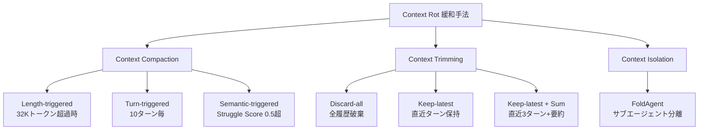

本記事は [Diagnosing and Mitigating Context Rot in Long-horizon Search](https://arxiv.org/abs/2606.29718) の解説記事です。

## 論文概要

Xia et al. (2026) は、LLMベースの検索エージェントにおいて、トラジェクトリ（推論履歴）が長くなるにつれてモデルの精度が急激に低下する現象を「Context Rot」と定義し、その診断手法と7つの緩和策を体系的に提案している。著者らはBrowseComp（100サンプル）およびBrowseComp-Plus（200インスタンス）の2つのベンチマークで4つのモデルを評価し、Qwen3.5-397B-A17Bで ReActベースライン54.4%に対しFoldAgent（サブエージェント分離）で64.9%を達成したと報告している（論文Table 3）。また、Context Rot率を53.4%から最小1.8%まで低減できることを示している。

この記事は [Zenn記事: プロンプトキャッシュが覆すコンテキスト管理の常識：圧縮vs全保持の判断基準と実装](https://zenn.dev/0h_n0/articles/6319db2cded345) の深掘りです。Zenn記事ではプロンプトキャッシュの観点からコンテキスト管理の圧縮と全保持のトレードオフを議論しているが、本論文はコンテキスト長増大そのものがもたらす性能劣化メカニズムを実験的に解明し、緩和手法の選択指針を提供している。

## 情報源

- **arXiv ID**: 2606.29718
- **URL**: [https://arxiv.org/abs/2606.29718](https://arxiv.org/abs/2606.29718)
- **著者**: Shijie Xia, Yikun Wang, Zhen Huang, Pengfei Liu
- **提出日**: 2026年6月
- **分野**: cs.CL, cs.AI

## 背景と動機

LLMを用いたWeb検索エージェント（Deep Research, Open Deep Research等）は、複雑な質問に対して複数回の検索・読解を繰り返すReActパターンで動作する。このとき、各ステップの観測結果（Webページの内容、検索結果等）がコンテキストウィンドウに累積的に追加される。

従来のlong-context研究では「Needle-in-a-Haystack」テストのような受動的な情報検索タスクが中心であり、モデルが能動的に探索戦略を修正しながら推論する長期検索タスクにおけるコンテキスト長増大の影響は十分に検討されていなかった。

著者らは、200Kトークン以上のコンテキストウィンドウを持つ最新モデルでも、トラジェクトリが長くなるにつれて「正解にたどり着けずに探索を放棄する」「自信なく誤った回答を出す」といった劣化が顕著に観察されることに着目し、この現象をContext Rotと名付けて体系的に分析している。

## 主要な貢献

- **Context Rotの定義と診断**: トラジェクトリ長と精度の関係を4つの終端状態（Confident Answer / Uncertain Answer / Give Up / No Answer）に分類し、劣化の性質を定量的に可視化する枠組みを確立した
- **Struggle Scoreメトリクス**: LLM-as-judgeを用いてエージェントの探索行動における「もがき度合い」を0-1のスコアで定量化する手法を導入し、人間アノテーションとの一致率91.4%を達成した
- **7つの緩和手法の体系化**: Context Compaction（3種）、Context Trimming（3種）、Context Isolation（1種）の3カテゴリ・7手法を統一的に評価し、各手法の特性と適用指針を明らかにした
- **Rejection Samplingとの併用効果**: 緩和手法とRejection Sampling（複数回実行して最良結果を選択）の組み合わせで+2.6%から+4.9%の追加改善を確認した

## 技術的詳細

### 4つの終端状態

著者らは、検索エージェントのトラジェクトリが終了する状態を以下の4つに分類している。

| 終端状態 | 定義 | Context Rotとの関係 |
|---------|------|-------------------|
| Confident Correct | 正解かつ高確信 | 健全な終了 |
| Confident Incorrect | 不正解だが高確信 | 初期に多い（幻覚的） |
| Uncertain Incorrect | 不正解かつ低確信 | Context Rotの典型的症状 |
| Give Up | 回答を放棄 | Context Rotの典型的症状 |

著者らの重要な知見は、トラジェクトリ長の増加に伴う終端状態の遷移パターンである。論文によれば「トラジェクトリが短い段階ではConfident Incorrect（自信ある誤答）が多いが、長くなるにつれてUncertain IncorrectとGive Upが急速に増加する」と報告されている。Confident Incorrectは情報不足による幻覚的回答であり、Uncertain IncorrectとGive Upはコンテキストの蓄積による判断能力の劣化（Context Rot）を示す。

終端状態の判定にはGPT-OSS-120Bをジャッジモデルとして使用し、300トラジェクトリの人手アノテーションとの一致率98.7%を達成している（論文Section 3.2）。

### BrowseCompにおける終端状態分布

著者らは4つのモデルについて、BrowseComp（100サンプル）での終端状態分布を報告している（論文Table 1）。

| モデル | Confident Correct | Confident Incorrect | Uncertain Incorrect | Give Up |
|-------|----------------:|-------------------:|-------------------:|--------:|
| Qwen3.5-397B-A17B | 32.8% | 14.0% | 33.6% | 19.8% |
| GLM-4.7 | 29.8% | 12.0% | 19.6% | 38.6% |
| GLM-5.0 | 41.8% | 13.4% | 26.2% | 18.6% |
| MiniMax-2.5 | 34.2% | 12.4% | 48.2% | 5.2% |

この分布から、モデルによってContext Rotの現れ方が異なることがわかる。GLM-4.7はGive Up率38.6%と探索放棄型の劣化が顕著であるのに対し、MiniMax-2.5はUncertain Incorrect率48.2%と不確実な誤答型の劣化が支配的である。GLM-5.0はConfident Correct率が最も高い41.8%を記録しているが、それでも6割近くが何らかの失敗状態に陥っている。

### Struggle Score

Struggle Scoreは、エージェントの探索行動における「行き詰まり度合い」を定量化するメトリクスである。著者らはLLM-as-judgeアプローチを採用し、各ステップのアクション履歴をジャッジモデルに入力して0から1のスコアを算出する。

$$
S_{\text{struggle}}(t) = f_{\text{judge}}(\mathcal{H}_{1:t})
$$

ここで、
- $S_{\text{struggle}}(t)$: ステップ$t$におけるStruggle Score（0: 順調、1: 完全に行き詰まり）
- $f_{\text{judge}}$: LLMジャッジ関数
- $\mathcal{H}_{1:t}$: ステップ1から$t$までのアクション履歴

このスコアは人間アノテーションとの一致率91.4%を達成しており、Context Compactionのセマンティックトリガーの閾値として使用される（後述）。Struggle Scoreが高い状態が続く場合、エージェントは同じ検索クエリを繰り返す、関連性の低いページを読む、といった非生産的な行動パターンに陥っていることを示す。

### 7つの緩和手法

著者らは、Context Rotの緩和策を3つのカテゴリに分類し、計7つの手法を提案・評価している。



#### Context Compaction（コンテキスト圧縮）

既存のコンテキストをLLMで要約し、短いテキストに圧縮する手法である。トリガー条件によって3つのバリアントが定義されている。

**Length-triggered（長さトリガー）**: コンテキスト長が32Kトークンを超えた時点で圧縮を実行する。シンプルだが、トリガー閾値の選定が重要である。

**Turn-triggered（ターン数トリガー）**: 10ターンごとに圧縮を実行する。トークン数に依存しないため、各ターンの出力長のばらつきに対して頑健である。

**Semantic-triggered（セマンティックトリガー）**: Struggle Scoreが0.5を超えた時点で圧縮を実行する。エージェントの行き詰まりを検知してから圧縮するため、必要な場合にのみ介入する適応的な手法である。

圧縮時には、トラジェクトリ全体をLLMに入力し「これまでの探索で得られた情報を要約してください」という要約プロンプトで圧縮テキストを生成する。要約後のコンテキストは元のシステムプロンプト+要約テキスト+新規アクション履歴で構成される。

#### Context Trimming（コンテキスト切り捨て）

要約コストを避け、過去のコンテキストを単純に削除する手法である。

**Discard-all（全破棄）**: トリガー条件を満たした時点で、過去の全アクション履歴を破棄し、システムプロンプトのみを残す。情報損失が最大だが、Context Rotを確実に排除できる。

**Keep-latest（直近保持）**: 直近の数ターン（論文では指定なし）のみを保持し、それ以前を破棄する。情報損失と鮮度のバランスを取る。

**Keep-latest + Summarization（直近保持+要約）**: 直近3ターンをそのまま保持し、それ以前を要約テキストに置換する。Context CompactionとTrimmingのハイブリッドであり、直近の詳細な文脈を維持しながら過去の要約情報も利用できる。

#### Context Isolation（コンテキスト分離）

**FoldAgent（サブエージェント分離）**: メインエージェントが複雑なサブタスクを検出した場合、新しいサブエージェントを起動してそのサブタスクを独立したコンテキストウィンドウで実行する。サブエージェントの結果のみがメインエージェントのコンテキストに追加される。これにより、各サブタスクのコンテキストは短く保たれ、Context Rotが発生しにくくなる。

FoldAgentの設計では、メインエージェントが「この検索クエリは独立して実行可能」と判断した場合にサブエージェントを呼び出す。サブエージェントは独自のコンテキストウィンドウで検索・読解を行い、結果の要約のみをメインエージェントに返す。

## 実装のポイント

### Context Rot検知器の設計

論文の知見に基づき、Context Rotを検知・緩和するシステムを実装する際のポイントを解説する。以下はStruggle Scoreの計算とセマンティックトリガーによるContext Compactionの実装例である。

```python
from dataclasses import dataclass, field
from enum import Enum
from typing import Optional


class TerminalState(Enum):
    """エージェントの終端状態分類"""
    CONFIDENT_CORRECT = "confident_correct"
    CONFIDENT_INCORRECT = "confident_incorrect"
    UNCERTAIN_INCORRECT = "uncertain_incorrect"
    GIVE_UP = "give_up"
    NO_ANSWER = "no_answer"
    IN_PROGRESS = "in_progress"


@dataclass
class TrajectoryStep:
    """トラジェクトリの各ステップを表現するデータクラス"""
    step_id: int
    action: str
    observation: str
    token_count: int
    struggle_score: float = 0.0


@dataclass
class ContextRotDetector:
    """Context Rotの検知と緩和を管理するクラス

    論文の3種類のトリガー条件をサポートし、
    検知時に指定された緩和戦略を実行する。

    Attributes:
        length_threshold: Length-triggered圧縮の閾値（トークン数）
        turn_threshold: Turn-triggered圧縮の間隔（ターン数）
        struggle_threshold: Semantic-triggered圧縮の閾値（0-1）
        keep_latest_turns: Keep-latest戦略で保持するターン数
    """
    length_threshold: int = 32_000
    turn_threshold: int = 10
    struggle_threshold: float = 0.5
    keep_latest_turns: int = 3
    steps: list[TrajectoryStep] = field(default_factory=list)
    compaction_count: int = 0

    @property
    def total_tokens(self) -> int:
        """現在のトラジェクトリの総トークン数"""
        return sum(s.token_count for s in self.steps)

    @property
    def current_turn(self) -> int:
        """現在のターン数"""
        return len(self.steps)

    def should_compact_by_length(self) -> bool:
        """Length-triggered: 総トークン数が閾値を超えたか判定"""
        return self.total_tokens > self.length_threshold

    def should_compact_by_turn(self) -> bool:
        """Turn-triggered: ターン数が閾値の倍数に達したか判定"""
        if self.current_turn == 0:
            return False
        return self.current_turn % self.turn_threshold == 0

    def should_compact_by_struggle(self) -> bool:
        """Semantic-triggered: 直近のStruggle Scoreが閾値を超えたか判定"""
        if not self.steps:
            return False
        return self.steps[-1].struggle_score > self.struggle_threshold

    def add_step(self, step: TrajectoryStep) -> Optional[str]:
        """ステップを追加し、必要に応じて緩和戦略のトリガーを返す

        Args:
            step: 追加するトラジェクトリステップ

        Returns:
            トリガーされた緩和戦略名、またはNone
        """
        self.steps.append(step)

        if self.should_compact_by_struggle():
            return "semantic_compaction"
        if self.should_compact_by_length():
            return "length_compaction"
        if self.should_compact_by_turn():
            return "turn_compaction"
        return None

    def apply_keep_latest_with_summary(
        self,
        summary: str,
        summary_token_count: int,
    ) -> list[TrajectoryStep]:
        """Keep-latest + Summarization戦略を適用する

        直近keep_latest_turnsターンを保持し、
        それ以前を要約テキストに置換する。

        Args:
            summary: 過去のステップの要約テキスト
            summary_token_count: 要約テキストのトークン数

        Returns:
            緩和後のステップリスト
        """
        if len(self.steps) <= self.keep_latest_turns:
            return self.steps

        summary_step = TrajectoryStep(
            step_id=0,
            action="[SUMMARY]",
            observation=summary,
            token_count=summary_token_count,
            struggle_score=0.0,
        )

        latest = self.steps[-self.keep_latest_turns:]
        self.steps = [summary_step] + latest
        self.compaction_count += 1
        return self.steps

    def compute_rot_rate(self) -> float:
        """Context Rot率を計算する

        論文の定義に基づき、全ステップ中でStruggle Scoreが
        閾値を超えたステップの割合を返す。

        Returns:
            Context Rot率（0-1）
        """
        if not self.steps:
            return 0.0
        rot_steps = sum(
            1 for s in self.steps
            if s.struggle_score > self.struggle_threshold
        )
        return rot_steps / len(self.steps)
```

### 実装上の注意点

**トークンカウントの正確性**: 圧縮トリガーの判定にはトークン数が重要である。tiktoken等のトークナイザライブラリで正確にカウントする必要があり、文字数ベースの近似は誤差が大きい。

**要約品質とコスト**: Context Compactionの要約にはLLM呼び出しが必要であり、レイテンシとコストが発生する。要約自体が不正確だと情報損失につながるため、要約プロンプトの設計が重要である。

**FoldAgentのオーバーヘッド**: サブエージェントの起動にはコンテキストの初期化コストが発生する。サブタスクが軽微な場合はオーバーヘッドが性能向上を上回る可能性があり、サブタスクの複雑度に応じた閾値設定が必要である。

## Production Deployment Guide

### AWS実装パターン（コスト最適化重視）

Context Rot検知・緩和システムをAWS上にデプロイする際の構成を、トラフィック量別に示す。コスト試算は2026年8月時点のap-northeast-1（東京）リージョンの概算料金に基づく。実際のコストはトラフィックパターン、リージョン、バースト使用量により変動するため、最新料金はAWS料金計算ツールで確認を推奨する。

| 構成 | トラフィック | 主要サービス | 月額概算 |
|-----|-----------|------------|---------|
| Small | ~100 req/日 | Lambda + Bedrock + DynamoDB | $50-150 |
| Medium | ~1,000 req/日 | ECS Fargate + Bedrock + ElastiCache | $300-800 |
| Large | 10,000+ req/日 | EKS + Karpenter + Spot + Bedrock | $2,000-5,000 |

**Small構成の詳細**: Lambda（256MB RAM、最大15分タイムアウト）でContext Rot Detectorを実行し、BedrockでStruggle Score判定と要約生成を行う。DynamoDB（On-Demand）でトラジェクトリ履歴を永続化する。1リクエストあたりBedrock呼び出し2-3回（Struggle Score判定+要約）で、月間3,000-9,000回のBedrock呼び出しとなる。

**Medium構成の詳細**: ECS Fargate（0.5 vCPU, 1GB RAM）でDetectorをステートフルに動作させ、ElastiCache（Redis, cache.t4g.micro）でセッション状態をキャッシュする。Fargateの常時起動によりコールドスタートを回避し、レイテンシを安定させる。

**Large構成の詳細**: EKS上でKarpenterによるSpot Instances自動スケーリングを活用し、FoldAgentのサブエージェントを並列実行する。Spot Instancesの活用で最大90%のコスト削減が可能である。

**コスト削減テクニック**:
- Spot Instances活用でEKSワーカーノードのコストを最大90%削減
- Reserved Instances（1年コミット）でFargateの常時起動コストを最大72%削減
- Bedrock Batch APIで非リアルタイム処理のStruggle Score計算を50%削減
- Prompt Caching有効化で要約プロンプトの反復部分を30-90%削減

### Terraformインフラコード

#### Small構成（Serverless）

```hcl
# Context Rot Detector - Small構成 (Lambda + Bedrock + DynamoDB)
# 2026-08時点の構成

terraform {
  required_version = ">= 1.9"
  required_providers {
    aws = {
      source  = "hashicorp/aws"
      version = "~> 5.60"
    }
  }
}

provider "aws" {
  region = "ap-northeast-1"
}

# --- IAM Role (最小権限) ---
resource "aws_iam_role" "detector_lambda" {
  name = "context-rot-detector-lambda"
  assume_role_policy = jsonencode({
    Version = "2012-10-17"
    Statement = [{
      Action = "sts:AssumeRole"
      Effect = "Allow"
      Principal = { Service = "lambda.amazonaws.com" }
    }]
  })
}

resource "aws_iam_role_policy" "detector_policy" {
  name = "context-rot-detector-policy"
  role = aws_iam_role.detector_lambda.id
  policy = jsonencode({
    Version = "2012-10-17"
    Statement = [
      {
        Effect   = "Allow"
        Action   = ["bedrock:InvokeModel"]
        Resource = "arn:aws:bedrock:ap-northeast-1::foundation-model/*"
      },
      {
        Effect = "Allow"
        Action = [
          "dynamodb:PutItem", "dynamodb:GetItem",
          "dynamodb:UpdateItem", "dynamodb:Query"
        ]
        Resource = aws_dynamodb_table.trajectories.arn
      },
      {
        Effect = "Allow"
        Action = [
          "logs:CreateLogGroup", "logs:CreateLogStream",
          "logs:PutLogEvents"
        ]
        Resource = "arn:aws:logs:*:*:*"
      }
    ]
  })
}

# --- DynamoDB (On-Demand, KMS暗号化) ---
resource "aws_dynamodb_table" "trajectories" {
  name         = "context-rot-trajectories"
  billing_mode = "PAY_PER_REQUEST"
  hash_key     = "session_id"
  range_key    = "step_id"

  attribute {
    name = "session_id"
    type = "S"
  }
  attribute {
    name = "step_id"
    type = "N"
  }

  server_side_encryption {
    enabled = true  # AWS管理KMSキー
  }

  ttl {
    attribute_name = "expires_at"
    enabled        = true
  }
}

# --- Lambda Function ---
resource "aws_lambda_function" "detector" {
  function_name = "context-rot-detector"
  runtime       = "python3.12"
  handler       = "handler.lambda_handler"
  role          = aws_iam_role.detector_lambda.arn
  timeout       = 900  # 最大15分
  memory_size   = 256

  filename         = "lambda.zip"
  source_code_hash = filebase64sha256("lambda.zip")

  environment {
    variables = {
      TRAJECTORY_TABLE     = aws_dynamodb_table.trajectories.name
      LENGTH_THRESHOLD     = "32000"
      TURN_THRESHOLD       = "10"
      STRUGGLE_THRESHOLD   = "0.5"
    }
  }

  tracing_config {
    mode = "Active"  # X-Ray有効化
  }
}

# --- CloudWatch アラーム (コスト監視) ---
resource "aws_cloudwatch_metric_alarm" "lambda_duration" {
  alarm_name          = "context-rot-lambda-duration-high"
  comparison_operator = "GreaterThanThreshold"
  evaluation_periods  = 3
  metric_name         = "Duration"
  namespace           = "AWS/Lambda"
  period              = 300
  statistic           = "p95"
  threshold           = 600000  # 10分
  alarm_actions       = []      # SNS ARNを指定

  dimensions = {
    FunctionName = aws_lambda_function.detector.function_name
  }
}
```

#### Large構成（Container）

```hcl
# Context Rot Detector - Large構成 (EKS + Karpenter + Spot)
# FoldAgentのサブエージェント並列実行に対応

module "eks" {
  source          = "terraform-aws-modules/eks/aws"
  version         = "~> 20.24"
  cluster_name    = "context-rot-cluster"
  cluster_version = "1.31"

  vpc_id     = module.vpc.vpc_id
  subnet_ids = module.vpc.private_subnets

  cluster_endpoint_public_access  = false
  cluster_endpoint_private_access = true

  # KMS暗号化
  cluster_encryption_config = {
    provider_key_arn = aws_kms_key.eks.arn
    resources        = ["secrets"]
  }
}

# Karpenter Provisioner (Spot優先)
resource "kubectl_manifest" "karpenter_provisioner" {
  yaml_body = yamlencode({
    apiVersion = "karpenter.sh/v1"
    kind       = "NodePool"
    metadata   = { name = "context-rot-agents" }
    spec = {
      template = {
        spec = {
          requirements = [
            { key = "karpenter.sh/capacity-type", operator = "In", values = ["spot", "on-demand"] },
            { key = "node.kubernetes.io/instance-type", operator = "In",
              values = ["m7i.xlarge", "m7i.2xlarge", "m6i.xlarge", "m6i.2xlarge"] }
          ]
        }
      }
      limits   = { cpu = "100", memory = "400Gi" }
      disruption = {
        consolidationPolicy = "WhenEmptyOrUnderutilized"
        consolidateAfter    = "30s"
      }
    }
  })
}

# AWS Budgets (月額予算アラート)
resource "aws_budgets_budget" "monthly" {
  name         = "context-rot-monthly"
  budget_type  = "COST"
  limit_amount = "5000"
  limit_unit   = "USD"
  time_unit    = "MONTHLY"

  notification {
    comparison_operator       = "GREATER_THAN"
    threshold                 = 80
    threshold_type            = "PERCENTAGE"
    notification_type         = "ACTUAL"
    subscriber_email_addresses = ["ops-team@example.com"]
  }
}
```

### 運用・監視設定

```python
import boto3
import json
from datetime import datetime, timedelta


# --- CloudWatch Logs Insights: コスト異常検知 ---
COST_ANOMALY_QUERY = """
fields @timestamp, @message
| filter @message like /bedrock/
| stats count() as invocations,
        sum(input_tokens) as total_input,
        sum(output_tokens) as total_output
  by bin(1h)
| filter invocations > 100
| sort @timestamp desc
"""

# --- CloudWatch Logs Insights: レイテンシ分析 ---
LATENCY_QUERY = """
fields @timestamp, duration_ms, struggle_score, compaction_type
| stats avg(duration_ms) as avg_ms,
        pct(duration_ms, 95) as p95_ms,
        pct(duration_ms, 99) as p99_ms,
        count() as total
  by compaction_type
| sort p95_ms desc
"""


def setup_cloudwatch_alarm(
    function_name: str,
    sns_topic_arn: str,
) -> None:
    """Bedrockトークン使用量スパイク検知アラームを設定する

    Args:
        function_name: Lambda関数名
        sns_topic_arn: 通知先SNSトピックARN
    """
    cw = boto3.client("cloudwatch", region_name="ap-northeast-1")
    cw.put_metric_alarm(
        AlarmName=f"{function_name}-token-spike",
        MetricName="InputTokenCount",
        Namespace="Custom/ContextRot",
        Statistic="Sum",
        Period=3600,
        EvaluationPeriods=1,
        Threshold=500_000,
        ComparisonOperator="GreaterThanThreshold",
        AlarmActions=[sns_topic_arn],
    )


def setup_xray_tracing() -> None:
    """X-Rayトレーシングの自動計装を設定する"""
    from aws_xray_sdk.core import xray_recorder, patch_all

    xray_recorder.configure(service="context-rot-detector")
    patch_all()  # boto3, requests等を自動計装


def daily_cost_report(sns_topic_arn: str) -> None:
    """日次コストレポートを生成しSNS通知する

    Bedrock, Lambda, EKSのコストを抽出し、
    $100/日を超過した場合にアラート通知する。

    Args:
        sns_topic_arn: 通知先SNSトピックARN
    """
    ce = boto3.client("ce", region_name="us-east-1")
    today = datetime.utcnow().strftime("%Y-%m-%d")
    yesterday = (datetime.utcnow() - timedelta(days=1)).strftime("%Y-%m-%d")

    response = ce.get_cost_and_usage(
        TimePeriod={"Start": yesterday, "End": today},
        Granularity="DAILY",
        Metrics=["UnblendedCost"],
        Filter={
            "Or": [
                {"Dimensions": {"Key": "SERVICE", "Values": ["Amazon Bedrock"]}},
                {"Dimensions": {"Key": "SERVICE", "Values": ["AWS Lambda"]}},
                {"Dimensions": {"Key": "SERVICE", "Values": ["Amazon Elastic Kubernetes Service"]}},
            ]
        },
    )

    total = sum(
        float(r["Total"]["UnblendedCost"]["Amount"])
        for r in response["ResultsByTime"]
    )

    if total > 100.0:
        sns = boto3.client("sns", region_name="ap-northeast-1")
        sns.publish(
            TopicArn=sns_topic_arn,
            Subject="Context Rot Detector: 日次コスト超過アラート",
            Message=json.dumps({
                "date": yesterday,
                "total_cost_usd": round(total, 2),
                "threshold_usd": 100.0,
            }),
        )
```

### コスト最適化チェックリスト

**アーキテクチャ選択**:
- [ ] トラフィック量に応じた構成を選択（Small: Serverless / Medium: Hybrid / Large: Container）
- [ ] FoldAgentのサブエージェント並列度に応じてコンピュートリソースを選定

**リソース最適化**:
- [ ] EC2/EKS: Spot Instances優先（最大90%削減）
- [ ] Reserved Instances: 常時起動インスタンスは1年コミット（最大72%削減）
- [ ] Savings Plans: Compute Savings Plans検討
- [ ] Lambda: メモリサイズを256MB-512MBで最適化（Power Tuning活用）
- [ ] ECS/EKS: Karpenterでアイドル時スケールダウン（consolidateAfter: 30s）

**LLMコスト削減**:
- [ ] Bedrock Batch API: 非リアルタイムのStruggle Score計算に使用（50%削減）
- [ ] Prompt Caching: 要約プロンプトのシステム部分をキャッシュ（30-90%削減）
- [ ] モデル選択ロジック: 簡易判定にHaiku、要約生成にSonnetを使い分け
- [ ] トークン数制限: 要約出力を2,000トークン以下に制限

**監視・アラート**:
- [ ] AWS Budgets: 月額予算の80%/100%でアラート設定
- [ ] CloudWatch アラーム: Bedrockトークン使用量、Lambda実行時間
- [ ] Cost Anomaly Detection: 自動異常検知有効化
- [ ] 日次コストレポート: Cost Explorer APIで自動取得、$100/日超過でSNS通知

**リソース管理**:
- [ ] DynamoDB TTL: トラジェクトリデータを7日で自動削除
- [ ] タグ戦略: Environment/Service/Ownerタグを全リソースに付与
- [ ] S3ライフサイクルポリシー: ログデータを30日でGlacierに移行
- [ ] 開発環境: 夜間・週末のEKSノードスケールダウン
- [ ] 未使用リソース: 月次でTrusted Advisorレポート確認

## 実験結果

### 緩和手法の比較

著者らはQwen3.5-397B-A17Bを用いて、BrowseComp-Plus（200インスタンス）で各緩和手法のAccuracyとContext Rot率を評価している（論文Table 3）。

| 手法 | カテゴリ | Accuracy | Rot率 |
|------|---------|--------:|------:|
| ReAct（ベースライン） | - | 54.4% | 53.4% |
| Summary (Length) | Compaction | 58.4% | 2.4% |
| Summary (Turn) | Compaction | 57.9% | 1.8% |
| Summary (Semantic) | Compaction | 56.2% | 3.6% |
| Discard-all | Trimming | 52.1% | - |
| Keep Latest | Trimming | 59.4% | - |
| Keep Latest w/ Sum | Trimming | 62.9% | 16.2% |
| FoldAgent | Isolation | **64.9%** | - |

この結果から以下の知見が読み取れる。

**FoldAgentが最高精度**: サブエージェント分離によるContext Isolationが64.9%で最高精度を達成しており、ベースラインから+10.5ポイントの改善である。コンテキストを完全に分離することで、長いトラジェクトリにおける情報の干渉を根本的に回避している。

**Keep Latest w/ Sumが第2位**: 直近3ターンの保持と過去の要約を組み合わせた手法が62.9%で第2位である。要約による情報保持と直近文脈の詳細保持のバランスが有効に機能している。

**Context Compactionのトレードオフ**: Summary手法はRot率を53.4%から1.8-3.6%に大幅に低減するが、Accuracyの改善は+2-4ポイントにとどまる。これは圧縮時に有用な情報も一部失われるためと考えられる。

**Discard-allの限界**: 全履歴破棄は52.1%とベースラインを下回っており、過去の探索情報を完全に失うことのコストが大きいことを示している。

### Rejection Samplingとの併用

著者らは、緩和手法にRejection Sampling（複数回実行して最良結果を選択）を併用した場合の追加効果も報告している。Summary (Length)で+2.6%、Keep Latest w/ Sumで+4.9%、FoldAgentで+3.2%の追加改善が得られている。これは、緩和手法で探索品質を底上げした上で、確率的なばらつきから最良結果を選択する二段階の最適化として機能している。

### モデル間の差異

BrowseCompでの終端状態分布（前掲の表）から、Context Rotの現れ方はモデルによって異なることがわかる。GLM-4.7のGive Up率38.6%は、モデルが長い探索に対して早期に諦める傾向を示す。一方、MiniMax-2.5のGive Up率5.2%は探索を継続するが、Uncertain Incorrect率48.2%が示すように不確実な誤答に陥りやすい。このモデル間差異は、緩和手法の選択においてモデル特性を考慮する必要性を示唆している。

## 実運用への応用

### 検索エージェントの品質監視

Context Rotの概念は、プロダクション環境の検索エージェント品質監視に直接応用できる。Struggle Scoreをリアルタイムで計算し、閾値を超えた場合に自動的にContext Compactionを適用することで、長時間の探索タスクでもエージェントの応答品質を維持できる。

### プロンプトキャッシュとの連携

Zenn記事で議論されているプロンプトキャッシュの観点からは、Context Compactionの要約結果をキャッシュすることでコスト効率を改善できる。同一クエリパターンの要約は再利用可能であり、Bedrock Prompt Cachingとの組み合わせで要約コストを30-90%削減できる可能性がある。ただし、検索結果は動的であるため、キャッシュのinvalidation戦略が重要となる。

### FoldAgentの適用判断

FoldAgentは最高精度を達成するが、サブエージェント起動のオーバーヘッド（レイテンシ、コスト）が発生する。プロダクション環境ではタスクの複雑度に応じて、単純な検索にはContext Compaction、複雑なマルチステップ検索にはFoldAgentを使い分けるルーティング設計が有効である。

### 制約と限界

本論文にはいくつかの制約がある。第一に、評価はBrowseCompとBrowseComp-Plusの計300インスタンスに限定されており、ドメイン固有のタスクへの汎化性は未検証である。第二に、テスト対象が4モデルに限られており、Claudeシリーズやo3-proなどの他の大規模モデルでの検証は含まれていない。第三に、Struggle ScoreのLLM-as-judge手法はジャッジモデルへの依存があり、ジャッジモデル自体のバイアスが結果に影響する可能性がある。

## 関連研究

- **Lost in the Middle (Liu et al., 2023)**: 長いコンテキストの中間に配置された情報をLLMが見落としやすい現象を報告した研究。Context Rotは受動的な情報検索ではなく、能動的な探索タスクにおける劣化を扱う点で異なる
- **ReAct (Yao et al., 2023)**: LLMに推論（Reasoning）と行動（Acting）を交互に行わせるフレームワーク。本論文の検索エージェントのベースラインアーキテクチャとして使用されている
- **Self-Refine (Madaan et al., 2023)**: LLMの出力を自己改善する手法。Context Compactionの要約ステップは、Self-Refineの知見を活用してトラジェクトリの情報を圧縮・再構成している
- **BrowseComp (OpenAI, 2025)**: 複雑なWeb検索タスクのベンチマーク。本論文はBrowseCompを拡張したBrowseComp-Plus（200インスタンス、xbench-DeepSearch統合）で評価を行っている

## まとめと今後の展望

Xia et al. (2026) は、LLMベースの検索エージェントにおけるContext Rotを体系的に定義・診断し、7つの緩和手法を提案した。FoldAgent（サブエージェント分離）が最高精度64.9%を達成し、Keep Latest w/ Sum（直近保持+要約）が62.9%で実用性とのバランスに優れることが示された。Context Rot率は最大53.4%から最小1.8%まで低減可能であり、長期検索タスクの品質改善に向けた実践的な指針を提供している。

今後の研究方向として、著者らはモデル特性に応じた適応的な緩和戦略の自動選択、より大規模なベンチマークでの検証、およびマルチエージェント構成における最適なコンテキスト管理戦略の探求を挙げている。プロダクション環境では、本論文の知見を活用してStruggle Scoreベースの動的な緩和戦略切り替えを実装することが、検索エージェントの安定性向上に寄与すると考えられる。

## 参考文献

- **arXiv**: [https://arxiv.org/abs/2606.29718](https://arxiv.org/abs/2606.29718)
- **Related Zenn article**: [https://zenn.dev/0h_n0/articles/6319db2cded345](https://zenn.dev/0h_n0/articles/6319db2cded345)
- **BrowseComp**: [https://arxiv.org/abs/2501.11764](https://arxiv.org/abs/2501.11764)
- **ReAct**: [https://arxiv.org/abs/2210.03629](https://arxiv.org/abs/2210.03629)
- **Lost in the Middle**: [https://arxiv.org/abs/2307.03172](https://arxiv.org/abs/2307.03172)
