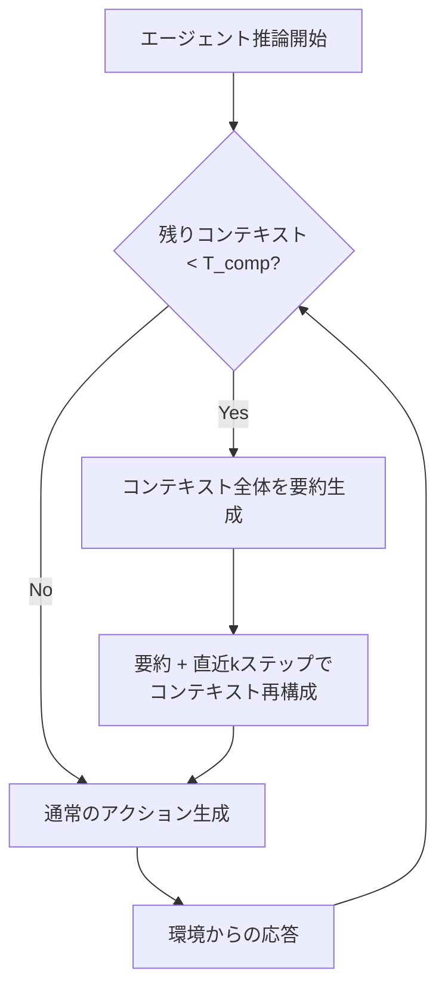

本記事は [CompactionRL: Reinforcement Learning with Context Compaction for Long-Horizon Agents](https://arxiv.org/abs/2607.05378) の解説記事です。

## 論文概要

Li et al. (2026, Tsinghua University) は、長期間にわたるエージェントタスクにおいてコンテキストウィンドウの上限に達する問題を、強化学習（RL）によるコンテキスト圧縮で解決する手法 CompactionRL を提案している。エージェントがコンテキスト予算の残量が閾値を下回った時点で自律的に要約を生成し、圧縮されたコンテキストから作業を再開する仕組みである。SWE-bench VerifiedでGLM-4.5-Airが59.8%から66.8%へ+7.0ポイント、Terminal-Bench 2.0でGLM-4.7-Flashが13.4%から20.2%へ+6.8ポイントの改善を達成したと報告されている（論文Table 1）。

この記事は [Zenn記事: プロンプトキャッシュが覆すコンテキスト管理の常識：圧縮vs全保持の判断基準と実装](https://zenn.dev/0h_n0/articles/6319db2cded345) の深掘りです。Zenn記事ではプロンプトキャッシュを前提としたコンテキスト管理戦略を論じているが、本論文はキャッシュに頼らず、モデル自身が圧縮タイミングと内容をRLで学習するアプローチであり、両者は相補的な関係にある。

## 情報源

- **arXiv ID**: 2607.05378
- **URL**: [https://arxiv.org/abs/2607.05378](https://arxiv.org/abs/2607.05378)
- **著者**: Yujiang Li, Zhenyu Hou, Yi Jing, Jie Tang, Yuxiao Dong (Tsinghua University)
- **提出日**: 2026年7月6日
- **分野**: cs.AI, cs.LG

## 背景と動機

LLMベースのエージェントは、ソフトウェア開発やシステム管理などの長期タスクにおいてコンテキストウィンドウの上限に頻繁に到達する。SWE-benchのような実世界のバグ修正タスクでは、ファイル探索、コード読解、テスト実行、修正、再テストという多段階のインタラクションが必要であり、数万トークンを容易に消費する。

従来のコンテキスト管理には大きく2つのアプローチがある。第一に、コンテキストウィンドウ自体を拡張する方法（RoPEスケーリング、Sparse Attention等）があるが、推論コストが二次的に増大し、また注意の希薄化により長距離の情報活用精度が低下する。第二に、ヒューリスティックな圧縮（古い対話の切り捨て、ルールベースの要約挿入）があるが、タスクに不可欠な情報が失われるリスクがあり、圧縮のタイミングや粒度の最適化が困難である。

著者らは、コンテキスト圧縮をエージェントの行動空間に組み込み、タスク成功という報酬シグナルを通じてRLで最適化するアプローチを提案している。これにより、モデル自身が「いつ」「何を残して」圧縮すべきかを学習する。

## 主要な貢献

- **Context Compaction機構**: コンテキスト予算の残量が閾値 $T_{\text{comp}}$ を下回った時点で、ポリシー自身が要約を生成し、要約と直近 $k$ ステップのインタラクションから再構成されたコンテキストで作業を継続する仕組みを設計した
- **Token-Level Loss Normalization**: 圧縮イベントの回数がロールアウトごとに異なる問題に対し、最適化対象のassistantトークン数で損失を正規化する手法を導入し、学習の安定性を向上させた
- **Cross-Trajectory GAE**: 圧縮によって分断されるトラジェクトリ間でGeneralized Advantage Estimation (GAE) を接続する手法を提案し、圧縮前後のアドバンテージ推定の整合性を確保した
- **実システムへの展開**: GLM-5.2 (750B-A40B) のRLトレーニングパイプラインに実際にデプロイされたことが報告されている

## 技術的詳細

### Context Compaction機構

CompactionRLの中核は、エージェントのコンテキスト消費量を監視し、残りコンテキスト予算が閾値 $T_{\text{comp}}$ を下回った時点で圧縮操作を発動する仕組みである。

圧縮操作の手順は以下の通りである。

1. 現在のコンテキスト全体をポリシー（またはサマリ専用エージェント）に入力し、要約テキストを生成する
2. 生成された要約と直近 $k$ ステップ（デフォルト $k=2$）のインタラクション履歴を結合して、新しいコンテキストを再構成する
3. 再構成されたコンテキストから推論を再開する

1回のロールアウトあたりの圧縮操作は最大3回に制限されている。



### Token-Level Loss Normalization

標準的なGRPO/PPOの損失関数では、ロールアウト内の全トークンの損失を合計する。しかしCompactionRLでは圧縮イベントが発生するたびにassistantトークンが増加する（要約生成分のトークンが追加される）。これにより、圧縮回数の多いロールアウトが損失合計で不均衡な重みを持つ問題が生じる。

著者らはこれを解決するため、最適化対象のassistantトークン集合 $\mathcal{M}$ のサイズで正規化するToken-Level Loss Normalizationを導入している。ポリシー損失は以下の式で定義される。

$$
\mathcal{L}_{\text{policy}} = -\frac{1}{|\mathcal{M}|} \sum_{(s,i) \in \mathcal{M}} \min\left( \rho_{s,i}(\theta) \hat{A}_{s,i}, \; \text{clip}\left(\rho_{s,i}(\theta), 1-\epsilon, 1+\epsilon\right) \hat{A}_{s,i} \right)
$$

ここで、
- $\mathcal{M}$: 最適化対象のassistantトークンの集合
- $\rho_{s,i}(\theta) = \frac{\pi_\theta(a_{s,i} \mid \mathbf{c}_{s,<i})}{\pi_{\theta_{\text{old}}}(a_{s,i} \mid \mathbf{c}_{s,<i})}$: セグメント $s$、位置 $i$ における重要度比
- $\hat{A}_{s,i}$: アドバンテージ推定値
- $\epsilon$: クリッピングパラメータ
- $\pi_\theta$: 現在のポリシー、$\pi_{\theta_{\text{old}}}$: 旧ポリシー

この正規化により、圧縮回数が0回のロールアウトと3回のロールアウトが同等の重みで学習に寄与する。

### Cross-Trajectory GAE

コンテキスト圧縮はトラジェクトリを複数のセグメントに分断する。標準的なGAEは単一の連続トラジェクトリを前提としているため、セグメント間のアドバンテージ推定に不整合が生じる。

著者らはトラジェクトリ位置補正を導入し、各セグメント $s$ のローカルアドバンテージ $\hat{A}^{\text{loc}}_{s,i}$ にディスカウント係数を乗じる。

$$
\hat{A}_{s,i} = (\gamma \lambda)^{N_{>s}} \cdot \hat{A}^{\text{loc}}_{s,i}
$$

ここで、
- $\gamma$: 割引率
- $\lambda$: GAEのパラメータ
- $N_{>s}$: セグメント $s$ 以降に生成されたトークンの総数
- $\hat{A}^{\text{loc}}_{s,i}$: セグメント $s$ 内で計算されたローカルアドバンテージ

この補正により、早期のセグメント（タスク開始直後の探索フェーズ等）のアドバンテージが適切にディスカウントされ、タスク完了に近い後半のセグメントがより大きなアドバンテージを持つようになる。

さらに、著者らはLength-adaptive GAEも導入しており、$\lambda$ をロールアウトの長さ $l$ に応じて動的に調整する。

$$
\lambda = 1 - \frac{1}{\alpha \cdot l}
$$

ここで $\alpha = 1.5$ がデフォルト値として使用されている。長いロールアウトほど $\lambda$ が1に近づき、長期的な依存関係を捉えやすくなる。

### 訓練設定

著者らが報告している主要なハイパーパラメータは以下の通りである（論文Section 4.1）。

| パラメータ | 値 |
|-----------|-----|
| グローバルバッチサイズ | 128 |
| グループサイズ | 1 |
| ポリシー学習率 | $2 \times 10^{-6}$ |
| クリティック学習率 | $3 \times 10^{-6}$ |
| コンテキスト予算（GLM-4.7-Flash） | 64k tokens |
| コンテキスト予算（GLM-4.5-Air） | 80k tokens |
| 最大圧縮回数/ロールアウト | 3 |
| Length-adaptive GAE $\alpha$ | 1.5 |
| 直近保持ステップ数 $k$ | 2 |

## 実装のポイント

CompactionRLの実装において注意すべき点を以下にまとめる。

第一に、要約品質がタスク性能に直結する。著者らはアブレーションで要約エージェントのみを変更した場合、SWE-bench Verifiedの精度が55.5%から49.0%まで変動することを報告しており（論文Section 5.3）、要約の品質管理が不可欠である。

第二に、圧縮閾値 $T_{\text{comp}}$ の設定には注意が必要である。閾値が高すぎると不必要な圧縮が発生して情報損失が増大し、低すぎるとコンテキストウィンドウのオーバーフローリスクが高まる。

第三に、直近 $k$ ステップの保持は、エージェントが直前の操作結果（エラーメッセージ、テスト出力等）を失わないための設計である。$k=2$ がデフォルトだが、タスク特性に応じて調整の余地がある。

以下は、CompactionRLのコンテキスト圧縮ロジックの簡略化した実装例である。

```python
from dataclasses import dataclass


@dataclass
class CompactionConfig:
    """CompactionRLのコンテキスト圧縮設定

    Attributes:
        context_budget: コンテキスト予算（トークン数）
        compaction_threshold: 圧縮を発動する残りトークン数の閾値
        max_compactions: 1ロールアウトあたりの最大圧縮回数
        keep_recent_steps: 圧縮後に保持する直近のインタラクション数
    """
    context_budget: int = 64_000
    compaction_threshold: int = 8_000
    max_compactions: int = 3
    keep_recent_steps: int = 2


def should_compact(
    current_token_count: int,
    config: CompactionConfig,
    compaction_count: int,
) -> bool:
    """コンテキスト圧縮を発動すべきかを判定する

    Args:
        current_token_count: 現在のコンテキストのトークン数
        config: 圧縮設定
        compaction_count: 現在までの圧縮回数

    Returns:
        圧縮を発動すべきならTrue
    """
    remaining = config.context_budget - current_token_count
    return (
        remaining < config.compaction_threshold
        and compaction_count < config.max_compactions
    )


def reconstruct_context(
    summary: str,
    interaction_history: list[dict[str, str]],
    system_prompt: str,
    config: CompactionConfig,
) -> list[dict[str, str]]:
    """圧縮後のコンテキストを再構成する

    要約テキストと直近kステップのインタラクション履歴から
    新しいコンテキストを構築する。

    Args:
        summary: 生成された要約テキスト
        interaction_history: 全インタラクション履歴
        system_prompt: システムプロンプト
        config: 圧縮設定

    Returns:
        再構成されたメッセージリスト
    """
    recent_steps = interaction_history[-config.keep_recent_steps:]
    reconstructed = [
        {"role": "system", "content": system_prompt},
        {"role": "assistant", "content": f"[Previous context summary]\n{summary}"},
    ]
    reconstructed.extend(recent_steps)
    return reconstructed
```

## Production Deployment Guide

### AWS実装パターン（コスト最適化重視）

CompactionRLはRL訓練パイプラインであるが、その成果物（コンテキスト圧縮能力を獲得したエージェント）を推論時に活用するデプロイパターンを示す。コンテキスト圧縮を備えたLLMエージェントの推論基盤として、トラフィック量別に3つの構成を提案する。

**コスト試算の注意事項**: 以下は2026年8月時点のAWS ap-northeast-1（東京）リージョン料金に基づく概算値である。実際のコストはトラフィックパターン、リージョン、バースト使用量により変動する。最新料金はAWS料金計算ツールで確認を推奨する。

| 構成 | トラフィック | 主要サービス | 月額概算 |
|------|-------------|-------------|---------|
| Small | ~100 req/日 | Lambda + Bedrock + DynamoDB | $80-150 |
| Medium | ~1,000 req/日 | ECS Fargate + Bedrock + ElastiCache | $400-800 |
| Large | 10,000+ req/日 | EKS + Karpenter + Spot + Bedrock Batch | $2,500-5,000 |

**Small構成の内訳**: Lambda（$5-10）+ Bedrock Claude/GLM推論（$50-100、Prompt Caching有効で30-90%削減可能）+ DynamoDB On-Demand（$5-15）+ CloudWatch（$5-10）+ S3ログ保存（$2-5）

**Large構成の内訳**: EKSコントロールプレーン（$73）+ EC2 Spot Instances（$800-1,500、On-Demandの60-90%削減）+ Bedrock Batch API（$1,000-2,500、リアルタイムの50%削減）+ ElastiCache（$150-300）+ ALB（$50-100）+ CloudWatch/X-Ray（$30-80）

**コスト削減テクニック**:
- Spot Instances活用で最大90%削減（EKSノードグループ）
- Reserved Instances購入で最大72%削減（ElastiCache、安定ワークロード部分）
- Bedrock Batch API使用で50%削減（非リアルタイム処理）
- Prompt Caching有効化で30-90%削減（システムプロンプト＋要約部分のキャッシュ）

### Terraformインフラコード

**Small構成（Serverless）: Lambda + Bedrock + DynamoDB**

```hcl
# --- Small構成: CompactionRL推論エージェント ---
# Lambda + Bedrock + DynamoDB (月額 $80-150)

terraform {
  required_version = ">= 1.9"
  required_providers {
    aws = { source = "hashicorp/aws", version = "~> 5.60" }
  }
}

provider "aws" { region = "ap-northeast-1" }

# --- IAMロール（最小権限） ---
resource "aws_iam_role" "agent_lambda" {
  name = "compaction-agent-lambda"
  assume_role_policy = jsonencode({
    Version = "2012-10-17"
    Statement = [{
      Action = "sts:AssumeRole"
      Effect = "Allow"
      Principal = { Service = "lambda.amazonaws.com" }
    }]
  })
}

resource "aws_iam_role_policy" "agent_lambda" {
  name = "compaction-agent-policy"
  role = aws_iam_role.agent_lambda.id
  policy = jsonencode({
    Version = "2012-10-17"
    Statement = [
      {
        # Bedrock推論のみ許可
        Effect   = "Allow"
        Action   = ["bedrock:InvokeModel", "bedrock:InvokeModelWithResponseStream"]
        Resource = "arn:aws:bedrock:ap-northeast-1::foundation-model/*"
      },
      {
        # DynamoDB: セッション状態・要約の読み書きのみ
        Effect   = "Allow"
        Action   = ["dynamodb:GetItem", "dynamodb:PutItem", "dynamodb:UpdateItem", "dynamodb:Query"]
        Resource = aws_dynamodb_table.session_state.arn
      },
      {
        # CloudWatch Logs
        Effect   = "Allow"
        Action   = ["logs:CreateLogGroup", "logs:CreateLogStream", "logs:PutLogEvents"]
        Resource = "arn:aws:logs:ap-northeast-1:*:*"
      },
      {
        # X-Ray トレーシング
        Effect   = "Allow"
        Action   = ["xray:PutTraceSegments", "xray:PutTelemetryRecords"]
        Resource = "*"
      }
    ]
  })
}

# --- DynamoDB: セッション状態管理（On-Demand） ---
resource "aws_dynamodb_table" "session_state" {
  name         = "compaction-agent-sessions"
  billing_mode = "PAY_PER_REQUEST" # On-Demand: 低トラフィックでコスト最適
  hash_key     = "session_id"
  range_key    = "segment_id"

  attribute {
    name = "session_id"
    type = "S"
  }
  attribute {
    name = "segment_id"
    type = "N"
  }

  # KMS暗号化
  server_side_encryption { enabled = true }

  # 30日でセッション自動削除
  ttl {
    attribute_name = "expires_at"
    enabled        = true
  }
}

# --- Lambda関数 ---
resource "aws_lambda_function" "agent" {
  function_name = "compaction-agent"
  role          = aws_iam_role.agent_lambda.arn
  runtime       = "python3.12"
  handler       = "handler.lambda_handler"
  filename      = "lambda.zip"
  timeout       = 900 # 15分（長期タスク対応）
  memory_size   = 1024

  tracing_config { mode = "Active" } # X-Ray有効化

  environment {
    variables = {
      CONTEXT_BUDGET         = "64000"
      COMPACTION_THRESHOLD   = "8000"
      MAX_COMPACTIONS        = "3"
      KEEP_RECENT_STEPS      = "2"
      SESSION_TABLE          = aws_dynamodb_table.session_state.name
    }
  }
}

# --- CloudWatchアラーム: コスト監視 ---
resource "aws_cloudwatch_metric_alarm" "lambda_duration" {
  alarm_name          = "compaction-agent-duration-high"
  comparison_operator = "GreaterThanThreshold"
  evaluation_periods  = 3
  metric_name         = "Duration"
  namespace           = "AWS/Lambda"
  period              = 300
  statistic           = "p95"
  threshold           = 600000 # 10分超でアラート
  alarm_actions       = [] # SNS ARNを指定

  dimensions = {
    FunctionName = aws_lambda_function.agent.function_name
  }
}
```

**Large構成（Container）: EKS + Karpenter + Spot Instances**

```hcl
# --- Large構成: CompactionRL推論クラスタ ---
# EKS + Karpenter + Spot (月額 $2,500-5,000)

module "eks" {
  source  = "terraform-aws-modules/eks/aws"
  version = "~> 20.24"

  cluster_name    = "compaction-agent-cluster"
  cluster_version = "1.31"

  # パブリックアクセス最小化
  cluster_endpoint_public_access  = true
  cluster_endpoint_private_access = true

  vpc_id     = module.vpc.vpc_id
  subnet_ids = module.vpc.private_subnets

  # Karpenter用のIAM設定
  enable_cluster_creator_admin_permissions = true
}

# --- Karpenter Provisioner: Spot優先 ---
resource "kubectl_manifest" "karpenter_nodepool" {
  yaml_body = yamlencode({
    apiVersion = "karpenter.sh/v1"
    kind       = "NodePool"
    metadata   = { name = "compaction-agent" }
    spec = {
      template = {
        spec = {
          requirements = [
            { key = "karpenter.sh/capacity-type", operator = "In", values = ["spot", "on-demand"] },
            { key = "node.kubernetes.io/instance-type", operator = "In",
              values = ["m7i.xlarge", "m7i.2xlarge", "m6i.xlarge", "m6i.2xlarge", "c7i.xlarge", "c7i.2xlarge"] },
          ]
          nodeClassRef = { group = "karpenter.k8s.aws", kind = "EC2NodeClass", name = "default" }
        }
      }
      limits   = { cpu = "128", memory = "512Gi" }
      disruption = {
        consolidationPolicy = "WhenEmptyOrUnderutilized"
        consolidateAfter    = "60s" # アイドルノード60秒で回収 → コスト削減
      }
    }
  })
}

# --- Secrets Manager: Bedrock設定 ---
resource "aws_secretsmanager_secret" "bedrock_config" {
  name = "compaction-agent/bedrock-config"
  # KMS暗号化（デフォルトキー）
}

resource "aws_secretsmanager_secret_version" "bedrock_config" {
  secret_id = aws_secretsmanager_secret.bedrock_config.id
  secret_string = jsonencode({
    model_id           = "anthropic.claude-sonnet-4-20250514"
    context_budget     = 80000
    max_compactions    = 3
    keep_recent_steps  = 2
  })
}

# --- AWS Budgets: 予算アラート ---
resource "aws_budgets_budget" "monthly" {
  name         = "compaction-agent-monthly"
  budget_type  = "COST"
  limit_amount = "5000"
  limit_unit   = "USD"
  time_unit    = "MONTHLY"

  notification {
    comparison_operator       = "GREATER_THAN"
    threshold                 = 80
    threshold_type            = "PERCENTAGE"
    notification_type         = "ACTUAL"
    subscriber_email_addresses = ["ops-team@example.com"]
  }

  notification {
    comparison_operator       = "GREATER_THAN"
    threshold                 = 100
    threshold_type            = "PERCENTAGE"
    notification_type         = "FORECASTED"
    subscriber_email_addresses = ["ops-team@example.com"]
  }
}
```

### セキュリティベストプラクティス

- **IAMロール**: 最小権限の原則に従い、Bedrock InvokeModel、DynamoDB CRUD、CloudWatch Logsの書き込みのみを許可する
- **ネットワーク**: EKSのパブリックエンドポイントを制限し、VPCエンドポイント経由でBedrock/DynamoDB/S3にアクセスする
- **シークレット管理**: Bedrock設定やAPIキーはSecrets Managerに格納し、環境変数に直接埋め込まない
- **暗号化**: DynamoDB、S3、EBSは全てAWS KMSで暗号化する
- **監査**: CloudTrailとAWS Configを有効化し、IAMポリシー変更やリソース作成を追跡する

### 運用・監視設定

**CloudWatch Logs Insights クエリ**: コンテキスト圧縮の頻度とトークン使用量を監視する。

```
# 1時間あたりの圧縮イベント数とトークン消費量
fields @timestamp, @message
| filter @message like /compaction_event/
| stats count() as compaction_count,
        avg(tokens_before) as avg_tokens_before,
        avg(tokens_after) as avg_tokens_after,
        avg(tokens_before - tokens_after) as avg_savings
  by bin(1h)
| sort @timestamp desc
```

```
# P95/P99レイテンシ分析
fields @timestamp, duration_ms
| filter event = "agent_inference"
| stats percentile(duration_ms, 95) as p95,
        percentile(duration_ms, 99) as p99,
        avg(duration_ms) as avg_latency
  by bin(1h)
```

**CloudWatchアラーム設定（Python）**:

```python
import boto3


def create_token_usage_alarm(function_name: str, sns_topic_arn: str) -> dict:
    """Bedrockトークン使用量スパイク検知アラームを作成する

    Args:
        function_name: 監視対象のLambda関数名
        sns_topic_arn: 通知先SNSトピックARN

    Returns:
        CloudWatch APIレスポンス
    """
    cw = boto3.client("cloudwatch", region_name="ap-northeast-1")
    return cw.put_metric_alarm(
        AlarmName=f"{function_name}-token-spike",
        MetricName="InputTokenCount",
        Namespace="AWS/Bedrock",
        Statistic="Sum",
        Period=3600,
        EvaluationPeriods=2,
        Threshold=500_000,
        ComparisonOperator="GreaterThanThreshold",
        AlarmActions=[sns_topic_arn],
    )
```

**X-Ray トレーシング設定（Python）**:

```python
from aws_xray_sdk.core import xray_recorder, patch_all


def setup_xray_tracing() -> None:
    """X-Rayトレーシングを初期化する

    boto3呼び出しを自動計装し、Bedrock推論と
    DynamoDB操作のレイテンシを可視化する。
    """
    xray_recorder.configure(service="compaction-agent")
    patch_all()  # boto3, requests等を自動計装


@xray_recorder.capture("compaction_event")
def trace_compaction(
    session_id: str,
    tokens_before: int,
    tokens_after: int,
) -> None:
    """コンテキスト圧縮イベントをX-Rayに記録する

    Args:
        session_id: セッション識別子
        tokens_before: 圧縮前のトークン数
        tokens_after: 圧縮後のトークン数
    """
    subsegment = xray_recorder.current_subsegment()
    if subsegment:
        subsegment.put_annotation("session_id", session_id)
        subsegment.put_metadata("tokens_before", tokens_before)
        subsegment.put_metadata("tokens_after", tokens_after)
        subsegment.put_metadata(
            "compression_ratio",
            round(tokens_after / tokens_before, 3),
        )
```

**Cost Explorer自動レポート（Python）**:

```python
from datetime import date, timedelta

import boto3


def get_daily_cost_report() -> dict[str, float]:
    """日次コストレポートを取得する

    Bedrock、Lambda、EKSのコストを抽出し、
    $100/日超過でSNS通知を送信する。

    Returns:
        サービス別コストの辞書
    """
    ce = boto3.client("ce", region_name="us-east-1")
    today = date.today()
    yesterday = today - timedelta(days=1)

    response = ce.get_cost_and_usage(
        TimePeriod={
            "Start": yesterday.isoformat(),
            "End": today.isoformat(),
        },
        Granularity="DAILY",
        Metrics=["UnblendedCost"],
        GroupBy=[{"Type": "DIMENSION", "Key": "SERVICE"}],
    )

    costs: dict[str, float] = {}
    for group in response["ResultsByTime"][0]["Groups"]:
        service = group["Keys"][0]
        amount = float(group["Metrics"]["UnblendedCost"]["Amount"])
        if any(
            keyword in service
            for keyword in ["Bedrock", "Lambda", "EKS", "EC2"]
        ):
            costs[service] = amount

    total = sum(costs.values())
    if total > 100.0:
        sns = boto3.client("sns", region_name="ap-northeast-1")
        sns.publish(
            TopicArn="arn:aws:sns:ap-northeast-1:ACCOUNT:cost-alert",
            Subject="CompactionRL Daily Cost Alert",
            Message=f"Daily cost ${total:.2f} exceeds $100 threshold.\n{costs}",
        )

    return costs
```

### コスト最適化チェックリスト

**アーキテクチャ選択**:
- [ ] トラフィック量に応じた構成を選択（~100 req/日: Serverless、~1,000: Hybrid、10,000+: Container）
- [ ] 非リアルタイム処理はBedrock Batch APIに分離
- [ ] コンテキスト圧縮によるトークン削減率を計測・最適化

**リソース最適化**:
- [ ] EC2: Spot Instances優先（Karpenter disruption設定）
- [ ] Reserved Instances: ElastiCache等の安定ワークロードに1年コミット
- [ ] Savings Plans: EC2/Fargate Compute Savings Plansを検討
- [ ] Lambda: メモリサイズを1024-2048MBの範囲で最適化（Power Tuning）
- [ ] ECS/EKS: アイドル時のスケールダウン（Karpenter consolidation 60s）
- [ ] NAT Gateway: 不要な場合はVPCエンドポイントで代替

**LLMコスト削減**:
- [ ] Bedrock Batch API使用（非同期処理で50%削減）
- [ ] Prompt Caching有効化（システムプロンプト＋要約のキャッシュで30-90%削減）
- [ ] モデル選択ロジック（簡易タスクはHaiku、複雑タスクはSonnetで切り替え）
- [ ] トークン数制限（max_tokens設定、不要な出力の抑制）
- [ ] CompactionRL圧縮回数の上限チューニング（コスト vs 精度のトレードオフ）

**監視・アラート**:
- [ ] AWS Budgets: 月額上限アラート（80%/100%閾値）
- [ ] CloudWatch アラーム: トークン使用量スパイク、Lambda実行時間異常
- [ ] Cost Anomaly Detection有効化
- [ ] 日次コストレポート自動送信（Cost Explorer API + SNS）
- [ ] 圧縮イベント頻度の異常検知（過剰圧縮 = モデル品質低下の兆候）

**リソース管理**:
- [ ] 未使用リソース削除（未使用EBSボリューム、古いLambdaバージョン）
- [ ] タグ戦略（Environment/Team/Serviceタグ必須化）
- [ ] S3ライフサイクルポリシー（ログ30日→Glacier、90日→削除）
- [ ] DynamoDB TTL設定（セッションデータ30日自動削除）
- [ ] 開発環境の夜間・週末自動停止（EKSノード0台スケールダウン）

## 実験結果

著者らは2つの主要ベンチマークで評価を行っている（論文Table 1）。

### SWE-bench Verified

| モデル | ベースライン | CompactionRL | 改善幅 |
|--------|------------|-------------|--------|
| GLM-4.7-Flash | 50.5% | 56.0% | +5.5pt |
| GLM-4.5-Air | 59.8% | 66.8% | +7.0pt |

### Terminal-Bench 2.0

| モデル | ベースライン | CompactionRL | 改善幅 |
|--------|------------|-------------|--------|
| GLM-4.7-Flash | 13.4% | 20.2% | +6.8pt |
| GLM-4.5-Air | 21.4% | 24.5% | +3.1pt |

SWE-bench Verifiedはソフトウェアバグ修正タスク、Terminal-Bench 2.0はターミナル操作による長期タスクのベンチマークであり、いずれもコンテキスト長が課題となるタスク群である。

### アブレーション分析

著者らのアブレーション実験（論文Section 5）から、以下の知見が報告されている。

- **Token-Level Loss Normalization除去**の影響がCross-Trajectory GAE除去よりも大きい。圧縮回数のばらつきによる学習の不安定化が性能劣化の主因と考えられる
- **要約エージェントの品質**がタスク性能に直結する。要約エージェントの変更のみでSWE-bench Verifiedが55.5%から49.0%まで変動しており、6.5ポイントもの差が生じる
- **Length-adaptive GAE**は長いロールアウトでの学習安定性に寄与している

### 制約と限界

- 評価はGLMモデルファミリーに限定されており、他のモデルアーキテクチャ（LLaMA、Mistral等）での汎化性は未検証である
- 圧縮閾値 $T_{\text{comp}}$ や直近保持ステップ数 $k$ の感度分析は限定的であり、タスクドメインごとの最適値は明らかでない
- 要約品質への依存が高く、要約エージェントの選択が実質的にボトルネックとなる可能性がある
- RL訓練自体に大規模な計算リソースが必要であり、グローバルバッチサイズ128での訓練は小規模チームにはハードルが高い

## 実運用への応用

CompactionRLの技術は、長期間のインタラクションを要するLLMエージェントシステム全般に応用可能である。

**ソフトウェア開発エージェント**: SWE-benchでの評価が示す通り、バグ修正、機能実装、コードレビューなど複数ファイルにわたる長期タスクにおいて、コンテキスト圧縮により作業可能なステップ数を拡張できる。Zenn記事で論じられているプロンプトキャッシュと組み合わせることで、キャッシュ対象のプレフィックスを圧縮済み要約に固定し、キャッシュヒット率の向上とトークンコストの削減を同時に実現する戦略が考えられる。

**カスタマーサポート**: 長時間にわたる問い合わせ対応で、過去のやり取りを要約しつつ重要な情報（注文番号、エラーコード等）を保持する用途に適用できる。

**データ分析パイプライン**: 多数のテーブルやクエリ結果を探索する分析タスクで、中間結果を要約しながら分析を進める用途が想定される。

**コスト面の考慮**: コンテキスト圧縮はトークン消費を削減するが、要約生成自体にもトークンコストが発生する。圧縮によるトークン節約量と要約生成のコストのトレードオフを、ワークロードの特性に応じて評価する必要がある。

## 関連研究

- **MemoryBank (Zhong et al., 2024)**: 対話履歴を要約してメモリバンクに蓄積する手法。ヒューリスティックな要約タイミングを用いる点でCompactionRLと異なり、RLによる最適化は行わない。CompactionRLは要約のタイミングと内容をタスク報酬で直接最適化する点で発展的である
- **LongAgent (Zhao et al., 2024)**: 長文書を複数のエージェントに分割処理させるマルチエージェントアプローチ。コンテキスト長制約を並列化で回避する方針であり、CompactionRLの逐次的圧縮とは相補的なアプローチである
- **CEPE (Yen et al., 2024)**: コンテキスト拡張のためのパラレルエンコーディング手法。コンテキストウィンドウ自体の拡張を目指すアプローチであり、CompactionRLの圧縮ベースのアプローチとは設計思想が異なる。両者の組み合わせ（拡張ウィンドウ＋圧縮）も検討に値する
- **Prompt Caching (Anthropic, OpenAI)**: Zenn記事で詳述されているキャッシュベースのコンテキスト管理。CompactionRLの圧縮済み要約をキャッシュプレフィックスとして固定することで、両技術の利点を統合する可能性がある

## まとめと今後の展望

CompactionRLは、コンテキスト圧縮をRLの行動空間に組み込むことで、エージェントが自律的に「いつ」「何を残して」圧縮するかを学習する手法である。SWE-bench VerifiedとTerminal-Bench 2.0での改善結果は、コンテキスト管理の最適化が長期タスクの成功率に直接寄与することを示している。

今後の研究方向として、他のモデルアーキテクチャへの汎化検証、要約品質の自動評価メトリクスの設計、プロンプトキャッシュとの統合による推論コスト最適化が挙げられる。特に、Zenn記事で論じられているキャッシュ戦略との組み合わせは、圧縮によるトークン削減とキャッシュによるレイテンシ削減の両立を可能にする実用的な方向性である。

## 参考文献

- **arXiv**: [https://arxiv.org/abs/2607.05378](https://arxiv.org/abs/2607.05378)
- **Related Zenn article**: [https://zenn.dev/0h_n0/articles/6319db2cded345](https://zenn.dev/0h_n0/articles/6319db2cded345)
