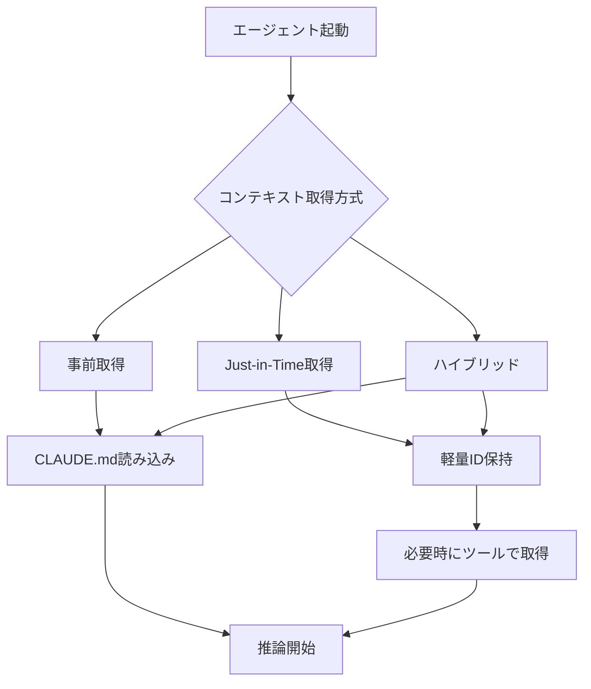
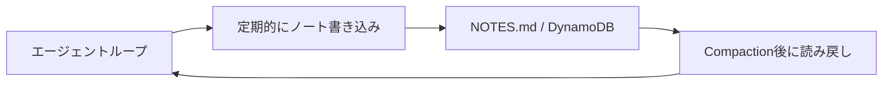

## ブログ概要（Summary）

本記事は [https://www.anthropic.com/engineering/effective-context-engineering-for-ai-agents](https://www.anthropic.com/engineering/effective-context-engineering-for-ai-agents) の解説記事です。

Anthropic Applied AIチーム（Prithvi Rajasekaran、Ethan Dixon、Carly Ryan、Jeremy Hadfield、2025年9月29日公開）は、LLMエージェント構築におけるコンテキストエンジニアリングの体系的な実践パターンを提示している。単発の推論ではなく、複数ターンにわたるエージェントループにおいて「最も少ない高信号トークンの集合で、望む出力の尤度を最大化する」という原則のもと、システムプロンプト設計、ツール設計、Few-Shot例示、実行時検索の4つのコンテキスト構成要素と、Compaction・構造化ノートテイキング・サブエージェントアーキテクチャという3つの長時間タスク管理手法を解説している。Claude CodeやClaude playing Pokemonなど実システムでの適用事例も示されている。

この記事は [Zenn記事: プロンプトキャッシュが覆すコンテキスト管理の常識：圧縮vs全保持の判断基準と実装](https://zenn.dev/0h_n0/articles/6319db2cded345) の深掘りです。

## Zenn記事との関連

Zenn記事ではプロンプトキャッシュがコンテキスト圧縮の経済合理性を逆転させる現象に焦点を当て、「圧縮 vs 全保持」の判断基準を定量的に示している。本ブログはその上流にある設計思想、すなわち「コンテキストウィンドウに何を入れ、何を入れないか」という判断フレームワークを提供している。Zenn記事の圧縮戦略はAnthropicが述べるCompactionパターンの一実装に相当し、本ブログの原則を理解することでZenn記事の設計判断をより広い文脈で位置付けられる。

## 情報源

- **種別**: 企業テックブログ
- **URL**: [https://www.anthropic.com/engineering/effective-context-engineering-for-ai-agents](https://www.anthropic.com/engineering/effective-context-engineering-for-ai-agents)
- **組織**: Anthropic（Applied AIチーム）
- **著者**: Prithvi Rajasekaran, Ethan Dixon, Carly Ryan, Jeremy Hadfield（コントリビュータ: Rafi Ayub, Hannah Moran, Cal Rueb, Connor Jennings）
- **発表日**: 2025年9月29日

## 技術的背景（Technical Background）

### プロンプトエンジニアリングからコンテキストエンジニアリングへ

従来のプロンプトエンジニアリングは、単一の推論リクエストに対する指示文の最適化を主眼としていた。一方、コンテキストエンジニアリングはAnthropicチームが述べるところによると、「推論時にモデルが参照するトークン環境全体」を管理対象とする。その環境にはシステムプロンプト、ツール定義、外部データ、会話履歴、MCP（Model Context Protocol）コンポーネントが含まれる。

エージェントが複数ターンのループで動作する場合、ターンごとにコンテキストが蓄積されていく。このとき、Anthropicチームが「Context Rot」と呼ぶ現象が問題となる。トークン数が増大するにつれ、モデルの想起精度が低下していくのである。

### Context Rotの技術的背景

TransformerアーキテクチャのSelf-Attention機構では、$n$個のトークンに対して$n^2$のペアワイズ関係が計算される。

$$
\text{Attention}(Q, K, V) = \text{softmax}\left(\frac{QK^T}{\sqrt{d_k}}\right)V
$$

コンテキスト長$n$が増大すると、各トークンが他の全トークンとの関係を計算するため、注意の分散が起きる。Anthropicチームは、モデルが短い系列長で主に訓練されていることから、長い系列に対しては特化したパラメータが不足しているとも指摘している。位置エンコーディングの補間はある程度の拡張を可能にするが、位置理解の精度劣化を完全には回避できない。

この制約は、コンテキストウィンドウの拡大だけでは問題を解決できないことを意味する。「入れられるから入れる」のではなく、「何を入れるべきか」の設計判断が重要になる。

## 実装アーキテクチャ（Architecture）

Anthropicチームは、コンテキストを構成する4つの静的要素と、それらの実行時運用パターンを区別している。

### 1. システムプロンプト設計: Goldilocks Zone

Anthropicチームは、システムプロンプト設計における「適切な粒度（right altitude）」の重要性を述べている。具体的には、以下の2つの極端を避ける必要がある。

- **過度に処方的（Overly Complex）**: ハードコードされた脆いロジックは、保守コストが高く、予期しない入力に対して破綻しやすい
- **過度に曖昧（Overly Vague）**: 不十分な指示は、モデルの行動を効果的に制御できない

推奨される実践として、XMLタグやMarkdownヘッダによるセクション分割、情報の最小化と十分な詳細のバランス、最高性能モデルで先にテストした上で失敗パターンに基づく指示追加が挙げられている。

### 2. ツール設計: 自己完結性と最小オーバーラップ

エージェントが使用するツールについて、Anthropicチームは以下の設計原則を述べている。

- **機能の重複を最小化する**: エンジニアがどのツールを使うべきか迷う状況では、エージェントも同様に判断を誤る
- **トークン効率の高い出力を返す**: ツールの返却情報は必要最小限に抑える
- **明確で曖昧のない目的を持たせる**: 各ツールの用途が一意に特定できる状態を保つ
- **肥大化したツールセットを避ける**: ツール数の増加は選択の曖昧さを増大させる

### 3. Few-Shot例示: 網羅ではなく代表例

Anthropicチームは、あらゆるエッジケースを列挙するのではなく、多様で正規的（canonical）な例を厳選することを推奨している。例は「千の言葉に値する写真」として機能し、期待される振る舞いのパターンをモデルに効果的に伝達する。

### 4. 実行時コンテキスト検索: Just-in-Time vs ハイブリッド



**Just-in-Time方式**では、エージェントは全データを事前にロードせず、ファイルパスやクエリ、URLなどの軽量な識別子を保持し、必要になった時点でツールを使ってデータを動的に取得する。Anthropicチームは、これを人間の認知に類似させている。情報の全体を記憶するのではなく、必要な情報を必要な時に検索する方式である。

利点として以下が挙げられている。

- **トークン効率**: 不要な情報でコンテキストを消費しない
- **漸進的開示**: 段階的に情報を発見できる
- **メタデータの活用**: フォルダ階層、命名規則、タイムスタンプなどを行動シグナルとして活用

トレードオフとして、Anthropicチームは実行時の探索が事前取得よりも遅い点を認めている。

**ハイブリッド方式**は、選択的なデータを初期段階で取得しつつ、自律的な探索能力を維持するアプローチである。Anthropicチームは、Claude Codeがこの方式を採用していると述べている。CLAUDE.mdファイルを初期コンテキストに含めつつ、grepやglobコマンドによるJust-in-Timeなファイル検索を併用している。

```python
from dataclasses import dataclass, field
from typing import Protocol


class ContextStore(Protocol):
    """コンテキスト取得インタフェース"""

    def get_static(self, key: str) -> str:
        """事前登録済みコンテキストを取得する"""
        ...

    def search(self, query: str, top_k: int = 5) -> list[str]:
        """クエリに基づきコンテキストを動的検索する"""
        ...


@dataclass
class HybridContextAssembler:
    """ハイブリッド方式のコンテキスト組み立て

    事前取得（CLAUDE.md等）とJust-in-Time検索（grep/glob）を組み合わせる。
    Anthropicが述べるClaude Codeのパターンを模したもの。

    Attributes:
        static_store: 事前取得用ストア
        dynamic_store: 動的検索用ストア
        max_context_tokens: コンテキストウィンドウの上限トークン数
    """

    static_store: ContextStore
    dynamic_store: ContextStore
    max_context_tokens: int = 100_000
    _preloaded: dict[str, str] = field(default_factory=dict)

    def preload(self, keys: list[str]) -> None:
        """起動時に静的コンテキストを事前取得する

        Args:
            keys: 事前取得するコンテキストのキー一覧
        """
        for key in keys:
            self._preloaded[key] = self.static_store.get_static(key)

    def assemble(self, query: str, top_k: int = 5) -> list[str]:
        """推論ターンごとにコンテキストを組み立てる

        事前取得済みの静的コンテキストに加え、
        クエリに基づく動的検索結果を結合する。

        Args:
            query: 現在のユーザークエリまたはタスク記述
            top_k: 動的検索で返却する上位結果数

        Returns:
            組み立てられたコンテキスト断片のリスト
        """
        context_parts: list[str] = list(self._preloaded.values())
        dynamic_results = self.dynamic_store.search(query, top_k=top_k)
        context_parts.extend(dynamic_results)
        return context_parts
```

## Production Deployment Guide

ブログで解説されているコンテキストエンジニアリングのパターンをAWS上でエージェントシステムとして実装する際の構成を示す。

### AWS実装パターン（コスト最適化重視）

コンテキストエンジニアリングを適用したエージェントシステムのAWS構成を、トラフィック量別に整理する。コンテキスト管理（Compaction、ノートテイキング、サブエージェント制御）をサーバーサイドで実現する構成である。

| 構成 | 対象規模 | 主要サービス | 月額概算 |
|------|---------|------------|---------|
| Small | ~100 req/日 | Lambda + Bedrock + DynamoDB | $60-180 |
| Medium | ~1,000 req/日 | ECS Fargate + Bedrock + ElastiCache | $350-900 |
| Large | 10,000+ req/日 | EKS + Bedrock + ElastiCache Cluster | $2,200-5,500 |

**Small構成の内訳**（2026年8月時点、ap-northeast-1概算）:
- Lambda: 月100万リクエスト無料枠内、超過分$0.20/100万リクエスト
- Bedrock (Claude Sonnet 4): $3/MTok入力、$15/MTok出力
- DynamoDB (On-Demand): コンテキスト状態・ノート保存用、$1.25/WCU-h
- S3: Compaction済みコンテキストの永続化、$0.025/GB-月

**コスト削減テクニック**:
- Bedrock Prompt Caching有効化: システムプロンプト+ツール定義のキャッシュで30-90%削減（Zenn記事で詳述）
- Bedrock Batch API: 非同期Compaction処理で50%削減
- Spot Instances活用: Large構成のEKSワーカーノードで最大90%削減
- Reserved Instances: ElastiCacheの1年コミットで最大33%削減

コスト試算は2026年8月時点のap-northeast-1料金に基づく概算値であり、実際のコストはトラフィックパターン、リージョン、バースト使用量により変動する。最新料金はAWS料金計算ツールで確認を推奨する。

### Terraformインフラコード

**Small構成（Serverless）**: Lambda + Bedrock + DynamoDB

```hcl
# --- DynamoDB（コンテキスト状態・構造化ノート保存、On-Demand + TTL） ---
resource "aws_dynamodb_table" "context_state" {
  name         = "agent-context-state"
  billing_mode = "PAY_PER_REQUEST"
  hash_key     = "session_id"
  range_key    = "turn_number"

  attribute { name = "session_id";  type = "S" }
  attribute { name = "turn_number"; type = "N" }

  server_side_encryption { enabled = true; kms_key_arn = aws_kms_key.dynamo_key.arn }
  ttl { attribute_name = "expires_at"; enabled = true }
}

# --- S3（Compaction済みコンテキストの永続化） ---
resource "aws_s3_bucket" "compacted_context" {
  bucket = "agent-compacted-context-${data.aws_caller_identity.current.account_id}"
}

resource "aws_s3_bucket_server_side_encryption_configuration" "compacted_context" {
  bucket = aws_s3_bucket.compacted_context.id
  rule {
    apply_server_side_encryption_by_default {
      sse_algorithm     = "aws:kms"
      kms_master_key_id = aws_kms_key.s3_key.arn
    }
  }
}

# --- Lambda関数（コンテキスト管理エンドポイント） ---
resource "aws_lambda_function" "context_manager" {
  function_name = "agent-context-manager"
  runtime       = "python3.12"
  handler       = "handler.lambda_handler"
  role          = aws_iam_role.agent_lambda.arn
  timeout       = 60
  memory_size   = 1024

  environment {
    variables = {
      DYNAMODB_TABLE     = aws_dynamodb_table.context_state.name
      S3_BUCKET          = aws_s3_bucket.compacted_context.id
      BEDROCK_MODEL_ID   = "anthropic.claude-sonnet-4-20250514-v1:0"
      COMPACTION_THRESHOLD = "80000"  # トークン数閾値
    }
  }

  tracing_config { mode = "Active" }
}

# --- CloudWatchアラーム（コスト監視） ---
resource "aws_cloudwatch_metric_alarm" "bedrock_token_spike" {
  alarm_name          = "bedrock-token-usage-spike"
  comparison_operator = "GreaterThanThreshold"
  evaluation_periods  = 1
  metric_name         = "InputTokenCount"
  namespace           = "AWS/Bedrock"
  period              = 3600
  statistic           = "Sum"
  threshold           = 500000
  alarm_actions       = [aws_sns_topic.alerts.arn]
}
```

**Large構成（Container）**: EKS + Karpenter + ElastiCache

```hcl
# --- EKSクラスタ（プライベートアクセスのみ） ---
module "eks" {
  source  = "terraform-aws-modules/eks/aws"
  version = "~> 20.0"

  cluster_name    = "agent-context-cluster"
  cluster_version = "1.31"
  vpc_id          = module.vpc.id
  subnet_ids      = module.vpc.private_subnets
  enable_karpenter                = true
  cluster_endpoint_public_access  = false
}

# --- Karpenter NodePool（Spot優先、Graviton対応） ---
resource "kubectl_manifest" "karpenter_nodepool" {
  yaml_body = yamlencode({
    apiVersion = "karpenter.sh/v1"
    kind       = "NodePool"
    metadata   = { name = "agent-context-pool" }
    spec = {
      template.spec.requirements = [
        { key = "karpenter.sh/capacity-type", operator = "In",
          values = ["spot", "on-demand"] },
        { key = "node.kubernetes.io/instance-type", operator = "In",
          values = ["m7g.large", "m7g.xlarge", "c7g.large", "c7g.xlarge"] }
      ]
      limits     = { cpu = "128", memory = "256Gi" }
      disruption = { consolidationPolicy = "WhenEmptyOrUnderutilized" }
    }
  })
}

# --- ElastiCache（サブエージェント間の共有コンテキストキャッシュ） ---
resource "aws_elasticache_replication_group" "context_cache" {
  replication_group_id = "agent-context-cache"
  description          = "Sub-agent shared context cache"
  engine               = "redis"
  engine_version       = "7.1"
  node_type            = "cache.r7g.large"
  num_cache_clusters   = 2
  at_rest_encryption_enabled = true
  transit_encryption_enabled = true
  kms_key_id                 = aws_kms_key.redis_key.arn
}

# --- AWS Budgets（月次予算アラート） ---
resource "aws_budgets_budget" "monthly" {
  name         = "agent-context-monthly"
  budget_type  = "COST"
  limit_amount = "3000"
  limit_unit   = "USD"
  time_unit    = "MONTHLY"

  notification {
    comparison_operator       = "GREATER_THAN"
    threshold                 = 80
    threshold_type            = "PERCENTAGE"
    notification_type         = "ACTUAL"
    subscriber_sns_topic_arns = [aws_sns_topic.alerts.arn]
  }
}
```

### 運用・監視設定

**CloudWatch Logs Insights クエリ** -- Compaction発動頻度とトークン削減率の分析:

```
fields @timestamp, @message
| filter event = "context_compaction"
| stats avg(tokens_before) as avg_before,
        avg(tokens_after) as avg_after,
        avg((tokens_before - tokens_after) * 100.0 / tokens_before) as avg_reduction_pct,
        count(*) as compaction_count
  by bin(1h)
| sort @timestamp desc
```

**X-Ray トレーシング設定**:

```python
from aws_xray_sdk.core import xray_recorder, patch_all

patch_all()  # boto3自動計装


@xray_recorder.capture("context_assembly")
def assemble_context(session_id: str, query: str) -> dict:
    """コンテキスト組み立てをX-Rayでトレースする

    Args:
        session_id: セッション識別子
        query: 現在のクエリ

    Returns:
        組み立てられたコンテキスト情報
    """
    subsegment = xray_recorder.current_subsegment()
    subsegment.put_annotation("session_id", session_id)

    static_ctx = load_static_context()
    dynamic_ctx = search_dynamic_context(query)
    total_tokens = count_tokens(static_ctx + dynamic_ctx)

    subsegment.put_metadata("total_tokens", total_tokens)
    subsegment.put_metadata("dynamic_results", len(dynamic_ctx))

    return {"static": static_ctx, "dynamic": dynamic_ctx, "tokens": total_tokens}
```

**Cost Explorer自動レポート**: `boto3.client("ce")`の`get_cost_and_usage`でProjectタグによるフィルタリングとサービス別GroupByを設定し、Bedrockトークンコストが$100/日を超過した場合にSNS通知を発行する構成が推奨される。Compactionの頻度とBedrock呼び出し回数の相関を監視することで、Compaction閾値の調整指標を得られる。

### コスト最適化チェックリスト

**アーキテクチャ選択**:
- [ ] トラフィック量に応じた構成選択（Small: Serverless / Medium: Hybrid / Large: Container）
- [ ] Compaction方式の選定（LLM要約 vs ルールベース切り捨て vs ハイブリッド）

**リソース最適化**:
- [ ] EC2/EKS: Spot Instances優先（Karpenter disruption設定）
- [ ] ElastiCache: Reserved Nodes 1年コミットで33%削減
- [ ] Savings Plans: Compute Savings Plans検討
- [ ] Lambda: メモリサイズを512MB-1024MBで最適化（Power Tuning）
- [ ] EKS: Karpenter consolidation有効化でアイドル時スケールダウン

**LLMコスト削減**:
- [ ] Prompt Caching有効化: システムプロンプト+ツール定義の静的プレフィックスをキャッシュ
- [ ] Bedrock Batch API: 非同期Compaction・ノート生成に使用で50%削減
- [ ] モデル選択ロジック: Compaction要約にはHaiku、メイン推論にはSonnetと使い分け
- [ ] トークン数制限: ツール出力のmax_tokens設定でContext Rot抑制

**監視・アラート**:
- [ ] AWS Budgets: 月次予算アラート（80%/100%閾値）
- [ ] CloudWatch アラーム: Bedrock InputTokenCount、Lambda Duration P95
- [ ] Cost Anomaly Detection: 日次異常検知
- [ ] 日次コストレポート: Cost Explorer API + SNS通知
- [ ] Compaction発動率モニタリング: 閾値調整の判断材料

**リソース管理**:
- [ ] タグ戦略: Project/Environment/Owner必須
- [ ] DynamoDB TTL: セッションコンテキストの自動期限切れ
- [ ] S3ライフサイクル: Compaction済みコンテキストの90日後Glacier移行
- [ ] 開発環境: 夜間・週末のElastiCache/EKS停止
- [ ] CloudWatch Logs: 保持期間を30日に設定

## パフォーマンス最適化（Performance）

### Compaction: コンテキストウィンドウ限界への対処

Anthropicチームは、長時間タスク（数十分から数時間に及ぶもの）において、コンテキストウィンドウの限界に達した際の管理手法としてCompactionを挙げている。Compactionは会話内容を要約し、圧縮されたサマリで推論を再初期化するプロセスである。

Anthropicチームは、Compactionにおける重要なバランスとして以下を述べている。

- **関連情報の想起（Recall）を最大化する**: アーキテクチャ決定、未解決の課題、実装の詳細を保持する
- **不要な内容の除去による精度（Precision）を向上させる**: 冗長なツール出力を排除する
- **保守的な開始点**: メッセージ履歴の深い位置にあるツール結果の除去から始める

ただし、Zenn記事で詳述されているように、プロンプトキャッシュを使用する環境ではCompactionがキャッシュプレフィックスを破壊し、コスト増につながるケースがある。キャッシュ読取コストが$0.55/Mトークンを超える環境やローカルモデルの32Kコンテキストでは圧縮が有効だが、クラウドAPIでキャッシュヒット率が高い場合は全保持の方がコスト効率が良い場合がある。この判断基準はZenn記事を参照されたい。

### 構造化ノートテイキング: コンテキスト外部への永続メモリ



Anthropicチームは、エージェントがコンテキストウィンドウの外部に永続的なノートを定期的に書き込み、必要に応じて読み戻す手法を述べている。具体例として以下が挙げられている。

- **Claude Code**: タスク進行中にToDoリストを作成・更新する
- **カスタムエージェント**: NOTES.mdファイルにメモを書き込む
- **Claude playing Pokemon**: 「過去1,234ステップでトレーニングを行っていた...」という戦略的な集計を維持する

この手法により、コンテキストのリセットが発生しても数時間にわたるタスクの継続性が確保される。

### サブエージェントアーキテクチャ: 関心の分離

Anthropicチームは、特化したサブエージェントがクリーンなコンテキストウィンドウで個別のタスクを処理し、コーディネータが高レベルの計画を維持するアーキテクチャを述べている。各サブエージェントは広範な探索を行うが、返却するのは凝縮されたサマリ（通常1,000-2,000トークン）である。

```python
from dataclasses import dataclass


@dataclass
class SubAgentResult:
    """サブエージェントの実行結果

    Attributes:
        task_id: タスク識別子
        summary: 凝縮されたサマリ（1000-2000トークン目安）
        status: 実行ステータス
        artifacts: 生成された成果物のパス一覧
    """

    task_id: str
    summary: str
    status: str
    artifacts: list[str]


def dispatch_sub_agent(
    task: str,
    context: str,
    max_summary_tokens: int = 2000,
) -> SubAgentResult:
    """サブエージェントにタスクを委譲し凝縮サマリを受け取る

    Anthropicが述べるサブエージェントパターンに基づき、
    各サブエージェントはクリーンなコンテキストで起動し、
    実行結果を短いサマリに圧縮して返却する。

    Args:
        task: サブエージェントに委譲するタスク記述
        context: タスクに必要な最小限のコンテキスト
        max_summary_tokens: サマリの最大トークン数

    Returns:
        凝縮されたサマリを含む実行結果
    """
    # サブエージェントはクリーンなコンテキストで起動
    # 親のフルコンテキストは渡さない
    sub_context = f"Task: {task}\n\nRelevant context:\n{context}"

    # サブエージェントの実行（実装はフレームワーク依存）
    result = execute_agent(sub_context, max_output_tokens=max_summary_tokens)

    return SubAgentResult(
        task_id=result.id,
        summary=result.output[:max_summary_tokens],
        status=result.status,
        artifacts=result.generated_files,
    )
```

この分離により、各サブエージェントはContext Rotの影響を受けにくいクリーンな状態で動作し、親エージェントのコンテキストは凝縮されたサマリのみで消費される。

## 運用での学び（Production Lessons）

### 最も単純な方法から始める

Anthropicチームは、エージェント構築における指導原則として「最も単純に動くことをやる（do the simplest thing that works）」が最良の助言であり続けると述べている。モデルの能力が向上するにつれ、人間による事前キュレーションの必要性は減少し、エージェントはより大きな自律性で動作可能になる。

この原則は実運用で重要な含意を持つ。複雑なCompactionロジックやサブエージェント分割を最初から設計するのではなく、まず単純なシステムプロンプトとツール定義で動作を確認し、Context Rotが顕在化した段階で段階的に対策を追加するアプローチが推奨される。

### コンテキストは有限で貴重なリソース

ブログの一貫したメッセージは、モデル能力が向上しコンテキストウィンドウが拡大しても、コンテキストを有限で貴重なリソースとして扱うべきだという点である。Compaction、トークン効率の高いツール設計、自律的探索の有効化のいずれにおいても、核心的な原則は「望む結果の尤度を最大化する、最小限の高信号トークン集合を見つける」ことにある。

### 制約と限界

ブログで述べられているパターンにはいくつかの制約がある。Just-in-Time検索は事前取得より遅延が大きく、レイテンシが厳しい環境では事前取得との併用が必要になる。Compactionは情報損失を伴うため、どの情報を保持しどの情報を破棄するかの判断は依然として難しい設計課題である。サブエージェントアーキテクチャは関心分離の恩恵があるが、タスク分割の粒度やコーディネータの負荷管理という新たな設計課題を生む。

## 学術研究との関連（Academic Connection）

Context Rotに関する指摘は、Liu et al. (2024) "Lost in the Middle" やLi et al. (2024)による長距離依存の精度劣化の研究と整合する。Attention機構の$O(n^2)$計算量制約はTransformerアーキテクチャの基本的な性質であり、Flash AttentionやLinear Attentionなどの計算効率改善研究が進むものの、注意の分散による品質低下は別の問題として残る。

構造化ノートテイキングの概念は、エージェントの外部メモリに関する研究（Packer et al., 2023; [arXiv:2309.02427](https://arxiv.org/abs/2309.02427)）と関連が深い。MemGPTが提案する階層的メモリ管理は、Anthropicが述べるNOTES.mdパターンの学術的な先行研究と位置付けられる。

Anthropicは2025年9月にClaude Developer Platformでメモリツールのパブリックベータを公開しており、ファイルベースのシステムを通じてコンテキスト外部への情報保存・参照を容易にしている。

## まとめと実践への示唆

Anthropicチームが提示するコンテキストエンジニアリングの核心は、「コンテキストウィンドウに入れるトークン数を最大化する」のではなく、「望む出力に寄与する信号の密度を最大化する」という設計思想への転換である。4つの静的構成要素（システムプロンプト、ツール設計、Few-Shot例示、検索戦略）と3つの長時間管理手法（Compaction、構造化ノートテイキング、サブエージェント）の組み合わせにより、Context Rotを抑制しつつ長期タスクの遂行を可能にする。特にプロンプトキャッシュとの相互作用（Zenn記事参照）を考慮した上で、自システムに適切なCompaction戦略を選定することが実践上の重要な判断点となる。

## 参考文献

- **Blog URL**: [https://www.anthropic.com/engineering/effective-context-engineering-for-ai-agents](https://www.anthropic.com/engineering/effective-context-engineering-for-ai-agents)
- **Related Zenn article**: [https://zenn.dev/0h_n0/articles/6319db2cded345](https://zenn.dev/0h_n0/articles/6319db2cded345)
- **Liu et al. (2024)**: "Lost in the Middle: How Language Models Use Long Contexts" - [https://arxiv.org/abs/2307.03172](https://arxiv.org/abs/2307.03172)
- **Packer et al. (2023)**: "MemGPT: Towards LLMs as Operating Systems" - [https://arxiv.org/abs/2309.02427](https://arxiv.org/abs/2309.02427)
