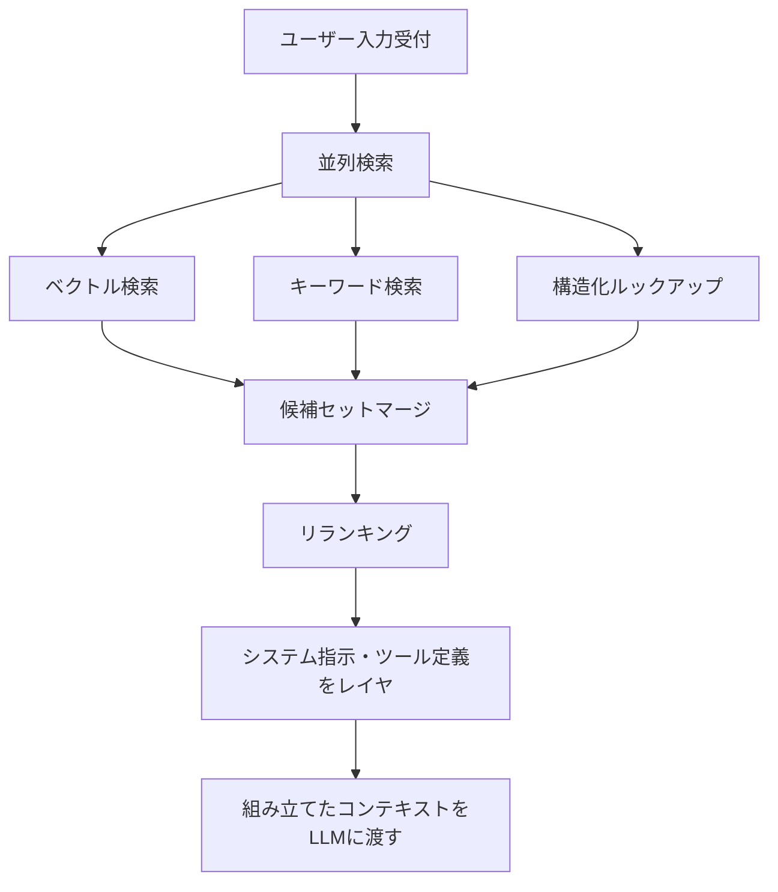

## ブログ概要（Summary）

本記事は [Context Engineering: A Practical Guide for AI Agents (2026)](https://sourcegraph.com/blog/context-engineering) の解説記事です。

Sourcegraph社のMatt Tannerが2026年5月28日に公開した本ブログは、LLMの各推論呼び出しで「何を見せるか」を意図的に設計するコンテキストエンジニアリングの実践ガイドである。コンテキストエンジニアリングをInstructions、Retrieval、Memory、Toolsの4つの柱で定義し、コンテキスト組立パイプラインの設計パターン、リランキングによる精度向上、CodeScaleBenchでのFile Recall 0.127から0.277への改善（2.2倍）を報告している。また、Context Overload、Stale Retrieval、Lost in the Middleという3つの一般的な失敗モードとその対策を整理している。

この記事は [Zenn記事: プロンプトキャッシュが覆すコンテキスト管理の常識：圧縮vs全保持の判断基準と実装](https://zenn.dev/0h_n0/articles/6319db2cded345) の深掘りです。

## Zenn記事との関連

Zenn記事ではプロンプトキャッシュがコンテキスト圧縮の経済合理性を逆転させる現象に焦点を当て、「圧縮 vs 全保持」の判断基準を定量的に示している。本ブログはその上流にある設計思想、すなわち「推論時にモデルが参照するコンテキスト全体をどう設計するか」という問いに体系的に答えている。Zenn記事のプロンプトキャッシュ戦略は、本ブログが述べるRetrieval柱とMemory柱の実装パターンの一部に位置付けられ、コンテキスト組立パイプライン全体の中でキャッシュがどの段階に介在するかを理解することで、Zenn記事の設計判断をより広い文脈で捉えられる。

## 情報源

- **種別**: 企業テックブログ
- **URL**: [https://sourcegraph.com/blog/context-engineering](https://sourcegraph.com/blog/context-engineering)
- **組織**: Sourcegraph
- **著者**: Matt Tanner
- **発表日**: 2026年5月28日

## 技術的背景（Technical Background）

### プロンプトエンジニアリングからコンテキストエンジニアリングへ

従来のプロンプトエンジニアリングは、単一の指示文字列の最適化に主眼を置いていた。Matt Tannerは、これをより広範なコンテキストエンジニアリングとして再定義している。両者の違いについて、ブログでは以下の5つの次元で整理している。

| 次元 | Prompt Engineering | Context Engineering |
|------|-------------------|----------------------|
| Scope | 単一指示文字列 | 推論時の全トークンセット |
| Surface | System prompt + user message | Instructions, docs, memory, tools, history |
| State | Stateless / single-turn | Stateful, multi-turn |
| Target | Better phrasing | Higher signal-to-noise ratio |
| Failure Mode | タスク誤解 | 情報不足・過剰・誤り |

この整理から明らかになるのは、コンテキストエンジニアリングの射程がプロンプトの「書き方」から、推論ターンに入力される「全トークン集合の設計」に拡張されている点である。プロンプトエンジニアリングの失敗モードが「タスクの誤解」であるのに対し、コンテキストエンジニアリングの失敗モードは「情報の不足・過剰・誤り」であり、問題の性質が質的に異なる。

エージェントが複数ターンにわたり動作する場合、各ターンでモデルが参照するコンテキストには、システムプロンプト、ユーザー入力、検索文書、会話履歴、ツール定義、永続メモリが含まれる。これら全てを一貫した設計原則のもとで管理する必要がある。

## 実装アーキテクチャ（Architecture）

### コンテキストエンジニアリングの4つの柱

Matt Tannerは、コンテキストエンジニアリングを構成する4つの柱を以下のように定義している。

**1. Instructions / System Prompt**: 役割定義、制約条件、出力形式を指定する。エージェントの振る舞いの骨格を決定する静的コンテキストである。

**2. Retrieval**: RAG（Retrieval-Augmented Generation）、構造化クエリ、ファイル読取、Just-in-Time検索を含む動的なコンテキスト取得層。ブログではベクトル検索とキーワード検索を並列実行し、候補セットをマージした後にリランキングを適用するパイプラインが推奨されている。

**3. Memory**: 短期メモリ（会話履歴）と長期メモリ（ユーザー設定、プロジェクト規約）の2層構造。マルチターンのエージェントでは、ターン間で一貫した文脈を維持するために不可欠な要素である。

**4. Tools**: LLMが呼び出す関数群の定義。ブログではAnthropicの洞察を引用し、「肥大化したツールセットは近似重複間の判断にターンを浪費させる」と述べている。ツールの機能重複を最小化し、各ツールの用途を一意に特定できる状態を保つことが重要である。

### コンテキスト組立パイプライン

ブログでは、コンテキスト組立の処理フローを以下のように定義している。



このパイプラインの核となるのがリランキングステップである。Matt Tannerは、50候補を高リコールで検索した後、精密なtop-5にリランクする方式が、全50チャンクをプロンプトに投入するよりも効果的であると述べている。

リランキングの効果を定式化すると、検索段階では高Recallを優先し候補集合$C$（$|C| = 50$）を取得した後、リランカーが関連度スコア$s(q, c_i)$を算出して上位$k$件（$k = 5$）に絞り込む。

$$
C_{\text{reranked}} = \arg\!\operatorname{top}_k \{ s(q, c_i) \mid c_i \in C \}
$$

ここで、$q$はユーザークエリ、$c_i$は候補チャンク、$s$はリランカーのスコアリング関数である。

この2段階方式により、コンテキストウィンドウに投入するトークン数を大幅に削減しつつ、関連度の高い情報を確実に含めることができる。

```python
from dataclasses import dataclass
from typing import Protocol


class Searcher(Protocol):
    """検索バックエンドのインタフェース"""

    def search(self, query: str, top_k: int) -> list["SearchResult"]:
        """クエリに基づき候補を返す"""
        ...


class Reranker(Protocol):
    """リランキングモデルのインタフェース"""

    def rerank(
        self, query: str, candidates: list["SearchResult"], top_k: int
    ) -> list["SearchResult"]:
        """候補をリランキングし上位k件を返す"""
        ...


@dataclass(frozen=True)
class SearchResult:
    """検索結果の1チャンク

    Attributes:
        content: チャンクのテキスト内容
        score: 検索スコア（0.0-1.0）
        source: 情報源の識別子
    """

    content: str
    score: float
    source: str


@dataclass
class ContextAssemblyPipeline:
    """コンテキスト組立パイプライン

    Sourcegraphが述べる並列検索 -> マージ -> リランキング ->
    コンテキストレイヤリングの処理フローを実装する。

    Attributes:
        searchers: 並列実行する検索バックエンド群
        reranker: リランキングモデル
        system_prompt: システムプロンプト
        tool_definitions: ツール定義一覧
        retrieval_top_k: 各検索バックエンドから取得する候補数
        rerank_top_k: リランキング後に保持する上位件数
    """

    searchers: list[Searcher]
    reranker: Reranker
    system_prompt: str
    tool_definitions: list[str]
    retrieval_top_k: int = 50
    rerank_top_k: int = 5

    def assemble(self, user_query: str) -> dict[str, object]:
        """ユーザークエリからLLM入力コンテキストを組み立てる

        Args:
            user_query: ユーザーの入力クエリ

        Returns:
            LLMに渡すコンテキスト辞書
        """
        # Step 1-2: 並列検索 -> 候補セットマージ
        all_candidates: list[SearchResult] = []
        for searcher in self.searchers:
            results = searcher.search(user_query, top_k=self.retrieval_top_k)
            all_candidates.extend(results)

        # Step 3: 重複排除
        seen_sources: set[str] = set()
        unique_candidates: list[SearchResult] = []
        for candidate in all_candidates:
            if candidate.source not in seen_sources:
                seen_sources.add(candidate.source)
                unique_candidates.append(candidate)

        # Step 4: リランキングでtop-kに絞り込み
        reranked = self.reranker.rerank(
            user_query, unique_candidates, top_k=self.rerank_top_k
        )

        # Step 5: システム指示・ツール定義をレイヤ
        return {
            "system_prompt": self.system_prompt,
            "tool_definitions": self.tool_definitions,
            "retrieved_context": [r.content for r in reranked],
            "user_query": user_query,
        }
```

## Production Deployment Guide

ブログで解説されているコンテキスト組立パイプライン（並列検索、リランキング、メモリ管理）をAWS上で実装する際の構成を示す。

### AWS実装パターン（コスト最適化重視）

コンテキストエンジニアリングの4つの柱をAWSサービスにマッピングした構成を、トラフィック量別に整理する。

| 構成 | 対象規模 | 主要サービス | 月額概算 |
|------|---------|------------|---------|
| Small | ~100 req/日 | Lambda + Bedrock + OpenSearch Serverless | $70-200 |
| Medium | ~1,000 req/日 | ECS Fargate + Bedrock + OpenSearch + ElastiCache | $400-950 |
| Large | 10,000+ req/日 | EKS + Bedrock + OpenSearch + ElastiCache Cluster | $2,500-5,800 |

**Small構成の内訳**（2026年8月時点、ap-northeast-1概算）:
- Lambda: 月100万リクエスト無料枠内、超過分$0.20/100万リクエスト
- Bedrock (Claude Sonnet 4): $3/MTok入力、$15/MTok出力
- OpenSearch Serverless: ベクトル検索用、2 OCU最小構成で$0.24/OCU-h（約$350/月だがサーチ専用で半減可）
- DynamoDB (On-Demand): Memory層（会話履歴・ユーザー設定）の永続化、$1.25/WCU-h

**Medium構成のポイント**:
- ECS Fargate: リランキングモデル（cross-encoder）をコンテナで常駐稼働させ、推論レイテンシを安定化
- ElastiCache (Valkey/Redis): 短期メモリ（会話履歴）のキャッシュ層として使用、TTL付きでContext Overload防止

**コスト削減テクニック**:
- Bedrock Prompt Caching有効化: Instructions柱（システムプロンプト+ツール定義）の静的プレフィックスをキャッシュして30-90%削減（Zenn記事で詳述）
- Bedrock Batch API: 非同期バッチ処理で50%削減
- Spot Instances活用: Large構成のEKSワーカーノードで最大90%削減
- Reserved Instances: ElastiCacheの1年コミットで最大33%削減
- OpenSearch Serverless: 検索コレクションとインデックスコレクションの分離で不要なOCUを削減

コスト試算は2026年8月時点のap-northeast-1料金に基づく概算値であり、実際のコストはトラフィックパターン、リージョン、バースト使用量により変動する。最新料金はAWS料金計算ツールで確認を推奨する。

### Terraformインフラコード

**Small構成（Serverless）**: Lambda + Bedrock + OpenSearch Serverless + DynamoDB

```hcl
# --- DynamoDB（Memory層: 会話履歴・ユーザー設定の永続化） ---
resource "aws_dynamodb_table" "agent_memory" {
  name         = "context-eng-agent-memory"
  billing_mode = "PAY_PER_REQUEST"
  hash_key     = "session_id"
  range_key    = "turn_number"

  attribute { name = "session_id";  type = "S" }
  attribute { name = "turn_number"; type = "N" }

  server_side_encryption { enabled = true; kms_key_arn = aws_kms_key.dynamo_key.arn }
  ttl { attribute_name = "expires_at"; enabled = true }
}

# --- OpenSearch Serverless（Retrieval層: ベクトル検索+キーワード検索） ---
resource "aws_opensearchserverless_collection" "retrieval" {
  name = "context-eng-retrieval"
  type = "VECTORSEARCH"
}

resource "aws_opensearchserverless_security_policy" "encryption" {
  name = "context-eng-encryption"
  type = "encryption"
  policy = jsonencode({
    Rules = [{ ResourceType = "collection", Resource = ["collection/context-eng-retrieval"] }]
    AWSOwnedKey = true
  })
}

# --- Lambda関数（コンテキスト組立パイプライン） ---
resource "aws_lambda_function" "context_assembler" {
  function_name = "context-eng-assembler"
  runtime       = "python3.12"
  handler       = "handler.lambda_handler"
  role          = aws_iam_role.assembler_lambda.arn
  timeout       = 90
  memory_size   = 1024

  environment {
    variables = {
      DYNAMODB_TABLE         = aws_dynamodb_table.agent_memory.name
      OPENSEARCH_ENDPOINT    = aws_opensearchserverless_collection.retrieval.collection_endpoint
      BEDROCK_MODEL_ID       = "anthropic.claude-sonnet-4-20250514-v1:0"
      RETRIEVAL_TOP_K        = "50"
      RERANK_TOP_K           = "5"
      MAX_CONTEXT_TOKENS     = "100000"
    }
  }

  tracing_config { mode = "Active" }
}

# --- IAMロール（最小権限） ---
resource "aws_iam_role" "assembler_lambda" {
  name = "context-eng-assembler-role"
  assume_role_policy = jsonencode({
    Version = "2012-10-17"
    Statement = [{ Action = "sts:AssumeRole", Effect = "Allow",
                    Principal = { Service = "lambda.amazonaws.com" } }]
  })
}

resource "aws_iam_role_policy" "assembler_permissions" {
  name = "context-eng-assembler-permissions"
  role = aws_iam_role.assembler_lambda.id
  policy = jsonencode({
    Version = "2012-10-17"
    Statement = [
      { Effect = "Allow", Action = ["dynamodb:GetItem", "dynamodb:PutItem", "dynamodb:Query"],
        Resource = aws_dynamodb_table.agent_memory.arn },
      { Effect = "Allow", Action = ["bedrock:InvokeModel"],
        Resource = "arn:aws:bedrock:ap-northeast-1::foundation-model/*" },
      { Effect = "Allow", Action = ["aoss:APIAccessAll"],
        Resource = aws_opensearchserverless_collection.retrieval.arn },
    ]
  })
}

# --- CloudWatchアラーム（コスト監視） ---
resource "aws_cloudwatch_metric_alarm" "bedrock_token_spike" {
  alarm_name          = "context-eng-bedrock-token-spike"
  comparison_operator = "GreaterThanThreshold"
  evaluation_periods  = 1
  metric_name         = "InputTokenCount"
  namespace           = "AWS/Bedrock"
  period              = 3600
  statistic           = "Sum"
  threshold           = 500000
  alarm_actions       = [aws_sns_topic.alerts.arn]
}
```

**Large構成（Container）**: EKS + Karpenter + OpenSearch + ElastiCache

```hcl
# --- EKSクラスタ（プライベートアクセスのみ） ---
module "eks" {
  source  = "terraform-aws-modules/eks/aws"
  version = "~> 20.0"

  cluster_name    = "context-eng-cluster"
  cluster_version = "1.31"
  vpc_id          = module.vpc.id
  subnet_ids      = module.vpc.private_subnets
  enable_karpenter                = true
  cluster_endpoint_public_access  = false
}

# --- Karpenter NodePool（Spot優先、Graviton対応） ---
resource "kubectl_manifest" "karpenter_nodepool" {
  yaml_body = yamlencode({
    apiVersion = "karpenter.sh/v1"
    kind       = "NodePool"
    metadata   = { name = "context-eng-pool" }
    spec = {
      template.spec.requirements = [
        { key = "karpenter.sh/capacity-type", operator = "In",
          values = ["spot", "on-demand"] },
        { key = "node.kubernetes.io/instance-type", operator = "In",
          values = ["m7g.large", "m7g.xlarge", "c7g.large", "c7g.xlarge"] }
      ]
      limits     = { cpu = "128", memory = "256Gi" }
      disruption = { consolidationPolicy = "WhenEmptyOrUnderutilized" }
    }
  })
}

# --- ElastiCache（短期メモリ: 会話履歴キャッシュ） ---
resource "aws_elasticache_replication_group" "memory_cache" {
  replication_group_id = "context-eng-memory-cache"
  description          = "Short-term memory cache for conversation history"
  engine               = "redis"
  engine_version       = "7.1"
  node_type            = "cache.r7g.large"
  num_cache_clusters   = 2
  at_rest_encryption_enabled = true
  transit_encryption_enabled = true
  kms_key_id                 = aws_kms_key.redis_key.arn
}

# --- AWS Budgets（月次予算アラート） ---
resource "aws_budgets_budget" "monthly" {
  name         = "context-eng-monthly"
  budget_type  = "COST"
  limit_amount = "3500"
  limit_unit   = "USD"
  time_unit    = "MONTHLY"

  notification {
    comparison_operator       = "GREATER_THAN"
    threshold                 = 80
    threshold_type            = "PERCENTAGE"
    notification_type         = "ACTUAL"
    subscriber_sns_topic_arns = [aws_sns_topic.alerts.arn]
  }
}
```

### 運用・監視設定

**CloudWatch Logs Insights クエリ** -- リランキング効果とコンテキスト品質の分析:

```
fields @timestamp, @message
| filter event = "context_assembly"
| stats avg(candidates_before_rerank) as avg_candidates,
        avg(candidates_after_rerank) as avg_reranked,
        avg(total_context_tokens) as avg_tokens,
        avg(retrieval_latency_ms) as avg_retrieval_ms,
        count(*) as assembly_count
  by bin(1h)
| sort @timestamp desc
```

**X-Ray トレーシング設定**:

```python
from aws_xray_sdk.core import xray_recorder, patch_all

patch_all()  # boto3自動計装


@xray_recorder.capture("context_assembly_pipeline")
def assemble_context(session_id: str, query: str) -> dict:
    """コンテキスト組立パイプラインをX-Rayでトレースする

    並列検索、リランキング、コンテキストレイヤリングの
    各ステップのレイテンシを可視化する。

    Args:
        session_id: セッション識別子
        query: 現在のユーザークエリ

    Returns:
        組み立てられたコンテキスト情報
    """
    subsegment = xray_recorder.current_subsegment()
    subsegment.put_annotation("session_id", session_id)

    # 並列検索
    with xray_recorder.in_subsegment("parallel_retrieval"):
        vector_results = vector_search(query, top_k=50)
        keyword_results = keyword_search(query, top_k=50)

    # マージ・リランキング
    with xray_recorder.in_subsegment("reranking"):
        merged = merge_candidates(vector_results, keyword_results)
        reranked = rerank(query, merged, top_k=5)

    subsegment.put_metadata("candidates_total", len(merged))
    subsegment.put_metadata("reranked_count", len(reranked))
    subsegment.put_metadata("total_tokens", count_tokens(reranked))

    return {"reranked": reranked, "session_id": session_id}
```

**Cost Explorer自動レポート**: `boto3.client("ce")`の`get_cost_and_usage`でProjectタグによるフィルタリングとサービス別GroupByを設定し、Bedrock + OpenSearch Serverlessの合算コストが$100/日を超過した場合にSNS通知を発行する構成が推奨される。特にOpenSearch ServerlessのOCU使用量とBedrock呼び出し回数の相関を監視することで、検索インフラのスケーリング判断の指標を得られる。

### コスト最適化チェックリスト

**アーキテクチャ選択**:
- [ ] トラフィック量に応じた構成選択（Small: Serverless / Medium: Hybrid / Large: Container）
- [ ] リランキング方式の選定（Cross-encoder on Fargate vs Bedrock Rerank API vs クライアントサイド）

**リソース最適化**:
- [ ] EC2/EKS: Spot Instances優先（Karpenter disruption設定）
- [ ] ElastiCache: Reserved Nodes 1年コミットで33%削減
- [ ] Savings Plans: Compute Savings Plans検討
- [ ] Lambda: メモリサイズを512MB-1024MBで最適化（Power Tuning）
- [ ] EKS: Karpenter consolidation有効化でアイドル時スケールダウン
- [ ] OpenSearch Serverless: 不要なOCUの削減（検索とインデックスの分離）

**LLMコスト削減**:
- [ ] Prompt Caching有効化: システムプロンプト+ツール定義の静的プレフィックスをキャッシュ
- [ ] Bedrock Batch API: 非同期処理に使用で50%削減
- [ ] モデル選択ロジック: リランキングにはHaiku、メイン推論にはSonnetと使い分け
- [ ] トークン数制限: Retrieval結果のmax_tokens設定でContext Overload抑制

**監視・アラート**:
- [ ] AWS Budgets: 月次予算アラート（80%/100%閾値）
- [ ] CloudWatch アラーム: Bedrock InputTokenCount、Lambda Duration P95
- [ ] Cost Anomaly Detection: 日次異常検知
- [ ] 日次コストレポート: Cost Explorer API + SNS通知
- [ ] OpenSearch OCU使用量モニタリング: スケーリング判断の材料

**リソース管理**:
- [ ] タグ戦略: Project/Environment/Owner必須
- [ ] DynamoDB TTL: セッションメモリの自動期限切れ（24h推奨）
- [ ] S3ライフサイクル: 検索インデックスのスナップショットを90日後Glacier移行
- [ ] 開発環境: 夜間・週末のElastiCache/EKS停止
- [ ] CloudWatch Logs: 保持期間を30日に設定

## パフォーマンス最適化（Performance）

### CodeScaleBenchの結果

ブログでは、370の企業規模タスクで構成されるCodeScaleBenchベンチマークにおいて、コンテキストエンジニアリングの適用前後の改善が報告されている。

| 指標 | 適用前 | 適用後 | 改善倍率 |
|------|--------|--------|----------|
| File Recall | 0.127 | 0.277 | 2.18x |
| Precision@5 | 0.140 | 0.478 | 3.41x |
| F1@5 | 0.099 | 0.262 | 2.65x |

File Recallは、タスク完了に必要なファイルをどれだけ正しく特定できたかを示す指標である。0.127から0.277への改善は、正しいファイルの特定率が2.2倍に向上したことを意味する。Precision@5は上位5件の精度であり、0.140から0.478への改善（3.4倍）は、リランキングによるノイズ除去の効果を端的に示している。

### 実世界タスクでの改善

ベンチマークだけでなく、実世界のタスクでも顕著な改善がブログで報告されている。

**Kubernetesタスク**: 従来は2時間のタイムアウトに達していたタスクが、コンテキストエンジニアリング適用後は89秒で完了し、タスクスコア0.90/1.0を達成している。

**クロスファイルリファクタリング**: ツール呼び出し回数が96回から5回に減少し（95%削減）、実行時間は84分から4.4分に短縮された（95%削減）。報酬スコアは2倍に向上している。

これらの改善は、適切なコンテキストをLLMに提供することでエージェントの探索的な試行錯誤が減少し、直接的に正しいファイルにアクセスできるようになった結果である。ツール呼び出し回数の劇的な削減は、コンテキストの質がエージェントの効率に直結することを実証している。

## 運用での学び（Production Lessons）

### 一般的な失敗モード

Matt Tannerは、コンテキストエンジニアリングにおける3つの一般的な失敗モードを整理している。

**1. Context Overload（コンテキスト過負荷）**: 100Kトークンの要約より5Kトークンの標的検索の方が高性能であると述べている。コンテキストウィンドウに入れられるからといって全てを入れるのではなく、信号対雑音比（S/N比）を最大化する設計が必要である。

**2. Stale Retrieval（古い検索結果）**: 古い埋め込み（embedding）がコンテキストを汚染する問題である。検索インデックスの鮮度が維持されなければ、リランキングの精度も劣化する。定期的なインデックス再構築と、ドキュメント変更時の差分更新が必要になる。

**3. Lost in the Middle（中間情報の不可視化）**: コンテキストの中間部分に配置された重要情報がモデルに見落とされる現象である。Liu et al. (2024)の研究とも整合するこの問題に対し、ブログでは高信号コンテンツをコンテキストの境界（先頭または末尾）に配置することを推奨している。

### ベストプラクティス

ブログでは以下の実践指針が示されている。

1. **包括的コンテキストより標的検索を優先する**: 全文書を投入するのではなく、クエリに関連する部分だけを検索・抽出する
2. **タスク毎に厳格なトークン予算を設定する**: コンテキストウィンドウの使用量を管理する
3. **高信号コンテンツをコンテキスト境界に配置する**: Lost in the Middle問題への対策
4. **コンテキスト組立前にリランキングを実施する**: 50候補からtop-5への絞り込み
5. **検索の鮮度を維持する**: Stale Retrieval防止のためのインデックス更新戦略
6. **ツール呼出数とレイテンシ差分を追跡する**: 改善効果の定量的モニタリング

### ツール・フレームワーク

ブログでは、コンテキストエンジニアリングを実現するためのツール群も整理されている。

- **ベクトルDB**: Weaviate, Pinecone, Qdrant, Milvus, pgvector
- **オーケストレーション**: LangChain, LlamaIndex, DSPy
- **コード知能**: Sourcegraph MCP server（SCIP-backed）
- **メモリ層**: mem0, Letta

特にSourcegraph MCP serverはSCIP（Source Code Intelligence Protocol）に基づくコード構造の理解を提供し、シンボルの定義・参照・型情報をコンテキストとして注入できる点が特徴的である。

## 学術研究との関連（Academic Connection）

Lost in the Middle問題に関するブログの指摘は、Liu et al. (2024) "Lost in the Middle: How Language Models Use Long Contexts"（[arXiv:2307.03172](https://arxiv.org/abs/2307.03172)）の知見と整合する。この研究では、コンテキストの先頭と末尾に置かれた情報は高い精度で想起されるが、中間部分の情報は見落とされやすいことが実験的に示されている。

リランキングによる2段階検索の有効性は、Nogueira et al. (2019)のpassage re-ranking研究や、cross-encoderベースのリランキングの計算コストとのトレードオフに関する研究（Glass et al., 2022）と関連する。ブログが報告する50候補からtop-5へのリランキング戦略は、これらの学術的知見を大規模コードベースの文脈に適用した実践例と位置付けられる。

また、Memory層の短期・長期の2層構造は、Packer et al. (2023)のMemGPT（[arXiv:2309.02427](https://arxiv.org/abs/2309.02427)）が提案する階層的メモリ管理と設計思想を共有しており、会話履歴の管理と永続的な設定・規約の分離という実装パターンに反映されている。

## まとめと実践への示唆

Sourcegraphのブログが提示するコンテキストエンジニアリングの核心は、プロンプトの「書き方」の最適化から、推論時に投入する「全トークン集合の設計」への視点の拡張である。Instructions、Retrieval、Memory、Toolsの4つの柱と、並列検索・リランキング・コンテキストレイヤリングのパイプラインにより、CodeScaleBenchでFile Recall 2.2倍、Precision@5 3.4倍の改善を実現している。実践に際しては、Context Overload・Stale Retrieval・Lost in the Middleの3つの失敗モードを認識した上で、まず5Kトークンの標的検索から始め、段階的にパイプラインを拡張するアプローチが推奨される。Zenn記事のプロンプトキャッシュ戦略との組み合わせにより、コスト効率とコンテキスト品質の両立を図ることが実践上の重要な判断点となる。

## 参考文献

- **Blog URL**: [https://sourcegraph.com/blog/context-engineering](https://sourcegraph.com/blog/context-engineering)
- **Related Zenn article**: [https://zenn.dev/0h_n0/articles/6319db2cded345](https://zenn.dev/0h_n0/articles/6319db2cded345)
- **Liu et al. (2024)**: "Lost in the Middle: How Language Models Use Long Contexts" - [https://arxiv.org/abs/2307.03172](https://arxiv.org/abs/2307.03172)
- **Packer et al. (2023)**: "MemGPT: Towards LLMs as Operating Systems" - [https://arxiv.org/abs/2309.02427](https://arxiv.org/abs/2309.02427)
- **Nogueira et al. (2019)**: "Passage Re-ranking with BERT" - [https://arxiv.org/abs/1901.04085](https://arxiv.org/abs/1901.04085)
