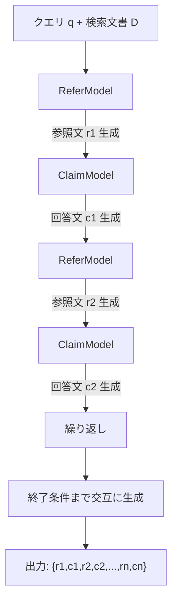

本記事は [Ground Every Sentence: Improving Retrieval-Augmented LLMs with Interleaved Reference-Claim Generation](https://arxiv.org/abs/2407.01796) の解説記事です。

## 論文概要

Xia et al. (2024) は、Retrieval-Augmented Generation（RAG）システムにおける帰属（attribution）の粒度を文レベルまで高める手法 ReClaim（Refer & Claim）を提案している。従来のpost-hoc引用付与では文書レベルや段落レベルの粗い帰属にとどまっていたが、ReClaimは生成プロセスの中で参照文と回答文を交互に出力するInterleaved Generationにより、各回答文に対応する引用を生成時に確定させる。ASQA・ELI5・EXPERTQAの3データセットで評価し、引用正確度（CAS）はそれぞれ92.1%・89.9%・90.1%を達成したと報告されている（論文Table 2）。

この記事は [Zenn記事: Anthropic Claude API実践ガイド](https://zenn.dev/0h_n0/articles/f22a4f1dda7162) の深掘りです。Citations APIの学術的背景として、LLMにおける引用生成の技術的課題と解決策を本論文に基づいて詳述する。

## 情報源

- **会議名**: NAACL 2025 Findings
- **arXiv ID**: 2407.01796
- **URL**: [https://arxiv.org/abs/2407.01796](https://arxiv.org/abs/2407.01796)
- **著者**: Sirui Xia, Xintao Wang, Jiaqing Liang et al.（Fudan University, AntGroup）
- **初版**: 2024年7月1日（改訂: 2025年5月23日）
- **分野**: cs.CL
- **コード**: [https://github.com/pdxthree/ReClaim](https://github.com/pdxthree/ReClaim)

## カンファレンス情報

**NAACL（North American Chapter of the Association for Computational Linguistics）** は計算言語学・NLP分野の主要国際会議の1つである。ACLの北米支部が主催する。本論文はNAACL 2025 Findingsとして採択されている。Findingsはメイン会議の採択基準には至らないが査読で品質が認められた論文のトラックである。

## 背景と動機

RAGシステムでは生成された回答の信頼性・検証可能性が課題となる。Attributed Text Generation（ATG）は回答に引用を付与してユーザーが根拠を検証できるようにする枠組みである。

従来手法は2つに大別される。**post-hoc citation**（事後引用）はALCE（Gao et al., 2023）に代表され、生成後に引用を付加するが文書レベルの粗い帰属にとどまる。**inline citation**（インライン引用）は生成時に引用を含めるがプロンプティング依存で精度が低い。著者らはこれらの課題に対し、生成プロセスの中で参照と回答を交互に出力するInterleaved Generation方式を提案している。

## 主要な貢献

- **Interleaved Reference-Claim Generation**: 参照文と回答文を交互に生成する帰属手法を提案し、文レベルの細粒度引用を実現
- **ReClaim w/IG（Interleaving Generation）**: 参照生成用モデル（ReferModel）と回答生成用モデル（ClaimModel）を分離しLoRAで個別に訓練する二段階生成アーキテクチャを設計した
- **Constrained Decoding**: 参照文が検索された文書の原文と一致することを保証するPrefix Treeベースの制約付きデコーディングを導入した
- **3データセットでの検証**: ASQA・ELI5・EXPERTQAでCAS平均90.7%を達成し、引用長を従来比78-84%短縮したと報告

## 技術的詳細

### タスク定式化

ReClaimのタスクは以下のように定式化される。クエリ $q$ と検索された文書集合 $D = \{d_1, d_2, \ldots, d_k\}$ が与えられたとき、出力 $O$ は参照文と回答文の交互列として生成される。

$$
O = \{r_1, c_1, r_2, c_2, \ldots, r_n, c_n\}
$$

ここで、
- $r_i \subset D$: $i$ 番目の参照文。検索文書 $D$ 中の文を引用
- $c_i$: $i$ 番目の回答文（claim）。$r_i$ に基づく回答の一部
- すべての $c_i$ を連結すると完全な回答が構成される

### ReClaim手法の3バリアント

著者らは3つの実装バリアントを提案している。

1. **ReClaim Prompting**: ファインチューニングなしのプロンプティングのみ。ベースラインとして使用
2. **ReClaim Unified**: 単一モデルを参照・回答の交互生成タスクでファインチューニング
3. **ReClaim w/IG（Interleaving Generation）**: 参照生成と回答生成を別々のモデルで分担し、推論時に交互に実行

### Interleaved Generationのフロー

ReClaim w/IGの生成フローを以下に示す。



各ステップの生成は以下のように定義される。

**参照生成**（ReferModel）:

$$
r_{i+1} = \text{ReferGen}(\text{Prompt}, \{r_1, c_1, \ldots, r_i, c_i\})
$$

**回答生成**（ClaimModel）:

$$
c_{i+1} = \text{ClaimGen}(\{r_1, c_1, \ldots, r_i, c_i, r_{i+1}\})
$$

ReferModelは生成履歴全体から次に引用すべき文を選択し、ClaimModelは直前の参照文 $r_{i+1}$ に基づく回答文を生成する。

### Constrained Decoding（制約付きデコーディング）

参照文が検索文書の原文と完全に一致することを保証するため、Prefix Tree（トライ木）ベースの制約付きデコーディングを採用している。検索文書の全文を文単位でトークン化しPrefix Treeに格納し、推論時はPrefix Treeの有効パスに沿ったトークンのみを候補として最高確率のトークンを選択する。論文Table 3でConsistency Ratio 100%を達成している。

### 訓練データ構築

訓練データはWebGLM-QA（4,582サンプル）とELI5（3,383サンプル）から構築されている。パイプラインは3段階で構成される。(1) BM25でtop-100文書を検索しBGE M3-Embeddingでリランキング。ノイズ耐性のため無関係文書も含める。(2) 回答生成（ELI5ではLlama-3.1-405B-Instructを使用）。(3) 回答を節単位に分割し、NLIモデルで引用の含意関係を検証。閾値 $\theta = 0.8$ を下回るサンプルを除去する。

$$
\text{flag}(r_i, c_i) = \begin{cases} 1 & \text{if } p(\text{NLI}(r_i, c_i) = \text{entailment}) \geq 0.8 \\ 0 & \text{otherwise} \end{cases}
$$

### 訓練の詳細

ベースモデルにはLlama2-7BおよびLlama3-8B-Instructを使用。ReClaim w/IGではLoRAでReferModel（学習率5e-5、5エポック）とClaimModel（学習率3e-5、2エポック）を個別に訓練する。LoRAにより推論時のアダプタスワップのみで2モデルを切り替えられ、メモリ効率が高い。ハードウェアはA800 80G GPU 4台。

## 実装のポイント

**Prefix Treeの構築効率**: top-5文書程度では問題ないが、文書数増加時は事前トークン化・キャッシュが必要である。

**LoRAアダプタのスワップ**: 同一ベースモデルでアダプタのみ切り替えるため、スワップは数ミリ秒で完了しレイテンシ影響は限定的である。

**NLIモデルの選択**: フィルタリング品質が引用精度に直結する。ドメイン固有タスクではNLIモデルの追加ファインチューニングを検討すべきである。

```python
from dataclasses import dataclass, field
from typing import Any


@dataclass
class PrefixTreeNode:
    """Prefix Tree（トライ木）ノード"""
    children: dict[int, "PrefixTreeNode"] = field(default_factory=dict)
    is_leaf: bool = False


class ConstrainedDecoder:
    """Prefix Treeベースの制約付きデコーダ

    Args:
        tokenizer: トークナイザ
    """
    def __init__(self, tokenizer: Any) -> None:
        self.tokenizer = tokenizer
        self.root = PrefixTreeNode()

    def build_tree(self, passages: list[str]) -> None:
        """検索文書の全文をPrefix Treeに格納"""
        import re
        for passage in passages:
            for sentence in re.split(r'(?<=[.!?])\s+', passage):
                node = self.root
                for tid in self.tokenizer.encode(sentence, add_special_tokens=False):
                    if tid not in node.children:
                        node.children[tid] = PrefixTreeNode()
                    node = node.children[tid]
                node.is_leaf = True

    def get_valid_tokens(self, prefix_ids: list[int]) -> list[int]:
        """現在のプレフィクスから有効な次トークン候補を返す"""
        node = self.root
        for tid in prefix_ids:
            if tid not in node.children:
                return []
            node = node.children[tid]
        return list(node.children.keys())
```

**終了条件**: ClaimModelがEOSトークンを出力するか最大長に達した場合に停止する。長文QAでは10-20回の交互サイクルが必要になる。

## Production Deployment Guide

### AWS実装パターン（コスト最適化重視）

RAG + 文レベル引用システムの本番運用では、検索エンジン（文書検索 + リランキング）、引用生成パイプライン（ReClaim方式またはCitations API）、引用検証（NLIベースの品質保証）の3つのワークロードを考慮する必要がある。

| 構成 | トラフィック | 主要サービス | 月額概算 |
|------|-------------|-------------|---------|
| Small | ~100 req/日 | Lambda + Bedrock (Claude) + OpenSearch Serverless | $100-250 |
| Medium | ~1,000 req/日 | ECS Fargate + Bedrock + OpenSearch + ElastiCache | $500-1,200 |
| Large | 10,000+ req/日 | EKS + Karpenter (Spot) + Bedrock + OpenSearch Cluster | $3,000-7,000 |

**コスト削減テクニック**: Spot Instances活用で最大90%削減、Reserved Instances（1年コミット）で最大72%削減、Bedrock Batch APIで50%削減、Prompt Cachingで30-90%削減。

**注意**: 上記は2026年8月時点のAWS ap-northeast-1料金に基づく概算値。実際のコストはトラフィックパターン、リージョン、バースト使用量により変動する。

### Terraformインフラコード

**Small構成（Serverless）**:

```hcl
# RAG + Citation Small構成: Lambda + Bedrock + OpenSearch Serverless
# コスト目安: $100-250/月 (ap-northeast-1)

resource "aws_opensearchserverless_collection" "documents" {
  name = "rag-citation-docs"
  type = "VECTORSEARCH"
  tags = { Project = "rag-citation", Environment = "production" }
}

resource "aws_lambda_function" "citation_pipeline" {
  function_name = "rag-citation-pipeline"
  runtime       = "python3.12"
  handler       = "handler.generate_with_citation"
  memory_size   = 2048
  timeout       = 120
  role          = aws_iam_role.lambda_exec.arn

  environment {
    variables = {
      OPENSEARCH_ENDPOINT = aws_opensearchserverless_collection.documents.collection_endpoint
      BEDROCK_MODEL_ID    = "anthropic.claude-sonnet-4-20250514-v1:0"
      CITATION_MODE       = "interleaved"
      NLI_THRESHOLD       = "0.8"
    }
  }
  tracing_config { mode = "Active" }
}

resource "aws_iam_role_policy" "lambda_policy" {
  name = "rag-citation-lambda-policy"
  role = aws_iam_role.lambda_exec.id
  policy = jsonencode({
    Version = "2012-10-17"
    Statement = [
      { Effect = "Allow", Action = ["aoss:APIAccessAll"], Resource = aws_opensearchserverless_collection.documents.arn },
      { Effect = "Allow", Action = ["bedrock:InvokeModel"], Resource = "arn:aws:bedrock:ap-northeast-1::foundation-model/*" },
      { Effect = "Allow", Action = ["logs:CreateLogGroup", "logs:CreateLogStream", "logs:PutLogEvents"], Resource = "arn:aws:logs:ap-northeast-1:*:*" },
    ]
  })
}
```

**Large構成（Container）**:

```hcl
# RAG + Citation Large構成: EKS + Karpenter + OpenSearch Cluster
# コスト目安: $3,000-7,000/月 (ap-northeast-1)

module "eks" {
  source          = "terraform-aws-modules/eks/aws"
  version         = "~> 20.0"
  cluster_name    = "rag-citation-cluster"
  cluster_version = "1.31"
  vpc_id          = module.vpc.vpc_id
  subnet_ids      = module.vpc.private_subnets
  cluster_endpoint_public_access = false
}

resource "kubectl_manifest" "karpenter_nodepool" {
  yaml_body = yamlencode({
    apiVersion = "karpenter.sh/v1"
    kind       = "NodePool"
    metadata   = { name = "rag-citation-pool" }
    spec = {
      template = { spec = { requirements = [
        { key = "karpenter.sh/capacity-type", operator = "In", values = ["spot", "on-demand"] },
        { key = "node.kubernetes.io/instance-type", operator = "In", values = ["m7i.xlarge", "m7i.2xlarge", "c7i.xlarge"] },
      ] } }
      limits     = { cpu = "96", memory = "192Gi" }
      disruption = { consolidationPolicy = "WhenEmptyOrUnderutilized" }
    }
  })
}

resource "aws_budgets_budget" "rag_citation" {
  name = "rag-citation-monthly"
  budget_type = "COST"
  limit_amount = "7000"
  limit_unit = "USD"
  time_unit = "MONTHLY"
  notification {
    comparison_operator       = "GREATER_THAN"
    threshold                 = 80
    threshold_type            = "PERCENTAGE"
    notification_type         = "ACTUAL"
    subscriber_sns_topic_arns = [aws_sns_topic.alerts.arn]
  }
}

### 運用・監視設定

**CloudWatch Logs Insights**（引用精度とレイテンシの監視）:

```
fields @timestamp, @message
| filter event = "citation_generation"
| stats avg(citation_accuracy) as avg_cas,
        avg(citation_length) as avg_cite_len,
        percentile(latency_ms, 95) as p95_latency,
        sum(total_tokens) as total_tokens,
        count(*) as request_count
  by bin(1h)
| sort @timestamp desc
```

**CloudWatchアラーム + X-Ray + Cost Explorer**:

```python
import boto3
from aws_xray_sdk.core import xray_recorder, patch_all

patch_all()  # boto3自動計装


def create_citation_alarms() -> None:
    """引用精度低下 + Bedrockトークンスパイク検知"""
    cw = boto3.client("cloudwatch")
    alarms = [
        ("rag-citation-cas-low", "CitationAccuracy", "RAGCitation", 85.0, "LessThanThreshold"),
        ("rag-citation-latency-p95", "RequestLatency", "RAGCitation", 10000, "GreaterThanThreshold"),
        ("rag-citation-bedrock-tokens", "InputTokenCount", "AWS/Bedrock", 500000, "GreaterThanThreshold"),
    ]
    for name, metric, ns, thresh, op in alarms:
        cw.put_metric_alarm(
            AlarmName=name, MetricName=metric, Namespace=ns,
            Statistic="Average", Period=300, EvaluationPeriods=2,
            Threshold=thresh, ComparisonOperator=op,
            AlarmActions=["arn:aws:sns:ap-northeast-1:123456789012:rag-alerts"],
        )


def get_daily_citation_costs() -> dict:
    """Cost Explorer: 日次コストレポート + $100超過時SNS通知"""
    ce = boto3.client("ce")
    from datetime import date, timedelta
    today = date.today().isoformat()
    yesterday = (date.today() - timedelta(days=1)).isoformat()

    result = ce.get_cost_and_usage(
        TimePeriod={"Start": yesterday, "End": today},
        Granularity="DAILY", Metrics=["UnblendedCost"],
        Filter={"Tags": {"Key": "Project", "Values": ["rag-citation"]}},
        GroupBy=[{"Type": "DIMENSION", "Key": "SERVICE"}],
    )
    costs = {g["Keys"][0]: float(g["Metrics"]["UnblendedCost"]["Amount"])
             for g in result["ResultsByTime"][0]["Groups"]}
    if sum(costs.values()) > 100:
        boto3.client("sns").publish(
            TopicArn="arn:aws:sns:ap-northeast-1:123456789012:rag-alerts",
            Subject="RAG Citation daily cost alert",
            Message=f"Daily cost ${sum(costs.values()):.2f} exceeds $100",
        )
    return costs
```

### コスト最適化チェックリスト

**アーキテクチャ選択**: トラフィック量で判断（Serverless/Hybrid/Container）、非同期処理にはBatch API検討

**リソース最適化**: EC2/EKS Spot優先（90%削減）、OpenSearch RI 1年コミット（72%削減）、Savings Plans検討、Lambda Power Tuning、Karpenter自動スケールダウン

**LLMコスト削減**: Bedrock Batch API（50%削減）、Prompt Caching（30-90%削減）、モデル選択ロジック（Haiku/Sonnet振り分け）、トークン数制限、NLI検証は軽量モデルで分離

**監視・アラート**: AWS Budgets月額予算アラート、CloudWatchアラーム（CAS低下・レイテンシ・トークンスパイク）、Cost Anomaly Detection、日次Cost Explorerレポート

**リソース管理**: 未使用インデックス削除、Project/Environment/Ownerタグ付与、S3ライフサイクル（90日後Glacier）、開発環境夜間停止、NAT Gateway不要時はVPCエンドポイントへ切替

## 実験結果

### 主要結果

論文Table 2より、ReClaim w/IG（Llama3-8B-Instruct）の結果を以下に示す。

| データセット | MAUVE | EM/Claim Recall | CAS | CRS |
|---|---|---|---|---|
| ASQA | 88.1 | 53.5 | 92.1 | 86.1 |
| ELI5 | 71.6 | 17.8 | 89.9 | 67.5 |
| EXPERTQA | 63.5 | 14.0 | 90.1 | 68.6 |

ここで、
- **MAUVE**: 生成文と人間の文の分布類似度（流暢性の指標）
- **EM/Claim Recall**: 回答に含まれる正解の割合（回答精度）
- **CAS（Correct Attribution Score）**: 回答文が引用文に支持される割合（引用正確度）
- **CRS（Citation Redundancy Score）**: 冗長でない引用の割合

ALCE + ChatGPTとの比較では、CASがASQAで+23.6%、ELI5で+55.6%、EXPERTQAで+35.0%改善している。一方、回答精度（EM/Claim Recall）は平均6.0%低下しており、トレードオフが存在する。Consistency Ratio（参照文が文書中に実在する割合）は全データセットで100%を達成し、引用長はALCE対比78-84%短縮されている（論文Table 3）。

### アブレーション研究

論文Table 4より、各コンポーネントの寄与を以下に示す。

| 構成 | ASQA CAS | ELI5 CAS | EXPERTQA CAS |
|---|---|---|---|
| ReferModel Only w/Sum | 94.5 | 96.2 | 97.7 |
| ClaimModel Only | 89.6 | 84.4 | 85.6 |
| ReClaim w/IG（Full） | 92.1 | 89.9 | 90.1 |

ReferModel Only w/Sum戦略は最高のCASを達成するが、流暢性（MAUVE）が低下する。ReClaim w/IGは全指標のバランスが最も優れた構成であると著者らは報告している。NLIフィルタリング済みデータの方が全指標で優れている（Figure 3）。

## 実運用への応用

ReClaimとClaude Citations APIは文レベルの帰属という目的を共有するが、アプローチが異なる。ReClaimはファインチューニング + Constrained Decodingで引用の完全一致を保証する。Citations APIはAPIレベルで文書ソースを指定しモデルが自動的に引用を付与するため、導入コストが低い。

プロダクション適用では以下の考慮が必要である。**レイテンシ**: 交互生成で生成時間が約2倍になるため、ストリーミング出力との組み合わせが重要。**スケーリング**: ReferModel/ClaimModelを別GPUにデプロイしパイプライン並列化が可能。**トレードオフ**: 高い引用精度は回答精度の低下を伴うため、医療・法律ではCAS優先、一般Q&Aでは回答精度優先の判断が求められる。

## まとめ

ReClaimは参照と回答の交互生成 + Constrained Decodingにより、CAS 90%超の文レベル引用精度を達成した手法である。引用精度と回答精度のトレードオフ、長文QAへの限定、レイテンシ増加といった制約はあるが、LoRAベースの効率的な訓練・推論設計は実用的である。Claude Citations APIのようなAPIベースのアプローチと相互補完的に活用できる。

## 参考文献

- **arXiv**: [https://arxiv.org/abs/2407.01796](https://arxiv.org/abs/2407.01796)
- **Code**: [https://github.com/pdxthree/ReClaim](https://github.com/pdxthree/ReClaim)
- **Related Zenn article**: [https://zenn.dev/0h_n0/articles/f22a4f1dda7162](https://zenn.dev/0h_n0/articles/f22a4f1dda7162)
- Gao et al., "Enabling Large Language Models to Generate Text with Citations," EMNLP 2023
- Honovich et al., "TRUE: Re-evaluating Factual Consistency Evaluation," NAACL 2022
- Lewis et al., "Retrieval-Augmented Generation for Knowledge-Intensive NLP Tasks," NeurIPS 2020
