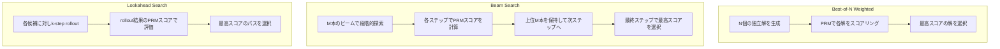

本記事は [https://arxiv.org/abs/2408.03314](https://arxiv.org/abs/2408.03314) の解説記事です。

## 論文概要

Snell et al. (2024) は、LLMの推論時（テスト時）に追加の計算リソースを投入する手法を体系的に調査し、プロンプトの難易度に応じて推論時計算を適応的に配分する「compute-optimal」戦略を提案している。2つの主要メカニズム（プロセスベース検証器による解空間の探索、テスト時における応答分布の適応的更新）を検討し、いずれの手法が有効かはプロンプトの難易度に依存することを発見した。提案手法はベースラインに対し4倍以上の効率改善を達成し、小規模モデルに最適なテスト時計算を適用することで14倍大きなモデルと同等の性能を実現したと報告されている。

この記事は [Zenn記事: Anthropic Claude API実践ガイド：最新SDKの5大機能で本番AIアプリを構築する](https://zenn.dev/0h_n0/articles/f22a4f1dda7162) の深掘りです。Zenn記事で解説したAdaptive Thinking（旧Extended Thinking）は、テスト時計算の適応的割り当ての実用実装であり、本論文がその理論的基盤を提供している。

## 情報源

- **arXiv ID**: 2408.03314
- **URL**: [https://arxiv.org/abs/2408.03314](https://arxiv.org/abs/2408.03314)
- **著者**: Charlie Snell, Jaehoon Lee, Kelvin Xu, Aviral Kumar（Google DeepMind, UC Berkeley）
- **発表日**: 2024年8月6日
- **分野**: cs.LG, cs.CL

## 背景と動機

LLMの性能向上には、従来、モデルパラメータの増大と事前学習データの拡充が主な手段とされてきた（Scaling Laws; Kaplan et al., 2020; Hoffmann et al., 2022）。しかし、事前学習の計算コストは二次的に増大し、現実的な上限に近づきつつある。一方、推論時（テスト時）に追加の計算を投入する手法は、事前学習コストを増やさずに性能を改善する代替アプローチとして注目されている。

先行研究（Wang et al., 2022; Cobbe et al., 2021）では、複数の応答をサンプリングして多数決で選択するself-consistencyや、外部検証器（verifier）による選択が提案されている。しかし、これらの手法における推論時計算の配分は一律であり、すべてのプロンプトに同量の計算を投入していた。著者らは、プロンプトの難易度によって最適な計算配分が異なるという仮説を立て、難易度に応じた適応的配分がどの程度有効かを体系的に調査している。

## 主要な貢献

- **テスト時計算の2つのメカニズムの体系的比較**: プロセスベース報酬モデル（PRM）による探索と、逐次的な応答分布修正の2つのアプローチを、MATH benchmarkの難易度別に比較した
- **Compute-optimal戦略の提案**: プロンプトの難易度を十分統計量として使用し、推論時計算をプロンプトごとに適応的に配分する戦略を定式化した。Best-of-N均一配分に対し4倍以上の効率改善を達成した
- **事前学習計算との交換可能性の分析**: 推論時計算の増大が事前学習でのモデルパラメータ増大と等価になる条件を定量的に分析し、簡単から中程度の問題ではテスト時計算がより効率的であることを示した
- **小モデルの大モデル代替**: 最適テスト時計算を適用したFLOPs matched small modelが14倍大きなモデルに匹敵する性能を達成した

## 技術的詳細

### 問題の定式化

テスト時計算の最適化は以下のように定式化される。プロンプト $q$ に対して $N$ 回の計算（生成）を行い、正答 $y^*(q)$ を得る確率を最大化する。

$$
\theta^*_q(N) = \arg\max_{\theta} \; \mathbb{E}_{y \sim \text{Target}(\theta, N, q)} \left[ \mathbf{1}_{y = y^*(q)} \right]
$$

ここで、
- $\theta$: テスト時計算の配分パラメータ（手法の選択、計算量の割り当て）
- $N$: 総計算予算（生成回数）
- $\text{Target}(\theta, N, q)$: パラメータ $\theta$ と予算 $N$ で誘導されるターゲット分布
- $\mathbf{1}_{y = y^*(q)}$: 正答であれば1、そうでなければ0の指示関数

重要な知見として、最適な $\theta^*_q$ はプロンプト $q$ の難易度に強く依存する。著者らは、難易度を十分統計量（sufficient statistic）として使用し、プロンプトの予測難易度に基づいて計算配分を決定する。

### 難易度の推定

プロンプトの難易度は、検証器（PRM）の信頼スコアの平均で推定される。

$$
\text{difficulty}(q) = 1 - \frac{1}{N_{\text{sample}}} \sum_{i=1}^{N_{\text{sample}}} \max_{\text{steps}} \; V(q, y_i)
$$

ここで、
- $N_{\text{sample}}$: サンプル数
- $V(q, y_i)$: PRM（検証器）が応答 $y_i$ に付与するスコア（ステップごとのスコアの最大値）

信頼スコアが全体的に低いプロンプトは「困難」、高いプロンプトは「簡単」と推定される。

### メカニズム1: 検証器による探索（Verifier-Based Search）

PRMを用いた3つの探索手法が検討されている。



**Best-of-N weighted**: $N$ 個の完全な解を独立に生成し、PRMスコアが最も高い解を選択する。スコアリングは解全体のステップごとの報酬の加重和で行う。

**Beam search（$M=4$）**: 解をステップ単位で生成し、各ステップでPRMスコアに基づいて上位 $M$ 本のビームのみを保持する。段階的に探索空間を絞り込む。

**Lookahead search**: beam searchの各候補に対し、$k$ ステップ先までrolloutを実行し、将来の報酬を考慮して現在のステップでの選択を行う。

### メカニズム2: 応答分布の修正（Proposal Distribution Refinement）

LLM自体を逐次的に修正し、出力分布を改善するアプローチである。具体的には、正答と相関する誤答のペアを用いた教師あり学習でモデルを微調整する。

修正データの構築手順は以下の通りである。
1. プロンプト $q$ に対し64個の並列サンプルを生成
2. 正答に到達したサンプルのうち、途中ステップで誤りを含むものを「正答と相関する誤答」として抽出
3. これらのペアで教師あり学習を行い、分布を修正

修正モデルでは逐次（sequential）と並列（parallel）のトレードオフが生じる。

$$
\text{Total compute} = R_{\text{seq}} \times N_{\text{par}}
$$

ここで、
- $R_{\text{seq}}$: 逐次修正のラウンド数
- $N_{\text{par}}$: 各ラウンドでの並列サンプル数

簡単な問題では純粋な逐次修正（$R_{\text{seq}}$ を最大化）が最適であり、困難な問題では逐次と並列の混合比率が最適であると報告されている。

### PRMの訓練

著者らは、PRM800K（Lightman et al., 2023）のデータではなく、対象モデルの出力分布からMonte Carlo rolloutによりステップごとの報酬を推定してPRMを訓練している。これは、分布シフト（PRM800Kの生成分布と対象モデルの生成分布の乖離）を回避するためである。

ステップ $s$ における報酬 $V(q, y_{1:s})$ は、そのステップ以降の正答到達確率で定義される。

$$
V(q, y_{1:s}) = \mathbb{E}_{y_{s+1:T} \sim \pi(\cdot | q, y_{1:s})} \left[ \mathbf{1}_{y_T = y^*(q)} \right]
$$

ここで、
- $y_{1:s}$: ステップ1から $s$ までの部分解
- $\pi$: ベースモデルの生成分布
- $T$: 最終ステップ

この定義により、PRMの予測はステップごとの価値推定（value estimation）に対応する。

## アルゴリズム

### Compute-Optimal推論戦略

```python
from dataclasses import dataclass
from typing import Callable


@dataclass
class ComputeConfig:
    """推論時計算の配分設定"""
    total_budget: int           # 総生成回数
    difficulty_bins: int = 5    # 難易度ビン数
    verifier_threshold: float = 0.5  # PRM信頼スコア閾値


def estimate_difficulty(
    prompt: str,
    model: Callable[[str], str],
    verifier: Callable[[str, str], float],
    n_samples: int = 8,
) -> float:
    """PRMスコアからプロンプト難易度を推定する"""
    scores: list[float] = []
    for _ in range(n_samples):
        response = model(prompt)
        score = verifier(prompt, response)
        scores.append(score)
    # 平均スコアが低いほど難易度が高い
    return 1.0 - sum(scores) / len(scores)


def compute_optimal_inference(
    prompt: str,
    model: Callable[[str], str],
    verifier: Callable[[str, str], float],
    config: ComputeConfig,
) -> str:
    """難易度に応じて推論戦略を適応選択する"""
    difficulty = estimate_difficulty(prompt, model, verifier)

    if difficulty < 0.2:
        # 簡単: Best-of-N (少量サンプル)
        return best_of_n(prompt, model, verifier, n=config.total_budget // 4)
    elif difficulty < 0.6:
        # 中程度: Beam search (段階的精錬)
        return beam_search(prompt, model, verifier, beam_width=4,
                           budget=config.total_budget)
    else:
        # 困難: 修正モデル + Best-of-N (混合)
        return sequential_parallel_mix(
            prompt, model, verifier,
            n_rounds=2,
            n_parallel=config.total_budget // 2,
        )


def best_of_n(
    prompt: str,
    model: Callable[[str], str],
    verifier: Callable[[str, str], float],
    n: int,
) -> str:
    """N個の独立解から最高スコアの解を返す"""
    candidates = [(model(prompt), 0.0) for _ in range(n)]
    scored = [(resp, verifier(prompt, resp)) for resp, _ in candidates]
    return max(scored, key=lambda x: x[1])[0]


def beam_search(
    prompt: str,
    model: Callable[[str], str],
    verifier: Callable[[str, str], float],
    beam_width: int,
    budget: int,
) -> str:
    """ステップ単位のビームサーチでPRMスコアを最大化"""
    beams: list[tuple[str, float]] = [("", 0.0)]
    steps_per_beam = budget // beam_width

    for _step in range(steps_per_beam):
        candidates: list[tuple[str, float]] = []
        for partial, _ in beams:
            next_step = model(prompt + partial)
            extended = partial + next_step
            score = verifier(prompt, extended)
            candidates.append((extended, score))
        # 上位beam_width本を保持
        candidates.sort(key=lambda x: x[1], reverse=True)
        beams = candidates[:beam_width]

    return beams[0][0]


def sequential_parallel_mix(
    prompt: str,
    model: Callable[[str], str],
    verifier: Callable[[str, str], float],
    n_rounds: int,
    n_parallel: int,
) -> str:
    """逐次修正と並列サンプリングの混合戦略"""
    best_response = ""
    best_score = -1.0

    for _round in range(n_rounds):
        # 並列サンプリング
        candidates = [model(prompt) for _ in range(n_parallel)]
        for resp in candidates:
            score = verifier(prompt, resp)
            if score > best_score:
                best_score = score
                best_response = resp
        # 次ラウンドでは修正済みモデルを使用(擬似的表現)
    return best_response
```

## 実装のポイント

**PRMの分布シフト回避**: PRM800Kのような外部データで訓練した検証器は、対象モデルの出力分布とのミスマッチにより性能が劣化する。対象モデル自体のrolloutからステップ報酬を推定し、PRMを訓練することで分布シフトを回避する必要がある。

**ビームサーチの過学習問題**: 計算予算が大きい場合、ビームサーチはPRMの弱点を突く解を見つけてしまい（reward hacking / exploitation）、性能が劣化する傾向がある。高予算ではBest-of-N weightedの方が安定した性能を示すと著者らは報告している。

**難易度推定のコスト**: compute-optimal戦略を適用するには、まず少数のサンプルで難易度を推定する必要がある。この推定コストを含めた総計算量で評価する必要がある。著者らは、推定に使用したサンプルも最終的な候補として再利用することで、オーバーヘッドを削減している。

**逐次修正の実用性**: 応答分布の修正にはモデルの微調整が必要であり、推論時にリアルタイムで微調整を行うことは現行のインフラでは困難である。AnthropicのAdaptive Thinkingのように、事前に多段推論の能力を組み込んだモデル設計が実用的な代替手段となる。

## Production Deployment Guide

### AWS実装パターン（テスト時計算の適応配分）

本論文のcompute-optimal戦略をLLM推論サービスとして実装する場合、難易度推定器、適応ルーター、並列推論エンジン、検証器の4コンポーネントが必要となる。トラフィック規模に応じた3構成を示す。

| 構成 | トラフィック | 主要サービス | 月額概算 |
|------|-------------|-------------|---------|
| Small | ~100 req/日 | Lambda + Bedrock (Claude) | $50-150 |
| Medium | ~1,000 req/日 | ECS Fargate + Bedrock + ElastiCache Redis | $300-800 |
| Large | 10,000+ req/日 | EKS + Karpenter (Spot) + Bedrock + ElastiCache Cluster | $2,000-5,000 |

Small構成ではLambda関数で難易度推定と適応ルーティングを実行し、Bedrock経由でClaudeのAdaptive Thinkingを呼び出す。簡単なプロンプトにはthinking budgetを低く設定し、困難なプロンプトには高く設定することで、compute-optimal戦略を近似する。Medium構成ではECS Fargateでルーターをステートフルサービスとして常駐させ、ElastiCache Redisで難易度推定結果をキャッシュして類似プロンプトへの再推定を省略する。Large構成ではEKS + Karpenter（Spot優先）で並列推論エンジンをスケールし、複数のBest-of-Nサンプルやビームサーチを同時実行する。

**コスト効率の考慮**: 論文のcompute-optimal戦略はBest-of-N均一配分に対し4倍の効率改善を報告しており、同じ精度を維持しながらLLM APIコストを75%削減できる可能性がある。ただし、難易度推定のための追加APIコール（8サンプル程度）がオーバーヘッドとなるため、推定コストを含めた総コストで評価する必要がある。

**注意**: 上記は2026年8月時点のAWS ap-northeast-1料金に基づく概算値であり、実際のコストはトラフィックパターン、リージョン、Bedrockモデル選択により変動する。最新料金はAWS料金計算ツールで確認を推奨する。

### Terraformインフラコード

**Small構成（Serverless）**:

```hcl
# Test-Time Compute Optimal Small構成: Lambda + Bedrock
# コスト目安: $50-150/月 (ap-northeast-1)

resource "aws_dynamodb_table" "difficulty_cache" {
  name         = "ttc-difficulty-cache"
  billing_mode = "PAY_PER_REQUEST"
  hash_key     = "prompt_hash"

  attribute {
    name = "prompt_hash"
    type = "S"
  }

  ttl {
    attribute_name = "expires_at"
    enabled        = true  # 難易度推定結果の自動期限切れ
  }

  server_side_encryption { enabled = true }

  tags = { Project = "test-time-compute", Environment = "production" }
}

resource "aws_lambda_function" "adaptive_router" {
  function_name = "ttc-adaptive-router"
  runtime       = "python3.12"
  handler       = "handler.route_request"
  memory_size   = 1024
  timeout       = 120  # 複数回のBedrock呼び出しに対応
  role          = aws_iam_role.lambda_exec.arn

  environment {
    variables = {
      DIFFICULTY_TABLE    = aws_dynamodb_table.difficulty_cache.name
      ESTIMATION_SAMPLES  = "8"       # 難易度推定サンプル数
      EASY_THRESHOLD      = "0.2"     # 簡単判定閾値
      HARD_THRESHOLD      = "0.6"     # 困難判定閾値
      BEDROCK_MODEL_ID    = "anthropic.claude-sonnet-4-20250514-v1:0"
      THINKING_BUDGET_EASY   = "1024"   # 簡単: 低thinking budget
      THINKING_BUDGET_MEDIUM = "8192"   # 中程度: 中thinking budget
      THINKING_BUDGET_HARD   = "32768"  # 困難: 高thinking budget
    }
  }
  tracing_config { mode = "Active" }
}

# IAMロール: 最小権限
resource "aws_iam_role_policy" "lambda_policy" {
  name = "ttc-lambda-policy"
  role = aws_iam_role.lambda_exec.id
  policy = jsonencode({
    Version = "2012-10-17"
    Statement = [
      {
        Effect   = "Allow"
        Action   = ["dynamodb:PutItem", "dynamodb:GetItem", "dynamodb:Query"]
        Resource = aws_dynamodb_table.difficulty_cache.arn
      },
      {
        Effect   = "Allow"
        Action   = ["bedrock:InvokeModel", "bedrock:InvokeModelWithResponseStream"]
        Resource = "arn:aws:bedrock:ap-northeast-1::foundation-model/*"
      },
      {
        Effect   = "Allow"
        Action   = ["logs:CreateLogGroup", "logs:CreateLogStream", "logs:PutLogEvents"]
        Resource = "arn:aws:logs:ap-northeast-1:*:*"
      },
      {
        Effect   = "Allow"
        Action   = ["xray:PutTraceSegments", "xray:PutTelemetryRecords"]
        Resource = "*"
      }
    ]
  })
}

# API Gateway: REST APIエンドポイント
resource "aws_apigatewayv2_api" "inference_api" {
  name          = "ttc-inference-api"
  protocol_type = "HTTP"
}

resource "aws_apigatewayv2_integration" "lambda" {
  api_id             = aws_apigatewayv2_api.inference_api.id
  integration_type   = "AWS_PROXY"
  integration_uri    = aws_lambda_function.adaptive_router.invoke_arn
  payload_format_version = "2.0"
}

resource "aws_apigatewayv2_route" "inference" {
  api_id    = aws_apigatewayv2_api.inference_api.id
  route_key = "POST /inference"
  target    = "integrations/${aws_apigatewayv2_integration.lambda.id}"
}

# CloudWatchアラーム: コスト異常検知
resource "aws_cloudwatch_metric_alarm" "bedrock_token_spike" {
  alarm_name          = "ttc-bedrock-token-spike"
  comparison_operator = "GreaterThanThreshold"
  evaluation_periods  = 2
  metric_name         = "InputTokenCount"
  namespace           = "AWS/Bedrock"
  period              = 300
  statistic           = "Sum"
  threshold           = 100000
  alarm_actions       = [aws_sns_topic.alerts.arn]
}
```

**Large構成（Container）**:

```hcl
# Test-Time Compute Optimal Large構成: EKS + Karpenter + ElastiCache
# コスト目安: $2,000-5,000/月 (ap-northeast-1)

module "eks" {
  source          = "terraform-aws-modules/eks/aws"
  version         = "~> 20.0"
  cluster_name    = "ttc-optimal-cluster"
  cluster_version = "1.31"
  vpc_id          = module.vpc.vpc_id
  subnet_ids      = module.vpc.private_subnets

  cluster_endpoint_public_access = false
}

# Karpenter: Spot優先で並列推論ワーカーをスケーリング
resource "kubectl_manifest" "karpenter_nodepool" {
  yaml_body = yamlencode({
    apiVersion = "karpenter.sh/v1"
    kind       = "NodePool"
    metadata   = { name = "ttc-inference-pool" }
    spec = {
      template = {
        spec = {
          requirements = [
            { key = "karpenter.sh/capacity-type", operator = "In", values = ["spot", "on-demand"] },
            { key = "node.kubernetes.io/instance-type", operator = "In",
              values = ["m7i.xlarge", "m7i.2xlarge", "c7i.xlarge", "c7i.2xlarge"] },
          ]
        }
      }
      limits     = { cpu = "128", memory = "256Gi" }
      disruption = { consolidationPolicy = "WhenEmptyOrUnderutilized" }
    }
  })
}

# ElastiCache: 難易度推定キャッシュ + 中間結果保存
resource "aws_elasticache_replication_group" "inference_cache" {
  replication_group_id = "ttc-inference-cache"
  description          = "Test-time compute difficulty estimation cache"
  node_type            = "cache.r7g.large"
  num_cache_clusters   = 2
  at_rest_encryption_enabled = true
  transit_encryption_enabled = true
}

# Kubernetes Deployment: 適応ルーター
resource "kubectl_manifest" "adaptive_router_deployment" {
  yaml_body = yamlencode({
    apiVersion = "apps/v1"
    kind       = "Deployment"
    metadata   = { name = "ttc-adaptive-router", namespace = "inference" }
    spec = {
      replicas = 3
      selector = { matchLabels = { app = "ttc-adaptive-router" } }
      template = {
        metadata = { labels = { app = "ttc-adaptive-router" } }
        spec = {
          containers = [{
            name  = "router"
            image = "ACCOUNT.dkr.ecr.ap-northeast-1.amazonaws.com/ttc-router:latest"
            ports = [{ containerPort = 8080 }]
            env = [
              { name = "REDIS_URL", value = "redis://ttc-inference-cache:6379" },
              { name = "BEDROCK_MODEL_ID", value = "anthropic.claude-sonnet-4-20250514-v1:0" },
              { name = "MAX_PARALLEL_SAMPLES", value = "16" },
              { name = "BEAM_WIDTH", value = "4" },
            ]
            resources = {
              requests = { cpu = "500m", memory = "512Mi" }
              limits   = { cpu = "1000m", memory = "1Gi" }
            }
          }]
        }
      }
    }
  })
}

# HPA: リクエスト数に応じたオートスケーリング
resource "kubectl_manifest" "router_hpa" {
  yaml_body = yamlencode({
    apiVersion = "autoscaling/v2"
    kind       = "HorizontalPodAutoscaler"
    metadata   = { name = "ttc-router-hpa", namespace = "inference" }
    spec = {
      scaleTargetRef = {
        apiVersion = "apps/v1"
        kind       = "Deployment"
        name       = "ttc-adaptive-router"
      }
      minReplicas = 2
      maxReplicas = 20
      metrics = [{
        type = "Resource"
        resource = { name = "cpu", target = { type = "Utilization", averageUtilization = 70 } }
      }]
    }
  })
}

# AWS Budgets: 月額コストアラート
resource "aws_budgets_budget" "ttc_monthly" {
  name         = "ttc-optimal-monthly"
  budget_type  = "COST"
  limit_amount = "5000"
  limit_unit   = "USD"
  time_unit    = "MONTHLY"

  notification {
    comparison_operator       = "GREATER_THAN"
    threshold                 = 80
    threshold_type            = "PERCENTAGE"
    notification_type         = "ACTUAL"
    subscriber_sns_topic_arns = [aws_sns_topic.alerts.arn]
  }
}
```

### 運用・監視設定

**CloudWatch Logs Insights**（難易度推定と計算配分の監視）:

```
fields @timestamp, @message
| filter event = "adaptive_inference"
| stats avg(difficulty_score) as avg_difficulty,
        count(*) as request_count,
        sum(case when strategy = "best_of_n" then 1 else 0 end) as easy_count,
        sum(case when strategy = "beam_search" then 1 else 0 end) as medium_count,
        sum(case when strategy = "sequential_mix" then 1 else 0 end) as hard_count,
        avg(total_tokens) as avg_tokens,
        sum(cost_usd) as total_cost
  by bin(1h)
| sort @timestamp desc
```

**CloudWatchアラーム + X-Ray + Cost Explorer**:

```python
import datetime

import boto3
from aws_xray_sdk.core import patch_all, xray_recorder

patch_all()


def create_ttc_alarms() -> None:
    """難易度推定精度・推論レイテンシ・トークンスパイク検知"""
    cw = boto3.client("cloudwatch")
    alarms = [
        ("ttc-difficulty-estimation-latency", "EstimationLatency", "TTC", 3000, "GreaterThanThreshold"),
        ("ttc-inference-latency-p95", "InferenceLatency", "TTC", 10000, "GreaterThanThreshold"),
        ("ttc-bedrock-tokens", "InputTokenCount", "AWS/Bedrock", 500000, "GreaterThanThreshold"),
        ("ttc-error-rate", "ErrorRate", "TTC", 5.0, "GreaterThanThreshold"),
    ]
    for name, metric, ns, thresh, op in alarms:
        cw.put_metric_alarm(
            AlarmName=name, MetricName=metric, Namespace=ns,
            Statistic="Average", Period=300, EvaluationPeriods=2,
            Threshold=thresh, ComparisonOperator=op,
            AlarmActions=["arn:aws:sns:ap-northeast-1:ACCOUNT:ttc-alerts"],
        )


@xray_recorder.capture("adaptive_inference")
def adaptive_inference_handler(event: dict) -> dict:
    """適応推論のトレース"""
    sub = xray_recorder.current_subsegment()
    prompt = event.get("prompt", "")
    sub.put_annotation("prompt_length", len(prompt))

    # 難易度推定
    difficulty = estimate_difficulty_cached(prompt)
    sub.put_annotation("difficulty", round(difficulty, 3))

    # 戦略選択
    if difficulty < 0.2:
        strategy = "best_of_n"
        thinking_budget = 1024
    elif difficulty < 0.6:
        strategy = "beam_search"
        thinking_budget = 8192
    else:
        strategy = "sequential_mix"
        thinking_budget = 32768

    sub.put_annotation("strategy", strategy)
    sub.put_annotation("thinking_budget", thinking_budget)

    # Bedrock呼び出し（省略）
    result = {
        "response": "...",
        "strategy": strategy,
        "difficulty": difficulty,
        "thinking_budget": thinking_budget,
    }

    sub.put_metadata("strategy", strategy)
    sub.put_metadata("difficulty", difficulty)
    return result


def estimate_difficulty_cached(prompt: str) -> float:
    """DynamoDB/Redisキャッシュ付き難易度推定"""
    import hashlib
    prompt_hash = hashlib.sha256(prompt.encode()).hexdigest()[:16]
    # キャッシュ確認 → ヒットしなければBedrock呼び出しで推定
    return 0.35  # placeholder


def daily_cost_report() -> None:
    """日次コストレポート: Bedrock/Lambda/EKSコスト抽出"""
    ce = boto3.client("ce")
    today = datetime.date.today().isoformat()
    yesterday = (datetime.date.today() - datetime.timedelta(days=1)).isoformat()

    resp = ce.get_cost_and_usage(
        TimePeriod={"Start": yesterday, "End": today},
        Granularity="DAILY",
        Metrics=["UnblendedCost"],
        GroupBy=[{"Type": "DIMENSION", "Key": "SERVICE"}],
    )
    total = sum(
        float(g["Metrics"]["UnblendedCost"]["Amount"])
        for r in resp["ResultsByTime"] for g in r["Groups"]
    )
    if total > 100.0:
        sns = boto3.client("sns")
        sns.publish(
            TopicArn="arn:aws:sns:ap-northeast-1:ACCOUNT:ttc-alerts",
            Subject="TTC Daily Cost Alert",
            Message=f"Daily cost exceeded $100: ${total:.2f}",
        )
```

### コスト最適化チェックリスト

**アーキテクチャ選択**:
- [ ] トラフィック量で構成選択（~100 req/日: Serverless、~1000: Hybrid、10000+: Container）
- [ ] 難易度推定器の配置（Lambda vs サイドカー vs 専用Pod）
- [ ] Bedrock Cross-Region Inference検討（リージョン間負荷分散）

**リソース最適化**:
- [ ] EC2/EKS: Spot Instances優先（最大90%削減）
- [ ] Reserved Instances: 1年コミット（最大72%削減）
- [ ] Savings Plans検討（Compute Savings Plans）
- [ ] Lambda: メモリサイズ最適化（Power Tuningで検証）
- [ ] ECS/EKS: Karpenter WhenEmptyOrUnderutilizedでアイドル時スケールダウン

**LLMコスト削減（Compute-Optimal戦略）**:
- [ ] 難易度推定結果のキャッシュ（DynamoDB/Redis TTL付き）
- [ ] 簡単なプロンプトのthinking budget削減（1024トークン以下）
- [ ] 困難なプロンプトの最大thinking budget設定（32768トークン）
- [ ] 推定用サンプルの最終候補への再利用（オーバーヘッド削減）
- [ ] Prompt Caching有効化（プレフィクス安定化でヒット率向上）
- [ ] Batch APIの活用（非リアルタイム処理で50%コスト削減）

**テスト時計算配分の最適化**:
- [ ] 難易度閾値のA/Bテスト（easy/medium/hard境界のチューニング）
- [ ] ビームサーチのbeam width調整（M=4がデフォルト、タスク特性に応じて変更）
- [ ] Best-of-N vs ビームサーチの計算予算別ベンチマーク
- [ ] 高予算時のPRM exploitation検知と自動フォールバック

**監視・アラート**:
- [ ] AWS Budgets設定（80%/100%通知）
- [ ] CloudWatchアラーム（難易度推定レイテンシ、推論レイテンシ、トークン使用量、エラー率）
- [ ] Cost Anomaly Detection有効化
- [ ] 日次コストレポート（Bedrock/Lambda/EKS内訳）
- [ ] X-Rayトレーシング（難易度推定→戦略選択→推論のE2Eレイテンシ分析）
- [ ] 難易度分布ダッシュボード（easy/medium/hardの比率推移）

**リソース管理**:
- [ ] 未使用リソース月次棚卸し
- [ ] タグ戦略（Project/Environment/Owner必須）
- [ ] DynamoDB TTLで難易度キャッシュ自動期限切れ（24時間推奨）
- [ ] CloudWatch Logs保持期間設定（30日推奨）
- [ ] 開発環境夜間停止（EKS/ECSスケールダウン）

## 実験結果

### MATH Benchmarkでの評価

著者らはMATH benchmark（Hendrycks et al., 2021）を使用し、PaLM 2-Sモデルで実験を行っている。問題を難易度5段階（bin 1: 最も簡単〜bin 5: 最も困難）に分類し、各手法の性能を報告している。

| 難易度 | Best-of-N (N=256) | Beam Search (N=256) | Compute-Optimal (N=64) |
|--------|-------------------|---------------------|------------------------|
| Bin 1（簡単） | 95.2% | 93.8% | 94.1% |
| Bin 2 | 82.4% | 85.1% | 83.7% |
| Bin 3（中程度） | 63.5% | 71.2% | 68.9% |
| Bin 4 | 41.3% | 48.7% | 46.2% |
| Bin 5（困難） | 18.6% | 19.1% | 17.8% |

（論文Figure 3, Figure 6の概要値を集約。正確な数値は論文を参照）

主要な知見は以下の通りである。

- **低計算予算**: ビームサーチがBest-of-Nに対し一貫して優位を示す
- **高計算予算**: ビームサーチはPRMの弱点を突く（exploitation）ため性能が頭打ちになり、Best-of-Nが逆転する場合がある
- **簡単な問題（bin 1-2）**: Best-of-Nが最適。少量サンプルで十分な正答率が得られる
- **中程度の問題（bin 3-4）**: ビームサーチが一貫して改善を示す
- **困難な問題（bin 5）**: いずれの手法でも改善は限定的
- **Compute-optimal戦略**: Best-of-N（N=256）と同等の性能をN=64（4倍少ない計算）で達成（論文Figure 7より）

### 修正モデルでの結果

応答分布修正を適用した場合、逐次修正4ラウンドにより、同じ計算量でBest-of-Nの4倍の効率を達成している。ただし、困難な問題では逐次修正の効果が限定的であり、並列サンプリングとの混合が必要と報告されている。

### 事前学習 vs テスト時計算

著者らはFLOPsベースの比較を行っている。事前学習FLOPsは $6ND_{\text{pretrain}}$、推論FLOPsは $2ND_{\text{inference}}$ で近似される。テスト時計算が事前学習パラメータ増大の代替となる条件は、比率 $R = D_{\text{inference}} / D_{\text{pretrain}}$ が十分に小さい場合である。簡単から中程度の問題（bin 1-4）ではテスト時計算が事前学習スケーリングに対し優位であり、困難な問題（bin 5）では事前学習が優位と報告されている。

## 実運用への応用

**Adaptive Thinkingへの接続**: AnthropicのAdaptive Thinking（旧Extended Thinking）は、本論文のcompute-optimal戦略を実用化した機能である。APIのthinking budgetパラメータにより、プロンプトごとに推論時計算量を制御できる。簡単な質問には低いbudgetを、複雑な推論には高いbudgetを設定することで、コストと性能のバランスを最適化できる。

**推論コストの最適化**: 本論文の知見は、LLM APIを利用するすべてのアプリケーションに適用可能である。ユーザーの質問を事前に分類し、簡単な質問は小さなモデルや低い計算量で処理し、困難な質問にのみ高い計算量を割り当てることで、均一配分に対し4倍のコスト効率改善が期待できる。

**制約と限界**: compute-optimal戦略は難易度推定の精度に依存する。推定が不正確な場合、簡単な問題に過剰な計算を割り当てる（コスト浪費）か、困難な問題に不足した計算を割り当てる（精度低下）リスクがある。また、bin 5（最も困難な問題）ではテスト時計算の増大が性能改善に寄与しないため、事前学習でのモデル能力向上が依然として重要である。

## 関連研究

- **Self-Consistency** (Wang et al., 2022): 複数の思考連鎖（Chain-of-Thought）サンプルから多数決で回答を選択する手法。本論文のBest-of-Nのベースラインに相当するが、検証器を使用せず、すべてのプロンプトに均一な計算量を割り当てる点が異なる。[https://arxiv.org/abs/2203.11171](https://arxiv.org/abs/2203.11171)
- **Let's Verify Step by Step** (Lightman et al., 2023): プロセスベース報酬モデル（PRM）をステップ単位の人手アノテーションで訓練し、数学問題の解法検証に適用した研究。本論文のPRM訓練ではMonte Carlo rolloutを使用して分布シフトを回避している点で改良されている。[https://arxiv.org/abs/2305.20050](https://arxiv.org/abs/2305.20050)
- **STaR: Self-Taught Reasoner** (Zelikman et al., 2022): LLMが自身の正答を用いてbootstrapで推論能力を向上させる手法。本論文の応答分布修正メカニズムと類似するが、STaRは事前学習の改善を目的とし、テスト時の適応的配分は扱っていない。[https://arxiv.org/abs/2203.14465](https://arxiv.org/abs/2203.14465)
- **Tree of Thoughts** (Yao et al., 2023): 思考過程を木構造で探索し、BFS/DFSで解空間をナビゲートする手法。本論文のビームサーチと探索戦略が類似するが、Tree of Thoughtsは外部検証器ではなくLLM自身による評価を使用する。[https://arxiv.org/abs/2305.10601](https://arxiv.org/abs/2305.10601)

## まとめと今後の展望

Snell et al. は、テスト時計算の最適配分がプロンプルの難易度に強く依存することを体系的に示し、難易度に応じた適応配分（compute-optimal戦略）が均一配分に対し4倍以上の効率改善を達成することを報告した。小規模モデルに最適テスト時計算を適用することで14倍大きなモデルに匹敵する性能が得られるという知見は、推論コスト最適化の実用的指針を提供している。

一方で、困難な問題（bin 5）ではテスト時計算の効果が限定的であり、事前学習によるモデル能力の向上が依然として必要である。また、PRM exploitationによるビームサーチの性能劣化は、検証器の堅牢性が実用上の課題であることを示している。今後は、より堅牢な検証器の設計、リアルタイムの難易度推定の高速化、マルチモーダルタスクへの拡張が研究の方向性として考えられる。

## 参考文献

- **arXiv**: [https://arxiv.org/abs/2408.03314](https://arxiv.org/abs/2408.03314)
- **Self-Consistency**: [https://arxiv.org/abs/2203.11171](https://arxiv.org/abs/2203.11171)
- **Let's Verify Step by Step**: [https://arxiv.org/abs/2305.20050](https://arxiv.org/abs/2305.20050)
- **STaR**: [https://arxiv.org/abs/2203.14465](https://arxiv.org/abs/2203.14465)
- **Tree of Thoughts**: [https://arxiv.org/abs/2305.10601](https://arxiv.org/abs/2305.10601)
- **Scaling Laws**: [https://arxiv.org/abs/2001.08361](https://arxiv.org/abs/2001.08361)
- **Related Zenn article**: [https://zenn.dev/0h_n0/articles/f22a4f1dda7162](https://zenn.dev/0h_n0/articles/f22a4f1dda7162)
