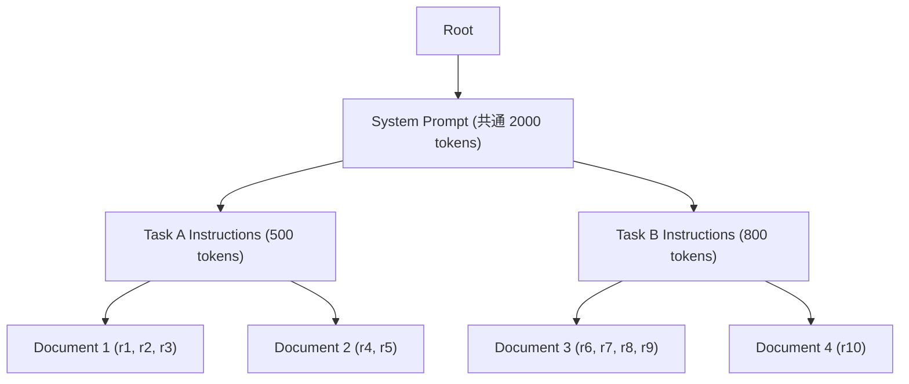

本記事は [BatchLLM: Optimizing Large Batched LLM Inference with Global Prefix Sharing and Throughput-oriented Token Batching](https://arxiv.org/abs/2412.03594) の解説記事です。

## 論文概要

Zheng et al. (2024, revised 2026) は、大規模バッチLLM推論を最適化するシステム BatchLLM を提案している。オフラインバッチ処理という特性を活かし、全リクエストの共通プレフィックスをコンパクトプレフィックスツリーで事前に明示的識別するグローバルプレフィックス共有、同一プレフィックスのリクエストをまとめて実行するグループベーススケジューリング、リクエスト数ではなくKVキャッシュメモリ消費量で制約するメモリ認識型トークンバッチングの3つの革新を導入している。マイクロベンチマークでvLLM比1.4-3倍（A100）、最大10.8倍のスループット向上を報告している（論文Table 1, Figure 9）。

この記事は [Zenn記事: Anthropic Claude API実践ガイド：最新SDKの5大機能で本番AIアプリを構築する](https://zenn.dev/0h_n0/articles/f22a4f1dda7162) の深掘りである。Zenn記事で解説したBatch APIによる大量処理の最適化（50%コスト割引）を、推論エンジン側でどのようにスループットを最大化しているかという視点から補完する内容である。

## 情報源

- **種別**: カンファレンス論文
- **会議名**: MLSys 2026（Conference on Machine Learning and Systems）
- **タイトル**: BatchLLM: Optimizing Large Batched LLM Inference with Global Prefix Sharing and Throughput-oriented Token Batching
- **著者**: Zhen Zheng, Xin Ji, Taosong Fang et al.
- **arXiv ID**: 2412.03594
- **URL**: [https://arxiv.org/abs/2412.03594](https://arxiv.org/abs/2412.03594)
- **発表日**: 2024年11月29日（改訂 2026年4月22日 v3）
- **分野**: cs.CL, cs.AI, cs.DC, cs.LG

## Zenn記事との関連

[Anthropic Claude API実践ガイド：最新SDKの5大機能で本番AIアプリを構築する](https://zenn.dev/0h_n0/articles/f22a4f1dda7162) では、Anthropic Batch APIを用いた大量リクエストの50%コスト割引処理について解説している。Batch APIの利用者がAPIエンドポイントに大量リクエストを投入する際、推論エンジン内部ではそれらのリクエストをどのように効率的に処理するかという課題が存在する。BatchLLMはまさにこのバッチ推論の内部最適化メカニズムを扱っており、プレフィックス共有やメモリ認識型バッチングによりスループットを大幅に向上させる手法を提案している。

## カンファレンス情報

MLSys（Conference on Machine Learning and Systems）は、機械学習とシステム設計の交差領域を扱うトップカンファレンスである。2018年に設立され、機械学習アルゴリズムの実システムへの展開、推論・学習の効率化、分散システム設計など、理論と実装の両面を重視した査読が行われる。ICML、NeurIPS等がアルゴリズム面を重視するのに対し、MLSysはシステムレベルの実装と評価を重視する点が特徴である。

BatchLLMはLLM推論の実システム最適化というMLSysの中心テーマに合致しており、vLLMへのプラグイン実装という実用性と、マイクロベンチマーク・実業界ワークロード双方での評価が採択理由として推察される。

## 背景と動機

### バッチ推論の位置づけ

LLM推論のワークロードは大きく2つに分類される。第一にオンライン推論（チャットボット、コーディングアシスタント等）で、低レイテンシが求められストリーミング配信が前提となる。第二にオフラインバッチ推論（大量ドキュメント要約、コード生成、評価ベンチマーク実行等）で、レイテンシよりもスループット（単位時間あたりの処理リクエスト数）が重要となる。

vLLM、SGLang等の既存推論エンジンは主にオンライン推論向けに設計されており、continuous batching（リクエストが完了次第新リクエストを補充する方式）でレイテンシを最小化する。しかし著者らは、この設計がバッチ推論シナリオで以下の3つの非効率を生むと指摘している。

### 既存手法の3つの限界

**1. LRUベース暗黙キャッシュの限界**

vLLMやSGLangはLRU（Least Recently Used）方式でKVキャッシュを暗黙的に管理する。リクエストが到着した順にプレフィックスをキャッシュし、メモリが不足すると最も古いエントリを追い出す。著者らの分析（論文Section 4.1）によると、最適ポテンシャル（全リクエストの共通プレフィックスを完全に共有した場合）の58.1%のトークン節約に対し、vLLMのLRUキャッシュは35.8%のトークン節約にとどまったと報告されている。

この差の原因は、LRU方式がリクエストの到着順に依存するためである。共通プレフィックスを持つリクエストが時間的に分散して到着すると、先にキャッシュされたプレフィックスが別のリクエストに追い出されてしまう。

**2. リクエスト数ベースのバッチサイズ制限**

vLLMのデフォルト設定では、1バッチあたり最大256リクエストという固定制限が設定されている。しかし、リクエストの出力長はタスクによって大きく異なる。出力が短いリクエスト（例: 分類タスクで数トークン）では、256リクエストでもGPUメモリに余裕があるにもかかわらずバッチが制限される。逆に出力が長いリクエストでは、256リクエストがメモリ上限を超えてOOMが発生する可能性がある。

**3. スケジューリングの非最適性**

オンライン推論向けのスケジューラはリクエストを到着順（FCFS: First Come First Served）で処理する。バッチ推論では全リクエストが事前に既知であるにもかかわらず、同一プレフィックスを持つリクエストが異なるバッチに分散され、KVキャッシュの再利用効率が低下する。

## 主要な貢献

- **グローバルプレフィックス共有**: 全リクエストの共通プレフィックスをコンパクトプレフィックスツリーで事前に明示的識別し、動的プログラミングによるマルチレベル統合でKVキャッシュ再利用を最大化する手法を提案した（トークン節約率85.2%、vLLMの40.1%に対して）
- **グループベーススケジューリング**: 同一プレフィックスを共有するリクエストをグループ化し、デコーディング/プリフィル比率メトリクス（RR）によるリクエストグループ再順序化を導入した
- **メモリ認識型トークンバッチング**: リクエスト数ではなくKVキャッシュメモリ消費量を制約とするバッチサイズ決定方式を提案し、GPUメモリの利用効率を向上させた
- **実装と評価**: vLLM v0.6.4へのプラグイン統合として実装し、マイクロベンチマーク（7B-70Bモデル、A100/MI200）と実業界ワークロードの双方で評価を実施した

## 技術的詳細

### グローバルプレフィックスツリー

BatchLLMの中核は、全リクエストの共通プレフィックスを事前に識別するコンパクトプレフィックスツリーの構築である。

バッチ内の全リクエスト集合 $R = \{r_1, r_2, ..., r_N\}$ に対して、各リクエスト $r_i$ のプロンプトトークン列 $T_i = [t_1^{(i)}, t_2^{(i)}, ..., t_{L_i}^{(i)}]$ を入力とする。コンパクトプレフィックスツリー $\mathcal{T}$ は、共通プレフィックスをノードとして共有するトライ木構造であり、各内部ノード $v$ は共通プレフィックストークン列 $\text{prefix}(v)$ を保持する。



上図は、10件のリクエストが3レベルのプレフィックス共有構造を持つ例である。ルートからの共通システムプロンプト（2000トークン）、タスク別のインストラクション、ドキュメント別のコンテキストが階層的に共有される。

#### マルチレベル統合の動的プログラミング

実際のバッチでは多数のリクエスト間にマルチレベルの共通プレフィックスが存在するが、全レベルのプレフィックスをKVキャッシュに保持するとメモリオーバーヘッドが増大する。著者らは動的プログラミングにより、プレフィックスツリーの深いノードを親ノードに統合し、単一レベルのプレフィックス共有に変換するアルゴリズムを提案している。

統合の目的関数は、トークン節約量の最大化である。ノード $v$ のプレフィックス長を $l(v)$、そのサブツリーに含まれるリクエスト数を $n(v)$ とすると、ノード $v$ を共有プレフィックスとして採用した場合のトークン節約量は次式で表される。

$$
S(v) = l(v) \times (n(v) - 1)
$$

ここで、
- $l(v)$: ノード $v$ のプレフィックストークン数
- $n(v)$: ノード $v$ のサブツリーに含まれるリクエスト数
- $n(v) - 1$: プレフィックスは1回計算すれば $n(v) - 1$ 回の再計算が不要

著者らの実験（論文Section 4.1）では、マルチレベル（56%のトークン節約）から単一レベル（55%）への統合で、節約率の低下は1ポイント未満に抑えられたと報告されている。これはメモリ管理の複雑さを大幅に削減するトレードオフとして妥当であると著者らは主張している。

### グループベーススケジューリング

プレフィックスツリーで識別されたグループに基づき、以下の2段階でスケジューリングを行う。

**ステップ1: プレフィックス共有グループの構築**

プレフィックスツリーの各リーフに対応するリクエスト群を1つのグループとする。同一グループ内のリクエストは同一のプレフィックスKVキャッシュを共有するため、連続して実行することでキャッシュの再利用効率が最大化される。

**ステップ2: リクエストグループ再順序化**

グループ間の実行順序を決定するために、デコーディング/プリフィル比率メトリクス（RR: Request Ratio）を導入している。

$$
RR(g) = \frac{\sum_{r \in g} \hat{o}(r)}{\sum_{r \in g} p(r)}
$$

ここで、
- $g$: リクエストグループ
- $\hat{o}(r)$: リクエスト $r$ の推定出力トークン数
- $p(r)$: リクエスト $r$ のプリフィルトークン数（プレフィックス除外後）

$RR$ が大きいグループほど、プリフィルに対してデコーディングの比率が高い。著者らはRRが大きいグループを先にスケジュールする戦略を採用している。これにより、デコーディングが長いリクエストが先に開始され、後続のプリフィル中心のグループがGPUの空き容量を効率的に活用できると報告されている。


### メモリ認識型トークンバッチング

従来のリクエスト数制限（vLLMデフォルト256）に代わり、KVキャッシュのメモリ消費量を直接制約とするバッチング方式を提案している。

1バッチに含めるリクエスト集合 $B$ を決定する際、以下の制約を満たす最大のバッチサイズを計算する。

$$
\sum_{r \in B} M_{\text{KV}}(r) \leq M_{\text{avail}}
$$

ここで、
- $M_{\text{KV}}(r)$: リクエスト $r$ のKVキャッシュメモリ消費量（プレフィックス共有分を除く）
- $M_{\text{avail}}$: GPUの利用可能メモリ（モデルウェイト、アクティベーション等を除いた残り）

リクエスト $r$ のKVキャッシュメモリ消費量は以下で推定される。

$$
M_{\text{KV}}(r) = 2 \times n_{\text{layers}} \times n_{\text{heads}} \times d_{\text{head}} \times (p'(r) + \hat{o}(r)) \times s_{\text{dtype}}
$$

ここで、
- $n_{\text{layers}}$: Transformerレイヤ数
- $n_{\text{heads}}$: KVヘッド数（GQAの場合はKVヘッド数）
- $d_{\text{head}}$: ヘッドの次元数
- $p'(r)$: プレフィックス共有後のプリフィルトークン数
- $\hat{o}(r)$: 推定出力トークン数
- $s_{\text{dtype}}$: データ型サイズ（FP16: 2バイト）
- 係数2: KeyとValueの2つのキャッシュ

この方式により、出力が短いリクエスト（分類タスク等）ではバッチサイズが256を大幅に超えることが可能となり、出力が長いリクエストではOOMを回避できる。

## 実装のポイント

### vLLMへのプラグイン統合

BatchLLMはvLLM v0.6.4にプラグイン形式で統合されている。主な実装変更は以下の3点である。

1. **トークンバッチングスケジューラ**: vLLMのデフォルトスケジューラを置き換え、メモリ認識型バッチサイズ決定とグループベーススケジューリングを実装
2. **専用アテンションバックエンド**: プレフィックス共有を考慮したアテンション計算を行うカスタムカーネル。共有プレフィックスのKVキャッシュを重複なく参照する
3. **プレフィックスツリービルダー**: バッチ開始前に全リクエストからコンパクトプレフィックスツリーを構築し、グループ分割と統合を実行する前処理モジュール

### アテンションカーネルの設計

プレフィックス共有時のアテンション計算では、同一プレフィックスのKVキャッシュを複数リクエストが参照する。通常のpaged attentionではリクエストごとにKVブロックのコピーが必要になる場合があるが、BatchLLMの専用カーネルは共有KVブロックへの直接参照を実装し、メモリコピーのオーバーヘッドを排除していると報告されている。

## Production Deployment Guide

### AWS実装パターン（バッチ推論最適化重視）

BatchLLMの本番運用では、バッチリクエストの受付・キューイング、GPU推論、結果の永続化の3つのワークロードを考慮する必要がある。GPU推論が最大のコスト要因であり、プレフィックス共有によるKVキャッシュ削減がコスト最適化の鍵となる。

| 構成 | トラフィック | 主要サービス | 月額概算 |
|------|-------------|-------------|---------|
| Small | ~500 req/日 | Lambda + SQS + SageMaker Async Inference | $300-800 |
| Medium | ~5,000 req/日 | ECS Fargate + SQS + SageMaker Real-time (g5.xlarge) | $2,000-4,500 |
| Large | 50,000+ req/日 | EKS + Karpenter + SageMaker Multi-Model (p4d.24xlarge) | $15,000-40,000 |

Small構成はLambda（バッチジョブ投入）+ SQS（キューイング）+ SageMaker Async Inference（GPU推論）で構成する。Medium構成はECS Fargate + SQS + SageMaker Real-time Endpoint（g5.xlarge、vLLM + BatchLLMプラグイン）を追加する。Large構成はEKS + Karpenter（GPU Spot優先）+ SageMaker Multi-Model Endpointで複数モデルを効率的にホスティングする。

**コスト削減テクニック**: BatchLLMのプレフィックス共有により、同一テンプレートを使う大量リクエスト（ドキュメント要約、コード生成等）でKVキャッシュ計算量を最大85%削減できると報告されている。SageMaker Async InferenceとSpotインスタンスの組み合わせで、さらに60-70%のインスタンスコスト削減が見込める。

**注意**: 上記は2026年8月時点のAWS ap-northeast-1料金に基づく概算値であり、実際のコストはモデルサイズ、リクエスト長、バースト使用量により変動する。最新料金はAWS料金計算ツールで確認を推奨する。

### Terraformインフラコード

**Small構成（Serverless + SageMaker Async）**:

```hcl
# BatchLLM Small構成: Lambda + SQS + SageMaker Async
# コスト目安: $300-800/月 (ap-northeast-1)

resource "aws_sqs_queue" "batch_requests" {
  name                       = "batchllm-requests"
  visibility_timeout_seconds = 900  # 推論処理時間を考慮
  message_retention_seconds  = 86400
  receive_wait_time_seconds  = 20   # ロングポーリング

  redrive_policy = jsonencode({
    deadLetterTargetArn = aws_sqs_queue.batch_dlq.arn
    maxReceiveCount     = 3
  })

  tags = {
    Project     = "batchllm-inference"
    Environment = "production"
    CostCenter  = "ml-ops"
  }
}

resource "aws_sqs_queue" "batch_dlq" {
  name                      = "batchllm-requests-dlq"
  message_retention_seconds = 1209600  # 14日間保持
}

resource "aws_lambda_function" "batch_submitter" {
  function_name = "batchllm-submitter"
  runtime       = "python3.12"
  handler       = "submitter.handler"
  memory_size   = 512
  timeout       = 300
  role          = aws_iam_role.batch_lambda.arn

  environment {
    variables = {
      QUEUE_URL           = aws_sqs_queue.batch_requests.url
      SAGEMAKER_ENDPOINT  = aws_sagemaker_endpoint.batchllm.name
      MAX_BATCH_SIZE      = "1000"
      PREFIX_TREE_ENABLED = "true"
    }
  }
  tracing_config { mode = "Active" }
}

resource "aws_iam_role_policy" "batch_lambda_policy" {
  name = "batchllm-lambda-policy"
  role = aws_iam_role.batch_lambda.id
  policy = jsonencode({
    Version = "2012-10-17"
    Statement = [
      {
        Effect   = "Allow"
        Action   = ["sqs:SendMessage", "sqs:ReceiveMessage", "sqs:DeleteMessage"]
        Resource = aws_sqs_queue.batch_requests.arn
      },
      {
        Effect   = "Allow"
        Action   = ["sagemaker:InvokeEndpointAsync"]
        Resource = aws_sagemaker_endpoint.batchllm.arn
      },
      {
        Effect   = "Allow"
        Action   = ["s3:PutObject", "s3:GetObject"]
        Resource = "${aws_s3_bucket.batch_io.arn}/*"
      }
    ]
  })
}

resource "aws_s3_bucket" "batch_io" {
  bucket = "batchllm-io-${data.aws_caller_identity.current.account_id}"

  tags = {
    Project     = "batchllm-inference"
    Environment = "production"
  }
}

resource "aws_s3_bucket_lifecycle_configuration" "batch_io_lifecycle" {
  bucket = aws_s3_bucket.batch_io.id

  rule {
    id     = "cleanup-old-results"
    status = "Enabled"
    expiration { days = 30 }
  }
}

resource "aws_cloudwatch_metric_alarm" "batch_queue_depth" {
  alarm_name          = "batchllm-queue-depth-high"
  comparison_operator = "GreaterThanThreshold"
  evaluation_periods  = 3
  metric_name         = "ApproximateNumberOfMessagesVisible"
  namespace           = "AWS/SQS"
  statistic           = "Average"
  period              = 300
  threshold           = 10000
  alarm_actions       = [aws_sns_topic.batch_alerts.arn]

  dimensions = {
    QueueName = aws_sqs_queue.batch_requests.name
  }
}
```

**Large構成（EKS + GPU Spot）**:

```hcl
# BatchLLM Large構成: EKS + Karpenter + GPU Spot
# コスト目安: $15,000-40,000/月 (ap-northeast-1)

module "eks" {
  source          = "terraform-aws-modules/eks/aws"
  version         = "~> 20.0"
  cluster_name    = "batchllm-production"
  cluster_version = "1.31"

  vpc_id     = module.vpc.vpc_id
  subnet_ids = module.vpc.private_subnets

  eks_managed_node_groups = {
    system = {
      instance_types = ["m6i.xlarge"]
      min_size       = 2
      max_size       = 4
      desired_size   = 2
      labels         = { workload = "system" }
    }
  }
}

resource "kubectl_manifest" "karpenter_gpu_nodepool" {
  yaml_body = yamlencode({
    apiVersion = "karpenter.sh/v1"
    kind       = "NodePool"
    metadata   = { name = "gpu-batch-inference" }
    spec = {
      template = {
        spec = {
          requirements = [
            {
              key      = "node.kubernetes.io/instance-type"
              operator = "In"
              values   = ["g5.12xlarge", "g5.48xlarge", "p4d.24xlarge"]
            },
            {
              key      = "karpenter.sh/capacity-type"
              operator = "In"
              values   = ["spot", "on-demand"]  # Spot優先
            },
            {
              key      = "kubernetes.io/arch"
              operator = "In"
              values   = ["amd64"]
            }
          ]
          nodeClassRef = {
            apiVersion = "karpenter.k8s.aws/v1"
            kind       = "EC2NodeClass"
            name       = "gpu-nodes"
          }
        }
      }
      disruption = {
        consolidationPolicy = "WhenEmptyOrUnderutilized"
        consolidateAfter    = "60s"
      }
      limits = {
        cpu    = "384"
        memory = "3Ti"
        "nvidia.com/gpu" = "32"
      }
    }
  })
}

# vLLM + BatchLLMプラグインのKubernetes Deployment
resource "kubectl_manifest" "batchllm_deployment" {
  yaml_body = yamlencode({
    apiVersion = "apps/v1"
    kind       = "Deployment"
    metadata = {
      name      = "batchllm-server"
      namespace = "inference"
    }
    spec = {
      replicas = 4
      selector = { matchLabels = { app = "batchllm" } }
      template = {
        metadata = { labels = { app = "batchllm" } }
        spec = {
          nodeSelector = { "nvidia.com/gpu.present" = "true" }
          tolerations  = [{ key = "nvidia.com/gpu", operator = "Exists", effect = "NoSchedule" }]
          containers = [{
            name  = "vllm-batchllm"
            image = "vllm/vllm-openai:v0.6.4-batchllm"
            args = [
              "--model", "meta-llama/Meta-Llama-3-70B-Instruct",
              "--tensor-parallel-size", "4",
              "--max-model-len", "32768",
              "--scheduler-cls", "batchllm.TokenBatchingScheduler",
              "--enable-prefix-caching",
              "--gpu-memory-utilization", "0.92"
            ]
            resources = {
              limits   = { "nvidia.com/gpu" = "4" }
              requests = { "nvidia.com/gpu" = "4", memory = "128Gi" }
            }
            env = [
              { name = "BATCHLLM_PREFIX_TREE", value = "enabled" },
              { name = "BATCHLLM_MEMORY_AWARE", value = "true" },
              { name = "CUDA_VISIBLE_DEVICES", value = "0,1,2,3" }
            ]
            ports = [{ containerPort = 8000 }]
            livenessProbe = {
              httpGet = { path = "/health", port = 8000 }
              initialDelaySeconds = 120
              periodSeconds       = 30
            }
          }]
        }
      }
    }
  })
}
```

### バッチリクエスト投入のPythonコード例

```python
"""BatchLLM向けバッチリクエスト投入クライアント.

プレフィックス共有を最大化するため、同一テンプレートの
リクエストをグループ化して投入する。
"""

import json
from dataclasses import dataclass, field

import boto3


@dataclass(frozen=True)
class BatchRequest:
    """バッチ推論リクエスト."""

    request_id: str
    prompt: str
    max_tokens: int = 512
    temperature: float = 0.0


@dataclass
class BatchGroup:
    """同一プレフィックスのリクエストグループ."""

    prefix: str
    requests: list[BatchRequest] = field(default_factory=list)

    @property
    def prefix_length(self) -> int:
        """プレフィックスのおおよそのトークン数（文字数/4で近似）."""
        return len(self.prefix) // 4


def group_by_prefix(
    requests: list[BatchRequest],
    min_prefix_length: int = 100,
) -> list[BatchGroup]:
    """リクエストを共通プレフィックスでグループ化.

    Args:
        requests: バッチリクエストのリスト
        min_prefix_length: 最小プレフィックス長（文字数）

    Returns:
        プレフィックスでグループ化されたリスト
    """
    if not requests:
        return []

    groups: dict[str, BatchGroup] = {}
    for req in requests:
        prefix = req.prompt[:min_prefix_length]
        if prefix not in groups:
            groups[prefix] = BatchGroup(prefix=prefix)
        groups[prefix].requests.append(req)

    return sorted(
        groups.values(),
        key=lambda g: len(g.requests),
        reverse=True,
    )


def submit_batch(
    groups: list[BatchGroup],
    queue_url: str,
    region: str = "ap-northeast-1",
) -> dict[str, int]:
    """SQSキューにバッチリクエストをグループ順で投入.

    Args:
        groups: プレフィックスグループのリスト
        queue_url: SQSキューURL
        region: AWSリージョン

    Returns:
        投入結果の統計情報
    """
    sqs = boto3.client("sqs", region_name=region)
    submitted = 0
    failed = 0

    for group in groups:
        entries = []
        for i, req in enumerate(group.requests):
            entries.append({
                "Id": f"msg-{submitted + i}",
                "MessageBody": json.dumps({
                    "request_id": req.request_id,
                    "prompt": req.prompt,
                    "max_tokens": req.max_tokens,
                    "temperature": req.temperature,
                }),
                "MessageGroupId": str(hash(group.prefix) % 10000),
            })
            if len(entries) == 10:  # SQS batch limit
                resp = sqs.send_message_batch(
                    QueueUrl=queue_url,
                    Entries=entries,
                )
                submitted += len(resp.get("Successful", []))
                failed += len(resp.get("Failed", []))
                entries = []
        if entries:
            resp = sqs.send_message_batch(
                QueueUrl=queue_url,
                Entries=entries,
            )
            submitted += len(resp.get("Successful", []))
            failed += len(resp.get("Failed", []))

    return {"submitted": submitted, "failed": failed}
```

## 実験結果

### マイクロベンチマーク

著者らは7B-70Bパラメータのモデル（Llama-2-7B, Llama-2-13B, Llama-2-70B）をNVIDIA A100（80GB）およびAMD MI200上で評価している（論文Table 1, Figure 9）。

| モデル | GPU | vLLM (req/s) | SGLang (req/s) | BatchLLM (req/s) | vs vLLM | vs SGLang |
|--------|-----|-------------|---------------|-----------------|---------|-----------|
| Llama-2-7B | A100 | ベースライン | ベースライン | - | 1.4-3.0x | 1.2-2.5x |
| Llama-2-70B | A100 | ベースライン | ベースライン | - | 1.8-2.5x | 1.3-2.0x |
| Llama-2-7B | MI200 | ベースライン | - | - | 1.8-4.1x | - |

プレフィックス共有度（同一プレフィックスを共有するリクエスト数）と共有プレフィックス長が増加するにつれ、BatchLLMの優位性が拡大すると報告されている。共有プレフィックス16,000トークン、共有度16の条件で最大10.8倍のスループット向上を達成したとされる。

### プレフィックスキャッシュ効率

| 手法 | トークン節約率 | 最適ポテンシャル比 |
|------|-------------|-------------------|
| vLLM LRU | 35.8-40.1% | 61.6-69.1% |
| SGLang LRU | 35.3-39.8% | 60.7-68.5% |
| BatchLLM | 85.2% | 96.7% |
| 最適ポテンシャル | 58.1%（全体） | 100% |

BatchLLMの85.2%という節約率が最適ポテンシャルの58.1%を超えているのは、BatchLLMが全リクエストを事前に把握して最適なグループ化を行うのに対し、最適ポテンシャルは到着順処理を前提とした理論値であるためと報告されている。長プレフィックス（16,000トークン）のシナリオでは、BatchLLMが92.6%のトークン節約を達成する一方、vLLM/SGLangは5-6%にとどまったとされる。これはLRUキャッシュが長大なプレフィックスを保持しきれずに追い出してしまうためである。

### 実業界ワークロード

著者らはMicrosoft内部のコードスニペット生成ワークロードでの評価結果を報告している（論文Section 5.3）。

- **平均共有度**: 3リクエスト/プレフィックス
- **平均共通プレフィックス長**: 約1,570トークン
- **結果**: vLLM最良構成比で1.30倍（8.67 vs 6.71 req/s）および1.26倍のスループット向上
- **トークン節約率**: 55%（vLLM LRU: 35.8%）

共有度が3と比較的低い実業界ワークロードでも、1.3倍程度のスループット向上が得られた点は、BatchLLMの実用性を示す結果であると著者らは述べている。

### ヘビーテイルデコーディング

実際のLLMワークロードでは、出力長がPareto分布に従うヘビーテイル特性を示すことが多い。大半のリクエストは短い出力を生成するが、少数のリクエストが極端に長い出力を生成する。この特性下で、BatchLLMのメモリ認識型バッチングは3.2倍のスループット向上（17.02 vs 5.26 req/s）を達成したと報告されている。固定リクエスト数制限では長い出力のリクエストがバッチ全体のスループットを低下させるが、メモリ制約ベースの方式はこの問題を回避できる。

## 実運用への応用

### 適用が有効なシナリオ

BatchLLMは以下のワークロードで特に有効であると考えられる。

1. **大量ドキュメント処理**: 同一システムプロンプト + 異なるドキュメントの要約・分類。システムプロンプトがプレフィックスとして共有される
2. **コード生成・レビュー**: 同一コードベースのファイルに対するレビュー・リファクタリング。リポジトリ情報がプレフィックスとなる
3. **評価ベンチマーク**: Few-shot例が共通するベンチマーク実行。プロンプトテンプレートのプレフィックス共有度が高い
4. **Batch API**: Anthropic、OpenAI等が提供するBatch APIの内部エンジンとして。50%割引の背景にある効率化技術

### 制約と限界

- **オフライン専用**: 全リクエストが事前に既知であることを前提としており、リアルタイムストリーミング推論には適用できない
- **レイテンシ**: スループット最適化が目的のため、個別リクエストのレイテンシは増加する可能性がある。レイテンシ敏感なチャットボット等には不向きである
- **プレフィックス共有度依存**: 共有プレフィックスが短い、または共有度が低いワークロードでは効果が限定的となる
- **vLLM依存**: 現時点の実装はvLLM v0.6.4ベースであり、他の推論エンジン（TensorRT-LLM、TGI等）への移植には追加の実装が必要

## まとめ

BatchLLMは、バッチLLM推論に特化した3つの最適化（グローバルプレフィックス共有、グループベーススケジューリング、メモリ認識型トークンバッチング）を統合し、既存システム比1.3-10.8倍のスループット向上を達成したシステムである。オンライン推論向けに設計された既存エンジンのLRUベース暗黙キャッシュやリクエスト数制限が、バッチ推論シナリオでは非効率であることを定量的に示し、バッチ処理の事前知識を活用した明示的最適化の有効性を実証している。

Batch APIが商用LLMサービスの標準機能となりつつある中、推論エンジン側の内部最適化手法としてBatchLLMのアプローチは実務的にも重要な知見を提供している。

## 参考文献

- Zheng, Z., Ji, X., Fang, T., Zhou, F., Liu, C., & Peng, G. (2024). BatchLLM: Optimizing Large Batched LLM Inference with Global Prefix Sharing and Throughput-oriented Token Batching. [arXiv:2412.03594](https://arxiv.org/abs/2412.03594)
- Kwon, W., Li, Z., Zhuang, S., et al. (2023). Efficient Memory Management for Large Language Model Serving with PagedAttention. SOSP 2023. [arXiv:2309.06180](https://arxiv.org/abs/2309.06180)
- Zheng, L., Yin, L., Xie, Z., et al. (2023). SGLang: Efficient Execution of Structured Language Model Programs. [arXiv:2312.07104](https://arxiv.org/abs/2312.07104)
