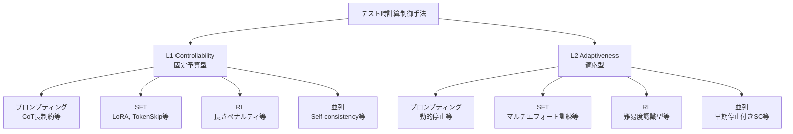

本記事は [Reasoning on a Budget: A Survey of Adaptive and Controllable Test-Time Compute in LLMs（arXiv:2507.02076）](https://arxiv.org/abs/2507.02076) の解説記事です。

## 論文概要

Alomrani et al. (2025, McGill University / Huawei Noah's Ark Lab) は、LLMの推論時計算（Test-Time Compute, TTC）がタスクの複雑度に関係なく固定量適用される非効率性を体系的に調査し、制御可能性（L1 Controllability）と適応性（L2 Adaptiveness）の2層分類法を提案するサーベイ論文を発表している。プロプライエタリモデル（Claude, OpenAI o-series）とオープンソースモデルを横断的にベンチマークし、推論計算を入力難易度に応じて動的に割り当てるための手法群を包括的に整理した。著者らは、固定予算での推論制御と適応的計算配分のトレードオフを明示し、ハイブリッドアプローチの重要性を指摘している。

この記事は [Zenn記事: Anthropic Claude API実践ガイド：最新SDKの5大機能で本番AIアプリを構築する](https://zenn.dev/0h_n0/articles/f22a4f1dda7162) の深掘りです。Zenn記事ではClaude APIのAdaptive Thinking（`thinking: {"type": "adaptive"}`）やeffortパラメータ（`output_config: {"effort": "high/low"}`）を実装レベルで解説しているが、本サーベイはこれらの機能が解決しようとしている学術的課題の全体像を提供する。

## 情報源

- **arXiv ID**: 2507.02076
- **URL**: [https://arxiv.org/abs/2507.02076](https://arxiv.org/abs/2507.02076)
- **著者**: Mohammad Ali Alomrani, Yingxue Zhang, Derek Li, Qianyi Sun, Soumyasundar Pal, Zhanguang Zhang, Yaochen Hu, Rohan Deepak Ajwani, Antonios Valkanas, Raika Karimi, Peng Cheng, Yunzhou Wang, Pengyi Liao, Hanrui Huang, Bin Wang, Jianye Hao, Mark Coates
- **所属**: McGill University, Huawei Noah's Ark Lab
- **提出日**: 2025年7月2日
- **分野**: cs.AI, cs.LG

## 関連Zenn記事

- [Anthropic Claude API実践ガイド：最新SDKの5大機能で本番AIアプリを構築する](https://zenn.dev/0h_n0/articles/f22a4f1dda7162)

## 背景と動機

### テスト時計算の非効率性

LLMの推論能力は近年大きく向上しているが、推論時の計算効率には根本的な問題が存在する。現在のLLMは、タスクの複雑度に関係なく固定量の推論時計算を適用する。著者らはこの問題を2つの側面から指摘している。

**過剰思考（Overthinking）**: 単純な問題に対して必要以上の計算リソースを消費する現象である。著者らは、o1やDeepSeek-R1が必要以上に5倍長い応答を生成するケースを報告している。Claude 3.7 Sonnetについても、指定されたthinking budgetを超過する傾向があることが観察されている。

**過少思考（Underthinking）**: 有望な解法パスを途中で放棄し、別の戦略に切り替えてしまう現象である。困難な問題に対して十分な推論ステップが割り当てられず、解に到達できないケースが該当する。

この非効率性は、推論APIのコスト増大に直結する。固定長の思考トークンを常に生成するモデルでは、簡単な問題でもトークン消費量が大きく、スケーラブルな本番環境での運用コストが膨らむ。著者らは、「適切な問題に適切な量の計算を割り当てる」適応的手法の必要性を主張している。

### 既存研究の散在

テスト時計算の効率化に関する研究は、プロンプティング、教師あり微調整（SFT）、強化学習（RL）、並列サンプリングなど多岐にわたるが、これらを横断的に比較・整理した文献は不足していた。著者らは、手法間の関係性と各手法の適用条件を明確にするために、統一的な分類法の構築を目指している。

## 主要な貢献

著者らの主要な貢献は以下の3点である。

1. **2層分類法の提案**: テスト時計算制御手法をL1 Controllability（制御可能性）とL2 Adaptiveness（適応性）の2層で分類する体系を構築した。これにより、手法の設計思想の違いを明確に区別できる。

2. **クロスモデルベンチマーク**: プロプライエタリモデル（Claude 3.7 Sonnet, OpenAI o1/o3/o4-mini等）とオープンソースモデル（DeepSeek-R1, QwQ-32B等）の推論効率を同一基準で比較し、モデル間の振る舞いの差異を定量的に示した。

3. **ギャップと将来方向の整理**: 既存手法の限界（小規模モデルでの効率制御の困難さ、マルチモーダル対応の不足等）を特定し、今後の研究方向を提示した。

## 技術的詳細

### L1 Controllability vs L2 Adaptiveness

著者らが提案する2層分類法は、テスト時計算制御手法を設計思想の根本的な違いに基づいて区分する。

**L1 Controllability（制御可能性）**: ユーザーが推論開始前に計算予算を固定する手法群である。トークン数上限、サンプリング回数、effort levelなど、推論に先立つパラメータとして予算を指定する。入力内容に依存しない一律の制約であり、実装が比較的容易で予測可能なコスト管理が可能である。

**L2 Adaptiveness（適応性）**: モデルが入力の難易度や自身の信頼度に基づいて、推論中に動的に計算量を調整する手法群である。事前の予算設定は不要で、簡単な問題には少ない計算、困難な問題には多くの計算を自動的に割り当てる。実装はL1より複雑だが、タスク横断的な効率最適化が期待できる。



### 逐次手法（単一推論パス）

逐次手法は、1つの推論パスを生成し、その中で計算量を制御する。プロンプティング、SFT、RLの3カテゴリに分類される。

#### プロンプティングベース手法

最もインフラ要件が低い手法群である。モデルの重みを変更せず、入力プロンプトの設計のみで推論長を制御する。

**CoTバリアント（長さ制約付き）**: Chain-of-Thought（CoT）プロンプティングに明示的な長さ制約を追加する手法である。「100語以内で回答せよ」のような指示をプロンプトに含める。著者らは、この手法が簡便である一方、モデルの指示追従能力に強く依存し、特にオープンソースモデルでは制約を無視する傾向があることを指摘している。

**Budget Forcing**: 特殊トークン（例: `<think>`/`</think>`）を用いてステップごとに推論予算を強制する手法である。thinking tokenの生成を外部的に打ち切ることで、推論計算量を直接制御する。著者らは、Budget Forcingが予算遵守の確実性において自然言語指示より優れるが、中間の思考を任意のステップで強制終了することで推論品質が低下するリスクがあることを報告している。

#### 教師あり微調整（SFT）ベース手法

モデルの重みを更新して、効率的な推論パターンを内在化させる手法群である。

**LoRAアダプタによるCoT長制御**: 異なる長さのCoTデータでLoRAアダプタを訓練し、推論時にアダプタを切り替えることで推論長を制御する。著者らは、この手法がモデルの基礎的な推論能力を維持しながら出力長を調整できる利点を指摘している。

**TokenSkip**: 意味的トークン重要度に基づいてCoTの一部を圧縮する手法である。各トークンの寄与度を計算し、重要度の低いトークンをスキップすることで推論の冗長性を削減する。著者らの報告では、TokenSkipは推論長を大幅に短縮しつつ、精度低下を抑制できるとされている。

**マルチエフォート推論**: 低・中・高の3段階のエフォートレベルでモデルを訓練し、推論時にレベルを指定する手法である。各レベルに対応するCoTデータで微調整を行い、推論時にユーザーが望む精度・コストのトレードオフを選択可能にする。

**連続潜在表現手法**: 離散的なトークン列の代わりに、連続的な潜在表現空間で推論を行う手法である。Coconut（Chain of Continuous Thought）が代表的で、自然言語のCoTを連続的な隠れ状態の系列に置き換える。著者らは、この手法が推論の表現力を維持しながらトークン数を削減できる可能性を指摘しつつ、現時点では限定的なタスクでしか有効性が確認されていないことを報告している。

#### 強化学習（RL）ベース手法

報酬設計を通じて推論効率を最適化する手法群である。

**長さ制約付きポリシー最適化**: GRPOやPPOなどのRL手法に、出力長に基づくペナルティ項を追加する。報酬関数は以下の形式で定義されることが多い。

$$
R = R_{\text{correctness}} - \lambda \cdot \frac{L_{\text{output}}}{L_{\text{max}}}
$$

ここで、$R_{\text{correctness}}$ は正解に対する報酬、$L_{\text{output}}$ は出力トークン数、$L_{\text{max}}$ は最大許容長、$\lambda$ は長さペナルティの重みである。著者らは、$\lambda$ の調整が精度と効率のトレードオフを決定する重要なハイパーパラメータであることを指摘している。

**難易度認識型適応**: 入力の推定難易度に応じてペナルティ重みを動的に調整する手法である。簡単な問題には強いペナルティ、困難な問題には弱いペナルティを適用する。著者らは、この手法がL2 Adaptivenessの考え方をRL報酬設計に組み込んだものであると位置づけている。

**冗長出力抑制**: 繰り返しパターンや無意味なトークン列の生成を検出し、ペナルティを与える報酬設計である。DeepSeek-R1で観察された「同じ推論ステップを何度も繰り返す」現象の抑制を目的とする。

### 並列手法（複数推論パス）

並列手法は、同一入力に対して複数の推論パスを生成し、集約によって精度を向上させる。

**Self-consistency（早期停止条件付き）**: 複数のCoTサンプルを生成し、多数決で最終回答を決定するSelf-consistencyに、早期停止条件を追加した手法である。サンプル間の一致度が十分に高くなった時点で追加サンプリングを停止する。著者らは、この手法がL1とL2の境界に位置し、サンプル数上限はL1制御、早期停止条件はL2適応に対応すると分析している。

$$
\text{Confidence}(a) = \frac{\text{count}(a)}{N_{\text{total}}}
$$

ここで、$a$ は候補回答、$N_{\text{total}}$ は現在までのサンプル数である。信頼度が閾値 $\theta$ を超えた時点で停止する。

**推論認識型訓練（Best-of-Nサンプリング考慮）**: 推論時にBest-of-Nサンプリングが行われることを前提として訓練する手法である。複数サンプルの集約を考慮したポリシー最適化により、単一サンプルの精度最大化ではなく、集合としての精度を向上させる。

### 各手法の比較

以下に各手法カテゴリの特性を比較する。

| 手法 | 計算レベル | インフラ要件 | 予算遵守 | 精度影響 | 適用場面 |
|------|-----------|-------------|---------|---------|---------|
| プロンプティング（L1） | 低 | なし | 低〜中 | 中程度の低下 | 即座に試行可能 |
| Budget Forcing | 低 | なし | 高 | 低〜中の低下 | 厳密な予算制御 |
| SFT（LoRA等） | 中 | 訓練インフラ | 高 | 低い低下 | 本番環境での安定運用 |
| TokenSkip | 中 | 訓練インフラ | 高 | 低い低下 | 推論冗長性削減 |
| RL（長さペナルティ） | 高 | 大規模訓練 | 高 | 調整可能 | 細粒度の効率制御 |
| Self-consistency | 中〜高 | 並列推論 | 中 | 向上の可能性 | 精度重視タスク |
| 連続潜在表現 | 高 | 特殊訓練 | 高 | 未確定 | 研究段階 |

## Overthinking/Underthinking問題の解析

著者らはテスト時計算の非効率性を、Overthinking（過剰思考）とUnderthinking（過少思考）の2つの現象として詳細に分析している。

### Overthinking

Overthinkingは、タスクの複雑度に対して過剰な推論ステップが生成される現象である。著者らは以下の具体的な知見を報告している。

- **o1/DeepSeek-R1**: 最適な回答に到達した後も推論を継続し、必要量の約5倍の出力を生成するケースが観察されている
- **Claude 3.7 Sonnet**: thinking budgetを指定しても超過する傾向がある。これは内部のthinking token生成がユーザー指定の予算に厳密に従わないことを示す
- **蒸留モデル**: DeepSeek-R1の蒸留モデル（7B, 14B等）は、親モデルと同等以上の長さの推論トークンを生成しつつ、精度は大幅に低下する。小規模モデルほど冗長な推論を生成する傾向がある

Overthinkingの定量的指標として、著者らはEfficiency Ratio（効率比）を導入している。

$$
\text{Efficiency Ratio} = \frac{\text{Score}}{\text{Average Output Tokens}}
$$

この指標により、同一精度を達成するために必要なトークン数をモデル間で比較できる。

### Underthinking

Underthinkingは、困難な問題に対して推論が不十分な状態で終了する現象である。具体的には以下のパターンが観察されている。

- **戦略の早期切替**: 有望な解法パスを途中で放棄し、別のアプローチに切り替える。これにより、どのパスも十分に深掘りされないまま推論が終了する
- **難易度推定の失敗**: モデルが問題の複雑度を過小評価し、浅い推論で回答を確定してしまう
- **計算予算の均等配分**: 固定予算内で複数のサブタスクに計算を均等配分するため、最も困難なサブタスクに十分な計算が割り当てられない

著者らは、OverthinkingとUnderthinkingが同一モデル内で共存する点を強調している。同じモデルが簡単な問題を過剰に考え、困難な問題を十分に考えないという非対称性は、現在のLLMが入力難易度の正確な推定に失敗していることを示唆する。

## Claude APIとの対応関係

本サーベイの分類法は、Claude APIの具体的な機能と直接的な対応関係にある。Zenn記事で解説したAdaptive ThinkingとeffortパラメータはそれぞれL1/L2に対応する。

### effort パラメータ → L1 Controllability

Claude APIの `output_config: {"effort": "high"}` や `output_config: {"effort": "low"}` は、L1 Controllabilityの典型的な実装である。

```python
# L1 Controllability: 推論開始前に計算予算を固定
response = client.messages.create(
    model="claude-sonnet-4-20250514",
    max_tokens=1024,
    thinking={"type": "enabled", "budget_tokens": 5000},
    output_config={"effort": "low"},  # 固定予算: 低コスト推論
    messages=[{"role": "user", "content": "2+2は?"}],
)
```

effortパラメータはユーザーが推論前に指定する固定予算であり、入力内容に依存しない。サーベイの分類法では、この種の事前指定型の計算制御をL1に分類している。著者らのベンチマークでは、プロプライエタリモデル（Claude含む）がeffort指定に対して比較的良好な予算遵守を示すことが報告されている。

### thinking.type="adaptive" → L2 Adaptiveness

Claude APIの `thinking: {"type": "adaptive"}` は、L2 Adaptivenessの実装に該当する。

```python
# L2 Adaptiveness: 入力難易度に応じて計算を動的割当
response = client.messages.create(
    model="claude-sonnet-4-20250514",
    max_tokens=8096,
    thinking={"type": "adaptive"},  # 適応型: モデルが計算量を自動調整
    messages=[{"role": "user", "content": complex_question}],
)
```

`type: adaptive` では、モデルが入力の難易度を推定し、思考トークンの生成量を動的に調整する。簡単な質問にはthinkingブロックを省略し、複雑な推論が必要な場合には十分な思考ステップを自動的に割り当てる。これはサーベイで整理されたL2 Adaptivenessの概念そのものである。

### Claude 4.6 から 4.7 への移行コンテキスト

Claude APIにおけるExtended Thinking（`type: enabled` + `budget_tokens`）からAdaptive Thinking（`type: adaptive`）への移行は、本サーベイの文脈で理解すると、L1からL2への進化と捉えることができる。

- **Extended Thinking（L1）**: `budget_tokens` でthinkingトークン数の上限を明示的に指定。ユーザーが予算を決定する
- **Adaptive Thinking（L2）**: モデルが入力に応じてthinkingの要否と量を自動決定。ユーザーの事前判断が不要

著者らのサーベイは、L1の予測可能性（コスト管理が容易）とL2の効率性（タスクごとの最適化）のトレードオフを指摘しており、実務ではハイブリッドアプローチ（L2をベースにL1で上限を設定）が推奨されている。Claude APIでは `type: adaptive` と `budget_tokens` の組み合わせがこのハイブリッドに該当する。

## 実装のポイント（実践者向け推奨事項）

著者らは、リソース制約と目的に応じた手法選択のガイドラインを提示している。

### リソース制約別の推奨

**最小インフラ（API利用のみ）**: プロンプティングベースの手法が最も導入障壁が低い。Self-consistencyに長さ制約を組み合わせることで、追加インフラなしで効率改善が可能である。具体的には、Claude APIのeffortパラメータやAdaptive Thinkingの活用が該当する。

**訓練インフラあり**: SFTが推奨される。簡潔な推論パターンをモデルに内在化させることで、推論時のトークン消費を安定的に削減できる。LoRAアダプタによるCoT長制御は、フル微調整に比べて低コストで実装可能である。

**大規模訓練が可能**: RLベースの手法がより細粒度の制御を提供する。長さペナルティ付きのポリシー最適化により、精度と効率のトレードオフを連続的に調整できる。ただし、報酬設計のハイパーパラメータ調整に相当な計算資源が必要である。

### ハイブリッドアプローチ: Fast-Slow Thinking

著者らが特に強調するのは、fast-slow thinkingパターンである。入力の推定難易度に基づいて推論モードを切り替える。

- **Fast mode（簡単なタスク）**: 短縮された推論パスを使用。thinking tokenを抑制または省略し、直接回答を生成する
- **Slow mode（困難なタスク）**: 全計算予算を投入し、十分な推論ステップを経て回答する

このパターンは、Claude APIの `thinking: {"type": "adaptive"}` が自動的に実現する挙動と一致する。著者らは、fast-slow thinkingをモデルレベルで実装する（SFT/RLで内在化させる）手法と、システムレベルで実装する（ルーティングモデルで切り替える）手法の両方を整理している。

### 注意すべき落とし穴

著者らは以下の失敗パターンを指摘している。

- **小規模モデルでの効率制御の困難さ**: 蒸留モデル（7B-14B規模）は長さ制約の指示に従わない傾向がある。プロンプティングベースの手法は大規模モデルでの有効性が高い
- **精度低下の非線形性**: 推論長を50%削減しても精度低下が5%未満で済むケースがある一方、ある閾値を超えると急激に精度が崩壊する。線形的なトレードオフを仮定した設計は危険である
- **ベンチマーク依存性**: 数学推論で有効な手法がコード生成では効果を示さないケースがある。タスク特性に応じた手法選択が必要である

## プロプライエタリ vs オープンソースの比較

著者らは、プロプライエタリモデルとオープンソースモデルの推論効率を比較し、顕著な差異を報告している。

### プロプライエタリモデル（Claude, OpenAI o-series）

- **予算遵守**: effortパラメータやthinking budgetに対して比較的良好な遵守を示す。ただしClaude 3.7 Sonnetは指定budgetを超過する傾向がある
- **推論性能**: 推論特化の訓練が施されており、同一計算予算での精度が高い
- **組み込み制御機構**: thinking budgetやeffortパラメータが内蔵されており、追加の実装なしでL1/L2制御が利用可能
- **制約**: 内部実装が非公開であり、制御メカニズムの詳細な分析が困難

### オープンソースモデル/小規模モデル

- **蒸留モデルの冗長性**: DeepSeek-R1の蒸留モデルは、全モデル中で最も長い出力を生成しつつ、精度は親モデルを大幅に下回る。著者らはこれを「計算効率の逆転現象」と指摘している
- **指示追従の困難**: 長さ制約や効率制約のプロンプト指示に対する追従が不十分であり、プロンプティングベースの手法の有効性が限定される
- **カスタマイズ可能性**: SFT/RLによるカスタム訓練が可能であり、特定タスクに特化した効率最適化を実現できる

| 観点 | プロプライエタリ | オープンソース |
|------|----------------|-------------|
| 予算遵守 | 良好 | 不十分 |
| 推論精度 | 高い | モデル依存 |
| 制御機構 | 内蔵（API） | 要カスタム実装 |
| カスタマイズ | 制限あり | SFT/RL可能 |
| 透明性 | 低い | 高い |
| 効率比 | 高い | 低い（蒸留モデル） |

## 関連研究

本サーベイが整理する手法群に関連する主要な研究を以下に挙げる。

- **Scaling LLM Test-Time Compute Optimally** (Snell et al., 2024): テスト時計算のスケーリング則を分析し、推論計算の増大が必ずしも精度向上に寄与しないケースを示した。本サーベイの「タスク難易度に応じた適応的配分」の議論の出発点となる研究である。

- **Chain-of-Thought Prompting Elicits Reasoning in Large Language Models** (Wei et al., 2022): CoTプロンプティングの原論文。本サーベイでは、CoTの長さ制御バリアントが逐次手法の基盤として位置づけられている。著者らは、CoTの成功が推論時計算の増大による精度向上を実証した一方、効率性の観点が欠けていたことを指摘している。

- **Self-Consistency Improves Chain of Thought Reasoning in Language Models** (Wang et al., 2023): Self-consistencyの提案論文。並列手法の代表として本サーベイで詳細に分析されており、早期停止条件の追加によるL2適応化が議論されている。

- **DeepSeek-R1: Incentivizing Reasoning Capability in LLMs via Reinforcement Learning** (DeepSeek-AI, 2025): RLによる推論能力の強化と、その副作用としてのOverthinking現象を示した研究。本サーベイではOverthinking問題の具体例として頻繁に参照されている。

## まとめと今後の展望

### 本サーベイの意義

Alomrani et al. は、テスト時計算制御の手法群をL1 Controllability（固定予算型）とL2 Adaptiveness（適応型）の2層で体系化し、プロンプティング・SFT・RL・並列手法を横断的に比較した。この分類法は、Claude APIのeffortパラメータ（L1）とAdaptive Thinking（L2）の設計思想を学術的に位置づけるものでもある。

### 著者らが指摘するギャップ

- **小規模モデルの効率制御**: 蒸留モデルでの長さ制約追従は未解決であり、SFT/RLによる内在化が必要だが、訓練コストとの兼ね合いが課題として残る
- **マルチモーダル対応**: 現在の手法の大部分はテキスト推論に特化しており、視覚入力やコード生成タスクへの汎用化は未検証である
- **理論的基盤の不足**: 「なぜ特定の手法が特定のタスクで有効か」の理論的説明が欠けており、経験的な知見に依存している
- **統一評価基準**: 手法間の公正な比較を可能にする標準ベンチマークと評価指標が未整備である

### 将来方向

著者らは以下の研究方向を提示している。

1. **難易度推定の精度向上**: L2 Adaptivenessの有効性は入力難易度の正確な推定に依存する。より精度の高い難易度分類器の開発が、適応的手法全体の性能向上に直結する
2. **ハイブリッドアーキテクチャ**: L1とL2を組み合わせ、ユーザー指定の予算上限内でモデルが適応的に計算を配分するアーキテクチャの標準化
3. **自己改善型推論**: モデルが過去の推論経験から効率パターンを学習し、オンラインで推論効率を改善する仕組みの構築

## 参考文献

- Alomrani, M. A., Zhang, Y., Li, D., Sun, Q., Pal, S., Zhang, Z., Hu, Y., Ajwani, R. D., Valkanas, A., Karimi, R., Cheng, P., Wang, Y., Liao, P., Huang, H., Wang, B., Hao, J., & Coates, M. (2025). Reasoning on a Budget: A Survey of Adaptive and Controllable Test-Time Compute in LLMs. arXiv:2507.02076.
- Snell, C., Lee, J., Xu, K., & Kumar, A. (2024). Scaling LLM Test-Time Compute Optimally Can be More Effective than Scaling Model Parameters. arXiv:2408.03314.
- Wei, J., Wang, X., Schuurmans, D., Bosma, M., Ichter, B., Xia, F., Chi, E. H., Le, Q. V., & Zhou, D. (2022). Chain-of-Thought Prompting Elicits Reasoning in Large Language Models. NeurIPS 2022.
- Wang, X., Wei, J., Schuurmans, D., Le, Q., Chi, E., Narang, S., Chowdhery, A., & Zhou, D. (2023). Self-Consistency Improves Chain of Thought Reasoning in Language Models. ICLR 2023.
- DeepSeek-AI. (2025). DeepSeek-R1: Incentivizing Reasoning Capability in LLMs via Reinforcement Learning. arXiv:2501.12948.
