本記事は [Don't Break the Cache: An Evaluation of Prompt Caching for Long-Horizon Agentic Tasks](https://arxiv.org/abs/2601.06007) の解説記事です。

## 論文概要

Lumer et al. (2026) は、OpenAI・Anthropic・GoogleのLLMプロバイダにおけるプロンプトキャッシュの有効性を体系的に評価した研究を報告している。DeepResearch Benchを用いた500以上のエージェントセッションで、No Cache（ベースライン）、Full Context Caching、System Prompt Only Caching、Exclude Tool Resultsの4条件を比較した結果、プロンプトキャッシュはAPIコストを41-80%削減し、TTFT（Time To First Token）を13-31%改善することが確認されたと述べている。特に、プロバイダの自動キャッシュに依存する素朴なFull Context Cachingよりも、キャッシュ境界を戦略的に制御するアプローチが優れた結果を示したことが主要な知見である（論文Table 2, Table 3）。

この記事は [Zenn記事: Anthropic Claude API実践ガイド：最新SDKの5大機能で本番AIアプリを構築する](https://zenn.dev/0h_n0/articles/f22a4f1dda7162) の深掘りです。Zenn記事ではAnthropic Python SDKの`cache_control`パラメータによるPrompt Caching実装パターンを解説しているが、本論文はそのキャッシュ戦略の選択が実際のコストとレイテンシにどの程度影響するかを定量的に裏付ける研究であり、実装時の設計判断に直接活用できる。

## 情報源

- **arXiv ID**: 2601.06007
- **URL**: [https://arxiv.org/abs/2601.06007](https://arxiv.org/abs/2601.06007)
- **著者**: Elias Lumer, Faheem Nizar, Akshaya Jangiti, Kevin Frank, Anmol Gulati, Mandar Phadate, Vamse Kumar Subbiah
- **発表日**: 2026年1月9日（改訂 1月31日）
- **分野**: cs.CL

## 背景と動機

LLMベースのエージェントは、反復的なツール呼び出しとコンテキストの動的な成長を伴うため、推論コストが急速に増大する。長期タスクでは数万トークン規模のプロンプトが生成されるが、その大部分は前回の推論呼び出しと共通のプレフィックスである。プロンプトキャッシュはこの冗長性を利用し、共通プレフィックスのKVキャッシュを再利用することでコスト削減とレイテンシ改善を実現する技術である。

しかし、主要プロバイダ（OpenAI、Anthropic、Google）はそれぞれ異なるキャッシュ実装を持ち、最小キャッシュ閾値（1,024トークンまたは4,096トークン）、TTL（5分から最大24時間）、価格体系が異なる。さらに、エージェントのワークロードではツール結果やユーザー入力が動的にコンテキストに挿入されるため、キャッシュプレフィックスが頻繁に無効化されるリスクがある。著者らは、こうしたプロバイダ間差異とエージェント特有の動的コンテキストがキャッシュ効果にどう影響するかを体系的に評価する必要性を指摘している。

## 主要な貢献

著者らは以下の点を主要な貢献として報告している。

- **プロバイダ横断の体系的評価**: OpenAI（GPT-5.2, GPT-4o）、Anthropic（Claude Sonnet 4.5）、Google（Gemini 2.5 Pro）の4モデルで3つのキャッシュ戦略を同一条件で比較した初めての研究
- **DeepResearch Benchの活用**: 100個のPhDレベル研究タスク（22分野）を用いた大規模評価。40独立セッション/条件、合計500以上のセッションでの統計的に信頼性のある評価
- **キャッシュ戦略の分類と最適化指針**: No Cache、Full Context Caching、System Prompt Only Caching、Exclude Tool Resultsの4戦略を定義し、ワークロード特性に応じた選択指針を提示
- **コストとレイテンシの定量的分析**: APIコスト41-80%削減、TTFT 13-31%改善という具体的な数値を報告し、プロンプトサイズとの線形スケーリング関係を明らかにした

## 技術的詳細

### キャッシュ戦略の設計

著者らが定義した4つのキャッシュ戦略は、UUIDを挿入する位置によってキャッシュ境界を制御する設計となっている。UUIDはリクエストごとに一意な文字列であり、プロンプトのプレフィックスを意図的に変化させてキャッシュヒットを防止する役割を果たす。

```mermaid
graph TD
    subgraph "No Cache"
        A1["UUID + System Prompt"] --> A2[Tool Definitions]
        A2 --> A3[Conversation History]
        A3 --> A4[Tool Results]
    end

    subgraph "Full Context"
        B1[System Prompt] --> B2[Tool Definitions]
        B2 --> B3[Conversation History]
        B3 --> B4[Tool Results]
    end

    subgraph "System Prompt Only"
        C1[System Prompt] --> C2["UUID + Tool Definitions"]
        C2 --> C3[Conversation History]
        C3 --> C4[Tool Results]
    end

    subgraph "Exclude Tool Results"
        D1[System Prompt] --> D2[Tool Definitions]
        D2 --> D3["UUID1 + Conversation"]
        D3 --> D4["UUID2 + Tool Results"]
    end
```



1. **No Cache（ベースライン）**: システムプロンプトの先頭にUUIDを付加し、キャッシュを強制無効化する。全てのリクエストが完全な推論コストを要する
2. **Full Context Caching**: UUIDを付加せず、プロバイダの自動キャッシュ機構に完全に依存する。動的なツール結果もキャッシュ対象に含まれる
3. **System Prompt Only Caching**: システムプロンプトの直後にUUIDを挿入し、安定したシステムプロンプト部分のみをキャッシュ対象とする。ツール定義や会話履歴はキャッシュから除外される
4. **Exclude Tool Results**: 二重UUID方式。ツール定義と会話履歴の間、および会話履歴とツール結果の間にそれぞれUUIDを挿入し、変動しやすいツール結果をキャッシュから明示的に除外する

### プロバイダ間のキャッシュ仕様差異

著者らが報告しているプロバイダごとのキャッシュ仕様差異は実装上の重要な制約となる（論文Section 2）。

| プロバイダ | 最小キャッシュ閾値 | TTL | 価格割引 | 備考 |
|-----------|-----------------|-----|---------|------|
| OpenAI | 1,024 tokens | セッション内 | 入力50%割引 | 自動キャッシュ |
| Anthropic | 1,024 tokens | 5分（最終使用から） | 入力90%割引、書き込み25%追加 | `cache_control`で明示指定 |
| Google | 4,096 tokens | 最大24時間 | 入力75%割引 | Context Caching API |

Anthropicのキャッシュはキャッシュ書き込み時に25%の追加コストが発生するが、キャッシュヒット時には90%の大幅割引が適用される。この非対称な価格体系は、キャッシュヒット率が高い場合に最もコスト効率が良くなる構造である。一方、Googleの最小閾値4,096トークンは他プロバイダの4倍であり、短いシステムプロンプトではキャッシュの恩恵を受けにくい。

### DeepResearch Bench

評価に使用されたDeepResearch Benchは、100個のPhDレベル研究タスクを含むベンチマークである。22の学術分野にまたがり、各タスクは反復的なWeb検索と情報合成を要する。エージェントはツール呼び出しを通じて段階的に情報を収集し、コンテキストウィンドウが動的に成長する。各条件について40の独立セッションを実行し、合計500以上のセッションで統計的に信頼性のある評価を行ったと報告されている。

## 実装のポイント

### Anthropic Python SDKでの`cache_control`実装

Zenn記事で解説されているAnthropic Python SDKの`cache_control`パラメータは、本論文のSystem Prompt Only Caching戦略を直接実装する手段である。以下に論文の知見を反映した実装パターンを示す。

```python
import anthropic


def create_cached_request(
    system_prompt: str,
    messages: list[dict],
    model: str = "claude-sonnet-4-20250514",
) -> anthropic.types.Message:
    """キャッシュ最適化されたリクエストを送信する

    論文のSystem Prompt Only戦略に基づき、安定した
    システムプロンプトにcache_controlを設定する。

    Args:
        system_prompt: 安定したシステムプロンプト（動的値を含まない）
        messages: 会話履歴
        model: 使用モデルID

    Returns:
        APIレスポンス
    """
    client = anthropic.Anthropic()

    return client.messages.create(
        model=model,
        max_tokens=4096,
        system=[
            {
                "type": "text",
                "text": system_prompt,
                "cache_control": {"type": "ephemeral"},
            }
        ],
        messages=messages,
    )
```

### キャッシュ効率を最大化するための設計原則

論文の知見に基づくと、以下の設計原則がキャッシュ効率に直結する。

1. **システムプロンプトの安定化**: タイムスタンプ、セッションID等の動的値はシステムプロンプトの末尾に配置し、安定した指示文をプレフィックスとして固定する。動的値がプレフィックスに含まれるとキャッシュが無効化される
2. **ツール定義の固定化**: MCP（Model Context Protocol）の動的ツール発見はキャッシュ無効化のリスクがある。ツール定義を静的に固定し、プロンプトの安定部分に含めることが推奨される
3. **ツール結果のキャッシュ除外**: 動的に変化するツール結果をキャッシュ対象に含めると、キャッシュヒット率が低下しオーバーヘッドが増大する。Exclude Tool Results戦略が特にGPT-5.2で最高の削減率を示している
4. **最小閾値の考慮**: Anthropic/OpenAIの1,024トークン、Googleの4,096トークンという最小閾値未満のプロンプトではキャッシュが適用されない

## Production Deployment Guide

### AWS実装パターン

プロンプトキャッシュ最適化を前提としたLLMエージェントの推論基盤として、トラフィック量別に3つの構成を提案する。本論文の知見を活用し、キャッシュヒット率の監視とコスト最適化を組み込んだ設計とする。

**コスト試算の注意事項**: 以下は2026年8月時点のAWS ap-northeast-1（東京）リージョン料金に基づく概算値である。実際のコストはトラフィックパターン、リージョン、バースト使用量により変動する。最新料金はAWS料金計算ツールで確認を推奨する。

| 構成 | トラフィック | 主要サービス | 月額概算 |
|------|-------------|-------------|---------|
| Small | ~100 req/日 | Lambda + Bedrock + DynamoDB | $60-120 |
| Medium | ~1,000 req/日 | ECS Fargate + Bedrock + ElastiCache | $350-700 |
| Large | 10,000+ req/日 | EKS + Karpenter + Spot + Bedrock Batch | $2,000-4,500 |

**Small構成の内訳**: Lambda（$5-10）+ Bedrock推論（$30-70、Prompt Caching有効で41-80%削減）+ DynamoDB On-Demand（$5-15）+ CloudWatch（$5-10）+ S3ログ保存（$2-5）

**Large構成の内訳**: EKSコントロールプレーン（$73）+ EC2 Spot Instances（$600-1,200、On-Demandの60-90%削減）+ Bedrock Batch API（$800-2,000、リアルタイムの50%削減）+ ElastiCache（$150-300）+ ALB（$50-100）+ CloudWatch/X-Ray（$30-80）

### Terraformインフラコード

**Small構成（Serverless）: Lambda + Bedrock + DynamoDB**

```hcl
# --- Small構成: プロンプトキャッシュ最適化エージェント ---
# Lambda + Bedrock + DynamoDB (月額 $60-120)

terraform {
  required_version = ">= 1.9"
  required_providers {
    aws = { source = "hashicorp/aws", version = "~> 5.60" }
  }
}

provider "aws" { region = "ap-northeast-1" }

# --- IAMロール（最小権限） ---
resource "aws_iam_role" "agent_lambda" {
  name = "cache-optimized-agent-lambda"
  assume_role_policy = jsonencode({
    Version = "2012-10-17"
    Statement = [{
      Action = "sts:AssumeRole"
      Effect = "Allow"
      Principal = { Service = "lambda.amazonaws.com" }
    }]
  })
}

resource "aws_iam_role_policy" "agent_lambda" {
  name = "cache-optimized-agent-policy"
  role = aws_iam_role.agent_lambda.id
  policy = jsonencode({
    Version = "2012-10-17"
    Statement = [
      {
        # Bedrock推論のみ許可
        Effect   = "Allow"
        Action   = ["bedrock:InvokeModel", "bedrock:InvokeModelWithResponseStream"]
        Resource = "arn:aws:bedrock:ap-northeast-1::foundation-model/*"
      },
      {
        # DynamoDB: キャッシュメトリクス・セッション状態の読み書き
        Effect   = "Allow"
        Action   = ["dynamodb:GetItem", "dynamodb:PutItem", "dynamodb:UpdateItem", "dynamodb:Query"]
        Resource = [
          aws_dynamodb_table.session_state.arn,
          aws_dynamodb_table.cache_metrics.arn
        ]
      },
      {
        # CloudWatch Logs
        Effect   = "Allow"
        Action   = ["logs:CreateLogGroup", "logs:CreateLogStream", "logs:PutLogEvents"]
        Resource = "arn:aws:logs:ap-northeast-1:*:*"
      },
      {
        # X-Ray トレーシング
        Effect   = "Allow"
        Action   = ["xray:PutTraceSegments", "xray:PutTelemetryRecords"]
        Resource = "*"
      },
      {
        # カスタムメトリクス発行
        Effect   = "Allow"
        Action   = ["cloudwatch:PutMetricData"]
        Resource = "*"
      }
    ]
  })
}

# --- DynamoDB: セッション状態管理（On-Demand） ---
resource "aws_dynamodb_table" "session_state" {
  name         = "cache-agent-sessions"
  billing_mode = "PAY_PER_REQUEST"
  hash_key     = "session_id"
  range_key    = "turn_id"

  attribute {
    name = "session_id"
    type = "S"
  }
  attribute {
    name = "turn_id"
    type = "N"
  }

  server_side_encryption { enabled = true }

  ttl {
    attribute_name = "expires_at"
    enabled        = true
  }
}

# --- DynamoDB: キャッシュメトリクス記録 ---
resource "aws_dynamodb_table" "cache_metrics" {
  name         = "cache-agent-metrics"
  billing_mode = "PAY_PER_REQUEST"
  hash_key     = "metric_date"
  range_key    = "request_id"

  attribute {
    name = "metric_date"
    type = "S"
  }
  attribute {
    name = "request_id"
    type = "S"
  }

  server_side_encryption { enabled = true }

  ttl {
    attribute_name = "expires_at"
    enabled        = true
  }
}

# --- Lambda関数 ---
resource "aws_lambda_function" "agent" {
  function_name = "cache-optimized-agent"
  role          = aws_iam_role.agent_lambda.arn
  runtime       = "python3.12"
  handler       = "handler.lambda_handler"
  filename      = "lambda.zip"
  timeout       = 900
  memory_size   = 1024

  tracing_config { mode = "Active" }

  environment {
    variables = {
      SYSTEM_PROMPT_CACHE   = "true"
      EXCLUDE_TOOL_RESULTS  = "true"
      CACHE_METRICS_TABLE   = aws_dynamodb_table.cache_metrics.name
      SESSION_TABLE         = aws_dynamodb_table.session_state.name
    }
  }
}

# --- CloudWatchアラーム: キャッシュヒット率低下検知 ---
resource "aws_cloudwatch_metric_alarm" "cache_hit_rate_low" {
  alarm_name          = "cache-agent-hit-rate-low"
  comparison_operator = "LessThanThreshold"
  evaluation_periods  = 3
  metric_name         = "CacheHitRate"
  namespace           = "CacheOptimizedAgent"
  period              = 3600
  statistic           = "Average"
  threshold           = 0.5
  alarm_actions       = []

  dimensions = {
    FunctionName = aws_lambda_function.agent.function_name
  }
}

# --- CloudWatchアラーム: Lambda実行時間異常 ---
resource "aws_cloudwatch_metric_alarm" "lambda_duration" {
  alarm_name          = "cache-agent-duration-high"
  comparison_operator = "GreaterThanThreshold"
  evaluation_periods  = 3
  metric_name         = "Duration"
  namespace           = "AWS/Lambda"
  period              = 300
  statistic           = "p95"
  threshold           = 600000
  alarm_actions       = []

  dimensions = {
    FunctionName = aws_lambda_function.agent.function_name
  }
}
```

**Large構成（Container）: EKS + Karpenter + Spot Instances**

```hcl
# --- Large構成: プロンプトキャッシュ最適化クラスタ ---
# EKS + Karpenter + Spot (月額 $2,000-4,500)

module "eks" {
  source  = "terraform-aws-modules/eks/aws"
  version = "~> 20.24"

  cluster_name    = "cache-agent-cluster"
  cluster_version = "1.31"

  cluster_endpoint_public_access  = true
  cluster_endpoint_private_access = true

  vpc_id     = module.vpc.vpc_id
  subnet_ids = module.vpc.private_subnets

  enable_cluster_creator_admin_permissions = true
}

# --- Karpenter Provisioner: Spot優先 ---
resource "kubectl_manifest" "karpenter_nodepool" {
  yaml_body = yamlencode({
    apiVersion = "karpenter.sh/v1"
    kind       = "NodePool"
    metadata   = { name = "cache-agent" }
    spec = {
      template = {
        spec = {
          requirements = [
            { key = "karpenter.sh/capacity-type", operator = "In", values = ["spot", "on-demand"] },
            { key = "node.kubernetes.io/instance-type", operator = "In",
              values = ["m7i.xlarge", "m7i.2xlarge", "m6i.xlarge", "m6i.2xlarge", "c7i.xlarge", "c7i.2xlarge"] },
          ]
          nodeClassRef = { group = "karpenter.k8s.aws", kind = "EC2NodeClass", name = "default" }
        }
      }
      limits   = { cpu = "128", memory = "512Gi" }
      disruption = {
        consolidationPolicy = "WhenEmptyOrUnderutilized"
        consolidateAfter    = "60s"
      }
    }
  })
}

# --- ElastiCache: プロンプトプレフィックス・ハッシュの事前計算キャッシュ ---
resource "aws_elasticache_replication_group" "prompt_prefix" {
  replication_group_id = "cache-agent-prefix"
  description          = "Prompt prefix hash cache for cache-hit optimization"
  engine               = "redis"
  engine_version       = "7.1"
  node_type            = "cache.r7g.large"
  num_cache_clusters   = 2
  at_rest_encryption_enabled = true
  transit_encryption_enabled = true
}

# --- AWS Budgets: 予算アラート ---
resource "aws_budgets_budget" "monthly" {
  name         = "cache-agent-monthly"
  budget_type  = "COST"
  limit_amount = "4500"
  limit_unit   = "USD"
  time_unit    = "MONTHLY"

  notification {
    comparison_operator       = "GREATER_THAN"
    threshold                 = 80
    threshold_type            = "PERCENTAGE"
    notification_type         = "ACTUAL"
    subscriber_email_addresses = ["ops-team@example.com"]
  }

  notification {
    comparison_operator       = "GREATER_THAN"
    threshold                 = 100
    threshold_type            = "PERCENTAGE"
    notification_type         = "FORECASTED"
    subscriber_email_addresses = ["ops-team@example.com"]
  }
}
```

### 監視設定

**CloudWatch Logs Insights クエリ**: キャッシュヒット率とコスト削減効果を監視する。

```
# 1時間あたりのキャッシュヒット率とコスト削減量
fields @timestamp, @message
| filter @message like /cache_metric/
| stats count(*) as total_requests,
        sum(cache_hit) as cache_hits,
        avg(cache_hit) * 100 as hit_rate_pct,
        sum(cached_tokens) as total_cached_tokens,
        sum(cost_savings_usd) as total_savings
  by bin(1h)
| sort @timestamp desc
```

```
# プロバイダ別TTFT分析
fields @timestamp, provider, ttft_ms, cache_strategy
| filter event = "llm_inference"
| stats percentile(ttft_ms, 50) as p50_ttft,
        percentile(ttft_ms, 95) as p95_ttft,
        percentile(ttft_ms, 99) as p99_ttft,
        avg(ttft_ms) as avg_ttft
  by provider, cache_strategy, bin(1h)
```

**キャッシュメトリクス収集（Python）**:

```python
from dataclasses import dataclass
from datetime import datetime, timezone

import boto3


@dataclass
class CacheMetric:
    """プロンプトキャッシュのメトリクス

    Attributes:
        request_id: リクエスト識別子
        provider: LLMプロバイダ名
        cache_hit: キャッシュヒットしたか
        cached_tokens: キャッシュされたトークン数
        total_input_tokens: 総入力トークン数
        ttft_ms: Time To First Token（ミリ秒）
        cost_savings_usd: コスト削減額（USD）
    """
    request_id: str
    provider: str
    cache_hit: bool
    cached_tokens: int
    total_input_tokens: int
    ttft_ms: float
    cost_savings_usd: float


def record_cache_metric(
    metric: CacheMetric,
    table_name: str = "cache-agent-metrics",
) -> None:
    """キャッシュメトリクスをDynamoDBに記録する

    Args:
        metric: 記録するメトリクス
        table_name: DynamoDBテーブル名
    """
    dynamodb = boto3.resource("dynamodb", region_name="ap-northeast-1")
    table = dynamodb.Table(table_name)

    now = datetime.now(tz=timezone.utc)
    table.put_item(Item={
        "metric_date": now.strftime("%Y-%m-%d"),
        "request_id": metric.request_id,
        "provider": metric.provider,
        "cache_hit": metric.cache_hit,
        "cached_tokens": metric.cached_tokens,
        "total_input_tokens": metric.total_input_tokens,
        "cache_hit_ratio": round(
            metric.cached_tokens / max(metric.total_input_tokens, 1), 4
        ),
        "ttft_ms": int(metric.ttft_ms),
        "cost_savings_usd": str(round(metric.cost_savings_usd, 6)),
        "timestamp": now.isoformat(),
        "expires_at": int(now.timestamp()) + 90 * 86400,
    })


def publish_cache_cloudwatch_metrics(
    metrics: list[CacheMetric],
    namespace: str = "CacheOptimizedAgent",
) -> None:
    """キャッシュメトリクスをCloudWatchカスタムメトリクスに発行する

    Args:
        metrics: 発行するメトリクスのリスト
        namespace: CloudWatch名前空間
    """
    cw = boto3.client("cloudwatch", region_name="ap-northeast-1")

    metric_data = []
    for m in metrics:
        metric_data.extend([
            {
                "MetricName": "CacheHitRate",
                "Value": 1.0 if m.cache_hit else 0.0,
                "Unit": "None",
                "Dimensions": [
                    {"Name": "Provider", "Value": m.provider},
                ],
            },
            {
                "MetricName": "CachedTokens",
                "Value": m.cached_tokens,
                "Unit": "Count",
                "Dimensions": [
                    {"Name": "Provider", "Value": m.provider},
                ],
            },
            {
                "MetricName": "CostSavingsUSD",
                "Value": m.cost_savings_usd,
                "Unit": "None",
                "Dimensions": [
                    {"Name": "Provider", "Value": m.provider},
                ],
            },
        ])

    # CloudWatch APIの上限: 1回あたり1000メトリクス
    for i in range(0, len(metric_data), 1000):
        cw.put_metric_data(
            Namespace=namespace,
            MetricData=metric_data[i:i + 1000],
        )
```

**X-Ray トレーシング設定（Python）**:

```python
from aws_xray_sdk.core import xray_recorder, patch_all


def setup_xray_tracing() -> None:
    """X-Rayトレーシングを初期化する

    boto3呼び出しを自動計装し、Bedrock推論と
    キャッシュヒットのレイテンシを可視化する。
    """
    xray_recorder.configure(service="cache-optimized-agent")
    patch_all()


@xray_recorder.capture("cached_inference")
def trace_cached_inference(
    session_id: str,
    cache_hit: bool,
    cached_tokens: int,
    ttft_ms: float,
) -> None:
    """キャッシュ付き推論イベントをX-Rayに記録する

    Args:
        session_id: セッション識別子
        cache_hit: キャッシュヒットしたか
        cached_tokens: キャッシュされたトークン数
        ttft_ms: Time To First Token（ミリ秒）
    """
    subsegment = xray_recorder.current_subsegment()
    if subsegment:
        subsegment.put_annotation("session_id", session_id)
        subsegment.put_annotation("cache_hit", cache_hit)
        subsegment.put_metadata("cached_tokens", cached_tokens)
        subsegment.put_metadata("ttft_ms", ttft_ms)
```

### コスト最適化チェックリスト

**キャッシュ戦略選択**:
- [ ] プロバイダごとの最小キャッシュ閾値を確認（OpenAI/Anthropic: 1,024 tokens、Google: 4,096 tokens）
- [ ] システムプロンプトがキャッシュ閾値を超えていることを検証
- [ ] システムプロンプトから動的値（タイムスタンプ、UUID等）を分離し末尾に配置
- [ ] ツール定義を静的に固定（MCP動的発見のキャッシュ無効化リスクを排除）
- [ ] Exclude Tool Results戦略の適用可否を評価（GPT-5.2で最大79.6%削減）

**プロンプト設計**:
- [ ] 安定したシステムプロンプトをプレフィックスに固定
- [ ] Few-shot examplesをシステムプロンプトに含める（キャッシュ対象に含めるため）
- [ ] 動的値（セッションID、タイムスタンプ）はメッセージ末尾に配置
- [ ] ツール結果はキャッシュ境界の外側に配置

**Anthropic SDK固有**:
- [ ] `cache_control: {"type": "ephemeral"}`をシステムプロンプトに設定
- [ ] APIレスポンスの`usage.cache_creation_input_tokens`と`usage.cache_read_input_tokens`を監視
- [ ] キャッシュTTL（5分）を考慮したリクエスト間隔の設計
- [ ] キャッシュ書き込みコスト（25%追加）とヒット時割引（90%）のトレードオフ計算

**コスト監視**:
- [ ] AWS Budgets: 月額上限アラート（80%/100%しきい値）
- [ ] CloudWatchアラーム: キャッシュヒット率低下（50%未満でアラート）
- [ ] CloudWatchアラーム: トークン使用量スパイク検知
- [ ] Cost Anomaly Detection有効化
- [ ] 日次コストレポート自動送信（Cost Explorer API + SNS）

**レイテンシ監視**:
- [ ] TTFT（Time To First Token）のP95/P99モニタリング
- [ ] キャッシュヒット/ミス別のTTFT比較ダッシュボード
- [ ] Full Context Cachingのレイテンシ悪化検知（GPT-4oで-8.8%悪化の報告あり）

**セキュリティ**:
- [ ] IAMロール: 最小権限（Bedrock InvokeModel、DynamoDB CRUD、CloudWatch Logs）
- [ ] ネットワーク: VPCエンドポイント経由でBedrock/DynamoDB/S3にアクセス
- [ ] シークレット管理: APIキーはSecrets Managerに格納
- [ ] 暗号化: DynamoDB、S3、EBSは全てAWS KMSで暗号化
- [ ] プロンプトログ: PII/機密情報のマスキング処理を実装

## 実験結果

### プロバイダ別コスト削減

著者らが報告しているプロバイダ別のコスト削減結果を以下に示す（論文Table 2）。各セルの値はNo Cacheベースラインからの削減率（%）である。

| モデル | Full Context | System Prompt Only | Exclude Tool Results | 最良戦略 |
|--------|------------|-------------------|---------------------|---------|
| GPT-5.2 | 74.2% | 76.8% | **79.6%** | Exclude Tool Results |
| Claude Sonnet 4.5 | 75.1% | **78.5%** | 77.2% | System Prompt Only |
| Gemini 2.5 Pro | 38.9% | **41.4%** | 40.1% | System Prompt Only |
| GPT-4o | 42.3% | **45.9%** | 44.7% | System Prompt Only |

GPT-5.2ではExclude Tool Results戦略が最高の削減率を示す一方、他のモデルではSystem Prompt Only戦略が最適という結果が報告されている。Gemini 2.5 Proの削減率が相対的に低い要因として、最小キャッシュ閾値が4,096トークンと高いことが著者らにより指摘されている。

### プロバイダ別TTFT改善

TTFT（Time To First Token）の改善率は以下の通りである（論文Table 3）。

| モデル | Full Context | System Prompt Only | Exclude Tool Results |
|--------|------------|-------------------|---------------------|
| GPT-5.2 | 11.2% | **13.0%** | 12.5% |
| Claude Sonnet 4.5 | 20.3% | **22.9%** | 21.7% |
| Gemini 2.5 Pro | 5.4% | **6.1%** | 5.8% |
| GPT-4o | **30.9%** | 28.4% | 27.1% |

GPT-4oのFull Context CachingではTTFTが-8.8%悪化するケースも報告されており、動的コンテキストのキャッシュ処理がオーバーヘッドを生む可能性が示唆されている。

### コスト削減のスケーリング特性

著者らは、プロンプトサイズとコスト削減率の関係が概ね線形であることを報告している（論文Figure 3）。500トークンのプロンプトで10-45%の削減、50,000トークンのプロンプトで54-89%の削減が観測されており、長いプロンプトほどキャッシュの恩恵が大きい。これはエージェントタスクのように反復的にプロンプトが成長するワークロードにおいて、キャッシュ最適化の重要性が増すことを意味する。

### 制約と限界

- 評価はDeepResearch Benchの100タスクに限定されており、他のエージェントベンチマーク（SWE-bench等）での汎化性は未検証である
- プロバイダのキャッシュ実装は非公開であり、内部的な最適化がプロバイダ間の差異に影響している可能性がある
- TTLの影響はセッション内での評価に限定されており、セッション間でのキャッシュ再利用パターンは分析対象外である
- 2026年1月時点の評価であり、プロバイダのキャッシュ仕様が変更される可能性がある

## 実運用への応用

本論文の知見は、LLM APIを利用するエージェントシステムのコスト最適化に直接応用可能である。

**エージェントフレームワークへの統合**: LangChain、LlamaIndex、CrewAI等のエージェントフレームワークでは、システムプロンプトの構造がキャッシュ効率に直結する。フレームワークが動的にツール定義を挿入する場合、その挿入位置がキャッシュ境界を跨がないよう注意が必要である。Zenn記事で解説されている`cache_control`パラメータの設定を、フレームワークのミドルウェア層で一元管理する設計が推奨される。

**マルチプロバイダ構成での最適化**: 著者らの結果は、最適なキャッシュ戦略がプロバイダごとに異なることを示している。マルチプロバイダ構成（フォールバックやコスト最適化目的）を採用する場合、プロバイダごとにキャッシュ戦略を切り替えるルーティング層が必要となる。

**コスト予測とバジェット管理**: プロンプトサイズとコスト削減率の線形関係は、エージェントタスクのコスト予測に活用できる。タスク開始前にプロンプトの予測サイズからキャッシュによる削減額を見積もり、バジェット管理に組み込むことが可能である。

## 関連研究

- **KV Cache Compression (Ge et al., 2024)**: 推論時のKVキャッシュをモデル内部で圧縮する手法。本論文のAPIレベルのプロンプトキャッシュとは異なり、モデルの推論エンジン内部での最適化である
- **Prompt Compression (Jiang et al., 2023)**: プロンプトを短縮してトークン数を削減する手法（LLMLingua等）。キャッシュとは異なり情報の損失を伴うが、キャッシュと組み合わせることで更なるコスト削減が期待される
- **Context Caching API (Google, 2024)**: Google Geminiで提供されるContext Caching APIの公式実装。本論文はこのAPIの実効性を第三者の立場から評価している
- **CompactionRL (Li et al., 2026)**: コンテキスト圧縮をRLで最適化する手法。本論文のキャッシュベースのコスト削減とは相補的であり、圧縮後の安定したプレフィックスをキャッシュ対象にすることで両技術の統合が可能である

## まとめと今後の展望

Lumer et al. (2026) は、プロンプトキャッシュの効果をプロバイダ横断で体系的に評価し、キャッシュ戦略の選択がAPIコスト41-80%、TTFT 13-31%の改善をもたらすことを示した。特に重要な知見は、プロバイダの自動キャッシュに依存する素朴なFull Context Cachingよりも、キャッシュ境界を戦略的に制御するSystem Prompt Only CachingやExclude Tool Results戦略が優れた結果を示すことである。

今後の研究方向として、プロバイダのキャッシュ仕様の動的検出と自動最適化、セッション間でのキャッシュ再利用パターンの分析、コンテキスト圧縮（CompactionRL等）との統合による多層的なコスト最適化が挙げられる。Zenn記事で解説されているAnthropic SDKの`cache_control`実装パターンは、本論文のSystem Prompt Only戦略を直接実現する手段であり、実運用での設計判断に本論文の定量的知見を活用することが推奨される。

## 参考文献

- Lumer, E., Nizar, F., Jangiti, A., Frank, K., Gulati, A., Phadate, M., & Subbiah, V. K. (2026). Don't Break the Cache: An Evaluation of Prompt Caching for Long-Horizon Agentic Tasks. [arXiv:2601.06007](https://arxiv.org/abs/2601.06007)
- 関連Zenn記事: [Anthropic Claude API実践ガイド：最新SDKの5大機能で本番AIアプリを構築する](https://zenn.dev/0h_n0/articles/f22a4f1dda7162)
