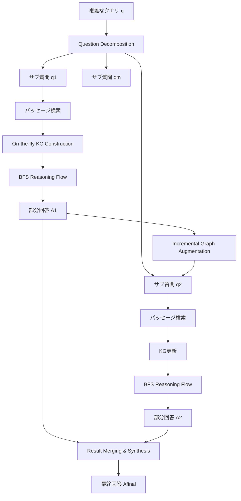

本記事は [StepChain GraphRAG (arXiv:2510.02827)](https://arxiv.org/abs/2510.02827) の解説記事です。

## 論文概要

Ni et al. (2025) は、質問分解と幅優先探索（BFS）に基づく推論フローを統合したマルチホップ質問応答フレームワーク StepChain GraphRAG を提案している。従来のGraphRAGがコーパス全体を事前にナレッジグラフへ変換する必要があったのに対し、本手法では推論時に検索されたパッセージのみをオンデマンドでノード・エッジにパースする。複雑なクエリをサブ質問に分解し、各サブ質問に対してBFS走査で明示的な証拠チェーン（例: "EntityA --(relationX)--> EntityB"）を構築することで、3つのマルチホップQAベンチマークにおいて平均EM +2.57pt、F1 +2.13ptの改善を達成したと報告している（論文Table 1）。

この記事は [Zenn記事: Neo4j×LangGraphでAgentic GraphRAGを実装しマルチホップ質問応答精度を高める](https://zenn.dev/0h_n0/articles/968106e107c3ea) の深掘りです。Zenn記事ではNeo4jとLangGraphを用いたAgentic GraphRAGの実装パターンを解説しているが、本論文はそのマルチホップ推論の核心であるグラフ走査戦略とステップごとの証拠チェーン構築について、体系的なアーキテクチャと定量的な評価を提供する研究である。

## 情報源

- **arXiv ID**: 2510.02827
- **URL**: [https://arxiv.org/abs/2510.02827](https://arxiv.org/abs/2510.02827)
- **著者**: Tengjun Ni, Xin Yuan, Shenghong Li, et al.
- **投稿日**: 2025年10月3日
- **分野**: cs.CL, cs.IR

## 背景と動機

マルチホップ質問応答（Multi-hop QA）は、複数のパッセージにまたがる推論を要求するタスクである。単一のパッセージ検索で回答可能な単純なQAとは異なり、「Xを発明した人物が生まれた都市はどこか」のような質問では、まず「Xの発明者」を特定し、次に「その人物の出生地」を検索する連鎖的な推論が必要になる。

従来手法には2つの系統がある。第一にIRベースの手法（BM25、BGEなどの密検索）は、検索されたパッセージをそのままLLMに入力するため、パッセージ間の関係を明示的にモデル化できない。第二にGraphRAGは、コーパス全体を事前にナレッジグラフに変換するため、構築コストが高く、動的なコーパス更新に追従しにくい。さらに、既存のGraphRAGでは推論過程がブラックボックスになりがちであり、どのパッセージからどの推論が導かれたかを追跡するのが困難であった。

著者らは、これらの課題を「オンデマンドKG構築」と「BFS推論フロー」の組み合わせで解決するアプローチを提案している。

## 主要な貢献

著者らは以下の4点を主要な貢献として報告している。

- **オンデマンドKG構築**: コーパス全体ではなく、検索されたパッセージのみをLLMでノード・エッジにパースする。事前のグラフ構築が不要であり、コーパスの動的更新にも対応可能
- **BFS推論フロー（BFS-RF）**: 深さ$h$までの幅優先探索でエンティティ間の明示的な証拠チェーンを構築し、推論過程の透明性・追跡可能性を実現
- **インクリメンタルグラフ更新**: 各サブ質問の回答後に新規パッセージでグラフを拡張し、推論コンテキストを同期する設計
- **SOTA精度**: MuSiQue、2WikiMultiHopQA、HotpotQAの3データセットでHopRAGを上回る精度を達成（平均EM 57.67%、F1 68.53%）

## 技術的詳細

### 5コンポーネントアーキテクチャ

StepChain GraphRAGは以下の5つのコンポーネントで構成される。



### On-the-fly Knowledge Graph Construction

従来のGraphRAGがコーパス全体を事前にグラフ化するのに対し、StepChain GraphRAGでは検索されたパッセージのみを動的にKGへ変換する。

まず、ドキュメント$\tau_i$を1,200トークンのチャンク（100トークンのオーバーラップ付き）に分割する。

$$
D_i = \text{Chunk}(\tau_i) = \{c_{i,1}, c_{i,2}, \ldots, c_{i,n_i}\}
$$

次に、LLM $\mathcal{M}$ を用いてチャンクからエンティティとその属性を抽出する。

$$
\text{Extract}(c_{i,j}) = \{(e, \alpha_e) \mid e \text{ appears in } c_{i,j}\}
$$

ここで、$e$はエンティティ、$\alpha_e$はその属性（型、説明文など）を表す。さらに、同一チャンク内に共起するエンティティ間の関係をLLMで検出する。

$$
r = \text{Link}(e_a, e_b, c_{i,j})
$$

この「遅延読み込み」方式により、コーパス全体のグラフ構築を省略し、推論に必要な部分のみをオンデマンドで構築する。オプションとして、Leidenコミュニティ検出アルゴリズムによるグラフクラスタリングも適用可能である。

$$
\mathcal{C}_G = \text{Cluster}(G) = \{C_1, C_2, \ldots, C_K\}
$$

### Question Decomposition

複雑なクエリ$q$をLLMガイドの質問分解で$m$個のサブ質問に分割する。

$$
\{q_1, q_2, \ldots, q_m\} = \text{Decompose}(q)
$$

各サブ質問はクエリの論理的側面（エンティティの定義、因果関係など）に焦点を絞る。著者らは「分解ベースの手法は信頼性の高い最終回答と、中間的な洞察がどのように導出されたかの透明な記録を生成する」と述べている（論文Section 3.2）。

### BFS推論フロー（BFS-RF）

各サブ質問$q_j$に対して、以下の手順でBFS推論を実行する。

**Step 1: シードエンティティ選択**

サブ質問の埋め込みベクトルと最も類似度の高い上位$k$個のエンティティをシードとして選択する。

**Step 2: BFS走査**

各シードエンティティ$s_u$から深さ$h$（論文では$h=2$）までの幅優先探索を実行する。

$$
\text{BFS}(s_u, h) = \{v \in V \mid \text{dist}(s_u, v) \leq h\}
$$

到達可能な全パスを収集する。

$$
\Pi_{s_u} = \{\pi \mid \pi: s_u \to \cdots \to v, \text{dist}(s_u, v) \leq h\}
$$

**Step 3: 証拠チェーン構築**

収集したパスを自然言語の記述に変換し、証拠チェーンとして連結する。

$$
C_{q_j} = \| \text{Desc}(\pi) \|_{\pi \in \bigcup_{u=1}^{k} \Pi_{s_u}}
$$

ここで$\| \cdot \|$は文字列の連結演算子を表す。各チェーンは「EntityA --(relationX)--> EntityB --(relationY)--> EntityC」のような明示的な推論経路として表現される。この明示性が推論過程の追跡可能性を実現する。

### Incremental Graph Augmentation

各サブ質問$q_j$の回答後、以下の手順でグラフを更新する。

1. 現在のフロンティア$F_j$（既訪問のエンティティ・関係）を条件として、グローバルインデックス$\mathcal{I}$から追加パッセージを検索
2. 新規パッセージからエンティティ$V_{\text{new}}$と関係$E_{\text{new}}$を抽出
3. グラフにupsert: `G.add_nodes_from(V_new), G.add_edges_from(E_new)`

精度を維持するためのセーフガードとして、Dense+BM25のリランキング、テキスト裏付けの最小閾値、BFS深さとフロンティアサイズの上限が設定されている。フロンティアが空になった場合は、直接パッセージを検索してグラフを再シードする。

### Result Merging & Synthesis

全サブ質問の部分回答を2段階で統合する。

**第1段階**: 部分回答とオプションのコミュニティ要約を統合する。

$$
A_{\text{merge}} = \mathcal{M}(\{A_1, \ldots, A_m\}, \{S_1, \ldots, S_K\})
$$

**第2段階**: 統合結果を元のクエリとともにLLMに入力し、最終回答を生成する。

$$
A_{\text{final}} = \mathcal{M}(q \| A_{\text{merge}})
$$

LLMが部分回答間の重複・矛盾を解消し、ローカルなテキスト情報とグローバルなトポロジ情報の両方を反映した回答を生成する。

## 実装のポイント

StepChain GraphRAGの実装において注意すべき点を整理する。

**チャンキング戦略**: 1,200トークンのチャンクサイズと100トークンのオーバーラップは、エンティティの共起を十分に捕捉しつつ、LLMのコンテキストウィンドウを圧迫しないバランスとなっている。チャンクサイズが小さすぎるとエンティティ間の関係が分断され、大きすぎるとノイズが増加する。

**BFS深さの設定**: 論文では$h=2$を採用している。深さ$h$を増やすと到達可能なエンティティが指数的に増加するため、計算コストと精度のトレードオフを考慮する必要がある。2ホップが多くのマルチホップ質問に十分であることは、HotpotQA（2ホップ主体）での高精度が裏付けている。

**エンティティ抽出のLLM依存**: KG構築はLLMのエンティティ抽出精度に依存する。著者らはLLMの幻覚（hallucination）が偽のファクトをパイプラインに伝播させるリスクを制限事項として指摘している。テキスト裏付けの最小閾値を設けることで、裏付けのないエッジがグラフに追加されるのを防ぐ設計となっている。

**推論レイテンシ**: グラフ操作（検索、BFS走査、グラフ更新）は3秒未満であり、ボトルネックはLLM推論（GPT-4oで約80秒/クエリ）である。著者らは「実用的なレイテンシ改善はプロンプトキャッシュ、量子化、投機的デコーディング、蒸留チェックポイントなど、LLM側に注力すべきである」と述べている（論文Section 4.4）。

## Production Deployment Guide

### AWS実装パターン

StepChain GraphRAGのマルチホップ推論パイプラインをAWS上にデプロイする構成を、トラフィック量別に提案する。グラフ操作のレイテンシが3秒未満であるため、LLM推論のコスト最適化が設計の主軸となる。

**コスト試算の注意事項**: 以下は2026年8月時点のAWS ap-northeast-1（東京）リージョン料金に基づく概算値である。実際のコストはトラフィックパターン、リージョン、バースト使用量により変動する。最新料金はAWS料金計算ツールで確認を推奨する。

| 構成 | トラフィック | 主要サービス | 月額概算 |
|------|-------------|-------------|---------|
| Small | ~100 req/日 | Lambda + Bedrock + Neptune Serverless | $80-180 |
| Medium | ~1,000 req/日 | ECS Fargate + Bedrock + Neptune + ElastiCache | $400-900 |
| Large | 10,000+ req/日 | EKS + Karpenter + Spot + Bedrock Batch + Neptune | $2,500-5,000 |

**Small構成の内訳**: Lambda（$5-10）+ Bedrock推論（$40-100、サブ質問分解で複数回呼び出し）+ Neptune Serverless（$10-30、オンデマンドKG操作）+ DynamoDB On-Demand（$5-15、セッション状態管理）+ CloudWatch（$5-10）+ S3（$2-5）

**Large構成の内訳**: EKSコントロールプレーン（$73）+ EC2 Spot Instances（$700-1,500、On-Demandの60-90%削減）+ Bedrock Batch API（$800-2,000、リアルタイムの50%削減）+ Neptune（$200-400、永続グラフ管理）+ ElastiCache Redis（$150-300、エンティティ埋め込みキャッシュ）+ ALB（$50-100）+ CloudWatch/X-Ray（$30-80）

### Terraformインフラコード

**Small構成（Serverless）: Lambda + Bedrock + Neptune Serverless**

```hcl
# --- Small構成: StepChain GraphRAGマルチホップ推論 ---
# Lambda + Bedrock + Neptune Serverless (月額 $80-180)

terraform {
  required_version = ">= 1.9"
  required_providers {
    aws = { source = "hashicorp/aws", version = "~> 5.60" }
  }
}

provider "aws" { region = "ap-northeast-1" }

# --- IAMロール（最小権限） ---
resource "aws_iam_role" "stepchain_lambda" {
  name = "stepchain-graphrag-lambda"
  assume_role_policy = jsonencode({
    Version = "2012-10-17"
    Statement = [{
      Action = "sts:AssumeRole"
      Effect = "Allow"
      Principal = { Service = "lambda.amazonaws.com" }
    }]
  })
}

resource "aws_iam_role_policy" "stepchain_lambda" {
  name = "stepchain-graphrag-policy"
  role = aws_iam_role.stepchain_lambda.id
  policy = jsonencode({
    Version = "2012-10-17"
    Statement = [
      {
        # Bedrock推論: 質問分解・エンティティ抽出・回答合成
        Effect   = "Allow"
        Action   = ["bedrock:InvokeModel", "bedrock:InvokeModelWithResponseStream"]
        Resource = "arn:aws:bedrock:ap-northeast-1::foundation-model/*"
      },
      {
        # Neptune: グラフ読み書き
        Effect   = "Allow"
        Action   = ["neptune-db:ReadDataViaQuery", "neptune-db:WriteDataViaQuery"]
        Resource = aws_neptune_cluster.graph.arn
      },
      {
        # DynamoDB: セッション状態・中間回答の保存
        Effect   = "Allow"
        Action   = ["dynamodb:GetItem", "dynamodb:PutItem", "dynamodb:UpdateItem", "dynamodb:Query"]
        Resource = aws_dynamodb_table.session_state.arn
      },
      {
        Effect   = "Allow"
        Action   = ["logs:CreateLogGroup", "logs:CreateLogStream", "logs:PutLogEvents"]
        Resource = "arn:aws:logs:ap-northeast-1:*:*"
      },
      {
        Effect   = "Allow"
        Action   = ["xray:PutTraceSegments", "xray:PutTelemetryRecords"]
        Resource = "*"
      },
      {
        Effect   = "Allow"
        Action   = ["cloudwatch:PutMetricData"]
        Resource = "*"
      }
    ]
  })
}

# --- Neptune Serverless: オンデマンドKG ---
resource "aws_neptune_cluster" "graph" {
  cluster_identifier   = "stepchain-kg"
  engine               = "neptune"
  serverless_v2_scaling_configuration {
    min_capacity = 1.0
    max_capacity = 8.0
  }
  storage_encrypted    = true
  skip_final_snapshot  = true
}

resource "aws_neptune_cluster_instance" "graph" {
  cluster_identifier   = aws_neptune_cluster.graph.id
  instance_class       = "db.serverless"
  neptune_subnet_group_name = aws_neptune_subnet_group.graph.name
}

# --- DynamoDB: セッション状態管理 ---
resource "aws_dynamodb_table" "session_state" {
  name         = "stepchain-sessions"
  billing_mode = "PAY_PER_REQUEST"
  hash_key     = "session_id"
  range_key    = "sub_question_id"

  attribute {
    name = "session_id"
    type = "S"
  }
  attribute {
    name = "sub_question_id"
    type = "N"
  }

  server_side_encryption { enabled = true }

  ttl {
    attribute_name = "expires_at"
    enabled        = true
  }
}

# --- Lambda関数 ---
resource "aws_lambda_function" "stepchain" {
  function_name = "stepchain-graphrag"
  role          = aws_iam_role.stepchain_lambda.arn
  runtime       = "python3.12"
  handler       = "handler.lambda_handler"
  filename      = "lambda.zip"
  timeout       = 900          # マルチホップ推論は最大15分
  memory_size   = 2048         # グラフ操作のためメモリ多め

  tracing_config { mode = "Active" }

  environment {
    variables = {
      NEPTUNE_ENDPOINT    = aws_neptune_cluster.graph.endpoint
      SESSION_TABLE       = aws_dynamodb_table.session_state.name
      BFS_DEPTH           = "2"
      MAX_SUB_QUESTIONS   = "5"
    }
  }
}

# --- CloudWatchアラーム: 推論レイテンシ異常検知 ---
resource "aws_cloudwatch_metric_alarm" "lambda_duration" {
  alarm_name          = "stepchain-duration-high"
  comparison_operator = "GreaterThanThreshold"
  evaluation_periods  = 3
  metric_name         = "Duration"
  namespace           = "AWS/Lambda"
  period              = 300
  statistic           = "p95"
  threshold           = 600000   # 10分超過で警告
  alarm_actions       = []

  dimensions = {
    FunctionName = aws_lambda_function.stepchain.function_name
  }
}
```

**Large構成（Container）: EKS + Karpenter + Spot Instances**

```hcl
# --- Large構成: StepChain GraphRAGクラスタ ---
# EKS + Karpenter + Spot + Neptune (月額 $2,500-5,000)

module "eks" {
  source  = "terraform-aws-modules/eks/aws"
  version = "~> 20.24"

  cluster_name    = "stepchain-cluster"
  cluster_version = "1.31"

  cluster_endpoint_public_access  = true
  cluster_endpoint_private_access = true

  vpc_id     = module.vpc.vpc_id
  subnet_ids = module.vpc.private_subnets

  enable_cluster_creator_admin_permissions = true
}

# --- Karpenter Provisioner: Spot優先 ---
resource "kubectl_manifest" "karpenter_nodepool" {
  yaml_body = yamlencode({
    apiVersion = "karpenter.sh/v1"
    kind       = "NodePool"
    metadata   = { name = "stepchain-graphrag" }
    spec = {
      template = {
        spec = {
          requirements = [
            { key = "karpenter.sh/capacity-type", operator = "In", values = ["spot", "on-demand"] },
            { key = "node.kubernetes.io/instance-type", operator = "In",
              values = ["m7i.xlarge", "m7i.2xlarge", "r7i.xlarge", "r7i.2xlarge", "c7i.xlarge", "c7i.2xlarge"] },
          ]
          nodeClassRef = { group = "karpenter.k8s.aws", kind = "EC2NodeClass", name = "default" }
        }
      }
      limits   = { cpu = "128", memory = "512Gi" }
      disruption = {
        consolidationPolicy = "WhenEmptyOrUnderutilized"
        consolidateAfter    = "60s"
      }
    }
  })
}

# --- Neptune: 永続ナレッジグラフ ---
resource "aws_neptune_cluster" "graph" {
  cluster_identifier   = "stepchain-kg-prod"
  engine               = "neptune"
  serverless_v2_scaling_configuration {
    min_capacity = 2.0
    max_capacity = 32.0
  }
  storage_encrypted = true
}

# --- ElastiCache: エンティティ埋め込み・BFS結果キャッシュ ---
resource "aws_elasticache_replication_group" "entity_cache" {
  replication_group_id = "stepchain-entity-cache"
  description          = "Entity embedding and BFS path cache"
  engine               = "redis"
  engine_version       = "7.1"
  node_type            = "cache.r7g.large"
  num_cache_clusters   = 2
  at_rest_encryption_enabled = true
  transit_encryption_enabled = true
}

# --- AWS Budgets: 予算アラート ---
resource "aws_budgets_budget" "monthly" {
  name         = "stepchain-monthly"
  budget_type  = "COST"
  limit_amount = "5000"
  limit_unit   = "USD"
  time_unit    = "MONTHLY"

  notification {
    comparison_operator       = "GREATER_THAN"
    threshold                 = 80
    threshold_type            = "PERCENTAGE"
    notification_type         = "ACTUAL"
    subscriber_email_addresses = ["ops-team@example.com"]
  }

  notification {
    comparison_operator       = "GREATER_THAN"
    threshold                 = 100
    threshold_type            = "PERCENTAGE"
    notification_type         = "FORECASTED"
    subscriber_email_addresses = ["ops-team@example.com"]
  }
}
```

### 監視設定

**CloudWatch Logs Insights クエリ**: マルチホップ推論のステップ別レイテンシとBFS走査の効率を監視する。

```
# サブ質問別の推論レイテンシ分布
fields @timestamp, @message
| filter @message like /stepchain_metric/
| stats count(*) as total_queries,
        avg(total_latency_ms) as avg_latency,
        avg(bfs_latency_ms) as avg_bfs,
        avg(llm_latency_ms) as avg_llm,
        avg(sub_question_count) as avg_hops
  by bin(1h)
| sort @timestamp desc
```

```
# BFS走査の効率分析（エンティティ到達数 vs 回答精度）
fields @timestamp, query_id, bfs_depth, entities_visited, evidence_chains_found
| filter event = "bfs_traversal"
| stats avg(entities_visited) as avg_entities,
        avg(evidence_chains_found) as avg_chains,
        percentile(bfs_latency_ms, 95) as p95_bfs
  by bfs_depth, bin(1h)
```

**推論メトリクス収集（Python）**:

```python
from dataclasses import dataclass
from datetime import datetime, timezone

import boto3


@dataclass
class StepChainMetric:
    """StepChain GraphRAGの推論メトリクス

    Attributes:
        query_id: クエリ識別子
        sub_question_count: サブ質問数
        bfs_depth: BFS探索深さ
        entities_visited: 走査エンティティ数
        evidence_chains: 構築された証拠チェーン数
        bfs_latency_ms: BFS走査のレイテンシ（ミリ秒）
        llm_latency_ms: LLM推論のレイテンシ（ミリ秒）
        total_latency_ms: 総レイテンシ（ミリ秒）
    """
    query_id: str
    sub_question_count: int
    bfs_depth: int
    entities_visited: int
    evidence_chains: int
    bfs_latency_ms: float
    llm_latency_ms: float
    total_latency_ms: float


def publish_stepchain_metrics(
    metrics: list[StepChainMetric],
    namespace: str = "StepChainGraphRAG",
) -> None:
    """StepChainメトリクスをCloudWatchに発行する

    Args:
        metrics: 発行するメトリクスのリスト
        namespace: CloudWatch名前空間
    """
    cw = boto3.client("cloudwatch", region_name="ap-northeast-1")

    metric_data = []
    for m in metrics:
        metric_data.extend([
            {
                "MetricName": "BFSLatency",
                "Value": m.bfs_latency_ms,
                "Unit": "Milliseconds",
                "Dimensions": [
                    {"Name": "BFSDepth", "Value": str(m.bfs_depth)},
                ],
            },
            {
                "MetricName": "LLMLatency",
                "Value": m.llm_latency_ms,
                "Unit": "Milliseconds",
            },
            {
                "MetricName": "EntitiesVisited",
                "Value": float(m.entities_visited),
                "Unit": "Count",
            },
            {
                "MetricName": "EvidenceChains",
                "Value": float(m.evidence_chains),
                "Unit": "Count",
            },
        ])

    # CloudWatch PutMetricData: 最大1000件/回
    for i in range(0, len(metric_data), 1000):
        cw.put_metric_data(
            Namespace=namespace,
            MetricData=metric_data[i:i + 1000],
        )
```

**X-Rayトレーシング設定（Python）**:

```python
from aws_xray_sdk.core import patch_all, xray_recorder

# boto3, requests等を自動計装
patch_all()


@xray_recorder.capture("stepchain_query")
def handle_query(query: str) -> dict:
    """マルチホップクエリを処理する

    Args:
        query: ユーザーからの複雑なクエリ

    Returns:
        最終回答と証拠チェーンを含む辞書
    """
    subsegment = xray_recorder.current_subsegment()
    subsegment.put_annotation("query_type", "multi_hop")

    # 質問分解
    with xray_recorder.in_subsegment("question_decomposition"):
        sub_questions = decompose_query(query)
        xray_recorder.current_subsegment().put_metadata(
            "sub_questions", sub_questions
        )

    # BFS推論ループ
    partial_answers = []
    for i, sq in enumerate(sub_questions):
        with xray_recorder.in_subsegment(f"bfs_reasoning_step_{i}"):
            answer = bfs_reasoning_flow(sq)
            partial_answers.append(answer)

    # 回答統合
    with xray_recorder.in_subsegment("result_merging"):
        final = merge_answers(query, partial_answers)

    return final
```

### コスト最適化チェックリスト

**アーキテクチャ選択**:
- [ ] トラフィック100 req/日以下 → Serverless（Lambda + Neptune Serverless）
- [ ] トラフィック1,000 req/日 → Hybrid（ECS Fargate + Neptune）
- [ ] トラフィック10,000 req/日以上 → Container（EKS + Karpenter + Spot）

**リソース最適化**:
- [ ] EC2: Spot Instances優先（m7i/r7iファミリー、60-90%削減）
- [ ] Reserved Instances: Neptune/ElastiCacheに1年コミット（最大40%削減）
- [ ] Savings Plans: Compute Savings Plans検討
- [ ] Lambda: メモリサイズ最適化（2048MB推奨、グラフ操作に十分）
- [ ] Neptune Serverless: min/max NCU設定の最適化

**LLMコスト削減**:
- [ ] Bedrock Batch API: 非リアルタイム処理で50%削減
- [ ] Prompt Caching: システムプロンプト・質問分解テンプレートのキャッシュ
- [ ] モデル選択: サブ質問の複雑度に応じてモデルを切り替え（簡単な質問には軽量モデル）
- [ ] トークン数制限: BFS証拠チェーンの最大長を制限

**監視・アラート**:
- [ ] AWS Budgets: 月額予算アラート設定
- [ ] CloudWatch: BFSレイテンシ・LLMレイテンシの分離監視
- [ ] Cost Anomaly Detection: Bedrockコストのスパイク検知
- [ ] 日次コストレポート: SNS通知

**リソース管理**:
- [ ] 未使用Neptuneクラスタの削除
- [ ] タグ戦略: `project=stepchain`, `env=prod/dev`
- [ ] Neptune/ElastiCacheのスナップショットライフサイクル
- [ ] 開発環境: Neptune Serverless min NCU=1.0、夜間自動停止
- [ ] BFS結果キャッシュのTTL設定（クエリパターンに応じて5-60分）

## 実験結果

### メインベンチマーク（Table 1）

著者らはGPT-4oを使用し、上位20パッセージを検索する条件で、3つのマルチホップQAデータセット（各1,000問の検証セット）で評価を行っている。

| 手法 | MuSiQue EM | MuSiQue F1 | 2Wiki EM | 2Wiki F1 | HotpotQA EM | HotpotQA F1 | 平均 EM | 平均 F1 |
|------|-----------|-----------|----------|----------|------------|------------|--------|--------|
| BM25 | 13.80 | 21.50 | 40.30 | 44.83 | 41.20 | 53.23 | 31.77 | 39.85 |
| BGE | 20.80 | 30.10 | 40.10 | 44.96 | 47.60 | 60.36 | 36.17 | 45.14 |
| GraphRAG | 12.10 | 20.22 | 22.50 | 27.49 | 31.70 | 42.74 | 22.10 | 30.15 |
| RAPTOR | 36.40 | 49.09 | 53.80 | 61.45 | 58.00 | 73.08 | 49.40 | 61.21 |
| SiReRAG | 40.50 | 53.08 | 59.60 | 67.94 | 61.70 | 76.48 | 53.93 | 65.83 |
| HopRAG | 42.20 | 54.90 | 61.10 | 68.26 | 62.00 | 76.06 | 55.10 | 66.40 |
| **StepChain** | **43.90** | **55.38** | **62.40** | **70.72** | **66.70** | **79.50** | **57.67** | **68.53** |

StepChain GraphRAGは全データセット・全指標で最高精度を達成している。特にHotpotQAではEM +4.70pt、F1 +3.44ptの改善が顕著である。一方、MuSiQueでの改善幅（EM +1.70pt）は相対的に小さく、4ホップ以上の複雑な質問では改善余地が残ることが示唆される。

### Ablation Study（Table 3）

コンポーネントの累積効果をMuSiQueで分析した結果を以下に示す。

| 構成 | EM | F1 |
|------|----|----|
| GPT-4o（検索なし） | 10.80 | 18.52 |
| + GraphRAG | 12.10 | 20.22 |
| + Question Decomposition | 21.50 | 31.40 |
| + GraphRAG + Decomposition | 36.40 | 49.09 |
| + GraphRAG + Reasoning | 39.60 | 50.71 |
| **Full System** | **43.90** | **55.38** |

質問分解単体で+10.70 EMの大幅な改善が得られている。GraphRAGと質問分解の組み合わせでさらに+14.90 EM、BFS推論フローの追加で+3.20 EM、そしてインクリメンタルグラフ更新と回答合成を含むフルシステムで+4.30 EMの改善が累積的に得られている（論文Table 3）。

### LLMの頑健性（Table 2, HotpotQA）

| LLM | EM | F1 |
|-----|----|----|
| Llama 3.3 (70B) | 54.00 | 68.77 |
| Qwen 2.5 (72B) | 59.30 | 71.33 |
| GPT-4o | 66.70 | 79.50 |

GPT-4oが最高精度を示すが、オープンソースモデル（Llama 3.3、Qwen 2.5）でもEM 54-59%の精度を達成しており、フレームワークのLLM非依存性が確認されている。実験は2基のRTX 6000 Ada GPUで実施されたと報告されている。

## 実運用への応用

StepChain GraphRAGの設計は、以下のようなプロダクションユースケースに適用可能である。

**社内ナレッジベース検索**: 大量の社内ドキュメント（技術仕様書、議事録、Wikiなど）に対するマルチホップ質問応答。オンデマンドKG構築により、ドキュメントの追加・更新時にグラフ全体を再構築する必要がない。Zenn記事で解説されているNeo4j×LangGraphの実装パターンと組み合わせることで、Neo4jを永続的なグラフストアとして活用しつつ、StepChainのBFS推論フローをLangGraphのエージェントグラフとして実装できる。

**法務・コンプライアンス調査**: 複数の法令・判例にまたがる法的質問への回答。証拠チェーンの明示性により、回答の根拠を監査証跡として記録できる。

**カスタマーサポートの高度化**: 製品マニュアル、FAQ、過去の問い合わせ履歴を横断する複雑な問い合わせ対応。BFS深さ$h=2$で多くのケースに対応可能であり、グラフ操作のレイテンシが3秒未満であるため、リアルタイム応答に適している。

**運用上の課題として**: LLM推論が全体レイテンシの96%以上を占めるため、プロンプトキャッシュの活用やモデルの蒸留・量子化がスループット向上の鍵となる。また、エラーカスケード（初期のサブ質問の誤りが後続の推論に伝播する問題）に対して、著者らは不確実性に基づく再分解やバックトラッキングを今後の課題として挙げている。

## 関連研究

- **HopRAG** (Li et al.): グラフ探索ベースのマルチホップ検索手法。StepChain GraphRAGの直接的な比較対象であり、全3データセットでStepChainが上回る結果が報告されている
- **RAPTOR** (Sarthi et al.): 再帰的な要約によるツリー構造の検索手法。グラフ構造ではなく木構造を採用し、平均EM 49.40%に対してStepChainは57.67%を達成
- **SiReRAG**: 類似性と関連性の両方を考慮した検索手法。StepChainとの差は主にBFS推論フローと質問分解の有無に起因する
- **Microsoft GraphRAG** (Edge et al.): コーパス全体を事前にKGに変換する手法。StepChainのオンデマンドKG構築はこの事前構築コストを回避する設計方針として位置づけられる

## まとめと今後の展望

StepChain GraphRAGは、オンデマンドKG構築とBFS推論フローの組み合わせにより、マルチホップQAの精度と説明可能性を両立させたフレームワークである。3つのベンチマークで一貫したSOTA精度を達成し、グラフ操作のオーバーヘッドが3秒未満であることから、実用的なシステム構築の基盤として有望である。

今後の課題として、著者らはLLMの幻覚に対するロバスト性の強化、不確実性に基づくサブ質問の再分解・バックトラッキング、ドメイン特化コーパスへの適用、推論コストの削減を挙げている。特に、サブ質問間のエラーカスケードの定量的分析と緩和策は、プロダクション環境での信頼性向上に直結する重要な研究方向である。

## 参考文献

- **arXiv**: [https://arxiv.org/abs/2510.02827](https://arxiv.org/abs/2510.02827)
- **Related Zenn article**: [https://zenn.dev/0h_n0/articles/968106e107c3ea](https://zenn.dev/0h_n0/articles/968106e107c3ea)
