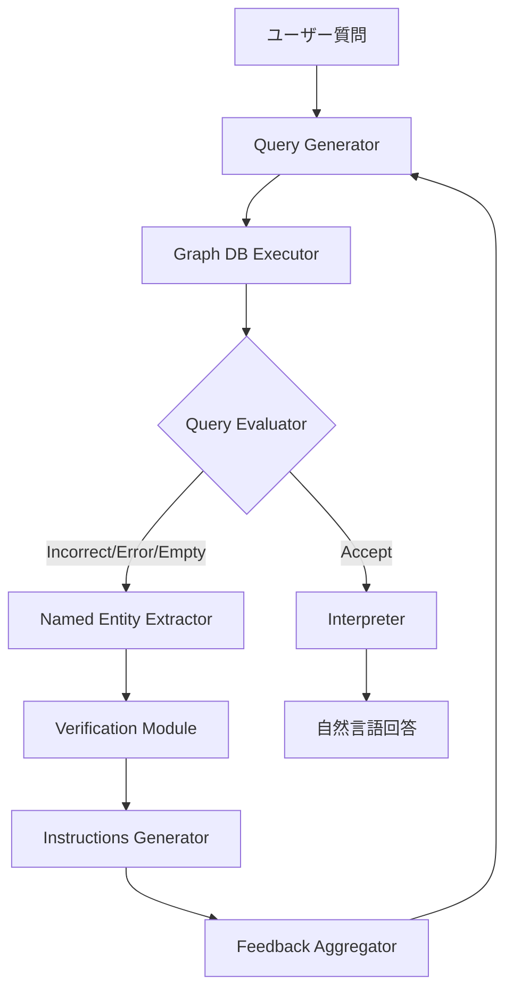

本記事は [Multi-Agent GraphRAG: A Text-to-Cypher Framework for Labeled Property Graphs（arXiv:2511.08274）](https://arxiv.org/abs/2511.08274) の解説記事です。

## 論文概要

Gusarov et al. (2025, AIRI / Skoltech) は、ラベル付きプロパティグラフ（LPG）に特化したText-to-Cypherマルチエージェントフレームワークを提案している。GraphRAGにおける知識グラフ問合せは従来RDF/SPARQLベースの手法が主流であったが、LPGとCypherクエリ言語の組合せに対する体系的な取り組みは限られていた。著者らは、クエリ生成・実行・評価・エンティティ検証・修正指示生成・結果解釈の8コンポーネントから成るマルチエージェントシステムを構築し、最大4回の反復精錬ループによってクエリの正確性を段階的に向上させる手法を提示している。CypherBenchベンチマークにおいて、Gemini 2.5 Proのシングルショット精度67.00%をエージェント構成で77.23%に向上させたと報告している。

この記事は [Zenn記事: Neo4j×LangGraphでAgentic GraphRAGを実装しマルチホップ質問応答精度を高める](https://zenn.dev/0h_n0/articles/968106e107c3ea) の深掘りです。Zenn記事ではLangGraphを用いたAgentic GraphRAGの実装パターンを解説しているが、本論文はText-to-Cypherタスクに特化したマルチエージェントアーキテクチャの設計原理と、エンティティハルシネーションの検証・修正メカニズムを体系的に定式化している点で補完的な内容となる。

## 情報源

- **arXiv ID**: 2511.08274
- **URL**: [https://arxiv.org/abs/2511.08274](https://arxiv.org/abs/2511.08274)
- **著者**: Anton Gusarov, Anastasia Volkova, Valentin Khrulkov, Andrey Kuznetsov, Evgenii Maslov, Ivan Oseledets
- **所属**: AIRI (Artificial Intelligence Research Institute), Skoltech
- **提出日**: 2025年11月11日
- **分野**: cs.AI, cs.DB

## 関連Zenn記事

- [Neo4j×LangGraphでAgentic GraphRAGを実装しマルチホップ質問応答精度を高める](https://zenn.dev/0h_n0/articles/968106e107c3ea)

## 背景と動機

### RDFベースGraphRAGの限界とLPGへの期待

知識グラフを用いた質問応答（KGQA）において、RDF（Resource Description Framework）とSPARQLを組み合わせたアプローチは長年の研究蓄積がある。WikidataやDBpediaといった大規模知識グラフはRDF形式で公開されており、Text-to-SPARQL変換の研究も活発に行われてきた。

一方、産業界での知識グラフ活用においては、ラベル付きプロパティグラフ（LPG）がRDFに代わる選択肢として広く採用されている。LPGはノードとエッジにプロパティ（キーバリューペア）を直接付与でき、Neo4jやMemgraphといったグラフデータベースがネイティブにサポートしている。問合せ言語としてはCypherが事実上の標準であり、2024年にはISO標準GQL（Graph Query Language）としても採択されている。

著者らは、LPG/CypherベースのText-to-Query変換に対する研究が相対的に不足していることを指摘している。既存のGraphRAG手法の多くはRDFを前提としており、LPGのスキーマ構造（ノードラベル、リレーションシップタイプ、プロパティキー）をLLMに効果的に伝達し、正確なCypherクエリを生成するための体系的な手法は確立されていなかった。

### シングルショットクエリ生成の課題

LLMにスキーマ情報とユーザー質問を与えてCypherクエリを一回で生成させるシングルショットアプローチには、複数の課題がある。著者らは、エンティティ名のハルシネーション（グラフ内に存在しないエンティティ名の生成）、構文エラー、意味的に不正確なクエリ構造の3つを主要な失敗パターンとして特定している。特にエンティティ名のハルシネーションは、LLMが自然言語の表現をそのままクエリに埋め込むことで、グラフ内の正式なエンティティ名との不一致が発生する典型的な問題である。

## 主要な貢献

著者らの主要な貢献は以下の4点である。

1. **LPG特化マルチエージェントフレームワーク**: RDFベースの既存手法とは異なり、LPGとCypherクエリに特化した8コンポーネントのマルチエージェントシステムを設計した。各コンポーネントが明確に分離された責務を持ち、反復的な精錬ループを通じてクエリ品質を向上させる。

2. **エンティティ検証・修正メカニズム**: 生成されたCypherクエリ内のエンティティ名が実際にグラフ内に存在するかをプログラム的に検証し、存在しない場合は正規化Levenshtein類似度とLLMベースの意味ランキングを組み合わせて修正候補を提示する仕組みを構築した。

3. **CypherBenchでの定量評価**: 11のグラフデータセットを含むCypherBenchベンチマークにおいて、複数のLLM（Gemini 2.5 Pro, GPT-4o, Qwen3 Coder, GigaChat 2 MAX）でシングルショット対比+6.79%～+10.23%の改善を示した。

4. **ドメイン固有データ（IFC建物モデル）での検証**: 標準ベンチマークに加え、IFC（Industry Foundation Classes）建物データに対する評価を行い、シングルショットでは未回答だった3問に正答する結果を報告している。

## 技術的詳細

### 8コンポーネントアーキテクチャ

著者らが提案するフレームワークは、以下の8つのコンポーネントから構成される。



**1. Query Generator**: グラフデータベースのスキーマ情報（ノードラベル、リレーションシップタイプ、プロパティキー）とユーザーの自然言語質問を入力として受け取り、Cypherクエリを生成する。反復2回目以降はFeedback Aggregatorからの修正指示も入力に加わる。

**2. Graph Database Executor**: 生成されたCypherクエリをグラフデータベース（論文ではMemgraphを使用）上で実行し、クエリ結果またはエラーメッセージを返す。

**3. Query Evaluator**: LLMを用いて、実行結果を4カテゴリに分類する。
- **Accept**: クエリが正しく、結果が質問に適切に回答している
- **Incorrect**: クエリは実行されたが、結果が質問の意図と合致しない
- **Error**: 構文エラーや実行時エラーが発生した
- **Empty**: クエリは正しく実行されたが結果が空

**4. Named Entity Extractor**: Evaluatorが「Accept」以外を返した場合に起動し、Cypherクエリ内のハルシネーション対象となり得るエンティティ（ノードプロパティ値、リレーションシップタイプ等）を特定する。

**5. Verification Module**: 抽出されたエンティティについて、補助的なCypherクエリを生成・実行してグラフ内での存在を確認する。存在しないエンティティに対しては、正規化Levenshtein類似度を用いて類似エンティティの候補リストを取得する。

**6. Instructions Generator**: Verification Moduleの結果を基に、クエリの修正指示を生成する。編集距離ベースの候補と、LLMによる意味的ランキングを組み合わせて、最適な修正方針を決定する。

**7. Feedback Aggregator**: Query EvaluatorとVerification Moduleからのフィードバックを統合し、Query Generatorへの入力として整形する。

**8. Interpreter**: Evaluatorが「Accept」を返した場合に起動し、Cypherクエリの実行結果を自然言語の回答に変換する。

### 反復精錬ループ

フレームワークの中核は最大4回の反復精錬ループである。各反復では以下のプロセスが実行される。

1. Query Generatorがクエリを生成（初回はスキーマ+質問のみ、2回目以降はフィードバックも入力）
2. Graph DB Executorがクエリを実行
3. Query Evaluatorが結果を4カテゴリで評価
4. 「Accept」なら反復を終了しInterpreterへ
5. それ以外ならNamed Entity Extractor → Verification Module → Instructions Generator → Feedback Aggregatorの修正パイプラインを通過
6. 統合フィードバックをQuery Generatorに渡して次の反復へ

著者らは、反復回数を4に設定した理由について、CypherBenchでの予備実験において4反復以降の精度改善が限定的であったことを報告している。反復コストとのトレードオフから、4反復が実用的な上限と判断されている。

### エンティティ検証メカニズム

エンティティ検証は本フレームワークの差別化要素の一つである。LLMがCypherクエリを生成する際に最も頻繁に発生するエラーは、グラフ内に存在しないエンティティ名の使用（ハルシネーション）である。

**ステップ1: プログラム的検証**

Named Entity Extractorが特定したエンティティ（例: ノードのname属性値 `'Corlys Velaryon'`）に対して、以下のような補助Cypherクエリをプログラム的に生成・実行する。

```cypher
MATCH (n:Character {name: 'Corlys Velaryon'})
RETURN n LIMIT 1
```

この補助クエリが結果を返せば、当該エンティティはグラフ内に存在すると確認できる。空結果であれば、ハルシネーションまたは名前の不一致が発生している。

**ステップ2: 類似候補の取得**

エンティティが存在しない場合、グラフ内の同じプロパティを持つ全エンティティを取得し、正規化Levenshtein距離を計算する。

$$
d_{\text{Lev}}(s_1, s_2) = \frac{\text{Lev}(s_1, s_2)}{\max(|s_1|, |s_2|)}
$$

ここで、$\text{Lev}(s_1, s_2)$ は文字列 $s_1$ と $s_2$ 間のLevenshtein編集距離、$\|s_i\|$ は文字列 $s_i$ の長さである。正規化により、文字列長の異なるエンティティ間の比較が公平に行える。

**ステップ3: LLM意味ランキング**

編集距離の上位候補をLLMに提示し、元の自然言語質問の文脈に基づいて意味的に最も適切な候補をランキングする。これにより、編集距離は小さいが意味的に無関係な候補（例: 名前のスペルが似ているが別人）を排除できる。

### Cypherクエリ生成の具体例

著者らは、CypherBenchのGame of Thronesグラフに対する質問例を示している。質問「Corlys Velaryonの父親である子供とDaemon Targaryenの配偶者の何人のユニークなキャラクターがいるか」に対して、以下のクエリが生成される。

```cypher
OPTIONAL MATCH (child:Character)-[:hasFather]->
  (:Character{name: 'Corlys Velaryon'})
WITH collect(DISTINCT child) AS children
OPTIONAL MATCH (spouse_char:Character)-[:hasSpouse]-
  (:Character{name: 'Daemon Targaryen'})
WITH children + collect(DISTINCT spouse_char) AS all_chars
UNWIND all_chars AS c
RETURN count(DISTINCT c)
```

このクエリでは、`OPTIONAL MATCH`で2つの条件を別々に取得し、`WITH`句でリストを結合した後、`UNWIND`で展開して`DISTINCT`カウントを行っている。複数のグラフパターンを組み合わせるマルチホップクエリの典型的な構造である。

## 実装のポイント

### スキーマ情報の供給方法

著者らはグラフデータベースのスキーマ（ノードラベル、リレーションシップタイプ、プロパティキー）をLLMのプロンプトに直接供給している。大規模なグラフではスキーマ情報だけでもトークン数が膨大になるため、プロンプトサイズの管理が実装上の要点となる。実用的な対策として、関連するサブスキーマのみを選択的に供給する手法や、スキーマの要約・圧縮が考えられる。

### Memgraph vs Neo4j

論文ではグラフデータベースとしてMemgraphを使用しているが、CypherクエリはNeo4jでも基本的に互換性がある。ただし、一部の関数や構文（`toUpper()`, `collect()`の挙動等）にはデータベース間で差異があるため、移植時にはクエリの動作検証が必要である。Neo4jを使用する場合は、APOC（Awesome Procedures on Cypher）プラグインの有無もクエリ設計に影響する。

### 反復コストの考慮

反復精錬ループは精度向上と引き換えにLLM呼び出し回数を増加させる。最大4反復の場合、Query Generator, Query Evaluator, Named Entity Extractor, Instructions Generatorの各コンポーネントでLLM呼び出しが発生するため、最悪ケースでは1質問あたり16回以上のLLM呼び出しが必要となる。バッチ処理やキャッシュ機構の導入により、コスト効率の改善が可能である。

### エンティティ検証の実装パターン

エンティティ検証モジュールは、Pythonの`Levenshtein`ライブラリやfuzzy matchingライブラリ（`thefuzz`, `rapidfuzz`等）で実装できる。以下に検証フローの擬似コードを示す。

```python
from rapidfuzz import fuzz
from typing import Optional


def verify_entity(
    entity_name: str,
    property_key: str,
    node_label: str,
    db_driver,
    threshold: float = 0.7,
    top_k: int = 5,
) -> Optional[list[str]]:
    """グラフ内のエンティティ存在を検証し、修正候補を返す

    Args:
        entity_name: 検証対象のエンティティ名
        property_key: プロパティキー（例: 'name'）
        node_label: ノードラベル（例: 'Character'）
        db_driver: グラフDBドライバ
        threshold: 類似度閾値（0-1）
        top_k: 返却する候補数

    Returns:
        存在確認できた場合はNone、候補リストがある場合はリスト
    """
    # Step 1: 存在確認
    check_query = f"MATCH (n:{node_label} {{{property_key}: $name}}) RETURN n LIMIT 1"
    result = db_driver.execute(check_query, {"name": entity_name})
    if result:
        return None  # エンティティは存在する

    # Step 2: 全候補取得と類似度計算
    all_query = f"MATCH (n:{node_label}) RETURN DISTINCT n.{property_key} AS name"
    all_entities = db_driver.execute(all_query)

    candidates = []
    for row in all_entities:
        candidate_name = row["name"]
        similarity = fuzz.ratio(entity_name, candidate_name) / 100.0
        if similarity >= threshold:
            candidates.append((candidate_name, similarity))

    # Step 3: 類似度でソートしてtop_kを返却
    candidates.sort(key=lambda x: x[1], reverse=True)
    return [name for name, _ in candidates[:top_k]]
```

## Production Deployment Guide

本セクションでは、Multi-Agent GraphRAGフレームワークをAWS上で本番運用するための構成パターンを、トラフィック量に応じた3段階で示す。コスト試算は2026年8月時点のAWS東京リージョン（ap-northeast-1）料金に基づく概算であり、実際のコストはトラフィックパターンやバースト使用量により変動する。最新料金は[AWS料金計算ツール](https://calculator.aws/)での確認を推奨する。

### AWS実装パターン（コスト最適化重視）

#### Small構成（~100 req/日）: Serverless

| サービス | 用途 | 月額概算 |
|----------|------|----------|
| Lambda (256MB, avg 10s) | エージェントオーケストレーション | $5-15 |
| Neptune Serverless | LPGグラフDB | $30-80 |
| Bedrock (Claude Sonnet) | LLM呼び出し（最大16回/req） | $40-120 |
| DynamoDB (On-Demand) | セッション・キャッシュ管理 | $5-10 |
| **合計** | | **$80-225/月** |

GraphRAGパイプラインの各コンポーネントをLambda関数として実装し、Step Functionsで反復ループを制御する。Neptune Serverlessは使用量に応じた課金でアイドル時コストを最小化する。

#### Medium構成（~1,000 req/日）: Hybrid

| サービス | 用途 | 月額概算 |
|----------|------|----------|
| ECS Fargate (2vCPU, 4GB) | エージェントオーケストレーション | $80-150 |
| Neptune db.r6g.large | LPGグラフDB（プロビジョンド） | $250-350 |
| Bedrock (Claude Sonnet) | LLM呼び出し | $400-1,200 |
| ElastiCache (r6g.large) | エンティティ検証キャッシュ | $100-150 |
| **合計** | | **$830-1,850/月** |

エンティティ検証結果のキャッシュにElastiCacheを導入し、同一エンティティの再検証コストを削減する。Neptune読み取りレプリカで補助クエリの負荷を分散する。

#### Large構成（10,000+ req/日）: Container

| サービス | 用途 | 月額概算 |
|----------|------|----------|
| EKS + Spot Instances | エージェントオーケストレーション | $300-600 |
| Neptune db.r6g.xlarge (+ replica) | LPGグラフDB | $800-1,200 |
| Bedrock (Claude Sonnet, Batch API) | LLM呼び出し（Batch50%削減） | $2,000-4,000 |
| ElastiCache Cluster | エンティティ検証キャッシュ | $200-400 |
| **合計** | | **$3,300-6,200/月** |

Batch APIの活用でリアルタイム性が不要なクエリ評価・エンティティ検証のLLM呼び出しコストを50%削減する。Karpenterによるスポットインスタンスの自動管理で計算コストを最大90%削減する。

**コスト削減テクニック**:
- **Spot Instances**: EKSワーカーノードをSpot優先で最大90%削減
- **Reserved Instances**: Neptune/ElastiCacheの1年リザーブで最大40%削減
- **Bedrock Batch API**: 非リアルタイム処理を50%削減
- **Prompt Caching**: スキーマ情報など共通プロンプト部分をキャッシュし30-90%削減
- **エンティティキャッシュ**: 検証済みエンティティをElastiCacheに保存し、同一エンティティの再検証を回避

### Terraformインフラコード

#### Small構成（Serverless）

```hcl
# --- VPC基盤（NAT Gateway不使用でコスト削減） ---
module "vpc" {
  source  = "terraform-aws-modules/vpc/aws"
  version = "~> 5.0"

  name = "graphrag-vpc"
  cidr = "10.0.0.0/16"

  azs             = ["ap-northeast-1a", "ap-northeast-1c"]
  private_subnets = ["10.0.1.0/24", "10.0.2.0/24"]

  enable_nat_gateway = false  # コスト削減: VPCエンドポイント使用
}

# --- IAMロール（最小権限） ---
resource "aws_iam_role" "graphrag_lambda" {
  name = "graphrag-lambda-role"
  assume_role_policy = jsonencode({
    Version = "2012-10-17"
    Statement = [{
      Action = "sts:AssumeRole"
      Effect = "Allow"
      Principal = { Service = "lambda.amazonaws.com" }
    }]
  })
}

resource "aws_iam_role_policy" "graphrag_lambda" {
  name = "graphrag-lambda-policy"
  role = aws_iam_role.graphrag_lambda.id
  policy = jsonencode({
    Version = "2012-10-17"
    Statement = [
      {
        Effect   = "Allow"
        Action   = ["bedrock:InvokeModel"]
        Resource = "arn:aws:bedrock:ap-northeast-1::foundation-model/anthropic.claude-*"
      },
      {
        Effect   = "Allow"
        Action   = ["neptune-db:ReadDataViaQuery", "neptune-db:WriteDataViaQuery"]
        Resource = "arn:aws:neptune-db:ap-northeast-1:*:*/graphrag-*"
      },
      {
        Effect   = "Allow"
        Action   = ["dynamodb:GetItem", "dynamodb:PutItem", "dynamodb:Query"]
        Resource = aws_dynamodb_table.graphrag_cache.arn
      },
      {
        Effect   = "Allow"
        Action   = ["logs:CreateLogGroup", "logs:CreateLogStream", "logs:PutLogEvents"]
        Resource = "arn:aws:logs:ap-northeast-1:*:*"
      }
    ]
  })
}

# --- Lambda関数（エージェントオーケストレーション） ---
resource "aws_lambda_function" "graphrag_agent" {
  function_name = "graphrag-agent"
  runtime       = "python3.12"
  handler       = "handler.lambda_handler"
  role          = aws_iam_role.graphrag_lambda.arn
  timeout       = 120  # 反復ループ考慮
  memory_size   = 256

  environment {
    variables = {
      NEPTUNE_ENDPOINT = aws_neptune_cluster.graphrag.endpoint
      DYNAMODB_TABLE   = aws_dynamodb_table.graphrag_cache.name
      BEDROCK_MODEL_ID = "anthropic.claude-sonnet-4-20250514"
      MAX_ITERATIONS   = "4"
    }
  }

  tracing_config {
    mode = "Active"  # X-Ray有効化
  }
}

# --- DynamoDB（エンティティキャッシュ・セッション管理） ---
resource "aws_dynamodb_table" "graphrag_cache" {
  name         = "graphrag-entity-cache"
  billing_mode = "PAY_PER_REQUEST"  # On-Demand: 低トラフィックでコスト最適
  hash_key     = "entity_key"

  attribute {
    name = "entity_key"
    type = "S"
  }

  ttl {
    attribute_name = "expires_at"
    enabled        = true
  }

  server_side_encryption {
    enabled = true  # KMS暗号化
  }
}

# --- CloudWatchアラーム（コスト監視） ---
resource "aws_cloudwatch_metric_alarm" "lambda_duration" {
  alarm_name          = "graphrag-lambda-duration-high"
  comparison_operator = "GreaterThanThreshold"
  evaluation_periods  = 3
  metric_name         = "Duration"
  namespace           = "AWS/Lambda"
  period              = 300
  statistic           = "Average"
  threshold           = 60000  # 60秒超過でアラート
  alarm_actions       = [aws_sns_topic.alerts.arn]

  dimensions = {
    FunctionName = aws_lambda_function.graphrag_agent.function_name
  }
}
```

#### Large構成（Container）

```hcl
# --- EKSクラスタ ---
module "eks" {
  source  = "terraform-aws-modules/eks/aws"
  version = "~> 20.0"

  cluster_name    = "graphrag-cluster"
  cluster_version = "1.31"

  vpc_id     = module.vpc.vpc_id
  subnet_ids = module.vpc.private_subnets

  cluster_endpoint_public_access = false  # プライベートアクセスのみ

  # Karpenter用IRSA
  enable_irsa = true
}

# --- Karpenter Provisioner（Spot優先・自動スケーリング） ---
resource "kubectl_manifest" "karpenter_nodepool" {
  yaml_body = yamlencode({
    apiVersion = "karpenter.sh/v1"
    kind       = "NodePool"
    metadata   = { name = "graphrag-pool" }
    spec = {
      template = {
        spec = {
          requirements = [
            { key = "karpenter.sh/capacity-type", operator = "In", values = ["spot", "on-demand"] },
            { key = "node.kubernetes.io/instance-type", operator = "In",
              values = ["m6i.xlarge", "m6a.xlarge", "m5.xlarge"] }
          ]
        }
      }
      limits   = { cpu = "64", memory = "256Gi" }
      disruption = {
        consolidationPolicy = "WhenEmptyOrUnderutilized"
        consolidateAfter    = "30s"
      }
    }
  })
}

# --- Secrets Manager（Bedrock設定） ---
resource "aws_secretsmanager_secret" "bedrock_config" {
  name                    = "graphrag/bedrock-config"
  recovery_window_in_days = 7
}

# --- AWS Budgets（予算アラート） ---
resource "aws_budgets_budget" "graphrag_monthly" {
  name         = "graphrag-monthly"
  budget_type  = "COST"
  limit_amount = "5000"
  limit_unit   = "USD"
  time_unit    = "MONTHLY"

  notification {
    comparison_operator       = "GREATER_THAN"
    threshold                 = 80
    threshold_type            = "PERCENTAGE"
    notification_type         = "ACTUAL"
    subscriber_email_addresses = ["ops-team@example.com"]
  }

  cost_filter {
    name   = "TagKeyValue"
    values = ["user:Project$graphrag"]
  }
}
```

### 運用・監視設定

**CloudWatch Logs Insights クエリ（コスト異常検知）**:

```
# 1時間あたりのBedrock呼び出し回数とトークン使用量
fields @timestamp, @message
| filter @message like /bedrock/
| stats count() as invocations,
        sum(input_tokens) as total_input,
        sum(output_tokens) as total_output
  by bin(1h) as hour
| sort hour desc
```

**CloudWatch Logs Insights クエリ（反復回数分析）**:

```
# 反復回数ごとの分布（最適化ポイント特定）
fields @timestamp, iteration_count, query_status
| filter event = "graphrag_query_complete"
| stats count() as queries by iteration_count
| sort iteration_count asc
```

**CloudWatch アラーム設定（Python）**:

```python
import boto3


def setup_graphrag_alarms(sns_topic_arn: str) -> None:
    """GraphRAG用CloudWatchアラームを設定する"""
    cw = boto3.client("cloudwatch", region_name="ap-northeast-1")

    # Bedrock トークン使用量スパイク検知
    cw.put_metric_alarm(
        AlarmName="graphrag-bedrock-token-spike",
        MetricName="InputTokenCount",
        Namespace="AWS/Bedrock",
        Statistic="Sum",
        Period=3600,
        EvaluationPeriods=2,
        Threshold=500000,  # 1時間50万トークン超過
        ComparisonOperator="GreaterThanThreshold",
        AlarmActions=[sns_topic_arn],
        Dimensions=[{"Name": "ModelId", "Value": "anthropic.claude-sonnet-4-20250514"}],
    )
```

**X-Ray トレーシング設定（Python）**:

```python
from aws_xray_sdk.core import xray_recorder, patch_all

patch_all()  # boto3自動計装


@xray_recorder.capture("graphrag_iteration")
def run_iteration(question: str, schema: str, iteration: int) -> dict:
    """1反復の実行をX-Rayでトレースする"""
    subsegment = xray_recorder.current_subsegment()
    subsegment.put_annotation("iteration", iteration)
    subsegment.put_metadata("question_length", len(question))
    # ... エージェント処理 ...
    return result
```

**Cost Explorer 日次レポート（Python）**:

```python
import boto3
from datetime import datetime, timedelta


def daily_cost_report() -> dict:
    """GraphRAG関連の日次コストレポートを取得する"""
    ce = boto3.client("ce", region_name="us-east-1")
    today = datetime.utcnow().strftime("%Y-%m-%d")
    yesterday = (datetime.utcnow() - timedelta(days=1)).strftime("%Y-%m-%d")

    response = ce.get_cost_and_usage(
        TimePeriod={"Start": yesterday, "End": today},
        Granularity="DAILY",
        Metrics=["UnblendedCost"],
        Filter={
            "Tags": {
                "Key": "Project",
                "Values": ["graphrag"],
            }
        },
        GroupBy=[{"Type": "DIMENSION", "Key": "SERVICE"}],
    )

    total = sum(
        float(g["Metrics"]["UnblendedCost"]["Amount"])
        for r in response["ResultsByTime"]
        for g in r["Groups"]
    )

    if total > 100:
        sns = boto3.client("sns", region_name="ap-northeast-1")
        sns.publish(
            TopicArn="arn:aws:sns:ap-northeast-1:123456789012:graphrag-alerts",
            Subject="GraphRAG Daily Cost Alert",
            Message=f"Daily cost exceeded $100: ${total:.2f}",
        )

    return {"date": yesterday, "total_cost": total, "details": response}
```

### コスト最適化チェックリスト

**アーキテクチャ選択**:
- [ ] トラフィック量を計測し適切な構成を選択（~100: Serverless / ~1,000: Hybrid / 10,000+: Container）
- [ ] 反復回数の上限を調整（4→2-3に削減可能か検討）
- [ ] エンティティキャッシュ導入で重複検証を排除

**リソース最適化**:
- [ ] EC2/EKS: Spot Instances優先（m6i/m6a系、最大90%削減）
- [ ] Neptune: Reserved Instances（1年コミットで最大40%削減）
- [ ] ElastiCache: Reserved Nodes検討
- [ ] Lambda: メモリサイズ最適化（Power Tuningツール使用）
- [ ] ECS/EKS: アイドル時スケールダウン（Karpenter consolidation）

**LLMコスト削減**:
- [ ] Bedrock Batch API使用（非リアルタイム処理で50%削減）
- [ ] Prompt Caching有効化（スキーマ部分のキャッシュで30-90%削減）
- [ ] モデル選択ロジック（簡単なクエリにはHaikuクラス、複雑なクエリにはSonnetクラス）
- [ ] トークン数制限（スキーマ情報の圧縮・サブスキーマ選択）
- [ ] 反復早期終了（Acceptなら即座にループ終了）

**監視・アラート**:
- [ ] AWS Budgets設定（月額上限の80%でアラート）
- [ ] CloudWatch アラーム（Bedrockトークンスパイク、Lambda実行時間異常）
- [ ] Cost Anomaly Detection有効化
- [ ] 日次コストレポート（Cost Explorer + SNS通知）
- [ ] 反復回数分布の監視（平均反復回数が増加傾向ならプロンプト改善）

**リソース管理**:
- [ ] 未使用Neptune Serverlessの自動停止確認
- [ ] タグ戦略（Project=graphrag で全リソースにタグ付与）
- [ ] DynamoDB TTLでキャッシュの自動削除
- [ ] 開発環境の夜間停止（EventBridge + Lambda）
- [ ] CloudWatch Logsの保持期間設定（30日以上不要なら短縮）

## 実験結果

### CypherBench評価（論文Table 1より）

CypherBenchは11のグラフデータセット（映画、音楽、スポーツ等の多ドメイン）を含むText-to-Cypherベンチマークである。著者らは4つのLLMについて、シングルショット（Single）とエージェント構成（Agentic）の精度を比較している。

| Model | Single | Agentic | 改善幅 |
|-------|--------|---------|--------|
| Gemini 2.5 Pro | 67.00% | 77.23% | +10.23% |
| GPT-4o | 56.07% | 62.86% | +6.79% |
| Qwen3 Coder | 45.73% | 53.40% | +7.67% |
| GigaChat 2 MAX | 41.23% | 51.24% | +10.01% |

全モデルでエージェント構成がシングルショットを上回っている。改善幅はGemini 2.5 ProとGigaChat 2 MAXで約+10ポイントと特に大きい。著者らは、ベースラインの精度が低いモデルほど反復精錬の恩恵を受けやすい傾向があると分析している。一方で、GPT-4oの改善幅が相対的に小さい点について、同モデルがシングルショットでの構文エラー率が低く、エンティティ検証モジュールの効果がやや限定的であった可能性を示唆している。

### IFC建物データ評価

標準ベンチマークに加え、著者らはIFC（Industry Foundation Classes）建物モデルデータに対する評価も実施している。10問の質問セットに対して、シングルショットでは7問に正答したが3問が未回答であった。エージェント構成では、未回答だった3問すべてに正答している。具体的には、ドア数（正答: 3）、階数（正答: 2）、エントランスホール面積（正答: 8.69 m$^2$）を正確に回答したと報告されている。

IFCデータは建築・建設業界固有のドメインスキーマを持ち、一般的なLLMの訓練データには含まれにくい。このため、エンティティ検証モジュールによるハルシネーション修正が、ドメイン固有データにおいて特に有効に機能した事例として位置付けられる。

## 実運用への応用

### Neo4j/Memgraphでの社内システム応用

本論文のフレームワークは、Neo4jやMemgraphをバックエンドとする社内知識グラフシステムに直接応用できる。Zenn記事で解説されているLangGraphベースのAgentic GraphRAGアーキテクチャに、本論文のエンティティ検証モジュールを組み込むことで、自然言語質問からの正確なCypher生成精度を向上させることが期待できる。

**適用が特に有効なユースケース**:

- **社内ナレッジグラフ問合せ**: 人名・製品名・組織名のハルシネーションが頻繁に発生する環境で、エンティティ検証が効果を発揮する。日本語環境では、漢字・かな表記の揺れ（例: 「株式会社」vs「(株)」）への対応としてLevenshtein距離に加えて読み仮名ベースの類似度も併用することが推奨される。

- **BIMデータ分析**: IFC評価で示されたように、建築・建設業界のBIM（Building Information Modeling）データをグラフ化し、自然言語で問い合わせるシステムに適用できる。ドメイン固有の専門用語が多い領域でエンティティ検証の恩恵が大きい。

- **コンプライアンス・監査**: 規制要件や社内規定をグラフ化し、自然言語で関連条項を検索するシステムに応用できる。反復精錬ループにより、複雑な条件を含むマルチホップクエリの精度向上が見込まれる。

**スケーリング上の注意**: 反復精錬ループはレイテンシを増大させるため、リアルタイム性が求められるアプリケーションでは最大反復回数の削減やタイムアウトの設定が必要となる。著者らの実験結果から、多くのクエリは1-2反復で「Accept」に到達するため、反復回数の実分布を監視してコストとのバランスを調整することが実用的である。

## 関連研究

- **KGQA-SQL/SPARQL系**: Gu & Su (2022), Banerjee et al. (2022) らによるKBQAベンチマーク（WikidataQA等）はRDF/SPARQLを対象としており、LPG/Cypherは範囲外であった。本論文はLPGに対する同等の体系的手法を提供する位置付けにある。
- **Text-to-SQL系**: DIN-SQL (Pourreza & Rafiei, 2024), CHESS (Talaei et al., 2024) 等のText-to-SQL手法は反復精錬やエラー修正の考え方を共有するが、グラフ特有のパターンマッチング構文やパストラバーサルへの対応は含まれない。
- **GraphRAGフレームワーク**: Microsoft GraphRAG (Edge et al., 2024) はテキストからのグラフ構築とコミュニティ検出に焦点を当てているが、Text-to-Query変換の精錬メカニズムは提供していない。本論文のエンティティ検証は、既存GraphRAGフレームワークの問合せ精度改善に補完的に機能し得る。

## まとめと今後の展望

本論文は、LPG向けText-to-Cypherタスクにおいて、8コンポーネントのマルチエージェントフレームワークと反復精錬ループが有効であることをCypherBenchおよびドメイン固有データで示した。エンティティ検証・修正メカニズムは、LLMのハルシネーション問題に対するプログラム的な解決策として実用的である。

今後の研究方向として、著者らはスキーマ規模のスケーラビリティ（大規模グラフでのサブスキーマ選択）、マルチグラフ横断クエリ、自然言語以外のモダリティ（音声質問、構造化フォーム入力）への拡張を挙げている。また、反復回数の動的決定（適応的反復制御）や、オープンソースLLMでの精度向上も課題として残されている。

## 参考文献

- **arXiv**: [https://arxiv.org/abs/2511.08274](https://arxiv.org/abs/2511.08274)
- **CypherBench**: [https://github.com/megagonlabs/CypherBench](https://github.com/megagonlabs/CypherBench)
- **Related Zenn article**: [https://zenn.dev/0h_n0/articles/968106e107c3ea](https://zenn.dev/0h_n0/articles/968106e107c3ea)
