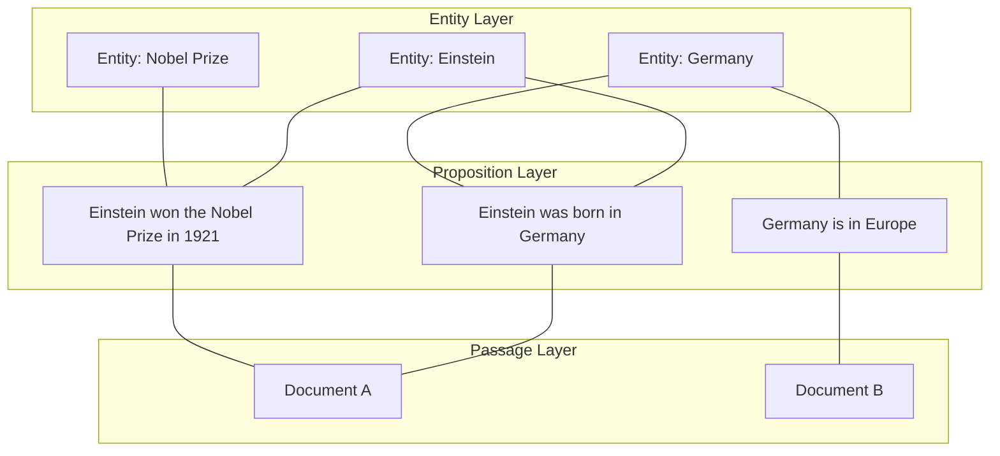
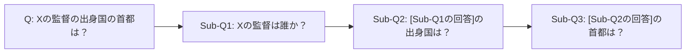

本記事は [GRASP: Graph Agentic Search over Propositions for Multi-hop Question Answering (arXiv:2605.16598)](https://arxiv.org/abs/2605.16598) の解説記事です。

## 論文概要

Jenkins, Vinayak, Hu (University of Wisconsin-Madison, 2026) は、マルチホップ質問応答における精度とトークン効率のトレードオフを解消するエージェントシステム GRASP を提案している。GRASPはエンティティ・命題・パッセージの3層階層グラフを構築し、依存関係を考慮したクエリ分解と動的なサブエージェント数のスケーリングにより、固定的なクエリ構造に依存しない柔軟な探索を実現する。著者らは、MuSiQueでExact Match (EM) 0.505を達成しつつ、IRCoT+HippoRAG2比でトークン消費を50%削減したと報告している（論文Table 1, Table 2）。

この記事は [Zenn記事: Neo4j×LangGraphでAgentic GraphRAGを実装しマルチホップ質問応答精度を高める](https://zenn.dev/0h_n0/articles/968106e107c3ea) の深掘りである。Zenn記事ではNeo4jとLangGraphを用いたAgentic GraphRAGの実装を解説しているが、GRASPはその学術的基盤として、グラフ上のエージェント探索がなぜマルチホップQAに有効なのかを理論と実験の両面から示している。

## 情報源

- **arXiv ID**: 2605.16598
- **URL**: [https://arxiv.org/abs/2605.16598](https://arxiv.org/abs/2605.16598)
- **著者**: Stockton Jenkins, Ramya Korlakai Vinayak, Junjie Hu（University of Wisconsin-Madison）
- **投稿日**: 2026年5月15日
- **分野**: cs.CL, cs.AI, cs.IR

## 背景と動機

マルチホップ質問応答（Multi-hop QA）は、複数の文書を横断的に推論して回答を導出するタスクである。例えば「Xの監督の出身国の首都は？」という質問には、「Xの監督→Y」「Yの出身国→Z」「Zの首都→Answer」という3段階の推論が必要となる。

従来手法には大きく2つの課題がある。第一に、IRCoTやSelf-RAGなどのiterativeな検索手法はクエリごとに独立した検索を繰り返すため、ホップ数に比例してトークン消費が増大する。第二に、HippoRAGやGraphReaderなどのグラフベース手法はエンティティ間の関係を活用するが、固定的なトリプル抽出（SPO: Subject-Predicate-Object）に依存するため、複雑な文脈を持つ命題の表現力が不足する。

著者らはこれらの課題に対し、命題（Proposition）という自己完結的な情報単位を導入し、エンティティとパッセージを結ぶ中間層として階層グラフに組み込むアプローチを提案している。

## 主要な貢献

- **3層階層グラフアーキテクチャ**: エンティティ・命題・パッセージの3層構造により、トリプルベースのグラフ（HippoRAG2等）よりも豊かな文脈を保持しつつ、効率的なグラフ探索を実現した
- **ハイブリッド検索とRankVote集約**: ベクトル類似度とBM25を組み合わせた検索に、reciprocal-rank votingによるパッセージスコア集約を加え、passage recallを0.848から0.904に向上させた（論文Table 5）
- **依存関係考慮型クエリ分解**: LLMプランナーがサブクエリ間の依存関係を明示的にモデル化し、独立なサブクエリを並列実行するサブエージェント協調を実現した
- **Success Economy指標**: 精度とトークン効率を統合的に評価する新しいメトリクスを導入し、トークン効率を含めた公正な手法比較を可能にした

## 技術的詳細

### 3層階層グラフアーキテクチャ

GRASPの中核データ構造は、3層の階層グラフ $\mathcal{G} = (\mathcal{V}_e, \mathcal{V}_p, \mathcal{V}_d, \mathcal{E})$ である。



各層の役割は以下の通りである。

- **Entity Layer** ($\mathcal{V}_e$): 型付きエンティティノード。コサイン類似度の閾値 $\tau = 0.7$ で重複排除を行い、同一エンティティの異なる表記（"Albert Einstein" と "Einstein"）を統合する
- **Proposition Layer** ($\mathcal{V}_p$): 原子的（atomic）かつ自己完結的（self-contained）な命題ノード。HippoRAG2のSPOトリプルと異なり、文脈情報を保持した自然言語文として表現される
- **Passage Layer** ($\mathcal{V}_d$): ソースドキュメントノード。命題の出典を追跡可能にする

辺集合 $\mathcal{E}$ は、エンティティと命題の間（エンティティが命題に出現する関係）、および命題とパッセージの間（命題がパッセージから抽出された関係）を接続する。

### ハイブリッド検索とエンティティスコアリング

各サブクエリ $s_i$ に対して、キーワード集合 $\mathcal{K}$ を抽出し、以下のハイブリッドスコアで命題を検索する（論文 式1）。

$$
\sigma(s_i, \mathcal{K}, p_j) = \cos(\mathbf{e}_{s_i} \cdot \mathbf{e}_{p_j}) + \lambda \cdot \log(1 + \text{BM25}(\mathcal{K}, p_j))
$$

ここで、
- $\mathbf{e}_{s_i}$: サブクエリ $s_i$ の埋め込みベクトル
- $\mathbf{e}_{p_j}$: 命題 $p_j$ の埋め込みベクトル
- $\mathcal{K}$: サブクエリから抽出されたキーワード集合
- $\lambda = 0.2$: BM25項の重み係数
- $\text{BM25}(\mathcal{K}, p_j)$: キーワード $\mathcal{K}$ に対する命題 $p_j$ のBM25スコア

上位 $m = 50$ 件の命題を取得した後、関連するエンティティのスコアを以下で計算する（論文 式2）。

$$
\text{score}(e_i) = \frac{\sum_{p_j \in \mathcal{P}_m(e_i)} \sigma(s_i, \mathcal{K}, p_j)}{\sqrt{1 + d(e_i)}}
$$

ここで、
- $\mathcal{P}_m(e_i)$: 上位 $m$ 命題のうちエンティティ $e_i$ に関連するものの集合
- $d(e_i)$: エンティティ $e_i$ の次数（接続する命題の数）
- 分母の $\sqrt{1 + d(e_i)}$: 高次数ノードへのバイアスを抑制するための正規化項

上位 $k = 5$ 件のエンティティを選択し、各エンティティから $d = 2$ 件のパッセージを取得する。

### RankVote集約

各サブエージェントが独立に検索したパッセージを、最終的なコンテキストとして統合する際に、reciprocal-rank votingを適用する。

$$
\text{score}(D) = \sum_{p_j \in \mathcal{P}(D)} w_j, \quad w_j = \frac{1}{1 + R(p_j)}
$$

ここで、
- $D$: パッセージ（ドキュメント）
- $\mathcal{P}(D)$: パッセージ $D$ に含まれる命題の集合
- $R(p_j)$: 命題 $p_j$ のランク順位
- $w_j$: reciprocal-rank重み（ランクが高いほど大きい）

この集約方式により、著者らは模擬エージェント設定でpassage recallが0.848から0.904に向上したと報告している（論文Table 5）。シングルパス設定でも0.610から0.729への向上が確認されている。

### サブエージェント協調メカニズム

GRASPのプランナーは、質問をサブクエリに分解する際に依存関係を明示的にモデル化する。



依存関係のないサブクエリは並列に実行され、依存関係があるサブクエリは前段の結果を待って逐次実行される。この設計により、サブエージェント数がクエリの複雑度に応じて動的にスケーリングされる。著者らはプランナーの分解精度として全体82.2%（2-hop: 89.4%、3-hop: 78.5%、4-hop: 66.9%）を報告している（論文Table 7）。

## 実装のポイント

GRASPを実装する際の主要な考慮点を以下に整理する。

**グラフ構築フェーズ**では、命題抽出にLLMを使用する。著者らはHippoRAG2比で69%少ないトークン（5.4M vs 17.6M）でインデックスを構築できたと報告している（論文Section 5.4）。命題の品質がシステム全体の精度に直接影響するため、原子性（1命題に1事実）と自己完結性（代名詞解決済み）の確保が重要である。

**エンティティ重複排除**では、$\tau = 0.7$ の閾値が推奨されている。低すぎると異なるエンティティが統合され、高すぎると同一エンティティの異なる表記が別ノードとして残る。

**ハイパーパラメータ**として、著者らは $\lambda = 0.2$（BM25重み）、$m = 50$（候補命題数）、$k = 5$（候補エンティティ数）、$d = 2$（エンティティあたりパッセージ数）を使用している。特に $\lambda$ はベクトル検索とキーワード検索のバランスを制御するため、ドメイン固有の語彙が多い場合は値を大きくすることが考えられる。

**グラフデータベースの選択**としては、Neo4jやNetworkXが候補となる。Zenn記事で解説されているNeo4j+LangGraphの組み合わせは、GRASPの3層グラフを直接実装するのに適している。Cypherクエリでエンティティからの近傍探索を効率的に実行できる。

## Production Deployment Guide

GRASPはグラフ構築・検索・LLM推論の3段階パイプラインで構成されるため、各段階に適したAWSサービスを選定する。

### AWS実装パターン（コスト最適化重視）

**トラフィック量別の推奨構成**:

| 項目 | Small (~100 req/日) | Medium (~1,000 req/日) | Large (10,000+ req/日) |
|------|-------------------|---------------------|---------------------|
| コンピュート | Lambda (1024MB, 60s) | ECS Fargate (2vCPU, 4GB) | EKS + Karpenter (Spot) |
| グラフDB | Neptune Serverless | Neptune (db.r6g.large) | Neptune (db.r6g.2xlarge) |
| ベクトル検索 | OpenSearch Serverless | OpenSearch (r6g.large.search) | OpenSearch (r6g.2xlarge.search x 3) |
| LLM推論 | Bedrock (on-demand) | Bedrock (Batch API) | Bedrock (Provisioned Throughput) |
| キャッシュ | DynamoDB (On-Demand) | ElastiCache Redis (cache.t4g.small) | ElastiCache Redis (cache.r7g.large) |
| 月額概算 | $80-180 | $500-900 | $3,000-6,000 |

上記はAWS ap-northeast-1（東京）リージョンの2026年8月時点の概算値である。実際のコストはトラフィックパターン、バースト使用量、リージョンにより変動するため、AWS Pricing Calculatorでの確認を推奨する。

**Small構成の内訳**:
- Neptune Serverless: ~$30/月（NCU最小設定）
- OpenSearch Serverless: ~$25/月（最小OCU）
- Lambda: ~$5/月（100回/日 × 60秒）
- Bedrock Claude Sonnet: ~$15/月（100 req × 15K tokens/req平均）
- DynamoDB On-Demand: ~$5/月

**コスト削減テクニック**:
- Bedrock Batch APIを使用することでオンデマンド比50%削減が可能
- Neptune Serverlessの最小/最大NCUを適切に設定し、アイドル時のコストを抑制
- OpenSearch Serverlessの最小OCUを1に設定（デフォルトは2）
- Prompt Cachingの有効化で繰り返しパターンのあるシステムプロンプトのコストを30-90%削減

### Terraformインフラコード

**Small構成（Serverless）**:

```hcl
# --- VPC基盤（NAT Gateway不使用でコスト削減） ---
module "vpc" {
  source  = "terraform-aws-modules/vpc/aws"
  version = "~> 5.13"

  name = "grasp-qa-vpc"
  cidr = "10.0.0.0/16"

  azs             = ["ap-northeast-1a", "ap-northeast-1c"]
  private_subnets = ["10.0.1.0/24", "10.0.2.0/24"]
  public_subnets  = ["10.0.101.0/24", "10.0.102.0/24"]

  enable_nat_gateway = false  # コスト削減: VPCエンドポイント使用
}

# --- VPCエンドポイント（NAT Gateway代替） ---
resource "aws_vpc_endpoint" "bedrock" {
  vpc_id              = module.vpc.vpc_id
  service_name        = "com.amazonaws.ap-northeast-1.bedrock-runtime"
  vpc_endpoint_type   = "Interface"
  subnet_ids          = module.vpc.private_subnets
  private_dns_enabled = true
}

# --- IAMロール（最小権限） ---
resource "aws_iam_role" "grasp_lambda" {
  name = "grasp-lambda-role"
  assume_role_policy = jsonencode({
    Version = "2012-10-17"
    Statement = [{
      Action = "sts:AssumeRole"
      Effect = "Allow"
      Principal = { Service = "lambda.amazonaws.com" }
    }]
  })
}

resource "aws_iam_role_policy" "grasp_lambda_policy" {
  name = "grasp-lambda-policy"
  role = aws_iam_role.grasp_lambda.id
  policy = jsonencode({
    Version = "2012-10-17"
    Statement = [
      {
        Effect   = "Allow"
        Action   = ["bedrock:InvokeModel"]
        Resource = "arn:aws:bedrock:ap-northeast-1::foundation-model/anthropic.claude-*"
      },
      {
        Effect   = "Allow"
        Action   = ["neptune-db:connect", "neptune-db:ReadDataViaQuery"]
        Resource = "*"
      },
      {
        Effect   = "Allow"
        Action   = ["dynamodb:GetItem", "dynamodb:PutItem", "dynamodb:Query"]
        Resource = aws_dynamodb_table.grasp_cache.arn
      }
    ]
  })
}

# --- Lambda関数 ---
resource "aws_lambda_function" "grasp_qa" {
  function_name = "grasp-qa-handler"
  runtime       = "python3.12"
  handler       = "handler.lambda_handler"
  role          = aws_iam_role.grasp_lambda.arn
  timeout       = 60
  memory_size   = 1024

  environment {
    variables = {
      NEPTUNE_ENDPOINT  = aws_neptune_cluster.grasp.endpoint
      OPENSEARCH_DOMAIN = aws_opensearch_serverless_collection.grasp.collection_endpoint
      BEDROCK_MODEL_ID  = "anthropic.claude-sonnet-4-20250514"
    }
  }

  tracing_config {
    mode = "Active"  # X-Ray有効化
  }
}

# --- DynamoDBキャッシュ（On-Demand） ---
resource "aws_dynamodb_table" "grasp_cache" {
  name         = "grasp-passage-cache"
  billing_mode = "PAY_PER_REQUEST"  # コスト最適化: On-Demand
  hash_key     = "query_hash"

  attribute {
    name = "query_hash"
    type = "S"
  }

  ttl {
    attribute_name = "expires_at"
    enabled        = true
  }

  server_side_encryption {
    enabled = true  # KMS暗号化
  }
}

# --- CloudWatchアラーム ---
resource "aws_cloudwatch_metric_alarm" "bedrock_cost" {
  alarm_name          = "grasp-bedrock-token-spike"
  comparison_operator = "GreaterThanThreshold"
  evaluation_periods  = 1
  metric_name         = "InputTokenCount"
  namespace           = "AWS/Bedrock"
  period              = 3600
  statistic           = "Sum"
  threshold           = 100000  # 1時間あたり10万トークン超過で警告
  alarm_actions       = [aws_sns_topic.alerts.arn]
}
```

**Large構成（Container）**:

```hcl
# --- EKSクラスタ ---
module "eks" {
  source  = "terraform-aws-modules/eks/aws"
  version = "~> 20.24"

  cluster_name    = "grasp-qa-cluster"
  cluster_version = "1.31"
  vpc_id          = module.vpc.vpc_id
  subnet_ids      = module.vpc.private_subnets

  cluster_endpoint_public_access = false  # セキュリティ: プライベートのみ
}

# --- Karpenter Provisioner（Spot優先） ---
resource "kubectl_manifest" "karpenter_nodepool" {
  yaml_body = yamlencode({
    apiVersion = "karpenter.sh/v1"
    kind       = "NodePool"
    metadata   = { name = "grasp-spot" }
    spec = {
      template = {
        spec = {
          requirements = [
            { key = "karpenter.sh/capacity-type", operator = "In", values = ["spot", "on-demand"] },
            { key = "node.kubernetes.io/instance-type", operator = "In",
              values = ["m7g.xlarge", "m7g.2xlarge", "c7g.xlarge", "c7g.2xlarge"] }
          ]
        }
      }
      disruption = {
        consolidationPolicy = "WhenEmptyOrUnderutilized"
        consolidateAfter    = "30s"
      }
      limits = { cpu = "64", memory = "128Gi" }
    }
  })
}

# --- AWS Budgets ---
resource "aws_budgets_budget" "grasp_monthly" {
  name         = "grasp-monthly-budget"
  budget_type  = "COST"
  limit_amount = "5000"
  limit_unit   = "USD"
  time_unit    = "MONTHLY"

  notification {
    comparison_operator       = "GREATER_THAN"
    threshold                 = 80
    threshold_type            = "PERCENTAGE"
    notification_type         = "ACTUAL"
    subscriber_email_addresses = ["ops-team@example.com"]
  }
}
```

### 運用・監視設定

**CloudWatch Logs Insights クエリ**（コスト異常検知）:

```
fields @timestamp, @message
| filter @message like /token/
| stats sum(input_tokens) as total_input, sum(output_tokens) as total_output by bin(1h)
| sort @timestamp desc
```

**CloudWatch アラーム設定（Python）**:

```python
import boto3

cloudwatch = boto3.client("cloudwatch", region_name="ap-northeast-1")

def create_bedrock_token_alarm(sns_topic_arn: str) -> None:
    """Bedrockトークン使用量のスパイク検知アラームを作成する"""
    cloudwatch.put_metric_alarm(
        AlarmName="grasp-bedrock-input-token-spike",
        MetricName="InputTokenCount",
        Namespace="AWS/Bedrock",
        Statistic="Sum",
        Period=3600,
        EvaluationPeriods=1,
        Threshold=500000,
        ComparisonOperator="GreaterThanThreshold",
        AlarmActions=[sns_topic_arn],
    )
```

**X-Ray トレーシング設定（Python）**:

```python
from aws_xray_sdk.core import xray_recorder, patch_all

patch_all()  # boto3, requests等を自動計装

@xray_recorder.capture("grasp_search")
def search_propositions(query: str, top_m: int = 50) -> list[dict]:
    """命題検索にX-Rayトレースを付与する"""
    xray_recorder.current_subsegment().put_annotation("query_length", len(query))
    xray_recorder.current_subsegment().put_metadata("top_m", top_m)
    # ... 検索ロジック
    return results
```

**Cost Explorer自動レポート（Python）**:

```python
import boto3
from datetime import date, timedelta

ce = boto3.client("ce", region_name="us-east-1")
sns = boto3.client("sns", region_name="ap-northeast-1")

def daily_cost_report(sns_topic_arn: str) -> None:
    """日次コストレポートを取得し、閾値超過時にSNS通知する"""
    today = date.today()
    yesterday = today - timedelta(days=1)
    response = ce.get_cost_and_usage(
        TimePeriod={"Start": str(yesterday), "End": str(today)},
        Granularity="DAILY",
        Metrics=["UnblendedCost"],
        GroupBy=[{"Type": "DIMENSION", "Key": "SERVICE"}],
    )
    total = sum(
        float(g["Metrics"]["UnblendedCost"]["Amount"])
        for g in response["ResultsByTime"][0]["Groups"]
    )
    if total > 100:
        sns.publish(
            TopicArn=sns_topic_arn,
            Subject="GRASP Daily Cost Alert",
            Message=f"Daily cost: ${total:.2f} (threshold: $100)",
        )
```

### コスト最適化チェックリスト

**アーキテクチャ選択**:
- [ ] トラフィック量に応じた構成を選択（~100 req/日: Serverless、~1,000: Hybrid、10,000+: Container）
- [ ] Neptune ServerlessのNCU上限を適切に設定（過剰プロビジョニング防止）
- [ ] OpenSearch ServerlessのOCU最小値を1に設定

**リソース最適化**:
- [ ] EC2/EKS: Spot Instances優先（Karpenter consolidationPolicy設定）
- [ ] Reserved Instances: Neptune/OpenSearch用に1年コミット（最大40%削減）
- [ ] Savings Plans: コンピュート使用量に対してSavings Plans検討
- [ ] Lambda: Power Tuningで最適メモリサイズを決定（cost vs latency）
- [ ] EKS: Karpenter consolidateAfterを30秒に設定（アイドルノード即時回収）
- [ ] Neptune: AutoScalingでリードレプリカを動的調整

**LLMコスト削減**:
- [ ] Bedrock Batch API使用（非リアルタイム処理で50%削減）
- [ ] Prompt Caching有効化（システムプロンプト部分で30-90%削減）
- [ ] モデル選択ロジック: 単純なサブクエリにはHaikuを使用、複雑な推論のみSonnet
- [ ] トークン数制限: max_tokensを適切に設定（過剰生成防止）
- [ ] グラフ構築は一括バッチ処理でBatch API適用

**監視・アラート**:
- [ ] AWS Budgets: 月額予算アラート（80%/100%閾値）
- [ ] CloudWatch アラーム: Bedrockトークン使用量スパイク検知
- [ ] Cost Anomaly Detection: 自動異常検知有効化
- [ ] 日次コストレポート: Lambda + Cost Explorer APIで自動取得
- [ ] X-Ray: エンドツーエンドのレイテンシトレーシング

**リソース管理**:
- [ ] 未使用リソース削除: 定期的なリソース棚卸し
- [ ] タグ戦略: Project/Environment/Ownerタグを全リソースに付与
- [ ] DynamoDBキャッシュ: TTL設定で自動期限切れ
- [ ] S3ライフサイクルポリシー: 古いインデックスデータをGlacierに移行
- [ ] 開発環境: 夜間・休日のNeptune/OpenSearch停止スケジュール

## 実験結果

著者らは3つのマルチホップQAベンチマーク（MuSiQue, 2WikiMultihopQA, HotpotQA）で評価を実施している。

**検索設定（Retrieval setting）での主要結果**（論文Table 1）:

| データセット | 手法 | EM | F1 | Judge | Tokens |
|-------------|------|------|------|-------|--------|
| MuSiQue | GRASP | 0.505 | 0.651 | 0.765 | 15.89M |
| MuSiQue | IRCoT+HippoRAG2 | 0.478 | 0.604 | — | 31.49M |
| 2WikiMultihopQA | GRASP | 0.737 | 0.825 | 0.943 | 10.9M |
| 2WikiMultihopQA | IRCoT+HippoRAG2 | 0.717 | 0.805 | — | 21.52M |
| HotpotQA | GRASP | 0.627 | 0.772 | — | 12.68M |
| HotpotQA | IRCoT+HippoRAG2 | 0.678 | 0.807 | — | 26.82M |

MuSiQueと2WikiMultihopQAではGRASPがEM・F1ともに上回り、トークン消費はそれぞれ50%・49%削減されている。HotpotQAではIRCoT+HippoRAG2がEM 0.678で上回るが、GRASPのトークン消費は53%少ない。

著者らはSuccess Economy指標（論文 式3）を導入し、精度あたりのトークンコストを評価している。

$$
C_w = \frac{\sum_{i=1}^{N} \mathcal{T}_i}{\sum_{i=1}^{N} w_i \cdot \mathbb{1}[\text{EM}_i = 1]}
$$

ここで $\mathcal{T}_i$ は質問 $i$ のトークン消費量、$w_i$ は質問の重み、$\mathbb{1}[\text{EM}_i = 1]$ は正答時1となる指示関数である。MuSiQue検索設定でGRASPは12,616に対しIRCoT+HippoRAG2は26,655と報告されており（論文Table 3）、GRASPが約2.1倍効率的であることが示されている。

**Ablation結果**（論文Table 4）: 命題ベースの表現（EM 0.505）はHippoRAGトリプルベース（EM 0.496）を上回り、命題の表現力の優位性が確認されている。

## 実運用への応用

GRASPの実運用での活用を考える際、以下の点が重要である。

**ナレッジベースQAシステム**: 社内文書を3層グラフとしてインデックス化し、複数文書にまたがる質問に対して高精度な回答を生成できる。特にコンプライアンスや法務文書など、正確な出典追跡が求められるユースケースに適している。命題層がパッセージの出典を保持しているため、回答の根拠を明示しやすい。

**トークンコスト最適化**: 著者らが報告するIRCoT+HippoRAG2比50%のトークン削減は、LLM API料金の直接的な削減に寄与する。月間10,000件のクエリを処理するシステムでは、Bedrock Claude Sonnet使用時に月額数百ドル規模の削減が見込まれる。

**スケーラビリティの課題**: グラフ構築に5.4Mトークンを消費する点（論文Section 5.4）は、大規模コーパスでは初期コストが課題となる。ただし、HippoRAG2の17.6Mトークンと比較すると69%少なく、相対的には効率的である。Zenn記事で解説されているNeo4j+LangGraphアーキテクチャは、GRASPの3層グラフを直接実装する基盤として活用できる。

## 関連研究

- **HippoRAG2** (2024): 人間の海馬記憶メカニズムに着想を得たグラフベースRAG。SPOトリプルによるナレッジグラフを構築するが、GRASPは命題ベースの表現がトリプルよりも豊かな文脈を保持できることを実験的に示している（論文Table 4）
- **IRCoT** (2023): Chain-of-Thoughtに基づくiterativeな検索手法。精度は高いがイテレーションごとにLLM呼び出しが必要でトークン効率が低い。GRASPはグラフ探索で検索を効率化している
- **GraphReader** (2024): グラフベースの長文書読解エージェント。拡張コンテキスト設定でGRASPとの比較がなされ、GRASPはMuSiQueでEM 0.510 vs 0.480、トークン37%削減と報告されている（論文Table 2）

## まとめと今後の展望

GRASPは、命題という自己完結的な情報単位を中間層とする3層階層グラフと、依存関係を考慮したサブエージェント協調により、マルチホップQAの精度とトークン効率を同時に改善する手法である。特にMuSiQueや2WikiMultihopQAではベースライン手法を上回る精度を達成しつつ、トークン消費を約50%削減した点が注目される。

一方、HotpotQAでは精度面でIRCoT+HippoRAG2に及ばない点、プランナー精度が4-hopで66.9%に低下する点（論文Table 7）は今後の課題である。エラー分析（論文Section 5.5）では推論エラーが80%を占めており、LLM自体の推論能力がボトルネックとなっている。今後の研究としては、より高精度なクエリ分解手法や、グラフ構造を活用した推論過程の検証メカニズムが考えられる。

## 参考文献

- **arXiv**: [https://arxiv.org/abs/2605.16598](https://arxiv.org/abs/2605.16598)
- **Related Zenn article**: [Neo4j×LangGraphでAgentic GraphRAGを実装しマルチホップ質問応答精度を高める](https://zenn.dev/0h_n0/articles/968106e107c3ea)
