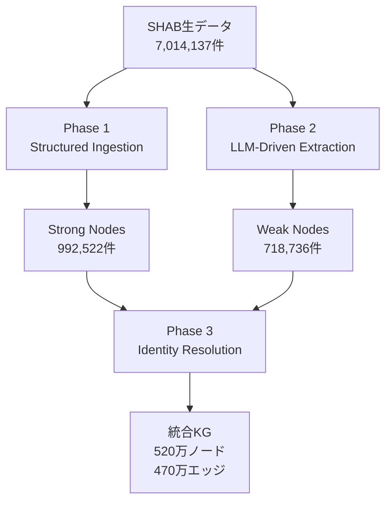
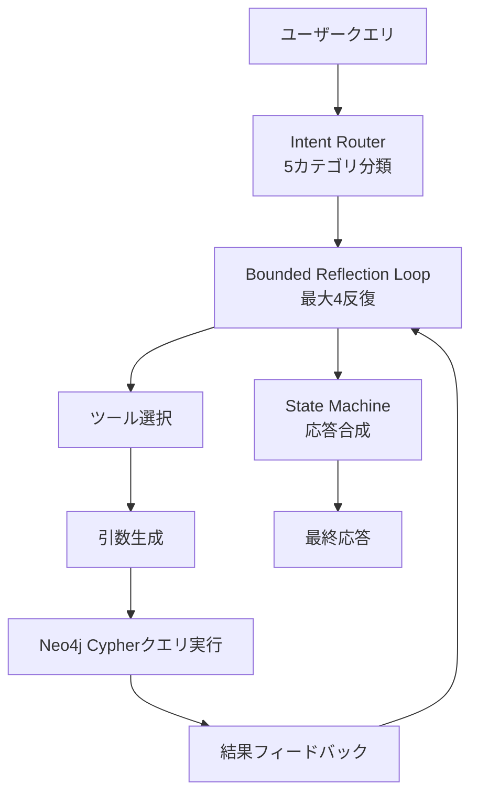
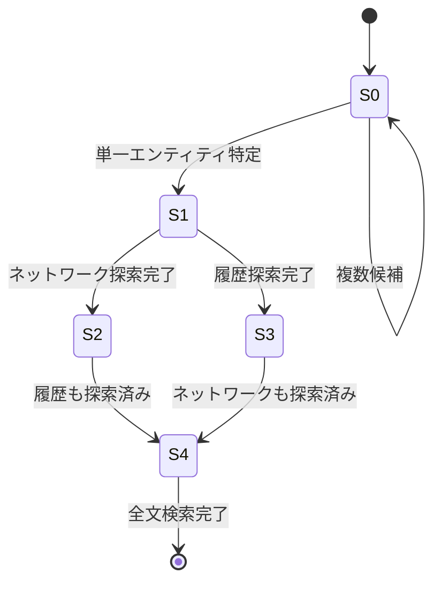

本記事は [Agentic GraphRAG (arXiv:2605.18770)](https://arxiv.org/abs/2605.18770) の解説記事です。

## 論文概要

Capozzi & Helbing (2026, ETH Zurich) は、スイス公報（SHAB: Swiss Official Gazette of Commerce）の700万件超の商業登記データをNeo4jナレッジグラフに変換し、エージェントベースの分析システムを構築している。3フェーズのグラフ構築パイプライン（構造化取り込み、LLM駆動抽出、同一性解決）により520万ノード・470万エッジのグラフを構築し、意図ルーティング・バウンデッドリフレクション・状態マシン応答合成を備えた分析エージェントが、手動キュレーションベンチマークでCorrectness 0.828を達成している。フラットRAGベースライン（Hybrid Dense+Lexical）のCorrectness 0.262に対し、219%の改善を報告している。

この記事は [Zenn記事: Neo4j×LangGraphでAgentic GraphRAGを実装しマルチホップ質問応答精度を高める](https://zenn.dev/0h_n0/articles/968106e107c3ea) の深掘りです。Zenn記事ではNeo4jとLangGraphを用いたAgentic GraphRAGの実装パターンを解説しているが、本論文はその手法を700万件規模の実データに適用し、4層の定量評価で有効性を検証した事例である。

## 情報源

- **arXiv ID**: 2605.18770
- **URL**: [https://arxiv.org/abs/2605.18770](https://arxiv.org/abs/2605.18770)
- **著者**: Arthur Capozzi, Dirk Helbing
- **所属**: ETH Zurich
- **提出日**: 2026年4月15日（v2: 2026年7月24日）
- **分野**: cs.IR, cs.AI
- **ライセンス**: CC BY 4.0

## 関連Zenn記事

- [Neo4j×LangGraphでAgentic GraphRAGを実装しマルチホップ質問応答精度を高める](https://zenn.dev/0h_n0/articles/968106e107c3ea)

## 背景と動機

### 商業登記分析の課題

公的商業登記データは企業の設立・合併・破産・清算などの法的イベントを記録する重要な情報源である。しかし、以下の課題がある。

1. **データ規模**: スイスのSHABだけで700万件超のレコードが存在し、7年分（2018年9月〜2025年9月）にわたる
2. **非構造化テキスト**: 法的公報テキストには、構造化フィールドに含まれない隠れたアクター（清算人、債権者、受託者等）の情報が埋もれている
3. **エンティティの曖昧性**: 同一人物・企業が異なる表記（"Doe, John" vs "John Doe"）で登場するため、名寄せが不可欠
4. **多言語対応**: ドイツ語・フランス語・イタリア語の3言語で記録される

従来のフラットなベクトル検索（Dense Vector-RAG）では、エンティティ間の関係性やマルチホップ推論が必要なクエリに対応できない。著者らは、構造化されたナレッジグラフとエージェントベースの分析を組み合わせることで、監査可能な（auditable）形で商業登記分析を実現する手法を提案している。

## 主要な貢献

著者らの主要な貢献は以下の4点である。

1. **3フェーズKG構築パイプライン**: 構造化データの決定論的取り込み、LLMによる非構造化テキストからのエンティティ抽出、アルファベット順トークン化による同一性解決を統合し、520万ノード・470万エッジのグラフを構築
2. **エージェント型分析アーキテクチャ**: 意図ルーティング（5カテゴリ）、バウンデッドリフレクション（最大4反復）、状態マシン応答合成（5状態）を組み合わせたグラフ分析エージェント
3. **4層評価フレームワーク**: エンティティ解決精度（Tier 1）、エージェント軌跡（Tier 2）、回答品質（Tier 3）、会話性能（Tier 4）の4段階で包括的に評価
4. **フラットRAGとの定量比較**: 手動キュレーションベンチマーク（N=60）で、Correctnessが最良フラットRAGの0.262から0.828へ219%改善

## 技術的詳細

### 3フェーズKG構築パイプライン

著者らのKG構築は、データの信頼度に応じて3段階で処理する。



#### Phase 1: Structured Ingestion（Strong Nodes）

検証済みメタデータからCompany・Person・Eventノードを決定論的に抽出する。

- **Companyノード**: Swiss UID（法人番号）、法形態、資本金（名目/払込）、事業目的、登記住所を格納
- **Personノード**: 創業者、取締役、清算人等の個人情報
- **Eventノード**: スパースなメタデータと法的テキスト全文を集約

構造化カラムから明示的なエッジ（`ACQUIRED_FROM`、`INVOLVED_IN`等）を決定論的に生成する。冪等性を持つDB取り込み設計により、重複を防止している。

#### Phase 2: LLM-Driven Extraction（Weak Nodes）

GPT-4o mini（version 2024-07-18、temperature=0.0、制約付きJSON出力）を使い、Eventノードの自由テキストから隠れたエンティティを抽出する。対象は高価値イベントに限定される。

| サブルーブリック | イベント種別 | 件数 |
|---|---|---|
| HR01 | 新規設立 | 350,717 |
| KK03 | 破産 | 47,608 |
| KK02 | 破産 | 36,050 |
| KK06 | 破産停止 | 31,409 |
| LS01 | 清算 | 30,451 |
| LS02 | 清算 | 45,110 |

抽出時の工夫として、以下を著者らは報告している。

- 複合名の分割（例: "Müller und Schmidt" を2人に分離）
- 法的機関名の都市名による曖昧性解消
- ストップリスト（例: "SHAB"）によるフィルタリング
- 複雑なUID文字列を短い整数にマッピングしてコンテキスト長を削減
- イベントテキストを2,000文字に切り詰め
- バッチ処理失敗時の適応的再帰リトライ戦略

#### Phase 3: Identity Resolution

アルファベット順トークン化アルゴリズム（`generate_hub_key`）で名前を正規化し、同一エンティティを統合する。

**アルゴリズムの手順**:

1. 小文字化
2. 非英数字の除去
3. トークンに分割
4. アルファベット順にソート
5. 結合

この正規化により、"Doe, John" と "John Doe" はともに `"doejohn"` に変換され、同一エンティティとして認識される。

**Identity Resolutionの処理ステップ**:

1. 全Company・Personノードを `HAS_NAME` エッジで中央の `NameHub` ノードにリンク
2. `NameHub` ノードは正規化されたエンティティ名をキーとし、厳密なバイト単位一致のみで照合
3. 同一の正規化キーを持つ重複 `NameHub` を検出・マージ
4. Strong NodeとイベントConnectionの両方を共有するWeak Nodeを冗長として削除

著者らは保守的なアプローチを採用しており、ファジー許容は導入していない。1,000件のNameHubノードをサンプリングし、1,191件のマージ名比較を手動評価した結果、マージ精度は97.15%と報告されている（Tier 1評価、Section 5.1）。

類似度の判定にはLevenshtein距離に基づく以下の式を使用する。

$$
S(A, B) = \frac{|A| + |B| - \text{Lev}(A, B)}{|A| + |B|}
$$

$S(A, B) > 0.7$ またはトークンセットが完全一致の場合に、同一エンティティと判定する。

### エージェントアーキテクチャ



#### Intent Router

ゼロショットルーターがクエリを5つの意味カテゴリに分類し、利用可能なツールを制限する。

| カテゴリ | 説明 | 典型的なクエリ例 |
|---|---|---|
| Entity Disambiguation | エンティティの直接検索・同定 | 「ABC社を検索」 |
| Network Exploration | マルチホップの企業関係探索 | 「この取締役の他の関連企業は」 |
| Event-History Retrieval | 時系列の公報シーケンス取得 | 「2020年以降の資本変更履歴」 |
| Macro-Level Analytics | 統計的集約分析 | 「資本金上位の企業ランキング」 |
| Unrestricted Multi-Hop | 複合的な関係性クエリ | 「破産した企業の元取締役が設立した新会社」 |

Intent Routerの効果として、ルーターなし構成では失敗結果率が0.280であるのに対し、フルシステムでは0.073に低下している（Holm補正McNemar検定、$p < 0.001$）。

#### Bounded Reflection Loop

最大4反復の制限付きリフレクションにより、ツール選択・引数生成・Cypherクエリ実行・フィードバック統合を反復する。

- LLM: GPT-4o mini（temperature=0.0、ツールコーリング有効）
- 1クエリあたりのLLM呼び出し回数: 2〜6回（ルーター1回 + リフレクション0〜4回 + 合成1回）
- 平均推論ステップ数: 1.7

**利用可能なセマンティックエンドポイント**:

- エンティティ曖昧性解消（ファジーマッチング）
- ネットワーク取得
- イベント履歴
- Neo4j Lucene全文インデックスフォールバック
- 読み取り専用カスタムクエリエンドポイント（`CREATE`、`DELETE`、`MERGE`を正規表現ガードでブロック）

リフレクションの効果として、Answer Relevanceが+0.264、Information Recallが+0.185改善している（$p < 0.001$）。

#### State Machine Response Synthesis（SSM）

5つの動作状態を遷移する状態マシンにより、応答フォーマットと次のアクション提案を制御する。



| 状態 | 名称 | 動作 |
|---|---|---|
| $S_0$ | Disambiguation | 複数候補のMarkdownテーブルを出力し、ユーザーに選択を促す |
| $S_1$ | Dossier | 単一エンティティのプロファイルを出力し、ネットワーク探索・履歴参照を提案 |
| $S_2$ | Network Explored | ネットワーク探索済み。未探索の履歴参照または全文検索を提案 |
| $S_3$ | History Explored | 履歴探索済み。未探索のネットワーク探索または全文検索を提案 |
| $S_4$ | Deep Text Search | 全探索済み。Lucene全文フォールバックで非構造化証拠を提示 |

## 実装のポイント

### グラフスキーマ設計

著者らのグラフスキーマは、Strong NodesとWeak Nodesの信頼度の差を明示的にモデリングしている。

- **Strong Nodes**: 構造化データから決定論的に生成されたノード。公的記録に裏付けられた高信頼度のエンティティ
- **Weak Nodes**: LLM抽出により生成されたノード。非構造化テキストから推定されたエンティティで、信頼度はStrong Nodesより低い
- **NameHub**: エンティティ名の正規化ハブ。`BaseNode`ラベルでインデックス化され、効率的なグローバル検索を実現

この設計により、分析結果の監査可能性（auditability）が確保される。各エンティティがどのフェーズで生成されたかを追跡でき、Weak Nodeに基づく分析結果には適切な信頼度の注釈を付与できる。

### セキュリティ設計

読み取り専用カスタムクエリエンドポイントでは、正規表現ガードにより `CREATE`、`DELETE`、`MERGE` などの書き込み操作をブロックしている。エージェントがLLM生成のCypherクエリを実行する際に、グラフの意図しない変更を防止する設計である。

### LLM抽出の品質制御

Phase 2のLLM抽出では、temperature=0.0と制約付きJSON出力により決定論性を確保している。120件の手動レビューによる抽出精度は以下の通りである（Section 5.1）。

| 抽出項目 | Precision | Recall | F1 |
|---|---|---|---|
| Persons | 0.989 | 0.956 | 0.972 |
| Companies | 0.933 | 0.651 | 0.767 |
| Roles | 0.723 | 0.611 | 0.662 |
| Entity-Role Relations | 0.701 | 0.482 | 0.571 |

Person抽出はF1 0.972と高精度である一方、Role（役職）やEntity-Role Relations（エンティティと役職の関連付け）はRecallが低い。著者らはこの点について、法的テキストの複雑な文構造が原因であると分析している。

## Production Deployment Guide

本論文のシステムを本番環境に展開する際のアーキテクチャパターンを、グラフ規模別に示す。著者らはApple M2（16GB unified memory、Neo4j 8GB割り当て）でシステムを実行しているが、700万件規模のデータを本番運用するには、適切なインフラ設計が必要である。

### AWS実装パターン

#### Small構成（PoC/開発環境: ノード数 100万以下）

```
EC2 r6i.xlarge (4 vCPU, 32 GB) 1台
├── Neo4j Community Edition
│   ├── JVM Heap: 8 GB
│   └── Page Cache: 12 GB
├── Python Agent (FastAPI)
└── ChromaDB (フォールバック用)
```

**月額概算**: $200-300（EC2 + EBS gp3 100GB）

#### Medium構成（本番環境: ノード数 100万-1000万）

本論文のグラフ規模（520万ノード）に対応する構成である。

```
Application Layer
├── ALB
├── ECS Fargate (Agent Service)
│   ├── Task: 2 vCPU, 4 GB
│   └── Auto Scaling: 2-10 tasks
└── API Gateway + Lambda (Intent Router)

Data Layer
├── Neo4j AuraDB Professional
│   ├── 64 GB RAM
│   ├── 8 vCPU
│   └── Automated Backup
└── ElastiCache Redis (Session State)

Monitoring
├── CloudWatch (Metrics + Logs)
├── X-Ray (Distributed Tracing)
└── CloudWatch Alarms
```

**月額概算**: $1,500-2,500（AuraDB + Fargate + Redis）

#### Large構成（エンタープライズ: ノード数 1000万超）

```
Multi-AZ Deployment
├── Neo4j Enterprise Cluster
│   ├── Primary (r6i.4xlarge): Write
│   ├── Read Replica 1 (r6i.2xlarge): Agent Queries
│   └── Read Replica 2 (r6i.2xlarge): Analytics
├── EKS Cluster
│   ├── Agent Service (HPA)
│   ├── Batch Ingestion Service
│   └── Identity Resolution Service
└── MSK (Kafka)
    └── Event Stream for Real-time Ingestion
```

**月額概算**: $5,000-10,000

### Terraformインフラコード

Medium構成のコアリソースを定義するTerraform例を示す。

```hcl
# Neo4j AuraDB (Managed)
# AuraDBはTerraform providerが限定的なため、API経由で管理
# ここではECS + 自前Neo4jの構成例を示す

resource "aws_ecs_cluster" "graphrag" {
  name = "graphrag-agent-cluster"
  setting {
    name  = "containerInsights"
    value = "enabled"
  }
}

resource "aws_ecs_task_definition" "neo4j" {
  family                   = "neo4j-enterprise"
  requires_compatibilities = ["FARGATE"]
  network_mode             = "awsvpc"
  cpu                      = "4096"
  memory                   = "30720"

  container_definitions = jsonencode([{
    name  = "neo4j"
    image = "neo4j:5-enterprise"
    portMappings = [
      { containerPort = 7474, protocol = "tcp" },
      { containerPort = 7687, protocol = "tcp" }
    ]
    environment = [
      { name = "NEO4J_AUTH",                        value = "neo4j/changeme" },
      { name = "NEO4J_dbms_memory_heap_initial__size",   value = "8g" },
      { name = "NEO4J_dbms_memory_heap_max__size",       value = "8g" },
      { name = "NEO4J_dbms_memory_pagecache_size",       value = "12g" },
      { name = "NEO4J_ACCEPT_LICENSE_AGREEMENT",         value = "yes" }
    ]
    mountPoints = [{
      sourceVolume  = "neo4j-data"
      containerPath = "/data"
    }]
    logConfiguration = {
      logDriver = "awslogs"
      options = {
        "awslogs-group"         = "/ecs/neo4j"
        "awslogs-region"        = "ap-northeast-1"
        "awslogs-stream-prefix" = "neo4j"
      }
    }
  }])

  volume {
    name = "neo4j-data"
    efs_volume_configuration {
      file_system_id = aws_efs_file_system.neo4j.id
    }
  }
}

resource "aws_ecs_task_definition" "agent" {
  family                   = "graphrag-agent"
  requires_compatibilities = ["FARGATE"]
  network_mode             = "awsvpc"
  cpu                      = "2048"
  memory                   = "4096"

  container_definitions = jsonencode([{
    name  = "agent"
    image = "${aws_ecr_repository.agent.repository_url}:latest"
    portMappings = [
      { containerPort = 8000, protocol = "tcp" }
    ]
    environment = [
      { name = "NEO4J_URI",    value = "bolt://neo4j.internal:7687" },
      { name = "OPENAI_MODEL", value = "gpt-4o-mini" },
      { name = "MAX_REFLECTION_STEPS", value = "4" },
      { name = "QUERY_TIMEOUT_SEC",    value = "30" }
    ]
    logConfiguration = {
      logDriver = "awslogs"
      options = {
        "awslogs-group"         = "/ecs/graphrag-agent"
        "awslogs-region"        = "ap-northeast-1"
        "awslogs-stream-prefix" = "agent"
      }
    }
  }])
}

resource "aws_ecs_service" "agent" {
  name            = "graphrag-agent"
  cluster         = aws_ecs_cluster.graphrag.id
  task_definition = aws_ecs_task_definition.agent.arn
  desired_count   = 2
  launch_type     = "FARGATE"

  network_configuration {
    subnets          = var.private_subnets
    security_groups  = [aws_security_group.agent.id]
    assign_public_ip = false
  }

  load_balancer {
    target_group_arn = aws_lb_target_group.agent.arn
    container_name   = "agent"
    container_port   = 8000
  }
}

resource "aws_appautoscaling_target" "agent" {
  max_capacity       = 10
  min_capacity       = 2
  resource_id        = "service/${aws_ecs_cluster.graphrag.name}/${aws_ecs_service.agent.name}"
  scalable_dimension = "ecs:service:DesiredCount"
  service_namespace  = "ecs"
}

resource "aws_appautoscaling_policy" "agent_cpu" {
  name               = "agent-cpu-scaling"
  policy_type        = "TargetTrackingScaling"
  resource_id        = aws_appautoscaling_target.agent.resource_id
  scalable_dimension = aws_appautoscaling_target.agent.scalable_dimension
  service_namespace  = aws_appautoscaling_target.agent.service_namespace

  target_tracking_scaling_policy_configuration {
    predefined_metric_specification {
      predefined_metric_type = "ECSServiceAverageCPUUtilization"
    }
    target_value = 70.0
  }
}
```

### 運用・監視設定

本システムの監視では、エージェントの推論品質とグラフDBのパフォーマンスの両方を追跡する必要がある。

```python
# CloudWatch カスタムメトリクス送信例
import boto3
from datetime import datetime

cloudwatch = boto3.client("cloudwatch", region_name="ap-northeast-1")

def put_agent_metrics(
    query_id: str,
    intent_category: str,
    reflection_steps: int,
    latency_ms: float,
    tool_errors: int,
    success: bool,
) -> None:
    """エージェントの実行メトリクスをCloudWatchに送信する."""
    cloudwatch.put_metric_data(
        Namespace="GraphRAG/Agent",
        MetricData=[
            {
                "MetricName": "ReflectionSteps",
                "Value": reflection_steps,
                "Unit": "Count",
                "Dimensions": [
                    {"Name": "IntentCategory", "Value": intent_category},
                ],
            },
            {
                "MetricName": "QueryLatency",
                "Value": latency_ms,
                "Unit": "Milliseconds",
                "Dimensions": [
                    {"Name": "IntentCategory", "Value": intent_category},
                ],
            },
            {
                "MetricName": "ToolErrors",
                "Value": tool_errors,
                "Unit": "Count",
            },
            {
                "MetricName": "QuerySuccess",
                "Value": 1.0 if success else 0.0,
                "Unit": "Count",
            },
        ],
    )
```

**アラート設定の推奨閾値**（論文の評価結果に基づく）:

| メトリクス | 閾値 | 根拠 |
|---|---|---|
| 平均レイテンシ | > 20秒 | 論文の平均12.53秒の1.6倍 |
| リフレクションステップ数 | > 3 | 論文の平均1.7ステップの約2倍。上限4に近い場合は要調査 |
| ツールエラー率 | > 5% | 論文のツールレベルエラー率1.32%の約4倍 |
| フォールバック発動率 | > 10% | 論文のフォールバック率2.0%の5倍 |
| クエリ成功率 | < 95% | 論文では100%だが、本番では外部要因で低下しうる |

### コスト最適化チェックリスト

- [ ] **Intent Routerのローカル実行**: ルーティングは5カテゴリの分類タスクであるため、distilBERTクラスの小型モデルでローカル実行可能。LLM API呼び出しを1回削減
- [ ] **Neo4j Page Cacheの適正化**: 頻繁にアクセスされるNameHubインデックスがPage Cacheに収まるサイズを確保。不足するとディスクI/Oが増加しレイテンシが悪化
- [ ] **リフレクション回数の動的制限**: 簡単なクエリ（Entity Disambiguation）は1回のリフレクションで十分な場合が多い。Intent別に最大リフレクション数を調整
- [ ] **バッチ取り込みのスケジュール最適化**: Phase 2のLLM抽出は新規公報の公開スケジュール（平日日中）に合わせてバッチ実行し、API呼び出しコストを平準化
- [ ] **ChromaDBフォールバックの廃止検討**: 論文ではDense Vector-RAGの性能が極めて低い（Correctness 0.143）ため、フォールバック先としての有用性は限定的。Lucene全文検索で代替可能
- [ ] **EFS→EBSへの移行検討**: Neo4jデータの読み取りパフォーマンスが重要な場合、EFSよりEBS io2のIOPS保証が適切

## 実験結果

著者らは4層の評価フレームワークで包括的にシステムを検証している。

### Tier 1: エンティティ解決精度

1,000件のNameHubノードをサンプリングし、1,191件のマージ名比較を手動評価した結果、マージ精度97.15%を報告している。

### Tier 2: エージェント軌跡評価

300問の自動生成テストに対して以下の結果を報告している。

| メトリクス | 値 |
|---|---|
| 検索優先精度 | 55.7% |
| フォールバック発動率 | 2.0% |
| 平均推論ステップ数 | 1.7 |
| クエリ成功率 | 100% |
| 平均レイテンシ | 12.53秒 |

60問の手動キュレーションベンチマークでは、答えを含む証拠の取得率95.0%、正解率80.0%、ツールレベルエラー率1.32%を達成している。

### Tier 3: 回答品質評価

手動キュレーションベンチマーク（N=60）での各アーキテクチャの比較結果を示す。

| アーキテクチャ | Correctness | Answer Relevance | Information Recall |
|---|---|---|---|
| Dense Vector-RAG | 0.143 | 0.247 | 0.118 |
| Lexical Full-Text RAG | 0.237 | 0.322 | 0.261 |
| Hybrid Dense+Lexical | 0.262 | 0.470 | 0.237 |
| GraphRAG w/o reflection | 0.552 | 0.563 | 0.560 |
| GraphRAG w/o router | 0.708 | 0.777 | 0.703 |
| Structured-only GraphRAG | 0.545 | 0.733 | 0.578 |
| **Full Agentic GraphRAG** | **0.828** | **0.887** | **0.838** |

著者らは、LLM-as-Judgeフレームワーク（GPT-5、version 2025-08-07）で評価を実施しており、50件の層別サンプルによるヒューマンバリデーションでPearson $r = 0.821$、Spearman $\rho = 0.852$、Cohen's $\kappa = 0.739$ の相関を報告している（Section 5.2）。

**アブレーション分析の主要な知見**:

- **リフレクションの効果**: Answer Relevanceが+0.264、Information Recallが+0.185改善（$p < 0.001$）
- **ルーターの効果**: 失敗結果率が0.280から0.073に低下（Holm補正McNemar検定、$p < 0.001$）
- **Weak Nodes（LLM抽出）の効果**: Structured-onlyとFull Systemの比較で、Correctnessが0.545から0.828へ改善。隠れたアクターの抽出がエンティティ解決タスクの精度に大きく寄与

### Tier 4: 会話性能評価

10件のマルチターン会話（計36ターン）での評価結果を示す。

| メトリクス | Full Agentic GraphRAG | Dense Vector-RAG |
|---|---|---|
| Correctness | 0.760 | 0.344 |
| Turn Success Rate | 0.742 | 0.367 |
| Context Carryover Accuracy | 0.683 | 0.433 |
| Tool Transition Accuracy | 0.900 | N/A |

Turn Success Rateで+0.375、Context Carryover Accuracyで+0.250の改善をブートストラップ推定で報告している。

## 実運用への応用

### 適用可能なドメイン

本論文の手法は、商業登記に限らず以下のドメインに適用可能である。

- **金融コンプライアンス**: KYC（Know Your Customer）やAML（Anti-Money Laundering）における企業関係の可視化。NameHubによる名寄せは、制裁リストとのマッチングにも応用できる
- **不正検知**: 取締役の兼任関係やペーパーカンパニーのネットワーク構造を分析し、不正な法人スキームを検出
- **M&Aデューデリジェンス**: 買収対象企業の過去の法的イベント（破産、清算、資本変更）の時系列分析
- **規制当局の監視**: 大量の公報データから異常パターン（短期間での頻繁な取締役変更等）を自動検出

### 実装上の留意点

- **Identity Resolutionの精度**: 97.15%のマージ精度は高いが、520万ノード規模では約2.85%のエラーが約15万件の誤マージに相当する。金融コンプライアンス用途ではヒューマンレビューの併用が不可欠
- **多言語対応**: SHABは独・仏・伊の3言語であるが、日本の法人登記に適用する場合は日本語の形態素解析に基づく名前正規化が必要
- **リアルタイム更新**: 論文のパイプラインはバッチ処理だが、本番環境ではKafka等のイベントストリームで新規公報をリアルタイム取り込みする設計が望ましい

## 関連研究

著者らは以下の研究群との関連を議論している。

- **RAG基盤研究**: Self-RAG、RAG-Criticなどのリフレクション型検索手法。本論文のBounded Reflectionはこれらの概念をグラフ検索に特化させたものである
- **金融ナレッジグラフ**: 不正検知や投資分析向けの金融KG研究。本論文は法的登記データに特化し、LLM抽出とルールベース取り込みのハイブリッドアプローチを採用
- **GraphRAGシステム**: Microsoftの GraphRAG やその派生研究。本論文はコミュニティ検出ではなく、エンティティ中心のナレッジグラフ構築とエージェント分析を組み合わせている点で異なる

## まとめ

本論文は、700万件超の商業登記データをNeo4jナレッジグラフに変換し、エージェントベースの分析で監査可能な回答を生成するシステムを提示している。3フェーズKG構築パイプライン（構造化取り込み、LLM抽出、Identity Resolution）と3層エージェントアーキテクチャ（Intent Router、Bounded Reflection、State Machine）の組み合わせにより、フラットRAGベースラインに対してCorrectness 219%の改善（0.262 -> 0.828）を達成している。特に、リフレクションによるAnswer Relevance +0.264、ルーターによる失敗率の0.280 -> 0.073低下というアブレーション結果は、各コンポーネントの貢献を明確に示している。ただし、Identity Resolutionの2.85%のエラー率や、Role抽出のF1 0.662といった課題も残されており、実運用にはヒューマンレビューの併用が推奨される。

## 参考文献

1. Capozzi, A., & Helbing, D. (2026). Agentic Graph Retrieval-Augmented Generation for Auditable Commercial Registry Analysis. arXiv:2605.18770. [https://arxiv.org/abs/2605.18770](https://arxiv.org/abs/2605.18770)
2. Swiss Official Gazette of Commerce (SHAB). [https://www.shab.ch/](https://www.shab.ch/)
3. Neo4j Graph Database. [https://neo4j.com/](https://neo4j.com/)
