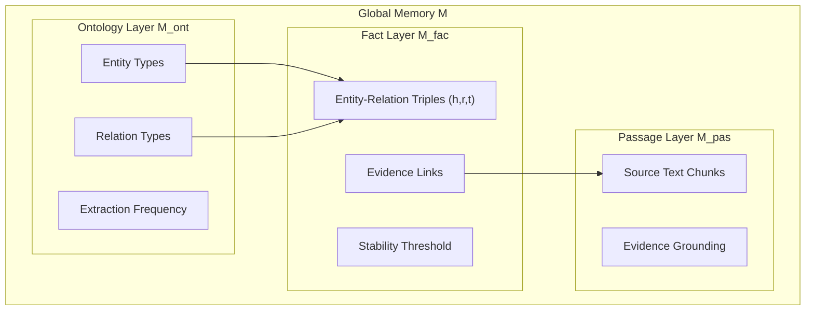
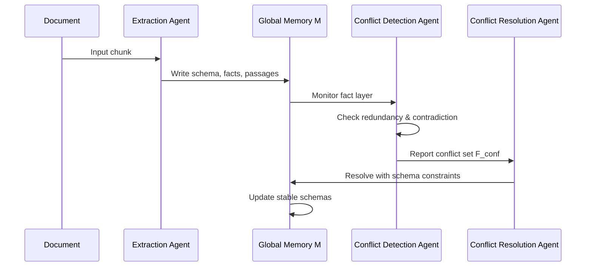
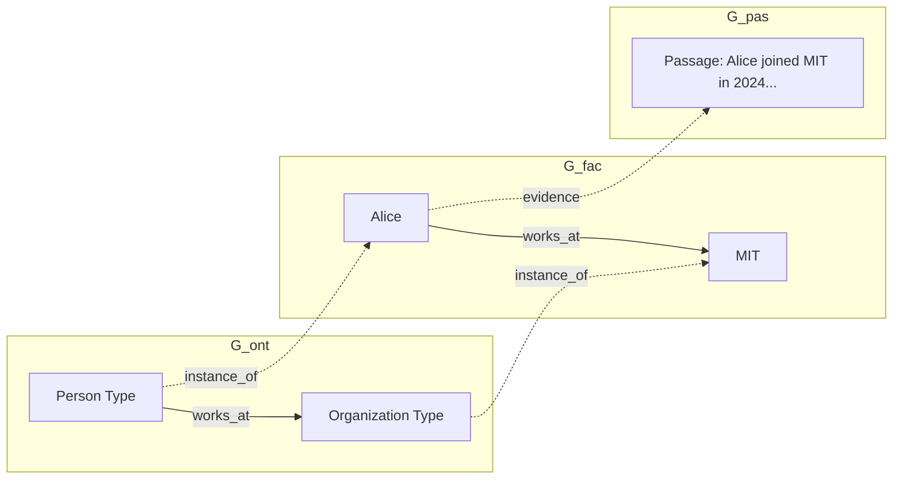

本記事は [MemGraphRAG: Memory-based Multi-Agent System for Graph Retrieval-Augmented Generation (arXiv:2606.00610)](https://arxiv.org/abs/2606.00610) の解説記事です。

## 論文概要

Wu et al. (2026) は、既存のGraphRAGが断片的なチャンクレベルのエンティティ抽出に依存し、知識グラフの整合性が低下する問題に対して、3層グローバルメモリ（オントロジー・ファクト・パッセージ）を共有する3エージェント協調システム MemGraphRAG を提案している。抽出エージェント、矛盾検出エージェント、矛盾解決エージェントがメモリを介して協調し、テーマ的ノイズ除去・整合性維持・構造的統合の3原則に基づいてグラフを構築する。5つのベンチマークでの平均精度59.25%を達成し、検索レイテンシ0.061秒でHippoRAG2比35倍高速であると報告している（論文Table 1, Table 2）。本論文はKDD 2026に採択されている。

この記事は [Zenn記事: Neo4j×LangGraphでAgentic GraphRAGを実装しマルチホップ質問応答精度を高める](https://zenn.dev/0h_n0/articles/968106e107c3ea) の深掘りです。Zenn記事ではLangGraphによるエージェント的なGraphRAG実装パターンを解説しているが、本論文はGraphRAGのグラフ構築段階でマルチエージェント協調とメモリシステムを導入し、グラフ品質そのものを向上させるアプローチを提案しており、LangGraph上でのより高品質なGraphRAGパイプライン設計に直接活用できる。

## 情報源

- **会議名**: KDD 2026（The 32nd ACM SIGKDD Conference on Knowledge Discovery and Data Mining）
- **URL**: [https://arxiv.org/abs/2606.00610](https://arxiv.org/abs/2606.00610)
- **著者**: Chuanjie Wu, Zhishang Xiang, Yunbo Tang, Zerui Chen, Qinggang Zhang, Jinsong Su（厦門大学）
- **投稿日**: 2026年5月30日
- **GitHub**: [https://github.com/XMUDeepLIT/MemGraphRAG](https://github.com/XMUDeepLIT/MemGraphRAG)

## カンファレンス情報

KDD（ACM SIGKDD Conference on Knowledge Discovery and Data Mining）はデータマイニング・知識発見分野の最高峰国際会議であり、Research Trackの採択率は例年15-20%程度である。本論文はKDD 2026のResearch Trackに採択されている。

## 背景と動機

GraphRAGは、テキストコーパスから知識グラフを構築し、グラフ構造を活用した検索で質問応答精度を向上させるアプローチである。しかし、著者らは既存のGraphRAGに以下の3つの構造的課題があることを指摘している。

第一に、**テーマ的ノイズ**の問題がある。チャンク単位のエンティティ抽出では、文脈に依存した曖昧な関係や低頻度のスキーマがノイズとしてグラフに混入する。第二に、**整合性の欠如**がある。異なるチャンクから抽出された同一エンティティの関係が矛盾する場合（例: ある人物の所属先が異なるチャンクで異なる値をとる）、既存手法は矛盾を検出・解消する仕組みを持たない。第三に、**構造的断片化**の問題がある。チャンクごとに独立にグラフを構築するため、異なるチャンク間のエンティティが接続されず、マルチホップ推論に必要なパスが断絶する。

著者らは、これらの課題を同時に解決するには、グラフ構築プロセス全体を通じて一貫したメモリを共有するマルチエージェント協調が必要であると主張している。

## 主要な貢献

著者らは以下を主要な貢献として報告している。

- **3層グローバルメモリ $\mathcal{M}$**: オントロジー層・ファクト層・パッセージ層の3層構造でスキーマ・ファクト・エビデンスを一元管理する。頻度閾値による安定スキーマの自動選定とエビデンスグラウンディングにより、グラフ品質を体系的に担保する
- **3エージェント協調アーキテクチャ**: 抽出・矛盾検出・矛盾解決の3エージェントがメモリを介して協調し、グラフ構築の全工程で整合性を維持する
- **Memory-Guided Bridging**: 型ベースと類似度ベースの2段階ブリッジエッジ生成により、チャンク間の構造的断片化を解消する
- **Memory-Aware階層的検索**: 3層メモリに対応する3種のグラフビューをPersonalized PageRankで統合検索し、HotpotQAで71.60%、検索レイテンシ0.061秒を達成

## 技術的詳細

### 3層グローバルメモリ

MemGraphRAGの中核は、全エージェントが共有する3層グローバルメモリ $\mathcal{M} = (\mathcal{M}_{\text{ont}}, \mathcal{M}_{\text{fac}}, \mathcal{M}_{\text{pas}})$ である。



**オントロジー層 $\mathcal{M}_{\text{ont}}$** はエンティティ型と関係型のスキーマを管理する。各スキーマに抽出頻度を記録し、頻度閾値 $\tau$ 以上のスキーマのみを「安定スキーマ」として昇格させる。著者らの分析によれば、この頻度フィルタリングにより低頻度のノイズトリプルの約40%が除去されると報告している（論文Section 4.3）。

**ファクト層 $\mathcal{M}_{\text{fac}}$** は具体的なエンティティ・関係トリプル $(h, r, t)$（$h$: 主語エンティティ、$r$: 関係、$t$: 目的語エンティティ）を格納する。各ファクトは安定性閾値とパッセージ層へのエビデンスリンクを持つ。

**パッセージ層 $\mathcal{M}_{\text{pas}}$** はファクトの裏付けとなる原文テキストを保持する。ファクト層の各トリプルがどのパッセージから抽出されたかを追跡することで、エビデンスグラウンディングを実現する。

### 3エージェント協調

3つのエージェントがメモリを介して協調し、グラフ構築の全工程を担う。



**抽出エージェント $A_{\text{ext}}$** は入力チャンクからスキーマ・ファクト・パッセージを抽出し、3層メモリに書き込む。このとき、各ファクトにはパッセージ層へのエビデンスリンクが付与される。

**矛盾検出エージェント $A_{\text{det}}$** はファクト層を監視し、新たに追加されたトリプル $t_{\text{new}}$ に対して冗長性と論理的矛盾を検出する。矛盾候補集合は以下で定義される。

$$
\mathcal{F}_{\text{conf}} = \{t' \in \mathcal{M}_{\text{fac}} \mid \text{Sim}(t_{\text{new}}, t') > \delta \lor \text{Match}(t_{\text{new}}, t')\}
$$

ここで $\text{Sim}(\cdot, \cdot)$ はトリプル間の意味的類似度、$\delta$ は類似度閾値、$\text{Match}(\cdot, \cdot)$ は主語・目的語の一致による矛盾検出関数である。著者らは矛盾を3タイプに分類している: (1) 相互排他的矛盾（同一エンティティに対する矛盾する属性値）、(2) 時間的矛盾（時間順序に反するファクト）、(3) 粒度矛盾（異なる粒度レベルのファクト間の不整合）。

**矛盾解決エージェント $A_{\text{res}}$** は、検出された矛盾をオントロジー層のスキーマ制約とパッセージ層の履歴エビデンスに基づいて解消する。スキーマ制約は関係の定義域・値域を規定し、エビデンスの信頼性はパッセージの出現頻度と整合性で評価される。

### テーマ的ノイズ除去と構造的統合

グラフ構築は3つの原則に基づいて進む。

**テーマ的ノイズ除去**では、オントロジー層の頻度閾値 $\tau$ を用いて低頻度スキーマをフィルタリングする。Ablation実験（論文Table 3, HotpotQA）では、このフィルタリングを除去すると精度が69.40%から67.45%へ1.95ポイント低下したと報告されている。

**構造的統合**では、Memory-Guided Bridgingにより異なるチャンク間のエンティティを接続する。型ベースブリッジはオントロジー層の型情報を用いて同一型のエンティティをリンクし、類似度ベースブリッジはファクト層のエンティティ埋め込み間の類似度で追加的な接続を生成する。

### 3種のグラフビューとMemory-Aware階層的検索

3層メモリから以下の3種のグラフビューが導出される。

- **Semantic Ontology Graph $\mathcal{G}_{\text{ont}}$**: エンティティ型と関係型のスキーマレベルのグラフ
- **Fact Graph $\mathcal{G}_{\text{fac}}$**: エンティティ関係トリプルのグラフ（マルチホップ推論の主要経路）
- **Source Evidence Graph $\mathcal{G}_{\text{pas}}$**: ファクトから裏付けパッセージへのリンクグラフ



検索時は、クエリ $q$ に対して3層から並列に候補を取得し、類似度閾値 $\tau$ でフィルタリングした後、ノードの初期重要度を計算する。

**エンティティノード**の初期スコアは、関連ファクトの平均類似度で定義される。

$$
P_{\text{init}}(e) = \frac{1}{|\mathcal{F}_e|} \sum_{f \in \mathcal{F}_e} \text{Sim}(q, f)
$$

ここで $\mathcal{F}_e$ はエンティティ $e$ に関連するファクト集合、$\text{Sim}(q, f)$ はクエリ $q$ とファクト $f$ の類似度である。

**型ノード**にはハブ抑制が適用される。

$$
P_{\text{init}}(t) = \text{relevance}(q, t) \times \frac{1}{\log(\deg(t) + 1)}
$$

$\deg(t)$ は型ノードの次数であり、多くのエンティティに接続するハブ型ノードの影響を対数的に減衰させる。

**パッセージノード**には情報密度スコアが導入される。

$$
P_{\text{init}}(p) = \text{Sim}(q, d_p) \times \alpha \times \sigma\left(\frac{\sum_{e \in \mathcal{E}_p} \text{IDF}(e)}{\log(|\mathcal{E}_p| + 1)}\right)
$$

ここで $d_p$ はパッセージテキスト、$\alpha$ は重み係数、$\sigma$ はシグモイド関数、$\mathcal{E}_p$ はパッセージ $p$ に含まれるエンティティ集合、$\text{IDF}(e)$ はエンティティ $e$ の逆文書頻度である。分母の $\log(|\mathcal{E}_p| + 1)$ はエンティティ数が多いパッセージの過度な評価を抑制する。

最終的に、Personalized PageRank（減衰因子 $\lambda = 0.5$）により初期スコアをグラフ構造に沿って伝播させ、上位ノードのパッセージをLLMに入力する。

## 実装のポイント

MemGraphRAGを実装する際の主要な設計判断を以下にまとめる。

**メモリストアの選択**: オントロジー層・ファクト層はNeo4jやMemgraph等のグラフDBに格納し、パッセージ層はベクトルDB（FAISS、Qdrant等）と原文テキストストアの組み合わせが適する。3層間のリンクはグラフDB内の参照エッジまたは外部キーで管理する。

**頻度閾値 $\tau$ の設定**: 著者らは実験で $\tau$ をデータセットごとに調整しているが、実運用ではコーパスサイズに応じて動的に設定する必要がある。初期値として全スキーマの出現頻度の中央値を基準にし、グラフの密度（エッジ数/ノード数比）をモニタリングしながら調整する手法が実践的である。

**矛盾検出の計算コスト**: 新規ファクト追加のたびにファクト層全体を走査すると $O(|\mathcal{M}_{\text{fac}}|)$ のコストがかかる。著者らのリポジトリ実装ではベクトル類似度検索による近傍探索で候補を絞り込み、計算量を抑えている。

**PPRの減衰因子**: 著者らは $\lambda = 0.5$ を使用している。一般的なPageRankの減衰因子0.85と比較して小さい値であり、初期スコアの影響を強く保持する設計となっている。マルチホップ推論ではクエリとの直接的な関連性が重要であるため、この設定は合理的である。

## Production Deployment Guide

MemGraphRAGはグラフ構築と検索の2フェーズを持つため、バッチ処理（インデキシング）とリアルタイム処理（検索）を分離したアーキテクチャが適する。

### AWS実装パターン（コスト最適化重視）

| 構成 | トラフィック | 月額コスト概算 | 主要サービス |
|------|------------|---------------|-------------|
| Small | ~100 req/日 | $150-350 | Lambda + Neptune Serverless + OpenSearch Serverless |
| Medium | ~1,000 req/日 | $800-1,500 | ECS Fargate + Neptune + OpenSearch |
| Large | 10,000+ req/日 | $3,000-6,000 | EKS + Neptune + OpenSearch + ElastiCache |

**Small構成（Serverless）**:
- **グラフDB**: Amazon Neptune Serverless（NCU: 1-2.5、3層メモリのオントロジー層・ファクト層格納、約$90/月）
- **ベクトル検索**: Amazon OpenSearch Serverless（パッセージ層の埋め込み検索、約$70/月）
- **LLM推論**: Amazon Bedrock（Claude Sonnet 4でエージェント処理、従量課金）
- **オーケストレーション**: Lambda（3エージェントの協調ロジック、128MB-512MB、約$5/月）
- **バッチインデキシング**: Step Functions + Lambda（ドキュメント取込パイプライン）

**Medium構成**:
- **グラフDB**: Neptune db.r6g.large（8GB RAM、約$350/月）
- **アプリケーション**: ECS Fargate（0.5vCPU/1GB RAM x 2タスク、PPR計算用、約$60/月）
- **ベクトル検索**: OpenSearch t3.medium.search（約$80/月）
- **キャッシュ**: ElastiCache for Redis cache.t4g.micro（PPR結果キャッシュ、約$15/月）

**Large構成**:
- **グラフDB**: Neptune db.r6g.xlarge（32GB RAM、Read Replica 1台、約$1,200/月）
- **コンピュート**: EKS + Karpenter（Spot Instances優先、c6g.xlarge、約$400/月）
- **ベクトル検索**: OpenSearch m6g.large.search x 2ノード（約$300/月）
- **キャッシュ**: ElastiCache for Redis cache.r6g.large（頻出クエリのPPR結果、約$200/月）

**コスト削減テクニック**:
- Neptune Reserved Instances購入で最大55%削減
- Bedrock Batch APIでバッチインデキシング時のLLMコスト50%削減
- Spot Instances（EKS Karpenter）でコンピュートコスト最大90%削減
- PPR結果のRedisキャッシュ（TTL 1時間）でNeptune読み取りIOPS 60-80%削減

**注意**: 上記コストは2026年8月時点のAWS ap-northeast-1（東京）リージョン料金に基づく概算値であり、実際のコストはトラフィックパターン・リージョン・バースト使用量により変動する。最新料金はAWS料金計算ツールで確認を推奨する。

### Terraformインフラコード

**Small構成（Serverless）**:

```hcl
# MemGraphRAG Small構成: Lambda + Neptune Serverless + OpenSearch Serverless

terraform {
  required_version = ">= 1.9"
  required_providers {
    aws = {
      source  = "hashicorp/aws"
      version = "~> 5.60"
    }
  }
}

provider "aws" {
  region = "ap-northeast-1"
}

# VPC（NAT Gateway不使用でコスト削減）
module "vpc" {
  source  = "terraform-aws-modules/vpc/aws"
  version = "~> 5.13"

  name = "memgraphrag-vpc"
  cidr = "10.0.0.0/16"

  azs             = ["ap-northeast-1a", "ap-northeast-1c"]
  private_subnets = ["10.0.1.0/24", "10.0.2.0/24"]
  public_subnets  = ["10.0.101.0/24", "10.0.102.0/24"]

  enable_dns_hostnames = true
  enable_dns_support   = true
}

# Neptune Serverless（オントロジー層・ファクト層）
resource "aws_neptune_cluster" "memory_graph" {
  cluster_identifier  = "memgraphrag-memory"
  engine              = "neptune"
  serverless_v2_scaling_configuration {
    min_capacity = 1.0   # コスト最適化: 最小NCU
    max_capacity = 2.5
  }
  vpc_security_group_ids = [aws_security_group.neptune.id]
  neptune_subnet_group_name = aws_neptune_subnet_group.main.name
  storage_encrypted  = true  # KMS暗号化
  skip_final_snapshot = false
}

resource "aws_neptune_cluster_instance" "main" {
  cluster_identifier = aws_neptune_cluster.memory_graph.id
  instance_class     = "db.serverless"
  engine             = "neptune"
}

# IAMロール（最小権限）
resource "aws_iam_role" "lambda_agent" {
  name = "memgraphrag-lambda-agent"
  assume_role_policy = jsonencode({
    Version = "2012-10-17"
    Statement = [{
      Action = "sts:AssumeRole"
      Effect = "Allow"
      Principal = { Service = "lambda.amazonaws.com" }
    }]
  })
}

resource "aws_iam_role_policy" "lambda_permissions" {
  name = "memgraphrag-lambda-permissions"
  role = aws_iam_role.lambda_agent.id
  policy = jsonencode({
    Version = "2012-10-17"
    Statement = [
      {
        Effect   = "Allow"
        Action   = ["neptune-db:*"]
        Resource = aws_neptune_cluster.memory_graph.arn
      },
      {
        Effect   = "Allow"
        Action   = ["bedrock:InvokeModel"]
        Resource = "arn:aws:bedrock:ap-northeast-1::foundation-model/anthropic.claude-sonnet-4-20250514-v1:0"
      },
      {
        Effect   = "Allow"
        Action   = ["logs:CreateLogGroup", "logs:CreateLogStream", "logs:PutLogEvents"]
        Resource = "arn:aws:logs:ap-northeast-1:*:*"
      }
    ]
  })
}

# Lambda関数（エージェントオーケストレーション）
resource "aws_lambda_function" "agent_orchestrator" {
  function_name = "memgraphrag-orchestrator"
  role          = aws_iam_role.lambda_agent.arn
  runtime       = "python3.12"
  handler       = "handler.lambda_handler"
  timeout       = 300           # PPR計算に十分な時間
  memory_size   = 512           # グラフ操作用
  filename      = "lambda.zip"

  environment {
    variables = {
      NEPTUNE_ENDPOINT = aws_neptune_cluster.memory_graph.endpoint
      PPR_DAMPING      = "0.5"  # 論文推奨値
      FREQ_THRESHOLD   = "3"    # スキーマ頻度閾値tau
    }
  }

  vpc_config {
    subnet_ids         = module.vpc.private_subnets
    security_group_ids = [aws_security_group.lambda.id]
  }
}

# CloudWatchアラーム（コスト監視）
resource "aws_cloudwatch_metric_alarm" "neptune_cpu" {
  alarm_name          = "memgraphrag-neptune-cpu-high"
  comparison_operator = "GreaterThanThreshold"
  evaluation_periods  = 2
  metric_name         = "CPUUtilization"
  namespace           = "AWS/Neptune"
  period              = 300
  statistic           = "Average"
  threshold           = 80
  alarm_description   = "Neptune CPU utilization exceeds 80%"
  dimensions = {
    DBClusterIdentifier = aws_neptune_cluster.memory_graph.cluster_identifier
  }
}
```

**Large構成（Container）**:

```hcl
# MemGraphRAG Large構成: EKS + Karpenter + Neptune

module "eks" {
  source  = "terraform-aws-modules/eks/aws"
  version = "~> 20.24"

  cluster_name    = "memgraphrag-cluster"
  cluster_version = "1.31"

  vpc_id     = module.vpc.vpc_id
  subnet_ids = module.vpc.private_subnets

  cluster_endpoint_public_access = false  # セキュリティ: プライベートのみ

  eks_managed_node_groups = {
    system = {
      instance_types = ["m6g.medium"]
      min_size       = 1
      max_size       = 2
      desired_size   = 1
    }
  }
}

# Karpenter Provisioner（Spot優先で最大90%コスト削減）
resource "kubectl_manifest" "karpenter_provisioner" {
  yaml_body = yamlencode({
    apiVersion = "karpenter.sh/v1"
    kind       = "NodePool"
    metadata   = { name = "memgraphrag-pool" }
    spec = {
      template = {
        spec = {
          requirements = [
            { key = "karpenter.sh/capacity-type", operator = "In", values = ["spot", "on-demand"] },
            { key = "node.kubernetes.io/instance-type", operator = "In",
              values = ["c6g.xlarge", "c6g.2xlarge", "c7g.xlarge"] },
          ]
          nodeClassRef = { name = "default" }
        }
      }
      limits   = { cpu = "32" }
      disruption = {
        consolidationPolicy = "WhenEmptyOrUnderutilized"
        consolidateAfter    = "30s"
      }
    }
  })
}

# Secrets Manager（Neptune/Bedrock設定）
resource "aws_secretsmanager_secret" "memgraphrag_config" {
  name                    = "memgraphrag/config"
  recovery_window_in_days = 7
}

# AWS Budgets（月額$5,000アラート）
resource "aws_budgets_budget" "memgraphrag" {
  name         = "memgraphrag-monthly"
  budget_type  = "COST"
  limit_amount = "5000"
  limit_unit   = "USD"
  time_unit    = "MONTHLY"

  notification {
    comparison_operator       = "GREATER_THAN"
    threshold                 = 80
    threshold_type            = "PERCENTAGE"
    notification_type         = "ACTUAL"
    subscriber_email_addresses = ["ops@example.com"]
  }
}
```

### 運用・監視設定

**CloudWatch Logs Insights クエリ**（コスト異常検知・レイテンシ分析）:

```
# 1時間あたりのグラフ検索レイテンシP95
fields @timestamp, @message
| filter event = "graph_search"
| stats percentile(duration_ms, 95) as p95_latency,
        count() as request_count
        by bin(1h) as hour
| sort hour desc

# 矛盾検出エージェントの検出数推移
fields @timestamp, @message
| filter event = "conflict_detected"
| stats count() as conflict_count by bin(1h) as hour
| sort hour desc
```

**CloudWatchアラーム設定**（Python boto3）:

```python
import boto3

cloudwatch = boto3.client("cloudwatch", region_name="ap-northeast-1")

def create_latency_alarm() -> None:
    """検索レイテンシP95が100msを超過した場合のアラーム"""
    cloudwatch.put_metric_alarm(
        AlarmName="memgraphrag-search-latency-p95",
        MetricName="SearchLatencyMs",
        Namespace="MemGraphRAG",
        Statistic="p95",
        Period=300,
        EvaluationPeriods=3,
        Threshold=100.0,
        ComparisonOperator="GreaterThanThreshold",
        AlarmActions=["arn:aws:sns:ap-northeast-1:ACCOUNT:memgraphrag-alerts"],
        Dimensions=[{"Name": "Environment", "Value": "production"}],
    )
```

**X-Ray トレーシング設定**:

```python
from aws_xray_sdk.core import xray_recorder, patch_all

patch_all()  # boto3自動計装

@xray_recorder.capture("ppr_search")
def memory_aware_search(query: str, top_k: int = 10) -> list[dict]:
    """Memory-Aware階層的検索のトレーシング付き実装"""
    subsegment = xray_recorder.current_subsegment()
    subsegment.put_annotation("query_length", len(query))
    subsegment.put_metadata("top_k", top_k)

    # 3層並列候補取得 → PPR → 結果返却
    results = execute_ppr_search(query, top_k)

    subsegment.put_metadata("result_count", len(results))
    return results
```

**Cost Explorer日次レポート**:

```python
import boto3
from datetime import date, timedelta

ce = boto3.client("ce", region_name="us-east-1")
sns = boto3.client("sns", region_name="ap-northeast-1")

def daily_cost_report() -> None:
    """日次コストレポート取得・$100/日超過でSNS通知"""
    today = date.today()
    yesterday = today - timedelta(days=1)

    response = ce.get_cost_and_usage(
        TimePeriod={"Start": str(yesterday), "End": str(today)},
        Granularity="DAILY",
        Metrics=["UnblendedCost"],
        Filter={
            "Tags": {"Key": "Project", "Values": ["memgraphrag"]}
        },
        GroupBy=[{"Type": "DIMENSION", "Key": "SERVICE"}],
    )

    total = sum(
        float(g["Metrics"]["UnblendedCost"]["Amount"])
        for r in response["ResultsByTime"]
        for g in r["Groups"]
    )

    if total > 100.0:
        sns.publish(
            TopicArn="arn:aws:sns:ap-northeast-1:ACCOUNT:memgraphrag-alerts",
            Subject=f"MemGraphRAG Cost Alert: ${total:.2f}/day",
            Message=f"Daily cost exceeded $100: ${total:.2f}",
        )
```

### コスト最適化チェックリスト

**アーキテクチャ選択**:
- [ ] トラフィック量に応じた構成選択（Small: Serverless / Medium: Hybrid / Large: Container）
- [ ] インデキシング（バッチ）と検索（リアルタイム）のワークロード分離

**リソース最適化**:
- [ ] EKS: Karpenter + Spot Instances優先（最大90%削減）
- [ ] Neptune: Reserved Instances 1年コミット（最大55%削減）
- [ ] OpenSearch: Reserved Instances検討
- [ ] Lambda: メモリサイズをPPR計算のワーキングセットに合わせて最適化
- [ ] ECS/EKS: 夜間・休日のスケールダウン設定

**LLMコスト削減**:
- [ ] Bedrock Batch APIでバッチインデキシング（50%削減）
- [ ] Prompt Caching有効化（スキーマ抽出プロンプトの共通部分キャッシュ）
- [ ] 矛盾検出の前段フィルタリング（類似度閾値 $\delta$ でLLM呼び出し削減）
- [ ] エンティティ埋め込みのローカルキャッシュ

**監視・アラート**:
- [ ] AWS Budgets設定（月額上限アラート）
- [ ] CloudWatchアラーム（検索レイテンシP95、Neptune CPU）
- [ ] Cost Anomaly Detection有効化
- [ ] 日次コストレポート自動送信

**リソース管理**:
- [ ] 未使用Neptune Snapshotの定期削除
- [ ] Projectタグ戦略（全リソースにProject=memgraphragタグ）
- [ ] S3ライフサイクルポリシー（インデキシングログ90日で削除）
- [ ] 開発環境の夜間自動停止（EventBridge Scheduler）
- [ ] OpenSearch Serverlessのインデキシングウィンドウ最適化

## 実験結果

著者らは5つのベンチマークデータセットで評価を実施している（論文Table 1）。

| データセット | MemGraphRAG | 最良ベースライン | 改善幅 |
|-------------|-------------|----------------|--------|
| HotpotQA | 71.60% | 67.30% (LinearRAG) | +4.30pt |
| 2WikiMultiHopQA | 69.80% | 65.70% (LinearRAG) | +4.10pt |
| MuSiQue | 37.90% | 38.30% (HippoRAG2) | -0.40pt |
| G-Medical | 68.40% | 65.70% (GFM-RAG) | +2.70pt |
| G-Novel | 57.41% | 56.48% (HippoRAG2) | +0.93pt |
| **平均** | **59.25%** | 57.15% (LinearRAG) | **+2.10pt** |

5データセット中4つでSOTAを達成し、MuSiQueのみHippoRAG2に0.40ポイント劣後している。著者らはMuSiQueが3-4ホップの推論を要求する高難度データセットであり、グラフ構造の改善だけでは不十分な深い推論が必要であると分析している。

検索性能（論文Table 2, G-Bench Medical）では、Recall 90.42%、Relevance 82.64%を達成し、HippoRAG2比でRecallが13.42ポイント向上している。検索レイテンシは0.061秒で、HippoRAG（1.586秒）の約26倍、LightRAG（11.052秒）の約181倍高速であると報告されている。

Ablation実験（論文Table 3, HotpotQA）では、スキーマフィルタ除去で-1.95ポイント、矛盾解決除去で-2.45ポイント、ハブ抑制除去で-2.18ポイント、情報密度除去で-0.73ポイントの低下が確認されており、矛盾解決の貢献が最も大きいことが示されている。

## 実運用への応用

MemGraphRAGのアーキテクチャは、Zenn記事で解説しているLangGraphベースのAgentic GraphRAGパイプラインと自然に統合できる。LangGraphの状態グラフとして3エージェントの協調を実装し、Neo4jを3層メモリのバックエンドとして使用することで、Zenn記事のパイプラインにメモリ共有型のグラフ構築機能を追加できる。

**社内ナレッジベース構築**: 社内文書（Confluence、Notion、Slack等）からの知識グラフ構築において、矛盾検出・解決エージェントは部門間で異なる用語定義や矛盾する情報の自動整合に有用である。頻度閾値による安定スキーマの自動選定は、ドメイン固有の重要概念を自動的に識別する仕組みとして機能する。

**カスタマーサポート**: 製品マニュアル・FAQ・過去の対応履歴からGraphRAGを構築する場合、Memory-Guided Bridgingにより異なるドキュメント間の製品・機能の関連付けが自動化される。検索レイテンシ0.061秒はリアルタイム応答に十分な速度である。

**コスト面の考慮**: 3エージェントの協調はインデキシング時のLLM呼び出しを増加させるが、グラフ品質の向上により検索時のリランキングやフォールバック処理が削減される。著者らの報告するRecall 90.42%は、検索結果のポストプロセッシングコストを大幅に低減する。

## 関連研究

**HippoRAG / HippoRAG2** (Gutiérrez et al., 2024/2025): 海馬の記憶メカニズムに着想を得たGraphRAGであり、MemGraphRAGのメモリ設計に影響を与えている。MemGraphRAGはHippoRAG2の単層メモリを3層に拡張し、矛盾検出・解決機構を追加した点で差別化される。

**MS-GraphRAG** (Edge et al., 2024): Microsoftが提案したGraphRAGの先駆的手法であり、コミュニティ要約によるグローバル検索を導入した。MemGraphRAGは平均精度59.25%に対しMS-GraphRAGは41.43%であり、17.82ポイントの差がある（論文Table 1）。

**LinearRAG** (Li et al., 2025): グラフ構造を線形化して検索効率を向上させるアプローチ。5データセット中2つ（HotpotQA、2WikiMultiHopQA）でMemGraphRAGに次ぐ成績を示している。

## まとめ

MemGraphRAGは、GraphRAGのグラフ構築品質を3層グローバルメモリと3エージェント協調で体系的に改善するアーキテクチャである。テーマ的ノイズ除去（頻度閾値によるスキーマフィルタリング）、整合性維持（3タイプの矛盾検出・解決）、構造的統合（Memory-Guided Bridging）の3原則により、5ベンチマーク平均59.25%の精度と0.061秒の検索レイテンシを達成している。特に矛盾解決の寄与が最も大きく（Ablationで-2.45ポイント）、知識グラフの品質がRAG精度に直結することを示す結果である。KDD 2026への採択は、この手法のデータマイニング分野における学術的貢献の大きさを裏付けている。

## 参考文献

- **Conference Paper**: [https://arxiv.org/abs/2606.00610](https://arxiv.org/abs/2606.00610)
- **GitHub**: [https://github.com/XMUDeepLIT/MemGraphRAG](https://github.com/XMUDeepLIT/MemGraphRAG)
- **Related Zenn article**: [https://zenn.dev/0h_n0/articles/968106e107c3ea](https://zenn.dev/0h_n0/articles/968106e107c3ea)
