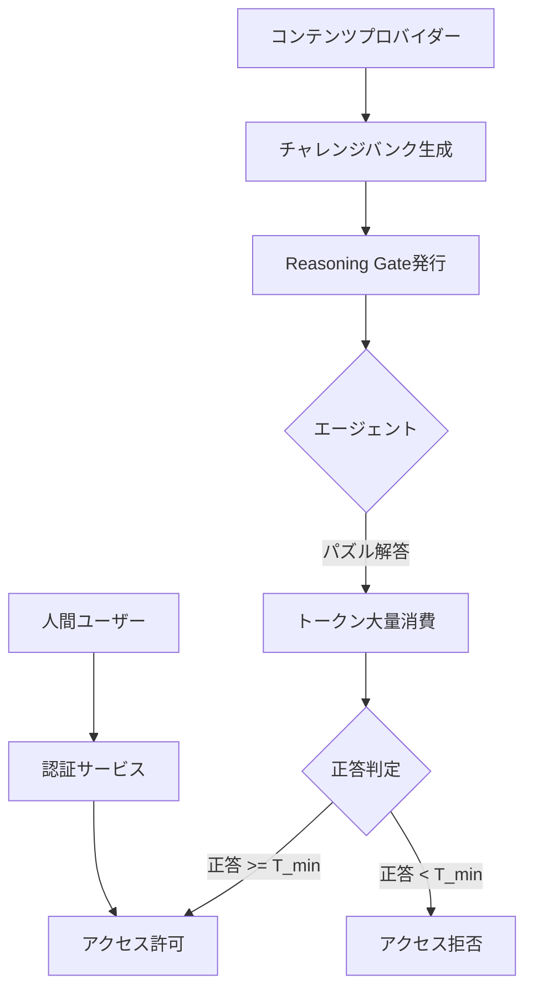
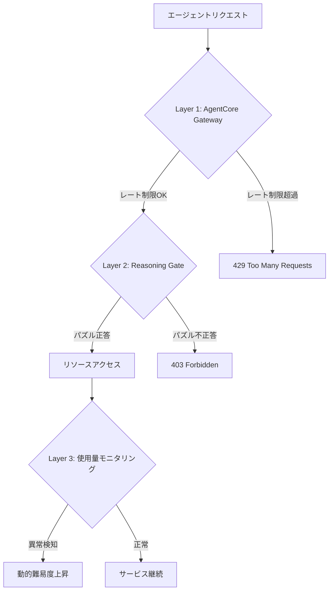

## 論文概要（Abstract）

AIウェブエージェントがインターネットリソースを高速・大規模に利用する時代において、コンテンツプロバイダーへの過負荷が深刻な課題となっている。本論文では、エージェントにアクセス前のチャレンジ（Throttling Gates）を課すことで計算コストを増大させるフレームワーク「Web Agent Throttling」を提案している。具体的には、世界知識に対するマルチホップ推論を要求する合成テキストパズル（Rebus-based Reasoning Gates）を設計し、パズル生成コストに対してエージェントの解答コストが9.2倍となる計算非対称性を達成したとKumarらは報告している。

本記事は [https://arxiv.org/abs/2509.01619](https://arxiv.org/abs/2509.01619) の解説記事です。

この記事は [Zenn記事: Bedrock AgentCore Gatewayレート制限で社内ヘルプデスクエージェントを安定運用する](https://zenn.dev/0h_n0/articles/44415eb1f43660) の深掘りです。

## 情報源

- **arXiv ID**: 2509.01619
- **URL**: [arXiv:2509.01619](https://arxiv.org/abs/2509.01619)
- **著者**: Abhinav Kumar, Jaechul Roh, Ali Naseh, Amir Houmansadr, Eugene Bagdasarian（University of Massachusetts Amherst）
- **公開日**: 2025年9月
- **分野**: cs.AI (Artificial Intelligence)

## 背景と動機（Background & Motivation）

### ウェブエージェントの脅威

LLMを基盤としたAIウェブエージェントは、人間よりもはるかに高いスループットでインターネットリソースを消費する。Kumarらは以下の脅威を指摘している。

1. **DoS攻撃の容易化**: エージェントを使った大規模リクエスト送信によるサービス妨害
2. **コンテンツスクレイピング**: 大量のデータ収集による知的財産の侵害
3. **リソース枯渇**: 正当なユーザーのアクセスを阻害するほどの帯域消費

### 従来手法の限界

- **CAPTCHA**: 深層学習モデルにより83-94%の精度で突破可能。マルチモーダルVLMは再学習なしで未知のCAPTCHAを突破する
- **Proof-of-Work（PoW）**: GPU搭載のボットネットが容易にハッシュ計算を実行でき、ハードウェア間でコストが不均一
- **レート制限**: IPベースやトークンベースの制限は有効だが、エージェント固有の計算コストを考慮しない

Kumarらは、CAPTCHAの「人間 vs ボット」二値判定に代わり、「計算コストの非対称性」を利用したスロットリングが必要だと主張している。

## 主要な貢献（Key Contributions）

- **Web Agent Throttlingフレームワーク**: エージェントに調整可能な計算コストを課す新しい防御パラダイム。アクセス制御ではなく、コスト増大による抑止を目的とする
- **Throttling Gatesの4特性定義**: 有効なスロットリングに必要な4つの特性（非対称性・スケーラビリティ・堅牢性・エージェント互換性）を形式化
- **Rebus-based Reasoning Gates（rRG）**: 世界知識に依存するマルチホップ推論パズルによる具体的実装。コーディング・数学パズルの制約を克服
- **計算非対称性9.2倍の実証**: 推論モデルにおいて、パズル生成コストの9.2倍の解答コストを要することを実験で確認

## 技術的詳細（Technical Details）

### Throttling Gatesの4特性

Kumarらは有効なスロットリングメカニズムが備えるべき4つの特性を定義している。

| 特性 | 定義 | 従来手法の問題 |
|------|------|--------------|
| **Asymmetry** | 生成コスト << 解答コスト | PoWはGPUで高速解答可能 |
| **Scalability** | 難易度の動的調整が可能 | CAPTCHAは二値的（通過/不通過） |
| **Robustness** | バイパス困難 | CAPTCHAはDLモデルで突破可能 |
| **Agent Compatibility** | 任意のエージェントに適用可能 | コーディングパズルはコード実行エージェントに無効 |

論文Table 1によれば、rRGは9つの評価基準すべてを満たす唯一の手法である。

### Reasoning Gatesの設計原理

Reasoning Gatesの核心は「CAPTCHAの逆転」にある。CAPTCHAは人間には容易だがボットには困難なタスクを課す。一方、Reasoning Gatesは**LLMのトークン生成コスト**を直接増大させることを狙う。



Rebusパズルは以下の特徴を持つ。

- **世界知識依存**: 天文学、化学、歴史など多様なドメインの知識を必要とする
- **マルチホップ推論**: 複数のヒントを組み合わせた推論が必要
- **テキストベース**: 画像認識不要で、あらゆるLLMエージェントに適用可能
- **生成容易・解答困難**: テンプレートベースの生成と、推論トークン消費による非対称性

### コスト非対称性の定式化

コスト非対称比 $\alpha$ は以下のように定義される。

$$
\alpha = \frac{C_{\text{solve}}}{C_{\text{generate}}}
$$

ここで、
- $C_{\text{solve}}$: エージェントがパズルを解答するために消費するトークン数（出力トークン）
- $C_{\text{generate}}$: サービス側がパズルを生成するために消費するトークン数（出力トークン）

論文の実験結果（Figure 3）によれば、具体的なトークン消費量は以下の通りである。

**非推論モデルの場合:**

$$
\alpha_{\text{non-reasoning}} = \frac{2800}{430} \approx 6.6
$$

- 生成: Gemini 2.5-Flash（100トークンの思考バジェット）= 430トークン
- 解答: Gemma 3-27B = 2,800トークン
- 平均非対称比: 5.2倍

**推論モデルの場合:**

$$
\alpha_{\text{reasoning}} = \frac{46000}{4900} \approx 9.2
$$

- 生成: o3-mini = 4,900トークン
- 解答: DeepSeek R1 = 46,000トークン
- 平均非対称比: 6.4倍

推論モデルはChain-of-Thought推論で中間トークンを大量生成するため、非対称比が拡大する。

### スロットリング強度の制御

スロットリング関数 $T$ は以下のパラメータで制御される。

$$
\text{Access} = T(C_b, l, T_{\text{num}}, T_{\text{min}})
$$

ここで、
- $C_b$: チャレンジバンク（事前生成されたパズル集合）
- $l \in L$: 難易度レベル（easy / medium / hard）
- $T_{\text{num}}$: 出題するパズルの総数
- $T_{\text{min}}$: アクセス許可に必要な最低正答数

$l$ と $T_{\text{num}}$ の調整により、スロットリング強度を動的に制御できる。

### 難易度別の精度制御

論文Table 4によれば、難易度レベルごとのモデル精度は以下の通りである。

| モデル | Easy (%) | Medium (%) | Hard (%) |
|--------|----------|------------|----------|
| GPT-4o | 75.0 | 22.2 | 0.0 |
| o3-mini | 84.0 | 77.8 | 0.0 |
| o3 | 87.5 | 88.9 | 30.1 |

Hard難易度では最先端モデルのo3でも30.1%の精度にとどまり、GPT-4oとo3-miniは0%である。この結果は、難易度パラメータによるスロットリング強度の段階的制御が機能していることを示している。

## アルゴリズム（Algorithm）

論文では3段階のアルゴリズムが提案されている。Step Aで難易度キャリブレーション、Step Bで大規模チャレンジ生成、オンラインでリアルタイム検証を行う。

```python
import random
from dataclasses import dataclass, field
from typing import Literal

DifficultyLevel = Literal["easy", "medium", "hard"]


@dataclass
class Challenge:
    """Reasoning Gateのチャレンジ（パズル）"""
    puzzle_text: str
    solution: str
    difficulty: DifficultyLevel
    domains: list[str]


def generate_challenge_bank(
    generation_lm: object,
    solvability_checker: object,
    domains: list[str],
    words: list[str],
    target_count: int,
    icl_examples: dict[DifficultyLevel, list[Challenge]],
) -> list[Challenge]:
    """Step B: ICL事例を活用した大規模チャレンジバンク生成

    Args:
        generation_lm: チャレンジ生成用LM
        solvability_checker: 解答可能性チェッカー
        domains: 知識ドメインリスト（天文学、化学等）
        words: ターゲット単語リスト
        target_count: 生成目標数
        icl_examples: Step Aでキャリブレーション済みのICL事例

    Returns:
        難易度ラベル付きチャレンジのリスト
    """
    challenge_bank: list[Challenge] = []
    levels: list[DifficultyLevel] = ["easy", "medium", "hard"]

    while len(challenge_bank) < target_count:
        target_difficulty = random.choice(levels)
        m = random.randint(4, 12)
        selected_domains = random.sample(domains, min(m, len(domains)))
        selected_words = random.sample(words, min(m, len(words)))

        candidate = generation_lm.generate(
            domains=selected_domains,
            words=selected_words,
            icl_examples=icl_examples[target_difficulty],
        )

        if solvability_checker.verify(candidate.puzzle_text, candidate.solution):
            candidate.difficulty = target_difficulty
            challenge_bank.append(candidate)

    return challenge_bank


def verify_agent_access(
    challenge_bank: list[Challenge],
    difficulty: DifficultyLevel,
    t_num: int,
    t_min: int,
    agent: object,
) -> bool:
    """オンライン検証: エージェントにチャレンジを発行しアクセス可否を判定

    Args:
        challenge_bank: 事前生成済みチャレンジバンク
        difficulty: 要求する難易度レベル
        t_num: 出題するパズル数
        t_min: アクセス許可に必要な最低正答数
        agent: 検証対象のエージェント

    Returns:
        True: アクセス許可、False: アクセス拒否
    """
    candidates = [c for c in challenge_bank if c.difficulty == difficulty]
    selected = random.sample(candidates, min(t_num, len(candidates)))

    correct_count = sum(
        1 for challenge in selected
        if agent.solve(challenge.puzzle_text).strip().lower()
        == challenge.solution.strip().lower()
    )
    return correct_count >= t_min
```

## 実装のポイント（Implementation）

### パズル生成の品質管理

論文Figure 5, 6によれば、生成モデルの選択がパズル品質に大きく影響する。

- **o3**: 解答不能パズルの生成率0%、ハルシネーション率0.01%
- **o3-mini**: 解答不能パズル4%
- **GPT-4o**: 解答不能パズル46%と高い

Kumarらは、o3クラスの生成モデルとsolvability checkerによる二段階品質検証を推奨している。

### チャレンジバンクの運用

- **事前生成方式**: パズルはオフラインで大量生成し、チャレンジバンクに蓄積する。リアルタイム生成は不要
- **ランダム抽出**: 各リクエストに対してバンクからランダムにパズルを選択するため、キャッシュ攻撃に耐性がある
- **ドメイン多様性**: 4,000以上の単語と2,000以上のドメインを使用し、パズルの重複を最小化

### 適応的攻撃者への耐性

論文Table 6によれば、攻撃者がMany-shot ICLやファインチューニングで対抗した場合の精度改善は限定的である。

- **Many-shot ICL**: +3-5%の精度改善のみ
- **ファインチューニング**: GPT-4oでは-3%と逆効果、他モデルでも+2-5%にとどまる

## Production Deployment Guide

### MCPサーバーでのReasoning Gates実装

本論文ではModel Context Protocol（MCP）サーバーでの実装が実際にテストされている。以下はFastMCPを用いた核心部分の実装例である。

```python
import hashlib
import hmac
import random
import secrets
import time
from typing import Any

from fastmcp import FastMCP

mcp = FastMCP("reasoning-gate-server")

# セッションストア（本番ではRedis/DynamoDB推奨）
sessions: dict[str, dict] = {}
CHALLENGE_BANK: list[dict[str, Any]] = []  # 本番ではDBから読み込み


@mcp.tool()
def request_access(difficulty: str = "medium", t_num: int = 3) -> dict[str, Any]:
    """Reasoning Gateチャレンジを発行する"""
    session_id = secrets.token_hex(16)
    candidates = [c for c in CHALLENGE_BANK if c["difficulty"] == difficulty]
    selected = random.sample(candidates, min(t_num, len(candidates)))

    sessions[session_id] = {
        "challenges": {
            c["id"]: hashlib.sha256(c["solution"].lower().encode()).hexdigest()
            for c in selected
        },
        "correct": 0,
        "t_min": max(1, t_num // 2),
        "created_at": time.time(),
    }
    return {
        "session_id": session_id,
        "challenges": [{"id": c["id"], "puzzle": c["puzzle_text"]} for c in selected],
    }


@mcp.tool()
def submit_answers(session_id: str, answers: list[dict[str, str]]) -> dict[str, Any]:
    """回答を検証しアクセストークンを返す"""
    session = sessions.get(session_id)
    if not session or time.time() - session["created_at"] > 300:
        return {"error": "Invalid or expired session"}

    for ans in answers:
        expected = session["challenges"].get(ans["id"])
        if expected and hmac.compare_digest(
            hashlib.sha256(ans["answer"].strip().lower().encode()).hexdigest(),
            expected,
        ):
            session["correct"] += 1

    if session["correct"] >= session["t_min"]:
        return {"authenticated": True, "access_token": secrets.token_hex(32)}
    return {"authenticated": False, "correct": session["correct"]}
```

### AWS実装パターン（コスト最適化重視）

Reasoning Gatesをプロダクション環境にデプロイする場合、トラフィック量に応じた構成を選択する。

**トラフィック量別の推奨構成:**

| 構成 | トラフィック | サービス | 月額コスト概算 |
|------|------------|---------|--------------|
| Small | ~100 req/日 | Lambda + DynamoDB + Bedrock | $50-150 |
| Medium | ~1,000 req/日 | ECS Fargate + ElastiCache + Bedrock | $300-800 |
| Large | 10,000+ req/日 | EKS + Karpenter + ElastiCache Cluster | $2,000-5,000 |

Reasoning Gatesの特徴として、チャレンジバンクを事前生成（Bedrock Batch APIで50%削減）するため、リアルタイムのLLM呼び出しが不要であり、Small構成でも十分に運用可能である。Large構成ではSpot Instancesで最大90%のコスト削減が見込める。

**注意**: 上記は2026年8月時点のAWS東京リージョン概算値。最新料金はAWS料金計算ツールで確認推奨。

### Terraformインフラコード

**Small構成（Serverless）:**

```hcl
# --- Reasoning Gates: Small構成 (Lambda + DynamoDB) ---
resource "aws_dynamodb_table" "challenge_bank" {
  name         = "reasoning-gate-challenges"
  billing_mode = "PAY_PER_REQUEST"
  hash_key     = "challenge_id"
  range_key    = "difficulty"

  attribute { name = "challenge_id"; type = "S" }
  attribute { name = "difficulty";   type = "S" }

  global_secondary_index {
    name            = "difficulty-index"
    hash_key        = "difficulty"
    projection_type = "ALL"
  }

  server_side_encryption { enabled = true }
  ttl { attribute_name = "expires_at"; enabled = true }
}

resource "aws_lambda_function" "gate_verifier" {
  function_name = "reasoning-gate-verifier"
  runtime       = "python3.12"
  handler       = "handler.lambda_handler"
  role          = aws_iam_role.lambda_role.arn
  memory_size   = 256
  timeout       = 30
  tracing_config { mode = "Active" }

  environment {
    variables = {
      CHALLENGE_TABLE = aws_dynamodb_table.challenge_bank.name
      SESSION_TTL     = "300"
    }
  }

  filename         = "lambda_package.zip"
  source_code_hash = filebase64sha256("lambda_package.zip")
}

# CloudWatch: Lambda p99レイテンシ監視
resource "aws_cloudwatch_metric_alarm" "lambda_duration" {
  alarm_name          = "reasoning-gate-high-duration"
  comparison_operator = "GreaterThanThreshold"
  evaluation_periods  = 3
  metric_name         = "Duration"
  namespace           = "AWS/Lambda"
  period              = 300
  statistic           = "p99"
  threshold           = 25000
  dimensions = { FunctionName = aws_lambda_function.gate_verifier.function_name }
}
```

**Large構成（Container）** では、EKS + Karpenter（Spot優先で最大90%削減）+ ElastiCache（Multi-AZ）+ AWS Budgets（月額上限アラート）を組み合わせる。

### 運用・監視設定

- **CloudWatch Logs Insights**: 認証成功率の1時間集計、500ms未満の異常高速解答検知（ボット疑い）
- **CloudWatchアラーム**: 認証失敗率スパイク（5分間で100件超）をSNS通知
- **X-Rayトレーシング**: Lambda自動計装でsession_id/authenticated状態をアノテーション
- **Cost Explorer**: 日次レポートで$100/日超過時にSNS通知

### コスト最適化チェックリスト

- [ ] トラフィック量に応じた構成選択（Serverless / Hybrid / Container）
- [ ] チャレンジバンク事前生成でリアルタイムLLM呼び出し排除
- [ ] EC2/EKS: Spot Instances優先（最大90%削減）
- [ ] Reserved Instances / Savings Plans検討（最大72%削減）
- [ ] Lambda: メモリサイズ最適化（Power Tuningで検証）
- [ ] Bedrock Batch APIでパズル一括生成（50%削減）
- [ ] Prompt Caching有効化（ICL事例の再利用で30-90%削減）
- [ ] AWS Budgets + Cost Anomaly Detection + 日次コストレポート
- [ ] DynamoDB TTLでセッション自動削除
- [ ] チャレンジバンクの定期更新ポリシー
- [ ] タグ戦略（Service, Environment, CostCenter）
- [ ] 開発環境の夜間停止

## 実験結果（Results）

### 計算非対称性

論文Figure 3の実験結果によれば、rRGは他のパズルベンチマークと比較して最大のトークン消費を誘発する。

| カテゴリ | 平均応答トークン数 | 非対称比 |
|---------|------------------|---------|
| rRG（推論モデル） | 4,400 | 9.2x |
| rRG（非推論モデル） | 800 | 6.6x |
| コーディングパズル | 1,200 | 3.1x |
| 数学パズル | 900 | 2.4x |

rRGでは推論/非推論モデル間の精度差が20%と最大である（他ベンチマークでは10%程度、論文Table 5より）。

### 人間 vs エージェントの性能（論文Table 3）

| 対象 | 正答数 (10問中) | 平均所要時間 |
|------|----------------|-------------|
| 人間（インターネットなし） | 2 | 11分30秒 |
| 人間（インターネットあり） | 6 | 11分00秒 |
| ブラウザエージェント | 10 | 2分35秒-4分50秒 |
| MCPエージェント | 10 | 17秒-30秒 |

エージェントは全問正答するが大量のトークンを消費する。この「正答可能だが高コスト」という特性がCAPTCHAとの本質的な違いである。

## 実運用への応用（Practical Applications）

### AgentCore Gatewayとの多層防御

Zenn記事のBedrock AgentCore Gatewayレート制限とReasoning Gatesを組み合わせた多層防御が構築できる。



**Layer 1（AgentCore Gateway）**: トークンバケット方式で大量リクエストを遮断する第一防衛線

**Layer 2（Reasoning Gates）**: 通過リクエストに計算コストを課す。正当なエージェントは通過可能だがコスト効率が悪化

**Layer 3（使用量モニタリング）**: 異常パターン検知時にReasoning Gatesの難易度を動的に引き上げる

### 認証サービスとの連携

Kumarらは、認証済みユーザーがAttestationサービス経由でReasoning Gatesをバイパスし、未認証エージェントのみにチャレンジを適用するカスケード方式も提案している。MFA連携により正当なAPIユーザーのUXを損なわずに済む。

## 関連研究（Related Work）

- **CAPTCHA**: 深層学習モデルが83-94%で突破可能。rRGはbot検出ではなくコスト増大が目的である点で根本的に異なる
- **Proof-of-Work（PoW）**: GPU搭載ボットネットで容易に解決可能でハードウェア間コスト不均一。rRGはLLMトークン生成という均一なコストメトリクスを使用
- **パズルベース防御**: 従来は汎用計算量依存だが、rRGはLLMの推論トークンを標的とすることでエージェント固有のコスト増大を実現

## まとめと今後の展望

Kumarらは、AIウェブエージェントの過負荷問題に対して「計算コストの非対称性」を利用したスロットリングを提案した。Rebusパズルによる9.2倍のコスト非対称性は、CAPTCHAやPoWでは実現できなかったエージェント固有の防御メカニズムである。

**制約と限界**: パズル生成にo3クラスのモデルが必要で運用コストが高い点、エージェント側のトークン消費増大による環境負荷、高リソース攻撃者への耐性が予備的結果にとどまる点が課題として挙げられている。

**今後の方向**: Kumarらは「Proof-of-Useful-Work」の統合を提案しており、エージェントの計算リソースを有益なタスクに転用することで環境負荷を緩和できる可能性がある。

## 参考文献

- **arXiv**: [https://arxiv.org/abs/2509.01619](https://arxiv.org/abs/2509.01619)
- **著者所属**: University of Massachusetts Amherst
- **Related Zenn article**: [Bedrock AgentCore Gatewayレート制限で社内ヘルプデスクエージェントを安定運用する](https://zenn.dev/0h_n0/articles/44415eb1f43660)
