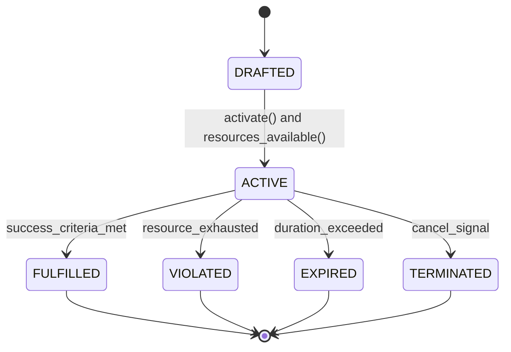
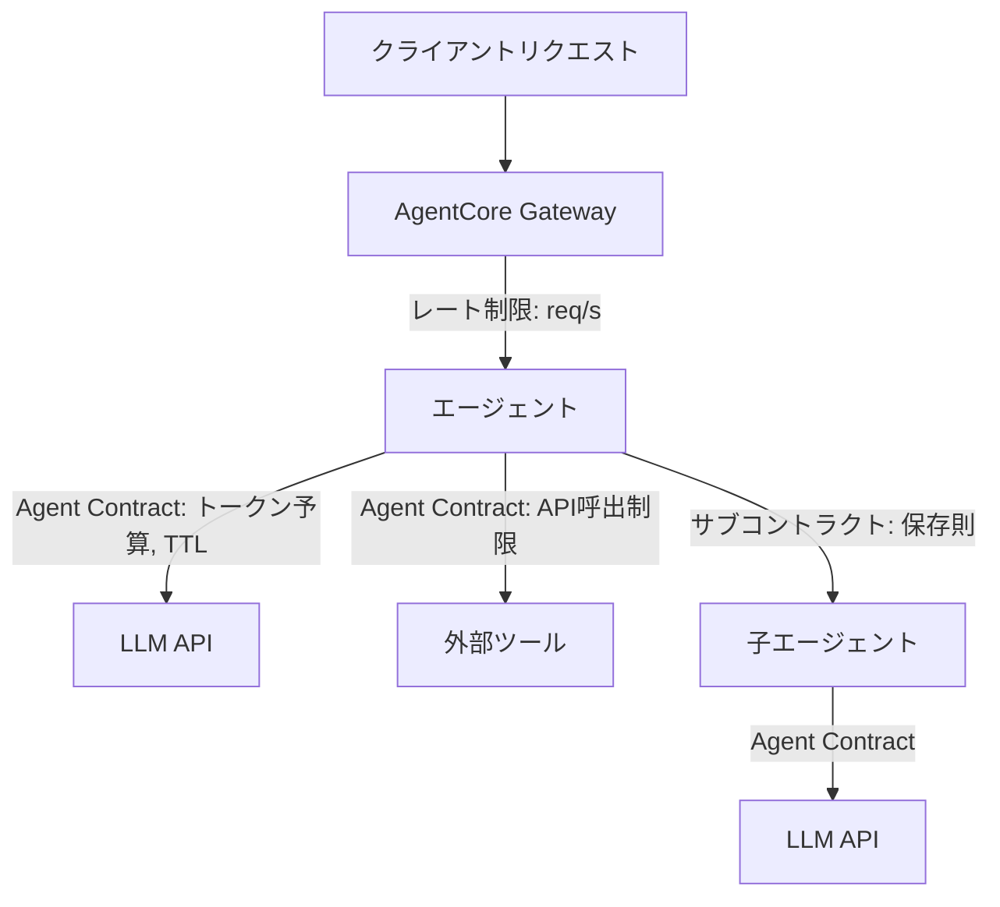

本記事は [Agent Contracts (arXiv:2601.08815)](https://arxiv.org/abs/2601.08815) の解説記事です。

## 論文概要

Ye and Tan (2026) は、自律AIエージェントのリソース消費を統制するフォーマルフレームワーク Agent Contracts を提案している。本フレームワークは、入出力仕様・多次元リソース制約・時間的境界・成功基準を7タプルの統一的なガバナンス機構に統合し、マルチエージェント協調における予算委任の保存則を形式化している。著者らの実験によれば、コントラクト付きエージェントは反復ワークフローにおいてトークン消費を90%削減し、消費量の分散を525倍低減し、マルチエージェント委任において保存則違反をゼロに抑えたと報告されている。

この記事は [Zenn記事: Bedrock AgentCore Gatewayレート制限で社内ヘルプデスクエージェントを安定運用する](https://zenn.dev/0h_n0/articles/44415eb1f43660) の深掘りです。Zenn記事ではAWS Bedrock AgentCore Gatewayのレート制限によるエージェント安定運用を解説しているが、本論文はそのレート制限の上流に位置する「エージェント自身にリソース予算と時間制約を持たせる」というフォーマルなガバナンス機構を提供する研究である。

## 情報源

- **arXiv ID**: 2601.08815
- **URL**: [https://arxiv.org/abs/2601.08815](https://arxiv.org/abs/2601.08815)
- **著者**: Qing Ye, Jing Tan
- **投稿日**: 2026年1月13日（v3: 2026年3月25日）
- **分野**: cs.MA (Multi-Agent Systems)
- **採択**: COINE 2026 (oral presentation, co-located with AAMAS 2026)

## 背景と動機

1980年にSmithが提案したContract Net Protocol（CNP）は、マルチエージェントシステムにおけるタスク割り当てに「コントラクト」というメタファーを導入した画期的な研究であった。CNPでは、マネージャがタスクを公告し、コントラクタが入札し、最適なコントラクタにタスクを委任するという枠組みでエージェント間の協調を実現する。

しかし、現代のエージェントプロトコル（MCP、A2A、LangGraph、AutoGen、CrewAIなど）は接続性と相互運用性の標準化に注力しており、「エージェントがどれだけリソースを消費してよいか」「どれだけ長く動作してよいか」というリソースガバナンスの形式的な機構が欠如している。著者らはこの状況を「CNPが"誰がこのタスクをやるべきか"という問いに答えたのに対し、"このタスクをどのような制約の下で実行してよいか"という問いには未回答のままである」と指摘している。

実際に、LLMベースのエージェントはリトライループ、検証サイクル、ツール呼び出しの連鎖によってトークン消費が予測不能に膨張する問題を抱えている。特にマルチエージェント構成では、上流エージェントの予算超過が下流エージェントに波及し、システム全体のコストを制御不能にするリスクがある。

## 主要な貢献

著者らは以下の3点を主要な貢献として報告している。

- **Agent Contracts Framework**: 入出力仕様、多次元リソース制約、時間的境界、成功基準を7タプルで統一するガバナンス機構。エージェントの操作を「何を受け取り、何を返すか」だけでなく「どれだけのリソースをどれだけの時間で消費してよいか」まで契約として規定する
- **Explicit Lifecycle Semantics**: エージェント操作のライフサイクルを DRAFTED、ACTIVE、FULFILLED、VIOLATED、EXPIRED、TERMINATED の状態遷移として定式化し、各遷移のガード条件を明示する
- **Conservation Laws**: 階層的なマルチエージェント委任において、子エージェントに割り当てる予算の合計が親の残予算を超えないことを保証する保存則。再帰的な委任でもリソース超過を構造的に防止する

## 技術的詳細

### Agent Contractの形式的定義

Agent Contractは以下の7タプルとして定義される。

$$
\mathcal{C} = (I, O, S, R, T, \Phi, \Psi)
$$

各要素の定義は以下の通りである。

**入力仕様** $I = (\sigma_I, \mathcal{V}_I, \mathcal{P}_I)$

- $\sigma_I$: 入力スキーマ（型定義）
- $\mathcal{V}_I$: バリデーションルール
- $\mathcal{P}_I$: 前処理変換

**出力仕様** $O = (\sigma_O, Q_{\min}, \mathcal{F}_O)$

- $\sigma_O$: 出力スキーマ
- $Q_{\min}$: 最小許容品質閾値
- $\mathcal{F}_O$: フォーマット要件

**スキルセット** $S = \{s_1, s_2, \ldots, s_m\}$ where $s_i \in \mathcal{S}_{\text{available}}$

各スキルにはコスト$c(s_i)$と成功確率$p(s_i)$が関連付けられる。

**リソース制約** $R = \{r_1, r_2, \ldots, r_n\}$

各リソース$r_i$には予算$b_i$と消費関数$c_i(t)$が定義され、以下の不変条件を満たす。

$$
\forall i: c_i(t) \leq b_i
$$

**時間的制約** $T = (t_{\text{start}}, \tau)$

- $t_{\text{start}}$: コントラクト開始タイムスタンプ
- $\tau$: コントラクト持続時間（TTL）

制約条件:

$$
t_{\text{current}} - t_{\text{start}} \leq \tau
$$

**成功基準** $\Phi = \{(\phi_1, w_1), (\phi_2, w_2), \ldots, (\phi_k, w_k)\}$

測定可能な条件とその重みの組で構成され、以下を満たすとき成功と判定される。

$$
\sum_{i=1}^{k} w_i \cdot \mathbb{1}[\phi_i] \geq \theta
$$

ここで$\mathbb{1}[\phi_i]$は条件$\phi_i$が満たされたとき1、そうでないとき0となる指示関数、$\theta$は成功判定閾値である。

**終了条件** $\Psi = \{\psi_1 \vee \psi_2 \vee \cdots \vee \psi_l\}$

リソース枯渇、時間切れ、明示的キャンセル、エラー発生などの条件の論理和として定義される。

### リソース次元

著者らは以下のリソース次元を定義している。

| リソース | 記号 | 単位 | 例 |
|---------|------|------|-----|
| LLMトークン | $r_{\text{tok}}$ | tokens | 100,000 |
| API呼び出し | $r_{\text{api}}$ | calls | 50 |
| 反復回数 | $r_{\text{iter}}$ | rounds | 10 |
| Web検索 | $r_{\text{web}}$ | queries | 10 |
| 計算時間 | $r_{\text{cpu}}$ | seconds | 300 |
| 外部コスト | $r_{\text{cost}}$ | USD | 5.00 |

特にトークン予算は以下のように分解される。

$$
R_{\text{tok}} = (r_{\text{in}}, r_{\text{r}}, r_{\text{out}})
$$

ここで$r_{\text{in}}$は入力トークン、$r_{\text{r}}$は推論（reasoning）トークン、$r_{\text{out}}$は出力トークンである。制御可能な予算は以下で定義される。

$$
B_{\text{ctrl}} = B_{\text{tok}} - r_{\text{in}}
$$

### ライフサイクル状態遷移

Agent Contractのライフサイクルは以下の状態遷移図で表現される。



各遷移のガード条件を以下に示す。

| 遷移元 | 遷移先 | ガード条件 |
|--------|--------|-----------|
| DRAFTED | ACTIVE | `activate()` $\wedge$ `resources_available()` |
| ACTIVE | FULFILLED | $\sum w_i \cdot \mathbb{1}[\phi_i] \geq \theta$ |
| ACTIVE | VIOLATED | $\exists r_i: c_i \geq b_i$ |
| ACTIVE | EXPIRED | $t - t_{\text{start}} > \tau$ |
| ACTIVE | TERMINATED | `cancel_signal()` |

### 保存則（Conservation Laws）

マルチエージェント協調において、Agent Contractsの保存則は全リソース次元について以下の不変条件を保証する。

$$
\sum_{j \in \text{agents}} c_j^{(r)} \leq B^{(r)} \quad \forall r \in R
$$

ここで$c_j^{(r)}$はエージェント$j$のリソース$r$の消費量、$B^{(r)}$はリソース$r$の総予算である。著者らによれば、この不変条件は逐次実行、並列実行、階層的実行、競争的実行のいずれのパターンでも成立する。

**サブコントラクト割り当て**

オーケストレータが親コントラクトから子コントラクトを生成する場合の定式化は以下の通りである。

$$
\text{orchestrator}(\mathcal{C}_{\text{parent}}) \to \{\mathcal{C}_i = (I_i, O_i, S_i, R_i, T_i, \Phi_i, \Psi_i)\}_{i=1}^{k}
$$

制約条件:

$$
\sum_{i=1}^{k} R_i \leq R_{\text{parent}}
$$

**動的再割り当て**

完了した子エージェントの未使用予算をプールに戻し、動的に再配分する機構が定義されている。

$$
B_{\text{available}}(t) = B_{\text{reserve}} + \sum_{j \in \text{completed}} (b_j - c_j)
$$

予算配分戦略として以下の3種が提案されている。

- **比例配分**: $b_j = \frac{\omega_j}{\sum_k \omega_k} \cdot (B - B_{\text{reserve}})$
- **均等配分**: $b_j = \frac{B - B_{\text{reserve}}}{n}$
- **交渉型**: エージェントが予算を要求し、コーディネータが割り当て

### ランタイム監視

コントラクトの実行中、以下の監視関数が利用可能とされている。

$$
\text{Monitor}: (\mathcal{C}, t) \to (\vec{c}, \vec{u}, \tau_{\text{util}})
$$

ここで、$\vec{c}$はリソース消費ベクトル、$\vec{u} = \vec{c} / \vec{b}$はリソース利用率ベクトル（要素ごとの除算）、$\tau_{\text{util}} = (t - t_{\text{start}}) / \tau$は時間利用率（0から1の範囲）である。

集約利用率メトリクスは以下で定義される。

$$
\text{utilization}(t) = \max\left(\frac{t_{\text{current}} - t_{\text{start}}}{\tau}, \max_i \frac{c_i(t)}{b_i}\right)
$$

### エンフォースメント層

Agent Contractsは2層のエンフォースメント機構を持つ。

**ソフトエンフォースメント（協調的）**: Budget-Awareプロンプトにより、残予算をシステムプロンプトに注入してエージェントの自己制御を促す。フォーマットは「Budget: {used}/{total}」として動的に更新される。

**ハードエンフォースメント（構造的）**: 外部モニタがリソース消費を追跡し、制約違反時にエージェントのアクション間で実行を停止する。規範的な罰則（normative sanctions）ではなく、構造的な停止（agent harness pattern）によって強制する。

著者らはハードエンフォースメントの制約として、単一のLLM API呼び出し中はトークン消費量が事前に不明であるため、1回の呼び出しが予算を超過することを防げない点を指摘している。

$$
c_{\text{tok}}(t) = \begin{cases} \text{unknown} & \text{(API呼び出し中)} \\ c_{\text{actual}} & \text{(API応答後)} \end{cases}
$$

これは、エンフォースメントがAPI呼び出し間のオーケストレーション層で機能し、呼び出し内部では制御できないことを意味する。

### コントラクトモード

著者らはSimonの満足化原理（satisficing principle）を操作化し、品質とリソースのトレードオフを明示的に制御する3つのモードを定義している。

| モード | 推論トークン | タイムアウト | 用途 |
|--------|------------|------------|------|
| URGENT | 拡張推論なし | 30秒 | 即時応答が必要な場面 |
| ECONOMICAL | 低推論量 | 60秒 | コスト重視の場面 |
| BALANCED | 中推論量 | 90秒 | 品質とコストのバランス |

## 実装のポイント

Agent Contractsを実装する際の注意点を、論文の記述に基づき整理する。

**Budget-Awareプロンプティング**: 残予算をシステムプロンプトに注入することで、モデルレベルの対応なしにエージェントの自己制御を実現する。ただし、著者らはLLMが指定された予算制約を厳密に遵守しない場合があること（token elasticity）を関連研究として引用している。

**保存則の実装**: サブコントラクト生成時に$\sum R_i \leq R_{\text{parent}}$を検証するバリデーション層が必要である。完了エージェントの未使用予算を回収してプールに戻す動的再割り当て機構は、並行実行のアトミック性に注意が必要である。

**監視のオーバーヘッド**: 各アクション間でリソース消費を追跡するモニタは、エージェントの実行パスに挿入される。グラフ操作やDB読み書きと異なり、LLM API呼び出しのコスト（トークン数）は応答後にしか判明しないため、事後チェック+次アクション阻止というパターンになる。

**ハイブリッドエンフォースメント**: ソフト（プロンプト注入）とハード（外部モニタ停止）の併用が実用的である。ソフトだけではLLMの非決定性により予算遵守が保証されず、ハードだけでは単一呼び出しの超過を防げないため、両層の組み合わせが推奨されている。

**マルチエージェント協調パターン**: 著者らはRouting Pattern（入力分類器が特化ハンドラにルーティング）とOrchestrator-Workers Pattern（オーケストレータがタスクを分解して委任）の2パターンを提案している。いずれのパターンでも保存則が成立する。

```python
from dataclasses import dataclass, field
from enum import Enum
from typing import Any


class ContractState(Enum):
    """Agent Contractのライフサイクル状態"""
    DRAFTED = "drafted"
    ACTIVE = "active"
    FULFILLED = "fulfilled"
    VIOLATED = "violated"
    EXPIRED = "expired"
    TERMINATED = "terminated"


@dataclass
class ResourceConstraint:
    """リソース制約の定義

    Args:
        resource_type: リソース種別（tokens, api_calls, time等）
        budget: 予算上限
        consumed: 現在の消費量
    """
    resource_type: str
    budget: float
    consumed: float = 0.0

    @property
    def remaining(self) -> float:
        return self.budget - self.consumed

    @property
    def utilization(self) -> float:
        return self.consumed / self.budget if self.budget > 0 else 0.0

    def is_violated(self) -> bool:
        return self.consumed >= self.budget


@dataclass
class AgentContract:
    """Agent Contractの7タプル実装

    Args:
        resources: リソース制約のリスト
        ttl_seconds: コントラクトTTL（秒）
        quality_threshold: 成功判定閾値 theta
    """
    resources: list[ResourceConstraint] = field(default_factory=list)
    ttl_seconds: float = 300.0
    quality_threshold: float = 0.7
    state: ContractState = ContractState.DRAFTED

    def activate(self) -> None:
        """コントラクトをACTIVE状態に遷移"""
        if self.state != ContractState.DRAFTED:
            raise ValueError(f"Cannot activate from {self.state}")
        self.state = ContractState.ACTIVE

    def check_conservation(
        self, subcontracts: list["AgentContract"]
    ) -> bool:
        """保存則: 子コントラクトの予算合計 <= 親の残予算

        Args:
            subcontracts: 子コントラクトのリスト

        Returns:
            保存則が成立するかどうか
        """
        for parent_r in self.resources:
            child_sum = sum(
                child_r.budget
                for sc in subcontracts
                for child_r in sc.resources
                if child_r.resource_type == parent_r.resource_type
            )
            if child_sum > parent_r.remaining:
                return False
        return True

    def update_consumption(
        self, resource_type: str, amount: float
    ) -> None:
        """リソース消費を記録し、違反を検出

        Args:
            resource_type: リソース種別
            amount: 消費量
        """
        for r in self.resources:
            if r.resource_type == resource_type:
                r.consumed += amount
                if r.is_violated():
                    self.state = ContractState.VIOLATED
                return
```

## Production Deployment Guide

### AWS実装パターン

Agent Contractsのリソースガバナンス機構をAWS上のマルチエージェントシステムに適用する構成を、トラフィック量別に提案する。本フレームワークはエージェントのオーケストレーション層に組み込まれるため、コントラクト管理自体のコストは最小限である。

**コスト試算の注意事項**: 以下は2026年8月時点のAWS ap-northeast-1（東京）リージョン料金に基づく概算値である。実際のコストはトラフィックパターン、リージョン、バースト使用量により変動する。最新料金はAWS料金計算ツールで確認を推奨する。

| 構成 | トラフィック | 主要サービス | 月額概算 |
|------|-------------|-------------|---------|
| Small | ~100 req/日 | Lambda + Bedrock + DynamoDB | $60-150 |
| Medium | ~1,000 req/日 | ECS Fargate + Bedrock + ElastiCache | $350-800 |
| Large | 10,000+ req/日 | EKS + Karpenter + Spot + Bedrock Batch | $2,000-5,000 |

**Small構成の内訳**: Lambda（$5-10）+ Bedrock推論（$30-80、コントラクトによるトークン制限で削減）+ DynamoDB On-Demand（$5-15、コントラクト状態・消費量の永続化）+ Step Functions（$5-10、ライフサイクル状態遷移管理）+ CloudWatch（$5-10）+ S3（$2-5）

**Large構成の内訳**: EKSコントロールプレーン（$73）+ EC2 Spot Instances（$700-1,500、On-Demandの60-90%削減）+ Bedrock Batch API（$600-1,500、コントラクトのトークン予算でBatch化を最適化）+ ElastiCache Redis（$100-200、コントラクト状態キャッシュ）+ ALB（$50-100）+ CloudWatch/X-Ray（$30-80）

**コスト削減テクニック**:

- Spot Instances活用で最大90%削減
- Reserved Instances購入で最大72%削減
- Bedrock Batch API使用で50%削減
- Agent Contractsのトークン予算制限で30-90%削減（論文の実験1で90%削減を報告）

### Terraformインフラコード

**Small構成（Serverless）: Lambda + Bedrock + DynamoDB + Step Functions**

```hcl
# --- Small構成: Agent Contracts リソースガバナンス ---
# Lambda + Step Functions + Bedrock + DynamoDB (月額 $60-150)

terraform {
  required_version = ">= 1.9"
  required_providers {
    aws = { source = "hashicorp/aws", version = "~> 5.60" }
  }
}

provider "aws" { region = "ap-northeast-1" }

# --- IAMロール（最小権限） ---
resource "aws_iam_role" "contract_lambda" {
  name = "agent-contract-lambda"
  assume_role_policy = jsonencode({
    Version = "2012-10-17"
    Statement = [{
      Action    = "sts:AssumeRole"
      Effect    = "Allow"
      Principal = { Service = "lambda.amazonaws.com" }
    }]
  })
}

resource "aws_iam_role_policy" "contract_lambda" {
  name = "agent-contract-policy"
  role = aws_iam_role.contract_lambda.id
  policy = jsonencode({
    Version = "2012-10-17"
    Statement = [
      {
        # Bedrock推論: コントラクト制約内でのLLM呼び出し
        Effect   = "Allow"
        Action   = ["bedrock:InvokeModel", "bedrock:InvokeModelWithResponseStream"]
        Resource = "arn:aws:bedrock:ap-northeast-1::foundation-model/*"
      },
      {
        # DynamoDB: コントラクト状態・消費量の永続化
        Effect = "Allow"
        Action = [
          "dynamodb:GetItem", "dynamodb:PutItem",
          "dynamodb:UpdateItem", "dynamodb:Query"
        ]
        Resource = aws_dynamodb_table.contract_state.arn
      },
      {
        Effect   = "Allow"
        Action   = ["logs:CreateLogGroup", "logs:CreateLogStream", "logs:PutLogEvents"]
        Resource = "arn:aws:logs:ap-northeast-1:*:*"
      },
      {
        Effect   = "Allow"
        Action   = ["xray:PutTraceSegments", "xray:PutTelemetryRecords"]
        Resource = "*"
      }
    ]
  })
}

# --- DynamoDB: コントラクト状態管理 ---
resource "aws_dynamodb_table" "contract_state" {
  name         = "agent-contract-state"
  billing_mode = "PAY_PER_REQUEST"  # On-Demand: 低トラフィックで最適
  hash_key     = "contract_id"

  attribute {
    name = "contract_id"
    type = "S"
  }

  # TTL: 期限切れコントラクトの自動削除
  ttl {
    attribute_name = "expires_at"
    enabled        = true
  }

  # KMS暗号化
  server_side_encryption {
    enabled = true
  }

  tags = { Service = "agent-contracts" }
}

# --- Lambda: コントラクトエンフォースメント ---
resource "aws_lambda_function" "contract_enforcer" {
  function_name = "agent-contract-enforcer"
  runtime       = "python3.12"
  handler       = "handler.lambda_handler"
  role          = aws_iam_role.contract_lambda.arn
  timeout       = 300  # コントラクトTTLに合わせる
  memory_size   = 512

  # X-Rayトレーシング有効化
  tracing_config { mode = "Active" }

  environment {
    variables = {
      CONTRACT_TABLE = aws_dynamodb_table.contract_state.name
      # トークン予算のデフォルト値（コントラクトで上書き可能）
      DEFAULT_TOKEN_BUDGET = "100000"
      DEFAULT_TTL_SECONDS  = "300"
    }
  }
}

# --- CloudWatchアラーム: 予算超過検知 ---
resource "aws_cloudwatch_metric_alarm" "token_budget_exceeded" {
  alarm_name          = "agent-contract-token-exceeded"
  comparison_operator = "GreaterThanThreshold"
  evaluation_periods  = 1
  metric_name         = "ContractViolations"
  namespace           = "AgentContracts"
  period              = 300
  statistic           = "Sum"
  threshold           = 0
  alarm_description   = "Agent contractのリソース違反が検出された"
  alarm_actions       = [aws_sns_topic.alerts.arn]
}

resource "aws_sns_topic" "alerts" {
  name = "agent-contract-alerts"
}
```

**Large構成（Container）: EKS + Karpenter + Spot Instances**

```hcl
# --- Large構成: マルチエージェント + Agent Contracts ---
# EKS + Karpenter + Spot + Bedrock Batch (月額 $2,000-5,000)

# --- EKSクラスタ ---
module "eks" {
  source  = "terraform-aws-modules/eks/aws"
  version = "~> 20.24"

  cluster_name    = "agent-contracts-cluster"
  cluster_version = "1.31"

  vpc_id     = module.vpc.vpc_id
  subnet_ids = module.vpc.private_subnets

  # Karpenter用のIRSA設定
  enable_irsa = true

  cluster_endpoint_public_access = false  # セキュリティ: プライベートのみ

  tags = { Service = "agent-contracts" }
}

# --- Karpenter: Spot優先の自動スケーリング ---
resource "kubectl_manifest" "karpenter_nodepool" {
  yaml_body = yamlencode({
    apiVersion = "karpenter.sh/v1"
    kind       = "NodePool"
    metadata   = { name = "agent-workers" }
    spec = {
      template = {
        spec = {
          requirements = [
            { key = "karpenter.sh/capacity-type", operator = "In", values = ["spot", "on-demand"] },
            { key = "node.kubernetes.io/instance-type", operator = "In",
              values = ["m6i.xlarge", "m6i.2xlarge", "m7i.xlarge", "m7i.2xlarge"] }
          ]
        }
      }
      disruption = {
        consolidationPolicy = "WhenEmptyOrUnderutilized"
        consolidateAfter    = "30s"
      }
      limits = { cpu = "128", memory = "512Gi" }
    }
  })
}

# --- Secrets Manager: Bedrock設定 ---
resource "aws_secretsmanager_secret" "bedrock_config" {
  name = "agent-contracts/bedrock-config"
}

# --- AWS Budgets: コストアラート ---
resource "aws_budgets_budget" "monthly" {
  name         = "agent-contracts-monthly"
  budget_type  = "COST"
  limit_amount = "5000"
  limit_unit   = "USD"
  time_unit    = "MONTHLY"

  notification {
    comparison_operator = "GREATER_THAN"
    threshold           = 80
    threshold_type      = "PERCENTAGE"
    notification_type   = "ACTUAL"
    subscriber_email_addresses = ["ops@example.com"]
  }
}
```

### 運用・監視設定

**CloudWatch Logs Insights クエリ**: コントラクト違反とトークン消費の異常検知

```
# 1時間あたりのコントラクト違反数
fields @timestamp, contract_id, resource_type, consumed, budget
| filter event = "CONTRACT_VIOLATED"
| stats count() as violations by bin(1h)
| sort @timestamp desc

# エージェント別トークン消費量（P95, P99）
fields @timestamp, agent_id, token_consumed
| filter event = "ACTION_COMPLETED"
| stats percentile(token_consumed, 95) as p95,
        percentile(token_consumed, 99) as p99
  by agent_id
```

**CloudWatch アラーム設定（Python）**:

```python
import boto3

cloudwatch = boto3.client("cloudwatch", region_name="ap-northeast-1")

def create_contract_alarms() -> None:
    """コントラクト違反・トークン消費スパイクのアラームを作成"""
    # コントラクト違反検知
    cloudwatch.put_metric_alarm(
        AlarmName="contract-violation-spike",
        MetricName="ContractViolations",
        Namespace="AgentContracts",
        Statistic="Sum",
        Period=300,
        EvaluationPeriods=1,
        Threshold=5,
        ComparisonOperator="GreaterThanThreshold",
        AlarmActions=["arn:aws:sns:ap-northeast-1:ACCOUNT:contract-alerts"],
    )

    # トークン消費スパイク検知
    cloudwatch.put_metric_alarm(
        AlarmName="token-consumption-spike",
        MetricName="TokenConsumed",
        Namespace="AgentContracts",
        Statistic="Sum",
        Period=3600,
        EvaluationPeriods=1,
        Threshold=1000000,
        ComparisonOperator="GreaterThanThreshold",
        AlarmActions=["arn:aws:sns:ap-northeast-1:ACCOUNT:contract-alerts"],
    )
```

**X-Ray トレーシング設定（Python）**:

```python
from aws_xray_sdk.core import xray_recorder, patch_all

patch_all()  # boto3自動計装

def trace_contract_execution(
    contract_id: str, agent_id: str
) -> None:
    """コントラクト実行をX-Rayでトレース"""
    segment = xray_recorder.begin_segment("agent-contract")
    segment.put_annotation("contract_id", contract_id)
    segment.put_annotation("agent_id", agent_id)
    segment.put_metadata(
        "contract", {"state": "ACTIVE", "resources": {"tokens": 100000}}
    )
```

**Cost Explorer自動レポート（Python）**:

```python
import boto3
from datetime import datetime, timedelta

ce = boto3.client("ce", region_name="ap-northeast-1")
sns = boto3.client("sns", region_name="ap-northeast-1")

def daily_cost_report() -> dict:
    """日次コストレポートを取得し、閾値超過時にSNS通知"""
    end = datetime.utcnow().strftime("%Y-%m-%d")
    start = (datetime.utcnow() - timedelta(days=1)).strftime("%Y-%m-%d")

    resp = ce.get_cost_and_usage(
        TimePeriod={"Start": start, "End": end},
        Granularity="DAILY",
        Metrics=["UnblendedCost"],
        Filter={
            "Tags": {
                "Key": "Service",
                "Values": ["agent-contracts"],
            }
        },
        GroupBy=[{"Type": "DIMENSION", "Key": "SERVICE"}],
    )

    total = sum(
        float(g["Metrics"]["UnblendedCost"]["Amount"])
        for r in resp["ResultsByTime"]
        for g in r["Groups"]
    )

    if total > 100:
        sns.publish(
            TopicArn="arn:aws:sns:ap-northeast-1:ACCOUNT:contract-alerts",
            Subject="Agent Contracts daily cost alert",
            Message=f"Daily cost: ${total:.2f} exceeds $100 threshold",
        )

    return {"date": start, "total_cost": total}
```

### コスト最適化チェックリスト

**アーキテクチャ選択**:

- [ ] トラフィック量に応じてServerless/Hybrid/Container構成を選択
- [ ] Agent Contractsのトークン予算設定でLLMコストを事前に制限

**リソース最適化**:

- [ ] EC2: Spot Instances優先（On-Demandの60-90%削減）
- [ ] Reserved Instances: 1年コミットで最大72%削減
- [ ] Savings Plans: Compute/EC2/SageMakerで長期割引
- [ ] Lambda: メモリサイズをPower Tuningで最適化
- [ ] ECS/EKS: Karpenterでアイドル時スケールダウン

**LLMコスト削減**:

- [ ] Agent Contractsのトークン予算で消費上限を設定（論文実験で90%削減報告）
- [ ] Bedrock Batch API使用で50%削減
- [ ] Prompt Caching有効化で30-90%削減
- [ ] コントラクトモード（URGENT/ECONOMICAL/BALANCED）で推論量を制御
- [ ] 保存則で子エージェントへの予算超過委任を防止

**監視・アラート**:

- [ ] AWS Budgets: 月額予算の80%で事前通知
- [ ] CloudWatch: コントラクト違反数、トークン消費量のアラーム
- [ ] Cost Anomaly Detection: 異常な支出パターンの自動検知
- [ ] 日次コストレポート: SNS通知で$100/日超過を検知

**リソース管理**:

- [ ] DynamoDB TTL: 期限切れコントラクトの自動削除
- [ ] タグ戦略: Service=agent-contracts で全リソースをタグ付け
- [ ] S3ライフサイクルポリシー: ログの自動アーカイブ
- [ ] 開発環境: 夜間・週末のEKSノード停止

## 実験結果

著者らは4つの実験でAgent Contractsの有効性を検証している。

### 実験1: コードレビュー（暴走防止）

70件のプログラミング問題（31件:easy、39件:medium）に対し、被験者内デザイン（CONTRACTED vs UNCONTRACTED）で比較している。

| メトリクス | UNCONTRACTED | CONTRACTED | 変化量 | p値 |
|-----------|-------------|-----------|--------|------|
| トークン消費 | 34,606 | 3,461 | -90% | 0.0007*** |
| 分散 | 5.29B | 10.1M | 525倍低減 | -- |
| 反復回数 | 3.00 | 1.71 | -43% | <0.0001*** |
| LLM呼び出し数 | 9.0 | 4.5 | -50% | <0.0001*** |
| 成功率 | 60.0% | 52.9% | -7.1pp | 0.13 (NS) |

著者らの報告によれば、トークン消費の90%削減は統計的に有意（p=0.0007）である一方、成功率の7.1ポイント低下は有意ではない（p=0.13）。medium難易度の問題では92%のトークン削減が達成されたのに対し、easy問題では76%であったと報告されている。著者らはこの結果を「コントラクトの効果は、暴走リスクが高いタスクほど顕著である」と解釈している。

### 実験2: リサーチパイプライン（保存則）

50件のリサーチトピック（5カテゴリ）に対するマルチエージェント委任で保存則を検証している。

- **保存則違反**: 全50試行で0件
- **暴走エージェントの検出**: 40,000トークンの予算に対し56,000トークンを消費しようとしたエージェントを検出・停止
- **品質分散**: UNCONTRACTEDの標準偏差9.07に対しCONTRACTEDは1.75（26.7倍低減）

### 実験3: 危機コミュニケーション

24件の時間的制約が厳しいシナリオで検証している。

- トークン消費23%削減（p=0.005）
- 品質は統計的に同等（p=0.32）
- UNCONTRACTEDでは1エージェントがループに陥り完全に失敗、CONTRACTEDでは成功

### 実験4: 戦略モード（満足化トレードオフ）

50件の論理パズル（medium難易度）に対し、3つのコントラクトモードを比較している。

| モード | 成功率 | 推論トークン | 平均時間 | タイムアウト率 |
|--------|-------|------------|---------|-------------|
| URGENT | 70% | 0 | 6.9秒 | 26% |
| ECONOMICAL | 76% | 718 | 12.5秒 | 14% |
| BALANCED | 86% | 1,519 | 16.9秒 | 10% |

著者らの報告によれば、BALANCEDモードはURGENTに対して16ポイント高い成功率を達成し（p ≈ 0.05）、75%多くのトークンを投資している。この結果は、コントラクトモードにより品質とリソースのトレードオフを測定可能な形で制御できることを示している。

### 制約と限界

著者らは以下の制約を明記している。

- **単一呼び出しの制御不可**: LLM API呼び出し中のトークン消費は事前に不明であり、1回の呼び出しが予算を超過することを防げない
- **ソフトエンフォースメントの限界**: LLMが予算制約プロンプトを厳密に遵守する保証はない（token elasticity問題）
- **インフラ依存**: 真のリアルタイムエンフォースメントには、中断可能な生成（interruptible generation）やトークン予約（token reservation）などのAPI側の変更が必要

## 実運用への応用

### AgentCore Gatewayレート制限との関係

関連Zenn記事で解説されているBedrock AgentCore Gatewayのレート制限は、API Gateway層でのリクエスト数制限として機能する。一方、Agent Contractsはエージェントの内部動作レベルでのリソースガバナンスを提供する。両者の関係は以下のように整理できる。



**外部ガバナンス（Gateway）**: リクエスト単位のスロットリング、全エージェント共通のレート制限
**内部ガバナンス（Contract）**: エージェント単位のトークン予算、タスク単位の時間制約、階層的な予算委任

実運用では、AgentCore Gatewayのレート制限で「システム全体のスループット」を制御し、Agent Contractsで「個別エージェントのリソース消費」を制御する多層防御が有効と考えられる。特にマルチエージェント構成では、保存則によって子エージェントへの予算委任が親の制約内に収まることが保証されるため、予算超過によるカスケード障害を防止できる。

### 適用シナリオ

著者らは以下のシナリオでAgent Contractsが特に有効であると報告している。

1. **リトライループ**: テスト失敗→修正→再テストの反復で、トークン消費が指数的に膨張するケース
2. **バリデーションサイクル**: コード生成→テスト実行→修正のサイクルが収束しないケース
3. **マルチエージェントワークフロー**: 上流エージェントの予算超過が下流に波及するケース
4. **ツール重用エージェント**: Web検索やAPI呼び出しの累積コストが予測不能なケース
5. **長時間セッション**: セッション単位の予算管理が必要なケース

## 関連研究

- **Contract Net Protocol (Smith, 1980)**: マルチエージェントシステムにコントラクトメタファーを導入した先駆的研究。タスク割り当ての枠組みを提供したが、リソースガバナンスは対象外であった。Agent Contractsはこのメタファーをリソース制約に拡張している
- **TALE (2025)**: トークン予算を意識した推論制御で68%のトークン削減を達成したが、5%未満の精度低下が報告されている。Agent Contractsと異なり、マルチエージェント間の予算委任や保存則は扱っていない
- **BudgetThinker**: 強化学習によりLLM推論中のトークン消費を制御するアプローチ。Agent Contractsのソフトエンフォースメントとは異なり、モデルレベルでの制御を行う
- **ReAct, AutoGPT, MetaGPT, AutoGen, LangGraph, CrewAI**: 現代のエージェントフレームワーク群。接続性・相互運用性の標準化に注力しているが、フォーマルなリソースガバナンス機構は提供していない

## まとめと今後の展望

Ye and Tan (2026) は、自律AIエージェントのリソース消費を7タプルのフォーマル仕様で統制するAgent Contractsフレームワークを提案した。90%のトークン削減、525倍の分散低減、保存則違反ゼロという実験結果は、フォーマルなリソースガバナンスがエージェントシステムの予測可能性とコスト効率を大幅に改善し得ることを示唆している。

ただし、単一LLM API呼び出し内でのリアルタイム制御ができない点、ソフトエンフォースメントの信頼性が非決定的なLLMに依存する点は、今後のインフラ側の進展（中断可能な生成、トークン予約APIなど）を必要とする課題である。

実務的には、AWS Bedrock AgentCore Gatewayのレート制限（外部ガバナンス）とAgent Contracts（内部ガバナンス）を組み合わせた多層防御により、エージェントシステムのコスト予測可能性と安定性を確保するアプローチが現実的と考えられる。

## 参考文献

- **arXiv**: [https://arxiv.org/abs/2601.08815](https://arxiv.org/abs/2601.08815)
- **採択**: COINE 2026 (oral presentation, co-located with AAMAS 2026)
- **Related Zenn article**: [https://zenn.dev/0h_n0/articles/44415eb1f43660](https://zenn.dev/0h_n0/articles/44415eb1f43660)
