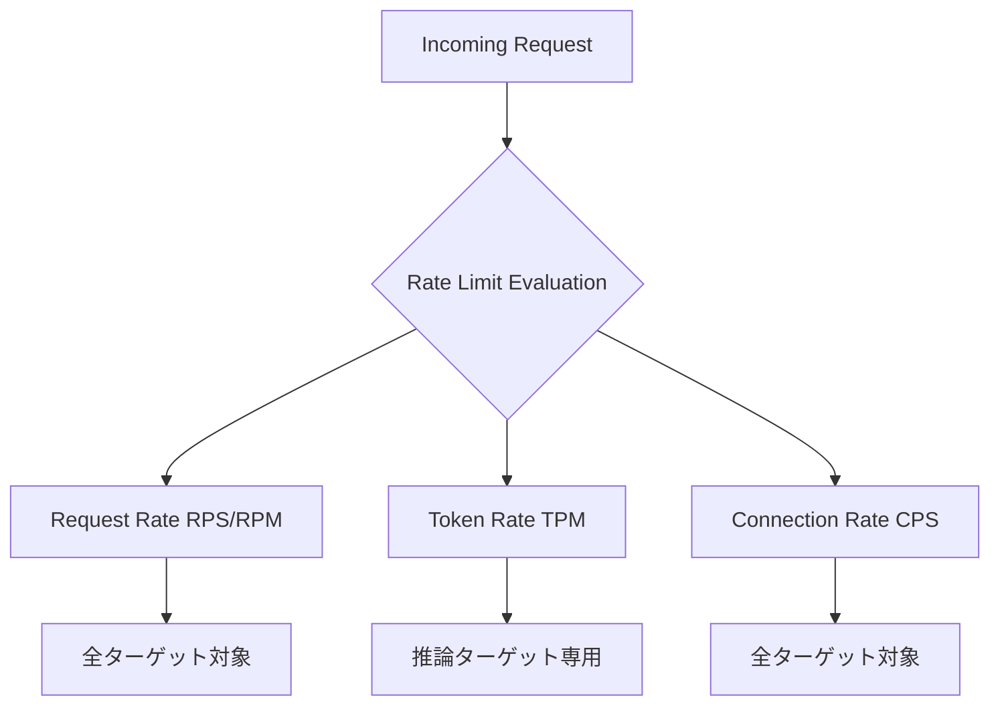
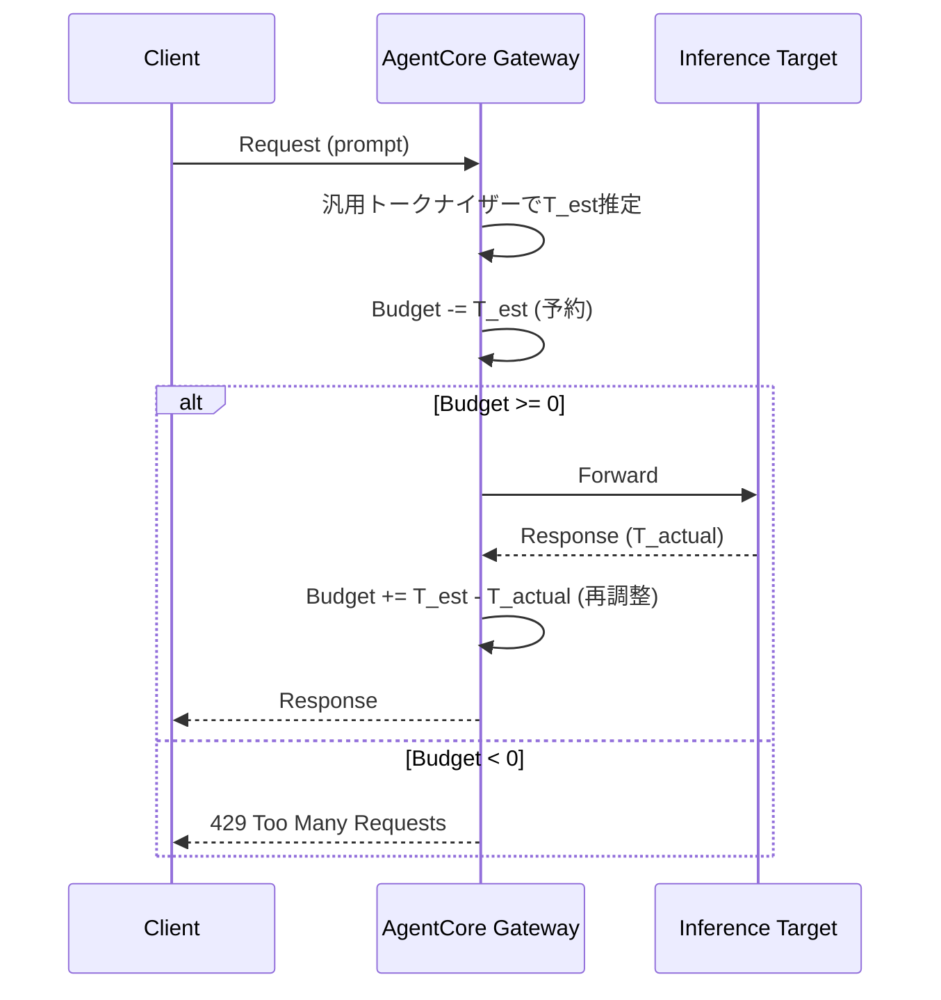

## ブログ概要（Summary）

本記事は [https://aws.amazon.com/blogs/machine-learning/configure-rate-limits-for-ai-traffic-on-agentcore-gateway/](https://aws.amazon.com/blogs/machine-learning/configure-rate-limits-for-ai-traffic-on-agentcore-gateway/) の解説記事です。

AWS Bedrock AgentCore Gatewayは、AIエージェントトラフィックに対して3種類のレート制限メトリック（Request Rate、Token Rate、Connection Rate）を提供する。Dimension keysを用いてJWTクレームやIAMプリンシパル単位でトラフィックを分類し、ロンゲストマッチによるルール評価で柔軟な流量制御を実現する。AWS公式ブログでは、Per-Role制限やMulti-Dimensional制限のAPI設定例、Agentic workloadsにおけるOBOトークン交換パターン、運用上のベストプラクティスが解説されている。

この記事は [Zenn記事: Bedrock AgentCore Gatewayレート制限で社内ヘルプデスクエージェントを安定運用する](https://zenn.dev/0h_n0/articles/44415eb1f43660) の深掘りです。

## 情報源

- **種別**: 企業テックブログ（AWS Machine Learning Blog）
- **URL**: [Configure rate limits for AI traffic on AgentCore gateway](https://aws.amazon.com/blogs/machine-learning/configure-rate-limits-for-ai-traffic-on-agentcore-gateway/)
- **著者**: Anagh Agrawal, Shravani Banda, Eashan Kaushik 他
- **組織**: Amazon Web Services (AWS)
- **発表日**: 2026年8月6日

## 技術的背景（Technical Background）

AIエージェントのトラフィックには、従来のWebアプリケーションとは異なる3つの特性がある。第一に、同一リクエストでもプロンプト長・レスポンス長が大幅に異なるため、リクエスト数だけでは実際のリソース消費を把握できない。第二に、SSEによるストリーミング推論では1つのHTTP接続が数十秒保持される。第三に、1つのエージェント起動が内部で複数のLLM呼び出しやツール呼び出しを連鎖的に実行する。

AWS公式ブログによれば、AgentCore Gatewayはこれらの課題に対し、リクエスト数・トークン数・接続数の3軸でレート制限を構成可能にすることで、AIネイティブなトラフィック制御を実現している。従来のAPI Gateway（AWS API GatewayのUsage Plans等）はリクエスト数ベースが主流であり、Gateway層でトークン推定・再調整を行う点がAgentCore Gatewayの設計上の特徴である。

## 実装アーキテクチャ（Architecture）

### 3種のレート制限メトリック



**Request Rate（RPS/RPM）**: 全ターゲットタイプに適用。1リクエスト = 1カウント。

**Token Rate（TPM）**: 推論ターゲット専用。AWS公式ブログによれば、汎用トークナイザーで入力トークン数を推定し予約（reserve）、レスポンス完了後に実トークン数で再調整（reconcile）する。

$$
\text{Budget}_{\text{remaining}} = \text{Budget}_{\text{total}} - \sum_{i \in \text{active}} \hat{T}_i
$$

ここで $\hat{T}_i$ はリクエスト $i$ の推定トークン数。完了時に実測値 $T_i$ で置換する。

**Connection Rate（CPS）**: 全ターゲットに適用。ストリーミング推論では接続保持時間全体がカウント対象となり、長時間のSSE接続によるリソース占有を制御する。

### Dimension Keysによるトラフィック分類

| カテゴリ | Dimension Key | 用途 |
|---------|---------------|------|
| ターゲット | `targetName`, `toolName`, `qualifiedModelId` | ターゲット・モデル別分類 |
| JWT | `$.context.jwt.<claim>` | ロール・ユーザー別分類 |
| IAM | `$.context.iam.principal`, `$.context.iam.sourceIdentity` | IAMプリンシパル別分類 |

### マッチング優先順位

AWS公式ブログによれば、ルール評価順序は以下の3段階である。

1. **Dimension count（ロンゲストマッチ）**: より多くのdimension keysを持つルールが優先。$\text{Priority}(r) = |D(r)|$
2. **名前マッチ > ワイルドカード**: 具体値が `*` より優先。ワイルドカードは末尾位置のみ
3. **タイトなレート優先**: 低いレート値のルールが先に評価。最初のdenialで短絡評価

```python
from dataclasses import dataclass


@dataclass
class RateLimitRule:
    """レート制限ルールの優先度計算"""
    dimensions: dict[str, str]
    rate: int

    def sort_key(self) -> tuple[int, int, int]:
        """(dimension数降順, wildcard有無, rate昇順)"""
        return (
            -len(self.dimensions),
            int(any(v == "*" for v in self.dimensions.values())),
            self.rate,
        )
```

### Token Budget Enforcement Model



### Per-Role制限の設定例

AWS公式ブログの設定例より、JWTのroleクレームに基づくPer-Role制限を示す。

```bash
aws bedrock-agentcore-control create-gateway-rate-limit \
  --gateway-identifier my-gateway-abc1234567 \
  --dimension-keys '["$.context.jwt.role"]' \
  --entries '[
    {"dimensions": {"$.context.jwt.role": "[\"Basic\"]"}, "requests": [{"rate": 100, "period": "minute"}]},
    {"dimensions": {"$.context.jwt.role": "[\"Advanced\"]"}, "requests": [{"rate": 300, "period": "minute"}]},
    {"dimensions": {"$.context.jwt.role": "*"}, "requests": [{"rate": 50, "period": "minute"}]}
  ]'
```

最後のワイルドカードエントリがcatch-allとして機能し、未マッチリクエストのバイパスを防ぐ。

## Production Deployment Guide

### AWS実装パターン（コスト最適化重視）

コスト試算は2026年8月時点のAWS ap-northeast-1料金に基づく概算値。実際のコストはトラフィックパターンにより変動する。

| 構成 | トラフィック | 主要サービス | 月額概算 |
|------|------------|-------------|---------|
| Small | ~100 req/日 | Lambda + AgentCore GW + DynamoDB | $50-150 |
| Medium | ~1,000 req/日 | ECS Fargate + AgentCore GW + ElastiCache | $300-800 |
| Large | 10,000+ req/日 | EKS + Karpenter + AgentCore GW | $2,000-5,000 |

**コスト削減テクニック**:
- Bedrock Batch API使用で推論コスト50%削減（非リアルタイム向け）
- Prompt Caching有効化で入力トークンコスト30-90%削減
- `rate: 0`設定で不要なモデル呼び出しを事前ブロックしBedrock課金回避
- Spot Instances活用で最大90%削減（EKS Large構成）

### Terraformインフラコード

**Small構成（Serverless）**:

```hcl
terraform {
  required_version = ">= 1.9.0"
  required_providers {
    aws = { source = "hashicorp/aws", version = "~> 5.60" }
  }
}

provider "aws" { region = "ap-northeast-1" }

# IAMロール（最小権限）
resource "aws_iam_role" "agent_lambda" {
  name = "agentcore-rate-limit-lambda"
  assume_role_policy = jsonencode({
    Version = "2012-10-17"
    Statement = [{ Action = "sts:AssumeRole", Effect = "Allow",
      Principal = { Service = "lambda.amazonaws.com" } }]
  })
}

resource "aws_iam_role_policy" "lambda_policy" {
  name = "agentcore-policy"
  role = aws_iam_role.agent_lambda.id
  policy = jsonencode({
    Version = "2012-10-17"
    Statement = [
      { Effect = "Allow",
        Action = ["bedrock-agentcore:InvokeAgent"],
        Resource = "arn:aws:bedrock-agentcore:ap-northeast-1:*:gateway/*" },
      { Effect = "Allow",
        Action = ["dynamodb:PutItem", "dynamodb:Query"],
        Resource = aws_dynamodb_table.logs.arn },
      { Effect = "Allow",
        Action = ["logs:CreateLogGroup", "logs:CreateLogStream", "logs:PutLogEvents"],
        Resource = "arn:aws:logs:ap-northeast-1:*:*" }
    ]
  })
}

# DynamoDB（On-Demand + TTL 30日）
resource "aws_dynamodb_table" "logs" {
  name = "agentcore-rate-limit-logs"
  billing_mode = "PAY_PER_REQUEST"
  hash_key = "request_id"
  range_key = "timestamp"
  attribute { name = "request_id"; type = "S" }
  attribute { name = "timestamp"; type = "N" }
  server_side_encryption { enabled = true }
  ttl { attribute_name = "ttl"; enabled = true }
}

# Lambda
resource "aws_lambda_function" "handler" {
  function_name = "agentcore-handler"
  runtime = "python3.12"
  handler = "handler.lambda_handler"
  role = aws_iam_role.agent_lambda.arn
  timeout = 60
  memory_size = 256
  filename = "lambda.zip"
  source_code_hash = filebase64sha256("lambda.zip")
  environment { variables = { GATEWAY_ID = var.gateway_id } }
  tracing_config { mode = "Active" }
}

variable "gateway_id" { type = string }
```

**Large構成（EKS + Karpenter Spot）**:

```hcl
module "eks" {
  source  = "terraform-aws-modules/eks/aws"
  version = "~> 20.24"
  cluster_name    = "agentcore-cluster"
  cluster_version = "1.31"
  vpc_id     = var.vpc_id
  subnet_ids = var.private_subnet_ids
  cluster_endpoint_public_access = false
  enable_irsa = true
}

# Karpenter NodePool（Spot優先）
resource "kubectl_manifest" "nodepool" {
  yaml_body = yamlencode({
    apiVersion = "karpenter.sh/v1"
    kind = "NodePool"
    metadata = { name = "agentcore-spot" }
    spec = {
      template = { spec = { requirements = [
        { key = "karpenter.sh/capacity-type", operator = "In", values = ["spot", "on-demand"] },
        { key = "node.kubernetes.io/instance-type", operator = "In",
          values = ["m7i.xlarge", "m7i.2xlarge", "m6i.xlarge"] }
      ] } }
      limits = { cpu = "64", memory = "256Gi" }
      disruption = { consolidationPolicy = "WhenEmptyOrUnderutilized", consolidateAfter = "30s" }
    }
  })
}

resource "aws_budgets_budget" "monthly" {
  name = "agentcore-monthly"
  budget_type = "COST"
  limit_amount = "5000"
  limit_unit = "USD"
  time_unit = "MONTHLY"
  notification {
    comparison_operator = "GREATER_THAN"
    threshold = 80
    threshold_type = "PERCENTAGE"
    notification_type = "ACTUAL"
    subscriber_email_addresses = [var.alert_email]
  }
}
```

### 運用・監視設定

**CloudWatch Logs Insights**:

```
fields @timestamp, @message
| filter @message like /429/
| stats count() as denied by bin(1h)
| sort @timestamp desc
```

**レート制限拒否アラーム + Cost Explorerレポート（Python）**:

```python
import datetime
import json
import boto3


def create_denial_alarm(gateway_id: str, sns_arn: str) -> dict:
    """レート制限拒否数のCloudWatchアラーム作成"""
    cw = boto3.client("cloudwatch", region_name="ap-northeast-1")
    return cw.put_metric_alarm(
        AlarmName=f"agentcore-{gateway_id}-denials",
        MetricName="RateLimitDenials",
        Namespace="AgentCore/Gateway",
        Statistic="Sum", Period=300, EvaluationPeriods=1,
        Threshold=50, ComparisonOperator="GreaterThanThreshold",
        AlarmActions=[sns_arn],
        Dimensions=[{"Name": "GatewayId", "Value": gateway_id}],
    )


def daily_cost_report(threshold_usd: float = 100.0, sns_arn: str = "") -> dict[str, float]:
    """Bedrock/Lambda/EKSの日次コスト取得。閾値超過でSNS通知"""
    ce = boto3.client("ce", region_name="us-east-1")
    end = datetime.date.today()
    start = end - datetime.timedelta(days=1)
    resp = ce.get_cost_and_usage(
        TimePeriod={"Start": start.isoformat(), "End": end.isoformat()},
        Granularity="DAILY", Metrics=["UnblendedCost"],
        Filter={"Or": [
            {"Dimensions": {"Key": "SERVICE", "Values": [s]}}
            for s in ["Amazon Bedrock", "AWS Lambda", "Amazon EKS"]
        ]},
        GroupBy=[{"Type": "DIMENSION", "Key": "SERVICE"}],
    )
    costs = {g["Keys"][0]: float(g["Metrics"]["UnblendedCost"]["Amount"])
             for r in resp["ResultsByTime"] for g in r["Groups"]}
    if sum(costs.values()) > threshold_usd and sns_arn:
        boto3.client("sns", region_name="ap-northeast-1").publish(
            TopicArn=sns_arn, Subject=f"Cost Alert: ${sum(costs.values()):.2f}/day",
            Message=json.dumps(costs, indent=2))
    return costs
```

### コスト最適化チェックリスト

**アーキテクチャ選択**:
- [ ] トラフィック量で構成選択（Small: Serverless / Medium: Hybrid / Large: Container）
- [ ] `rate: 0`で不要モデル呼び出しを事前ブロック
- [ ] Catch-allエントリで未マッチトラフィックにデフォルト制限設定

**リソース最適化**:
- [ ] EC2/EKS: Spot Instances優先（最大90%削減）
- [ ] Reserved Instances: 1年コミット（最大72%削減）
- [ ] Savings Plans検討
- [ ] Lambda: Power Tuningでメモリ最適化
- [ ] Karpenter consolidationでアイドルノード削減

**LLMコスト削減**:
- [ ] Bedrock Batch API（非リアルタイムで50%削減）
- [ ] Prompt Caching有効化（30-90%削減）
- [ ] 軽量タスクにHaikuクラスモデル使用
- [ ] `max_tokens`を最小限に設定
- [ ] Dimension keysでモデル別TPM上限設定

**監視・アラート**:
- [ ] AWS Budgets: 月額予算80%/100%通知
- [ ] CloudWatch: レート制限拒否スパイク検知
- [ ] Cost Anomaly Detection有効化
- [ ] 日次コストレポート自動取得

**リソース管理**:
- [ ] 未使用AgentCoreターゲット削除
- [ ] `Environment`/`CostCenter`/`Team`タグ付与
- [ ] DynamoDB TTLでログ自動削除（30日）
- [ ] 開発環境の夜間・週末ノード停止

## パフォーマンス最適化（Performance）

### Token Rate推定の精度と影響

AWS公式ブログによれば、汎用トークナイザーによるトークン推定はリクエスト受付時に実行される。推定誤差には2方向の影響がある。過大推定ではバジェットが過剰消費され許容可能なリクエストが拒否される（偽陽性）。過小推定ではバジェットオーバーランが一時的に発生するが、完了後の再調整で中長期的な精度は維持される。

### ストリーミング推論のCPS最適化

ストリーミング推論ではConnection Rate制限が支配的になりやすい。接続保持時間全体がカウント対象のため、同時接続数を意識したクライアント側のキューイングが有効である。CPS上限に近い場合、レスポンス完了を待ってから次の接続を開始するバックプレッシャー制御が推奨される。

## 運用での学び（Production Lessons）

### Catch-allエントリの必須化

AWS公式ブログでは、ワイルドカード `*` によるcatch-allエントリの設定を強く推奨している。catch-allがない場合、dimension keysにマッチしないリクエストはレート制限を**バイパス**する。これはセキュリティ上の盲点となりうる。

### Fail-open Semanticsの理解

AgentCore Gatewayのレート制限はfail-open semanticsで動作する。レート制限システム自体に障害が発生した場合、リクエストは制限なしで通過する。そのため、レート制限をセキュリティ境界として単独で依存せず、AgentCore Policyによる認可制御との併用が前提となる。評価順序は Rate Limit → AgentCore Policy であり、`rate: 0`でPolicy評価前にブロックできる。

### 高カーディナリティDimension Keyの回避

AWS公式ブログでは、`jti`、`nonce`、`iat`等のリクエストごとに一意の値を持つJWTクレームをdimension keyとして使用することを避けるべきと述べている。`role`、`team`、`department`等の低カーディナリティなクレームが推奨される。

### Agentic Workloadsの多層制御

エージェントワークロードでは2レベルでレート制限を適用する。Agent Invocation層ではエージェントターゲット自体のRPS/CPS制限でユーザーからの直接呼び出しを制御する。Downstream Resources層ではエージェントが消費する下流リソース（LLMモデル、ツール）を制限する。OBO（on-behalf-of）トークン交換によりユーザーIDが下流に伝播し、ユーザー単位の消費追跡が可能になる。

## 学術研究との関連（Academic Connection）

AgentCore Gatewayのトークン予約・再調整モデルは、分散システムにおけるリソース予約（resource reservation）の概念と類似する。ネットワーク帯域制御のRSVPやDiffServのように、不確実なリソース消費量に対して推定量を予約し完了後に調整するアプローチは一般的な設計パターンである。Multi-dimensional rate limitingは、QoS分野のトラフィック分類やTCAMベースのパケット分類と同様に、ロンゲストマッチルールで柔軟性と評価効率のバランスを取る設計である。

## まとめと実践への示唆

AWS公式ブログは、AgentCore Gatewayの3種メトリック（Request Rate、Token Rate、Connection Rate）とdimension keysによるトラフィック分類が、AIエージェントトラフィック固有の特性に適した流量制御を実現すると述べている。

実践上の要点は4つある。第一に、リクエスト数・トークン消費量・接続保持時間の3軸制御によりLLM推論リソースの公平な配分が可能になる。第二に、JWT/IAMベースのdimension keysでロール別・モデル別の柔軟な制限を構成できる。第三に、catch-allエントリは未マッチバイパス防止のため必須である。第四に、fail-open semanticsのためAgentCore Policyとの併用が前提となる。

制約として、汎用トークナイザーとモデル固有トークナイザーの乖離、fail-open時のフォールバック戦略の必要性、高カーディナリティdimension keyの非実用性がある。

## 参考文献

- **Blog URL**: [Configure rate limits for AI traffic on AgentCore gateway](https://aws.amazon.com/blogs/machine-learning/configure-rate-limits-for-ai-traffic-on-agentcore-gateway/)
- **AWS Documentation**: [Amazon Bedrock AgentCore](https://docs.aws.amazon.com/bedrock/latest/userguide/agentcore.html)
- **Related Zenn article**: [Bedrock AgentCore Gatewayレート制限で社内ヘルプデスクエージェントを安定運用する](https://zenn.dev/0h_n0/articles/44415eb1f43660)
