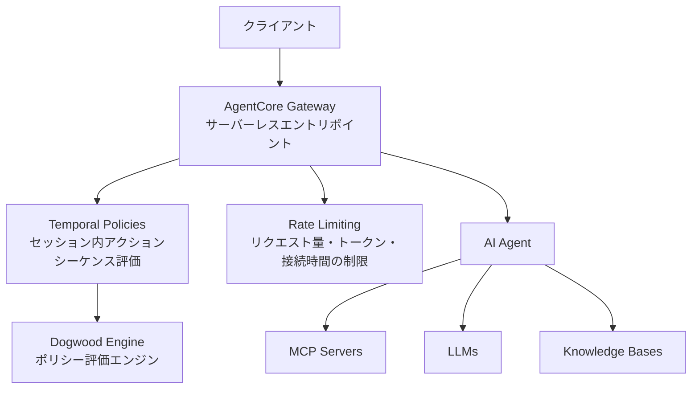

## ブログ概要

本記事は [https://aws.amazon.com/blogs/machine-learning/control-agent-behaviors-and-cost-beyond-a-single-action-new-capabilities-in-amazon-bedrock-agentcore/](https://aws.amazon.com/blogs/machine-learning/control-agent-behaviors-and-cost-beyond-a-single-action-new-capabilities-in-amazon-bedrock-agentcore/) の解説記事です。

Amazon Bedrock AgentCoreに、エージェントの行動制御とコスト管理を強化する3つの新機能が追加された。AWSのMadhu Parthasarathyが2026年8月6日に公開したブログ記事では、**Temporal Policies**（時間的ポリシー）、**Dogwood Policy Language**（エージェントガバナンス専用ポリシー言語）、**Gateway Rate Limiting**（ゲートウェイレベルのレート制限）の3つの制御機構を紹介している。これらの機構はいずれもAgentCoreのGateway層で動作し、エージェントのアプリケーションコードを変更せずにセキュリティとコスト制御を実現する点が特徴である。

この記事は [Zenn記事: Bedrock AgentCore Gatewayレート制限で社内ヘルプデスクエージェントを安定運用する](https://zenn.dev/0h_n0/articles/44415eb1f43660) の深掘りです。

## 情報源

- **種別**: 企業テックブログ（AWS Machine Learning Blog）
- **URL**: [Control agent behaviors and cost beyond a single action](https://aws.amazon.com/blogs/machine-learning/control-agent-behaviors-and-cost-beyond-a-single-action-new-capabilities-in-amazon-bedrock-agentcore/)
- **著者**: Madhu Parthasarathy
- **組織**: Amazon Web Services (AWS)
- **公開日**: 2026年8月6日

## 技術的背景

### エージェントAIにおけるガバナンスの課題

McKinseyの2026年調査によれば、**約80%の組織がAIエージェントによるリスクのある行動を既に経験している**とされる。同調査では、セキュリティとリスクへの懸念がエージェントAIのスケーリングにおける最大の障壁として識別されている。

従来のガードレール（入力フィルタリング、出力検証など）は、実行パスが事前に確定する予測可能なソフトウェアを前提として設計されていた。しかし、AIエージェントは実行時に自律的にツール選択や行動順序を決定するため、**個別アクション単位の評価だけでは制御が不十分**となる。

Parthasarathyはブログ記事において、この問題を以下のように整理している。

- **個別アクション評価の限界**: 送金処理において各アクション（残高照会、送金実行）が単独では正当でも、照会した金額と異なる額を送金するシーケンスは不正である
- **予算超過の検知困難**: 個別の購入が閾値以下でも、セッション内の累積支出が予算を超える場合がある
- **ステップ順序の保証不在**: 人間の承認を前提条件とするワークフローでも、承認ステップをスキップして実行される可能性がある

### コスト管理の構造的問題

Forresterの「The State Of Agentic AI In 2026」によれば、コスト懸念がエージェントAIのスケールを妨げる主要因である。Parthasarathyは、エージェントのコスト予測が困難な理由として、自律的意思決定によりトークン消費パターンが予測不可能になる点を指摘している。

## 実装アーキテクチャ

AgentCoreの設計哲学について、AWS公式ブログでは「セキュリティ制御はインフラストラクチャ層に配置し、すべてのエージェントに対して一貫して強制すべきであり、各チームが異なる方法で実装するアプリケーションコードに置くべきではない」と述べている。

以下に3つの新機能のアーキテクチャ上の位置づけを示す。



3つの機能はいずれもGateway層で動作するため、**既に本番稼働中のエージェントを再設計する必要がない**。各機能は独立して導入可能である。

### 1. Temporal Policies（時間的ポリシー）

Temporal Policiesは、AgentCoreの認可フレームワークをステートレスな個別リクエスト評価から、**セッション内のアクションシーケンス全体の評価**へ拡張する機能である。

#### 意思決定モデル

Parthasarathyによれば、Temporal Policiesの意思決定モデルは以下の4つの原則に基づく。

| 原則 | 説明 |
|------|------|
| ステートレス | ポリシーエンジン自体は状態を持たず、セッションのイベント履歴を入力として評価する |
| 決定論的 | 同一の入力（イベント履歴 + 現在のアクション）に対して常に同一の結果を返す |
| Deny-by-default | 明示的にpermitされないアクションはすべて拒否される |
| 包括的ログ | すべての判定（permit/deny）とその根拠が記録される |

#### ユースケース

ブログ記事で紹介されている代表的なユースケースは以下の通りである。

- **値の一貫性チェック**: 口座残高照会で返された金額と送金リクエストの金額が一致しない場合にブロック
- **累積予算追跡**: セッション内の累積支出が閾値到達時にブロック（個別購入額が制限以下でも合計で判定）
- **ステップ順序の強制**: 人間の承認など所定の前提条件の完了を要求
- **動的権限縮小**: ユーザー離脱時にエージェント権限を動的に縮小

Temporal PoliciesがGateway層（エージェントのコード外）で動作する点は重要である。プロンプトインジェクションやモデル欠陥によってエージェントが不正な行動を取ろうとしても、**ポリシー評価はエージェントの制御外で実行されるため回避できない**。

### 2. Dogwood Policy Language

Dogwoodは、エージェントガバナンスのために設計された新しいオープンソースのポリシー言語である。Apache 2.0ライセンスで公開されており、GitHubリポジトリ（[github.com/dogwood-policy/dogwood](https://github.com/dogwood-policy/dogwood)）で仕様と参照実装が利用可能である。

#### Cedarとの関係と拡張要素

Dogwoodは、AWSが開発した認可ポリシー言語**Cedar**（`permit`/`forbid`宣言と`when`/`unless`条件式によるRBAC/ABACポリシー記述言語）を基盤とし、エージェント固有の時間的構造を追加した上位互換言語である。追加された時間的構造は以下の4つである。

| 構造 | 説明 | 用途例 |
|------|------|--------|
| Time Windows | `within 1h`のような時間範囲内のイベント履歴を評価 | ログイン後1時間以内のアクセスのみ許可 |
| Prerequisite Steps | `formerly`条件で先行アクションの完了を要求 | 承認ステップ完了後にのみ実行を許可 |
| Windowed Aggregations | 時間範囲内のイベント集合に対する集計計算 | 直近1時間の累積支出が閾値以下であることを確認 |
| Escalation Triggers | 条件に応じた権限昇格・縮小のトリガー | 高額取引時に追加承認を要求 |

#### ポリシー構文例

Dogwoodリポジトリの公開情報に基づく基本的な構文例を示す。

```
permit(principal, action, resource)
when { context.input.amount < 1000 }
when formerly within 1h {
    Action::"Approve"::request{ approver: context.input.approver }
};
```

このポリシーは以下を表現している。

- `context.input.amount < 1000`: 対象アクションの金額が1000未満であること
- `formerly within 1h`: 直近1時間以内に、指定された承認者による`Approve`アクションが完了していること

両方の条件が満たされた場合にのみ`permit`（許可）が返される。

#### コンパイル戦略

Dogwoodのポリシーは内部的に**Cedar形式にコンパイル（lowering）**される。時間的条件は`context.*`スロットに変換され、ランタイムがイベント履歴から値を注入する。Cedar評価エンジン自体は変更されないため、高速性と分析可能性がそのまま維持される。

#### CLI操作

Dogwoodの参照実装は以下のCLIコマンドを提供する。

```bash
# ポリシーの構文検証
dogwood validate policy.dw --policy-schema schema.cedarschema

# Cedar形式へのコンパイル
dogwood lower policy.dw --policy-schema schema.cedarschema --emit both

# イベントログに対するポリシーのリプレイ
dogwood replay policy.dw --policy-schema schema.cedarschema --trace events.log
```

`replay`コマンドは、タイムスタンプ付きイベントログに対してポリシーを適用し、各意思決定ポイントでの判定結果を出力する。これにより、ポリシーの動作検証やデバッグが可能である。

#### 参照実装の制約

Dogwoodリポジトリの公式ドキュメントでは、参照実装が**本番利用を意図していない**ことが明記されている。タイムスタンプ検証、イベント認証、マルチテナント分離、スクリプトサンドボックスなどが未実装であり、本番導入にはこれらを別途実装する必要がある。

### 3. Gateway Rate Limiting

Gateway Rate Limitingは、AgentCoreのサーバーレスGatewayに直接組み込まれたレート制限機能である。

#### 制御次元

Parthasarathyによれば、Rate Limitingは以下の3つの次元で制御を提供する。

| 制御次元 | 説明 | 粒度 |
|---------|------|------|
| リクエスト量/ユーザー | ユーザーごとのリクエスト数制限 | 秒・分単位 |
| トークン消費量/モデル | モデルごとのトークン消費上限 | 秒・分単位 |
| 接続時間 | 接続保持時間の制限 | 秒単位 |

#### ID基盤との統合

Rate Limitingは既存の**OAuthまたはIAM**による認証基盤と統合される。ユーザー・チーム・ツール・モデルの組み合わせごとに異なる上限を設定可能であり、エージェントのコード変更は不要である。

Rate Limitingが対処する主要な障害モードは、リトライループ（無制限再試行）、重量セッション（想定外のトークン大量消費）、予測不可能な消費パターンの3つである。設定後即座に効果を発揮する。関連Zenn記事では、このRate Limitingを社内ヘルプデスクシナリオに適用する実装パターンを解説しており、本記事は設計思想と技術的背景を補完する位置づけである。

## Production Deployment Guide

### AWS実装パターン（コスト最適化重視）

Temporal PoliciesとRate Limitingを組み合わせたAgentCoreベースのエージェントシステムについて、トラフィック量別の推奨構成を示す。

**コスト試算の注意事項**: 以下は2026年8月時点のAWS ap-northeast-1（東京）リージョン料金に基づく概算値である。実際のコストはトラフィックパターン、リージョン、バースト使用量により変動する。最新料金はAWS料金計算ツールで確認を推奨する。

| 構成 | トラフィック | 主要サービス | 月額概算 |
|------|------------|-------------|---------|
| Small | ~100 req/日 | Lambda + Bedrock + AgentCore Gateway | $50-150 |
| Medium | ~1,000 req/日 | ECS Fargate + Bedrock + AgentCore Gateway | $300-800 |
| Large | 10,000+ req/日 | EKS + Spot + Bedrock + AgentCore Gateway | $2,000-5,000 |

**Small構成（Serverless）の詳細**:
- Lambda: 256MB, 30秒タイムアウト, ~3,000回/月
- AgentCore Gateway: Rate Limiting設定（100 req/user/日, 10,000 tokens/model/分）
- Bedrock: Claude Sonnet on-demand
- DynamoDB On-Demand: セッションイベント履歴保存
- 月額内訳: Lambda $5 + Bedrock $30-100 + DynamoDB $5 + Gateway $10

**Large構成（Container）の詳細**:
- EKS: t3.medium (Control Plane) + Karpenter (Spot優先)
- AgentCore Gateway: Temporal Policies + Rate Limiting併用
- Bedrock: Claude Sonnet/Haiku自動選択、Batch API併用
- ElastiCache (Redis): ポリシー評価結果キャッシュ
- 月額内訳: EKS $75 + EC2 Spot $200-500 + Bedrock $1,000-3,000 + Redis $50 + Gateway $100

**コスト削減テクニック**:
- Spot Instances活用でEC2コスト最大90%削減
- Reserved Instances（1年コミット）で最大72%削減
- Bedrock Batch API使用で非リアルタイム処理50%削減
- Prompt Caching有効化で繰り返しコンテキスト30-90%削減
- Rate Limitingによるリトライループ起因のトークン浪費防止

### Terraformインフラコード

#### Small構成（Serverless）: Lambda + Bedrock + DynamoDB

```hcl
# AgentCore Gateway + Temporal Policies のServerless構成
# 2026-08時点のリソース・モジュールバージョン

resource "aws_iam_role" "agent_lambda" {
  name = "agentcore-lambda-role"
  assume_role_policy = jsonencode({
    Version = "2012-10-17"
    Statement = [{
      Action    = "sts:AssumeRole"
      Effect    = "Allow"
      Principal = { Service = "lambda.amazonaws.com" }
    }]
  })
}

resource "aws_iam_role_policy" "bedrock_invoke" {
  name = "bedrock-invoke"
  role = aws_iam_role.agent_lambda.id
  policy = jsonencode({
    Version = "2012-10-17"
    Statement = [
      {
        Effect   = "Allow"
        Action   = ["bedrock:InvokeModel", "bedrock:InvokeModelWithResponseStream"]
        Resource = "arn:aws:bedrock:ap-northeast-1::foundation-model/anthropic.*"
      },
      {
        Effect   = "Allow"
        Action   = ["dynamodb:PutItem", "dynamodb:GetItem", "dynamodb:Query"]
        Resource = aws_dynamodb_table.session_events.arn
      }
    ]
  })
}

resource "aws_dynamodb_table" "session_events" {
  name         = "agentcore-session-events"
  billing_mode = "PAY_PER_REQUEST" # On-Demand: 低トラフィック向けコスト最適
  hash_key     = "session_id"
  range_key    = "event_timestamp"

  attribute { name = "session_id"      type = "S" }
  attribute { name = "event_timestamp" type = "N" }

  ttl { attribute_name = "ttl" enabled = true } # 24h自動削除
  server_side_encryption { enabled = true }      # KMS暗号化
}

resource "aws_lambda_function" "agent" {
  function_name    = "agentcore-agent"
  runtime          = "python3.12"
  handler          = "handler.lambda_handler"
  role             = aws_iam_role.agent_lambda.arn
  timeout          = 30
  memory_size      = 256 # I/Oバウンドのため低メモリで十分
  filename         = "lambda.zip"
  source_code_hash = filebase64sha256("lambda.zip")
  environment {
    variables = {
      SESSION_TABLE = aws_dynamodb_table.session_events.name
      BEDROCK_MODEL = "anthropic.claude-sonnet-4-20250514-v1:0"
    }
  }
  tracing_config { mode = "Active" } # X-Ray有効化
}
```

#### Large構成（Container）: EKS + Karpenter + Spot

```hcl
module "eks" {
  source  = "terraform-aws-modules/eks/aws"
  version = "~> 20.20"
  cluster_name    = "agentcore-cluster"
  cluster_version = "1.30"
  vpc_id     = module.vpc.vpc_id
  subnet_ids = module.vpc.private_subnets
  cluster_endpoint_public_access = false
}

# Karpenter: Spot優先の自動スケーリング
resource "kubectl_manifest" "karpenter_nodepool" {
  yaml_body = yamlencode({
    apiVersion = "karpenter.sh/v1"
    kind       = "NodePool"
    metadata   = { name = "agentcore-spot" }
    spec = {
      template.spec.requirements = [
        { key = "karpenter.sh/capacity-type", operator = "In", values = ["spot", "on-demand"] },
        { key = "node.kubernetes.io/instance-type", operator = "In",
          values = ["m6i.large", "m6i.xlarge", "m7i.large", "m7i.xlarge"] }
      ]
      limits     = { cpu = "100", memory = "400Gi" }
      disruption = { consolidationPolicy = "WhenEmptyOrUnderutilized", consolidateAfter = "30s" }
    }
  })
}

resource "aws_budgets_budget" "agentcore" {
  name         = "agentcore-monthly"
  budget_type  = "COST"
  limit_amount = "5000"
  limit_unit   = "USD"
  time_unit    = "MONTHLY"
  notification {
    comparison_operator        = "GREATER_THAN"
    threshold                  = 80
    threshold_type             = "PERCENTAGE"
    notification_type          = "ACTUAL"
    subscriber_email_addresses = ["ops-team@example.com"]
  }
}
```

### 運用・監視設定

#### CloudWatch Logs Insights: ポリシー判定分析

```
# AgentCoreポリシー判定のdeny率分析
fields @timestamp, policy_decision, policy_name, session_id
| filter policy_decision = "deny"
| stats count(*) as deny_count by policy_name, bin(1h)
| sort deny_count desc
```

#### トークンスパイク検知アラーム（Python）

```python
import boto3

cloudwatch = boto3.client("cloudwatch", region_name="ap-northeast-1")

def create_token_spike_alarm(threshold: int = 100000) -> dict:
    """Bedrockトークン使用量スパイク検知アラームを作成する

    Args:
        threshold: 5分間のトークン使用量閾値

    Returns:
        CloudWatch APIレスポンス
    """
    return cloudwatch.put_metric_alarm(
        AlarmName="agentcore-token-spike",
        MetricName="InputTokenCount",
        Namespace="AWS/Bedrock",
        Statistic="Sum",
        Period=300,
        EvaluationPeriods=2,
        Threshold=threshold,
        ComparisonOperator="GreaterThanThreshold",
        AlarmActions=["arn:aws:sns:ap-northeast-1:123456789:agentcore-alerts"],
        TreatMissingData="notBreaching",
    )
```

#### Cost Explorer日次レポート（Python）

```python
import boto3
from datetime import datetime, timedelta

ce = boto3.client("ce", region_name="ap-northeast-1")
sns = boto3.client("sns", region_name="ap-northeast-1")

def daily_cost_report(alert_threshold_usd: float = 100.0) -> dict:
    """日次コストレポートを取得し閾値超過時にSNS通知する"""
    today = datetime.utcnow().strftime("%Y-%m-%d")
    yesterday = (datetime.utcnow() - timedelta(days=1)).strftime("%Y-%m-%d")

    response = ce.get_cost_and_usage(
        TimePeriod={"Start": yesterday, "End": today},
        Granularity="DAILY",
        Metrics=["UnblendedCost"],
        Filter={"Or": [
            {"Dimensions": {"Key": "SERVICE", "Values": ["Amazon Bedrock"]}},
            {"Dimensions": {"Key": "SERVICE", "Values": ["AWS Lambda"]}},
        ]},
        GroupBy=[{"Type": "DIMENSION", "Key": "SERVICE"}],
    )
    total = sum(
        float(g["Metrics"]["UnblendedCost"]["Amount"])
        for r in response["ResultsByTime"] for g in r["Groups"]
    )
    if total > alert_threshold_usd:
        sns.publish(
            TopicArn="arn:aws:sns:ap-northeast-1:123456789:agentcore-alerts",
            Subject=f"AgentCore日次コスト警告: ${total:.2f}",
            Message=f"日次コストが${alert_threshold_usd}を超過: ${total:.2f}",
        )
    return {"total_usd": total, "details": response["ResultsByTime"]}
```

### コスト最適化チェックリスト

**アーキテクチャ選択**:
- [ ] トラフィック量に応じた構成選択（~100 req/日: Serverless、~1,000: Hybrid、10,000+: Container）
- [ ] AgentCore Gatewayのサーバーレスモードを活用

**リソース最適化**:
- [ ] EC2/EKSノード: Spot Instances優先（最大90%削減）
- [ ] Reserved Instances: 安定ワークロードに1年コミット（最大72%削減）
- [ ] Lambda: メモリサイズ128-256MB最適化（I/Oバウンド）
- [ ] Karpenter: アイドル時30秒後にスケールダウン
- [ ] DynamoDB: On-Demand（低トラフィック）/ Provisioned（高トラフィック）

**LLMコスト削減**:
- [ ] Bedrock Batch API: 非リアルタイム処理で50%削減
- [ ] Prompt Caching有効化: 繰り返しプロンプトで30-90%削減
- [ ] モデル選択ロジック: Haiku/Sonnet動的切替
- [ ] `max_tokens`を必要最小限に設定
- [ ] Rate Limitingでリトライループのトークン浪費防止

**監視・アラート**:
- [ ] AWS Budgets: 月次予算80%到達でアラート
- [ ] CloudWatch: トークンスパイク・Lambda実行時間異常
- [ ] Cost Anomaly Detection: ML異常検知有効化
- [ ] Cost Explorer API + SNS日次通知

**リソース管理**:
- [ ] 未使用リソース定期棚卸し
- [ ] タグ戦略: `Project`, `Environment`, `CostCenter`統一
- [ ] DynamoDB TTL: 24時間自動削除
- [ ] 開発環境: 夜間・週末のノード停止
- [ ] CloudWatch Logs保持期間30日設定

## パフォーマンス最適化

### Gateway層での評価オーバーヘッド

Temporal PoliciesとRate LimitingはGateway層で評価されるため、リクエストごとに追加のレイテンシが発生する。AWS公式ブログでは実測値は未公開だが、設計上の最適化ポイントとして以下が挙げられる。

- **Dogwoodのコンパイル戦略**: デプロイ時にCedar形式にコンパイルされるため、評価時のパースコストが不要。Cedarはインデックスベースのポリシー検索と一定レイテンシ評価を設計原則としている
- **Time Windowによるスコープ制限**: `within 1h`のような指定で評価対象のイベント範囲を限定し、全履歴スキャンを回避
- **Deny-by-defaultの早期打切り**: 明示的permit不在時に残りのポリシー評価をスキップ可能

### Rate Limiting閾値の設計指針

正常時のベースラインを1-2週間観測した上で、その2-3倍を初期閾値として設定し、deny率を監視しながら段階的に引き下げるアプローチが現実的である。Parthasarathyは設定が「即座に効果を発揮する」と述べており、段階的調整が可能である。

## 運用での学び

### インフラ層へのセキュリティ移行の利点

- **一貫性の保証**: 複数チームが異なるフレームワークでエージェントを開発しても、Gateway層のポリシーが統一的に適用される
- **プロンプトインジェクション耐性**: エージェントのコード外でポリシー評価されるため、プロンプトインジェクションによるガードレール回避を構造的に防止できる
- **段階的導入**: Rate LimitingとTemporal Policiesは独立して導入可能で、既存エージェントの再設計が不要

### 考慮すべき制約

- **Gateway依存**: 全制御がGateway層に依存するため、Gateway障害時のフォールバック戦略（deny-by-default維持 or 制限なし通過）を事前に決定する必要がある
- **ポリシー設計の複雑性**: セッション横断的な条件定義はテスト・デバッグが複雑。`dogwood replay`によるイベントログベースの検証が重要
- **Dogwood参照実装の成熟度**: 本番利用を意図していないため、マネージドサービスとしての対応範囲は公式ドキュメントの確認が必要

## 学術研究との関連

### Agent Contractsとの比較

He & Yuによる「OpenKedge: Governing Agentic Mutation with Execution-Bound Safety and Evidence Chains」（arXiv:2604.08601）は、エージェントの行動を形式的な契約で制約するプロトコルを提案している。OpenKedgeではIntent-to-Execution Evidence Chain（IEEC）により意図・ポリシー判定・実行結果を暗号学的に紐付ける。AgentCoreのTemporal Policiesとは「エージェントの行動を実行前に評価する」pre-execution validationのパラダイムを共有しており、従来のpost-hoc monitoring（事後監視）からの転換を示す点で共通している。主な違いは、AgentCoreがマネージドサービスとしてセッション内イベント履歴を用いるのに対し、OpenKedgeは暗号学的Evidence Chainで監査可能性を保証する点である。

### 時間論理との関連

Dogwoodの`formerly within`構文は、形式的にはLinear Temporal Logic（LTL）の「過去演算子」（past operators）に相当する。ただし、Dogwoodの表現力はフルのLTLより限定的であり、Cedar上への効率的なコンパイルを可能にするためのトレードオフと解釈できる。Cedarの形式的分析可能性（automated reasoning）をDogwoodが継承しているため、時間的条件を含むポリシーの網羅性検証も理論上は可能だが、状態空間がイベント履歴長に応じて増大するため、実用的な範囲は限定される。

## まとめと実践への示唆

AWSのParthasarathyが紹介したAgentCoreの3つの新機能は、エージェントAIのガバナンスを**アプリケーション層からインフラストラクチャ層へ移動する**という設計哲学を具現化したものである。Temporal Policiesによるセッション横断的な行動評価、Dogwoodによる形式的なポリシー記述、Gateway Rate Limitingによるコスト封じ込めの3つが組み合わさることで、個別アクション評価では対処できなかった課題（値の一貫性、累積予算、ステップ順序、リトライループ）に対応できる。

実務への示唆として、以下の3点が重要である。

1. **段階的導入**: Rate Limitingから導入し、正常時のベースラインを観測した上でTemporal Policiesを追加する
2. **ポリシーのテスト**: `dogwood replay`を活用したイベントログベースの回帰テストを確立する
3. **コスト可視化**: Rate LimitingのDeny率とトークン消費量の相関を監視し、閾値を継続的に調整する

一方で、Dogwoodの参照実装が本番利用を想定していない点や、Temporal Policiesの複雑なポリシーにおけるデバッグの難しさは、導入前に十分な検証が必要である。

## 参考文献

- **Blog URL**: [Control agent behaviors and cost beyond a single action](https://aws.amazon.com/blogs/machine-learning/control-agent-behaviors-and-cost-beyond-a-single-action-new-capabilities-in-amazon-bedrock-agentcore/)
- **Dogwood**: [github.com/dogwood-policy/dogwood](https://github.com/dogwood-policy/dogwood)（Apache 2.0）
- **Cedar**: [github.com/cedar-policy/cedar](https://github.com/cedar-policy/cedar)
- **OpenKedge**: [arXiv:2604.08601](https://arxiv.org/abs/2604.08601) - Governing Agentic Mutation with Execution-Bound Safety and Evidence Chains
- **Related Zenn article**: [Bedrock AgentCore Gatewayレート制限で社内ヘルプデスクエージェントを安定運用する](https://zenn.dev/0h_n0/articles/44415eb1f43660)
