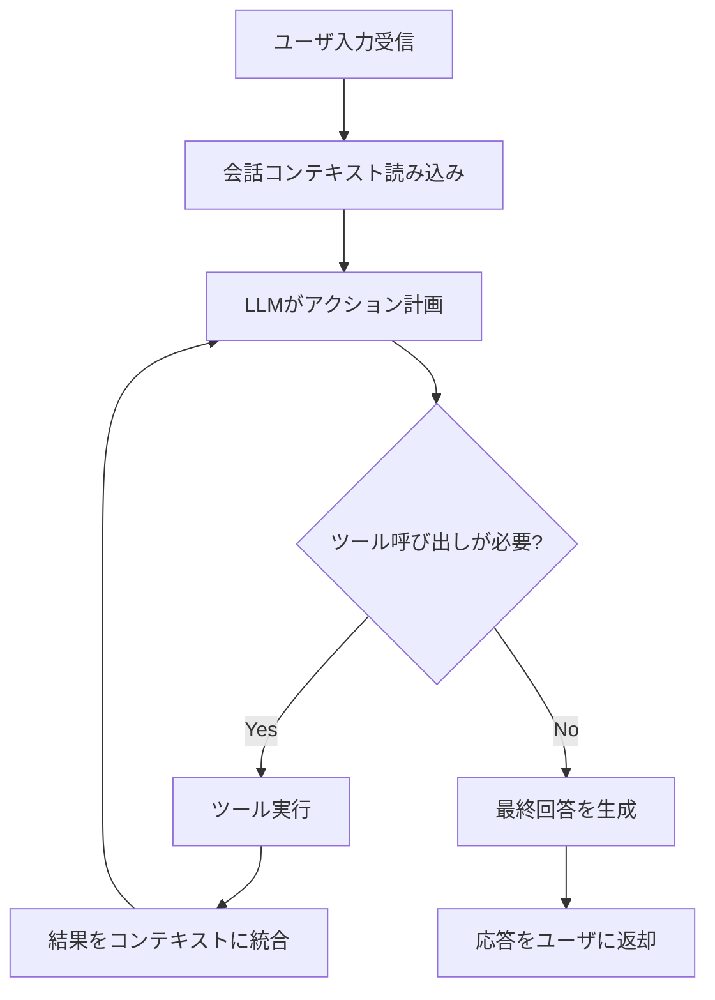
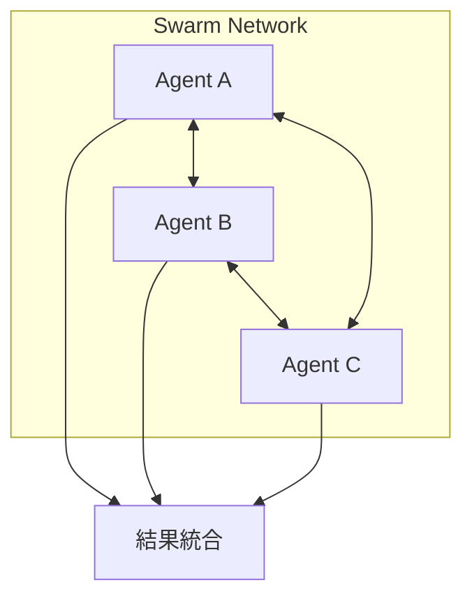
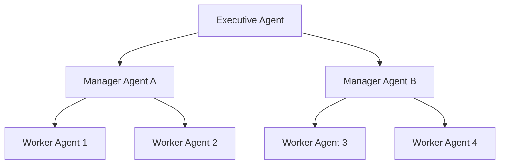

## ブログ概要（Summary）

本記事は [https://aws.amazon.com/blogs/machine-learning/strands-agents-sdk-a-technical-deep-dive-into-agent-architectures-and-observability/](https://aws.amazon.com/blogs/machine-learning/strands-agents-sdk-a-technical-deep-dive-into-agent-architectures-and-observability/) の解説記事です。

AWS PACEチームのJin Tan Ruan氏（2025年7月31日公開）は、Strands Agents SDKの技術的アーキテクチャを体系的に解説している。Strands Agents SDKはApache-2.0ライセンスのオープンソースフレームワークであり、LLMの推論能力を活用してプランニングとツール呼び出しを自律的に行う「model-driven」アプローチを採用している。開発者はプロンプトとツールを定義するだけで、オーケストレーションロジックをLLMに委譲できる。ブログでは、Single-Agent、Multi-Agent Swarm、Supervisor-Agent、Hierarchicalの4種のアーキテクチャパターン、OpenTelemetry統合によるオブザーバビリティ、Lambda/Fargate/AgentCoreを含む本番デプロイパターンを詳述している。Kiro、Amazon Q、AWS GlueなどのAWS本番システムで運用実績がある。

この記事は [Zenn記事: Bedrock AgentCore Gatewayレート制限で社内ヘルプデスクエージェントを安定運用する](https://zenn.dev/0h_n0/articles/44415eb1f43660) の深掘りです。

## Zenn記事との関連

Zenn記事ではBedrock AgentCoreのGateway機能を活用したレート制限と安定運用に焦点を当てている。本ブログはその上流にあるエージェントフレームワーク層、すなわち「どのようなアーキテクチャでエージェントを構成し、どのように観測可能性を確保するか」という設計判断を体系的に扱っている。Zenn記事で扱うAgentCoreランタイムは、本ブログが述べるデプロイメントパターンの1つに位置づけられ、Strands SDKのエージェントループとOpenTelemetryトレーシングの理解が、AgentCore上での安定運用設計をより深い文脈で支える。

## 情報源

- **種別**: 企業テックブログ
- **URL**: [https://aws.amazon.com/blogs/machine-learning/strands-agents-sdk-a-technical-deep-dive-into-agent-architectures-and-observability/](https://aws.amazon.com/blogs/machine-learning/strands-agents-sdk-a-technical-deep-dive-into-agent-architectures-and-observability/)
- **組織**: AWS（Industries Prototyping and Customer Engineering / PACEチーム）
- **著者**: Jin Tan Ruan（Senior Generative AI Developer）
- **発表日**: 2025年7月31日

## 技術的背景（Technical Background）

### なぜStrands SDKが必要か

LLMエージェントフレームワークには大きく2つの設計哲学がある。1つはLangChainに代表される「developer-driven」アプローチで、開発者がDAG（有向非巡回グラフ）やチェーンとしてワークフローを明示的に構築する。もう1つがStrands SDKが採用する「model-driven」アプローチで、LLM自身がプランナーかつオーケストレーターとして振る舞い、ツール選択と実行順序を自律的に決定する。

AWS公式ブログによれば、Strands SDKは以下の3つのコアコンポーネントのみで構成される。

1. **Language Model**: Amazon Bedrock、Anthropic API、OpenAI、Ollama等をサポートするプラガブルなプロバイダインタフェース
2. **System Prompt**: エージェントの役割・動作境界を定義するテキスト
3. **Tools**: `@tool`デコレータで定義するPython関数、MCP（Model Context Protocol）経由の外部ツール、A2A（Agent-to-Agent）プロトコル

この最小構成により、エージェント作成に必要なコードは数行に収まる。開発者はオーケストレーションロジックを書く必要がなく、LLMの推論能力に委譲する形になる。

### エージェントループの内部動作

Strands SDKのエージェントは以下のループで動作する。



著者はこのループを「model-driven orchestration」と呼び、開発者が分岐条件やステートマシンを定義する必要がない点を強調している。ループの反復回数制限やタイムアウト設定により、暴走を防止する設計になっている。

### 貢献組織とプロダクション実績

Accenture、Anthropic、Meta、PwCがコントリビュータとして参加しており、AnthropicはAPI統合、MetaはLlamaモデルサポートをそれぞれ貢献している。AWS内部ではKiro（AI開発環境）、Amazon Q（AIアシスタント）、AWS Glue（データ統合サービス）などの本番システムで使用されていると述べられている。

## 実装アーキテクチャ（Architecture）

### パターン1: Single-Agent

最もシンプルなパターンで、1つのLLMエージェントがツールセットを保持し、ユーザ入力に対して自律的にツールを選択・実行する。

```python
from strands import Agent
from strands_tools import calculator

agent = Agent(tools=[calculator])
result = agent("What is the square root of 1764?")
print(result)
```

この3行でエージェントが動作する。`Agent`クラスはデフォルトでAmazon Bedrockをモデルプロバイダとして使用し、`calculator`ツールを内部ループで自律的に呼び出す。質問応答、データ取得、シンプルなアシスタントに適している。

### パターン2: Multi-Agent Swarm（ネットワーク型）

中央オーケストレータなしに複数のエージェントがピアツーピアで協調するパターンである。著者は3つのバリアントを述べている。

- **Collaborative Swarm**: エージェント間でコンセンサスを構築する協調型
- **Competitive Swarm**: 並列実行と相互批評による競争型
- **Hybrid**: 協調と独立動作を混合するハイブリッド型



トポロジ定義には`agent_graph`ツールが使用される。メッシュ型通信、共有メモリ（ブラックボード）、メッセージパッシングチャネルなどの通信パターンをサポートしている。

### パターン3: Supervisor-Agent（オーケストレータ型）

メインエージェントが専門エージェントをツールとしてラップし、クエリに応じて委任するパターンである。これは人間の組織構造を模倣した設計と述べられている。

```python
from strands import Agent, tool
from strands_tools import retrieve, http_request, calculator

RESEARCH_ASSISTANT_PROMPT = """
You are a specialized research assistant. Focus on providing
factual, well-sourced information for research questions.
Always cite sources in your answers.
"""

@tool
def research_assistant(query: str) -> str:
    """Tool that uses a specialized agent to answer research queries."""
    research_agent = Agent(
        system_prompt=RESEARCH_ASSISTANT_PROMPT,
        tools=[retrieve, http_request]
    )
    return research_agent(query)

@tool
def math_assistant(query: str) -> str:
    """Tool that uses a specialized agent for math calculations."""
    math_agent = Agent(
        system_prompt="You are a math specialist.",
        tools=[calculator]
    )
    return math_agent(query)

# オーケストレータエージェント
orchestrator = Agent(
    system_prompt="You are an AI research assistant. You answer "
                  "questions with facts and citations. You have "
                  "tools for web research and math.",
    tools=[research_assistant, math_assistant]
)

answer = orchestrator(
    "What are the latest NASA findings on Mars, and how long "
    "would it take to travel from Earth to Mars at 20 km/s?"
)
```

このコードでは、`research_assistant`と`math_assistant`がそれぞれ独立した`Agent`インスタンスとして動作し、`@tool`デコレータによりオーケストレータから呼び出し可能なツールとして公開される。オーケストレータのLLMは、クエリの内容に基づいてどの専門エージェントに委任するかを自律的に判断する。

### パターン4: Hierarchical Architecture（階層型）

ツリー構造の階層的委任パターンで、Executive Agent（経営層）がManager Agent（管理層）に指示し、Manager AgentがWorker Agent（実行層）に具体的タスクを割り当てる。



情報はタスクとして下方に流れ、結果・レポートとして上方に流れる。`agent_graph`で階層的トポロジを定義する。プロジェクト管理、マルチステージワークフロー、自律的ソフトウェアエンジニアリングなどのユースケースが挙げられている。

### ツール定義とMCPサポート

ツールは`@tool`デコレータで定義する。Docstringがモデルのツール理解に使用されるため、明確な説明が重要である。

```python
from strands import tool

@tool
def search_documents(query: str, max_results: int = 5) -> str:
    """Search internal document store for relevant information.

    Args:
        query: Search query string
        max_results: Maximum number of results to return

    Returns:
        Formatted search results with document excerpts
    """
    # ドキュメント検索の実装
    results = document_store.search(query, limit=max_results)
    return format_results(results)
```

加えて、MCP（Model Context Protocol）によるオープンスタンダードベースの外部ツール統合、A2A（Agent-to-Agent）プロトコルによるエージェント間通信もサポートされている。ホットリロード機能により、開発中のツール変更が即座に反映される。

## Production Deployment Guide

### AWS実装パターン（コスト最適化重視）

Strands Agentsを本番環境にデプロイする際、著者はトラフィック量に応じた4つのパターンを述べている。以下にAWSサービス構成とコスト試算を示す。

**トラフィック量別の推奨構成**:

| 構成 | トラフィック | AWSサービス | 月額コスト概算 |
|------|------------|------------|--------------|
| Small | ~100 req/日 | Lambda + Bedrock + DynamoDB | $50-150 |
| Medium | ~1,000 req/日 | ECS Fargate + Bedrock + ElastiCache | $300-800 |
| Large | 10,000+ req/日 | EKS + Karpenter + Spot + Bedrock | $2,000-5,000 |
| Managed | 可変 | Bedrock AgentCore | 従量課金 |

**Small構成（Serverless）の詳細**:
- Lambda: 256MB RAM、30秒タイムアウト、関数URL経由でアクセス
- Bedrock: Claude 3.5 Sonnet（入力$3/MTok、出力$15/MTok）
- DynamoDB: On-Demandモード、会話履歴保存
- CloudWatch: ログ・メトリクス・アラーム
- 月額内訳: Lambda $5-10 + Bedrock $30-100 + DynamoDB $5-15 + CloudWatch $5-10

**Large構成（Container）の詳細**:
- EKS: コントロールプレーン$73/月
- Karpenter: Spot Instances優先（c5.xlarge相当、オンデマンド比最大90%削減）
- Bedrock: Batch API使用で50%削減
- Secrets Manager: API設定管理
- X-Ray + CloudWatch: 分散トレーシング・メトリクス
- 月額内訳: EKS $73 + Spot $200-800 + Bedrock $1,000-3,000 + 監視 $50-100

**コスト削減テクニック**:
- Spot Instances活用で最大90%削減（Karpenter Provisionerで自動フォールバック）
- Reserved Instances 1年コミットで最大72%削減
- Bedrock Batch API使用で50%削減（非リアルタイム処理向け）
- Prompt Caching有効化で30-90%削減（System Promptのキャッシュ）

注意: コスト試算は2026年8月時点のAWS ap-northeast-1（東京）リージョン料金に基づく概算値である。実際のコストはトラフィックパターン、リージョン、バースト使用量により変動する。最新料金はAWS料金計算ツールで確認を推奨する。

### Terraformインフラコード

**Small構成（Serverless）**: Lambda + Bedrock + DynamoDB

```hcl
# ---- VPC基盤（NAT Gateway不使用でコスト削減） ----
resource "aws_vpc" "agent_vpc" {
  cidr_block           = "10.0.0.0/16"
  enable_dns_hostnames = true
  tags = { Name = "strands-agent-vpc" }
}

resource "aws_subnet" "private" {
  count             = 2
  vpc_id            = aws_vpc.agent_vpc.id
  cidr_block        = cidrsubnet("10.0.0.0/16", 8, count.index)
  availability_zone = data.aws_availability_zones.available.names[count.index]
  tags = { Name = "strands-agent-private-${count.index}" }
}

# ---- IAMロール（最小権限） ----
resource "aws_iam_role" "lambda_agent" {
  name = "strands-agent-lambda-role"
  assume_role_policy = jsonencode({
    Version = "2012-10-17"
    Statement = [{
      Action = "sts:AssumeRole"
      Effect = "Allow"
      Principal = { Service = "lambda.amazonaws.com" }
    }]
  })
}

resource "aws_iam_role_policy" "bedrock_invoke" {
  name = "bedrock-invoke"
  role = aws_iam_role.lambda_agent.id
  policy = jsonencode({
    Version = "2012-10-17"
    Statement = [{
      Effect   = "Allow"
      Action   = ["bedrock:InvokeModel", "bedrock:InvokeModelWithResponseStream"]
      Resource = "arn:aws:bedrock:ap-northeast-1::foundation-model/anthropic.claude-3-5-sonnet*"
    }]
  })
}

resource "aws_iam_role_policy" "dynamodb_access" {
  name = "dynamodb-access"
  role = aws_iam_role.lambda_agent.id
  policy = jsonencode({
    Version = "2012-10-17"
    Statement = [{
      Effect   = "Allow"
      Action   = ["dynamodb:GetItem", "dynamodb:PutItem", "dynamodb:Query"]
      Resource = aws_dynamodb_table.sessions.arn
    }]
  })
}

# ---- Lambda関数 ----
resource "aws_lambda_function" "agent" {
  function_name = "strands-agent"
  runtime       = "python3.12"
  handler       = "handler.lambda_handler"
  role          = aws_iam_role.lambda_agent.arn
  timeout       = 30
  memory_size   = 256
  filename      = "lambda_package.zip"

  environment {
    variables = {
      DYNAMODB_TABLE = aws_dynamodb_table.sessions.name
      MODEL_ID       = "anthropic.claude-3-5-sonnet-20241022-v2:0"
    }
  }

  tracing_config { mode = "Active" }  # X-Ray有効化
}

# ---- DynamoDB（On-Demand） ----
resource "aws_dynamodb_table" "sessions" {
  name         = "strands-agent-sessions"
  billing_mode = "PAY_PER_REQUEST"
  hash_key     = "session_id"
  range_key    = "timestamp"

  attribute {
    name = "session_id"
    type = "S"
  }
  attribute {
    name = "timestamp"
    type = "N"
  }

  server_side_encryption { enabled = true }  # KMS暗号化
  point_in_time_recovery { enabled = true }
}

# ---- CloudWatchアラーム（コスト監視） ----
resource "aws_cloudwatch_metric_alarm" "lambda_duration" {
  alarm_name          = "strands-agent-high-duration"
  comparison_operator = "GreaterThanThreshold"
  evaluation_periods  = 3
  metric_name         = "Duration"
  namespace           = "AWS/Lambda"
  period              = 300
  statistic           = "Average"
  threshold           = 25000  # 25秒（タイムアウト30秒の83%）
  alarm_actions       = [aws_sns_topic.alerts.arn]
  dimensions = { FunctionName = aws_lambda_function.agent.function_name }
}
```

**Large構成（Container）**: EKS + Karpenter + Spot Instances

```hcl
# ---- EKSクラスタ ----
module "eks" {
  source          = "terraform-aws-modules/eks/aws"
  version         = "~> 20.0"
  cluster_name    = "strands-agent-cluster"
  cluster_version = "1.31"
  vpc_id          = aws_vpc.agent_vpc.id
  subnet_ids      = aws_subnet.private[*].id

  cluster_endpoint_public_access = false  # プライベートアクセスのみ
  enable_irsa                    = true

  # Karpenter用のIAMロール
  node_security_group_additional_rules = {
    ingress_nodes = {
      type        = "ingress"
      from_port   = 0
      to_port     = 65535
      protocol    = "tcp"
      cidr_blocks = [aws_vpc.agent_vpc.cidr_block]
    }
  }
}

# ---- Karpenter Provisioner（Spot優先） ----
resource "kubectl_manifest" "karpenter_provisioner" {
  yaml_body = yamlencode({
    apiVersion = "karpenter.sh/v1"
    kind       = "NodePool"
    metadata   = { name = "strands-agent-pool" }
    spec = {
      template = {
        spec = {
          requirements = [
            { key = "karpenter.sh/capacity-type", operator = "In", values = ["spot", "on-demand"] },
            { key = "node.kubernetes.io/instance-type", operator = "In",
              values = ["c5.xlarge", "c5.2xlarge", "m5.xlarge", "m5.2xlarge"] }
          ]
        }
      }
      limits   = { cpu = "100", memory = "400Gi" }
      disruption = {
        consolidationPolicy = "WhenEmptyOrUnderutilized"
        consolidateAfter    = "30s"
      }
    }
  })
}

# ---- Secrets Manager ----
resource "aws_secretsmanager_secret" "bedrock_config" {
  name                    = "strands-agent/bedrock-config"
  recovery_window_in_days = 7
}

# ---- AWS Budgets（予算アラート） ----
resource "aws_budgets_budget" "agent_cost" {
  name         = "strands-agent-monthly"
  budget_type  = "COST"
  limit_amount = "5000"
  limit_unit   = "USD"
  time_unit    = "MONTHLY"

  notification {
    comparison_operator       = "GREATER_THAN"
    threshold                 = 80
    threshold_type            = "PERCENTAGE"
    notification_type         = "ACTUAL"
    subscriber_email_addresses = ["ops-team@example.com"]
  }
}
```

### 運用・監視設定

**CloudWatch Logs Insightsクエリ**（コスト異常検知・レイテンシ分析）:

```
# 1時間あたりのトークン使用量推移
fields @timestamp, @message
| filter @message like /token_usage/
| stats sum(prompt_tokens) as input_tok,
        sum(completion_tokens) as output_tok,
        sum(prompt_tokens + completion_tokens) as total_tok
  by bin(1h)
| sort @timestamp desc

# レイテンシ分析（P95, P99）
fields @timestamp, duration_ms
| filter event = "agent_response"
| stats avg(duration_ms) as avg_ms,
        percentile(duration_ms, 95) as p95_ms,
        percentile(duration_ms, 99) as p99_ms,
        count(*) as request_count
  by bin(5m)
```

**CloudWatchアラーム設定コード（Python）**:

```python
import boto3

cloudwatch = boto3.client("cloudwatch", region_name="ap-northeast-1")

# Bedrockトークン使用量スパイク検知
cloudwatch.put_metric_alarm(
    AlarmName="strands-agent-token-spike",
    MetricName="InputTokenCount",
    Namespace="AWS/Bedrock",
    Statistic="Sum",
    Period=3600,
    EvaluationPeriods=1,
    Threshold=500000,
    ComparisonOperator="GreaterThanThreshold",
    AlarmActions=["arn:aws:sns:ap-northeast-1:123456789012:ops-alerts"],
    Dimensions=[{"Name": "ModelId", "Value": "anthropic.claude-3-5-sonnet*"}],
)
```

**X-Rayトレーシング設定コード（Python）**:

```python
from aws_xray_sdk.core import xray_recorder, patch_all

# boto3自動計装
patch_all()

@xray_recorder.capture("agent_invocation")
def invoke_agent(user_input: str) -> str:
    """エージェント呼び出しをX-Rayでトレース"""
    subsegment = xray_recorder.current_subsegment()
    subsegment.put_annotation("user_id", "user-123")
    subsegment.put_metadata("input_length", len(user_input))

    result = agent(user_input)

    subsegment.put_metadata("output_length", len(str(result)))
    subsegment.put_metadata("tool_calls", result.tool_call_count)
    return str(result)
```

**Cost Explorer自動レポート（Python）**:

```python
import boto3
from datetime import datetime, timedelta

ce = boto3.client("ce", region_name="us-east-1")
sns = boto3.client("sns", region_name="ap-northeast-1")

def daily_cost_report() -> None:
    """日次コストレポートを取得しSNS通知"""
    today = datetime.utcnow().strftime("%Y-%m-%d")
    yesterday = (datetime.utcnow() - timedelta(days=1)).strftime("%Y-%m-%d")

    response = ce.get_cost_and_usage(
        TimePeriod={"Start": yesterday, "End": today},
        Granularity="DAILY",
        Metrics=["UnblendedCost"],
        Filter={
            "Tags": {
                "Key": "Project",
                "Values": ["strands-agent"],
            }
        },
        GroupBy=[{"Type": "DIMENSION", "Key": "SERVICE"}],
    )

    total = sum(
        float(g["Metrics"]["UnblendedCost"]["Amount"])
        for r in response["ResultsByTime"]
        for g in r["Groups"]
    )

    if total > 100:
        sns.publish(
            TopicArn="arn:aws:sns:ap-northeast-1:123456789012:cost-alert",
            Subject=f"Strands Agent daily cost alert: ${total:.2f}",
            Message=f"Daily cost exceeded $100 threshold: ${total:.2f}",
        )
```

### コスト最適化チェックリスト

**アーキテクチャ選択**:
- [ ] トラフィック量に応じた構成を選択（~100 req/日: Serverless、~1000: Hybrid、10000+: Container）
- [ ] Bedrock AgentCoreのマネージドランタイムを評価済み

**リソース最適化**:
- [ ] EC2/EKS: Spot Instances優先（Karpenter Provisioner設定済み）
- [ ] Reserved Instances: 1年コミットで安定ワークロード分を確保
- [ ] Savings Plans: Compute Savings Plans検討
- [ ] Lambda: メモリサイズをPower Tuningで最適化
- [ ] ECS/EKS: アイドル時のスケールダウンポリシー設定済み
- [ ] NAT Gateway: VPCエンドポイントで代替しコスト削減

**LLMコスト削減**:
- [ ] Bedrock Batch API使用（非リアルタイム処理で50%削減）
- [ ] Prompt Caching有効化（System Promptキャッシュで30-90%削減）
- [ ] モデル選択ロジック実装（簡単なタスクはHaikuクラス、複雑なタスクはSonnetクラス）
- [ ] max_tokensによるトークン数制限
- [ ] 不要なツール出力のトリミング

**監視・アラート**:
- [ ] AWS Budgets設定（月額閾値80%/100%で通知）
- [ ] CloudWatchアラーム（トークンスパイク、レイテンシ異常）
- [ ] Cost Anomaly Detection有効化
- [ ] 日次コストレポート自動送信

**リソース管理**:
- [ ] 未使用リソース定期削除（Lambda旧バージョン、ECRイメージ）
- [ ] タグ戦略（Project/Environment/Ownerタグ必須）
- [ ] S3/DynamoDBライフサイクルポリシー設定
- [ ] 開発環境の夜間・週末停止スケジュール
- [ ] CloudTrail/AWS Config有効化（監査証跡）

## パフォーマンス最適化（Performance）

### OpenTelemetry統合の詳細

Strands SDKの大きな特徴の1つが、ファーストクラスのOpenTelemetry（OTEL）統合である。著者は、エージェントシステムの本番運用においてオブザーバビリティが「accuracy（精度）と同等に重要」であると述べている。

OTEL統合により、以下のテレメトリデータが標準化された形式で出力される。

**トレーシング（Traces）**:

各エージェント実行は完全なトレースとして記録され、以下のスパンが自動生成される。

- **LLM呼び出しスパン**: プロンプト内容、モデルパラメータ、トークン使用量（入力トークン・出力トークン）
- **ツール呼び出しスパン**: ツール名、入力パラメータ、出力結果、実行時間
- **エージェントループスパン**: ループの反復回数、各反復の判断理由

これらのスパンはAWS X-Ray、CloudWatch、Jaeger等のバックエンドに送信可能で、マイクロサービス間の分散トレーシングにも対応している。

**メトリクス（Metrics）**:

| メトリクス | 説明 | 用途 |
|-----------|------|------|
| ツール呼び出し頻度 | 各ツールの呼び出し回数 | ツール利用パターン分析 |
| ツール成功率 | 成功/失敗の割合 | 信頼性監視 |
| ツール実行時間 | 各ツールの処理時間 | ボトルネック特定 |
| エージェントループ数 | 1リクエストあたりの反復回数 | コスト・効率分析 |
| 応答レイテンシ | TTFB、完了時間 | SLA監視 |
| トークン消費量 | プロンプト/コンプリーション別 | コスト管理 |

**ロギング（Logs）**:

構造化ロギングが全イベントに対して提供され、設定可能な冗長度（debug/info/error）、機密データのリダクション機能を備えている。プロンプト全文と生のモデル応答、ツール使用判断の理由をログに記録できる。

### OTEL活用の3つの視点

著者はOTELテレメトリの活用者を3つの視点で分類している。

1. **開発者**: トレース可視化によるエージェントの推論過程の診断。ツール選択の妥当性やループの無駄を特定する
2. **データエンジニア**: テレメトリの集約によるパターン分析とコストトラッキング。トークン消費の傾向分析や異常検知に活用する
3. **AIリサーチャー**: ログとトレースをフィードバックとして利用し、プロンプトやモデル選択の最適化を行う

## 運用での学び（Production Lessons）

### デプロイメントパターンの比較

著者は4つのデプロイメントパターンを詳述し、それぞれのトレードオフを分析している。

**1. Serverless（Lambda）**:
- 利点: イベント駆動、自動スケーリング、運用オーバーヘッド最小
- 制約: Lambda実行時間上限（最大15分）、コールドスタート、WebSocket対応に工夫が必要
- 適用: 短寿命のエージェントタスク、バッチ処理

**2. Containerized（Fargate/ECS/EKS）**:
- 利点: 長時間実行可能、ストリーミング対応（永続接続）、水平スケーリング、GPUインスタンスオプション
- 制約: 運用コストが高い、インフラ管理が必要
- 適用: ステートフルなエージェントサービス、リアルタイム対話

**3. Hybrid Return-of-Control**:
- 利点: クラウド推論とローカルツール実行の分離、セキュリティ意識の高いアーキテクチャ（オンプレミスデータ処理）
- 制約: クライアント側のツール登録が必要、レイテンシ増加
- 適用: 機密データを扱うエージェント、規制産業

**4. Amazon Bedrock AgentCore**:
- 利点: マネージドランタイム（最大8時間の長時間タスク）、非同期ツール実行、MCP/A2A/API Gatewayのツール相互運用、OAuth/Cognito/IAM組込み認証、CloudWatch/OTELネイティブ対応
- 制約: 2025年7月時点でパブリックプレビュー
- 適用: エンタープライズ向けフルマネージドエージェント

### モノリスvsマイクロサービスの選択

著者は「Start monolithic, refactor tools as needed（モノリスで始めて必要に応じてツールをリファクタリングする）」というアプローチを推奨している。

- **モノリス**: エージェントループと全ツールを1プロセスに配置。デプロイがシンプルで、インメモリ呼び出しによる低レイテンシ
- **マイクロサービス**: 各ツールを独立サービスとして分離。障害分離、独立スケーリング、ポリグロット実装が可能。OTELトレーシングがサービス間で伝播

### セキュリティ設計

著者はセキュリティを多層防御（defense-in-depth）の観点で述べている。

- **ツールアクセス制御**: エージェントごとに利用可能なツールを制限し、最小権限の原則を適用
- **入出力サニタイゼーション**: Amazon Bedrock Guardrailsまたはカスタムバリデーションによるフィルタリング。プロンプトインジェクション対策を含む
- **認証・認可**: API Gateway、Lambda関数URL、IAMロール、Cognito/OAuthトークン検証の多層認証
- **脅威モデリング**: AWS MAESTROフレームワークによるエージェント固有の脅威分析

## 学術研究との関連（Academic Connection）

### Strands SDK vs LangChain: 設計哲学の対比

著者はStrandsとLangChainの比較を詳細に行っている。核心的な違いは設計哲学にある。

| 観点 | Strands SDK | LangChain |
|------|------------|-----------|
| 設計思想 | Model-driven（LLM主導） | Developer-driven（開発者主導） |
| オーケストレーション | LLMが自律的に判断 | DAG/チェーンで明示定義（LangGraph） |
| OTEL統合 | ファーストクラスサポート | サードパーティ（Langfuse等）が必要 |
| AWSネイティブ統合 | Bedrock/AgentCoreに最適化 | OpenAI中心、広範なサードパーティ |
| マルチエージェント | Swarm/Graph/Hierarchyが組込み | LangGraph/MultiAgentManagerで構築 |
| ツールエコシステム | MCP標準、成長中 | 広範な組込みコネクタ |
| コミュニティ規模 | 成長段階 | 大規模・成熟 |

著者は性能面について「公開ベンチマークは存在しない」と述べ、両フレームワークともLLM推論と外部APIのレイテンシが支配的であるため、フレームワーク自体のオーバーヘッド差は実用上無視できるとしている。

### model-drivenアプローチの学術的位置づけ

Strands SDKのmodel-drivenアプローチは、ReActパターン（Reasoning + Acting）の発展形と位置づけられる。LLMが推論ステップとツール呼び出しを交互に実行するループは、Yao et al. (2023)が提案したReActフレームワークの実装に相当する。一方、LangChainのLangGraphはDAGベースの明示的フロー制御であり、より決定論的な動作を保証する。

著者は「Quick agent prototyping」「AWS/Bedrock focus」「Production observability」ではStrandsが優位、「Extensive integrations」「Custom workflow control」「Academic research」ではLangChainが優位と評価している。

## まとめと実践への示唆

AWS公式ブログによれば、Strands Agents SDKはmodel-drivenアプローチにより「プロンプト+ツール=エージェント」という最小構成を実現し、開発者がオーケストレーションロジックを書く負担を大幅に軽減している。4種のアーキテクチャパターン（Single-Agent、Swarm、Supervisor、Hierarchical）は段階的にスケールアップでき、ファーストクラスのOTEL統合が本番環境での観測可能性を担保する。

一方で、model-drivenアプローチはLLMの推論品質に強く依存するため、ツール選択の誤りやループの暴走といったリスクが内在する。著者はループ反復回数の制限、タイムアウト設定、Bedrock Guardrailsによるフィルタリングを推奨している。また、LangChainと比較してコミュニティ規模や既存コネクタの豊富さでは劣るため、AWS以外のクラウドプロバイダやデータストアとの統合では追加の実装コストが生じる可能性がある。

本ブログの知見は、Zenn記事で扱うBedrock AgentCoreでのエージェント安定運用にも直接適用可能であり、エージェントアーキテクチャの選定、OTELによるレート制限違反の検知、セキュリティ多層防御の設計に活用できる。

## 参考文献

- **Blog URL**: [https://aws.amazon.com/blogs/machine-learning/strands-agents-sdk-a-technical-deep-dive-into-agent-architectures-and-observability/](https://aws.amazon.com/blogs/machine-learning/strands-agents-sdk-a-technical-deep-dive-into-agent-architectures-and-observability/)
- **Strands Agents SDK GitHub**: [https://github.com/strands-agents/sdk-python](https://github.com/strands-agents/sdk-python)
- **Amazon Bedrock AgentCore**: [https://aws.amazon.com/bedrock/agentcore/](https://aws.amazon.com/bedrock/agentcore/)
- **OpenTelemetry**: [https://opentelemetry.io/](https://opentelemetry.io/)
- **Related Zenn article**: [https://zenn.dev/0h_n0/articles/44415eb1f43660](https://zenn.dev/0h_n0/articles/44415eb1f43660)
