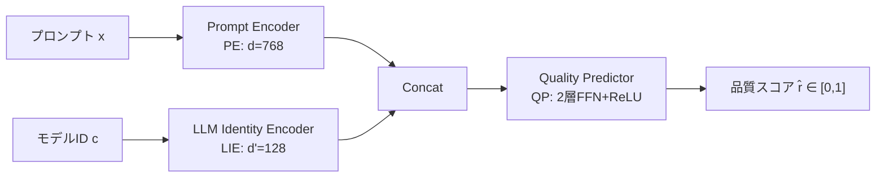

## 論文概要（Abstract）

本記事は [https://arxiv.org/abs/2509.06274](https://arxiv.org/abs/2509.06274) の解説記事です。

IPR（Intelligent Prompt Routing）は、複数のLLM候補からプロンプトごとに最適なモデルを動的に選択するルーティングフレームワークである。1.5M規模のアノテーション済みデータで訓練した品質推定器と、ユーザーが許容度パラメータ $\tau$ で品質・コストのトレードオフを制御できる仕組みを組み合わせ、著者らは最強モデル（Claude 3.5 Sonnet）と同等の品質を維持しつつ43.9%のコスト削減を達成したと報告している。凍結エンコーダとアダプタによるモジュラー設計により、新モデルの統合を2-3日から3-4時間に短縮可能である。

この記事は [Zenn記事: LLMトークンコスト削減を計測駆動で実装する：Langfuse可視化×段階的最適化の実践ガイド](https://zenn.dev/0h_n0/articles/e3f3fcdd3d5aae) の深掘りです。

## 情報源

- **arXiv ID**: 2509.06274
- **URL**: [https://arxiv.org/abs/2509.06274](https://arxiv.org/abs/2509.06274)
- **著者**: Aosong Feng, Balasubramaniam Srinivasan, Yun Zhou, et al.
- **発表年**: 2025年（2025年9月投稿、2025年10月改訂）
- **分野**: cs.LG（Machine Learning）

## 背景と動機（Background & Motivation）

LLMの商用利用が拡大するなか、高性能モデル（Claude 3.5 Sonnet等）と低コストモデル（Claude 3 Haiku等）の間には大きな価格差が存在する。論文Table 8によれば、Claude 3.5 SonnetはClaude 3 Haikuの約12倍のコストである。しかし、すべてのプロンプトが高性能モデルを必要とするわけではない。簡単な質問には低コストモデルで十分な品質が得られる場合が多い。

従来のルーティング手法には、品質推定精度の不足、ユーザーによる品質・コストバランスの明示的制御の欠如、新モデル追加時のシステム全体再訓練という課題があった。IPRはこれらに対し、大規模データによる高精度品質推定、許容度パラメータ $\tau$、モジュラーアダプタ設計で解決を図っている。

## 主要な貢献（Key Contributions）

- **品質推定器（Quality Estimator）**: 1.5M規模のアノテーション済みプロンプトで訓練した、モデルファミリー別の品質推定器を構築。Skywork-Reward-Gemma-2-27Bによる報酬モデルスコアを教師信号として使用し、人間のアノテータとの一致率85%を達成（LLM-as-Judgeの63%を上回る）
- **ユーザー制御ルーティング**: 許容度パラメータ $\tau \in [0, 1]$ により、品質重視（$\tau = 0$）からコスト重視（$\tau = 1$）まで連続的に制御可能。プロンプトごとに動的な閾値を設定する仕組みを導入
- **モジュラー設計**: 凍結エンコーダ＋軽量アダプタにより、新モデルの統合を2-3日から3-4時間に短縮。既存モデルの性能を98%以上維持
- **IPRBench**: 11のLLM候補、1.5M以上の例を含む産業規模のベンチマークデータセットを構築
- **Bounded-ARQGC指標**: 品質・コスト曲線下の面積を正規化した包括的な評価指標を提案

## 技術的詳細（Technical Details）

### 品質推定器のアーキテクチャ

品質推定器は3つのコンポーネントで構成される。



**Prompt Encoder（PE）**: Transformer系エンコーダで入力プロンプトを $d = 768$ 次元のベクトルに変換する。本番環境ではStella-400Mが採用されている（Top-1精度73%、4Bモデル比で8倍高速）。

**LLM Identity Encoder（LIE）**: 各LLM候補に対する学習可能な埋め込みベクトル（$d' = 128$ 次元）。

**Quality Predictor（QP）**: 2層のフィードフォワードネットワークで、最終出力にシグモイド関数を適用し $[0, 1]$ の品質スコアを出力する。

$$
h = \text{ReLU}(W_1 \cdot \text{Concat}(p_i, e_c) + b_1)
$$

$$
\hat{r}_{i,c} = \sigma(W_2 \cdot h + b_2)
$$

ここで、
- $p_i$: プロンプト $x_i$ の埋め込みベクトル（PE出力）
- $e_c$: モデル $c$ の識別埋め込み（LIE出力）
- $W_1, W_2, b_1, b_2$: QPの学習パラメータ
- $\sigma$: シグモイド関数

訓練の損失関数はMSE（平均二乗誤差）が採用されている。論文Table 10のアブレーションによれば、MSE（B-ARQGC: 0.7361）はListNet（0.7292）やHinge Loss（0.6897）を上回る。これは、ランキングの順序だけでなく品質スコアの絶対値（magnitude）の推定が重要であることを示している。

$$
\theta^* = \arg\min_{\theta} \sum_{i,c} \ell(\hat{R}_{\theta}(x_i, c),\ r_{i,c})
$$

ここで $r_{i,c}$ はSkywork-Reward-Gemma-2-27Bによる教師スコアである。

### ルーティングアルゴリズム

論文Algorithm 1に基づくルーティングの擬似コードを以下に示す。

```python
def ipr_route(
    prompt: str, candidates: list[str],
    prices: dict[str, float], tau: float,
    qe: QualityEstimator,
) -> str:
    """IPRルーティング: 品質閾値を満たす最安モデルを選択する"""
    p = qe.encode_prompt(prompt)  # キャッシュ可能
    scores = {c: qe.predict(p, qe.encode_model(c)) for c in candidates}
    r_max = max(scores.values())
    r_th = (1 - tau) * r_max  # 動的閾値
    feasible = {c for c, r in scores.items() if r >= r_th}
    if not feasible:
        feasible = {max(scores, key=scores.get)}  # フォールバック
    return min(feasible, key=lambda c: prices[c])
```

許容度パラメータ $\tau$ による閾値計算は以下の式で定義される。

$$
r_{i,\text{th}} = \hat{r}_{i,\text{max}} - \tau \cdot (\hat{r}_{i,\text{max}} - \hat{r}_{i,\text{min}})
$$

ここで、
- $\hat{r}_{i,\text{max}}$: プロンプト $i$ に対する全候補の最大推定品質スコア
- $\hat{r}_{i,\text{min}}$: 最小推定品質スコア（本番環境では安定性のため固定値0を使用）
- $\tau$: ユーザー指定の許容度（$\tau = 0$ で最高品質、$\tau = 1$ で最大コスト削減）

ゲーティング関数は以下で定義される。

$$
G(\hat{r}_{i,c},\ \tau) = \hat{r}_{i,c} - r_{i,\text{th}} \geq 0
$$

この条件を満たす候補集合 $C_\tau$ から、最小コストのモデルが選択される。

$$
c^*_i = \arg\min_{c \in C_\tau} v_{i,c}
$$

### モジュラーアダプタ設計

新モデル追加時には、コアのPrompt EncoderとLIEを凍結し、軽量なアダプタのみを訓練する。

- **PE Adapter**: 2層FFN＋残差接続（Prompt Encoder出力に後付け）
- **LIE Adapter**: 単層の線形変換
- **新QP Head**: モデル固有の予測ヘッド（スクラッチから訓練）

訓練データ配分は新モデル70%・既存30%で、整合性損失により既存モデルの推定を維持する。

$$
\mathcal{L} = \mathcal{L}_{\text{new}} + \lambda \sum_{i, c \in C_{\text{old}}} \|\hat{r}_{i,c} - \hat{r}_{i,c}^{\text{frozen}}\|^2
$$

ここで $\hat{r}_{i,c}^{\text{frozen}}$ は凍結モデルによる既存候補の推定スコアである。

## 実装のポイント（Implementation）

**エンコーダ選択**: Stella-400Mが本番採用されている。Qwen3-emb-4BとTop-1精度73.2% vs 75.1%でやや劣るが、推論速度8倍・メモリ1.68GBと軽量（論文Table 5）。

**ファミリー別vs統一**: 論文Table 11によれば、ドメイン内ではファミリー別がB-ARQGC 0.799（統一: 0.792）で優位、ドメイン外（MS Marco）では統一が0.553（ファミリー別: 0.523）と逆転する。

**品質ラベル**: 1.5MアノテーションはSkywork-Reward-Gemma-2-27B報酬モデルで自動生成。人間との一致率85%だが、報酬モデルのバイアスがルーティングに伝播するリスクは考慮すべきである。

**レイテンシ最適化**: PE出力はマルチターン会話でキャッシュ可能。出力トークン長に依存しない設計のため、ルーティング遅延は一定である。

## Production Deployment Guide

### AWS実装パターン（コスト最適化重視）

IPRのルーティング層をAWS上に構築する場合のトラフィック量別推奨構成を示す。なお、以下のコスト試算は2026年8月時点のAWS ap-northeast-1（東京）リージョンの公開料金に基づく概算値であり、実際のコストはトラフィックパターン、リージョン、バースト使用量により変動する。最新料金は[AWS料金計算ツール](https://calculator.aws/)で確認を推奨する。

| 構成 | トラフィック | アーキテクチャ | 月額概算 |
|------|-------------|--------------|---------|
| Small | ~100 req/日 | Lambda + Bedrock + DynamoDB | $50-150 |
| Medium | ~1,000 req/日 | ECS Fargate + Bedrock + ElastiCache | $300-800 |
| Large | 10,000+ req/日 | EKS + Spot Instances + Bedrock | $2,000-5,000 |

**Small構成**: Lambda $1未満 + Bedrock（Haikuメイン）$30-100 + DynamoDB $5-10 + CloudWatch $5-10。**Large構成**: EKS $73 + Spot推論ノード（g5.xlarge x2）$400-600 + Bedrock $1,000-3,000 + ElastiCache $100-200 + ALB/NAT $50-100。

**コスト削減テクニック**: Spot Instances（最大90%削減）、Reserved Instances（最大40%削減）、Bedrock Batch API（50%削減）、Prompt Caching（30-90%削減）。

### Terraformインフラコード

**Small構成（Serverless）**:

```hcl
# --- Small構成: Lambda + Bedrock + DynamoDB ---
terraform {
  required_version = ">= 1.9"
  required_providers {
    aws = { source = "hashicorp/aws", version = "~> 5.60" }
  }
}

provider "aws" { region = "ap-northeast-1" }

# IAMロール（最小権限: Bedrock, DynamoDB, Logs, S3のみ）
resource "aws_iam_role" "ipr_lambda" {
  name = "ipr-quality-estimator-lambda"
  assume_role_policy = jsonencode({
    Version = "2012-10-17"
    Statement = [{ Action = "sts:AssumeRole", Effect = "Allow",
      Principal = { Service = "lambda.amazonaws.com" } }]
  })
}

# Lambda関数（品質推定器 + ルーティング）
resource "aws_lambda_function" "ipr_router" {
  function_name = "ipr-prompt-router"
  runtime       = "python3.12"
  handler       = "handler.lambda_handler"
  role          = aws_iam_role.ipr_lambda.arn
  memory_size   = 512   # Stella-400Mモデル用
  timeout       = 30    # Bedrock呼び出し含む
  filename      = "lambda_package.zip"
  environment {
    variables = {
      MODEL_BUCKET   = aws_s3_bucket.ipr_models.id
      DYNAMODB_TABLE = aws_dynamodb_table.ipr_routing_log.name
      DEFAULT_TAU    = "0.3"
      FALLBACK_MODEL = "anthropic.claude-3-5-sonnet-20241022-v2:0"
    }
  }
  tracing_config { mode = "Active" }  # X-Ray有効化
}

# DynamoDB（ルーティングログ、On-Demandでコスト最適化）
resource "aws_dynamodb_table" "ipr_routing_log" {
  name         = "ipr-routing-log"
  billing_mode = "PAY_PER_REQUEST"
  hash_key     = "request_id"
  range_key    = "timestamp"
  attribute { name = "request_id"; type = "S" }
  attribute { name = "timestamp"; type = "S" }
  server_side_encryption { enabled = true }
  ttl { attribute_name = "expires_at"; enabled = true }
}

# S3（モデルアーティファクト、KMS暗号化 + パブリックアクセス遮断）
resource "aws_s3_bucket" "ipr_models" {
  bucket = "ipr-quality-estimator-models"
}

# CloudWatchアラーム（エラー率監視）
resource "aws_cloudwatch_metric_alarm" "ipr_lambda_errors" {
  alarm_name          = "ipr-router-error-rate"
  comparison_operator = "GreaterThanThreshold"
  evaluation_periods  = 2
  metric_name         = "Errors"
  namespace           = "AWS/Lambda"
  period              = 300
  statistic           = "Sum"
  threshold           = 10
  dimensions = { FunctionName = aws_lambda_function.ipr_router.function_name }
}
```

**Large構成（Container）**: `terraform-aws-modules/eks/aws ~> 20.24`でEKSクラスタ（v1.31、プライベートエンドポイント）を構築し、Karpenter NodePoolでSpot優先のGPU推論ノード（g5.xlarge/g5.2xlarge/g6.xlarge）を自動スケーリングする。`consolidationPolicy: WhenEmptyOrUnderutilized`で30秒後にスケールダウン。AWS Budgetsで月次$5,000の80%到達アラートを設定する。

### 運用・監視設定

**CloudWatch Logs Insightsクエリ例**: `stats count(), sum(estimated_cost) by bin(1h), model_selected` でモデル別コスト追跡、`pct(latency_ms, 95)` でP95レイテンシ分析。

**CloudWatch アラーム + X-Ray設定（Python）**:

```python
import boto3
from aws_xray_sdk.core import xray_recorder, patch_all

patch_all()  # boto3自動計装

cloudwatch = boto3.client("cloudwatch", region_name="ap-northeast-1")

def create_bedrock_token_alarm(
    threshold: float = 100000.0, sns_topic_arn: str = "",
) -> None:
    """Bedrockトークン使用量スパイク検知アラームを作成する"""
    cloudwatch.put_metric_alarm(
        AlarmName="ipr-bedrock-token-spike",
        ComparisonOperator="GreaterThanThreshold",
        EvaluationPeriods=2,
        MetricName="InputTokenCount",
        Namespace="AWS/Bedrock",
        Period=300, Statistic="Sum", Threshold=threshold,
        AlarmActions=[sns_topic_arn] if sns_topic_arn else [],
    )

@xray_recorder.capture("ipr_route_request")
def route_request(prompt: str, tau: float = 0.3) -> dict:
    """IPRルーティングをX-Rayトレース付きで処理する"""
    subsegment = xray_recorder.current_subsegment()
    subsegment.put_annotation("tau", tau)
    subsegment.put_annotation("prompt_length", len(prompt))
    selected_model = ipr_route(prompt, tau=tau)
    subsegment.put_metadata("selected_model", selected_model)
    return {"model": selected_model}
```

**Cost Explorer日次レポート（Python）**:

```python
import boto3
from datetime import datetime, timedelta

ce = boto3.client("ce", region_name="ap-northeast-1")
sns = boto3.client("sns", region_name="ap-northeast-1")

def daily_cost_report(sns_topic_arn: str, threshold_usd: float = 100.0) -> dict:
    """日次コストを取得し、閾値超過時にSNS通知する"""
    today = datetime.utcnow().strftime("%Y-%m-%d")
    yesterday = (datetime.utcnow() - timedelta(days=1)).strftime("%Y-%m-%d")
    result = ce.get_cost_and_usage(
        TimePeriod={"Start": yesterday, "End": today},
        Granularity="DAILY", Metrics=["UnblendedCost"],
        Filter={"Tags": {"Key": "project", "Values": ["ipr-routing"]}},
        GroupBy=[{"Type": "DIMENSION", "Key": "SERVICE"}],
    )
    costs = {g["Keys"][0]: float(g["Metrics"]["UnblendedCost"]["Amount"])
             for g in result["ResultsByTime"][0]["Groups"]}
    total = sum(costs.values())
    if total > threshold_usd:
        sns.publish(TopicArn=sns_topic_arn,
                    Subject=f"IPR日次コスト警告: ${total:.2f}",
                    Message=f"閾値${threshold_usd}超過\n{costs}")
    return costs
```

### コスト最適化チェックリスト

**アーキテクチャ**: トラフィック量で構成選択（Serverless/Hybrid/Container） / IPR $\tau$ を用途別設定（チャット: 0.3、バッチ: 0.7）

**リソース最適化**: Spot Instances優先（最大90%削減） / Reserved Instances 1年コミット（最大72%削減） / Savings Plans検討（最大66%削減） / Lambda Power Tuning（512MB推奨） / Karpenterでアイドル時スケールダウン / VPCエンドポイントでNAT Gateway削減

**LLMコスト削減**: Bedrock Batch API（50%削減） / Prompt Caching（30-90%削減） / $\tau$ チューニングで低コストモデル誘導率最適化 / max_tokens制限 / ElastiCacheでPE出力キャッシュ

**監視・アラート**: AWS Budgets（80%到達通知） / CloudWatchトークンスパイク検知 / Cost Anomaly Detection / Cost Explorer日次レポート+SNS / モデル別コスト分布可視化

**リソース管理**: Trusted Advisorで未使用リソース削除 / `project:ipr-routing`タグ付与 / S3 Glacier移行（90日後） / 開発環境夜間停止 / ECRイメージ自動削除

## 実験結果（Results）

### IPRBenchでの性能評価

著者らは包括的な評価指標としてBounded-ARQGC（Area under the Rescaled Quality-Cost Gain Curve）を提案している。この指標は許容度 $\tau$ の全範囲にわたる品質・コストのトレードオフを評価する。

$$
\text{B-ARQGC} = \int_0^1 \frac{Q(\alpha) - Q_{\min}}{Q_{\max} - Q_{\min}} d\alpha
$$

論文Table 3によれば、Claudeファミリーでの主要結果は以下の通りである。

| 手法 | B-ARQGC (Claude) | B-ARQGC (Llama) | B-ARQGC (Nova) |
|------|-------------------|------------------|-----------------|
| Oracle（上限） | 0.915 | 0.868 | 0.905 |
| Random（下限） | 0.517 | 0.496 | 0.486 |
| RouteLLM | 0.728 | 0.635 | 0.695 |
| **IPR (Qwen3-emb-4B)** | **0.821** | **0.685** | **0.766** |

IPRはRouteLLMに対してClaude: +12.8%、Llama: +7.9%、Nova: +10.2%の改善を示している。

### コスト削減率

論文Table 4によれば、100%品質維持（最強モデルとの同等性）の条件下で以下のコスト削減が達成されている。

| エンコーダ | コスト削減率 | Haiku誘導率 |
|-----------|-------------|------------|
| Stella-400M（本番採用） | 43.9% | - |
| Qwen3-0.6B | 48.7% | 59.95% |
| Qwen3-4B | 50.1% | - |

95%品質条件では、Qwen3-4BでCSR 75.4%、84.01%が低コストモデルに誘導されている。

### レイテンシ

論文Table 5より、Stella-400Mの推論レイテンシはA100-40GBで入力500トークンP90: 35.66ms、入力1000トークンP90: 64.92ms、メモリ1.68-1.76GB。LLM推論時間（数秒）と比較して無視できるオーバーヘッドである。

## 実運用への応用（Practical Applications）

IPRはAWS Bedrockのインテリジェントプロンプトルーティング機能として本番稼働中である。

関連するZenn記事で解説されているLangfuseによるコスト可視化と組み合わせ、ルーティング判断（選択モデル、推定品質スコア、$\tau$ 値）をトレースに記録し、品質とコストの推移をダッシュボードで監視する運用が考えられる。

$\tau$ の設定例: カスタマーサポート（$\tau = 0.1$-$0.3$）、バッチ要約（$\tau = 0.5$-$0.8$）、社内FAQ（$\tau = 0.3$-$0.5$）。Langfuseで品質低下が検知された場合に $\tau$ を引き下げるフィードバックループが実用的である。

ただし、品質推定器はSkywork報酬モデルで訓練されているため、ドメイン特化タスク（医療、法律等）での精度は未検証である。自社データでの検証が必要な点は制約として認識すべきである。

## 関連研究（Related Work）

- **RouteLLM** (Ong et al., 2024): 報酬モデルによる2モデル間バイナリルーティング。IPRは多モデル対応に拡張し、B-ARQGCで12.8%上回る（論文Table 3）
- **FrugalGPT** (Chen et al., 2023): カスケード方式で逐次呼び出し。IPRは単一フォワードパスでルーティングを決定するためレイテンシが小さい
- **Hybrid LLM** (Ding et al., 2024): 大小2モデル間ルーティング。IPRは11モデル候補への拡張性とアダプタ設計で差別化

## まとめと今後の展望

IPRは、大規模アノテーションデータに基づく品質推定器、ユーザー制御可能な許容度パラメータ、モジュラーアダプタ設計の3つを組み合わせ、LLMルーティングの実用的なフレームワークを提示している。著者らは43.9%のコスト削減（品質同等条件）を報告しており、AWS Bedrockへの本番デプロイ実績がある。

今後の課題として、マルチモーダル対応、長文コンテキスト（128K+トークン）での精度向上、モデル性能ドリフトへの適応が挙げられている。IPRBenchの公開（法務承認待ち）により再現性検証が期待される。報酬モデルのバイアスやドメイン外汎化性能はさらなる検証が必要である。

## 参考文献

- **arXiv**: [https://arxiv.org/abs/2509.06274](https://arxiv.org/abs/2509.06274)
- **AWS Bedrock Intelligent Prompt Routing**: [https://aws.amazon.com/bedrock/intelligent-prompt-routing/](https://aws.amazon.com/bedrock/intelligent-prompt-routing/)
- **Related Zenn article**: [https://zenn.dev/0h_n0/articles/e3f3fcdd3d5aae](https://zenn.dev/0h_n0/articles/e3f3fcdd3d5aae)
- **RouteLLM**: Ong et al., "RouteLLM: Learning to Route LLMs with Preference Data," 2024. [https://arxiv.org/abs/2406.18665](https://arxiv.org/abs/2406.18665)
- **FrugalGPT**: Chen et al., "FrugalGPT: How to Use Large Language Models While Reducing Cost and Improving Performance," 2023. [https://arxiv.org/abs/2305.05176](https://arxiv.org/abs/2305.05176)
- **Skywork-Reward**: Liu et al., "Skywork-Reward: Bag of Tricks for Reward Modeling in LLMs," 2024. [https://arxiv.org/abs/2410.18451](https://arxiv.org/abs/2410.18451)
