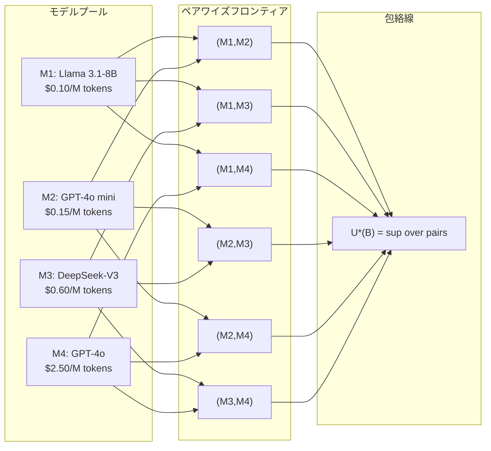

## 論文概要（Abstract）

本記事は [https://arxiv.org/abs/2605.06350](https://arxiv.org/abs/2605.06350) の解説記事です。

モデルカスケード（安価なLLMが低信頼度のクエリを高価なLLMへ委譲する方式）は、デプロイ時のコスト・品質トレードオフを制御する手段として広く用いられている。しかし従来手法では、委譲閾値 $\tau$ を経験的なハイパーパラメータとして扱っており、得られるコスト・品質フロンティアの幾何学的構造については分析が不十分であった。Bouchardは本論文で、制約付き最適化と双対性に基づく決定理論的フレームワークを構築し、2モデルカスケードにおける区分的凹性、シャドウプライスの逆数関係、$k$モデルカスケードの1次最適性条件を導出している。5つのベンチマーク、8モデル、5プロバイダでの実証により、カスケード性能の制約要因は中間ステージの不足ではなく、安価モデルの応答生成という構造的コストにあることが示されている。

この記事は [Zenn記事: LLMトークンコスト削減を計測駆動で実装する：Langfuse可視化×段階的最適化の実践ガイド](https://zenn.dev/0h_n0/articles/e3f3fcdd3d5aae) の深掘りです。

## 情報源

- **arXiv ID**: 2605.06350
- **URL**: [arXiv:2605.06350](https://arxiv.org/abs/2605.06350)
- **著者**: Dylan Bouchard
- **公開日**: 2026年5月7日
- **分野**: cs.LG (Machine Learning), cs.AI, cs.CL
- **コード**: [github.com/dylanbouchard/llm-cascade-frontiers](https://github.com/dylanbouchard/llm-cascade-frontiers)

## 背景と動機（Background & Motivation）

### コスト・品質トレードオフの根本課題

LLMのデプロイでは、最も高性能なモデルはクエリあたりのコストが高く、安価な代替モデルは品質が不足するという根本的な緊張関係がある。モデルカスケードは、安価モデルが大多数のクエリを処理し、信頼度スコア $s_L$ が閾値 $\tau$ を下回った場合にのみ高価モデルへエスカレーション（委譲）する方式で、この問題への実用的な解法として広く採用されている。

### 既存手法の限界

従来のカスケード研究には以下の限界があったとBouchardは指摘している。

1. **閾値の経験的扱い**: 委譲閾値 $\tau$ をホールドアウトデータ上のハイパーパラメータとして調整しており、得られるコスト・品質フロンティアの構造的理解がない
2. **2モデル限定の分析**: 2モデルを超えるカスケードに対する解析的な最適性条件が導出されていない
3. **モデルプール全体の特徴付けの欠如**: $k$ 個のモデルプールから $\binom{k}{2}$ 通りの2モデルカスケードを構成できるが、予算レベルに応じてどのペアを選択すべきかのフレームワークがない

Chen et al. [2023]は精度制約下でのコスト最小化を扱うが1次最適性条件を導出していない。Valkanas et al. [2025]は確率的コスト制約を導入するがフロンティアの構造を特徴付けていない。Dekoninck et al. [2025]はルーティングとカスケードを統一的に扱うが、凹性条件やシャドウプライス構造の分析はない。本論文はこれらのギャップを埋める位置にある。

## 主要な貢献（Key Contributions）

- **モデルプール上のペアワイズ包絡線**: $k$ モデルのプールから構成可能な全ての決定論的2モデル閾値カスケードのフロンティアを、$\binom{k}{2}$ 個のペアワイズフロンティアの点ごとの上限包絡線（pointwise envelope）として特徴付けた。予算レベルに応じて最適ペアが切り替わるスイッチングポイントを同定している
- **フロンティアの構造的特徴付け**: 決定境界優越条件（decision-boundary dominance）の下でのコスト・品質フロンティアの単調性と、信頼度サポートの逓減便益領域（decreasing-benefit region）における区分的凹性を証明した。双対定式化のラグランジュ乗数が逆数のシャドウプライス解釈を持つことを示している
- **$k$モデルカスケードの1次最適性条件**: 各ステージ境界において、単一のシャドウプライス $\lambda$ が限界品質対コスト比（marginal quality-per-cost）を均等化する条件を導出した。2モデルの場合を特殊ケースとして回復し、固定チェーンへの追加ステージの限界価値を診断できる
- **カスケード vs. 軽量ルーティング**: 事前生成（pre-generation）のembeddingベースルーターが、4/5データセットで最良のカスケード方針を上回ることを実証した。その優位性は信号品質ではなく、安価モデルの生成コスト $c_L$ を回避する構造的利点に主に起因することを分解分析で示している

## 技術的詳細（Technical Details）

### $k$モデルカスケードの定式化

クエリ空間 $\mathcal{X}$ 上の分布 $\mathcal{P}$ から $x \sim \mathcal{P}$ が与えられる。順序付きモデルプール $\{\mathcal{M}_1, \ldots, \mathcal{M}_k\}$ と閾値ベクトル $\boldsymbol{\tau} = (\tau_1, \ldots, \tau_{k-1})$ がカスケードを定義する。モデル $i$ はクエリ $x$ に対しコスト $C_i(x)$ で応答 $y_i(x)$ を生成し、品質 $U_i(x) := u(y_i(x), y^*(x))$ を得る。信頼度スコア $s_i(x) < \tau_i$ のとき次のステージへエスカレーションする。

停止インデックス $I(x; \boldsymbol{\tau})$ はクエリ $x$ が最終的に停止するステージであり、カスケードの出力品質と総コストは以下で定義される。

$$
U(x; \boldsymbol{\tau}) := U_{I(x;\boldsymbol{\tau})}(x), \quad C(x; \boldsymbol{\tau}) := \sum_{j=1}^{I(x;\boldsymbol{\tau})} C_j(x)
$$

ここで重要なのは、コストが**累積的**である点である。ステージ $i$ に到達したクエリは、ステージ1から $i$ までの全モデルの生成コストを支払う。これがカスケード固有の「構造的コスト」の源泉となる。

### 制約付き最適化と双対問題

実践者は以下の2つの等価な問題に直面する。

**(P1) コスト最小化**（品質制約付き）:

$$
\min_{\boldsymbol{\tau}} \; \mathbb{E}[C(x; \boldsymbol{\tau})] \quad \text{s.t.} \quad \mathbb{E}[U(x; \boldsymbol{\tau})] \geq Q
$$

**(P2) 品質最大化**（予算制約付き）:

$$
\max_{\boldsymbol{\tau}} \; \mathbb{E}[U(x; \boldsymbol{\tau})] \quad \text{s.t.} \quad \mathbb{E}[C(x; \boldsymbol{\tau})] \leq B
$$

Paretoフロンティアは、予算 $B$ の関数としての(P2)の最適値で定義される。

$$
U^{\dagger}(B) := \sup_{\boldsymbol{\tau} \in [0,1]^{k-1}} \left\{ \mathbb{E}[U(x; \boldsymbol{\tau})] : \mathbb{E}[C(x; \boldsymbol{\tau})] \leq B \right\}
$$

### 1次最適性条件（Theorem 3.1）

Bouchardは、品質の継続値 $V_{i+1}$ とコストの継続値 $W_{i+1}$ を定義した上で、ラグランジアン $\mathcal{L}(\boldsymbol{\tau}, \lambda) = \mathbb{E}[U(x;\boldsymbol{\tau})] - \lambda(\mathbb{E}[C(x;\boldsymbol{\tau})] - B)$ の停留条件として以下の1次条件を導出している。

$$
\underbrace{\mathbb{E}\left[V_{i+1}(\mathbf{s}_{1:i}; \boldsymbol{\tau}) - m_i(\mathbf{s}_{1:i}) \;\middle|\; \mathbf{s}_{<i} < \boldsymbol{\tau}_{<i},\; s_i = \tau_i\right]}_{\text{決定境界でのエスカレーション期待便益}} = \lambda \underbrace{\mathbb{E}\left[W_{i+1}(\mathbf{s}_{1:i}; \boldsymbol{\tau}) \;\middle|\; \mathbf{s}_{<i} < \boldsymbol{\tau}_{<i},\; s_i = \tau_i\right]}_{\text{決定境界での期待下流コスト}}
$$

ここで、
- $V_{i+1}(\mathbf{s}_{1:i}; \boldsymbol{\tau})$: ステージ $i$ 以降の継続品質（ステージ $i+1$ 以降で得られる期待品質）
- $m_i(\mathbf{s}_{1:i})$: ステージ $i$ での現在の条件付き期待品質
- $W_{i+1}(\mathbf{s}_{1:i}; \boldsymbol{\tau})$: ステージ $i+1$ 以降の期待追加コスト
- $\lambda$: シャドウプライス（品質1単位あたりのコスト）

この条件の経済学的解釈は明快である。**最適解において、各ステージの決定境界での限界品質対コスト比 $(V_{i+1} - m_i) / W_{i+1}$ は全ステージで一定値 $\lambda$ に等しい**。これは制約付き資源配分の標準的な最適性条件がLLMカスケードにも適用されることを示している。

### 2モデルカスケードの区分的凹性（Proposition 4.2）

2モデルの場合（$k=2$）、$\mathcal{M}_L$（安価）と $\mathcal{M}_H$（高価）のペアに特化した分析が可能になる。信頼度スコア $s_L$ の条件付き期待品質を定義する。

$$
m_L(s) := \mathbb{E}[U_L(x) \mid s_L(x) = s], \quad m_H(s) := \mathbb{E}[U_H(x) \mid s_L(x) = s]
$$

期待コストと期待品質は $\tau$ の1次元積分に帰着する。

$$
\mathbb{E}[C(x; \tau)] = c_L + \int_0^{\tau} \mathbb{E}[C_H(x) \mid s_L(x) = s] \, f_{s_L}(s) \, ds
$$

$$
\mathbb{E}[U(x; \tau)] = \int_0^{\tau} m_H(s) \, f_{s_L}(s) \, ds + \int_{\tau}^{1} m_L(s) \, f_{s_L}(s) \, ds
$$

**逓減便益領域（Decreasing-Benefit Region）**が定義の核心である。区間 $I$ がこの性質を満たすとは、全ての $s', s'' \in I$（$s' > s''$）に対して以下が成り立つことである。

$$
m_H(s') - m_L(s') \leq m_H(s'') - m_L(s'')
$$

つまり、信頼度スコアが低いクエリほどエスカレーションの便益が大きい。直感的には、安価モデルが自信のないクエリこそが高価モデルへの委譲で最も恩恵を受けるという、カスケードの基本的仮定を形式化したものである。

エスカレーションコストがスコア非依存（$\mathbb{E}[C_H(x) \mid s_L(x) = s] = c_H$）の場合、1次条件は簡潔な形に帰着する。

$$
m_H(\tau) - m_L(\tau) = \lambda \, c_H
$$

**Proposition 4.2**（区分的凹性と逆数シャドウプライス）: 逓減便益領域 $I$ 上で、Paretoフロンティア $U^{\dagger}$ は凹であり、(P1)と(P2)の最適乗数は逆数の関係にある。

$$
\lambda^*_{P1} = \frac{c_H}{m_H(\tau^*) - m_L(\tau^*)}, \quad \lambda^*_{P2} = \frac{m_H(\tau^*) - m_L(\tau^*)}{c_H} = \frac{1}{\lambda^*_{P1}}
$$

$\lambda^*_{P1}$ は品質1単位あたりの限界コストを表し、$\lambda^*_{P2}$ はコスト1単位あたりの限界品質を表す。この逆数関係は、2つの制約付き定式化が凹領域において同じ内点解を共有することを意味する。

### ペアワイズ包絡線

$k$ モデルのプールから $\binom{k}{2}$ 通りのコスト順序ペア $(i, j)$ を構成し、各ペアのParetoフロンティア $U^{\dagger,(i,j)}$ を計算する。包絡線は以下で定義される。

$$
U^*(B) := \sup_{\substack{(i,j) \in \mathcal{Q}:\\ B \in [c_i, \, c_i + c_j]}} U^{\dagger,(i,j)}(B), \quad B \in [c_1, c_k]
$$

予算 $B$ ごとに最適なペアは1つであり、最適ペアが切り替わるスイッチングポイントでは品質のシャドウプライスが不連続にジャンプする。実運用上の含意は重要である。**任意の予算レベルにおいて、実行時には単一の2モデルカスケードを選択して運用すれば十分であり、長い多段カスケードチェーンを構築する必要はない**。

### 構造的コストの概念

本論文の中心的洞察は「構造的コスト」の存在である。カスケードでは、エスカレーション判断を下す**前に**安価モデルが応答を生成する必要がある。そのため、最終的に高価モデルの応答を採用するクエリであっても、安価モデルの生成コスト $c_L$ が無駄に消費される。

$$
C_{\text{cascade}}(x) = c_L + \mathbf{1}[\text{escalate}] \cdot c_H
$$

一方、事前生成ルーティングでは、クエリの特徴量（embedding等）のみでルーティング先を決定し、選択されたモデルの生成コストのみを支払う。

$$
C_{\text{routing}}(x) = c_{\text{selected model}}
$$

この構造的コスト $c_L$ の差が、ルーティング信号の品質が劣る場合でもルーターがカスケードを上回る主因であると著者は分析している。

## 実装のポイント（Implementation）

### 信頼度スコアの選択

論文のAppendix B.1では6種類のUQ（不確実性定量化）スコアラーを比較している（論文Table 3より）。

- **Mean token negentropy（ATN@K）**: MMLU、MATH、LiveCodeBenchで最高の平均ゲインを達成。データセット間で安定的に動作するため、メインの実験で採用されている
- **LogReg ensemble**: TriviaQAで最高ゲイン（0.378）。5つのベーススコアラーを組み合わせたロジスティック回帰。キャリブレーションデータが十分にある場合に有効
- **Min token negentropy（MTN@K）**: TriviaQAでensembleに次ぐ高ゲイン。最も不確実なトークン位置に着目する

### キャリブレーションの設計

著者は50回のランダム50/50キャリブレーション・テスト分割で安定性を検証している。以下が実装上のポイントとなる。

- **非支配モデルプールの選別**: キャリブレーションデータ上で、コストと品質の両方で他モデルに劣るモデルを除外する。これにより候補ペア数を削減し、検索空間を効率化する
- **閾値グリッド解像度**: 200点のグリッドで十分な精度が得られ（最大偏差 $\leq$ 0.005, 論文Table 8より）、500点の参照値との差は無視できる
- **ペアの検証**: エスカレーション辺 $(i, j)$ は、キャリブレーションデータ上で下流モデルがコスト・精度の両方で上位の場合のみ有効とする

### 軽量ルーターの構成

論文で比較に用いた診断的ルーターは以下の構成である（論文Appendix B.10より）。

- **特徴量抽出**: all-MiniLM-L6-v2（384次元、凍結パラメータ）によるクエリembedding
- **分類器**: 各モデルに対するロジスティック回帰 $P(\text{model}_j \text{ correct} \mid \text{embedding})$
- **ルーティング**: $\arg\max_j [P_j(x) - w \cdot \bar{c}_j^{\text{cal}}]$ でモデルを選択。$w$ はスカラリゼーション重みで、コストと品質のトレードオフを制御する

## 実験結果（Results）

### ベンチマークとモデル構成

著者は5ベンチマーク、8モデル、5プロバイダで検証を行っている。論文Table 1より、単独モデルの性能範囲を以下に示す。

| データセット | 最安モデル | 精度 | コスト | 最高精度モデル | 精度 | コスト |
|-------------|----------|------|------|-------------|------|------|
| MMLU | Llama 3.1-8B | 0.554 | 12.4 | GPT-oss-20B | 0.843 | 79.9 |
| TriviaQA | Llama 3.1-8B | 0.579 | 4.4 | Llama 3.3-70B | 0.830 | 40.2 |
| MATH | Llama 3.1-8B | 0.145 | 60.1 | DeepSeek-V3 | 0.818 | 1398.7 |
| SimpleQA | Llama 3.1-8B | 0.044 | 7.0 | GPT-4o | 0.382 | 356.4 |
| LiveCodeBench | Llama 3.1-8B | 0.179 | 70.8 | DeepSeek-V3 | 0.645 | 1512.1 |

コストは「クエリあたりの平均ドル $\times 10^6$」の単位である（論文Table 5のトークン単価に基づく実測値）。

### 手法間比較

論文Table 2の結果を以下にまとめる。Gain（正規化ゲイン）は最安・最高精度モデルを結ぶランダムエスカレーションベースライン上の面積で測定、CR%は天井品質90%時のコスト削減率である。

| 手法 | MMLU Gain | MMLU CR% | TriviaQA Gain | MATH Gain | MATH CR% | SimpleQA Gain | LCB Gain | LCB CR% |
|------|-----------|----------|---------------|-----------|----------|---------------|----------|---------|
| 最高精度モデル常用 | - | 0.0 | - | - | 0.0 | - | - | 0.0 |
| Optimal pair | 0.360 | 73.7 | 0.316 | 0.393 | 79.5 | 0.158 | 0.329 | 56.1 |
| Full fixed chain | 0.259 | 59.3 | 0.249 | 0.344 | 66.7 | 0.093 | 0.277 | 41.4 |
| Optimal subsequence | 0.360 | **73.7** | 0.306 | 0.390 | 79.5 | 0.156 | 0.315 | 51.2 |
| 診断的ルーター | **0.393** | 73.7 | 0.219 | **0.394** | **81.2** | **0.193** | **0.365** | **64.9** |

著者は以下の知見を報告している。

1. **ペアワイズ包絡線 $\geq$ 多段カスケード**: Optimal pairとOptimal subsequenceのゲイン差は最大0.014で、追加ステージの実質的改善はない。5データセット全てで、ペアワイズ包絡線がfull fixed chainを上回るか同等
2. **Full fixed chainの劣位**: 全モデルを固定順序で並べる方式はペアワイズ包絡線を5データセット全てで下回る。追加の必須ステージがコスト面で不利に作用する
3. **ルーターの構造的優位**: 診断的ルーターは4/5データセットでカスケード包絡線を上回る。TriviaQAのみカスケードが優位だが、これはクエリembeddingが無情報（AUROC $\approx$ 0.49）な特殊ケースである
4. **コスト削減の実効性**: 天井品質の90%を維持した場合、ペアワイズ包絡線で最大79.5%（MATH）のコスト削減を達成。最高精度モデルの常用と比較して大幅なコスト効率化が可能である

### 構造的コストの分解分析

論文Table 10のシグナル分解は、ルーターの優位性の要因を切り分けている。同一のロジスティック回帰分類器を使い、信号源と構造（カスケード vs. ルーティング）を変えた比較を行っている。

- **UQカスケード**: ポスト生成のmean token negentropy信号 + ペアワイズ構造。AUROC 0.71-0.77
- **Embeddingカスケード**: プレ生成のembedding信号 + ペアワイズ構造。AUROC 0.49-0.73
- **診断的ルーター**: プレ生成のembedding信号 + $k$モデルルーティング構造。AUROC 0.49-0.73

Embeddingカスケードは4/5データセットでUQカスケードより弱い信号を持つにもかかわらず、同じembeddingを使うルーターは全5データセットでEmbeddingカスケードを上回る。この差は構造的である。ルーターは他モデルへルーティングされたクエリに対して安価モデルの生成コスト $c_L$ を支払わない。

## 実運用への応用（Practical Applications）

### Zenn記事のモデルルーティング判断基準との関連

関連Zenn記事「LLMトークンコスト削減を計測駆動で実装する」では、Langfuseによるコスト可視化と段階的最適化を扱っている。本論文の知見は、この実践ガイドに以下の理論的裏付けを与える。

**カスケード採用の判断基準**: 本論文の結果に基づけば、以下の場合にカスケードよりルーティングが有利となる。

- クエリの特徴量（embedding等）からタスク難易度を推定できる場合（4/5データセットで該当）
- 安価モデルの生成コスト $c_L$ が高価モデルのコスト $c_H$ に対して無視できない割合を占める場合
- 生成前の軽量な特徴量抽出（384次元のsentence embedding程度）が利用可能な場合

**カスケードが有利な場面**: TriviaQAのように、事前特徴量がタスク難易度と相関しない（AUROC $\approx$ 0.49）場合は、ポスト生成の信頼度スコアに基づくカスケードが唯一の有効手段となる。

**Langfuseとの統合**: 論文のペアワイズ包絡線の概念は、Langfuse上で複数のモデルペアのコスト・品質を可視化し、予算レベルに応じた最適ペアの選択を計測駆動で行うアプローチと相性が良い。包絡線のスイッチングポイントが、予算変更時のモデルペア切り替え判断の定量的基準を提供する。

### 制約と限界

著者は以下の制約を明示している。

- **レイテンシ非考慮**: カスケードは逐次処理のためレイテンシが増加するが、本フレームワークではコストのみを考慮している
- **モデル誤差の独立性仮定**: 実際には安価モデルと高価モデルの失敗パターンに相関がある可能性がある
- **決定論的カスケード限定**: 確率的混合方策（2つの閾値をランダムに切り替える）は凸化により改善可能だが、実用上の改善は小さいと著者は報告している
- **推論モデル・長文生成は未検証**: 評価対象は短文応答のベンチマークに限られており、長文生成やreasoning-intensiveなタスクでは中間ステージの価値が変わる可能性がある

## 関連研究（Related Work）

- **FrugalGPT** (Chen et al., 2023): コスト効率的なLLMデプロイを提案し、カスケードの実用性を実証。ただし精度制約下での経験的閾値探索にとどまり、フロンティアの構造分析はない。本論文はFrugalGPTの探索を1次条件で置き換え、最適性を保証する
- **RouteLLM** (Ong et al., 2025): 選好データから学習したルーターでクエリを振り分ける。本論文の診断的ルーターはRouteLLMの簡易版として位置づけられ、構造的優位性の分析に焦点を当てている
- **C3PO** (Valkanas et al., 2025): 確率的コスト制約付きのカスケード最適化。推論集約的なタスクに対する拡張を行うが、凹性やシャドウプライス構造は扱わない
- **Dekoninck et al. (2025)**: ルーティングとカスケードを統一的に定式化し、クエリ・出力依存の品質推定を導出。本論文はスコア条件付きの品質をモデル化し、追加ステージの限界価値を診断するという異なる角度から分析している
- **Language Model Cascades** (Gupta et al., 2024): トークンレベルのカスケードと不確実性推定を提案。本論文のフレームワークはクエリレベルの分析であり、トークンレベルへの拡張は今後の課題として挙げられている

## まとめと今後の展望

Bouchardは、LLMカスケードのコスト・品質トレードオフに対する決定理論的フレームワークを構築し、以下の結論を導いている。(1) 2モデルカスケードのParetoフロンティアは逓減便益領域で区分的凹であり、シャドウプライスが逆数の解釈を持つ。(2) $k$ モデルプールのフロンティアはペアワイズ包絡線で特徴付けられ、多段カスケードは実質的改善をもたらさない。(3) カスケード性能の主な制約要因は中間ステージの不足ではなく、安価モデルの応答生成という構造的コストにある。

今後の研究方向として、ルーティングとカスケードの統一的定式化、レイテンシ制約の組み込み、推論モデルや長文生成タスクへの拡張が挙げられている。実務的には、Langfuse等のLLMOpsツールと組み合わせたペアワイズ包絡線の自動構築が、モデル選択の意思決定を支援する有力なアプローチとなるだろう。

## 参考文献

- **arXiv**: [https://arxiv.org/abs/2605.06350](https://arxiv.org/abs/2605.06350)
- **Code**: [https://github.com/dylanbouchard/llm-cascade-frontiers](https://github.com/dylanbouchard/llm-cascade-frontiers)
- **Related Zenn article**: [https://zenn.dev/0h_n0/articles/e3f3fcdd3d5aae](https://zenn.dev/0h_n0/articles/e3f3fcdd3d5aae)
- Chen et al. (2023). FrugalGPT: How to use large language models while reducing cost and improving performance. [arXiv:2305.05176](https://arxiv.org/abs/2305.05176)
- Ong et al. (2025). RouteLLM: Learning to route LLMs with preference data. [arXiv:2406.18665](https://arxiv.org/abs/2406.18665)
- Valkanas et al. (2025). C3PO: Optimized large language model cascades with probabilistic cost constraints for reasoning. [arXiv:2511.07396](https://arxiv.org/abs/2511.07396)
- Dekoninck et al. (2025). A unified approach to routing and cascading for LLMs. [arXiv:2410.10347](https://arxiv.org/abs/2410.10347)
- Gupta et al. (2024). Language model cascades: Token-level uncertainty and beyond. [arXiv:2404.10136](https://arxiv.org/abs/2404.10136)
