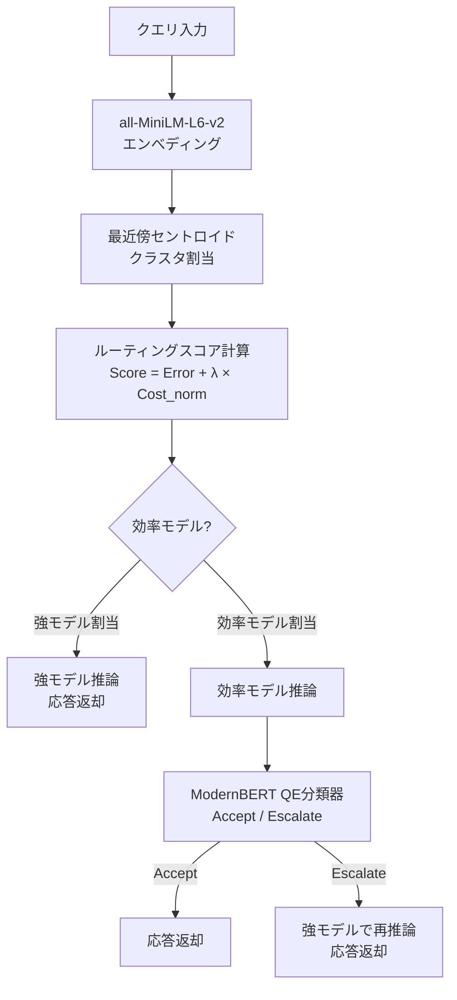

## 論文概要（Abstract）

本記事は [https://arxiv.org/abs/2606.27457](https://arxiv.org/abs/2606.27457) の解説記事です。

Moslemらは、LLMサービングの精度・コストトレードオフを解消する2段階カスケードフレームワーク**CRE（Cluster, Route, Escalate）**を提案している。Stage 1でクエリをクラスタリングしコスト効率の高いモデルを自動割当、Stage 2でModernBERTベースの品質推定分類器が応答品質を判定し、低品質出力を上位モデルにエスカレーションする。著者らは最強モデルの精度97-99%を維持しながらTPOTを最大18%削減したと報告している。

この記事は [Zenn記事: LLMトークンコスト削減を計測駆動で実装する：Langfuse可視化×段階的最適化の実践ガイド](https://zenn.dev/0h_n0/articles/e3f3fcdd3d5aae) の深掘りです。

## 情報源

- **arXiv ID**: 2606.27457
- **URL**: [https://arxiv.org/abs/2606.27457](https://arxiv.org/abs/2606.27457)
- **著者**: Yasmin Moslem, Magdalena Kacmajor, Vasudevan Nedumpozhimana, et al.
- **発表年**: 2026
- **分野**: cs.PF（パフォーマンス）, cs.CL（計算言語学）

## 背景と動機（Background & Motivation）

LLMの本番運用では、フロンティアモデルを全リクエストに使用するとTPOTが高止まりし推論コストが膨張する。軽量モデルのみでは精度不足が発生する。既存手法の課題として、**RouteLLM**（ICLR 2025）は選好データ依存でモデルペア変更に弱い、**FrugalGPT**は品質閾値の個別調整が必要、**IRT-Router**はモデルプール変更時に再設定が必要、といった点がある。

CREはこれらを克服し、**タスク正確性ラベルのみ**で訓練可能、かつPareto分析でモデルプール変更に自動適応する。

## 主要な貢献（Key Contributions）

- **2段階カスケード設計**: Stage 1（クラスタリング＋ルーティング）とStage 2（品質推定＋エスカレーション）を分離し、各段階を独立に最適化可能
- **解釈可能な$\lambda$パラメータ**: 精度・レイテンシトレードオフを単一パラメータで制御、TPOT予算$B$から自動選定
- **Pareto分析による自動適応**: 新モデル追加時に支配モデルを自動排除しルーティングテーブルを再構成
- **タスク正確性ラベルのみで訓練**: 選好データ不要。正解/不正解のバイナリラベルで全パイプラインを訓練
- **97-99%の精度維持**: AIME 0.7%以内、TeleQnA 2.1%以内（論文Table 7, 8）

## 技術的詳細（Technical Details）

### アーキテクチャ概要

CREの推論パイプラインは以下のフローで構成される。



### Stage 1: クラスタリングベースルーティング

**クラスタリング**: all-MiniLM-L6-v2でクエリをエンべディングし、k-meansでクラスタリングする。クラスタ数$N$はSilhouette係数を$[2, 10]$の範囲で最大化して選定する。

**ルーティングスコア**: 各モデル$m$とクラスタ$c$の組に対して以下のスコアを計算する。

$$
\text{Score}(m, c) = \text{Error}(m, c) + \lambda \cdot \text{Cost}_{\text{norm}}(m)
$$

ここで、
- $\text{Error}(m, c)$: モデル$m$のクラスタ$c$における訓練データ上の経験誤差率
- $\lambda \geq 0$: 精度・レイテンシトレードオフを制御するハイパーパラメータ
- $\text{Cost}_{\text{norm}}(m)$: 正規化コスト（TPOT基準）

コストの正規化は以下の式で行う。

$$
\text{Cost}_{\text{norm}}(m) = \frac{\text{TPOT}(m) - \text{TPOT}_{\min}}{\text{TPOT}_{\max} - \text{TPOT}_{\min}}
$$

$\lambda = 0$では最高精度のモデルが常に選択され、$\lambda$の増加に応じて安価なモデルが優先される。

**クロスオーバーポイント**: 2モデルの場合、割当反転点$\lambda_c = \text{Error}(m_{\text{fast}}, c) - \text{Error}(m_{\text{strong}}, c)$が閉形式で得られる。

**最適$\lambda$の選定**: TPOT予算$B$（デフォルト20ms）に基づく最適化問題を解く。

$$
\lambda^* = \arg\max_{\lambda} \{ \text{Acc}(\lambda) \mid \text{TPOT}(\lambda) \leq B \}
$$

**効率性指標**: $\eta(\lambda) = [\text{Acc}(0) - \text{Acc}(\lambda)] / [\text{TPOT}(0) - \text{TPOT}(\lambda)]$で、レイテンシ1ms削減あたりの精度コストを定量化する。

### Stage 2: 品質推定カスケード

効率モデルの出力品質をModernBERT-baseをファインチューンしたバイナリ分類器で判定する。

**入力形式**: `[query] [SEP] [model_output] [SEP] [num_output_tokens]`

**訓練ラベル**: 正解→Accept、不正解→Escalate。クラス不均衡は重み付きCrossEntropyLossで対処。

**訓練パラメータ**: AdamW（fused）、バッチサイズ64、早期停止patience 4（マクロF1基準）。AIME: lr=5e-5、TeleQnA: lr=2e-5、共に最大10エポック。

**推論オーバーヘッド**: 約0.52ms/クエリ（48.3クエリ/秒）。強モデルの出力は分類器をバイパスする。

### Pareto分析によるモデルプール管理

新モデル追加時、全クラスタにおいて別のモデルに$\text{TPOT}$と$\text{Error}$の両方で劣るモデルを「支配されたモデル」として自動排除し、Pareto効率的なモデルのみでルーティングテーブルを再構成する。著者らの拡張実験（論文Section 5.3）では、元の2モデルプールにQwen3-4B（支配→排除）とQwen3.5-35B（Pareto効率→統合）を追加し、$\lambda=0.06$で精度89.3%・TPOT 11.0msを達成したと報告している。

## 実装のポイント（Implementation）

**推論基盤**: vLLMサーバ、2×A100 SXM 80GB、最大同時接続32、シード0固定、5回独立実行平均。AIME: temp=0.6、top-p=0.95、最大40,960トークン。TeleQnA: temp=0.7、top-p=0.8、最大1,024トークン。

**注意点**: (1) 全モデルのGPUメモリ常駐が必要でVRAMがプールサイズを制限する、(2) セントロイド固定のため推論時レイテンシはほぼゼロ、(3) 分布シフトに自動追従しない（新ラベルでパイプライン再実行が必要）。

## Production Deployment Guide

### AWS実装パターン（コスト最適化重視）

CREは全モデルのGPUメモリ常駐が必要なため、推論エンドポイント設計が肝となる。

| 構成 | トラフィック | アーキテクチャ | 月額概算 |
|------|-------------|--------------|---------|
| Small | ~100 req/日 | Lambda + Bedrock（ルーティング判定） + SageMaker Serverless（QE分類器） | $80-200 |
| Medium | ~1,000 req/日 | ECS Fargate + Bedrock + SageMaker Real-time Endpoint | $400-1,000 |
| Large | 10,000+ req/日 | EKS + vLLM on Spot GPU + Karpenter自動スケーリング | $3,000-8,000 |

> **注意**: 2026年8月時点のAWS東京リージョン概算値。実際のコストはトラフィックパターンにより変動。最新料金は[AWS料金計算ツール](https://calculator.aws/)で確認。

**Small構成**: Lambda（256MB）でルーティング判定、Bedrock APIでLLM推論、SageMaker ServerlessにQE分類器をデプロイ。**Large構成**: EKS上のGPUノード（g5.xlarge以上）にvLLMをデプロイし、KarpenterでSpot優先割当。QE分類器はCPUサイドカーで動作。

**コスト削減テクニック**: Spot Instances（GPU推論、最大90%削減）、Reserved Instances（ベースライン負荷、最大72%削減）、Bedrock Batch API（非リアルタイム、50%削減）、Prompt Caching（入力コスト最大90%削減）。

### Terraformインフラコード

**Small構成（Serverless）**: Lambda + Bedrock + DynamoDB

```hcl
# CRE Router - Small構成 (Serverless)
terraform {
  required_version = ">= 1.12"
  required_providers {
    aws = { source = "hashicorp/aws", version = "~> 5.90" }
  }
}

provider "aws" { region = "ap-northeast-1" }

# IAM: Bedrock + DynamoDB + SageMaker最小権限
resource "aws_iam_role" "cre_router_lambda" {
  name = "cre-router-lambda-role"
  assume_role_policy = jsonencode({
    Version = "2012-10-17"
    Statement = [{ Action = "sts:AssumeRole", Effect = "Allow",
      Principal = { Service = "lambda.amazonaws.com" } }]
  })
}

resource "aws_iam_role_policy" "cre_router_policy" {
  name = "cre-router-policy"
  role = aws_iam_role.cre_router_lambda.id
  policy = jsonencode({
    Version = "2012-10-17"
    Statement = [
      { Effect = "Allow", Action = ["bedrock:InvokeModel"],
        Resource = "arn:aws:bedrock:ap-northeast-1::foundation-model/*" },
      { Effect = "Allow", Action = ["dynamodb:GetItem", "dynamodb:PutItem", "dynamodb:Query"],
        Resource = aws_dynamodb_table.cre_routing.arn },
      { Effect = "Allow", Action = ["sagemaker:InvokeEndpoint"], Resource = "*" },
    ]
  })
}

# DynamoDB: ルーティングテーブル（On-Demand + KMS暗号化）
resource "aws_dynamodb_table" "cre_routing" {
  name         = "cre-routing-table"
  billing_mode = "PAY_PER_REQUEST"
  hash_key     = "cluster_id"
  range_key    = "lambda_value"
  attribute { name = "cluster_id"; type = "S" }
  attribute { name = "lambda_value"; type = "N" }
  server_side_encryption { enabled = true }
}

# Lambda: CREルーティングロジック
resource "aws_lambda_function" "cre_router" {
  function_name = "cre-router"
  runtime       = "python3.13"
  handler       = "handler.route_query"
  role          = aws_iam_role.cre_router_lambda.arn
  memory_size   = 256
  timeout       = 30
  filename      = "lambda_package.zip"
  environment {
    variables = {
      ROUTING_TABLE  = aws_dynamodb_table.cre_routing.name
      LAMBDA_STAR    = "0.06"
      TPOT_BUDGET_MS = "20"
      QE_ENDPOINT    = "cre-qe-classifier"
    }
  }
  tracing_config { mode = "Active" }
}
```

**Large構成（Container）**: EKS + Karpenter + Spot Instances

```hcl
# CRE Router - Large構成 (EKS + vLLM on GPU Spot)
module "eks" {
  source          = "terraform-aws-modules/eks/aws"
  version         = "~> 20.35"
  cluster_name    = "cre-inference-cluster"
  cluster_version = "1.32"
  vpc_id          = module.vpc.vpc_id
  subnet_ids      = module.vpc.private_subnets
  cluster_endpoint_public_access = false
}

# Karpenter: Spot優先GPU自動スケーリング
resource "kubectl_manifest" "cre_gpu_nodepool" {
  yaml_body = yamlencode({
    apiVersion = "karpenter.sh/v1"
    kind       = "NodePool"
    metadata   = { name = "cre-gpu-pool" }
    spec = {
      template = { spec = {
        requirements = [
          { key = "karpenter.sh/capacity-type", operator = "In",
            values = ["spot", "on-demand"] },
          { key = "node.kubernetes.io/instance-type", operator = "In",
            values = ["g5.xlarge", "g5.2xlarge", "g6.xlarge"] },
        ]
        nodeClassRef = { name = "default" }
      }}
      limits     = { cpu = "128", "nvidia.com/gpu" = "8" }
      disruption = { consolidationPolicy = "WhenEmptyOrUnderutilized",
                     consolidateAfter = "60s" }
    }
  })
}

# AWS Budgets: 月額$5,000超過で通知
resource "aws_budgets_budget" "cre_monthly" {
  name         = "cre-monthly-budget"
  budget_type  = "COST"
  limit_amount = "5000"
  limit_unit   = "USD"
  time_unit    = "MONTHLY"
  notification {
    comparison_operator        = "GREATER_THAN"
    threshold                  = 80
    threshold_type             = "PERCENTAGE"
    notification_type          = "ACTUAL"
    subscriber_email_addresses = ["ops@example.com"]
  }
}
```

### 運用・監視設定

**CloudWatch Logs Insights クエリ**: CREルーティングのコスト異常とレイテンシを監視する。

```
# エスカレーション率の時間帯別分析
fields @timestamp, cluster_id, routed_model, escalated
| filter event = "cre_routing"
| stats count(*) as total,
        sum(case when escalated = 1 then 1 else 0 end) as escalated_count,
        avg(tpot_ms) as avg_tpot
  by bin(1h), cluster_id
| sort @timestamp desc
```

**CloudWatch アラーム + X-Ray トレーシング（Python）**:

```python
import boto3
from aws_xray_sdk.core import xray_recorder, patch_all

patch_all()  # boto3自動計装
cloudwatch = boto3.client("cloudwatch", region_name="ap-northeast-1")


def create_escalation_rate_alarm(threshold: float = 0.5) -> None:
    """エスカレーション率の急騰を検知するアラーム"""
    cloudwatch.put_metric_alarm(
        AlarmName="cre-escalation-rate-spike",
        MetricName="EscalationRate",
        Namespace="CRE/Routing",
        Statistic="Average",
        Period=300,
        EvaluationPeriods=3,
        Threshold=threshold,
        ComparisonOperator="GreaterThanThreshold",
        AlarmDescription=f"エスカレーション率が{threshold*100}%超過",
        AlarmActions=["arn:aws:sns:ap-northeast-1:123456789012:cre-alerts"],
    )


@xray_recorder.capture("cre_route_query")
def route_query(query: str, lambda_star: float) -> dict:
    """CREルーティングの全段階をX-Rayでトレース"""
    subsegment = xray_recorder.current_subsegment()
    subsegment.put_annotation("cluster_id", "C0")
    subsegment.put_metadata("lambda_star", lambda_star)
    return {"model": "efficient", "escalated": False}
```

**Cost Explorer 日次レポート（Python）**:

```python
import boto3
from datetime import date, timedelta

ce = boto3.client("ce", region_name="us-east-1")
sns = boto3.client("sns", region_name="ap-northeast-1")


def daily_cost_report() -> dict:
    """CRE関連サービスの日次コストレポート、$100/日超過でSNS通知"""
    today = date.today()
    yesterday = today - timedelta(days=1)
    response = ce.get_cost_and_usage(
        TimePeriod={"Start": str(yesterday), "End": str(today)},
        Granularity="DAILY",
        Metrics=["UnblendedCost"],
        Filter={"Tags": {"Key": "Project", "Values": ["cre-routing"]}},
        GroupBy=[{"Type": "DIMENSION", "Key": "SERVICE"}],
    )
    total = sum(
        float(g["Metrics"]["UnblendedCost"]["Amount"])
        for r in response["ResultsByTime"] for g in r["Groups"]
    )
    if total > 100:
        sns.publish(
            TopicArn="arn:aws:sns:ap-northeast-1:123456789012:cost-alert",
            Subject="CRE日次コスト超過アラート",
            Message=f"昨日のCRE関連コスト: ${total:.2f} (閾値: $100)",
        )
    return {"date": str(yesterday), "total_cost": total}
```

### コスト最適化チェックリスト

| カテゴリ | チェック項目 |
|---------|------------|
| **アーキテクチャ** | トラフィック量で構成選定（Serverless/Hybrid/Container） |
| | CREルーティングはCPU処理、Lambda/Fargateで十分 |
| **リソース** | GPU推論ノードにSpot Instances（最大90%削減） |
| | ベースライン負荷はRI 1年コミット（最大72%削減） |
| | Savings Plans（Compute/SageMaker）適用検討 |
| | Lambda Power Tuningでメモリ最適化 |
| | EKS/ECSアイドル時スケールダウン（HPA + Karpenter） |
| **LLMコスト** | Bedrock Batch API（非リアルタイム、50%削減） |
| | Prompt Caching有効化（入力コスト最大90%削減） |
| | $\lambda^*$の定期再評価 |
| | QE分類器のFalse Positive率モニタリング |
| | タスク別max_tokens設定 |
| **監視** | AWS Budgets（月額80%で通知） |
| | CloudWatchアラーム（エスカレーション率、TPOT） |
| | Cost Anomaly Detection有効化 |
| | 日次コストレポートSNS通知 |
| **リソース管理** | 未使用SageMakerエンドポイント・EBS削除 |
| | タグ統一（`Project=cre-routing`） |
| | CloudWatch Logs保持30日 |
| | 開発環境GPU夜間停止 |
| | ECRイメージ最新5世代のみ保持 |

## 実験結果（Results）

著者らは2つのベンチマークで評価を行っている。

### AIME 2024（数学推論）

訓練データ921クエリ（AIME 1983-2023）、テストデータ30クエリ（AIME 2024本番問題セット）、クラスタ数3。モデルプールはVibeThinker-1.5B（V, TPOT 9.3ms）とQwen3-30B-A3B（Q3-30B, TPOT 24.7ms）。

| 戦略 | 精度 | TPOT（ms） |
|------|------|-----------|
| Always Q3-30B | 89.1% | 11.8 |
| Stage 1のみ（$\lambda=0.06$） | 86.4% | 9.5 |
| Stage 1+2（$\lambda=0.06$） | **88.4%** | **9.7** |
| Always V | 76.7% | 4.8 |

（論文Table 7より）

Stage 1+2で最強モデルの0.7ポイント以内（88.4% vs 89.1%）を維持しつつTPOTを18%削減（11.8ms→9.7ms）。Stage 2で+2.0%の精度回復。エスカレーション数は1実行あたり平均0.6クエリと少量である。

### TeleQnA（通信ドメインQA）

訓練データ9,000クエリ、テストデータ1,000クエリ、クラスタ数2。モデルプールはQwen3-4B-Instruct（Q3-4B, TPOT 15.4ms）とGemma4-26B-it（G-26B, TPOT 26.0ms）。

| 戦略 | 精度 | TPOT（ms） |
|------|------|-----------|
| Always G-26B | 76.4% | 24.5 |
| Stage 1のみ（$\lambda=0.07$） | 71.2% | 19.1 |
| Stage 1+2（$\lambda=0.07$） | **74.3%** | **23.8** |
| Always Q3-4B | 66.9% | 15.1 |

（論文Table 8より）

最強モデルの2.1ポイント以内（74.3% vs 76.4%）を維持。Stage 2で+3.1%の精度回復。ただしエスカレーション数が平均202クエリ/実行と多く、False Discovery Rateは51%（論文Table 13）であり、本番運用でのコスト増加要因となりうる。

## 実運用への応用（Practical Applications）

Zenn記事ではRouteLLMによるバイナリルーティングとLangfuseによるコスト可視化を組み合わせた手法が解説されている。CREは以下の点でこのアプローチを拡張する可能性がある。

**クラスタベースルーティングの利点**: Zenn記事のRouteLLMはリクエスト単位で判定するが、CREはクラスタ単位でルーティングテーブルを事前構築するため、Zenn記事で指摘されている「ルーティング自体のレイテンシ」問題を解消できる。

**品質推定によるセーフティネット**: Zenn記事が推奨する「エスカレーション率の監視」に対し、CREのStage 2はQE分類器でエスカレーションを自動化する。

**Langfuseとの統合**: CREのルーティング結果をLangfuseメタデータに記録し、Zenn記事のコスト分析フレームワークにCRE固有のメトリクスを統合できる。

**制約**: 正解データ準備が必要、全モデルGPUメモリ常駐が必要でBedrock APIベースのサーバレス構成とは相性が悪い。

## 関連研究（Related Work）

- **RouteLLM**（Ong et al., ICLR 2025）: 選好データで学習したバイナリルーター。CREはタスク正確性ラベルのみで訓練可能かつ品質保証カスケードを持つ点が異なる
- **FrugalGPT**（Chen et al., 2024）: カスケード型で品質閾値に基づく早期停止。CREはクラスタリングによる事前ルーティングで不要なカスケード呼出を削減
- **UniRoute**（Jitkrittum et al., 2026）: 特徴ベクトルで動的モデルプールに対応。CREはPareto分析で同目標を達成
- **HybridLLM**（Ding et al., 2024）: コスト・品質同時最適化のバイナリルーター。CREはルーティングとエスカレーションの分離設計が特徴

## まとめと今後の展望

CREは3つの機構（クラスタリング・ルーティング・エスカレーション）を2段階に組み合わせ、最強モデルの精度97-99%を維持しながらTPOTを削減する。$\lambda$による解釈可能なトレードオフ制御とPareto分析によるモデルプール自動管理が実用的な特徴である。

今後の方向性として、大規模モデルプールへのスケーリング、多クラスカスケード判定、オンライン$\lambda$適応が挙げられている。制約として、TPOT計測が2×A100固有であり、H100では$\lambda^*$選定が変化する。

## 参考文献

- **arXiv**: [https://arxiv.org/abs/2606.27457](https://arxiv.org/abs/2606.27457)
- **Related Zenn article**: [https://zenn.dev/0h_n0/articles/e3f3fcdd3d5aae](https://zenn.dev/0h_n0/articles/e3f3fcdd3d5aae)
- Ong, I. et al. (2025). RouteLLM. ICLR 2025. [arXiv:2406.18665](https://arxiv.org/abs/2406.18665)
- Chen, L. et al. (2024). FrugalGPT.
- Ding, D. et al. (2024). HybridLLM.
- Jitkrittum, W. et al. (2026). UniRoute.
- Song, S. et al. (2025). IRT-Router.
