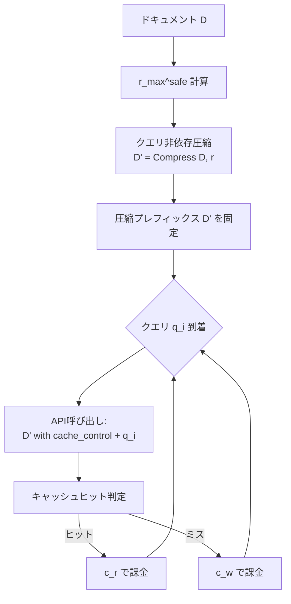

## 論文概要（Abstract）

本記事は [https://arxiv.org/abs/2607.15516](https://arxiv.org/abs/2607.15516) の解説記事です。

Cache-Aware Prompt Compression（CAPC）は、LLM APIのプロンプトキャッシュとプロンプト圧縮を統合するコスト最適化フレームワークである。著者らは、Anthropic Sonnet 4.6 APIのキャッシュが約3,500トークンを閾値とする2層アーキテクチャを持つことを経験的に発見し、この知見に基づく2層コストモデルを定式化した。LongBench-v2での評価において、CAPCは16/16の全構成で最安戦略となり、キャッシュのみと比較して平均49%、クエリ対応圧縮と比較して64%、未圧縮ベースラインと比較して90%のコスト削減を達成したと著者らは報告している。

この記事は [Zenn記事: LLMトークンコスト削減を計測駆動で実装する：Langfuse可視化×段階的最適化の実践ガイド](https://zenn.dev/0h_n0/articles/e3f3fcdd3d5aae) の深掘りです。

## 情報源

- **arXiv ID**: 2607.15516
- **URL**: [https://arxiv.org/abs/2607.15516](https://arxiv.org/abs/2607.15516)
- **著者**: Yan Song
- **発表年**: 2026
- **分野**: cs.LG（Machine Learning）, cs.AI（Artificial Intelligence）
- **ライセンス**: CC BY 4.0

## 背景と動機（Background & Motivation）

プロダクション環境でのLLMデプロイでは、コスト削減のために主に2つのプリミティブが利用される。1つはプロンプトキャッシュ（再利用されるトークンプレフィックスに割引料金を適用）、もう1つはプロンプト圧縮（送信トークン数自体を削減）である。

既存の圧縮研究はクエリ対応（query-aware）手法に標準化されており、クエリごとに異なる圧縮プレフィックスを生成する。しかしこの方式はプレフィックス厳密なキャッシュを毎回無効化するため、キャッシュと圧縮を同時に活用できないという構造的問題を抱えていた。さらに、既存の圧縮文献はキャッシュヒット率 $\rho = 1.0$（完全ヒット）を暗黙に仮定しており、実際のAPIの挙動を考慮していなかった。

著者らはSonnet 4.6 APIのキャッシュヒット率を経験的に計測し、キャッシュが理想的な $\rho = 1.0$ から乖離する条件を特定した。この実測に基づき、キャッシュと圧縮の相互作用を定量的に分析するコストモデルを構築し、両者を統合するCAPCフレームワークを提案した。

## 主要な貢献（Key Contributions）

- **2層キャッシュアーキテクチャの発見**: Sonnet 4.6のキャッシュが約3,500トークンを閾値とするhot層とpersistent層を持つことを経験的に特定し、hot層では $\rho$ が最大0.83に留まることを確認
- **プロバイダ非依存のコストモデル**: キャッシュヒット率 $\rho(N, |P|)$ を変数として扱い、キャッシュ戦略と圧縮戦略のクロスオーバー閾値を解析的に導出
- **CAPC戦略の提案**: クエリ非依存（query-agnostic）圧縮と明示的cache_control、tier-preserving ratio boundを組み合わせ、LongBench-v2の16/16構成で最安戦略を実現
- **3つのプロダクションワークロードでの検証**: 94kトークンスキーマプレフィックスのエンタープライズアシスタント（51.7%削減）、knowledge-graph RAGパイプライン（最大9.3倍改善）、tau-benchリテールベンチマーク（バニラと同等品質で最安）

## 技術的詳細（Technical Details）

### 4戦略のコストモデル

著者らは以下の4戦略を定式化している（論文Section 3より）。

**Strategy A（Vanilla / 未圧縮・キャッシュなし）**:

$$
C_A(|D|, N) = N \left[ (|D| + D_q) \cdot p_{\text{in}} + O \cdot p_{\text{out}} \right]
$$

**Strategy B（Cache-only / キャッシュのみ）**:

$$
C_B(|D|, N) = N \left[ (1 - \rho_B) \cdot |D| \cdot c_w + \rho_B \cdot |D| \cdot c_r + D_q \cdot p_{\text{in}} + O \cdot p_{\text{out}} \right]
$$

**Strategy C（Query-aware compression / クエリ対応圧縮）**:

$$
C_C(|D|, N, r) = N \left[ \left(\frac{|D|}{r} + D_q \right) \cdot p_{\text{in}} + O \cdot p_{\text{out}} \right]
$$

**Strategy D（CAPC / キャッシュ対応圧縮）**:

$$
C_D(|D|, N, r) = N \left[ (1 - \rho_D) \cdot \frac{|D|}{r} \cdot c_w + \rho_D \cdot \frac{|D|}{r} \cdot c_r + D_q \cdot p_{\text{in}} + O \cdot p_{\text{out}} \right]
$$

ここで、
- $\|D\|$: ドキュメントサイズ（トークン数）
- $r$: 圧縮率
- $N$: クエリ数（API呼び出し回数）
- $\rho$: キャッシュヒット率（$\rho(N, \|P\|)$ の関数）
- $c_w$: キャッシュ書き込みコスト（$/トークン）
- $c_r$: キャッシュ読み出しコスト（$/トークン）
- $p_{\text{in}}$: 非キャッシュ入力コスト（$/トークン）
- $p_{\text{out}}$: 出力コスト（$/トークン）
- $D_q$: クエリごとの動的ブロックサイズ
- $O$: 出力サイズ

CAPCの本質は、Strategy C がキャッシュを無効化するのに対し、Strategy D はクエリ非依存圧縮により毎回同一のプレフィックスを送信してキャッシュヒットを維持する点にある。

### クロスオーバー閾値の導出

著者らは、キャッシュのみ（B）がクエリ対応圧縮（C）に勝つ条件を以下のクロスオーバー閾値として導出している（論文Section 4より）。

$$
\rho_{\text{cross}}(r) = \frac{c_w - p_{\text{in}} / r}{c_w - c_r}
$$

無次元形式では以下の通りである。

$$
\rho_{\text{cross}}(r) = \frac{\alpha - 1/r}{\alpha - \beta}
$$

ここで $\alpha = c_w / p_{\text{in}}$（書き込みプレミアム比）、$\beta = c_r / p_{\text{in}}$（読み出しディスカウント比）である。

Sonnet 4.6の料金体系（$p_{\text{in}} = \$3.00$/MTok、$c_w = \$3.75$/MTok、$c_r = \$0.30$/MTok）では $\alpha = 1.25$、$\beta = 0.10$ となる。論文Table 3より、圧縮率 $r$ ごとのクロスオーバー閾値は以下の通りである。

| 圧縮率 $r$ | $\rho_{\text{cross}}$ | 解釈 |
|:---:|:---:|:---|
| 2 | 0.652 | $\rho > 0.65$ でキャッシュのみが有利 |
| 3 | 0.797 | $\rho > 0.80$ でキャッシュのみが有利 |
| 4 | 0.870 | $\rho > 0.87$ でキャッシュのみが有利 |
| 6 | 0.942 | hot層のプラトー（0.83）を超えるためキャッシュのみは不利 |
| 8 | 0.978 | 同上 |

この分析により、圧縮率が高い場合（$r \geq 6$）には、hot層のプラトー $\rho \approx 0.83$ ではキャッシュのみでは圧縮に勝てないことが定量的に示される。

### 2層キャッシュアーキテクチャの発見

著者らはSonnet 4.6 APIのキャッシュヒット率を系統的に計測し、2つの層を持つアーキテクチャを発見した（論文Section 2, Table 2より）。

| プレフィックスサイズ | $\rho(N{=}5)$ | $\rho(N{=}10)$ | $\rho(N{=}30)$ |
|:---:|:---:|:---:|:---:|
| 2,053 | 0.53 | 0.63 | 0.83 |
| 4,096 | 1.00 | 1.00 | 1.00 |
| 6,139 | 1.00 | 1.00 | 1.00 |
| 8,182 | 1.00 | 1.00 | 1.00 |

**Hot層**（約3,500トークン以下）ではキャッシュヒット率が $\rho \approx 0.83$ でプラトーに達し、**Persistent層**（約3,500トークン超）では最初のサブシーケント呼び出しから $\rho \approx 1.0$ を達成する。

この発見に基づき、CAPCはtier-preserving ratio boundを導入する。

$$
r_{\max}^{\text{safe}}(|D|) = \left\lfloor \frac{|D|}{T} \right\rfloor
$$

ここで $T = 3{,}500$（Sonnet 4.6の閾値）である。この制約により、圧縮後のプレフィックスがhot層に落ちることを防止する。論文の実測例（Section 6.1）では、12,191トークンのドキュメントで $r = 3$（圧縮後4,067トークン、persistent層）は $\$0.0057$/クエリであるのに対し、$r = 4$（圧縮後3,119トークン、hot層）は $\$0.0101$/クエリと77%のコスト増加を引き起こしている。

### CAPCアルゴリズム



CAPCの核心は、圧縮をリクエストパスの外（事前処理）で一度だけ実行し、全クエリで同一の圧縮プレフィックスを再利用する点にある。

```python
def capc(
    document: str,
    queries: list[str],
    ratio: float,
    tier_threshold: int = 3500,
) -> list[dict]:
    """Cache-Aware Prompt Compression

    Args:
        document: 圧縮対象のドキュメント（システムプロンプト等）
        queries: 実行するクエリのリスト
        ratio: 圧縮率（r_max^safe以下に制約）
        tier_threshold: persistent層の閾値トークン数

    Returns:
        各クエリの応答リスト
    """
    # tier-preserving ratio bound
    doc_tokens = count_tokens(document)
    r_max_safe = doc_tokens // tier_threshold
    effective_ratio = min(ratio, r_max_safe)

    # クエリ非依存圧縮（リクエストパス外で1回だけ実行）
    compressed = compress_query_agnostic(document, effective_ratio)

    results = []
    for query in queries:
        response = client.messages.create(
            model="claude-sonnet-4-6-20260714",
            messages=[{"role": "user", "content": query}],
            system=[
                {
                    "type": "text",
                    "text": compressed,
                    "cache_control": {"type": "ephemeral"},
                },
            ],
        )
        results.append(response)
    return results
```

## 実装のポイント（Implementation）

CAPCの実装で押さえるべき技術的ポイントは以下の通りである。

**tier-preserving ratio boundの遵守**: 圧縮率 $r$ を自由に大きくすると圧縮後プレフィックスがhot層（約3,500トークン以下）に落ち、キャッシュヒット率が $\rho \approx 0.83$ に低下する。$r_{\max}^{\text{safe}} = \lfloor |D| / T \rfloor$ を計算し、これを超えない圧縮率を選択する必要がある。

**明示的cache_controlの設定**: Anthropic APIでは `cache_control: {"type": "ephemeral"}` を明示的に付与することで、5分間のTTLでキャッシュが有効化される。著者らは、tools配列が暗黙的にキャッシュされる挙動を発見しており（論文Limitation 1）、明示的制御と暗黙的キャッシュの相互作用に注意が必要である。

**AdaptiveCacheBoundary**: プロンプト変化への対応として、フィンガープリントベースでミューテーション率 $\mu_p$ を計算し、$\mu_p < 0.05$ をSTATIC、$\mu_p < 0.30$ をQUASI、それ以上をDYNAMICに分類する。キャッシュプレフィックスはSTATIC/QUASIの連続区間として設定される。

**課金検証**: 3回の独立実行でAPI課金額と数式計算値が1%以内で一致（論文Section 5）。

## Production Deployment Guide

### AWS実装パターン（コスト最適化重視）

コスト試算は2026年8月時点のap-northeast-1（東京）リージョン料金に基づく概算値であり、実際のコストはトラフィックパターンにより変動する。

| 構成 | トラフィック | 主要サービス | 月額概算 |
|:---|:---:|:---|:---:|
| Small (Serverless) | ~100 req/日 | Lambda + DynamoDB + Bedrock | $50-140 |
| Medium (Hybrid) | ~1,000 req/日 | ECS Fargate + ElastiCache + Bedrock | $380-720 |
| Large (Container) | 10,000+ req/日 | EKS + Karpenter Spot + ElastiCache + Bedrock | $2,300-4,400 |

Small構成では圧縮プレフィックスをDynamoDBにキャッシュし、Lambdaの起動ごとに取得する。Large構成ではKarpenterでSpot Instances優先の自動スケーリングを行い、コンピュートコストを最大90%削減する。

**コスト削減テクニック**: Spot Instances（EC2最大90%削減）、Reserved Instances（1年コミットで最大72%削減）、Bedrock Batch API（非リアルタイム50%削減）、CAPCのPrompt Caching（入力トークン最大90%削減）。

### Terraformインフラコード

**Small構成（Serverless）**: Lambda + DynamoDB。CAPC固有の設定として `TIER_THRESHOLD` と `DEFAULT_RATIO` を環境変数で管理する。

```hcl
# --- CAPC Small: Lambda + DynamoDB (ap-northeast-1, 2026-08) ---
resource "aws_dynamodb_table" "capc_cache" {
  name = "capc-prefix-cache", billing_mode = "PAY_PER_REQUEST", hash_key = "prefix_hash"
  attribute { name = "prefix_hash", type = "S" }
  server_side_encryption { enabled = true }
  ttl { attribute_name = "expires_at", enabled = true }
}

resource "aws_lambda_function" "capc" {
  function_name = "capc-processor", runtime = "python3.12", handler = "handler.lambda_handler"
  role = aws_iam_role.capc_lambda.arn, timeout = 300, memory_size = 512
  tracing_config { mode = "Active" }  # X-Ray有効化
  environment {
    variables = {
      CACHE_TABLE    = aws_dynamodb_table.capc_cache.name
      TIER_THRESHOLD = "3500"  # Sonnet 4.6の2層閾値
      DEFAULT_RATIO  = "3"     # 推奨圧縮率
    }
  }
}
```

**Large構成（Container）**: EKS + Karpenter（Spot優先）。`consolidateAfter = "30s"` でアイドルノードを即座に回収する。

```hcl
module "eks" {
  source = "terraform-aws-modules/eks/aws", version = "~> 20.24"
  cluster_name = "capc-production", cluster_version = "1.31"
  cluster_endpoint_public_access = false
}

resource "kubectl_manifest" "karpenter_nodepool" {
  yaml_body = yamlencode({
    apiVersion = "karpenter.sh/v1", kind = "NodePool"
    spec = {
      template.spec.requirements = [
        { key = "karpenter.sh/capacity-type", operator = "In", values = ["spot","on-demand"] },
        { key = "node.kubernetes.io/instance-type", operator = "In", values = ["m6i.xlarge","m7i.xlarge"] },
      ]
      disruption = { consolidationPolicy = "WhenEmptyOrUnderutilized", consolidateAfter = "30s" }
    }
  })
}
```

### 運用・監視設定

**CloudWatch Logs Insights**（キャッシュヒット率低下検知）:

```
fields @timestamp, cache_hit, input_tokens, cache_read_tokens, cache_write_tokens
| stats count(*) as requests, avg(cache_hit)*100 as hit_rate_pct
  by bin(1h) as hour
| filter hit_rate_pct < 80
| sort hour desc
```

**CAPC専用メトリクス・トレーシング（Python）**:

```python
import boto3
from aws_xray_sdk.core import xray_recorder, patch_all

patch_all()  # boto3自動計装

def create_capc_alarms(sns_topic_arn: str) -> None:
    """キャッシュヒット率低下 + トークンスパイク検知"""
    cw = boto3.client("cloudwatch", region_name="ap-northeast-1")
    for name, metric, thresh, op in [
        ("capc-token-spike", "InputTokenCount", 500000, "GreaterThanThreshold"),
        ("capc-cache-hit-drop", "CacheHitRate", 0.80, "LessThanThreshold"),
    ]:
        cw.put_metric_alarm(AlarmName=name, MetricName=metric, Namespace="Custom/CAPC",
            Statistic="Sum" if "token" in name.lower() else "Average",
            Period=3600, EvaluationPeriods=2, Threshold=thresh,
            ComparisonOperator=op, AlarmActions=[sns_topic_arn])

@xray_recorder.capture("capc_invoke")
def invoke_with_capc(compressed_prefix: str, query: str, ratio: float) -> dict:
    """X-Rayトレース付きCAPCインvocation"""
    sub = xray_recorder.current_subsegment()
    sub.put_annotation("compression_ratio", ratio)
    sub.put_metadata("tier", "persistent" if count_tokens(compressed_prefix) > 3500 else "hot")
    response = client.messages.create(
        model="claude-sonnet-4-6-20260714",
        messages=[{"role": "user", "content": query}],
        system=[{"type": "text", "text": compressed_prefix, "cache_control": {"type": "ephemeral"}}],
    )
    sub.put_metadata("cache_hit", response.usage.cache_read_input_tokens > 0)
    return response
```

Cost Explorer日次レポートでは `Project=capc` タグでフィルタし、$100/日超過時にSNS通知を発行する。

### コスト最適化チェックリスト

**アーキテクチャ**: トラフィック量で構成選択（Serverless/Hybrid/Container）、`TIER_THRESHOLD` を環境変数で管理

**リソース最適化**: Spot Instances優先、Reserved Instances 1年コミット（最大72%削減）、Lambda Power Tuning（512MB推奨）、アイドル時スケールダウン

**LLMコスト削減**: CAPC圧縮率 $r = 3$ 推奨（論文Table 7-10）、Bedrock Batch API（50%削減）、`cache_control: ephemeral` 有効化、モデル選択ロジック（Haiku/Sonnet）

**監視・アラート**: AWS Budgets（80%閾値）、CloudWatchアラーム（ヒット率低下・トークンスパイク）、Cost Anomaly Detection、X-Rayトレーシング

**リソース管理**: DynamoDB TTL、`Project=capc` タグ戦略、CloudWatch Logs 30日保持、開発環境夜間停止

## 実験結果（Results）

### LongBench-v2での16/16支配

著者らはLongBench-v2から4つのドキュメント（12,191 / 16,319 / 21,531 / 24,576トークン）を選択し、4つの圧縮率（$r \in \{2, 3, 4, 6\}$）で計16構成を評価している（論文Table 7より）。CAPCは全16構成において最安戦略であり、平均で以下のコスト削減を達成したと報告されている。

| 比較対象 | 平均コスト削減率 | 範囲 |
|:---|:---:|:---:|
| Vanilla（未圧縮） | 89.6% | 83.6-93.8% |
| Cache-only | 48.5% | 23.8-67.4% |
| Query-aware compression | 64.4% | 41.8-76.3% |

### tau-benchリテールベンチマーク

tau-bench（50タスク、Sonnet 4.6エージェント + Haiku 4.5ユーザーシミュレータ）での結果は論文Table 10より以下の通りである。

| 戦略 | 平均コスト | リワード | 対Vanilla |
|:---|:---:|:---:|:---:|
| Vanilla | $0.1244 | 36/50 | -- |
| Cache-only | $0.1252 | 37/50 | +0.6% |
| Query-aware ($r{=}3$) | $0.1744 | 38/50 | **+40.1%** |
| CAPC ($r{=}3$) | $0.1145 | 36/50 | **-7.9%** |

CAPCのリワードはVanillaと同一（36/50、$p = 1.00$）で最安戦略であった。Query-aware compressionがVanillaより40.1%高コストとなった点は、クロスオーバーモデルが予測した負のROIの初の公開ベンチマーク上での確認であると著者らは述べている。

### エンタープライズデプロイメント

94kトークンスキーマプレフィックスのツール利用アシスタントでCAPCは51.7%のコスト削減を達成（論文Table 9）。Knowledge-graph RAGではFastAPIで9.3倍、httpxで2.4倍のコスト改善が報告されている。

## 実運用への応用（Practical Applications）

本論文の成果は、Zenn記事「[LLMトークンコスト削減を計測駆動で実装する](https://zenn.dev/0h_n0/articles/e3f3fcdd3d5aae)」で解説されているLangfuseによるコスト可視化パイプラインと直接的に連携する。

CAPCはZenn記事で扱う段階的最適化の中でも定量的な判断基準を提供する。Langfuseで取得した $\rho$ と $|D|$ をコストモデルに代入することで、最適戦略（Cache-only vs CAPC vs Query-aware）を事前に予測できる。

実運用での注意点として、以下が挙げられる。

- **TTL管理**: キャッシュTTLは5分であり、バッチ処理ではリクエストを5分以内に集約する設計が必要
- **プロバイダ依存性**: 数値結果はSonnet 4.6固有であり、他プロバイダではクロスオーバー閾値の再計算が必要
- **圧縮品質トレードオフ**: $r \geq 6$ で品質劣化が顕著になるため、$r = 3$ が推奨（論文Table 8）

## 関連研究（Related Work）

論文Table 1より、CAPCは以下の研究群と比較して位置づけられている。

- **LLMLingua** / **Cmprsr**: プロンプト圧縮の代表的手法だが、キャッシュヒット率を $\rho = 1.0$ と暗黙に仮定しており、キャッシュとの相互作用を考慮していない
- **Don't Break Cache**: キャッシュ評価に取り組んだ先行研究だが、$\rho$ を計測せず、圧縮との統合コストモデルを持たない
- **vCache / GenCache**: セマンティックキャッシュ機構であり、プレフィックス厳密なAPIキャッシュとは異なるアプローチ
- **FrugalGPT / RouteLLM**: モデルルーティングによるコスト最適化であり、$\rho$ を静的定数として扱っている

CAPCの独自性は $\rho(N, |P|)$ を経験的関数として扱い、圧縮とキャッシュの統合コストモデルを提供する点にある。

## まとめと今後の展望

CAPCはプロンプトキャッシュと圧縮を相補的手法として統合し、実測ベースの2層コストモデルに基づく最適化を実現した。LongBench-v2全構成での最安達成、tau-benchでの品質維持、3つのプロダクションワークロードでの検証は、理論と実践の両面で有効性を示している。

ただし、本研究はSonnet 4.6のキャッシュ特性に依存しており、他プロバイダへの一般化には $\alpha$, $\beta$, $T$ の再計測が必要である。LLM-as-judge品質評価（tau-benchを除く）のバイアスも今後の課題として著者らは認めている。

## 参考文献

- **arXiv**: [https://arxiv.org/abs/2607.15516](https://arxiv.org/abs/2607.15516)
- **Related Zenn article**: [https://zenn.dev/0h_n0/articles/e3f3fcdd3d5aae](https://zenn.dev/0h_n0/articles/e3f3fcdd3d5aae)
- **Anthropic Prompt Caching**: [https://docs.anthropic.com/en/docs/build-with-claude/prompt-caching](https://docs.anthropic.com/en/docs/build-with-claude/prompt-caching)
- **LLMLingua**: Jiang et al., EMNLP 2023
- **tau-bench**: Yao et al., 2024
