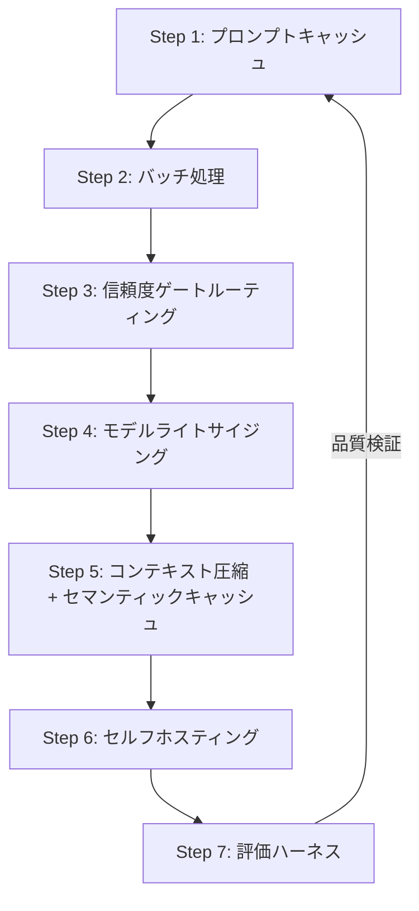

## ブログ概要（Summary）

本記事は [https://wavect.io/blog/reduce-llm-token-costs-2026/](https://wavect.io/blog/reduce-llm-token-costs-2026/) の解説記事です。

Wavect社のKevin Riedl氏が2026年6月に公開した本ブログは、LLMトークンコスト削減のための7段階の最適化戦略を体系的に整理したものである。トークン単価が下落し続ける一方で、エージェント型プロダクトが1タスクあたり50-200回のモデルコールを要することでコスト総額が膨張するという逆説的状況に対し、プロンプトキャッシュ・バッチ処理・モデルルーティング・コンテキスト圧縮・セマンティックキャッシュ・セルフホスティング・評価ハーネスの7つをROI順に積み重ねるアプローチを提示している。

この記事は [Zenn記事: LLMトークンコスト削減を計測駆動で実装する：Langfuse可視化×段階的最適化の実践ガイド](https://zenn.dev/0h_n0/articles/e3f3fcdd3d5aae) の深掘りです。

## 情報源

- **種別**: 企業テックブログ
- **URL**: [https://wavect.io/blog/reduce-llm-token-costs-2026/](https://wavect.io/blog/reduce-llm-token-costs-2026/)
- **組織**: Wavect（オーストリア拠点のソフトウェアコンサルティング企業）
- **著者**: Kevin Riedl
- **発表日**: 2026年6月15日

## 技術的背景（Technical Background）

2025年から2026年にかけて、LLMのトークン単価は劇的に低下した。しかしRiedl氏はブログにおいて、コスト総額がむしろ増大している3つの構造的要因を指摘している。

**第一に、コール回数の爆発**である。エージェント型アーキテクチャでは、1つのユーザータスクを完了するために50-200回のモデル呼び出しが発生する。単価が安くても、呼び出し回数との積でコストは急増する。

**第二に、無駄なコンテキストの混入**である。Riedl氏は、典型的なLLM APIコールにおける入力トークンの40-60%が不要であると述べている。システムプロンプト、過去の会話履歴、不要なファイルコンテンツなど、モデルの出力品質に寄与しないトークンに対しても課金が発生する。

**第三に、モデル選択の硬直化**である。すべてのリクエストをフロンティアモデルに送る「安全策」が最大の過払いパターンであると同氏は指摘している。タスクの難易度に応じたモデル選択がなされないことで、単純なタスクにも高額なモデルが使用される。

2026年時点のモデル料金体系は以下の通りである（ブログ記載値、1Mトークンあたり）。

| モデルクラス | 入力コスト | 出力コスト |
|---|---|---|
| 西側フロンティア（トップ: Claude, GPT, Gemini） | $2-3 | $10-15 |
| 西側フロンティア（ミッドティア） | ~$0.60 | ~$3 |
| 中国製オープンウェイト（Kimi, Qwen Max等） | $0.95-1.25 | $2-5 |
| 中国製バジェット/Flash（DeepSeek Flash等） | ~$0.14 | ~$0.28 |

中国製モデルは西側フロンティアの15-30倍安価である。ただしRiedl氏は、EU圏でのデータレジデンシー要件がある場合はコンプライアンス審査が必要であり、EU圏内でのセルフホスティングが現実的な選択肢になると注記している。

## 実装アーキテクチャ（Architecture）

Riedl氏は最適化を7段階の優先順位で構造化している。ROI（投資対効果）が高く、品質リスクが低いものから順に実施することが重要であり、各レバーを独立して適用するのではなく階層的に積み重ねる設計を推奨している。



### Step 1: プロンプトキャッシュ（品質リスクなし、即効性最大）

プロンプトの構造を「安定プレフィックス優先」に並び替えるだけで、キャッシュヒット率を最大化できる。システム指示や取得済みコンテキストを先頭に、ユーザー入力を末尾に配置する。

ブログが示すプロバイダ別の割引率は以下の通りである。

| プロバイダ | キャッシュヒット時の割引率 |
|---|---|
| Anthropic | ~90%（キャッシュ入力トークン） |
| OpenAI | ~50% |
| Google | ~10%（ベースレートに対して） |

Riedl氏は「多くのチームがモデル入れ替えに手を伸ばすが、最も安価な勝利はプロンプトの並べ替えでキャッシュを実際にヒットさせることだ」と述べている。

### Step 2: バッチ処理（レイテンシ非感受タスク向け）

バッチエンドポイントはライブAPIの約50%引きで利用可能であり、評価実行、ドキュメントエンリッチメント、分類、要約などのレイテンシ要件が緩いワークロードに適用される。キャッシュとバッチを組み合わせることで、キャッシュ入力を標準レートの約95%引きまで到達できるとRiedl氏は報告している。

### Step 3: 信頼度ゲートによるモデルルーティング

デフォルトで安価なモデル（ミッドティアまたは小型モデル）を使用し、以下の条件でフロンティアモデルにエスカレーションする。

- 応答の信頼度が低い場合
- スキーマバリデーションに失敗した場合
- ベリファイアがフラグを立てた場合

RouteLLMフレームワークを用いたベンチマークでは、フロンティアモデルの品質の約95%を維持しながら、リクエストの14-26%のみを高価なモデルに送ることで、ルーティング対象トラフィックで75-85%のコスト削減を達成したとされている。エスカレーション率はプロダクトKPIとして追跡すべきであり、上昇傾向は安価なモデルの能力限界を示唆する。

### Step 4: モデルライトサイジング

タスク要件に応じてモデルを選定する。最も困難な推論・コーディング・深いエージェントループにはフロンティアモデルを、定型的なタスクにはミッドティアや中国製オープンウェイトモデルを使い分ける。

### Step 5: コンテキスト圧縮 + セマンティックキャッシュ

**セマンティックキャッシュ**: リクエスト・レスポンスペアを保存し、意味的に類似したクエリにキャッシュ回答を返す。GPTCacheやRedisバックエンド実装が言及されており、高頻度反復ワークロードで約70%のコスト削減が報告されている。

**コンテキスト圧縮**: 不要なファイル・ログ・履歴を除去する。LeanCTXがツールとして言及されており、エージェントとモデル間に圧縮レイヤーを設けて入力トークンを削減する。

**KVキャッシュ圧縮**（セルフホスティング限定）: KVキャッシュのエビクションと量子化で長コンテキストのメモリ・計算コストを削減する。API利用者には適用不可。

### Step 6: セルフホスティング

vLLM + 量子化オープンウェイトモデル（Llama, Qwen, DeepSeek, Mistral系）が標準的なプロダクションスタックとして推奨されている。損益分岐点は約5000万トークン/日以上とされ、「損益分岐はGPUラック料金ではなくエンジニアの時間で決まる」と警告している。初期プロダクトではホステッドAPIをデフォルトとすべきとの方針である。

### Step 7: 評価ハーネス（全ステップの前提条件）

Riedl氏はブログ全体を通じて評価ハーネスの必要性を繰り返し強調しており、「評価ハーネスなしでは安全でない」「安価な経路が品質を暗黙に低下させることが、最もコストの高いミスである」と述べている。すべてのコスト最適化ステップは、品質閾値を維持していることを定量的に検証する仕組みと組み合わせなければならない。

## Production Deployment Guide

Wavect社のブログで提示された7段階最適化戦略をAWS上で実装するためのガイドである。

### AWS実装パターン（コスト最適化重視）

**トラフィック量別の推奨構成**:

| 項目 | Small (~100 req/日) | Medium (~1000 req/日) | Large (10000+ req/日) |
|---|---|---|---|
| 構成 | Lambda + Bedrock | ECS Fargate + Bedrock | EKS + vLLM (Spot) |
| ルーティング | Lambda内分岐 | ALB + ECS Service | Istio VirtualService |
| キャッシュ | DynamoDB | ElastiCache Redis | ElastiCache Redis Cluster |
| 監視 | CloudWatch | CloudWatch + X-Ray | Prometheus + Grafana |
| 月額概算 | $50-150 | $300-800 | $2,000-5,000 |

**コスト削減テクニック**: Spot Instances活用で最大90%削減、Reserved Instances 1年コミットで最大72%削減、Bedrock Batch APIで50%削減、Prompt Cachingで30-90%削減。

**注意**: 上記は2026年8月時点のAWS ap-northeast-1料金に基づく概算値。トラフィックパターンやリージョンにより変動するため、AWS Pricing Calculatorでの確認を推奨する。

### Terraformインフラコード

**Small構成（Serverless）: Lambda + Bedrock + DynamoDB + セマンティックキャッシュ**

```hcl
# Small構成: Lambda + Bedrock + DynamoDB (Serverless)
# コスト最適化: NAT Gateway不使用、On-Demand DynamoDB

terraform {
  required_version = ">= 1.9"
  required_providers {
    aws = { source = "hashicorp/aws", version = "~> 5.60" }
  }
}

provider "aws" { region = "ap-northeast-1" }

# --- IAM Role (最小権限) ---
resource "aws_iam_role" "llm_router_lambda" {
  name = "llm-router-lambda-role"
  assume_role_policy = jsonencode({
    Version = "2012-10-17"
    Statement = [{ Action = "sts:AssumeRole", Effect = "Allow",
      Principal = { Service = "lambda.amazonaws.com" } }]
  })
}

resource "aws_iam_role_policy" "llm_router_policy" {
  name = "llm-router-policy"
  role = aws_iam_role.llm_router_lambda.id
  policy = jsonencode({
    Version = "2012-10-17"
    Statement = [
      { Effect = "Allow",
        Action = ["bedrock:InvokeModel", "bedrock:InvokeModelWithResponseStream"],
        Resource = [
          "arn:aws:bedrock:ap-northeast-1::foundation-model/anthropic.claude-sonnet-*",
          "arn:aws:bedrock:ap-northeast-1::foundation-model/anthropic.claude-opus-*"
        ] },
      { Effect = "Allow",
        Action = ["dynamodb:GetItem", "dynamodb:PutItem", "dynamodb:Query"],
        Resource = aws_dynamodb_table.semantic_cache.arn },
      { Effect = "Allow",
        Action = ["logs:CreateLogGroup", "logs:CreateLogStream", "logs:PutLogEvents"],
        Resource = "arn:aws:logs:ap-northeast-1:*:*" }
    ]
  })
}

# --- DynamoDB: セマンティックキャッシュ ---
resource "aws_dynamodb_table" "semantic_cache" {
  name         = "llm-semantic-cache"
  billing_mode = "PAY_PER_REQUEST"
  hash_key     = "cache_key"
  attribute { name = "cache_key"; type = "S" }
  ttl { attribute_name = "expires_at"; enabled = true }
  server_side_encryption { enabled = true }
}

# --- Lambda: LLMルーター ---
resource "aws_lambda_function" "llm_router" {
  function_name = "llm-router"
  role          = aws_iam_role.llm_router_lambda.arn
  runtime       = "python3.12"
  handler       = "handler.lambda_handler"
  filename      = "lambda_package.zip"
  memory_size   = 512
  timeout       = 120
  environment {
    variables = {
      CACHE_TABLE          = aws_dynamodb_table.semantic_cache.name
      DEFAULT_MODEL_ID     = "anthropic.claude-sonnet-4-20250514"
      ESCALATION_MODEL_ID  = "anthropic.claude-opus-4-20250514"
      CONFIDENCE_THRESHOLD = "0.7"
    }
  }
  tracing_config { mode = "Active" }
}
```

**Large構成（Container）: EKS + Karpenter + vLLM (Spot優先)**

```hcl
# Large構成: EKS + Karpenter + vLLM Spot Instances

module "eks" {
  source          = "terraform-aws-modules/eks/aws"
  version         = "~> 20.24"
  cluster_name    = "llm-inference-cluster"
  cluster_version = "1.31"
  vpc_id          = module.vpc.vpc_id
  subnet_ids      = module.vpc.private_subnets
  cluster_endpoint_public_access = false
}

# --- Karpenter: GPU Spot優先オートスケーリング ---
resource "kubectl_manifest" "karpenter_nodepool" {
  yaml_body = yamlencode({
    apiVersion = "karpenter.sh/v1"
    kind       = "NodePool"
    metadata   = { name = "gpu-inference" }
    spec = {
      template = { spec = {
        requirements = [
          { key = "karpenter.sh/capacity-type", operator = "In",
            values = ["spot", "on-demand"] },
          { key = "node.kubernetes.io/instance-type", operator = "In",
            values = ["g5.xlarge", "g5.2xlarge", "g6.xlarge"] },
        ]
        nodeClassRef = { name = "default" }
      } }
      limits     = { cpu = "128", "nvidia.com/gpu" = "8" }
      disruption = { consolidationPolicy = "WhenEmptyOrUnderutilized",
                     consolidateAfter = "30s" }
    }
  })
}

# --- AWS Budgets: 月額予算アラート ---
resource "aws_budgets_budget" "llm_monthly" {
  name         = "llm-inference-monthly"
  budget_type  = "COST"
  limit_amount = "5000"
  limit_unit   = "USD"
  time_unit    = "MONTHLY"
  notification {
    comparison_operator        = "GREATER_THAN"
    threshold                  = 80
    threshold_type             = "PERCENTAGE"
    notification_type          = "ACTUAL"
    subscriber_email_addresses = ["ops-team@example.com"]
  }
}
```

### 運用・監視設定

**CloudWatch Logs Insights: コスト異常検知クエリ**

```
fields @timestamp, model_id, input_tokens, output_tokens, escalated
| stats sum(input_tokens) as total_input,
        sum(output_tokens) as total_output,
        avg(escalated) as escalation_rate,
        count(*) as call_count
  by bin(1h) as hour
| filter escalation_rate > 0.3
| sort hour desc
```

**CloudWatch アラーム + X-Ray トレーシング（Python）**

```python
import boto3
from aws_xray_sdk.core import xray_recorder, patch_all

patch_all()  # boto3自動計装
cloudwatch = boto3.client("cloudwatch", region_name="ap-northeast-1")

def create_token_usage_alarm(alarm_name: str, threshold: float) -> dict:
    """Bedrockトークン使用量スパイク検知アラームを作成する。"""
    return cloudwatch.put_metric_alarm(
        AlarmName=alarm_name, Namespace="AWS/Bedrock",
        MetricName="InputTokenCount", Statistic="Sum",
        Period=3600, EvaluationPeriods=2, Threshold=threshold,
        ComparisonOperator="GreaterThanThreshold",
        AlarmActions=["arn:aws:sns:ap-northeast-1:ACCOUNT:llm-cost-alerts"],
    )

def trace_llm_call(model_id: str, input_tokens: int, output_tokens: int) -> None:
    """LLMコールをX-Rayでトレースし、ルーティング判定を記録する。"""
    subsegment = xray_recorder.current_subsegment()
    if subsegment:
        subsegment.put_annotation("model_id", model_id)
        subsegment.put_annotation("escalated", model_id != "default")
        subsegment.put_metadata("tokens", {
            "input": input_tokens, "output": output_tokens,
        })
```

**Cost Explorer 日次レポート（Python）**

```python
import datetime
import boto3

ce = boto3.client("ce", region_name="us-east-1")
sns = boto3.client("sns", region_name="ap-northeast-1")

def daily_cost_report() -> dict:
    """直近24時間のBedrock/Lambda/EKSコストを取得し、閾値超過でSNS通知する。"""
    end = datetime.date.today()
    start = end - datetime.timedelta(days=1)
    response = ce.get_cost_and_usage(
        TimePeriod={"Start": str(start), "End": str(end)},
        Granularity="DAILY", Metrics=["UnblendedCost"],
        Filter={"Dimensions": {"Key": "SERVICE",
            "Values": ["Amazon Bedrock", "AWS Lambda",
                       "Amazon Elastic Kubernetes Service"]}},
        GroupBy=[{"Type": "DIMENSION", "Key": "SERVICE"}],
    )
    total = sum(float(g["Metrics"]["UnblendedCost"]["Amount"])
                for r in response["ResultsByTime"] for g in r["Groups"])
    if total > 100.0:
        sns.publish(
            TopicArn="arn:aws:sns:ap-northeast-1:ACCOUNT:llm-cost-alerts",
            Subject=f"LLM日次コスト警告: ${total:.2f}",
            Message=f"直近24時間のLLM関連コストが${total:.2f}。閾値$100超過。",
        )
    return {"date": str(start), "total_usd": total}
```

### コスト最適化チェックリスト

**アーキテクチャ選択**: トラフィック量で判断（~100: Serverless、~1000: Hybrid、10000+: Container）、レイテンシ要件明確化、データレジデンシー確認

**リソース最適化**:
- [ ] GPU推論: Spot優先（最大90%削減）/ 長期: RI 1年コミット（最大72%削減）
- [ ] Savings Plans検討 / Lambda Power Tuning / Karpenterスケールダウン

**LLMコスト削減**:
- [ ] Batch API（50%削減）/ Prompt Caching（30-90%削減）
- [ ] 信頼度ゲートルーティング / max_tokens制限 / セマンティックキャッシュ（~70%削減）

**監視・アラート**:
- [ ] AWS Budgets / CloudWatchアラーム / Cost Anomaly Detection
- [ ] 日次Cost Explorerレポート+SNS / エスカレーション率追跡

**リソース管理**:
- [ ] 未使用リソース棚卸し / タグ戦略 / キャッシュTTL / 開発環境夜間停止

## パフォーマンス最適化（Performance）

Riedl氏はブログにおいて、7段階の最適化を積み重ねた場合の累積効果を示している。

**各レバーの効果**:

| 最適化レバー | 削減率（ブログ記載値） | 適用条件 |
|---|---|---|
| プロンプトキャッシュ | 50-90%（入力トークン） | キャッシュヒット時 |
| バッチ処理 | ~50% | 非リアルタイムワークロード |
| キャッシュ + バッチ併用 | ~95%（入力トークン） | 上記両方適用時 |
| モデルルーティング | 75-85%（ルーティング対象） | RouteLLMフレームワーク使用時 |
| セマンティックキャッシュ | ~70% | 高頻度反復ワークロード |

Riedl氏は、月間数十万ドキュメントを処理するチームがエンドポイントとプロンプト順序の変更のみで月額請求を大幅削減した事例に言及している。ただし各削減率は異なるトークン集合に適用されるため、単純な乗算にはならない。実際の累積効果はワークロード特性に依存する。

## 運用での学び（Production Lessons）

### 評価ハーネスなしの最適化は危険

Riedl氏が最も強調しているのは、「安価な経路が品質を暗黙に低下させることが、最もコストの高いミスである」という警告である。コスト削減の各ステップは、品質閾値を定量的に検証する評価ハーネスと組み合わせなければならない。モデルルーティングのエスカレーション率、セマンティックキャッシュのヒット品質、圧縮後の出力劣化のいずれについても、継続的な品質モニタリングが必要である。

### 中国製モデルとセルフホスティングの判断

中国製オープンウェイトモデルは15-30倍安価だが、EU圏ではコンプライアンス審査が必要であり、EU圏内でのセルフホスティングが現実解となる。セルフホスティングの損益分岐点は約5000万トークン/日だが、運用体制・評価規律・アップグレードサイクルのエンジニアリングコストが継続的に発生するため、初期プロダクトではホステッドAPIをデフォルトとすべきである。

## 学術研究との関連（Academic Connection）

Riedl氏のブログで言及されている主要な技術は、いくつかの学術研究に基づいている。

**RouteLLM**は、LLMルーティングのためのフレームワークであり、コスト効率と品質のトレードオフを定量的に管理する手法を提供している。ブログではフロンティアモデル品質の約95%を維持しながら75-85%のコスト削減を達成したベンチマーク結果が引用されている。

**LLMLingua**系のコンテキスト圧縮研究は、入力プロンプトの冗長な部分を特定・除去することで、品質を維持しながらトークン数を削減する手法を提案している。ブログで言及されるLeanCTXは、この系譜に位置するエージェント向け圧縮ツールである。

**セマンティックキャッシュ**は、従来のキーベースキャッシュを埋め込みベクトルの類似度に基づくキャッシュに拡張する概念であり、GPTCacheとして実装されている。

## まとめと実践への示唆

Riedl氏は、LLMコスト削減の本質を「モデル入れ替えではなくプロンプト構造の最適化から始めよ」と要約している。品質リスクの低い施策を先に適用し段階的に進むアプローチは、関連Zenn記事の計測駆動型フレームワークとも整合する。いずれの施策も評価ハーネスによる品質検証を前提としており、コスト削減と品質維持の両立を定量的に担保する仕組みが不可欠である。

## 参考文献

- **Blog URL**: [https://wavect.io/blog/reduce-llm-token-costs-2026/](https://wavect.io/blog/reduce-llm-token-costs-2026/)
- **Related Blog - RAG vs Fine-Tuning**: [https://wavect.io/blog/rag-vs-finetune-vs-longcontext-2026/](https://wavect.io/blog/rag-vs-finetune-vs-longcontext-2026/)
- **Related Blog - Self-Hosting LLMs in EU**: [https://wavect.io/blog/self-hosting-llms-eu-cost/](https://wavect.io/blog/self-hosting-llms-eu-cost/)
- **Related Blog - LeanCTX**: [https://wavect.io/blog/lean-ctx-agency-experience/](https://wavect.io/blog/lean-ctx-agency-experience/)
- **RouteLLM**: [https://github.com/lm-sys/RouteLLM](https://github.com/lm-sys/RouteLLM)
- **GPTCache**: [https://github.com/zilliztech/GPTCache](https://github.com/zilliztech/GPTCache)
- **vLLM**: [https://github.com/vllm-project/vllm](https://github.com/vllm-project/vllm)
- **Related Zenn article**: [https://zenn.dev/0h_n0/articles/e3f3fcdd3d5aae](https://zenn.dev/0h_n0/articles/e3f3fcdd3d5aae)
