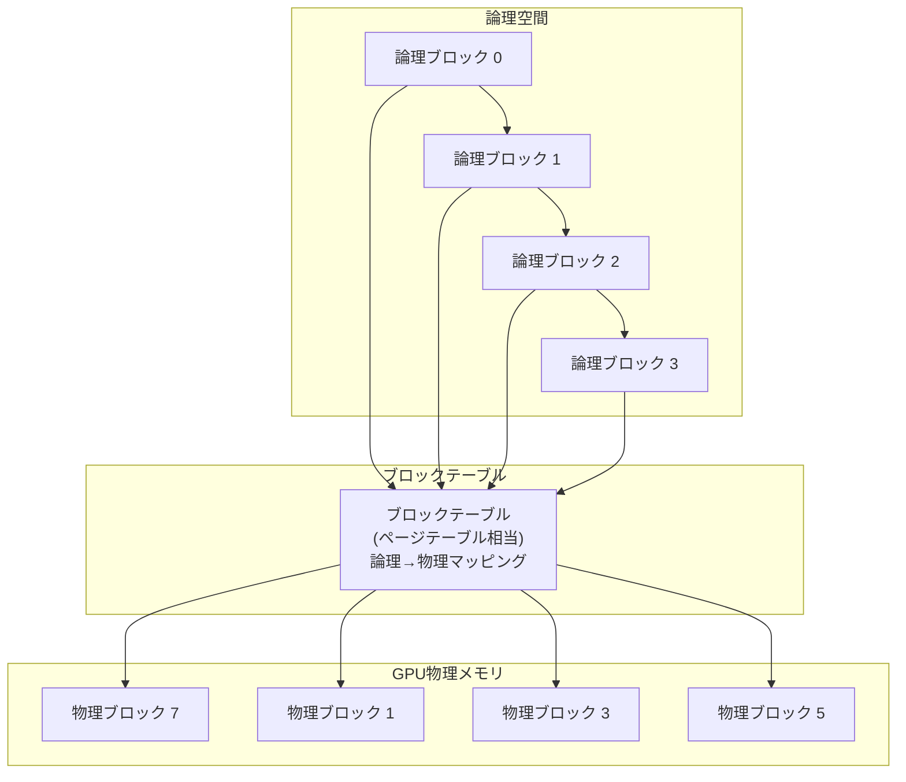

## 論文概要（Abstract）

本記事は [Efficient Memory Management for Large Language Model Serving with PagedAttention](https://arxiv.org/abs/2309.06180)（Kwon et al., SOSP 2023）の解説記事です。

LLMの高スループットサービングでは、多数のリクエストを同時にバッチ処理する必要がある。しかし、各リクエストのKVキャッシュは巨大かつ動的に増減するため、既存システムでは内部断片化・外部断片化・冗長コピーによりGPUメモリの60-80%が浪費されていた。Kwon et al.はOSの仮想メモリとページング技術に着想を得たPagedAttentionを提案し、KVキャッシュを固定サイズのブロックに分割して非連続に管理することで、メモリ浪費をほぼゼロに削減した。実装システムvLLMは、FasterTransformerやOrcaと比較して2-4倍のスループット改善を達成したと著者らは報告している。

この記事は [Zenn記事: OllamaをDocker Composeで本番運用する GPU割当・監視・認証の実践構成](https://zenn.dev/0h_n0/articles/ffeb63bfe214b6) の深掘りです。

## 情報源

- **arXiv ID**: 2309.06180
- **URL**: [arXiv:2309.06180](https://arxiv.org/abs/2309.06180)
- **著者**: Woosuk Kwon, Zhuohan Li, Siyuan Zhuang, et al.（UC Berkeley）
- **発表年**: 2023年
- **分野**: cs.LG, cs.DC
- **会議**: SOSP 2023（ACM Symposium on Operating Systems Principles）

## 背景と動機（Background & Motivation）

LLMサービングにおいて、スループット向上の鍵はバッチ処理にある。しかし、バッチ処理を阻む根本的な制約がKVキャッシュのメモリ管理である。Transformerモデルでは、自己回帰生成の各ステップで過去のキーとバリューを保持する必要があり、これがKVキャッシュとして蓄積される。

例えば、13BパラメータのLLMでは、単一シーケンスのKVキャッシュが最大1.7GBに達する。A100 GPU（40GB）上で同時処理可能なシーケンス数はわずか数十程度に制限される。さらに深刻なのは以下の3つの問題である。

1. **内部断片化**: 既存システムはシーケンスの最大長に基づいてメモリを事前確保するが、実際の生成長は予測不能であり、確保領域の大部分が未使用のまま残る
2. **外部断片化**: リクエストの到着・完了が非同期であるため、解放されたメモリ領域が分散し、連続した大きな領域を確保できなくなる
3. **冗長コピー**: parallel samplingやbeam searchでは複数の候補シーケンスが同一のプロンプト部分を共有するが、既存システムではKVキャッシュ全体を候補ごとに複製していた

著者らの測定によれば、既存システムではGPUメモリの実効利用率は20-40%程度にとどまり、残りはこれらの断片化と冗長コピーにより浪費されていた。

## 主要な貢献（Key Contributions）

- **PagedAttention**: OSの仮想メモリに着想を得た注意メカニズム。KVキャッシュを固定サイズのブロック（ページ）に分割し、非連続なGPUメモリ上に配置可能にする。これにより内部断片化をブロック内の最終ブロックのみに限定し、外部断片化を解消する
- **KVキャッシュの効率的共有**: ブロックテーブルとCopy-on-Write機構により、parallel samplingやbeam searchにおけるリクエスト内・リクエスト間のKVキャッシュ共有を実現。メモリ使用量を最大55%削減（論文Section 6.3）
- **vLLMシステムの実装と公開**: PagedAttentionを中核としたオープンソースの高スループットLLMサービングエンジン。既存システムと比較して2-4倍のスループット改善を達成

## 技術的詳細（Technical Details）

### KVキャッシュのメモリ使用量

Transformerモデル1層あたりのKVキャッシュサイズは以下の式で表される。

$$
M_{\text{KV}} = 2 \times L \times H \times P
$$

ここで、
- $M_{\text{KV}}$: 1シーケンスのKVキャッシュメモリ使用量（バイト）
- $L$: Transformerの層数（num_layers）
- $H$: 隠れ層の次元数（hidden_size）
- $P$: 数値精度のバイト数（FP16の場合は2）
- 係数2: Key と Value の2種類を保持するため

例えば、OPT-13B（$L=40$, $H=5120$, $P=2$）で最大シーケンス長2048の場合、1リクエストあたり $2 \times 40 \times 5120 \times 2 \times 2048 = 1.6\text{GB}$ のKVキャッシュが必要となる。

### PagedAttentionのアーキテクチャ

PagedAttentionは、OSの仮想メモリシステムと同様の3層構造でKVキャッシュを管理する。



1. **論理ブロック**: 各シーケンスのKVキャッシュを固定サイズ（例: 16トークン分）の論理ブロックに分割する。シーケンスの観点からは連続した番号が振られる
2. **物理ブロック**: GPU VRAM上に確保された固定サイズのメモリ領域。物理ブロックは非連続なアドレスに配置でき、必要なときにのみ割り当てられる
3. **ブロックテーブル**: 論理ブロック番号から物理ブロック番号への対応表。OSのページテーブルに相当する。各エントリは（物理ブロック番号、使用済みスロット数）を保持する

この設計により、メモリの事前確保が不要となり、シーケンスが生成されるに従って1ブロックずつオンデマンドに物理ブロックを割り当てる。内部断片化は各シーケンスの最終ブロックのみに限定され、浪費率は平均で4%未満に抑えられると著者らは報告している。

### Copy-on-Write機構

parallel samplingやbeam searchでは、共通のプロンプトから複数の出力候補を生成する。PagedAttentionは、これらの候補間でKVキャッシュを物理ブロックレベルで共有する。

具体的には、ブロックテーブルの複数エントリが同一の物理ブロックを参照し、物理ブロックごとに参照カウントを保持する。ある候補が共有ブロック内のトークンを変更する必要が生じた場合にのみ、該当ブロックをコピーして新しい物理ブロックに書き込む（Copy-on-Write）。これはLinuxカーネルのfork時のCoW機構と同一の発想である。

### メモリ割り当てアルゴリズム

以下にPagedAttentionにおけるブロック割り当ての擬似コードを示す。

```python
from dataclasses import dataclass, field


@dataclass
class PhysicalBlock:
    """GPU上の固定サイズメモリブロック

    Attributes:
        block_id: 物理ブロックの一意な識別子
        ref_count: このブロックを参照しているシーケンス数
        block_size: ブロックあたりのトークン数
    """

    block_id: int
    ref_count: int = 0
    block_size: int = 16


@dataclass
class BlockTable:
    """論理→物理ブロックのマッピングテーブル

    OSのページテーブルに相当する構造体。
    各シーケンスに1つ割り当てられる。

    Attributes:
        entries: (物理ブロックID, 使用済みスロット数)のリスト
    """

    entries: list[tuple[int, int]] = field(default_factory=list)


class BlockAllocator:
    """物理ブロックプール管理

    GPUメモリ上の物理ブロックの割り当て・解放を管理する。
    フリーリスト方式で未使用ブロックを追跡する。

    Args:
        num_blocks: GPU上の物理ブロック総数
        block_size: ブロックあたりのトークン数
    """

    def __init__(self, num_blocks: int, block_size: int = 16) -> None:
        self.block_size = block_size
        self.free_blocks: list[PhysicalBlock] = [
            PhysicalBlock(block_id=i, block_size=block_size)
            for i in range(num_blocks)
        ]

    def allocate(self) -> PhysicalBlock:
        """フリーリストから物理ブロックを1つ割り当てる

        Returns:
            割り当てられた物理ブロック

        Raises:
            RuntimeError: 空きブロックが存在しない場合
        """
        if not self.free_blocks:
            raise RuntimeError("Out of GPU memory blocks")
        block = self.free_blocks.pop()
        block.ref_count = 1
        return block

    def free(self, block: PhysicalBlock) -> None:
        """物理ブロックの参照カウントを減算し、0になったら解放

        Copy-on-Write対応のため、ref_countが0になるまで
        実際の解放は遅延される。

        Args:
            block: 解放対象の物理ブロック
        """
        block.ref_count -= 1
        if block.ref_count == 0:
            self.free_blocks.append(block)

    def copy_on_write(self, block: PhysicalBlock) -> PhysicalBlock:
        """共有ブロックのCoWコピーを作成

        参照カウント > 1 のブロックに書き込みが必要な場合に呼ばれる。
        新規ブロックを割り当て、元ブロックの参照カウントを減算する。

        Args:
            block: コピー元の共有ブロック

        Returns:
            新規に割り当てられた物理ブロック（コピー先）
        """
        new_block = self.allocate()
        block.ref_count -= 1
        # GPU上でブロック内容のコピーを実行（カーネル呼び出し）
        return new_block
```

## 実装のポイント（Implementation）

vLLMの実装において、著者らが報告している主要な設計判断と注意点を以下に整理する。

**ブロックサイズの選択**: ブロックサイズは内部断片化とカーネル効率のトレードオフである。小さいブロックサイズ（例: 1トークン）は断片化をゼロにするが、ブロックテーブルのオーバーヘッドが増大する。論文ではブロックサイズ16が採用されており、これにより平均浪費率4%未満を維持しつつカーネル効率を確保している。

**スケジューリング戦略**: vLLMはリクエストレベルのスケジューリングを採用する。GPUメモリが不足した場合、FCFS（先着順）で後着のリクエストをプリエンプトする。プリエンプトされたリクエストのKVキャッシュはCPUメモリにスワップアウトされ、メモリが空いた時点でスワップインされる。この戦略はOSのスワッピングと同一である。

**カスタムCUDAカーネル**: PagedAttentionの非連続メモリアクセスパターンに対応するため、専用のCUDAカーネルが実装されている。このカーネルはブロックテーブルを参照して物理ブロックのアドレスを解決し、標準的なAttention計算を実行する。著者らは、このカーネルのオーバーヘッドが通常のAttention計算と比較して無視できるレベルであると報告している。

**分散実行**: vLLMはMegatron-LMスタイルのテンソル並列をサポートする。各GPUワーカーは同一のブロックテーブルを共有し、KVキャッシュの対応するヘッド分割を個別に管理する。中央スケジューラが全ワーカーに統一的なスケジューリング指示を送信することで、一貫性を保つ。

## Production Deployment Guide

PagedAttentionを実装したvLLMは広く本番環境で採用されているオープンソースプロジェクトである。以下にAWS上でvLLMベースの推論サービスをデプロイするための構成を示す。

### AWS実装パターン（コスト最適化重視）

**トラフィック量別の推奨構成**:

| 構成 | トラフィック | AWSサービス | 月額概算 |
|------|-------------|-------------|----------|
| Small | ~100 req/日 | Lambda + Bedrock (on-demand) + DynamoDB | $50-150 |
| Medium | ~1,000 req/日 | ECS Fargate + vLLM + ALB + ElastiCache | $500-1,200 |
| Large | 10,000+ req/日 | EKS + Karpenter + Spot GPU Instances + vLLM | $3,000-8,000 |

**Small構成**: 推論自体はBedrock（マネージドLLM API）に委託し、Lambda関数でリクエストのオーケストレーションを行う。KVキャッシュ管理はBedrock側が担当するため、PagedAttentionの恩恵は間接的に受ける。DynamoDBでリクエストログと会話履歴を管理する。月額コストの内訳は、Bedrock API（入出力トークン課金）$30-100、Lambda $5-10、DynamoDB $5-15、CloudWatch $10-25程度である。

**Medium構成**: ECS Fargate上でvLLMコンテナを実行する。GPUインスタンス（g5.xlarge: A10G 24GB）を使用し、PagedAttentionによるKVキャッシュ最適化の恩恵を直接受ける。ALBでリクエストを分散し、ElastiCacheでプロンプトキャッシュを補完する。Fargate GPU $350-700、ALB $20-30、ElastiCache $50-100、EBS/S3 $30-50が内訳となる。

**Large構成**: EKS上でKarpenterによる自動スケーリングを行い、Spot GPU Instances（g5.xlarge/g5.2xlarge）を活用してコストを削減する。vLLMの分散推論機能（テンソル並列）を使い、複数GPUにまたがるモデル配置が可能となる。Spot Instancesにより最大70-90%のコスト削減が期待できる。EKSコントロールプレーン $74、Spot GPU Instances $1,500-4,000、ALB $30-50、CloudWatch/X-Ray $50-100が内訳となる。

**コスト試算の注意事項**: 上記はAWS ap-northeast-1（東京）リージョンの2026年8月時点の概算値である。実際のコストはトラフィックパターン、バースト量、モデルサイズにより変動する。最新料金はAWS Pricing Calculatorでの確認を推奨する。

### Terraformインフラコード

**Small構成（Serverless: Lambda + Bedrock + DynamoDB）**:

```python
# terraform/small/main.tf（HCL形式の構造をPythonコメントで解説）
# 以下はTerraform HCLコード

"""
Serverless構成のTerraformコード概要

- VPC: パブリックサブネットのみ（NAT Gateway不使用でコスト削減）
- IAM: 最小権限原則に基づくLambda実行ロール
- Lambda: Bedrock API呼び出し関数（Python 3.12, 512MB, 60秒タイムアウト）
- DynamoDB: On-Demandモード（リクエストログ・会話履歴）
- CloudWatch: コストアラーム（月額$200超過で通知）
"""
```

```hcl
# --- Small構成: Lambda + Bedrock + DynamoDB ---

# VPC基盤（NAT Gateway不使用でコスト削減）
resource "aws_vpc" "main" {
  cidr_block           = "10.0.0.0/16"
  enable_dns_hostnames = true
  tags = { Name = "llm-inference-vpc", Environment = "production" }
}

resource "aws_subnet" "public" {
  count             = 2
  vpc_id            = aws_vpc.main.id
  cidr_block        = cidrsubnet(aws_vpc.main.cidr_block, 8, count.index)
  availability_zone = data.aws_availability_zones.available.names[count.index]
  tags = { Name = "llm-inference-public-${count.index}" }
}

# IAMロール（最小権限）
resource "aws_iam_role" "lambda_exec" {
  name = "llm-inference-lambda"
  assume_role_policy = jsonencode({
    Version = "2012-10-17"
    Statement = [{ Action = "sts:AssumeRole", Effect = "Allow",
      Principal = { Service = "lambda.amazonaws.com" } }]
  })
}

resource "aws_iam_role_policy" "lambda_bedrock" {
  name = "bedrock-invoke"
  role = aws_iam_role.lambda_exec.id
  policy = jsonencode({
    Version = "2012-10-17"
    Statement = [
      { Effect = "Allow", Action = ["bedrock:InvokeModel"], Resource = "*" },
      { Effect = "Allow", Action = ["dynamodb:PutItem", "dynamodb:GetItem", "dynamodb:Query"],
        Resource = aws_dynamodb_table.requests.arn },
      { Effect = "Allow", Action = ["logs:CreateLogGroup", "logs:CreateLogStream", "logs:PutLogEvents"],
        Resource = "arn:aws:logs:*:*:*" }
    ]
  })
}

# Lambda関数
resource "aws_lambda_function" "inference" {
  function_name = "llm-inference"
  runtime       = "python3.12"
  handler       = "handler.lambda_handler"
  memory_size   = 512
  timeout       = 60
  role          = aws_iam_role.lambda_exec.arn
  filename      = "lambda.zip"
  environment {
    variables = {
      MODEL_ID       = "anthropic.claude-3-haiku-20240307-v1:0"
      DYNAMODB_TABLE = aws_dynamodb_table.requests.name
    }
  }
}

# DynamoDB（On-Demand、KMS暗号化）
resource "aws_dynamodb_table" "requests" {
  name         = "llm-inference-requests"
  billing_mode = "PAY_PER_REQUEST"
  hash_key     = "request_id"
  range_key    = "created_at"
  attribute { name = "request_id" type = "S" }
  attribute { name = "created_at" type = "S" }
  server_side_encryption { enabled = true }
  point_in_time_recovery { enabled = true }
}

# CloudWatchアラーム（コスト監視）
resource "aws_cloudwatch_metric_alarm" "cost_alert" {
  alarm_name          = "llm-monthly-cost-alert"
  comparison_operator = "GreaterThanThreshold"
  evaluation_periods  = 1
  metric_name         = "EstimatedCharges"
  namespace           = "AWS/Billing"
  period              = 86400
  statistic           = "Maximum"
  threshold           = 200
  alarm_actions       = [aws_sns_topic.alerts.arn]
}
```

**Large構成（Container: EKS + Karpenter + Spot）**:

```hcl
# --- Large構成: EKS + Karpenter + Spot GPU Instances ---

module "eks" {
  source          = "terraform-aws-modules/eks/aws"
  version         = "~> 20.0"
  cluster_name    = "llm-inference-cluster"
  cluster_version = "1.30"
  vpc_id          = aws_vpc.main.id
  subnet_ids      = aws_subnet.private[*].id

  # Karpenter用のIAMロール自動設定
  enable_cluster_creator_admin_permissions = true
}

# Karpenter Provisioner（Spot優先、GPU自動スケーリング）
resource "kubectl_manifest" "karpenter_nodepool" {
  yaml_body = yamlencode({
    apiVersion = "karpenter.sh/v1"
    kind       = "NodePool"
    metadata   = { name = "gpu-spot" }
    spec = {
      template = {
        spec = {
          requirements = [
            { key = "karpenter.sh/capacity-type", operator = "In",
              values = ["spot", "on-demand"] },  # Spot優先
            { key = "node.kubernetes.io/instance-type", operator = "In",
              values = ["g5.xlarge", "g5.2xlarge", "g5.4xlarge"] },
            { key = "kubernetes.io/arch", operator = "In", values = ["amd64"] }
          ]
          nodeClassRef = { name = "gpu-default" }
        }
      }
      limits   = { cpu = "128", memory = "512Gi", "nvidia.com/gpu" = "16" }
      disruption = {
        consolidationPolicy = "WhenEmptyOrUnderutilized"
        consolidateAfter    = "60s"
      }
    }
  })
}

# Secrets Manager（vLLM設定）
resource "aws_secretsmanager_secret" "vllm_config" {
  name                    = "llm-inference/vllm-config"
  recovery_window_in_days = 7
}

# AWS Budgets（予算アラート）
resource "aws_budgets_budget" "monthly" {
  name         = "llm-inference-monthly"
  budget_type  = "COST"
  limit_amount = "8000"
  limit_unit   = "USD"
  time_unit    = "MONTHLY"
  notification {
    comparison_operator       = "GREATER_THAN"
    threshold                 = 80
    threshold_type            = "PERCENTAGE"
    notification_type         = "ACTUAL"
    subscriber_email_addresses = ["ops-team@example.com"]
  }
}
```

### 運用・監視設定

**CloudWatch Logs Insightsクエリ（vLLMメトリクス分析）**:

```
# vLLMのKVキャッシュ使用率とスループットを1時間単位で集計
fields @timestamp, @message
| filter @message like /gpu_cache_usage/
| stats avg(gpu_cache_usage_perc) as avg_cache_usage,
        max(gpu_cache_usage_perc) as peak_cache_usage,
        avg(generation_throughput) as avg_throughput_tps
  by bin(1h)
| sort @timestamp desc
```

```
# P95/P99レイテンシ分析
fields @timestamp, latency_ms
| filter @message like /request_completed/
| stats percentile(latency_ms, 95) as p95,
        percentile(latency_ms, 99) as p99,
        avg(latency_ms) as avg_latency
  by bin(5m)
```

**CloudWatchアラーム設定（Python boto3）**:

```python
import boto3


def create_vllm_alarms(instance_id: str, sns_topic_arn: str) -> list[str]:
    """vLLM推論サーバー用のCloudWatchアラームを作成

    Args:
        instance_id: 監視対象のEC2/ECSインスタンスID
        sns_topic_arn: アラート通知先のSNSトピックARN

    Returns:
        作成されたアラーム名のリスト
    """
    client = boto3.client("cloudwatch")
    alarms_created: list[str] = []

    # GPU KVキャッシュ使用率アラーム
    client.put_metric_alarm(
        AlarmName=f"vllm-kv-cache-high-{instance_id}",
        MetricName="GPUCacheUsagePercent",
        Namespace="vLLM/Inference",
        Statistic="Average",
        Period=300,
        EvaluationPeriods=3,
        Threshold=90.0,
        ComparisonOperator="GreaterThanThreshold",
        AlarmActions=[sns_topic_arn],
    )
    alarms_created.append(f"vllm-kv-cache-high-{instance_id}")

    # リクエストレイテンシP99アラーム
    client.put_metric_alarm(
        AlarmName=f"vllm-latency-p99-{instance_id}",
        MetricName="RequestLatencyP99",
        Namespace="vLLM/Inference",
        Statistic="Maximum",
        Period=300,
        EvaluationPeriods=2,
        Threshold=5000.0,
        ComparisonOperator="GreaterThanThreshold",
        AlarmActions=[sns_topic_arn],
    )
    alarms_created.append(f"vllm-latency-p99-{instance_id}")

    return alarms_created
```

**X-Rayトレーシング設定**:

```python
from aws_xray_sdk.core import xray_recorder, patch_all


def setup_xray_tracing(service_name: str = "vllm-inference") -> None:
    """AWS X-Rayトレーシングを初期化

    boto3/requests等のライブラリを自動計装し、
    LLM推論リクエストのトレースを記録する。

    Args:
        service_name: X-Rayサービスマップでの表示名
    """
    xray_recorder.configure(service=service_name)
    patch_all()  # boto3, requests等を自動計装


def trace_inference_request(
    model_name: str,
    input_tokens: int,
    output_tokens: int,
    latency_ms: float,
) -> None:
    """推論リクエストのトレースにアノテーションとメタデータを追加

    Args:
        model_name: 使用モデル名（例: "meta-llama/Llama-2-13b"）
        input_tokens: 入力トークン数
        output_tokens: 出力トークン数
        latency_ms: 推論レイテンシ（ミリ秒）
    """
    segment = xray_recorder.current_segment()
    segment.put_annotation("model", model_name)
    segment.put_annotation("total_tokens", input_tokens + output_tokens)
    segment.put_metadata("inference_detail", {
        "input_tokens": input_tokens,
        "output_tokens": output_tokens,
        "latency_ms": latency_ms,
        "tokens_per_second": output_tokens / (latency_ms / 1000),
    })
```

**Cost Explorer自動レポート**:

```python
import boto3
from datetime import datetime, timedelta


def get_daily_inference_cost(days: int = 7) -> list[dict[str, float]]:
    """直近N日間のLLM推論関連コストを日次で取得

    Bedrock、EC2（GPU）、EKSのコストを抽出し、
    日次レポートとして返す。$100/日超過でアラート対象。

    Args:
        days: 取得する日数（デフォルト7日）

    Returns:
        日次コストレポートのリスト
    """
    client = boto3.client("ce")
    end = datetime.utcnow().strftime("%Y-%m-%d")
    start = (datetime.utcnow() - timedelta(days=days)).strftime("%Y-%m-%d")

    response = client.get_cost_and_usage(
        TimePeriod={"Start": start, "End": end},
        Granularity="DAILY",
        Metrics=["UnblendedCost"],
        Filter={
            "Or": [
                {"Dimensions": {"Key": "SERVICE", "Values": ["Amazon Bedrock"]}},
                {"Dimensions": {"Key": "SERVICE", "Values": ["Amazon Elastic Compute Cloud - Compute"]}},
                {"Dimensions": {"Key": "SERVICE", "Values": ["Amazon Elastic Kubernetes Service"]}},
            ]
        },
    )

    daily_costs: list[dict[str, float]] = []
    for result in response["ResultsByTime"]:
        cost = float(result["Total"]["UnblendedCost"]["Amount"])
        daily_costs.append({"date": result["TimePeriod"]["Start"], "cost_usd": cost})
    return daily_costs
```

### コスト最適化チェックリスト

**アーキテクチャ選択**:
- [ ] トラフィック ~100 req/日 → Serverless（Lambda + Bedrock）を選択
- [ ] トラフィック ~1,000 req/日 → Hybrid（ECS Fargate + vLLM）を選択
- [ ] トラフィック 10,000+ req/日 → Container（EKS + Karpenter + Spot）を選択

**リソース最適化**:
- [ ] EC2/EKS: Spot Instances優先（g5ファミリーで最大70-90%削減）
- [ ] Reserved Instances: 安定ワークロードに1年コミット（最大72%削減）
- [ ] Savings Plans: Compute Savings Plansで柔軟なコミットメント
- [ ] Lambda: メモリサイズ最適化（Power Tuningで計測）
- [ ] ECS/EKS: KVキャッシュ使用率に基づくスケールダウン（アイドル時GPU停止）
- [ ] vLLMブロックサイズ: モデルとワークロードに応じた最適値選択

**LLMコスト削減**:
- [ ] Bedrock Batch API: 非リアルタイム処理で50%削減
- [ ] Prompt Caching: 共通プレフィックスの再利用で30-90%削減
- [ ] モデル選択ロジック: タスク難易度に応じたモデルルーティング
- [ ] トークン数制限: max_tokensの適切な設定
- [ ] PagedAttention活用: vLLMのKVキャッシュ効率化でバッチサイズ拡大

**監視・アラート**:
- [ ] AWS Budgets: 月額予算アラート設定（80%/100%閾値）
- [ ] CloudWatch: KVキャッシュ使用率・レイテンシP99アラーム
- [ ] Cost Anomaly Detection: 異常コスト検知の有効化
- [ ] 日次コストレポート: SNS通知による自動レポート配信
- [ ] GPU利用率モニタリング: NVIDIA DCGM Exporterの導入

**リソース管理**:
- [ ] 未使用リソース削除: 不要なEBSボリューム・スナップショットの定期削除
- [ ] タグ戦略: `Environment`/`Project`/`CostCenter`タグの必須化
- [ ] ライフサイクルポリシー: S3/ECRのオブジェクト有効期限設定
- [ ] 開発環境夜間停止: 非本番GPU Instancesの自動停止スケジュール
- [ ] モデルキャッシュ: S3からのモデル重みダウンロードを最小化（EBSスナップショット活用）

## 実験結果（Results）

著者らはOPT-13B、OPT-175B、LLaMA-13Bの3モデルを対象に、ShareGPTおよびAlpacaデータセットを用いた評価を行っている。

| システム | モデル | データセット | 正規化スループット |
|---------|--------|-------------|------------------|
| FasterTransformer | OPT-13B | ShareGPT | 1.0x（ベースライン） |
| Orca | OPT-13B | ShareGPT | ~1.7x |
| vLLM | OPT-13B | ShareGPT | **2.2x** |
| FasterTransformer | OPT-13B | Alpaca | 1.0x（ベースライン） |
| vLLM | OPT-13B | Alpaca | **3.5x** |

（論文Figure 12, 13より再構成。正規化スループットはFasterTransformerを1.0xとした相対値）

著者らは、改善の主因はメモリ効率化によるバッチサイズの拡大であると説明している。PagedAttentionによりKVキャッシュのメモリ浪費が削減されることで、同一GPU上でより多くのリクエストを同時処理可能になる。特にShareGPTデータセットでは出力長の分散が大きく、従来システムの事前確保方式では最大長に合わせた過剰な確保が発生するため、PagedAttentionの効果が顕著に現れている。

parallel samplingの評価では、beam幅を変えた実験で、beamあたりのメモリ使用量がvLLMではほぼ一定であるのに対し、ベースラインシステムでは線形に増加することが示されている（論文Figure 15）。beam幅6のケースで、vLLMはベースライン比で最大55%のメモリ削減を達成している。

## 実運用への応用（Practical Applications）

関連Zenn記事「OllamaをDocker Composeで本番運用する」では、Docker Compose上でOllamaを運用する構成を解説している。OllamaのバックエンドにはGo + llama.cppが使われているが、PagedAttentionの設計思想は直接的に関連する。

1. **GPU割り当ての最適化**: Zenn記事ではDocker Composeの`deploy.resources.reservations.devices`でGPU割り当てを設定しているが、vLLMのPagedAttentionを採用することで、同一GPUメモリ上でより多くの同時リクエストを処理可能になる。Ollamaのデフォルト設定ではKVキャッシュの事前確保が行われるため、同時接続数に制限が生じやすい
2. **監視指標の追加**: Zenn記事で設定しているPrometheus監視に、KVキャッシュ使用率（`gpu_cache_usage_perc`）を追加することで、メモリ効率のボトルネックを可視化できる。vLLMはこのメトリクスを標準で公開している
3. **バッチ処理の導入**: Docker Compose環境であっても、Nginxリバースプロキシの背後でvLLMを動作させることで、continuous batchingとPagedAttentionの恩恵を受けられる。これは既存のNginx認証設定と組み合わせ可能である

ただし、vLLMへの移行にはCUDAカーネルのビルド環境が必要であり、Ollamaの手軽さとのトレードオフが存在する点は考慮が必要である。

## 関連研究（Related Work）

- **Orca**（Yu et al., OSDI 2022）: iteration-levelスケジューリングを提案し、バッチ内の各リクエストを独立にスケジュール可能にした。vLLMはOrcaのcontinuous batchingを前提としつつ、KVキャッシュのメモリ管理で改善を加えている
- **FasterTransformer**（NVIDIA）: 高度に最適化されたTransformer推論ライブラリ。しかし、KVキャッシュの静的メモリ確保方式を採用しており、メモリ効率ではvLLMに劣る
- **FlashAttention**（Dao et al., NeurIPS 2022）: Attentionのメモリアクセスパターンを最適化し、IO効率を改善する手法。PagedAttentionとは直交する最適化であり、組み合わせて使用可能である。vLLMの実装ではFlashAttentionのカーネルを基盤として活用している

## まとめと今後の展望

Kwon et al.のPagedAttentionは、LLM推論におけるKVキャッシュのメモリ管理をOS仮想メモリの設計パターンで解決するという明快なアプローチである。vLLMは2023年の公開以降、多くのプロダクション環境で採用され、LLMサービングのデファクトスタンダードの一つとなっている。

今後の方向性としては、マルチGPU環境でのKVキャッシュ共有（disaggregated prefill-decode構成）、モデル圧縮（量子化）との組み合わせ、さらにはGPU以外のアクセラレータ（TPU、AWS Inferentia）への拡張が進んでいる。Docker Compose上のOllama運用からスケールアウトを検討する際には、vLLMのPagedAttentionが提供するメモリ効率化が有力な選択肢となる。

## 参考文献

- **arXiv**: [https://arxiv.org/abs/2309.06180](https://arxiv.org/abs/2309.06180)
- **Code**: [https://github.com/vllm-project/vllm](https://github.com/vllm-project/vllm)
- **Related Zenn article**: [https://zenn.dev/0h_n0/articles/ffeb63bfe214b6](https://zenn.dev/0h_n0/articles/ffeb63bfe214b6)
- **Orca**: [https://arxiv.org/abs/2206.01906](https://arxiv.org/abs/2206.01906)
- **FlashAttention**: [https://arxiv.org/abs/2205.14135](https://arxiv.org/abs/2205.14135)
